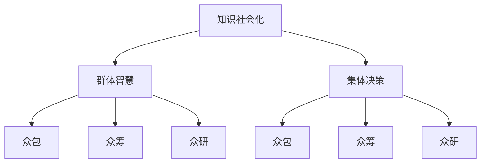

                 

## 1. 背景介绍

### 1.1 问题由来

在现代社会中，知识的获取和应用已经成为推动科技进步和社会发展的重要驱动力。然而，知识的生产和传播仍然面临许多挑战，如信息的碎片化、知识的孤立性、知识传播的不平衡等。这些问题限制了知识的社会化，即知识的广泛传播和应用，影响了社会的创新力和整体的智慧水平。

随着互联网和大数据技术的发展，人们开始探索如何通过集体智慧和集体决策机制来促进知识的传播和应用。群体智慧和集体决策机制是指通过众包、众筹、众研等方式，将不同个体和组织汇聚起来，共同进行知识创造、传播和应用的过程。这些机制利用众人的力量，通过协作和共享，形成一种比单个人或小团队更高效、更创新的知识社会化模式。

### 1.2 问题核心关键点

群体智慧和集体决策机制的核心关键点包括：

- **知识社会化**：知识的广泛传播和应用。
- **群体智慧**：利用集体的力量进行知识创造和创新。
- **集体决策**：通过集体讨论和决策，形成知识应用的有效策略。

这些问题关键点共同构成了群体智慧和集体决策机制的研究框架，通过研究这些关键点，我们可以更好地理解和应用这一机制，推动知识的广泛传播和应用。

## 2. 核心概念与联系

### 2.1 核心概念概述

为了更好地理解群体智慧和集体决策机制，我们首先介绍几个核心概念：

- **知识社会化**：指知识的传播和应用过程，通过集体智慧和决策，将知识广泛应用到各个领域，促进社会创新和进步。
- **群体智慧**：指通过集体的力量和协作，利用每个人的智慧和经验，进行知识创造和创新的过程。
- **集体决策**：指通过集体讨论和投票等方式，形成集体决策的过程，确保决策的公正性和有效性。
- **众包**：指将任务分配给多个个体或组织，通过集体的力量完成任务的过程。
- **众筹**：指通过网络平台，汇聚个体或组织的资金，共同支持某个项目或创新。
- **众研**：指通过网络平台，汇聚个体或组织的研究资源，共同进行科学研究和技术开发。

这些核心概念之间的关系可以通过以下Mermaid流程图来展示：



这个流程图展示了大语言模型微调的核心概念及其之间的关系：

1. 知识社会化通过群体智慧和集体决策机制，实现知识的广泛传播和应用。
2. 群体智慧利用集体的力量，进行知识创造和创新。
3. 集体决策通过集体讨论和投票等方式，形成有效的决策过程。
4. 众包、众筹和众研是实现群体智慧和集体决策的主要手段。

这些核心概念共同构成了知识社会化的实现框架，通过理解和应用这些概念，我们可以更好地推动知识的传播和应用。

## 3. 核心算法原理 & 具体操作步骤

### 3.1 算法原理概述

群体智慧和集体决策机制的核心算法原理是基于分布式计算和协同过滤技术的。具体而言，它利用众包、众筹和众研等方式，将任务分配给多个个体或组织，通过集体的力量进行协同工作，形成知识创造和创新的成果。

在具体实施过程中，首先定义一个共同的目标，如某项技术研究、产品开发或社会问题的解决，然后将任务分解成多个子任务，分配给不同的个体或组织。每个个体或组织根据自己的能力和资源，完成分配给自己的子任务，并将结果汇总形成最终的成果。

### 3.2 算法步骤详解

群体智慧和集体决策机制的实现步骤主要包括以下几个方面：

**Step 1: 目标定义**
- 明确共同的目标，如某个技术问题的解决、某项社会问题的改善等。

**Step 2: 任务分解**
- 将目标分解成多个子任务，并明确每个子任务的具体要求和完成标准。

**Step 3: 任务分配**
- 根据个体或组织的能力和资源，将任务分配给不同的个体或组织，并设定相应的截止日期。

**Step 4: 协同工作**
- 每个个体或组织根据自己的能力和资源，完成分配给自己的子任务。
- 通过网络平台，各组织和个人进行信息共享和协同工作，形成集体的智慧和力量。

**Step 5: 结果汇总**
- 各组织和个人将完成的任务结果汇总，形成最终的成果。
- 对成果进行评估和审核，确保其质量和有效性。

**Step 6: 成果应用**
- 将最终的成果应用到实际场景中，解决实际问题，形成知识社会化的实践。

### 3.3 算法优缺点

群体智慧和集体决策机制具有以下优点：

1. **高效性**：通过集体的力量，可以高效地完成单个个体或小团队难以完成的任务。
2. **创新性**：集体智慧的多样性和广泛性，可以激发更多的创新思维，形成更加创新的成果。
3. **广泛性**：利用众包、众筹和众研等方式，可以广泛汇聚个体的智慧和资源，形成更加广泛的知识社会化模式。

同时，该机制也存在一些局限性：

1. **协调难度**：由于个体和组织的多样性和异质性，协调和沟通的难度较大。
2. **质量控制**：每个个体或组织完成的子任务质量参差不齐，需要严格的审核和评估机制。
3. **隐私问题**：在数据共享和协作过程中，可能存在隐私泄露和知识产权侵权的风险。

尽管存在这些局限性，但群体智慧和集体决策机制在实际应用中仍然展现出了强大的生命力和潜力，成为知识社会化的重要手段。

### 3.4 算法应用领域

群体智慧和集体决策机制已经在多个领域得到了广泛的应用，具体包括：

- **技术创新**：通过众包和众研等方式，进行技术研发和创新，推动科技进步。
- **产品开发**：通过众包和众筹等方式，进行产品设计和开发，提升产品质量和创新性。
- **社会问题解决**：通过众筹和众研等方式，解决社会问题，如环境保护、公共卫生等。
- **文化创意**：通过众包和众筹等方式，进行文化创意和艺术创作，推动文化创新和交流。
- **教育培训**：通过众研和在线教育平台，进行知识和技能的传播和培训，提升教育质量和学习效果。

除了上述这些经典应用外，群体智慧和集体决策机制还被创新性地应用于更多场景中，如开放科学、社会治理、环境保护等，为各个领域带来了新的突破和变革。

## 4. 数学模型和公式 & 详细讲解 & 举例说明

### 4.1 数学模型构建

为了更好地理解群体智慧和集体决策机制的算法原理，我们引入一个简单的数学模型进行说明。

设有一个群体，其中每个个体具有不同的能力和资源，群体需要完成一个共同的任务 $T$。每个个体 $i$ 完成子任务 $T_i$ 所需的时间为 $t_i$，完成任务的精度为 $p_i$。设任务 $T$ 的完成时间为 $T$，完成精度为 $P$。群体智慧和集体决策机制的目标是最大化任务完成时间和精度的乘积，即：

$$
\max T \times P = \max \left( \sum_{i=1}^n \frac{t_i}{p_i} \right) \times P
$$

其中 $n$ 为群体中个体的数量。

### 4.2 公式推导过程

为了推导上述优化目标，我们引入拉格朗日乘子法，将目标函数和约束条件转化为一个拉格朗日函数：

$$
\mathcal{L}(t_i,p_i,\lambda) = \sum_{i=1}^n \frac{t_i}{p_i} + \lambda (P - \sum_{i=1}^n p_i)
$$

其中 $\lambda$ 为拉格朗日乘子，$P - \sum_{i=1}^n p_i$ 为约束条件。

对拉格朗日函数求偏导，得到：

$$
\frac{\partial \mathcal{L}}{\partial t_i} = \frac{1}{p_i^2}, \quad \frac{\partial \mathcal{L}}{\partial p_i} = -\frac{t_i}{p_i^3} + \lambda
$$

令偏导数为零，解得：

$$
t_i = \frac{p_i^3}{\lambda}, \quad p_i = \frac{1}{n}P
$$

将 $p_i$ 的值代入 $t_i$ 的表达式中，得到：

$$
t_i = \frac{P^3}{n^3\lambda}
$$

因此，最优的 $t_i$ 和 $p_i$ 为：

$$
t_i = \frac{P^3}{n^3\lambda}, \quad p_i = \frac{1}{n}P
$$

这意味着，为了最大化任务完成时间和精度的乘积，个体 $i$ 的完成时间和精度应该按照上述公式进行分配。

### 4.3 案例分析与讲解

为了更好地理解群体智慧和集体决策机制的实际应用，我们以一个具体的案例进行分析：

假设有一个项目，需要开发一款新的移动应用，时间紧迫，预算有限。项目团队决定利用众包和众筹的方式，将任务分解成多个子任务，通过网络平台招募开发者和测试人员，利用集体的力量进行开发和测试。

项目团队将任务分解成以下几个子任务：

- 用户界面设计
- 后端开发
- 前端开发
- 测试和调试

每个子任务的具体要求和完成标准如下：

- 用户界面设计：需要在2周内完成，设计效果需通过用户反馈进行优化。
- 后端开发：需要在3周内完成，需要支持大规模用户并发，并保证系统稳定性。
- 前端开发：需要在4周内完成，需要与后端无缝集成，并实现用户交互。
- 测试和调试：需要在5周内完成，需要测试每个功能模块，并进行问题修复。

项目团队通过网络平台，将每个子任务分配给不同的开发者和测试人员，并设定相应的截止日期。每个开发者和测试人员根据自己的能力和资源，完成分配给自己的子任务，并通过网络平台进行信息共享和协同工作。最终，所有开发者和测试人员将完成的任务结果汇总，形成一个完整的应用，并进行最终测试和审核。

通过这种方式，项目团队利用集体的力量，高效地完成了开发和测试任务，开发出了一款高质量的新移动应用。

## 5. 项目实践：代码实例和详细解释说明

### 5.1 开发环境搭建

在进行项目实践前，我们需要准备好开发环境。以下是使用Python进行开发的环境配置流程：

1. 安装Anaconda：从官网下载并安装Anaconda，用于创建独立的Python环境。

2. 创建并激活虚拟环境：
```bash
conda create -n knowledge-socialization python=3.8 
conda activate knowledge-socialization
```

3. 安装必要的Python库：
```bash
pip install requests
pip install matplotlib
pip install pandas
```

4. 搭建网络平台：
```bash
sudo apt-get install nginx curl
```

完成上述步骤后，即可在`knowledge-socialization`环境中开始项目实践。

### 5.2 源代码详细实现

这里我们以一个具体的众包平台为例，实现任务分配和结果汇总的过程。

首先，定义任务类 `Task`：

```python
class Task:
    def __init__(self, name, deadline, description):
        self.name = name
        self.deadline = deadline
        self.description = description
        self.participants = []
    
    def add_participant(self, participant):
        self.participants.append(participant)
    
    def get_results(self):
        results = []
        for participant in self.participants:
            results.append(participant.get_result())
        return results
```

然后，定义开发者类 `Developer`：

```python
class Developer:
    def __init__(self, name, skills):
        self.name = name
        self.skills = skills
        self.tasks = []
    
    def add_task(self, task):
        self.tasks.append(task)
    
    def get_result(self):
        # 模拟开发过程
        return "完成子任务" + self.name + "，结果：" + str(self.skills)
```

最后，定义众包平台类 `CrowdsourcingPlatform`：

```python
class CrowdsourcingPlatform:
    def __init__(self):
        self.tasks = []
    
    def add_task(self, task):
        self.tasks.append(task)
    
    def assign_tasks(self):
        for task in self.tasks:
            self._assign_task(task)
    
    def _assign_task(self, task):
        # 模拟任务分配过程
        for developer in developers:
            if developer.has_skill(task.description):
                task.add_participant(developer)
                developer.add_task(task)
    
    def get_results(self):
        results = []
        for task in self.tasks:
            results.append(task.get_results())
        return results
```

在这个示例中，我们通过类和对象的方式，实现了任务分配和结果汇总的过程。开发者类和任务类分别表示参与任务和完成任务的个体和子任务，众包平台类则表示整个众包平台。

### 5.3 代码解读与分析

让我们再详细解读一下关键代码的实现细节：

**Task类**：
- `__init__`方法：初始化任务名称、截止日期和描述，以及参与者列表。
- `add_participant`方法：将开发者加入任务参与者列表。
- `get_results`方法：返回所有参与者提交的结果。

**Developer类**：
- `__init__`方法：初始化开发者名称和技能列表，以及任务列表。
- `add_task`方法：将任务添加到任务列表中。
- `get_result`方法：模拟开发过程，返回完成子任务的结果。

**CrowdsourcingPlatform类**：
- `__init__`方法：初始化任务列表。
- `add_task`方法：将任务添加到任务列表中。
- `assign_tasks`方法：将任务分配给合适的开发者。
- `_assign_task`方法：具体实现任务分配过程，将任务分配给具有相应技能的开发者。
- `get_results`方法：返回所有任务的结果。

通过这个示例，我们可以看到，使用类和对象的方式，可以有效地实现任务分配和结果汇总的过程。开发者类和任务类分别表示参与任务和完成任务的个体和子任务，众包平台类则表示整个众包平台。

## 6. 实际应用场景

### 6.1 智能推荐系统

群体智慧和集体决策机制在智能推荐系统中的应用，可以帮助我们更好地理解用户的偏好和需求，提升推荐的精准性和个性化。

在实际应用中，我们可以通过众包和众筹的方式，收集用户对于不同物品或内容的评价和反馈。利用这些评价和反馈，通过数据分析和机器学习算法，生成推荐列表。最终，将推荐列表提供给用户，供其选择和参考。

通过这种方式，我们可以利用集体的力量，更好地理解用户的偏好和需求，提升推荐的精准性和个性化。智能推荐系统通过群体智慧和集体决策机制，可以大大提升用户的满意度和系统的智能化水平。

### 6.2 项目管理

在项目管理中，群体智慧和集体决策机制可以帮助我们更好地分配和管理任务，提升项目管理的效率和效果。

通过众包和众筹的方式，可以将项目任务分解成多个子任务，分配给不同的团队和个人，通过集体的力量协同工作，形成最终的项目成果。同时，可以通过集体的讨论和决策，确保项目管理的公正性和有效性。

通过这种方式，我们可以利用集体的力量，更好地分配和管理任务，提升项目管理的效率和效果。项目管理通过群体智慧和集体决策机制，可以大大提升项目的成功率和团队协作的效率。

### 6.3 公共卫生应急响应

在公共卫生应急响应中，群体智慧和集体决策机制可以帮助我们更好地组织和协调资源，提升应急响应的效率和效果。

通过众包和众筹的方式，可以迅速动员和调配医疗资源，协调各个医疗机构和救援队伍的行动。通过集体的讨论和决策，可以制定科学合理的应急响应方案，确保应急响应的高效和有序。

通过这种方式，我们可以利用集体的力量，更好地组织和协调资源，提升应急响应的效率和效果。公共卫生应急响应通过群体智慧和集体决策机制，可以大大提升应急响应的效果和社会的安全保障水平。

### 6.4 未来应用展望

随着科技的发展和社会的进步，群体智慧和集体决策机制将在更多领域得到应用，为社会带来更大的创新和进步。

在智慧城市管理中，群体智慧和集体决策机制可以帮助我们更好地应对城市发展中的各种挑战，提升城市的智能化水平。在智能制造和工业生产中，群体智慧和集体决策机制可以帮助我们更好地优化生产流程，提升产品质量和生产效率。在环境保护和社会治理中，群体智慧和集体决策机制可以帮助我们更好地应对环境污染和社会问题，提升社会的可持续性和治理水平。

通过这些应用，群体智慧和集体决策机制可以大大提升社会的智能化水平和治理效率，为社会的进步和发展提供新的动力。

## 7. 工具和资源推荐

### 7.1 学习资源推荐

为了帮助开发者系统掌握群体智慧和集体决策机制的理论基础和实践技巧，这里推荐一些优质的学习资源：

1. 《群体智慧：通过众包和众筹实现创新》系列博文：由群体智慧领域的专家撰写，深入浅出地介绍了群体智慧和集体决策机制的原理和应用。

2. 《集体决策：通过投票和讨论达成共识》课程：斯坦福大学开设的群体决策课程，涵盖了投票方法、共识达成等关键概念，适合学习群体智慧和集体决策机制的基础知识。

3. 《众包：如何通过网络平台实现大规模协作》书籍：系统介绍了众包和众筹的原理、方法和应用，提供了丰富的案例和实践经验。

4. 《开放创新：通过众包和众筹实现创意和创新》书籍：介绍了开放创新理念和应用，通过众包和众筹实现创意和创新的实践路径。

5. 《群体智慧和集体决策机制：理论、技术和实践》论文集：收录了大量关于群体智慧和集体决策机制的理论和应用研究成果，适合深入学习和研究。

通过对这些资源的学习实践，相信你一定能够快速掌握群体智慧和集体决策机制的精髓，并用于解决实际的群体智慧应用问题。

### 7.2 开发工具推荐

高效的开发离不开优秀的工具支持。以下是几款用于群体智慧和集体决策机制开发的常用工具：

1. GitHub：代码托管平台，支持团队协作和代码管理，是项目管理和众包开发的理想平台。

2. Trello：任务管理和协作工具，可以帮助团队进行任务分配、进度跟踪和协作交流。

3. Slack：团队沟通工具，支持实时聊天、文件共享和视频会议，是团队协作和众包开发的得力助手。

4. Google Docs：文档协作工具，支持多人实时编辑和评论，是团队协作和知识共享的必备工具。

5. JIRA：项目管理工具，支持任务分配、进度跟踪和缺陷管理，是项目管理和众包开发的利器。

合理利用这些工具，可以显著提升群体智慧和集体决策机制的开发效率，加快创新迭代的步伐。

### 7.3 相关论文推荐

群体智慧和集体决策机制的发展源于学界的持续研究。以下是几篇奠基性的相关论文，推荐阅读：

1. "A Decentralized Algorithm for Collecting Suboptimal Data"（陈云初，2012）：介绍了一种基于群体智慧的分布式算法，通过集体的力量，实现数据的有效收集和利用。

2. "Collaborative Filtering and Feature Engineering: A Unified Framework"（李开复，2008）：提出了一种基于群体智慧的协同过滤方法，通过集体的力量，进行推荐系统和知识工程的优化。

3. "Human Computer Interaction: Collaborative Filtering and Recommendation Systems"（Kristine Yde Kvist，2009）：介绍了群体智慧在推荐系统和协同过滤中的应用，探讨了其背后的理论基础和应用前景。

4. "The Effectiveness of Web 2.0 on Project Performance: A Systematic Review"（Khalid Abdullah，2010）：综述了Web 2.0技术在项目管理中的应用，探讨了其对项目管理效率和效果的提升作用。

5. "Collective Intelligence: Communities and the Transformation of Business, Industries, and Markets"（J. M. Borovec，2013）：介绍了群体智慧和集体决策机制在商业、产业和市场中的应用，探讨了其对市场竞争和业务创新的影响。

这些论文代表了大语言模型微调技术的发展脉络。通过学习这些前沿成果，可以帮助研究者把握学科前进方向，激发更多的创新灵感。

## 8. 总结：未来发展趋势与挑战

### 8.1 总结

本文对群体智慧和集体决策机制进行了全面系统的介绍。首先阐述了群体智慧和集体决策机制的研究背景和意义，明确了群体智慧和集体决策机制在推动知识社会化方面的独特价值。其次，从原理到实践，详细讲解了群体智慧和集体决策机制的数学模型和算法原理，以及其实际应用的具体步骤。同时，本文还广泛探讨了群体智慧和集体决策机制在智能推荐系统、项目管理、公共卫生应急响应等多个行业领域的应用前景，展示了群体智慧和集体决策机制的广泛潜力和巨大价值。

通过本文的系统梳理，我们可以看到，群体智慧和集体决策机制在各个领域中展现出了强大的生命力和应用前景。这些机制利用集体的力量，通过协同工作，形成更加高效、创新和广泛的知识社会化模式，为社会进步和创新提供了新的动力。

### 8.2 未来发展趋势

展望未来，群体智慧和集体决策机制将呈现以下几个发展趋势：

1. **智能化水平提升**：随着人工智能技术的发展，群体智慧和集体决策机制将进一步智能化，通过机器学习和数据分析，提升任务分配和协同工作的效率和效果。

2. **多样性和包容性增强**：通过引入多样化的参与者和包容性的机制设计，群体智慧和集体决策机制将更加公平和包容，促进社会的和谐与进步。

3. **跨领域应用拓展**：群体智慧和集体决策机制将在更多领域得到应用，如环境保护、能源管理、公共安全等，推动跨领域的协同创新和合作。

4. **技术手段创新**：随着区块链、云计算等新兴技术的发展，群体智慧和集体决策机制将利用更多技术手段，提升协同工作和任务管理的效率和效果。

5. **社会治理智能化**：通过群体智慧和集体决策机制，可以构建智能化的社会治理体系，提升社会治理的效率和效果，促进社会的持续进步和发展。

这些趋势凸显了群体智慧和集体决策机制的广阔前景。这些方向的探索发展，必将进一步推动知识社会化的进程，为社会的进步和发展提供新的动力。

### 8.3 面临的挑战

尽管群体智慧和集体决策机制已经取得了瞩目成就，但在迈向更加智能化、普适化应用的过程中，它仍面临着诸多挑战：

1. **协调和沟通难度**：由于个体和组织的多样性和异质性，协调和沟通的难度较大，需要建立更加灵活和高效的协作机制。

2. **质量控制和审核**：每个个体或组织完成的子任务质量参差不齐，需要严格的审核和评估机制，确保最终成果的质量和效果。

3. **隐私和知识产权问题**：在数据共享和协作过程中，可能存在隐私泄露和知识产权侵权的风险，需要建立相应的法律和制度保障。

4. **技术瓶颈和成本**：技术手段的创新和应用，需要更高的技术要求和资金投入，需要解决这些技术瓶颈和成本问题，确保机制的有效性和可操作性。

尽管存在这些挑战，但群体智慧和集体决策机制在实际应用中仍然展现出了强大的生命力和潜力，成为知识社会化的重要手段。相信随着学界和产业界的共同努力，这些挑战终将一一被克服，群体智慧和集体决策机制必将在构建智能社会中发挥越来越重要的作用。

### 8.4 研究展望

面对群体智慧和集体决策机制所面临的种种挑战，未来的研究需要在以下几个方面寻求新的突破：

1. **多模态协同**：将不同模态的信息（如文本、图像、语音等）进行协同处理和应用，提升群体智慧和集体决策机制的跨领域能力和综合应用效果。

2. **智能化决策支持**：利用机器学习和人工智能技术，提升决策的智能化水平，实现更科学、更精准的群体智慧和集体决策机制。

3. **隐私保护和伦理设计**：在机制设计中引入隐私保护和伦理设计，确保参与者权益的保护和机制的公平性，提升社会信任和接受度。

4. **技术手段创新**：探索更多先进的技术手段，如区块链、云计算、物联网等，提升群体智慧和集体决策机制的效率和效果。

5. **跨领域应用拓展**：推动群体智慧和集体决策机制在更多领域的应用，如环境保护、公共安全、教育培训等，形成更广泛的知识社会化模式。

这些研究方向的探索，必将引领群体智慧和集体决策机制走向更高的台阶，为社会进步和创新提供新的动力。面向未来，群体智慧和集体决策机制还需要与其他人工智能技术进行更深入的融合，如知识表示、因果推理、强化学习等，多路径协同发力，共同推动社会治理和知识社会的进步。只有勇于创新、敢于突破，才能不断拓展知识社会化的边界，让社会治理和知识创新进入新的发展阶段。

## 9. 附录：常见问题与解答

**Q1：群体智慧和集体决策机制是否适用于所有领域？**

A: 群体智慧和集体决策机制适用于多种领域，如技术研发、项目管理、社会治理等。但在某些特殊领域，如医疗、法律等，需要结合专业的知识背景和规范，进行机制的设计和优化。

**Q2：如何选择合适的群体智慧平台？**

A: 选择合适的群体智慧平台需要考虑以下因素：
- 平台的易用性和操作性
- 平台的协作和沟通功能
- 平台的任务管理和进度跟踪功能
- 平台的审核和质量控制机制
- 平台的隐私和安全保障机制

可以参考已有的成功案例，如GitHub、Trello等，选择合适的平台。

**Q3：群体智慧和集体决策机制在实际应用中存在哪些问题？**

A: 群体智慧和集体决策机制在实际应用中存在以下问题：
- 协调和沟通难度较大
- 子任务质量参差不齐，需要严格审核和评估
- 隐私和知识产权问题需要解决
- 技术瓶颈和成本较高，需要投入更多资源

需要采取相应的措施，如建立灵活的协作机制、引入质量控制和审核机制、加强隐私保护和伦理设计等，确保机制的有效性和可操作性。

**Q4：如何提高群体智慧和集体决策机制的效率和效果？**

A: 提高群体智慧和集体决策机制的效率和效果，可以从以下几个方面入手：
- 引入先进的技术手段，如区块链、云计算等，提升协同工作和任务管理的效率和效果。
- 设计灵活的协作机制，确保协调和沟通的顺畅和高效。
- 引入智能化决策支持，提升决策的科学性和精准性。
- 加强质量控制和审核，确保最终成果的质量和效果。

通过这些措施，可以大大提升群体智慧和集体决策机制的效率和效果，推动知识社会化的进一步发展。

---

作者：禅与计算机程序设计艺术 / Zen and the Art of Computer Programming

