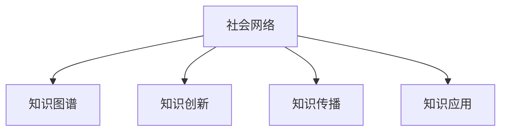

                 

# 知识的社会性：集体智慧的形成与传播

## 1. 背景介绍

### 1.1 问题由来

在快速发展的信息时代，知识的生产、传播与应用呈现出前所未有的复杂性。传统静态、单一的知识体系已无法满足社会需求，取而代之的是动态、多样化的知识形态。个体智慧在社会化网络中不断碰撞、融合，形成集体的智慧。如何理解知识的社会性，探索知识传播与应用的有效途径，成为当前亟待解决的关键问题。

### 1.2 问题核心关键点

知识的社会性是指知识在不同个体之间相互影响、传播和融合的过程。这一过程不仅涉及知识的产生、存储和传递，还涵盖了知识应用中的社会互动、合作与竞争。其主要体现在以下几个方面：

1. **知识生产的社会化**：个体在社会互动中产生新的知识，并在此基础上进行修正和完善。
2. **知识传播的多样性**：知识通过多种渠道（如书籍、网络、讲座等）在不同的社会群体间进行传播，并逐步扩散。
3. **知识应用的动态性**：知识在不同情境下的应用灵活变化，需要不断调整以适应新的社会需求。

### 1.3 问题研究意义

深入研究知识的社会性，对于推动知识创新、优化知识传播和提升社会智能化水平具有重要意义：

1. **促进知识创新**：理解知识社会性有助于揭示知识创新的社会动因，激发个体智慧的协同创新。
2. **优化知识传播**：分析知识传播的社会机制，能指导更有效的知识共享和传播，促进知识的广泛应用。
3. **提升社会智能化**：通过挖掘社会知识网络的结构和功能，实现知识的社会化应用，提高社会整体的智能化水平。

## 2. 核心概念与联系

### 2.1 核心概念概述

为更好地理解知识社会性的形成与传播机制，本节将介绍几个关键概念：

- **社会网络（Social Network）**：描述个体或组织间关系的网络结构。知识在社会网络中传播，形成复杂的知识流。
- **知识图谱（Knowledge Graph）**：通过节点和边构成的图模型，描述实体和它们之间的关系。知识图谱在知识检索和知识推理中具有重要应用。
- **知识创新（Knowledge Innovation）**：通过创新活动产生新知识的过程。知识创新是推动社会进步的重要动力。
- **知识传播（Knowledge Diffusion）**：知识从源节点到目标节点的传播过程。传播效率和路径选择直接影响知识传播效果。
- **知识应用（Knowledge Application）**：知识在实际情境中的具体应用，实现知识的价值。知识应用过程中，需要考虑知识的社会适应性和可操作性。

这些概念之间的逻辑关系可以通过以下Mermaid流程图来展示：



这个流程图展示了知识社会性的核心概念及其之间的关系：

1. 知识在社会网络中生成、传播和应用。
2. 知识图谱为知识的组织和检索提供了结构化的工具。
3. 知识创新驱动社会知识体系的进化。
4. 知识传播影响知识的社会影响力。
5. 知识应用决定了知识的实际价值。

## 3. 核心算法原理 & 具体操作步骤
### 3.1 算法原理概述

知识的社会性研究涉及多个领域的算法和技术，包括社会网络分析、知识图谱构建、知识创新模型等。本节将从核心算法原理的角度，探讨知识社会性的形成与传播。

### 3.2 算法步骤详解

知识社会性的研究通常包括以下几个关键步骤：

**Step 1: 构建社会网络模型**

1. **网络构建**：收集个体或组织之间的互动数据，构建社会网络模型。
2. **节点和边属性**：为每个节点（个体或组织）和边（互动关系）设置属性，如知识存储量、互动频率等。
3. **网络分析**：使用社会网络分析方法（如度中心性、中介中心性等），研究知识传播的动力学特性。

**Step 2: 构建知识图谱**

1. **实体抽取**：从社会网络数据中提取实体（如人名、机构名、知识主题等）。
2. **关系抽取**：构建实体之间的关系（如引用关系、合作关系等），形成知识图谱。
3. **知识推理**：利用知识图谱进行知识推理，发现新的知识连接和关系。

**Step 3: 知识创新分析**

1. **知识产生**：分析个体或组织在互动中产生的知识，如论文发表、专利申请等。
2. **知识修正**：研究知识在互动中如何被修正和完善。
3. **知识融合**：分析不同知识之间的融合机制，如跨学科知识的整合。

**Step 4: 知识传播与扩散**

1. **传播模型**：建立知识传播模型，如SIR模型、谣言传播模型等。
2. **传播路径**：分析知识传播的路径和节点，研究传播效率和路径选择。
3. **传播影响**：评估知识传播对个体或组织的影响，如学术影响力、市场影响力等。

**Step 5: 知识应用与效果评估**

1. **知识应用**：分析知识在实际应用中的表现，如技术应用、商业应用等。
2. **效果评估**：评估知识应用的效果，如技术成功、市场收益等。
3. **应用反馈**：收集知识应用后的反馈信息，调整和优化知识应用策略。

### 3.3 算法优缺点

知识社会性研究中的算法具有以下优点：

1. **综合性强**：结合社会网络和知识图谱，能从多个角度研究知识的社会性。
2. **动态性**：考虑知识传播和应用中的动态变化，能更好地反映实际情境。
3. **可操作性强**：算法多基于实际数据，具有较强的实用价值。

同时，该算法也存在一些局限性：

1. **数据依赖性强**：研究效果依赖于高质量、完整的数据集，数据获取成本较高。
2. **复杂度高**：算法模型复杂，计算量较大，需要较强的计算资源。
3. **解释性不足**：部分算法的决策过程较为复杂，难以提供直观的解释。

### 3.4 算法应用领域

知识社会性研究的应用领域广泛，涵盖了以下几个方面：

- **知识管理**：通过分析知识传播和应用过程，优化知识管理策略。
- **学术研究**：研究学术领域知识传播的网络结构和机制，指导学术研究方向。
- **技术创新**：分析技术创新的社会动因，推动新技术的研发和应用。
- **经济分析**：通过知识应用效果评估，优化经济决策和政策制定。
- **社会治理**：研究知识传播对社会治理的影响，提升社会治理能力。

## 4. 数学模型和公式 & 详细讲解 & 举例说明
### 4.1 数学模型构建

知识社会性的研究涉及多个数学模型，包括社会网络模型、知识图谱模型、知识创新模型等。本节将介绍几个常见的数学模型及其构建方法。

**社会网络模型**

- **度中心性（Degree Centrality）**：衡量节点的连接数，用于发现关键节点。
- **介数中心性（Betweenness Centrality）**：衡量节点在路径中的作用，用于发现信息桥节点。

**知识图谱模型**

- **节点表示（Node Representation）**：使用向量表示节点，如分布式表示法（Distributed Representation）。
- **关系表示（Relation Representation）**：使用矩阵表示关系，如邻接矩阵（Adjacency Matrix）。

**知识创新模型**

- **知识增长模型（Knowledge Growth Model）**：如增长曲线模型（Growth Curve Model），描述知识随时间增长的规律。
- **知识传播模型（Knowledge Diffusion Model）**：如SIR模型，模拟知识在社会中的传播过程。

### 4.2 公式推导过程

以下是几个常见模型的公式推导过程：

**度中心性公式**

$$
c_i = \sum_{j=1}^N A_{ij}
$$

其中，$A$ 为社会网络矩阵，$c_i$ 为节点 $i$ 的度中心性。

**介数中心性公式**

$$
b_i = \sum_{j=1}^N \sum_{k \neq j} \frac{\sigma_{jk}}{\sigma_{ij} + \sigma_{ik}}
$$

其中，$\sigma_{jk}$ 表示从节点 $j$ 到节点 $k$ 的路径数量。

**知识传播模型（SIR模型）**

$$
S'(t) = -\beta S(t)I(t)
$$

$$
I'(t) = \beta S(t)I(t) - \gamma I(t)
$$

$$
R'(t) = \gamma I(t)
$$

其中，$S$、$I$、$R$ 分别表示易感者、感染者和康复者，$\beta$ 和 $\gamma$ 为参数，描述感染和康复速率。

### 4.3 案例分析与讲解

**案例一：学术合作网络**

- **背景**：分析学术领域的合作网络，研究知识传播路径和节点重要性。
- **数据来源**：使用SCI论文引用数据。
- **方法**：构建合作网络，计算节点度中心性和介数中心性。
- **结果**：发现关键节点（如学术领袖）和信息桥节点（如重要期刊），指导学术合作策略。

**案例二：技术创新扩散**

- **背景**：研究技术创新的扩散机制，优化技术推广策略。
- **数据来源**：专利申请数据。
- **方法**：构建技术扩散模型，模拟技术传播路径。
- **结果**：分析技术传播效率和关键节点，指导技术推广政策。

## 5. 项目实践：代码实例和详细解释说明
### 5.1 开发环境搭建

在进行知识社会性研究前，我们需要准备好开发环境。以下是使用Python进行网络分析的环境配置流程：

1. 安装Anaconda：从官网下载并安装Anaconda，用于创建独立的Python环境。

2. 创建并激活虚拟环境：
```bash
conda create -n network-analysis python=3.8 
conda activate network-analysis
```

3. 安装网络分析库：
```bash
conda install networkx matplotlib scikit-learn scipy jupyter notebook ipython
```

4. 安装知识图谱库：
```bash
pip install pykg-benchmark pykeen dgl rdkit
```

完成上述步骤后，即可在`network-analysis`环境中开始知识社会性研究。

### 5.2 源代码详细实现

下面以社会网络分析为例，给出使用Python进行知识社会性研究代码实现。

首先，定义社会网络数据的处理函数：

```python
import networkx as nx
import pandas as pd

def load_network_data(path):
    """
    加载社会网络数据
    """
    G = nx.read_edgelist(path, delimiter=',', create_using=nx.Graph())
    return G

def calculate_node_degree(G):
    """
    计算节点度中心性
    """
    degree_centrality = nx.degree_centrality(G)
    return degree_centrality

def calculate_node_betweenness(G):
    """
    计算节点介数中心性
    """
    betweenness_centrality = nx.betweenness_centrality(G, weight='weight')
    return betweenness_centrality

def visualize_node_centrality(G, centrality):
    """
    可视化节点中心性
    """
    pos = nx.spring_layout(G)
    nx.draw_networkx(G, pos, node_color=centrality.values(), cmap='Blues', node_size=200, alpha=0.8)
    plt.title('Node Centrality')
    plt.show()
```

然后，定义知识图谱的数据处理函数：

```python
from pykgbenchmark import Benchmark

def load_kg_data(path):
    """
    加载知识图谱数据
    """
    kg = Benchmark.from_path(path)
    return kg

def calculate_node_representative(kg):
    """
    计算节点代表性
    """
    node_representation = kg.node_repr_vectorized()
    return node_representation

def visualize_kg_node(kg):
    """
    可视化知识图谱节点
    """
    embedding = kg.node_embedding_eigenvector_reduction()
    pos = embedding[:100]
    labels = kg.node_names()
    plt.scatter(pos[:,0], pos[:,1], c=labels, cmap='viridis')
    plt.title('Knowledge Graph Node Embedding')
    plt.show()
```

最后，定义知识传播的模拟函数：

```python
from sympy import symbols, Eq, solve

def simulate_knowledge_spread(G, initial_infectors, beta, gamma, timesteps):
    """
    模拟知识传播
    """
    S, I, R = symbols('S I R')
    initial_population = len(G.nodes)
    S_value = initial_population - initial_infectors
    I_value = initial_infectors
    R_value = 0
    spread_rate = beta * S_value * I_value / initial_population
    recovery_rate = gamma * I_value
    spread_eq = Eq(S_value + S_prime(timesteps) + R_value, S_value)
    recovery_eq = Eq(I_value + I_prime(timesteps) + R_value, I_value)
    spread_solution = solve(spread_eq, S_prime(timesteps))
    recovery_solution = solve(recovery_eq, I_prime(timesteps))
    return spread_solution, recovery_solution
```

### 5.3 代码解读与分析

让我们再详细解读一下关键代码的实现细节：

**load_network_data函数**：
- `load_network_data`函数用于加载社会网络数据，通过读取edgelist文件，构建社会网络图。
- 使用`networkx`库的`read_edgelist`方法，将数据文件加载为`networkx`图。

**calculate_node_degree和calculate_node_betweenness函数**：
- `calculate_node_degree`函数用于计算节点度中心性，通过`networkx`库的`degree_centrality`方法。
- `calculate_node_betweenness`函数用于计算节点介数中心性，通过`networkx`库的`betweenness_centrality`方法。

**visualize_node_centrality函数**：
- `visualize_node_centrality`函数用于可视化节点中心性，通过`networkx`库的`spring_layout`方法计算节点布局，`draw_networkx`方法绘制图形。

**load_kg_data和calculate_node_representative函数**：
- `load_kg_data`函数用于加载知识图谱数据，通过`pykg-benchmark`库的`from_path`方法。
- `calculate_node_representative`函数用于计算节点代表性，通过`pykg-benchmark`库的`node_repr_vectorized`方法。

**visualize_kg_node函数**：
- `visualize_kg_node`函数用于可视化知识图谱节点，通过`pykg-benchmark`库的`node_embedding_eigenvector_reduction`方法计算节点嵌入，使用`matplotlib`库绘制图形。

**simulate_knowledge_spread函数**：
- `simulate_knowledge_spread`函数用于模拟知识传播，通过`sympy`库的`sympy`符号计算。

可以看到，通过`networkx`、`pykg-benchmark`、`sympy`等库，能够很方便地进行社会网络和知识图谱的分析、计算和可视化。开发者可以基于这些库，快速构建知识社会性研究的基础框架。

## 6. 实际应用场景
### 6.1 学术合作网络分析

在学术研究领域，通过分析合作网络，可以发现关键节点和信息桥节点，从而优化学术合作策略。例如，某大学希望提高其在特定领域的研究影响力，可以通过合作网络分析，识别出在该领域具有高影响力的研究机构和个人，进而与其建立合作关系，推动本校在该领域的研究发展。

### 6.2 技术创新扩散分析

在技术创新领域，通过模拟技术传播过程，可以评估技术扩散效果，指导技术推广策略。例如，某公司希望快速推广一项新技术，可以通过模拟技术传播路径，识别出技术传播的关键节点和路径，优化技术推广策略，加快新技术的普及应用。

### 6.3 社会治理分析

在社会治理领域，通过分析知识传播和应用过程，可以优化政策制定和资源分配。例如，某市政府希望提高社区服务质量，可以通过知识传播分析，识别出社区服务中的关键节点和信息源，指导社区资源的合理分配，提高服务效率。

### 6.4 未来应用展望

随着知识社会性研究的深入，未来将在更多领域得到应用，为社会发展和智能化带来新的动力：

- **教育领域**：分析学生知识网络的互动，提供个性化学习建议，提升教学效果。
- **医疗领域**：通过知识传播分析，优化医疗资源的配置和利用，提高医疗服务水平。
- **经济领域**：研究知识传播对市场动态的影响，指导企业决策和市场策略。
- **文化领域**：分析文化传承与传播的机制，推动文化遗产的保护与创新。

总之，知识社会性研究的应用前景广阔，将在多个领域发挥重要作用，推动社会进步和智能化发展。

## 7. 工具和资源推荐
### 7.1 学习资源推荐

为了帮助开发者系统掌握知识社会性的理论基础和实践技巧，这里推荐一些优质的学习资源：

1. 《网络分析与应用》系列博文：由网络分析专家撰写，深入浅出地介绍了网络分析的基本概念和算法。
2. 《知识图谱构建与应用》课程：斯坦福大学开设的知识图谱课程，涵盖知识图谱的理论基础和实际应用案例。
3. 《知识管理与创新》书籍：研究知识管理与创新过程，分析知识社会性的形成与传播机制。
4. 《社会网络分析与模型》书籍：全面介绍社会网络分析的理论和方法，适用于各领域的网络分析应用。
5. HuggingFace官方文档：深度学习模型和算法库的官方文档，提供了丰富的知识社会性研究样例。

通过对这些资源的学习实践，相信你一定能够快速掌握知识社会性的精髓，并用于解决实际的复杂问题。

### 7.2 开发工具推荐

高效的开发离不开优秀的工具支持。以下是几款用于知识社会性研究开发的常用工具：

1. Python：广泛应用的数据处理和科学计算语言，支持丰富的第三方库。
2. NetworkX：用于构建和分析网络图的数据结构，支持社会网络分析。
3. PyKG-Benchmark：用于评估知识图谱质量和性能的基准库，支持知识图谱构建与分析。
4. Scikit-learn：机器学习库，支持多种算法和工具，适用于数据分析和模型训练。
5. TensorBoard：用于可视化模型训练过程的工具，支持复杂网络结构的展示。
6. Jupyter Notebook：交互式编程环境，支持多种语言和库的混合使用。

合理利用这些工具，可以显著提升知识社会性研究的开发效率，加快创新迭代的步伐。

### 7.3 相关论文推荐

知识社会性研究源于学界的持续研究。以下是几篇奠基性的相关论文，推荐阅读：

1. "The Structure and Dynamics of Social Networks"（社会网络的结构和动态）：研究社会网络的数学模型和算法，揭示社会互动的规律。
2. "Knowledge Graphs: Concepts, Approaches, Dynamics"（知识图谱：概念、方法、动态）：全面介绍知识图谱的理论和方法，分析知识传播的机制。
3. "Innovation Diffusion: Theory, Modeling, and Simulation"（技术创新的扩散）：研究技术创新的传播机制，指导技术推广策略。
4. "Social Network Analysis: Methods and Models"（社会网络分析：方法和模型）：介绍社会网络分析的理论和方法，适用于多领域的网络分析应用。
5. "The Social Network of Science: An Introduction"（科学社交网络：引论）：分析科学领域的社交网络，指导学术合作和研究发展。

这些论文代表了大规模知识社会性研究的发展脉络。通过学习这些前沿成果，可以帮助研究者把握学科前进方向，激发更多的创新灵感。

## 8. 总结：未来发展趋势与挑战
### 8.1 总结

本文对知识社会性的形成与传播机制进行了全面系统的介绍。首先阐述了知识社会性的研究背景和意义，明确了知识社会性的形成与传播在社会知识体系中的重要作用。其次，从核心算法原理的角度，详细讲解了知识社会性的形成与传播机制，探讨了社会网络分析、知识图谱构建和知识传播模型等关键技术。最后，本文还展示了知识社会性研究在学术合作、技术创新、社会治理等领域的应用前景，以及未来的发展趋势和挑战。

通过本文的系统梳理，可以看到，知识社会性的研究对于推动知识创新、优化知识传播和提升社会智能化水平具有重要意义。深入研究知识社会性，对于揭示知识创新的社会动因，指导知识传播策略，提高社会治理能力，具有重要价值。

### 8.2 未来发展趋势

展望未来，知识社会性研究将呈现以下几个发展趋势：

1. **跨学科研究**：知识社会性研究将与人工智能、大数据、机器学习等技术进一步融合，推动知识社会性研究的深化。
2. **多模态知识融合**：结合文本、图像、音频等多模态信息，实现更全面的知识社会性分析。
3. **动态知识传播模型**：研究知识传播的动态变化，考虑知识传播的时间序列和情境变化。
4. **社会情感分析**：研究知识传播中的社会情感因素，优化知识传播策略。
5. **知识图谱演化分析**：分析知识图谱的动态变化和演化机制，揭示知识传播和应用的长期趋势。

### 8.3 面临的挑战

尽管知识社会性研究已经取得了诸多成果，但在迈向更加智能化、普适化应用的过程中，它仍面临诸多挑战：

1. **数据获取困难**：高质量、完整的数据集获取难度较大，尤其是在社会网络分析和知识图谱构建中。
2. **算法复杂度高**：知识社会性研究涉及多学科算法，计算量较大，需要高性能计算资源。
3. **结果解释性不足**：部分算法的决策过程复杂，难以提供直观的解释，影响实际应用。
4. **隐私保护问题**：在数据收集和分析过程中，隐私保护和数据安全问题需要得到充分考虑。
5. **模型可扩展性差**：现有的知识社会性研究模型大多适用于特定领域，可扩展性差，难以广泛应用。

### 8.4 研究展望

面对知识社会性研究面临的挑战，未来的研究需要在以下几个方面寻求新的突破：

1. **数据驱动**：开发更多高效的数据获取和处理工具，解决数据获取难题。
2. **算法优化**：优化现有算法，降低计算复杂度，提升算法效率。
3. **模型可解释性**：研究可解释性强的模型，提升模型决策过程的透明度和可理解性。
4. **隐私保护技术**：研究隐私保护和数据安全技术，确保数据使用的合法性和安全性。
5. **跨领域应用**：推广知识社会性研究，应用于更多领域，推动社会智能化发展。

这些研究方向的探索，必将引领知识社会性研究走向更高的台阶，为知识传播和社会治理带来新的突破。面向未来，知识社会性研究需要多学科、多领域的协同创新，推动知识社会性研究的不断深入和应用。

## 9. 附录：常见问题与解答

**Q1：知识社会性研究的核心算法和技术有哪些？**

A: 知识社会性研究的核心算法和技术包括：

1. **社会网络分析**：通过分析社会网络数据，揭示知识传播的动力学特性。
2. **知识图谱构建**：通过实体和关系抽取，构建知识图谱，实现知识组织和检索。
3. **知识创新模型**：描述知识产生和修正的过程，研究知识创新机制。
4. **知识传播模型**：通过模拟知识传播过程，分析知识传播效率和路径选择。

**Q2：知识社会性研究的应用前景有哪些？**

A: 知识社会性研究的应用前景广泛，包括：

1. **学术研究**：通过合作网络分析，优化学术合作策略，提升学术影响力。
2. **技术创新**：通过技术传播分析，优化技术推广策略，加速技术应用。
3. **社会治理**：通过知识传播分析，优化政策制定和资源分配，提高社会治理能力。
4. **教育领域**：通过知识传播分析，提供个性化学习建议，提升教学效果。
5. **医疗领域**：通过知识传播分析，优化医疗资源配置，提高医疗服务水平。

**Q3：知识社会性研究的难点和挑战有哪些？**

A: 知识社会性研究的难点和挑战包括：

1. **数据获取困难**：高质量、完整的数据集获取难度较大。
2. **算法复杂度高**：计算量较大，需要高性能计算资源。
3. **结果解释性不足**：部分算法的决策过程复杂，难以提供直观的解释。
4. **隐私保护问题**：在数据收集和分析过程中，隐私保护和数据安全问题需要得到充分考虑。
5. **模型可扩展性差**：现有的知识社会性研究模型大多适用于特定领域，可扩展性差。

**Q4：如何优化知识社会性研究的算法？**

A: 优化知识社会性研究的算法可以从以下几个方面入手：

1. **数据预处理**：采用高效的数据预处理技术，如特征选择、降维等，减少计算量。
2. **算法并行化**：采用分布式计算和并行计算技术，加速算法运行速度。
3. **模型简化**：采用简化模型或近似算法，降低算法复杂度。
4. **算法融合**：将不同算法进行融合，提升模型效果。

这些优化措施可以有效提升知识社会性研究的算法效率和效果，推动研究的进一步发展。

**Q5：知识社会性研究如何与实际应用相结合？**

A: 知识社会性研究与实际应用相结合可以从以下几个方面入手：

1. **数据来源**：选择合适的数据来源，保证数据的真实性和代表性。
2. **算法优化**：根据实际应用场景，优化算法，提升算法的实用性和可操作性。
3. **模型评估**：通过实际应用效果评估，不断优化模型，提升模型的应用效果。
4. **用户反馈**：收集用户反馈，优化算法和模型，提升用户体验。

通过深入研究和不断优化，知识社会性研究可以更好地服务于实际应用，推动社会智能化发展。

**Q6：如何构建知识图谱？**

A: 构建知识图谱可以从以下几个方面入手：

1. **实体抽取**：从文本、数据等来源中抽取实体，如人名、机构名、知识主题等。
2. **关系抽取**：抽取实体之间的关系，如引用关系、合作关系等，形成知识图谱。
3. **知识推理**：利用知识图谱进行知识推理，发现新的知识连接和关系。

通过以上步骤，可以构建高质量的知识图谱，实现知识的组织和检索，推动知识传播和应用。

---

作者：禅与计算机程序设计艺术 / Zen and the Art of Computer Programming

