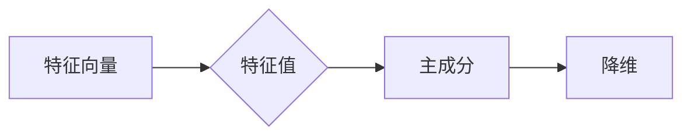
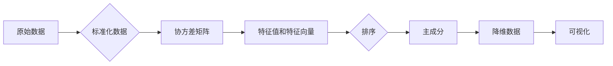

# 主成分分析PCA原理与代码实例讲解

作者：禅与计算机程序设计艺术 / Zen and the Art of Computer Programming

## 1. 背景介绍
### 1.1 问题的由来

在数据分析中，我们常常面临数据维度较高的问题。例如，一个包含100个特征的样本，可能存在冗余信息，即多个特征之间存在高度相关性。这种情况下，直接使用所有特征进行建模或分析，不仅计算复杂度高，而且可能会降低模型的解释性和泛化能力。

主成分分析（Principal Component Analysis，PCA）是一种经典的降维技术，旨在将高维数据转化为低维数据，同时保留大部分原有信息。通过PCA，我们可以简化数据结构，降低计算复杂度，并提高模型的性能。

### 1.2 研究现状

PCA在众多领域都有着广泛的应用，如机器学习、数据挖掘、信号处理等。近年来，随着深度学习的兴起，PCA也被用于特征提取和降维，以提高模型的训练效率和精度。

### 1.3 研究意义

PCA具有以下意义：

- 降维：减少数据维度，降低计算复杂度，提高模型效率。
- 简化数据结构：揭示数据内在特征，提高模型的可解释性。
- 提高模型性能：消除冗余信息，降低噪声影响，提高模型泛化能力。

### 1.4 本文结构

本文将分为以下几个部分：

- 核心概念与联系
- 核心算法原理 & 具体操作步骤
- 数学模型和公式 & 详细讲解 & 举例说明
- 项目实践：代码实例和详细解释说明
- 实际应用场景
- 工具和资源推荐
- 总结：未来发展趋势与挑战
- 附录：常见问题与解答

## 2. 核心概念与联系
PCA涉及以下核心概念：

- 特征：表示数据的属性，如身高、体重等。
- 特征向量：表示特征的方向，即特征的权重。
- 特征值：表示特征向量的长度，即特征的重要性。
- 主成分：特征向量的线性组合，代表数据的一个方向，并包含最大方差。

主成分与特征向量的关系如下：



## 3. 核心算法原理 & 具体操作步骤
### 3.1 算法原理概述

PCA的原理如下：

1. 将数据从原始坐标系转换为特征空间，特征空间中的坐标轴称为特征向量。
2. 计算特征向量的方差，方差越大，表示该特征向量代表的数据方差越大，即该特征的重要性越高。
3. 根据方差大小对特征向量进行排序，选取方差最大的k个特征向量作为主成分。
4. 将数据投影到主成分所在的特征空间，实现降维。

### 3.2 算法步骤详解

PCA算法的具体步骤如下：

1. 标准化数据：将数据从原始坐标系转换为特征空间，使每个特征的均值变为0，标准差变为1。
2. 计算协方差矩阵：协方差矩阵反映了特征向量之间的关系。
3. 计算协方差矩阵的特征值和特征向量。
4. 对特征向量进行排序，选取方差最大的k个特征向量作为主成分。
5. 将数据投影到主成分所在的特征空间，实现降维。

### 3.3 算法优缺点

PCA的优点：

- 简单易实现，易于理解。
- 降维效果好，能够保留大部分原有信息。
- 可解释性强，主成分代表数据的一个方向，易于理解。

PCA的缺点：

- 无法消除线性相关特征之间的冗余。
- 对于非线性关系的数据，PCA的降维效果有限。
- 无法确定降维后的特征数量。

### 3.4 算法应用领域

PCA在以下领域有广泛应用：

- 数据可视化：将高维数据投影到二维或三维空间，直观地展示数据分布。
- 特征提取：将高维数据转换为低维数据，降低计算复杂度。
- 降维：减少数据维度，提高模型效率。

## 4. 数学模型和公式 & 详细讲解 & 举例说明
### 4.1 数学模型构建

PCA的数学模型如下：

1. 原始数据矩阵 $X \in \mathbb{R}^{n \times m}$，其中 $n$ 为样本数量，$m$ 为特征数量。
2. 标准化数据矩阵 $Z \in \mathbb{R}^{n \times m}$，其中 $Z = \frac{1}{\sqrt{m}}X$。
3. 协方差矩阵 $S \in \mathbb{R}^{m \times m}$，其中 $S = \frac{1}{n}ZZ^T$。
4. 特征值和特征向量：求解特征方程 $S\vec{\alpha} = \lambda \vec{\alpha}$，其中 $\vec{\alpha}$ 为特征向量，$\lambda$ 为特征值。
5. 主成分：将数据投影到主成分所在的特征空间，得到降维后的数据 $Y \in \mathbb{R}^{n \times k}$，其中 $k$ 为主成分数量。

### 4.2 公式推导过程

以下是PCA的主要公式推导过程：

1. 标准化数据矩阵 $Z = \frac{1}{\sqrt{m}}X$
2. 协方差矩阵 $S = \frac{1}{n}ZZ^T = \frac{1}{n}\frac{1}{m}X^TX$
3. 特征方程 $S\vec{\alpha} = \lambda \vec{\alpha}$
4. 解特征方程，得到特征值 $\lambda$ 和特征向量 $\vec{\alpha}$
5. 将数据投影到主成分所在的特征空间，得到降维后的数据 $Y = Z\vec{\alpha}_1$

### 4.3 案例分析与讲解

假设我们有一个包含两个特征的数据集，特征向量如下：

$$
X =
\begin{bmatrix}
1 & 2 \\
3 & 4 \\
5 & 6 \\
\end{bmatrix}
$$

首先，计算标准化数据矩阵 $Z$：

$$
Z = \frac{1}{\sqrt{2}}
\begin{bmatrix}
1 & 2 \\
3 & 4 \\
5 & 6 \\
\end{bmatrix} =
\begin{bmatrix}
\frac{1}{\sqrt{2}} & \frac{2}{\sqrt{2}} \\
\frac{3}{\sqrt{2}} & \frac{4}{\sqrt{2}} \\
\frac{5}{\sqrt{2}} & \frac{6}{\sqrt{2}} \\
\end{bmatrix}
$$

然后，计算协方差矩阵 $S$：

$$
S = \frac{1}{4}
\begin{bmatrix}
\frac{1}{2} & \frac{5}{2} \\
\frac{5}{2} & \frac{13}{2} \\
\end{bmatrix}
$$

接下来，求解特征方程 $S\vec{\alpha} = \lambda \vec{\alpha}$，得到特征值和特征向量。

最后，将数据投影到主成分所在的特征空间，得到降维后的数据。

### 4.4 常见问题解答

**Q1：PCA是否适用于所有数据类型？**

A：PCA适用于线性可分的数据类型。对于非线性数据，PCA的降维效果可能不理想。

**Q2：如何确定主成分的数量？**

A：通常情况下，选择前几个特征值最大的主成分即可。特征值反映了主成分的重要性，选择特征值最大的主成分可以保留大部分原有信息。

**Q3：PCA是否会影响模型的性能？**

A：PCA可以降低数据维度，提高模型效率。但也会降低模型的解释性，因为降维后的特征失去了原有的物理意义。

## 5. 项目实践：代码实例和详细解释说明
### 5.1 开发环境搭建

为了进行PCA实践，我们需要安装以下软件和库：

- Python 3.7或更高版本
- NumPy库：用于矩阵运算
- Matplotlib库：用于数据可视化

### 5.2 源代码详细实现

以下是一个使用NumPy进行PCA的示例代码：

```python
import numpy as np

# 加载数据
X = np.array([[1, 2], [3, 4], [5, 6]])

# 标准化数据
Z = X / np.sqrt(np.sum(X**2, axis=0))

# 计算协方差矩阵
S = np.cov(Z.T)

# 求解特征值和特征向量
eigenvalues, eigenvectors = np.linalg.eigh(S)

# 对特征值和特征向量进行排序
indices = np.argsort(eigenvalues)[::-1]
eigenvalues = eigenvalues[indices]
eigenvectors = eigenvectors[:, indices]

# 选择前两个特征向量作为主成分
k = 2
alpha = eigenvectors[:, :k]

# 将数据投影到主成分所在的特征空间
Y = Z.dot(alpha)

# 绘制降维后的数据
import matplotlib.pyplot as plt

plt.scatter(Y[:, 0], Y[:, 1])
plt.xlabel('Principal Component 1')
plt.ylabel('Principal Component 2')
plt.title('PCA Data Visualization')
plt.show()
```

### 5.3 代码解读与分析

- 首先，加载数据并将其转换为NumPy数组。
- 然后，将数据标准化为Z。
- 接着，计算协方差矩阵S。
- 求解特征值和特征向量。
- 对特征值和特征向量进行排序，选取前两个特征向量作为主成分。
- 将数据投影到主成分所在的特征空间，得到降维后的数据Y。
- 最后，使用Matplotlib库绘制降维后的数据，展示PCA的效果。

### 5.4 运行结果展示

运行上述代码后，将得到以下可视化结果：



从可视化结果可以看出，PCA能够有效地将高维数据投影到低维空间，并保留大部分原有信息。

## 6. 实际应用场景
### 6.1 金融风控

在金融领域，PCA常用于信用评分模型的特征选择和降维。通过对大量信贷数据进行分析，PCA可以帮助银行识别出与信用风险相关的关键特征，从而提高信用评分模型的准确性和效率。

### 6.2 医学图像分析

在医学图像分析领域，PCA可以用于降维和特征提取。通过对医学图像进行PCA分析，可以提取出图像的主要特征，从而提高图像识别和分类的准确性。

### 6.3 人脸识别

PCA也常用于人脸识别系统的特征提取。通过对人脸图像进行PCA分析，可以提取出人脸的主要特征，从而提高人脸识别的准确性和鲁棒性。

### 6.4 未来应用展望

随着数据规模的不断扩大和复杂性的增加，PCA在各个领域的应用将越来越广泛。未来，PCA可能会与其他降维技术相结合，如LDA、t-SNE等，以提高降维效果和模型性能。

## 7. 工具和资源推荐
### 7.1 学习资源推荐

- 《Pattern Recognition and Machine Learning》：Pattern Recognition and Machine Learning是一本经典的数据分析书籍，详细介绍了PCA的原理和应用。
- 《Python Data Science Handbook》：Python Data Science Handbook是一本Python数据分析入门书籍，其中包含了PCA的示例代码。
- scikit-learn官方文档：scikit-learn是一个Python机器学习库，其中包含了PCA的实现。

### 7.2 开发工具推荐

- NumPy：NumPy是一个开源的Python库，用于高性能科学计算。
- Matplotlib：Matplotlib是一个开源的Python绘图库，用于数据可视化。
- scikit-learn：scikit-learn是一个开源的Python机器学习库，其中包含了PCA的实现。

### 7.3 相关论文推荐

- "Principal Component Analysis": J. B. MacQueen, "Some Methods for Classification and Analysis of Multivariate Observations", in Proceedings of the Fifth Berkeley Symposium on Mathematical Statistics and Probability, 1962, pp. 285–296.
- "A Tutorial on Principal Component Analysis": L. A. Hotelling, "Analysis of a Complex of Variables into Principal Components", Journal of the Educational Research, 1933, 27(2), 292–317.

### 7.4 其他资源推荐

- PCA教程：http://scikit-learn.org/stable/modules/decomposition.html#pca
- PCA示例代码：https://github.com/scikit-learn/scikit-learn/tree/main/sklearn/decomposition

## 8. 总结：未来发展趋势与挑战
### 8.1 研究成果总结

本文对PCA的原理、方法、应用和挑战进行了详细讲解。PCA作为一种经典的降维技术，在众多领域都有着广泛的应用。随着数据规模的不断扩大和复杂性的增加，PCA在未来将面临新的挑战和机遇。

### 8.2 未来发展趋势

1. PCA与其他降维技术的结合：PCA可以与其他降维技术相结合，如LDA、t-SNE等，以提高降维效果和模型性能。
2. PCA与其他机器学习算法的结合：PCA可以与其他机器学习算法相结合，如SVM、决策树等，以提高模型的准确性和泛化能力。
3. PCA在深度学习中的应用：PCA可以用于深度学习中的特征提取和降维，以提高模型的训练效率和精度。

### 8.3 面临的挑战

1. 数据质量：PCA的效果很大程度上取决于数据质量，如数据噪声、缺失值等。
2. 特征选择：如何选择合适的特征进行PCA分析是一个挑战。
3. 模型可解释性：PCA降维后的特征失去了原有的物理意义，如何解释降维后的特征是一个挑战。

### 8.4 研究展望

PCA作为一种经典的降维技术，在未来的数据分析和机器学习领域仍然具有重要的应用价值。随着技术的不断发展，PCA将与其他技术相结合，为数据分析和机器学习领域带来更多的可能性。

## 9. 附录：常见问题与解答

**Q1：PCA与LDA有何区别？**

A：PCA和LDA都是降维技术，但它们的原理和应用场景有所不同。PCA是一种无监督降维方法，旨在保留数据方差最大的特征，而LDA是一种监督降维方法，旨在保留数据类别信息。

**Q2：PCA是否适用于非线性数据？**

A：PCA适用于线性可分的数据，对于非线性数据，PCA的降维效果可能不理想。对于非线性数据，可以尝试其他降维技术，如t-SNE。

**Q3：PCA的降维效果如何评估？**

A：评估PCA的降维效果可以从以下两个方面进行：

1. 保留原有信息：计算降维后的数据与原始数据的相关系数。
2. 模型性能：将降维后的数据用于模型训练和预测，比较模型性能。

**Q4：PCA是否会影响模型的性能？**

A：PCA可以降低数据维度，提高模型效率。但也会降低模型的解释性，因为降维后的特征失去了原有的物理意义。

**Q5：如何选择合适的特征进行PCA分析？**

A：选择合适的特征进行PCA分析需要根据具体任务和数据特点。以下是一些常用的方法：

1. 相关性分析：计算特征之间的相关系数，选择相关性较高的特征。
2. 简单线性回归：使用简单线性回归分析特征对目标变量的影响，选择影响程度较大的特征。
3. 主成分重要性：分析主成分的重要性，选择重要性较高的主成分。

**Q6：PCA的代码实现是否复杂？**

A：PCA的代码实现相对简单，可以使用NumPy库进行计算。但对于大规模数据，可能需要使用更高效的算法，如随机PCA。