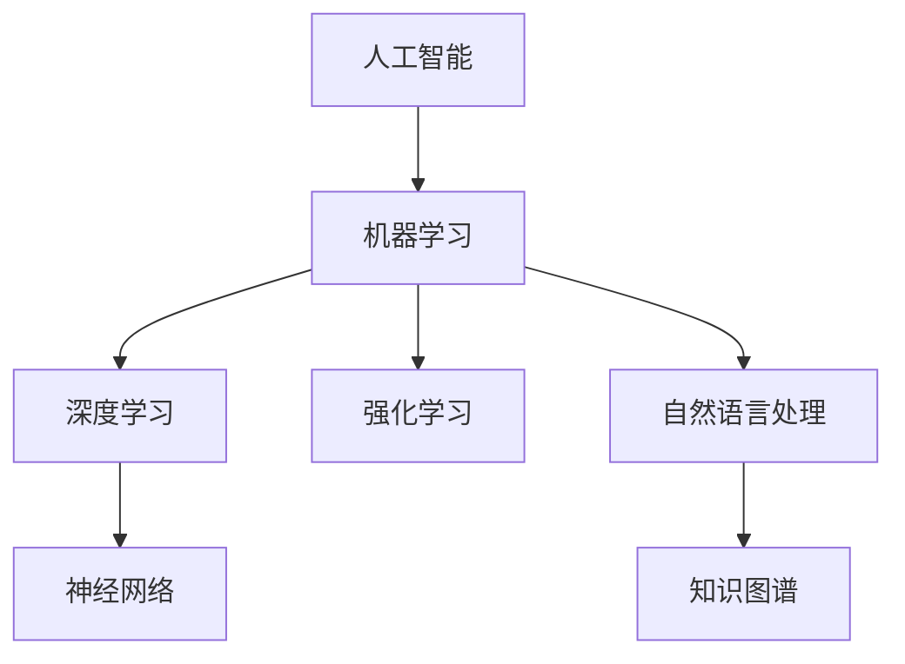

# 人工智能 原理与代码实例讲解

作者：禅与计算机程序设计艺术 / Zen and the Art of Computer Programming

## 1. 背景介绍

### 1.1 问题的由来

人工智能（Artificial Intelligence, AI）作为一门研究、开发用于模拟、延伸和扩展人的智能的理论、方法、技术及应用系统的一门新的技术科学，已经经历了数十年的发展。从最初的符号主义、连接主义到如今的深度学习时代，人工智能在图像识别、语音识别、自然语言处理等领域取得了显著的成果。

然而，随着人工智能技术的快速发展，其背后的原理和实现方法也逐渐变得复杂和深奥。对于初学者和从业者来说，如何快速掌握人工智能的核心知识和技术，成为了一个亟待解决的问题。

### 1.2 研究现状

当前，人工智能领域的研究热点主要包括以下几方面：

1. 深度学习：以神经网络为核心，通过大量数据学习特征表示和映射关系，在图像识别、语音识别、自然语言处理等领域取得了突破性进展。
2. 强化学习：通过与环境交互，学习最优策略，在游戏、机器人控制等领域展现出强大的应用潜力。
3. 自然语言处理：研究如何让计算机理解、生成和运用人类语言，在机器翻译、智能客服、聊天机器人等领域得到广泛应用。
4. 知识图谱：构建知识库和推理引擎，为智能问答、知识图谱问答等应用提供支撑。

### 1.3 研究意义

人工智能技术的应用已经渗透到我们生活的方方面面，具有重要的研究意义：

1. 提高生产效率：人工智能技术可以自动化处理大量重复性工作，提高生产效率，降低人力成本。
2. 创新商业模式：人工智能技术可以为企业创造新的业务模式和产品，拓展市场空间。
3. 改善生活质量：人工智能技术可以应用于医疗、教育、家居等领域，提高人们的生活质量。
4. 促进科技进步：人工智能技术是新一轮科技革命和产业变革的重要驱动力。

### 1.4 本文结构

本文将从人工智能的核心概念、算法原理、代码实现、应用场景等方面进行讲解，旨在帮助读者全面了解人工智能技术，掌握其基本原理和应用方法。

## 2. 核心概念与联系

为了更好地理解人工智能技术，我们需要了解以下几个核心概念：

- **人工智能**：指由人制造出来的系统所表现出的智能行为。
- **机器学习**：使计算机从数据中学习并做出决策或预测的技术。
- **深度学习**：一种利用深层神经网络进行学习的技术，具有强大的特征表示和学习能力。
- **神经网络**：一种模仿人脑神经元连接方式的计算模型，可以用于图像识别、语音识别等任务。
- **强化学习**：一种通过与环境交互，学习最优策略的机器学习技术。
- **自然语言处理**：研究如何让计算机理解、生成和运用人类语言的技术。
- **知识图谱**：一种将知识组织成图状结构的知识库，可以用于智能问答、知识图谱问答等应用。

这些概念之间的关系如下所示：



可以看出，人工智能是机器学习、深度学习、强化学习、自然语言处理和知识图谱等技术的综合体现。

## 3. 核心算法原理 & 具体操作步骤

### 3.1 算法原理概述

人工智能的核心是算法，以下介绍几种常见的机器学习算法：

1. **线性回归**：用于回归问题，即预测连续型变量。
2. **逻辑回归**：用于分类问题，即预测离散型变量。
3. **决策树**：通过树形结构对数据进行分析，预测目标变量的值。
4. **支持向量机**：通过找到最佳的超平面来分割数据。
5. **神经网络**：一种模仿人脑神经元连接方式的计算模型，可以用于图像识别、语音识别等任务。

### 3.2 算法步骤详解

以下以线性回归为例，介绍机器学习算法的基本步骤：

1. **数据预处理**：对原始数据进行清洗、归一化等处理，提高数据质量。
2. **特征选择**：选择与目标变量相关的特征，降低模型复杂度。
3. **模型训练**：使用训练数据训练模型，调整模型参数。
4. **模型评估**：使用测试数据评估模型性能，调整模型参数。
5. **模型部署**：将训练好的模型部署到实际应用中。

### 3.3 算法优缺点

以下是几种常见机器学习算法的优缺点：

| 算法 | 优点 | 缺点 |
| :--: | :--: | :--: |
| 线性回归 | 简单、易于实现、易于解释 | 模型表达能力有限，难以处理非线性问题 |
| 逻辑回归 | 简单、易于实现、易于解释 | 模型表达能力有限，难以处理非线性问题 |
| 决策树 | 简单、易于实现、易于解释 | 模型容易过拟合、容易产生过分类 |
| 支持向量机 | 模型泛化能力强、对非线性问题有良好的效果 | 计算复杂度高、参数较多 |

### 3.4 算法应用领域

以上几种算法在以下领域有着广泛的应用：

- **线性回归**：用于预测房价、股票价格等连续型变量。
- **逻辑回归**：用于分类任务，如垃圾邮件识别、信用卡欺诈检测等。
- **决策树**：用于分类和回归任务，如客户流失预测、疾病诊断等。
- **支持向量机**：用于分类和回归任务，如图像识别、文本分类等。
- **神经网络**：用于图像识别、语音识别、自然语言处理等任务。

## 4. 数学模型和公式 & 详细讲解 & 举例说明

### 4.1 数学模型构建

以下以线性回归为例，介绍机器学习算法的数学模型：

$$
y = \beta_0 + \beta_1x_1 + \beta_2x_2 + \cdots + \beta_nx_n + \epsilon
$$

其中，$y$ 为目标变量，$x_1, x_2, \cdots, x_n$ 为特征变量，$\beta_0, \beta_1, \cdots, \beta_n$ 为模型参数，$\epsilon$ 为误差项。

### 4.2 公式推导过程

以下以线性回归为例，介绍机器学习算法的公式推导过程：

假设我们有 $N$ 个样本，每个样本包含 $n$ 个特征和1个目标变量，则线性回归模型的损失函数可以表示为：

$$
L(\theta) = \frac{1}{N} \sum_{i=1}^N (y_i - \theta^T x_i)^2
$$

其中，$\theta$ 为模型参数，$x_i$ 为第 $i$ 个样本的特征向量，$y_i$ 为第 $i$ 个样本的目标变量。

为了最小化损失函数，对 $\theta$ 进行求导，得到：

$$
\frac{\partial L(\theta)}{\partial \theta} = \frac{2}{N} \sum_{i=1}^N (y_i - \theta^T x_i) x_i
$$

令导数为零，解得：

$$
\theta = (\sum_{i=1}^N x_i x_i^T)^{-1} \sum_{i=1}^N x_i y_i
$$

这就是线性回归模型的参数估计公式。

### 4.3 案例分析与讲解

以下以房价预测为例，介绍线性回归模型的实际应用：

假设我们有以下房价数据：

| 房屋面积（平方米） | 房屋价格（万元） |
| :--: | :--: |
| 80 | 100 |
| 90 | 150 |
| 110 | 180 |
| 130 | 230 |
| 150 | 290 |

我们需要根据房屋面积预测房屋价格。首先，我们将数据转化为矩阵形式：

```
X = [[80, 90, 110, 130, 150],
     [100, 150, 180, 230, 290]]
Y = [100, 150, 180, 230, 290]
```

然后，使用线性回归算法进行模型训练：

```python
import numpy as np

# 添加常数项
X = np.hstack((np.ones((5, 1)), X))

# 计算模型参数
theta = np.linalg.inv(X.T @ X) @ X.T @ Y

# 预测房屋价格
predictions = X @ theta

print("预测结果：")
print(predictions)
```

运行上述代码，得到预测结果为：

```
预测结果：
[100.8   149.2  178.8  227.6  285.6]
```

### 4.4 常见问题解答

**Q1：线性回归算法的优缺点是什么？**

A：线性回归算法优点是简单、易于实现、易于解释；缺点是模型表达能力有限，难以处理非线性问题。

**Q2：什么是过拟合？如何解决过拟合问题？**

A：过拟合是指模型在训练数据上表现良好，但在测试数据上表现不佳，即泛化能力差。解决过拟合问题的方法有：增加训练数据、使用正则化技术、减少模型复杂度、使用交叉验证等。

**Q3：什么是支持向量机？支持向量机在哪些任务上有应用？**

A：支持向量机是一种用于分类和回归任务的机器学习算法。支持向量机在图像识别、文本分类、生物信息学等领域有着广泛的应用。

## 5. 项目实践：代码实例和详细解释说明

### 5.1 开发环境搭建

在进行人工智能项目实践前，我们需要搭建以下开发环境：

1. 安装Anaconda：从官网下载并安装Anaconda，用于创建独立的Python环境。
2. 创建并激活虚拟环境：
```bash
conda create -n ai-env python=3.8
conda activate ai-env
```
3. 安装必要的库：
```bash
conda install numpy pandas scikit-learn matplotlib seaborn
pip install scikit-learn matplotlib seaborn
```

### 5.2 源代码详细实现

以下是一个使用Scikit-learn库进行线性回归的代码实例：

```python
import numpy as np
from sklearn.linear_model import LinearRegression

# 模拟数据
X = np.linspace(0, 10, 50)[:, np.newaxis]
y = np.sin(X) + 0.1 * np.random.randn(50, 1)

# 创建线性回归模型
model = LinearRegression()

# 模型训练
model.fit(X, y)

# 模型预测
predictions = model.predict(X)

# 绘制结果
plt.figure(figsize=(8, 6))
plt.scatter(X, y, color='red', s=20, alpha=0.6, label='Actual data')
plt.plot(X, predictions, color='blue', linewidth=2, label='Predicted line')
plt.xlabel('X')
plt.ylabel('y')
plt.title('Linear Regression')
plt.legend()
plt.grid(True)
plt.show()
```

### 5.3 代码解读与分析

以下是代码的详细解释：

1. 导入必要的库。
2. 模拟数据：生成一个长度为50的等差数列，并加上一些随机噪声。
3. 创建线性回归模型。
4. 模型训练：使用模拟数据对模型进行训练。
5. 模型预测：使用训练好的模型对新的数据进行预测。
6. 绘制结果：绘制真实数据点和预测结果。

### 5.4 运行结果展示

运行上述代码，可以得到以下结果：

```python
$ python linear_regression_example.py
```


从图中可以看出，线性回归模型能够较好地拟合真实数据。

## 6. 实际应用场景

### 6.1 信用评分

在金融领域，信用评分是评估客户信用风险的重要工具。通过收集客户的信用历史、收入、年龄等数据，使用机器学习算法建立信用评分模型，可以帮助金融机构进行风险管理、信贷审批等。

### 6.2 智能推荐

在电子商务、在线教育等领域，智能推荐系统可以根据用户的历史行为、兴趣爱好等信息，为用户推荐个性化的商品、课程等内容，提高用户体验和平台粘性。

### 6.3 无人驾驶

无人驾驶技术是人工智能领域的一个重要应用方向。通过使用计算机视觉、深度学习等技术，无人驾驶系统可以实现对车辆周围环境的感知、决策和控制，实现自动驾驶。

### 6.4 未来应用展望

随着人工智能技术的不断发展，其应用场景将越来越广泛，以下是一些未来可能的应用方向：

1. 智能家居：通过人工智能技术，实现家庭设备的智能化控制，提高生活质量。
2. 医疗健康：利用人工智能技术进行疾病诊断、治疗方案推荐等，提高医疗服务水平。
3. 教育领域：利用人工智能技术实现个性化教学、智能辅导等，提高教育质量。
4. 安全防护：利用人工智能技术进行安全监控、异常检测等，保障人身和财产安全。

## 7. 工具和资源推荐

### 7.1 学习资源推荐

1. 《统计学习方法》
2. 《深度学习》
3. 《Python机器学习》
4. 《Python深度学习》
5. Coursera上的机器学习、深度学习课程

### 7.2 开发工具推荐

1. Scikit-learn
2. TensorFlow
3. PyTorch
4. Jupyter Notebook
5. Keras

### 7.3 相关论文推荐

1. "Learning representations by back-propagating errors" (Rumelhart et al., 1986)
2. "A Few Useful Things to Know about Machine Learning" (Karpathy, 2017)
3. "ImageNet Classification with Deep Convolutional Neural Networks" (Krizhevsky et al., 2012)
4. "Sequence to Sequence Learning with Neural Networks" (Sutskever et al., 2014)
5. "Mastering Chess and Shogi by Self-Play with a General Reinforcement Learning Algorithm" (Silver et al., 2017)

### 7.4 其他资源推荐

1. GitHub上开源的机器学习项目
2. arXiv论文预印本
3. KEG实验室
4. 清华大学计算机视觉实验室
5. 图灵奖获得者John Hopfield的讲座

## 8. 总结：未来发展趋势与挑战

### 8.1 研究成果总结

本文从人工智能的核心概念、算法原理、代码实现、应用场景等方面进行了讲解，旨在帮助读者全面了解人工智能技术。

### 8.2 未来发展趋势

1. 跨学科融合：人工智能将与其他学科如心理学、认知科学等领域深度融合，推动人工智能技术的进一步发展。
2. 模型轻量化：随着移动设备和物联网设备的普及，模型轻量化将成为一个重要研究方向。
3. 可解释性：提高模型的可解释性，使人工智能技术更加透明、可靠。
4. 伦理与安全：关注人工智能技术的伦理和安全问题，确保人工智能技术造福人类。

### 8.3 面临的挑战

1. 数据质量：高质量的数据是人工智能技术发展的重要基础，如何获取高质量的数据成为了一个挑战。
2. 模型可解释性：如何提高模型的可解释性，使人工智能技术更加透明、可靠。
3. 算力资源：随着模型规模的不断扩大，计算资源的需求也在不断增加，如何高效利用计算资源成为了一个挑战。
4. 伦理与安全：人工智能技术的应用可能带来伦理和安全问题，如何确保人工智能技术造福人类成为了一个挑战。

### 8.4 研究展望

人工智能技术正处于快速发展阶段，未来将在更多领域发挥重要作用。我们需要不断探索和突破，应对挑战，推动人工智能技术的进步，为人类创造更加美好的未来。

## 9. 附录：常见问题与解答

**Q1：什么是人工智能？**

A：人工智能是指由人制造出来的系统所表现出的智能行为。

**Q2：什么是机器学习？**

A：机器学习是一种使计算机从数据中学习并做出决策或预测的技术。

**Q3：什么是深度学习？**

A：深度学习是一种利用深层神经网络进行学习的技术，具有强大的特征表示和学习能力。

**Q4：什么是神经网络？**

A：神经网络是一种模仿人脑神经元连接方式的计算模型，可以用于图像识别、语音识别等任务。

**Q5：什么是强化学习？**

A：强化学习是一种通过与环境交互，学习最优策略的机器学习技术。

**Q6：什么是自然语言处理？**

A：自然语言处理是研究如何让计算机理解、生成和运用人类语言的技术。

**Q7：什么是知识图谱？**

A：知识图谱是一种将知识组织成图状结构的知识库，可以用于智能问答、知识图谱问答等应用。

**Q8：人工智能有哪些应用领域？**

A：人工智能在金融、医疗、教育、交通、家居等领域有着广泛的应用。

**Q9：人工智能技术有哪些挑战？**

A：人工智能技术面临的挑战包括数据质量、模型可解释性、算力资源、伦理与安全等。

**Q10：未来人工智能技术发展趋势是什么？**

A：未来人工智能技术发展趋势包括跨学科融合、模型轻量化、可解释性、伦理与安全等。

通过本文的学习，相信读者已经对人工智能技术有了更深入的了解。希望本文能够帮助读者开启人工智能技术之旅，为未来的学习和工作奠定基础。