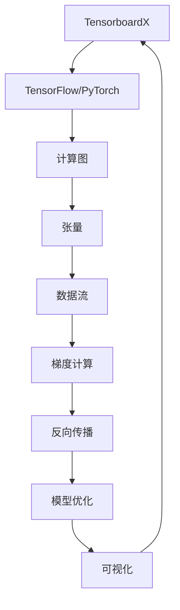

# 从零开始大模型开发与微调：实战：基于tensorboardX的训练可视化展示

## 1. 背景介绍

### 1.1 问题的由来

在深度学习领域中,训练大型神经网络模型是一项艰巨的任务。随着模型规模的不断增长,训练过程变得更加复杂和耗时。同时,模型的收敛情况、损失函数的变化趋势以及各种指标的变化情况等,都需要在训练过程中进行实时监控和可视化展示,以便研究人员及时发现问题并作出调整。

然而,传统的命令行输出方式难以满足可视化需求,且信息量有限。因此,如何实现高效、直观的训练过程可视化,成为了深度学习从业者面临的一大挑战。

### 1.2 研究现状

为了解决上述问题,TensorFlow等深度学习框架提供了TensorBoard等可视化工具,用于展示训练过程中的各种指标变化情况。但是,这些工具的使用往往需要一定的配置和编码工作,对于初学者来说,存在一定的学习曲线。

此外,现有的可视化工具功能单一,仅能展示基本的损失函数、准确率等指标,无法满足更加复杂的可视化需求。因此,需要开发更加强大和灵活的可视化解决方案,以适应不同场景下的需求。

### 1.3 研究意义

实现高效的训练过程可视化,对于深度学习模型的开发和优化具有重要意义:

1. **加速模型调试**:通过可视化工具,研究人员可以实时监控模型的训练情况,快速发现问题并进行调整,从而加快模型调试的速度。

2. **优化模型性能**:可视化工具可以展示模型在不同超参数设置下的表现,帮助研究人员选择最优参数,提高模型性能。

3. **促进知识共享**:通过可视化,研究人员可以更直观地展示模型的训练过程和结果,促进知识和经验的共享,推动整个深度学习领域的发展。

4. **降低深度学习门槛**:良好的可视化工具可以降低深度学习的学习曲线,使初学者更容易理解和掌握深度学习的核心概念和实践技能。

### 1.4 本文结构

本文将详细介绍如何使用TensorboardX实现深度学习模型训练过程的可视化展示。文章主要包括以下几个部分:

1. 核心概念与联系
2. 核心算法原理与具体操作步骤
3. 数学模型和公式详细讲解与举例说明
4. 项目实践:代码实例和详细解释说明
5. 实际应用场景
6. 工具和资源推荐
7. 总结:未来发展趋势与挑战
8. 附录:常见问题与解答

## 2. 核心概念与联系

在介绍TensorboardX的可视化功能之前,我们需要先了解一些核心概念和它们之间的联系。



1. **TensorboardX**是一个用于可视化TensorFlow和PyTorch模型训练过程的工具。它基于TensorFlow的TensorBoard进行了扩展和增强,支持PyTorch模型的可视化。

2. **TensorFlow/PyTorch**是两种流行的深度学习框架,它们提供了计算图的抽象,用于构建和训练神经网络模型。

3. **计算图**是一种数据流编程范式,它将计算过程表示为一个有向无环图,节点代表操作,边代表数据流。

4. **张量**是深度学习中的基本数据结构,它是一个多维数组,用于表示输入数据、模型参数和中间计算结果。

5. **数据流**是计算图中的数据传递过程,它沿着边从一个节点流向另一个节点。

6. **梯度计算**是深度学习中的核心操作之一,它通过反向传播算法计算模型参数的梯度,用于优化模型。

7. **反向传播**是一种计算梯度的算法,它从输出层开始,沿着计算图逆向传播误差,计算每个节点的梯度。

8. **模型优化**是根据计算得到的梯度,更新模型参数的过程,目的是最小化损失函数,提高模型性能。

9. **可视化**是将模型训练过程中的各种指标和数据以图形化的方式展示出来,方便研究人员观察和分析。

这些概念相互关联,构成了深度学习模型训练和优化的完整流程。TensorboardX作为可视化工具,与这些核心概念密切相关,为研究人员提供了直观的训练过程展示和分析手段。

## 3. 核心算法原理与具体操作步骤

### 3.1 算法原理概述

TensorboardX的可视化原理基于事件文件(Event File)的记录和读取。在模型训练过程中,TensorboardX会将各种指标数据写入事件文件,然后通过TensorBoard服务器读取这些事件文件,并将数据以图形化的方式展示在Web界面上。

该过程可以概括为以下几个步骤:

1. **创建Summary对象**:在模型训练代码中,使用TensorboardX提供的API创建Summary对象,用于记录需要可视化的指标数据。

2. **写入事件文件**:将Summary对象写入指定的事件文件中,事件文件采用Google的Protocol Buffer格式存储数据。

3. **启动TensorBoard服务器**:在命令行或脚本中启动TensorBoard服务器,指定要读取的事件文件路径。

4. **读取事件文件**:TensorBoard服务器会读取事件文件中的数据,并将其解析为可视化所需的格式。

5. **Web界面展示**:TensorBoard服务器会在Web界面上以图表、曲线等形式展示读取到的数据,供研究人员查看和分析。

这种基于事件文件的机制,使得TensorboardX可以在不影响模型训练性能的情况下,实现高效的数据记录和可视化。同时,由于事件文件采用统一的格式,TensorboardX可以与多种深度学习框架兼容,提供了良好的可扩展性。

### 3.2 算法步骤详解

接下来,我们将详细介绍TensorboardX可视化的具体操作步骤。

#### 步骤1:安装TensorboardX

```bash
pip install tensorboardX
```

#### 步骤2:在模型训练代码中添加可视化代码

```python
import tensorboardX as tx

# 创建SummaryWriter对象
writer = tx.SummaryWriter('logs')

# 记录标量数据
for epoch in range(num_epochs):
    # 训练代码...
    writer.add_scalar('Loss/train', loss.item(), epoch)
    writer.add_scalar('Accuracy/train', acc, epoch)

# 记录图像数据
writer.add_image('images', img_tensor, epoch)

# 记录模型计算图
writer.add_graph(model, input_to_model)

# 关闭SummaryWriter
writer.close()
```

在上述代码中,我们首先导入TensorboardX库,并创建一个SummaryWriter对象。该对象用于记录各种指标数据,包括标量、图像和模型计算图等。

接下来,在训练循环中,我们使用`add_scalar`方法记录每个epoch的损失值和准确率。对于图像数据,我们使用`add_image`方法将其记录下来。最后,我们使用`add_graph`方法记录模型的计算图。

所有这些数据都会被写入指定的事件文件(`logs`目录)中,供TensorBoard服务器读取和展示。

#### 步骤3:启动TensorBoard服务器

```bash
tensorboard --logdir=logs
```

在命令行中运行上述命令,即可启动TensorBoard服务器。`--logdir`参数指定了要读取的事件文件路径。

#### 步骤4:在Web界面查看可视化结果

启动TensorBoard服务器后,它会在命令行输出一个URL,通常是`http://localhost:6006`。打开这个URL,就可以在Web界面上查看各种可视化结果,包括损失函数曲线、准确率曲线、图像数据和模型计算图等。

### 3.3 算法优缺点

TensorboardX基于事件文件的可视化机制具有以下优点:

1. **高效**:事件文件的写入和读取操作与模型训练过程是分离的,因此不会影响训练性能。

2. **灵活**:可以记录和展示各种类型的数据,包括标量、图像、计算图等,满足不同场景的可视化需求。

3. **兼容性好**:由于采用统一的事件文件格式,TensorboardX可以与多种深度学习框架兼容,如TensorFlow、PyTorch等。

4. **易于使用**:TensorboardX提供了简单易用的API,降低了可视化的使用门槛。

5. **Web界面友好**:TensorBoard服务器提供了直观的Web界面,方便研究人员查看和分析可视化结果。

但是,TensorboardX也存在一些缺点和限制:

1. **可扩展性有限**:虽然可以记录和展示多种类型的数据,但对于一些特殊的可视化需求,TensorboardX可能无法满足,需要自行开发或寻找其他工具。

2. **实时性较差**:由于需要先将数据写入事件文件,再由TensorBoard服务器读取,因此可视化结果无法实时更新,存在一定延迟。

3. **性能瓶颈**:当记录的数据量非常大时,事件文件的读写操作可能会成为性能瓶颈,影响可视化效率。

4. **缺乏高级功能**:TensorboardX主要提供基本的可视化功能,缺乏一些高级功能,如交互式操作、自定义视图等。

### 3.4 算法应用领域

TensorboardX的可视化功能可以应用于多个领域,包括但不限于:

1. **深度学习模型训练**:这是TensorboardX最主要的应用场景。在训练深度学习模型时,可以使用TensorboardX实时监控损失函数、准确率等指标的变化情况,帮助调试和优化模型。

2. **模型评估和比较**:通过可视化不同模型或不同超参数设置下的训练过程,可以直观地比较它们的性能表现,选择最优模型。

3. **算法可视化**:除了深度学习模型,TensorboardX也可以用于可视化其他算法的执行过程,如机器学习算法、优化算法等,帮助理解和分析算法原理。

4. **数据分析**:TensorboardX不仅可以可视化模型指标,还可以展示原始数据或中间结果,为数据分析和探索提供辅助手段。

5. **教学和演示**:在深度学习课程或技术分享中,TensorboardX可以作为一种直观的演示工具,展示模型训练过程和结果,帮助学习者更好地理解相关概念。

总的来说,只要涉及到需要可视化展示的数据或过程,TensorboardX都可以发挥作用,为研究人员和开发人员提供有力的辅助手段。

## 4. 数学模型和公式详细讲解与举例说明

### 4.1 数学模型构建

在深度学习中,我们通常使用神经网络作为数学模型来拟合数据。神经网络由多层神经元组成,每层神经元通过权重矩阵和激活函数进行计算,最终输出预测结果。

假设我们有一个简单的全连接神经网络,包含一个输入层、一个隐藏层和一个输出层。输入层有$n$个神经元,隐藏层有$m$个神经元,输出层有$k$个神经元。我们可以用以下公式表示该神经网络:

$$
\begin{aligned}
\mathbf{h} &= \sigma(\mathbf{W}^{(1)}\mathbf{x} + \mathbf{b}^{(1)}) \
\mathbf{y} &= \mathbf{W}^{(2)}\mathbf{h} + \mathbf{b}^{(2)}
\end{aligned}
$$

其中:

- $\mathbf{x} \in \mathbb{R}^n$是输入向量
- $\mathbf{W}^{(1)} \in \mathbb{R}^{m \times n}$是输入层到隐藏层的权重矩阵
- $\math