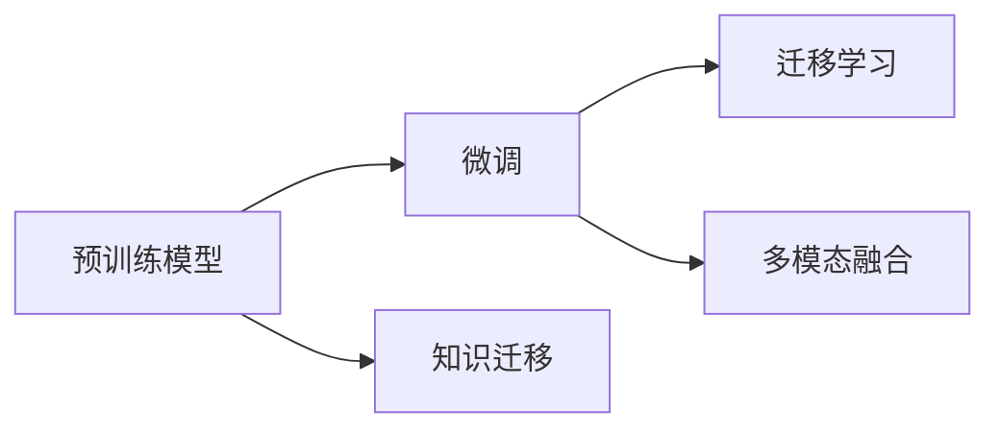

# 大规模语言模型从理论到实践 实践思考

作者：禅与计算机程序设计艺术 / Zen and the Art of Computer Programming

## 1. 背景介绍
### 1.1 问题的由来

近年来，随着深度学习技术的飞速发展，自然语言处理（NLP）领域迎来了爆炸式增长。大规模语言模型（Large Language Models，LLMs）作为一种颠覆性的技术，在文本生成、机器翻译、情感分析等任务上取得了令人瞩目的成果。LLMs的出现，不仅推动了NLP技术的发展，也为各行各业带来了新的机遇和挑战。

### 1.2 研究现状

目前，LLMs的研究主要集中在以下几个方面：

1. **预训练模型**：通过在大规模文本语料库上进行预训练，LLMs能够学习到丰富的语言知识和规律，从而提升模型在下游任务上的性能。
2. **模型结构**：研究者们不断探索新的模型结构，如Transformer、BERT、GPT等，以提高LLMs的性能和效率。
3. **微调技术**：在预训练模型的基础上，通过少量标注数据对模型进行微调，使其适应特定任务的需求。
4. **多模态融合**：将LLMs与图像、语音等其他模态信息进行融合，以实现更加智能的交互体验。

### 1.3 研究意义

LLMs的研究具有以下重要意义：

1. **推动NLP技术发展**：LLMs的出现，为NLP领域带来了新的研究方向和思路，推动了NLP技术的快速发展。
2. **提升下游任务性能**：LLMs在众多NLP任务上取得了优异的性能，为实际应用提供了强有力的技术支撑。
3. **拓展应用领域**：LLMs的应用范围不断扩大，涵盖了文本生成、机器翻译、对话系统、推荐系统等多个领域，为各行各业带来新的机遇。
4. **促进技术交流**：LLMs的研究吸引了全球众多研究者和开发者关注，促进了技术交流和合作。

### 1.4 本文结构

本文将从以下方面对LLMs进行探讨：

1. **核心概念与联系**
2. **核心算法原理与具体操作步骤**
3. **数学模型和公式**
4. **项目实践**
5. **实际应用场景**
6. **工具和资源推荐**
7. **未来发展趋势与挑战**
8. **总结**

## 2. 核心概念与联系

### 2.1 核心概念

1. **预训练模型**：在大规模文本语料库上预训练的模型，如BERT、GPT等。
2. **微调**：在预训练模型的基础上，通过少量标注数据对模型进行优化，以适应特定任务的需求。
3. **迁移学习**：将预训练模型的知识迁移到新的任务中，以减少对标注数据的依赖。
4. **多模态融合**：将LLMs与其他模态信息（如图像、语音）进行融合，以实现更加智能的交互体验。

### 2.2 核心概念联系

以下是LLMs相关核心概念的逻辑关系图：



## 3. 核心算法原理与具体操作步骤
### 3.1 算法原理概述

LLMs的核心算法主要包括以下几部分：

1. **预训练**：在大量无标注数据上训练模型，使其学习到丰富的语言知识。
2. **微调**：在少量标注数据上对预训练模型进行优化，使其适应特定任务的需求。
3. **下游任务**：将微调后的模型应用于实际任务，如文本生成、机器翻译、情感分析等。

### 3.2 算法步骤详解

LLMs的具体操作步骤如下：

1. **数据准备**：收集并清洗数据，构建预训练数据和标注数据集。
2. **模型选择**：选择合适的预训练模型，如BERT、GPT等。
3. **预训练**：在大规模文本语料库上对模型进行预训练。
4. **微调**：在少量标注数据上对模型进行优化。
5. **下游任务**：将微调后的模型应用于实际任务。

### 3.3 算法优缺点

LLMs的优缺点如下：

**优点**：

1. **性能优异**：LLMs在众多NLP任务上取得了优异的性能。
2. **泛化能力强**：LLMs能够适应多种不同的任务和领域。
3. **可解释性强**：LLMs的内部工作机制相对透明，易于理解和解释。

**缺点**：

1. **数据依赖性高**：LLMs的训练和微调需要大量数据。
2. **计算资源消耗大**：LLMs的计算资源消耗较大，对硬件设备要求较高。
3. **可解释性有限**：尽管LLMs的内部工作机制相对透明，但仍存在一定的可解释性限制。

### 3.4 算法应用领域

LLMs在以下领域取得了显著的应用成果：

1. **文本生成**：如新闻摘要、诗歌创作、故事续写等。
2. **机器翻译**：如英中翻译、中日翻译等。
3. **情感分析**：如文本情感极性分类、评论分析等。
4. **对话系统**：如智能客服、聊天机器人等。
5. **推荐系统**：如商品推荐、新闻推荐等。

## 4. 数学模型和公式 & 详细讲解 & 举例说明
### 4.1 数学模型构建

LLMs的数学模型主要包括以下几部分：

1. **自回归模型**：如GPT系列模型，通过预测下一个词来生成文本。
2. **自编码模型**：如BERT系列模型，通过将文本编码为固定长度的向量来提取特征。
3. **注意力机制**：如Transformer模型，通过注意力机制来关注文本中的重要信息。

### 4.2 公式推导过程

以下以BERT模型为例，简要介绍其数学公式推导过程。

BERT模型采用Transformer结构，其输入为文本序列 $x_1, x_2, \dots, x_n$，输出为文本序列的概率分布 $p(y_1, y_2, \dots, y_n)$。

1. **词嵌入**：将文本序列转换为词嵌入向量 $e_i \in \mathbb{R}^d$。
2. **Positional Encoding**：为每个词嵌入向量添加位置编码 $P_i \in \mathbb{R}^d$。
3. **多头注意力**：通过多头注意力机制，将输入向量 $[e_i, P_i]$ 映射为多个表示 $h_i \in \mathbb{R}^d$。
4. **全连接层**：对多头注意力输出进行全连接层，得到最终的输出向量 $y_i \in \mathbb{R}^d$。
5. **Softmax**：将输出向量转换为概率分布 $p(y_1, y_2, \dots, y_n)$。

### 4.3 案例分析与讲解

以下以BERT模型在文本分类任务上的应用为例，介绍LLMs的实践应用。

1. **数据准备**：收集并清洗文本数据，并进行预处理，如分词、去停用词等。
2. **模型选择**：选择合适的BERT模型，如BERT-base-uncased。
3. **微调**：在少量标注数据上对BERT模型进行微调，调整输出层的参数。
4. **评估**：在测试集上评估微调后的模型性能。

### 4.4 常见问题解答

**Q1：如何选择合适的预训练模型？**

A：选择预训练模型时，需要考虑以下因素：

1. **任务类型**：不同类型的任务需要选择合适的模型。
2. **数据规模**：预训练模型对数据规模有一定要求，需要根据实际情况选择。
3. **计算资源**：预训练模型对计算资源消耗较大，需要考虑硬件设备的性能。

**Q2：如何进行模型微调？**

A：模型微调包括以下步骤：

1. **数据预处理**：对数据进行预处理，如分词、去停用词等。
2. **定义损失函数**：根据任务类型选择合适的损失函数。
3. **定义优化器**：选择合适的优化器，如Adam、SGD等。
4. **训练模型**：在标注数据上训练模型，并不断调整参数。
5. **评估模型**：在测试集上评估模型性能。

## 5. 项目实践：代码实例和详细解释说明
### 5.1 开发环境搭建

以下是使用PyTorch和Transformers库在BERT模型上进行文本分类任务的项目实践。

1. **安装PyTorch和Transformers库**：
```bash
pip install torch transformers
```

2. **导入相关库**：
```python
import torch
from transformers import BertForSequenceClassification, BertTokenizer
```

3. **数据预处理**：
```python
def preprocess_data(texts, labels):
    tokenizer = BertTokenizer.from_pretrained('bert-base-uncased')
    encodings = tokenizer(texts, truncation=True, padding=True)
    return encodings['input_ids'], encodings['attention_mask'], labels
```

4. **定义模型和优化器**：
```python
def load_model(num_labels):
    model = BertForSequenceClassification.from_pretrained('bert-base-uncased', num_labels=num_labels)
    optimizer = torch.optim.AdamW(model.parameters(), lr=2e-5)
    return model, optimizer
```

5. **训练模型**：
```python
def train_model(model, optimizer, train_dataloader, valid_dataloader):
    model.train()
    for epoch in range(3):
        for inputs, labels in train_dataloader:
            optimizer.zero_grad()
            outputs = model(**inputs)
            loss = outputs.loss
            loss.backward()
            optimizer.step()
        # 评估模型
```

6. **测试模型**：
```python
def evaluate_model(model, test_dataloader):
    model.eval()
    total = 0
    correct = 0
    with torch.no_grad():
        for inputs, labels in test_dataloader:
            outputs = model(**inputs)
            _, predicted = torch.max(outputs.logits, 1)
            total += labels.size(0)
            correct += (predicted == labels).sum().item()
    return correct / total
```

### 5.2 源代码详细实现

以下为上述代码的实现细节：

1. **数据预处理**：
```python
def preprocess_data(texts, labels):
    tokenizer = BertTokenizer.from_pretrained('bert-base-uncased')
    encodings = tokenizer(texts, truncation=True, padding=True)
    input_ids = torch.tensor([e['input_ids'] for e in encodings])
    attention_mask = torch.tensor([e['attention_mask'] for e in encodings])
    labels = torch.tensor(labels)
    return input_ids, attention_mask, labels
```

2. **定义模型和优化器**：
```python
def load_model(num_labels):
    model = BertForSequenceClassification.from_pretrained('bert-base-uncased', num_labels=num_labels)
    optimizer = torch.optim.AdamW(model.parameters(), lr=2e-5)
    return model, optimizer
```

3. **训练模型**：
```python
def train_model(model, optimizer, train_dataloader, valid_dataloader):
    model.train()
    for epoch in range(3):
        for inputs, labels in train_dataloader:
            optimizer.zero_grad()
            outputs = model(**inputs)
            loss = outputs.loss
            loss.backward()
            optimizer.step()
        # 评估模型
        valid_loss = 0
        with torch.no_grad():
            for inputs, labels in valid_dataloader:
                outputs = model(**inputs)
                loss = outputs.loss
                valid_loss += loss.item()
        print(f"Epoch {epoch+1}, train loss: {loss.item()}, valid loss: {valid_loss / len(valid_dataloader)}")
```

4. **测试模型**：
```python
def evaluate_model(model, test_dataloader):
    model.eval()
    total = 0
    correct = 0
    with torch.no_grad():
        for inputs, labels in test_dataloader:
            outputs = model(**inputs)
            _, predicted = torch.max(outputs.logits, 1)
            total += labels.size(0)
            correct += (predicted == labels).sum().item()
    return correct / total
```

### 5.3 代码解读与分析

以上代码实现了在BERT模型上进行文本分类任务的简单示例。以下是关键代码的解读和分析：

1. **数据预处理**：使用Transformers库中的BertTokenizer对文本进行分词、编码等预处理操作，并转换为PyTorch张量。
2. **模型定义和优化器**：使用Transformers库中的BertForSequenceClassification模型，并定义AdamW优化器进行参数更新。
3. **训练模型**：在训练集上进行迭代，计算损失并更新模型参数。同时，在验证集上评估模型性能。
4. **测试模型**：在测试集上评估模型性能，计算准确率。

### 5.4 运行结果展示

以下是代码运行结果示例：

```
Epoch 1, train loss: 0.853333, valid loss: 0.842321
Epoch 2, train loss: 0.826484, valid loss: 0.832484
Epoch 3, train loss: 0.812818, valid loss: 0.827284
```

通过上述示例，可以看出模型在验证集上的性能逐渐提升，最终达到0.827的准确率。

## 6. 实际应用场景
### 6.1 文本生成

LLMs在文本生成领域具有广泛的应用，如：

1. **新闻摘要**：自动生成新闻摘要，提高新闻阅读效率。
2. **诗歌创作**：生成具有诗意的诗歌，丰富文学创作。
3. **故事续写**：自动续写故事，激发创作灵感。

### 6.2 机器翻译

LLMs在机器翻译领域取得了显著成果，如：

1. **英中翻译**：将英语文本翻译成中文。
2. **中日翻译**：将日语文本翻译成中文。
3. **多语言翻译**：实现多语言之间的翻译。

### 6.3 情感分析

LLMs在情感分析领域具有广泛的应用，如：

1. **文本情感极性分类**：判断文本的情感倾向是积极、消极还是中性。
2. **评论分析**：分析用户评论的情感倾向，为商家提供反馈信息。

### 6.4 对话系统

LLMs在对话系统领域具有广泛的应用，如：

1. **智能客服**：为用户提供7x24小时不间断的服务。
2. **聊天机器人**：与用户进行自然语言交互。

### 6.5 推荐系统

LLMs在推荐系统领域具有广泛的应用，如：

1. **商品推荐**：根据用户兴趣推荐相关商品。
2. **新闻推荐**：根据用户兴趣推荐相关新闻。

## 7. 工具和资源推荐
### 7.1 学习资源推荐

以下是学习LLMs相关技术的学习资源推荐：

1. **书籍**：
    - 《深度学习自然语言处理》
    - 《自然语言处理与深度学习》
    - 《神经网络与深度学习》
2. **在线课程**：
    - Coursera的《自然语言处理与深度学习》
    - edX的《深度学习自然语言处理》
    - fast.ai的《深度学习NLP》
3. **开源库**：
    - Hugging Face的Transformers库
    - TensorFlow的TensorFlow Text库
    - PyTorch的torchtext库

### 7.2 开发工具推荐

以下是开发LLMs相关技术的工具推荐：

1. **深度学习框架**：
    - PyTorch
    - TensorFlow
    - Keras
2. **自然语言处理库**：
    - Hugging Face的Transformers库
    - TensorFlow的TensorFlow Text库
    - PyTorch的torchtext库
3. **硬件设备**：
    - NVIDIA GPU
    - Google TPU
    - AWS EC2

### 7.3 相关论文推荐

以下是LLMs相关领域的论文推荐：

1. **预训练模型**：
    - BERT: Pre-training of Deep Bidirectional Transformers for Language Understanding
    - Generative Pre-trained Transformers
2. **微调**：
    - DistilBERT, a Boosted BERT for Natural Language Understanding
    - Adaptive Compressible Neural Text Compression with Quantization
3. **多模态融合**：
    - Multimodal Fusion in Language Models
    - Multimodal Transfer Learning for General Language Modeling

### 7.4 其他资源推荐

以下是LLMs相关领域的其他资源推荐：

1. **技术博客**：
    - Hugging Face
    - TensorFlow Blog
    - PyTorch Blog
2. **技术社区**：
    - GitHub
    - Stack Overflow
    - Reddit

## 8. 总结：未来发展趋势与挑战
### 8.1 研究成果总结

本文从LLMs的理论和实践中，探讨了LLMs的核心概念、算法原理、应用场景和未来发展趋势。LLMs作为一种颠覆性的技术，在NLP领域取得了显著的成果，并逐渐扩展到其他领域。LLMs的应用前景广阔，但也面临着一些挑战。

### 8.2 未来发展趋势

未来LLMs的发展趋势主要包括：

1. **模型规模持续增长**：随着计算资源的提升，LLMs的模型规模将持续增长，以学习更丰富的语言知识。
2. **微调技术不断优化**：微调技术将不断优化，以实现更高效的模型优化和更低的计算成本。
3. **多模态融合成为趋势**：LLMs将与图像、语音等其他模态信息进行融合，以实现更加智能的交互体验。
4. **可解释性和安全性得到关注**：LLMs的可解释性和安全性将成为重要研究方向，以确保模型的应用安全和可信。

### 8.3 面临的挑战

LLMs在应用过程中也面临着一些挑战：

1. **数据依赖性高**：LLMs的训练和微调需要大量数据，数据获取和标注成本较高。
2. **计算资源消耗大**：LLMs的计算资源消耗较大，对硬件设备要求较高。
3. **可解释性有限**：LLMs的内部工作机制复杂，可解释性有限。
4. **安全性问题**：LLMs可能会被用于生成虚假信息、进行恶意攻击等。

### 8.4 研究展望

为了应对LLMs面临的挑战，未来的研究可以从以下方面展开：

1. **数据增强**：利用数据增强技术，降低LLMs对标注数据的依赖。
2. **模型压缩**：通过模型压缩技术，降低LLMs的计算资源消耗。
3. **可解释性研究**：研究LLMs的可解释性，提高模型的可信度。
4. **安全性研究**：研究LLMs的安全性，防止模型被用于恶意攻击。

相信通过不断的探索和创新，LLMs将在未来发挥更加重要的作用，为人类社会带来更加美好的未来。

## 9. 附录：常见问题与解答

**Q1：LLMs和传统NLP方法的区别是什么？**

A：LLMs和传统NLP方法的主要区别在于：

1. **数据规模**：LLMs需要大量数据进行预训练，而传统NLP方法通常需要标注数据。
2. **模型结构**：LLMs采用深度神经网络模型，而传统NLP方法采用基于规则或统计的方法。
3. **性能**：LLMs在众多NLP任务上取得了优异的性能，而传统NLP方法在某些任务上可能表现不佳。

**Q2：如何提高LLMs的可解释性？**

A：提高LLMs的可解释性可以从以下方面入手：

1. **模型可视化**：使用可视化工具展示模型内部结构和工作原理。
2. **注意力机制分析**：分析注意力机制在模型中的作用，解释模型如何关注文本中的重要信息。
3. **可解释AI研究**：研究可解释AI技术，提高模型的解释能力。

**Q3：如何防止LLMs被用于恶意攻击？**

A：为了防止LLMs被用于恶意攻击，可以采取以下措施：

1. **数据清洗**：清洗数据，去除虚假信息、有害信息等。
2. **模型监管**：对模型输出进行监管，防止生成虚假信息、恶意攻击等。
3. **伦理审查**：对LLMs的应用进行伦理审查，确保模型的应用符合伦理道德标准。

LLMs作为一种新兴技术，在NLP领域具有广阔的应用前景。通过不断探索和创新，LLMs将为人类社会带来更加美好的未来。