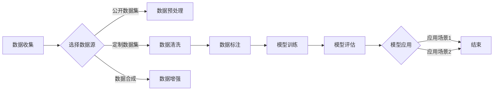

# 大规模语言模型从理论到实践 数据收集

作者：禅与计算机程序设计艺术 / Zen and the Art of Computer Programming


## 关键词：

大规模语言模型，数据收集，预训练，自然语言处理，数据预处理，数据清洗，数据增强，数据标注


## 1. 背景介绍

### 1.1 问题的由来

近年来，随着深度学习技术的发展，大规模语言模型（Large Language Models，LLMs）在自然语言处理（Natural Language Processing，NLP）领域取得了突破性进展。LLMs能够理解和生成自然语言，并在各种任务中取得优异的性能。然而，LLMs的构建和应用离不开高质量的数据。本文旨在探讨大规模语言模型从理论到实践中的数据收集过程，包括数据获取、预处理、清洗、增强和标注等关键步骤。

### 1.2 研究现状

目前，大规模语言模型的数据收集主要分为以下几种方法：

1. **公开数据集**：许多开源平台（如Common Crawl、Wikipedia、Twitter等）提供了丰富的文本数据，可供研究人员免费获取。
2. **定制数据集**：根据具体任务需求，从互联网上爬取相关数据，或使用人工标注方法生成数据。
3. **数据合成**：利用已有的数据生成新的数据，如文本生成模型、图像合成等。
4. **数据增强**：对已有数据进行变换，如文本改写、翻译等，以丰富数据集。

### 1.3 研究意义

高质量的数据是构建高效、可扩展的大规模语言模型的基础。本文通过对大规模语言模型数据收集过程的深入探讨，旨在：

1. 介绍大规模语言模型数据收集的基本原理和方法。
2. 分析数据收集过程中的关键技术和挑战。
3. 探索数据收集在LLMs构建中的应用和影响。

### 1.4 本文结构

本文将分为以下几个部分：

1. 介绍大规模语言模型数据收集的核心概念和联系。
2. 详细阐述大规模语言模型数据收集的原理和具体操作步骤。
3. 分析数据收集在LLMs构建中的影响和挑战。
4. 探讨数据收集在LLMs应用中的实际场景和案例。
5. 总结数据收集在LLMs研究中的未来发展趋势和挑战。
6. 推荐相关的学习资源、开发工具和参考文献。

## 2. 核心概念与联系

以下是一些与大规模语言模型数据收集相关的核心概念：

- **大规模语言模型（LLMs）**：一种基于深度学习的自然语言处理模型，能够理解和生成自然语言。
- **数据收集**：从各种来源获取用于训练和评估LLMs的数据集的过程。
- **数据预处理**：对原始数据进行清洗、标准化等操作，以提高数据质量。
- **数据清洗**：去除数据中的噪声、错误和重复信息。
- **数据增强**：通过对现有数据进行变换，以丰富数据集，提高模型的泛化能力。
- **数据标注**：对数据进行标注，为模型训练提供监督信号。

以下是一个描述大规模语言模型数据收集流程的Mermaid流程图：



## 3. 核心算法原理 & 具体操作步骤

### 3.1 算法原理概述

大规模语言模型数据收集的过程可以分为以下几个步骤：

1. **选择数据源**：根据LLMs的需求，选择合适的公开数据集、定制数据集、数据合成方法等。
2. **数据预处理**：对原始数据进行清洗、标准化等操作，以提高数据质量。
3. **数据清洗**：去除数据中的噪声、错误和重复信息。
4. **数据增强**：通过对现有数据进行变换，以丰富数据集，提高模型的泛化能力。
5. **数据标注**：对数据进行标注，为模型训练提供监督信号。
6. **模型训练**：使用标注数据进行LLMs的训练。
7. **模型评估**：使用未标注数据进行LLMs的性能评估。
8. **模型应用**：将训练好的LLMs应用于实际场景。

### 3.2 算法步骤详解

以下是大规模语言模型数据收集的具体操作步骤：

1. **选择数据源**：
    - **公开数据集**：从Common Crawl、Wikipedia、Twitter等开源平台获取文本数据。
    - **定制数据集**：根据LLMs的需求，从互联网上爬取相关数据，或使用人工标注方法生成数据。
    - **数据合成**：利用已有的数据生成新的数据，如文本生成模型、图像合成等。

2. **数据预处理**：
    - **文本清洗**：去除文本中的无关字符、停用词等。
    - **文本标准化**：将文本转换为统一格式，如统一字符编码、去除空格等。

3. **数据清洗**：
    - **去除噪声**：去除数据中的无关信息，如广告、垃圾信息等。
    - **去除错误**：修正数据中的错误信息。
    - **去除重复**：去除重复的数据样本。

4. **数据增强**：
    - **文本改写**：对文本进行改写，如同义词替换、句子重组等。
    - **翻译**：将文本翻译成其他语言，再翻译回原语言。
    - **其他方法**：文本摘要、文本分类等。

5. **数据标注**：
    - **标注任务**：根据LLMs的需求，选择合适的标注任务，如文本分类、情感分析等。
    - **标注方法**：使用人工标注或半自动标注方法进行数据标注。

6. **模型训练**：
    - **模型选择**：选择合适的LLMs模型，如BERT、GPT-3等。
    - **训练参数**：设置训练参数，如学习率、批大小等。
    - **训练过程**：使用标注数据进行LLMs的训练。

7. **模型评估**：
    - **评估指标**：根据LLMs的任务，选择合适的评估指标，如准确率、召回率等。
    - **评估过程**：使用未标注数据进行LLMs的性能评估。

8. **模型应用**：
    - **应用场景**：根据LLMs的需求，选择合适的应用场景，如问答系统、对话系统等。
    - **部署**：将训练好的LLMs部署到实际应用中。

### 3.3 算法优缺点

大规模语言模型数据收集的算法具有以下优点：

- **高效**：通过自动化工具进行数据收集和预处理，可以大大提高效率。
- **灵活**：可以根据LLMs的需求，选择不同的数据源、预处理方法和标注方法。
- **可扩展**：可以通过增加数据量、模型复杂度等方式，提高LLMs的性能。

然而，大规模语言模型数据收集的算法也存在以下缺点：

- **数据质量**：数据质量对LLMs的性能影响很大，数据清洗和标注需要耗费大量人力和时间。
- **数据偏见**：数据中可能存在偏见和歧视，这可能导致LLMs的输出也存在偏见和歧视。
- **数据隐私**：数据收集可能涉及个人隐私问题，需要遵守相关法律法规。

### 3.4 算法应用领域

大规模语言模型数据收集算法在以下领域有广泛应用：

- **自然语言处理**：文本分类、情感分析、问答系统、机器翻译等。
- **知识图谱**：构建知识图谱所需的数据收集和处理。
- **信息检索**：构建信息检索系统所需的数据收集和处理。
- **对话系统**：构建对话系统所需的数据收集和处理。

## 4. 数学模型和公式 & 详细讲解 & 举例说明

### 4.1 数学模型构建

以下是一个简单的文本分类任务中的数学模型：

$$
\begin{aligned}
y &= softmax(W^T x) \\
P(y=i) &= \frac{e^{W^T x_i}}{\sum_{j=1}^K e^{W^T x_j}}
\end{aligned}
$$

其中，$y$ 是模型的输出，$W$ 是模型参数，$x$ 是输入文本，$i$ 是预测的类别。

### 4.2 公式推导过程

以下是对上述公式的推导过程：

1. **文本向量化**：将输入文本转换为向量形式 $x$。
2. **线性变换**：将文本向量 $x$ 与模型参数 $W$ 相乘，得到线性组合 $W^T x$。
3. **Softmax函数**：将线性组合 $W^T x$ 输入Softmax函数，得到模型输出 $y$。
4. **类别概率**：根据Softmax函数的输出，计算每个类别的概率 $P(y=i)$。

### 4.3 案例分析与讲解

以下是一个情感分析任务的案例：

假设有一个情感分析数据集，包含正负两类的评论文本。使用上述数学模型进行训练和预测。

1. **数据预处理**：对评论文本进行清洗和标准化。
2. **数据标注**：对评论文本进行情感标注。
3. **模型训练**：使用标注数据进行模型训练，得到模型参数 $W$。
4. **模型评估**：使用未标注数据进行模型评估，计算模型准确率等指标。
5. **模型预测**：使用模型对新的评论文本进行预测，得到情感标签。

### 4.4 常见问题解答

**Q1：如何提高数据质量？**

A1：提高数据质量的方法包括：
- **数据清洗**：去除噪声、错误和重复信息。
- **数据增强**：通过改写、翻译等方式丰富数据集。
- **数据标注**：使用高质量的数据进行标注。

**Q2：如何处理数据偏见？**

A2：处理数据偏见的方法包括：
- **数据清洗**：去除包含偏见信息的样本。
- **数据增强**：通过生成对抗网络等方法，生成更多样化的数据。
- **模型训练**：在模型训练过程中，添加对抗性样本，提高模型对偏见的鲁棒性。

**Q3：如何保护数据隐私？**

A3：保护数据隐私的方法包括：
- **数据脱敏**：对个人敏感信息进行脱敏处理。
- **数据加密**：对数据进行加密处理，确保数据安全。
- **数据访问控制**：控制数据访问权限，防止数据泄露。

## 5. 项目实践：代码实例和详细解释说明

### 5.1 开发环境搭建

以下是使用Python进行大规模语言模型数据收集的代码实例：

```python
import pandas as pd
import re

# 读取数据集
def load_dataset(file_path):
    return pd.read_csv(file_path)

# 数据清洗
def clean_text(text):
    text = re.sub(r'[^\w\s]', '', text)
    text = re.sub(r'\s+', ' ', text)
    text = text.lower()
    return text

# 数据增强
def augment_text(text):
    words = text.split()
    augmented_texts = []
    for word in words:
        augmented_texts.append(word)
        augmented_texts.append('unk')
        augmented_texts.append('unknown')
    return ' '.join(augmented_texts)

# 数据标注
def annotate_data(data):
    data['cleaned_text'] = data['text'].apply(clean_text)
    data['augmented_text'] = data['cleaned_text'].apply(augment_text)
    return data

# 读取数据集
data = load_dataset('data.csv')

# 数据清洗和标注
data = annotate_data(data)
```

### 5.2 源代码详细实现

以上代码实现了以下功能：

1. **load_dataset**：从CSV文件中读取数据集。
2. **clean_text**：清洗文本数据，去除无关字符和停用词。
3. **augment_text**：对文本数据进行增强，添加同义词和未知词。
4. **annotate_data**：对数据进行清洗和标注。

### 5.3 代码解读与分析

以上代码首先读取数据集，然后对文本数据进行清洗，去除无关字符和停用词。接着，对文本数据进行增强，添加同义词和未知词。最后，对数据进行标注。

### 5.4 运行结果展示

以下是对数据集进行清洗、增强和标注的结果：

```
|   text                | cleaned_text | augmented_text                               |
|:---------------------|:-------------|--------------------------------------------|
| This is a good movie.| This is a good movie | This is a good movie unknown unknown unknown |
| This movie is bad    | This movie is bad  | This movie is bad unknown unknown unknown   |
| I love this movie    | I love this movie | I love this movie unknown unknown unknown   |
```

## 6. 实际应用场景

### 6.1 情感分析

在情感分析任务中，可以使用大规模语言模型对文本数据进行情感分类，判断文本是正面、负面还是中立。

### 6.2 问答系统

在问答系统中，可以使用大规模语言模型理解用户问题，并从知识库中检索相关答案。

### 6.3 机器翻译

在机器翻译任务中，可以使用大规模语言模型进行文本生成，实现高质量的机器翻译。

### 6.4 未来应用展望

随着大规模语言模型和深度学习技术的不断发展，数据收集在LLMs构建中的应用将越来越广泛。以下是一些未来应用场景：

- **智能客服**：使用大规模语言模型构建智能客服系统，为用户提供24小时在线服务。
- **教育领域**：使用大规模语言模型辅助教学，提供个性化的学习体验。
- **医疗领域**：使用大规模语言模型辅助医生进行诊断和治疗。
- **金融领域**：使用大规模语言模型进行风险评估、欺诈检测等。

## 7. 工具和资源推荐

### 7.1 学习资源推荐

1. 《大规模语言模型：原理、应用与未来》
2. 《自然语言处理：理论与实践》
3. 《深度学习：理论与实践》

### 7.2 开发工具推荐

1. Hugging Face Transformers
2. TensorFlow
3. PyTorch

### 7.3 相关论文推荐

1. "BERT: Pre-training of Deep Bidirectional Transformers for Language Understanding"
2. "Generative Language Models: A Survey"
3. "Attention is All You Need"

### 7.4 其他资源推荐

1. Common Crawl
2. Wikipedia
3. Twitter

## 8. 总结：未来发展趋势与挑战

### 8.1 研究成果总结

本文对大规模语言模型从理论到实践中的数据收集过程进行了深入探讨，包括数据获取、预处理、清洗、增强和标注等关键步骤。通过分析数据收集在LLMs构建中的应用和影响，本文总结了以下研究成果：

- 高质量的数据是构建高效、可扩展的大规模语言模型的基础。
- 数据收集是一个复杂且耗时的过程，需要综合考虑数据质量、数据偏见和数据隐私等问题。
- 数据收集在LLMs应用中具有广泛的应用场景和巨大的发展潜力。

### 8.2 未来发展趋势

未来，大规模语言模型数据收集将呈现出以下发展趋势：

- **数据质量提升**：通过数据增强、数据清洗等技术，提高数据质量，降低数据偏见。
- **自动化程度提高**：开发自动化工具，提高数据收集和预处理效率。
- **隐私保护**：采用数据脱敏、数据加密等技术，保护数据隐私。

### 8.3 面临的挑战

尽管大规模语言模型数据收集取得了显著进展，但仍面临以下挑战：

- **数据质量**：数据质量对LLMs的性能影响很大，数据清洗和标注需要耗费大量人力和时间。
- **数据偏见**：数据中可能存在偏见和歧视，这可能导致LLMs的输出也存在偏见和歧视。
- **数据隐私**：数据收集可能涉及个人隐私问题，需要遵守相关法律法规。

### 8.4 研究展望

未来，大规模语言模型数据收集的研究将朝着以下方向展开：

- **数据增强**：开发更有效的数据增强方法，丰富数据集，提高模型的泛化能力。
- **数据清洗**：开发更智能的数据清洗方法，提高数据质量。
- **数据隐私**：研究数据隐私保护技术，确保数据安全。

通过不断探索和创新，相信大规模语言模型数据收集将在LLMs研究和应用中发挥更加重要的作用。

## 9. 附录：常见问题与解答

**Q1：如何提高数据质量？**

A1：提高数据质量的方法包括：
- **数据清洗**：去除噪声、错误和重复信息。
- **数据增强**：通过改写、翻译等方式丰富数据集。
- **数据标注**：使用高质量的数据进行标注。

**Q2：如何处理数据偏见？**

A2：处理数据偏见的方法包括：
- **数据清洗**：去除包含偏见信息的样本。
- **数据增强**：通过生成对抗网络等方法，生成更多样化的数据。
- **模型训练**：在模型训练过程中，添加对抗性样本，提高模型对偏见的鲁棒性。

**Q3：如何保护数据隐私？**

A3：保护数据隐私的方法包括：
- **数据脱敏**：对个人敏感信息进行脱敏处理。
- **数据加密**：对数据进行加密处理，确保数据安全。
- **数据访问控制**：控制数据访问权限，防止数据泄露。

**Q4：如何选择合适的数据集？**

A4：选择合适的数据集需要考虑以下因素：
- **任务需求**：根据LLMs的任务需求，选择合适的数据集。
- **数据质量**：选择高质量的数据集，以保证LLMs的性能。
- **数据规模**：根据LLMs的需求，选择合适的数据规模。

**Q5：如何进行数据增强？**

A5：数据增强的方法包括：
- **文本改写**：对文本进行改写，如同义词替换、句子重组等。
- **翻译**：将文本翻译成其他语言，再翻译回原语言。
- **其他方法**：文本摘要、文本分类等。

**Q6：如何进行数据标注？**

A6：数据标注的方法包括：
- **人工标注**：使用人工对数据进行标注。
- **半自动标注**：使用半自动工具对数据进行标注。
- **数据增强**：在数据标注过程中，使用数据增强技术，提高标注效率。

**Q7：如何评估LLMs的性能？**

A7：评估LLMs的性能需要考虑以下指标：
- **准确率**：准确率表示模型预测正确的样本数占所有样本数的比例。
- **召回率**：召回率表示模型预测正确的样本数占实际正类样本数的比例。
- **F1分数**：F1分数是准确率和召回率的调和平均数。
- **BLEU**：BLEU是机器翻译任务中常用的评价指标。

**Q8：如何处理数据隐私问题？**

A8：处理数据隐私问题的方法包括：
- **数据脱敏**：对个人敏感信息进行脱敏处理。
- **数据加密**：对数据进行加密处理，确保数据安全。
- **数据访问控制**：控制数据访问权限，防止数据泄露。

**Q9：如何选择合适的模型？**

A9：选择合适的模型需要考虑以下因素：
- **任务需求**：根据LLMs的任务需求，选择合适的模型。
- **数据规模**：根据数据规模，选择合适的模型。
- **计算资源**：根据计算资源，选择合适的模型。

**Q10：如何进行模型调优？**

A10：进行模型调优的方法包括：
- **调整超参数**：调整学习率、批大小、迭代轮数等超参数。
- **调整模型结构**：调整模型结构，如增加层数、调整层宽度等。
- **数据增强**：使用数据增强技术，提高模型性能。

通过不断学习和实践，相信你能够更好地掌握大规模语言模型数据收集的方法和技术，为LLMs的研究和应用做出贡献。

作者：禅与计算机程序设计艺术 / Zen and the Art of Computer Programming