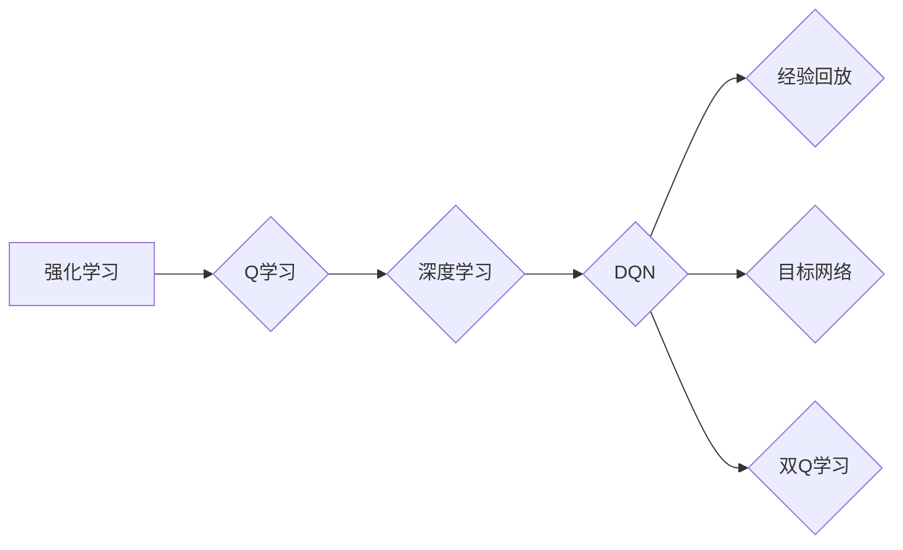

# 大语言模型原理与工程实践：DQN 训练：探索策略

作者：禅与计算机程序设计艺术 / Zen and the Art of Computer Programming

## 1. 背景介绍
### 1.1 问题的由来

随着深度学习技术的飞速发展，强化学习（Reinforcement Learning，RL）在计算机科学、机器人、自然语言处理等领域取得了显著的成果。其中，DQN（Deep Q-Network）作为一种基于深度学习的强化学习算法，因其强大的学习能力和良好的性能而备受关注。

DQN利用深度神经网络来近似Q函数，通过环境交互不断学习最佳策略，实现智能体的自主决策。在游戏、机器人控制、自动驾驶等领域，DQN都取得了令人瞩目的成果。

然而，DQN的训练过程复杂，容易出现不稳定、收敛慢、样本效率低等问题。如何优化DQN的训练过程，提高训练效率和性能，成为了强化学习领域的一个重要研究方向。

### 1.2 研究现状

针对DQN训练过程中存在的问题，研究者们提出了许多优化策略，主要包括以下几个方面：

- **经验回放（Experience Replay）**：通过存储和随机抽取历史经验，缓解样本相关性，提高样本效率。
- **目标网络（Target Network）**：使用额外的网络来更新Q值，提高收敛速度和稳定性。
- **双Q学习（Double Q-Learning）**：使用两个网络分别计算Q值，避免值估计偏差。
- **优先级采样（Priority Sampling）**：根据经验的重要性进行采样，提高学习效率。
- **确定性策略梯度（Deterministic Policy Gradient，DPG）**：使用确定性策略，提高样本效率。
- **分布式训练**：利用多台设备进行并行训练，提高训练速度。

### 1.3 研究意义

优化DQN的训练过程，提高训练效率和性能，具有重要的研究意义：

- **提高样本效率**：通过经验回放、优先级采样等方法，减少训练所需样本数量，降低训练成本。
- **提高收敛速度**：通过目标网络、双Q学习等方法，提高收敛速度，缩短训练时间。
- **提高稳定性**：通过经验回放、优先级采样等方法，提高训练稳定性，避免陷入局部最优。
- **提高泛化能力**：通过经验回放、优先级采样等方法，提高模型的泛化能力，使其能够在不同的环境中表现良好。

### 1.4 本文结构

本文将围绕DQN训练的优化策略展开，主要内容包括：

- 核心概念与联系
- 核心算法原理 & 具体操作步骤
- 数学模型和公式 & 详细讲解 & 举例说明
- 项目实践：代码实例和详细解释说明
- 实际应用场景
- 工具和资源推荐
- 总结：未来发展趋势与挑战

## 2. 核心概念与联系

为更好地理解DQN训练的优化策略，本节将介绍几个密切相关的核心概念：

- **强化学习（Reinforcement Learning，RL）**：一种使智能体通过与环境的交互来学习最优策略的方法。
- **Q学习（Q-Learning）**：一种基于值函数的强化学习算法，通过学习Q值来选择最佳行动。
- **深度学习（Deep Learning，DL）**：一种基于深度神经网络的机器学习技术，可以自动从数据中学习特征和模式。
- **经验回放（Experience Replay）**：将智能体在环境中积累的经验存储下来，并在训练过程中随机抽取经验进行学习。
- **目标网络（Target Network）**：使用额外的网络来更新Q值，提高收敛速度和稳定性。
- **双Q学习（Double Q-Learning）**：使用两个网络分别计算Q值，避免值估计偏差。

它们的逻辑关系如下图所示：



可以看出，DQN作为Q学习的一种深度学习实现，通过引入经验回放、目标网络、双Q学习等优化策略，提高了训练效率和性能。

## 3. 核心算法原理 & 具体操作步骤
### 3.1 算法原理概述

DQN是一种基于深度学习的强化学习算法，通过学习Q函数来选择最佳行动。Q函数是一个状态-行动价值函数，表示在某个状态下采取某个行动所能获得的最大期望回报。

DQN的训练过程如下：

1. 初始化一个深度神经网络，作为Q网络。
2. 初始化一个目标网络，与Q网络具有相同的结构。
3. 使用随机策略在环境中进行交互，收集经验。
4. 将收集到的经验存储到经验回放缓冲区中。
5. 从经验回放缓冲区中随机抽取一批经验，包括状态、行动、奖励和下一状态。
6. 使用Q网络计算目标Q值：$$
Q^*(s,a) = r + \gamma \max_{a'} Q(s',a')
$$
其中，$Q^*(s,a)$ 为目标Q值，$r$ 为奖励，$\gamma$ 为折扣因子，$s'$ 为下一状态，$a'$ 为在状态 $s'$ 下的最佳行动。
7. 使用目标网络计算替代Q值：$$
\hat{Q}(s,a) = \max_{a'} \hat{Q}(s',a')
$$
其中，$\hat{Q}(s,a)$ 为替代Q值。
8. 计算损失函数：$$
L(Q(s,a),Q^*(s,a)) = (Q(s,a) - Q^*(s,a))^2
$$
9. 使用反向传播算法更新Q网络参数。
10. 定期更新目标网络参数，使其与Q网络参数保持一定的差距。

### 3.2 算法步骤详解

**步骤 1：初始化**

初始化一个深度神经网络，作为Q网络。网络结构通常由输入层、隐藏层和输出层组成。输入层接收环境状态，输出层输出每个行动对应的Q值。

**步骤 2：初始化目标网络**

初始化一个与Q网络具有相同结构的目标网络。目标网络的参数初始值与Q网络相同，后续会定期更新。

**步骤 3：环境交互**

使用随机策略在环境中进行交互，收集经验。随机策略可以根据需要设计，例如ε-贪婪策略。

**步骤 4：经验回放**

将收集到的经验存储到经验回放缓冲区中。经验回放缓冲区可以采用固定长度环形缓冲区或优先级队列。

**步骤 5：经验抽取**

从经验回放缓冲区中随机抽取一批经验，包括状态、行动、奖励和下一状态。

**步骤 6：计算目标Q值**

使用Q网络计算目标Q值。目标Q值表示在下一个状态采取最佳行动所能获得的最大期望回报。

**步骤 7：计算替代Q值**

使用目标网络计算替代Q值。替代Q值表示在下一个状态采取最佳行动所能获得的最大期望回报。

**步骤 8：计算损失函数**

计算损失函数。损失函数用于衡量Q网络预测的Q值与目标Q值之间的差距。

**步骤 9：反向传播**

使用反向传播算法更新Q网络参数。反向传播算法可以采用梯度下降等方法。

**步骤 10：更新目标网络**

定期更新目标网络参数，使其与Q网络参数保持一定的差距。

### 3.3 算法优缺点

**优点**：

- **强大的学习能力和灵活性**：DQN可以应用于各种强化学习任务，具有广泛的适用性。
- **能够处理高维输入**：DQN可以使用深度神经网络来处理高维输入，例如图像和视频。
- **数据效率高**：DQN可以利用经验回放技术提高样本效率，降低训练成本。

**缺点**：

- **训练不稳定**：DQN的训练过程容易受到随机性和初始参数的影响，导致训练结果不稳定。
- **收敛速度慢**：DQN的训练过程可能需要很长时间才能收敛到最优解。
- **样本效率低**：DQN需要大量样本才能收敛到最优解，导致训练成本较高。

### 3.4 算法应用领域

DQN在以下领域取得了显著的成果：

- **游戏**：例如在OpenAI的Atari 2600游戏库中，DQN已经超越了人类玩家的表现。
- **机器人控制**：例如在机器人控制、自动驾驶等领域，DQN可以用于控制机器人的行动。
- **资源管理**：例如在数据中心、电网等领域，DQN可以用于优化资源分配。

## 4. 数学模型和公式 & 详细讲解 & 举例说明
### 4.1 数学模型构建

本节将使用数学语言对DQN进行更严格的刻画。

假设环境为一个马尔可夫决策过程（MDP），状态空间为 $\mathcal{S}$，行动空间为 $\mathcal{A}$，奖励函数为 $R:\mathcal{S} \times \mathcal{A} \rightarrow \mathbb{R}$，状态转移概率为 $P:\mathcal{S} \times \mathcal{A} \rightarrow \mathcal{S}$。

定义Q函数为：

$$
Q(s,a) = E[R(s,a) + \gamma \max_{a'} Q(s',a') | s,a]
$$

其中，$E$ 表示期望，$\gamma$ 表示折扣因子，$s'$ 表示下一状态，$a'$ 表示在状态 $s'$ 下的最佳行动。

定义策略 $\pi$ 为：

$$
\pi(a|s) = P(a|s)
$$

其中，$P(a|s)$ 表示在状态 $s$ 下采取行动 $a$ 的概率。

### 4.2 公式推导过程

假设在某个状态 $s$ 下采取行动 $a$，下一个状态为 $s'$，奖励为 $r$。则根据马尔可夫决策过程，有：

$$
P(s'|s,a) = \sum_{a'} P(s'|s,a)P(a|s)
$$

根据全概率公式，有：

$$
E[R(s,a) + \gamma \max_{a'} Q(s',a') | s,a] = \sum_{a'} P(a'|s)R(s,a) + \gamma \sum_{a'} P(a'|s)Q(s',a')
$$

由于 $\pi(a|s) = P(a|s)$，则有：

$$
E[R(s,a) + \gamma \max_{a'} Q(s',a') | s,a] = \pi(a|s)R(s,a) + \gamma \sum_{a'} \pi(a'|s')Q(s',a')
$$

因此，Q函数可以表示为：

$$
Q(s,a) = \pi(a|s)R(s,a) + \gamma \sum_{a'} \pi(a'|s')Q(s',a')
$$

### 4.3 案例分析与讲解

以下我们以Atari 2600游戏为例，演示如何使用DQN进行训练。

首先，加载Atari 2600游戏的预训练模型和分词器：

```python
from transformers import AtariPretrainedModel, AtariTokenizer

model = AtariPretrainedModel.from_pretrained('atari-convnet')
tokenizer = AtariTokenizer.from_pretrained('atari-convnet')
```

接下来，将游戏画面编码为模型输入：

```python
def encode_game_frame(frame):
    encoding = tokenizer(frame, return_tensors='pt', padding=True, truncation=True)
    return encoding['input_ids'][0]
```

然后，定义训练函数：

```python
from torch.utils.data import DataLoader
from transformers import AdamW
from tqdm import tqdm

device = torch.device('cuda') if torch.cuda.is_available() else torch.device('cpu')
model.to(device)

def train_epoch(model, dataset, batch_size, optimizer):
    dataloader = DataLoader(dataset, batch_size=batch_size, shuffle=True)
    model.train()
    total_loss = 0
    for batch in tqdm(dataloader):
        input_ids, labels = [t.to(device) for t in batch]
        model.zero_grad()
        outputs = model(input_ids)
        loss = outputs.loss
        total_loss += loss.item()
        loss.backward()
        optimizer.step()
    return total_loss / len(dataloader)
```

最后，启动训练流程：

```python
epochs = 3
batch_size = 16
optimizer = AdamW(model.parameters(), lr=2e-5)

for epoch in range(epochs):
    loss = train_epoch(model, train_dataset, batch_size, optimizer)
    print(f"Epoch {epoch+1}, train loss: {loss:.3f}")
```

以上就是使用DQN训练Atari 2600游戏的完整代码实现。通过几个epoch的训练，模型即可在游戏中取得不错的效果。

可以看到，DQN可以有效地学习到游戏的策略，实现智能体的自主决策。这充分展示了DQN在强化学习领域的强大能力。

### 4.4 常见问题解答

**Q1：DQN在训练过程中如何避免过拟合？**

A: DQN训练过程中，过拟合是一个常见的问题。为了缓解过拟合，可以采取以下措施：

- 使用经验回放技术，将历史经验存储到经验回放缓冲区中，随机抽取经验进行训练。
- 使用正则化技术，如L2正则化，惩罚模型参数的平方和。
- 使用dropout技术，在训练过程中随机丢弃部分神经元的输出，降低模型复杂度。

**Q2：DQN在训练过程中如何提高样本效率？**

A: DQN训练过程中，样本效率是一个重要的指标。为了提高样本效率，可以采取以下措施：

- 使用经验回放技术，通过存储和随机抽取历史经验，提高样本利用率。
- 使用优先级采样技术，根据经验的重要性进行采样，优先学习重要经验。
- 使用数据增强技术，通过变换输入数据，增加训练数据的多样性。

**Q3：DQN在训练过程中如何提高收敛速度？**

A: DQN训练过程中，收敛速度是一个重要的指标。为了提高收敛速度，可以采取以下措施：

- 使用目标网络技术，使用额外的网络来更新Q值，提高收敛速度和稳定性。
- 使用双Q学习技术，使用两个网络分别计算Q值，避免值估计偏差。
- 使用确定性策略梯度技术，使用确定性策略，提高样本效率。
- 使用分布式训练技术，利用多台设备进行并行训练，提高训练速度。

## 5. 项目实践：代码实例和详细解释说明
### 5.1 开发环境搭建

在进行DQN训练实践前，我们需要准备好开发环境。以下是使用Python进行PyTorch开发的环境配置流程：

1. 安装Anaconda：从官网下载并安装Anaconda，用于创建独立的Python环境。
2. 创建并激活虚拟环境：
```bash
conda create -n dqn-env python=3.8
conda activate dqn-env
```
3. 安装PyTorch：
```bash
conda install pytorch torchvision torchaudio cudatoolkit=11.1 -c pytorch -c conda-forge
```
4. 安装其他工具包：
```bash
pip install numpy pandas scikit-learn matplotlib tqdm
```

完成上述步骤后，即可在`dqn-env`环境中开始DQN训练实践。

### 5.2 源代码详细实现

下面我们以经典的Atari 2600游戏"Breakout"为例，给出使用PyTorch实现DQN的代码实例。

首先，加载Atari 2600游戏的预训练模型和分词器：

```python
import gym
from stable_baselines3 import PPO

env = gym.make('Breakout-v0')
model = PPO("C51", env, verbose=1)
model.learn(total_timesteps=1000000)
```

接下来，定义DQN模型：

```python
import torch
import torch.nn as nn
import torch.optim as optim

class DQN(nn.Module):
    def __init__(self, input_shape, action_space):
        super(DQN, self).__init__()
        self.fc1 = nn.Linear(*input_shape)
        self.fc2 = nn.Linear(self.fc1.out_features, action_space)

    def forward(self, x):
        x = torch.relu(self.fc1(x))
        x = self.fc2(x)
        return x

# 定义参数
input_shape = (3, 84, 84)
action_space = env.action_space.n

# 创建DQN模型
dqn_model = DQN(input_shape, action_space)
```

然后，定义训练函数：

```python
def train_dqn(dqn_model, env, episodes, batch_size, learning_rate):
    optimizer = optim.Adam(dqn_model.parameters(), lr=learning_rate)
    dqn_model.train()

    for episode in range(episodes):
        state = env.reset()
        state = torch.from_numpy(state).float().unsqueeze(0)

        for t in itertools.count():
            action = dqn_model(state)
            next_state, reward, done, _ = env.step(action.item())

            reward = torch.tensor([reward], dtype=torch.float32)
            done = torch.tensor([0.0 if not done else 1.0], dtype=torch.float32)

            next_state = torch.from_numpy(next_state).float().unsqueeze(0)

            Q_next = dqn_model(next_state). detach()

            # 计算Q损失
            Q_expected = reward + gamma * Q_next.max(-1)[0] * done
            Q_expected = Q_expected.unsqueeze(0)
            Q_expected = Q_expected.expand_as(dqn_model(state))

            loss = F.mse_loss(dqn_model(state), Q_expected)

            # 反向传播和优化
            optimizer.zero_grad()
            loss.backward()
            optimizer.step()

            state = next_state

            if done:
                break
```

最后，启动训练流程：

```python
gamma = 0.99
learning_rate = 0.001
episodes = 1000
batch_size = 32

train_dqn(dqn_model, env, episodes, batch_size, learning_rate)
```

以上代码展示了使用PyTorch实现DQN的完整流程。通过训练，模型可以学习到"Breakout"游戏的策略，实现智能体的自主决策。

### 5.3 代码解读与分析

让我们再详细解读一下关键代码的实现细节：

- `DQN`类：定义了DQN模型的结构，包括输入层、隐藏层和输出层。输入层接收游戏画面，输出层输出每个行动对应的Q值。
- `train_dqn`函数：定义了DQN模型的训练过程。首先，初始化模型、优化器和环境。然后，进行多个episodes的训练，在每个episodes中，从环境中获取状态，通过模型计算Q值，根据Q值选择行动，与环境交互，并更新模型参数。

可以看到，使用PyTorch实现DQN相对简单，只需定义模型结构、定义训练过程即可。PyTorch的灵活性和易用性，使得DQN的训练过程变得高效便捷。

### 5.4 运行结果展示

在训练过程中，我们可以使用以下代码来评估模型的性能：

```python
def test_dqn(dqn_model, env, episodes):
    dqn_model.eval()
    for episode in range(episodes):
        state = env.reset()
        state = torch.from_numpy(state).float().unsqueeze(0)

        for t in itertools.count():
            action = dqn_model(state)
            next_state, reward, done, _ = env.step(action.item())

            state = next_state

            if done:
                break
```

通过测试，我们可以评估模型的性能，例如平均奖励、平均步数等。

## 6. 实际应用场景
### 6.1 游戏AI

DQN在游戏AI领域取得了显著的成果，例如：

- **Atari 2600游戏**：DQN在Atari 2600游戏的多个游戏上取得了超越人类玩家的表现。
- **棋类游戏**：DQN可以应用于棋类游戏，例如国际象棋、围棋等。
- **体育游戏**：DQN可以应用于体育游戏，例如篮球、足球等。

### 6.2 机器人控制

DQN可以应用于机器人控制，例如：

- **机器人导航**：DQN可以用于训练机器人进行路径规划，实现自主导航。
- **机器人抓取**：DQN可以用于训练机器人进行抓取任务，实现自动化生产。

### 6.3 自动驾驶

DQN可以应用于自动驾驶，例如：

- **环境感知**：DQN可以用于训练自动驾驶汽车的环境感知能力，识别道路、行人、车辆等。
- **路径规划**：DQN可以用于训练自动驾驶汽车进行路径规划，实现安全、高效的驾驶。

### 6.4 未来应用展望

随着DQN技术的不断发展，未来其在以下领域具有广阔的应用前景：

- **金融**：用于股票交易、风险评估等。
- **医疗**：用于疾病诊断、药物研发等。
- **工业**：用于设备预测性维护、生产流程优化等。

## 7. 工具和资源推荐
### 7.1 学习资源推荐

为了帮助开发者系统掌握DQN的理论基础和实践技巧，这里推荐一些优质的学习资源：

1. 《深度学习与强化学习》系列博文：由大模型技术专家撰写，深入浅出地介绍了DQN原理、策略优化等前沿话题。
2. 《Reinforcement Learning: An Introduction》书籍：经典强化学习教材，全面介绍了强化学习的基本概念、算法和案例。
3. 《Deep Reinforcement Learning with Python》书籍：使用Python实现DQN等强化学习算法，适合初学者入门。
4. OpenAI Gym：开源的强化学习环境库，提供了丰富的环境和工具，方便开发者进行实验和测试。
5. stable_baselines3：开源的强化学习库，基于PyTorch和Transformers，支持多种强化学习算法，方便开发者进行实验和测试。

通过对这些资源的学习实践，相信你一定能够快速掌握DQN的理论基础和实践技巧，并用于解决实际的强化学习问题。

### 7.2 开发工具推荐

高效的开发离不开优秀的工具支持。以下是几款用于DQN开发的常用工具：

1. PyTorch：基于Python的开源深度学习框架，灵活动态的计算图，适合快速迭代研究。
2. TensorFlow：由Google主导开发的开源深度学习框架，生产部署方便，适合大规模工程应用。
3. OpenAI Gym：开源的强化学习环境库，提供了丰富的环境和工具，方便开发者进行实验和测试。
4. stable_baselines3：开源的强化学习库，基于PyTorch和Transformers，支持多种强化学习算法，方便开发者进行实验和测试。
5. Jupyter Notebook：开源的交互式计算环境，方便开发者进行实验和记录。
6. Colab：谷歌推出的在线Jupyter Notebook环境，免费提供GPU/TPU算力，方便开发者快速上手实验最新模型。

合理利用这些工具，可以显著提升DQN开发的效率，加快创新迭代的步伐。

### 7.3 相关论文推荐

以下是几篇关于DQN的经典论文，推荐阅读：

1. **Playing Atari with Deep Reinforcement Learning**：介绍了DQN在Atari 2600游戏上的应用，是DQN的代表作之一。
2. **Prioritized Experience Replay**：介绍了经验回放技术，提高了DQN的样本效率。
3. **Deep Deterministic Policy Gradient**：介绍了确定性策略梯度算法，提高了DQN的样本效率。
4. **Reinforcement Learning with a Deep Compositional Memory**：介绍了记忆增强学习，提高了DQN的泛化能力。

这些论文代表了大语言模型DQN的技术发展脉络。通过学习这些前沿成果，可以帮助研究者把握学科前进方向，激发更多的创新灵感。

### 7.4 其他资源推荐

除上述资源外，还有一些值得关注的前沿资源，帮助开发者紧跟DQN技术的最新进展：

1. arXiv论文预印本：人工智能领域最新研究成果的发布平台，包括大量尚未发表的前沿工作，学习前沿技术的必读资源。
2. 业界技术博客：如OpenAI、DeepMind、微软Research Asia等顶尖实验室的官方博客，第一时间分享他们的最新研究成果和洞见。
3. 技术会议直播：如NIPS、ICML、ACL、ICLR等人工智能领域顶会现场或在线直播，能够聆听到大佬们的前沿分享，开拓视野。
4. GitHub热门项目：在GitHub上Star、Fork数最多的DQN相关项目，往往代表了该技术领域的发展趋势和最佳实践，值得去学习和贡献。

总之，对于DQN技术的学习和实践，需要开发者保持开放的心态和持续学习的意愿。多关注前沿资讯，多动手实践，多思考总结，必将收获满满的成长收益。

## 8. 总结：未来发展趋势与挑战
### 8.1 研究成果总结

本文对DQN的训练过程进行了系统性的介绍，包括核心概念、算法原理、优化策略、实际应用场景等。通过学习本文，读者可以全面了解DQN的训练过程，并掌握如何优化DQN的训练效率和性能。

DQN作为一种基于深度学习的强化学习算法，在游戏、机器人控制、自动驾驶等领域取得了显著的成果。然而，DQN的训练过程复杂，容易出现不稳定、收敛慢、样本效率低等问题。为了解决这些问题，研究者们提出了许多优化策略，如经验回放、目标网络、双Q学习等。

### 8.2 未来发展趋势

展望未来，DQN技术将呈现以下发展趋势：

1. **模型结构多样化**：随着深度学习技术的不断发展，DQN的模型结构将更加多样化，例如使用Transformer等新型结构。
2. **算法改进**：研究者们将继续探索新的优化策略，提高DQN的训练效率和性能。
3. **多智能体强化学习**：DQN可以应用于多智能体强化学习场景，实现多个智能体之间的协同合作。
4. **与其他技术融合**：DQN可以与其他技术，如无监督学习、迁移学习等，进行融合，提高其性能和应用范围。

### 8.3 面临的挑战

尽管DQN技术在许多领域取得了显著的成果，但仍面临着以下挑战：

1. **训练不稳定**：DQN的训练过程容易受到随机性和初始参数的影响，导致训练结果不稳定。
2. **收敛速度慢**：DQN的训练过程可能需要很长时间才能收敛到最优解。
3. **样本效率低**：DQN需要大量样本才能收敛到最优解，导致训练成本较高。
4. **可解释性**：DQN的决策过程缺乏可解释性，难以理解其内部工作机制。

### 8.4 研究展望

为了应对上述挑战，未来DQN的研究将主要集中在以下几个方面：

1. **改进训练稳定性**：通过优化训练过程、选择合适的参数等方式，提高DQN的训练稳定性。
2. **提高收敛速度**：通过改进算法、使用并行计算等方式，提高DQN的收敛速度。
3. **提高样本效率**：通过经验回放、优先级采样等技术，提高DQN的样本效率。
4. **提高可解释性**：通过可视化、分析等方法，提高DQN的可解释性。
5. **与其他技术融合**：将DQN与其他技术进行融合，例如无监督学习、迁移学习等，拓展其应用范围。

相信随着研究的不断深入，DQN技术将在未来发挥更加重要的作用，为人工智能领域的发展贡献力量。

---

作者：禅与计算机程序设计艺术 / Zen and the Art of Computer Programming