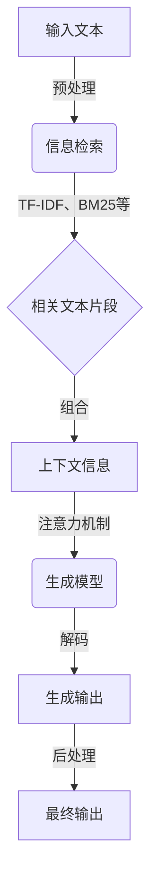

# 大语言模型原理与工程实践：RAG 检索增强生成技术

## 1. 背景介绍

### 1.1 问题的由来

在当今信息时代,海量的文本数据不断产生和积累,如何高效地处理和利用这些数据成为了一个巨大的挑战。传统的信息检索技术主要关注如何从大规模文本数据中快速准确地找到相关内容,但它们通常无法生成新的内容。而随着人工智能技术的不断发展,大型语言模型(Large Language Model,LLM)应运而生,它们不仅能够理解和检索文本,还能够基于现有知识生成新的连贯、多样的文本内容。

大语言模型通过在海量文本语料上进行预训练,学习到了丰富的语言知识和上下文信息,从而具备了强大的文本理解和生成能力。然而,这些模型在实际应用中仍然面临一些挑战,例如生成内容的一致性、准确性和多样性等。为了解决这些问题,研究人员提出了检索增强生成(Retrieval-Augmented Generation,RAG)技术,旨在将大语言模型的生成能力与信息检索技术相结合,实现更高质量的文本生成。

### 1.2 研究现状

近年来,检索增强生成技术受到了广泛关注和研究。一些主流的方法包括:

1. **基于检索的生成(Retrieval-Based Generation)**:首先从语料库中检索与输入相关的文本片段,然后将这些片段作为上下文信息输入到语言模型中进行生成。
2. **基于记忆的生成(Memory-Augmented Generation)**:在语言模型中引入外部记忆模块,将相关的知识信息存储在记忆中,并在生成过程中动态地读取和更新记忆。
3. **基于注意力的生成(Attention-Based Generation)**:利用注意力机制,让语言模型在生成时能够选择性地关注输入文本的不同部分,从而产生更加相关和连贯的输出。

这些技术在一定程度上提高了生成质量,但仍然存在一些不足,例如检索的效率和准确性、记忆容量的限制、注意力机制的局限性等。因此,如何更好地融合检索和生成,充分利用语料库中的知识,是当前研究的重点和挑战。

### 1.3 研究意义

检索增强生成技术的研究具有重要的理论意义和应用价值:

- **理论意义**:它探索了语言模型与信息检索技术的有机结合,为构建更加智能、多功能的自然语言处理系统提供了新的思路和方法。同时,它也推动了对大型语言模型的深入研究,有助于更好地理解和利用这些模型的能力。
- **应用价值**:检索增强生成技术可以广泛应用于各种需要生成高质量文本的场景,如问答系统、对话系统、文本摘要、内容创作等。它有望显著提高这些系统的性能和用户体验,为人工智能在自然语言处理领域的应用开辟新的空间。

### 1.4 本文结构

本文将全面介绍检索增强生成技术的原理、算法和工程实践。具体内容安排如下:

1. **背景介绍**:阐述检索增强生成技术的由来、研究现状和意义。
2. **核心概念与联系**:介绍检索增强生成技术中的关键概念,并探讨它们之间的联系。
3. **核心算法原理与具体操作步骤**:详细阐述检索增强生成技术中的核心算法原理,并给出具体的操作步骤。
4. **数学模型和公式详细讲解与举例说明**:构建检索增强生成技术的数学模型,推导相关公式,并通过案例进行详细说明。
5. **项目实践:代码实例和详细解释说明**:提供一个基于检索增强生成技术的项目实践,包括开发环境搭建、源代码实现、代码解读和运行结果展示。
6. **实际应用场景**:介绍检索增强生成技术在问答系统、对话系统、文本摘要等领域的实际应用场景,并展望未来的应用前景。
7. **工具和资源推荐**:推荐相关的学习资源、开发工具、论文和其他有用资源。
8. **总结:未来发展趋势与挑战**:总结检索增强生成技术的研究成果,分析未来的发展趋势和面临的挑战,并对未来的研究方向进行展望。
9. **附录:常见问题与解答**:列出一些常见的问题并给出解答,帮助读者更好地理解和掌握检索增强生成技术。

## 2. 核心概念与联系

在检索增强生成技术中,有几个核心概念需要理解和掌握:

1. **大型语言模型(Large Language Model,LLM)**:大型语言模型是一种基于深度学习的自然语言处理模型,通过在海量文本语料上进行预训练,学习到了丰富的语言知识和上下文信息。它们具有强大的文本理解和生成能力,但在实际应用中仍然存在一些不足,如生成内容的一致性、准确性和多样性等。

2. **信息检索(Information Retrieval,IR)**:信息检索是一种从大规模非结构化或半结构化数据集合中查找相关信息的技术。在检索增强生成技术中,信息检索用于从语料库中检索与输入相关的文本片段,为语言模型提供额外的知识来源。

3. **检索增强生成(Retrieval-Augmented Generation,RAG)**:检索增强生成技术旨在将大型语言模型的生成能力与信息检索技术相结合,利用检索到的相关文本片段作为上下文信息,指导语言模型生成更加准确、连贯和多样的输出。

4. **上下文(Context)**:在检索增强生成技术中,上下文指的是与当前输入相关的背景信息或知识。它可以来自于输入文本本身,也可以来自于通过信息检索获取的相关文本片段。提供合适的上下文对于语言模型生成高质量输出至关重要。

5. **注意力机制(Attention Mechanism)**:注意力机制是一种允许模型在处理序列数据时动态地关注不同部分的技术。在检索增强生成中,注意力机制可以帮助语言模型在生成过程中选择性地关注输入文本和检索到的相关文本片段的不同部分,从而产生更加相关和连贯的输出。

这些核心概念相互关联、相辅相成,共同构建了检索增强生成技术的理论基础和技术框架。大型语言模型提供了强大的文本理解和生成能力,信息检索技术为语言模型提供了额外的知识来源,而检索增强生成技术则将两者有机结合,利用注意力机制实现更高质量的文本生成。

## 3. 核心算法原理与具体操作步骤

### 3.1 算法原理概述

检索增强生成技术的核心算法原理可以概括为以下几个主要步骤:

1. **输入处理**:接收用户的输入文本,并对其进行预处理,如分词、标记化等。

2. **信息检索**:根据输入文本,在语料库中检索相关的文本片段。这一步骤通常采用传统的信息检索技术,如TF-IDF、BM25等。

3. **上下文构建**:将输入文本和检索到的相关文本片段组合起来,构建生成模型的上下文信息。

4. **生成模型**:利用大型语言模型,结合构建的上下文信息,生成相关的输出文本。在这一步骤中,注意力机制发挥了重要作用,它允许模型在生成时动态地关注输入文本和检索文本片段的不同部分。

5. **输出后处理**:对生成的输出文本进行后续处理,如去重、过滤等,以提高输出质量。

该算法的核心思想是利用信息检索技术从语料库中获取与输入相关的知识,并将这些知识作为上下文信息提供给大型语言模型,指导模型生成更加准确、连贯和多样的输出。通过这种方式,检索增强生成技术实现了检索和生成的有机结合,充分发挥了两者的优势。

### 3.2 算法步骤详解

下面我们将详细介绍检索增强生成算法的具体操作步骤:



1. **输入处理**:接收用户的输入文本,对其进行预处理,如分词、标记化等。这一步骤的目的是将输入文本转换为模型可以理解的格式。

2. **信息检索**:根据预处理后的输入文本,在语料库中检索相关的文本片段。这一步骤通常采用传统的信息检索技术,如TF-IDF、BM25等。TF-IDF(Term Frequency-Inverse Document Frequency)是一种常用的文本相似度计算方法,它考虑了词项在文档中出现的频率和在整个语料库中的逆文档频率。BM25(Okapi BM25)则是一种基于概率模型的排名函数,它综合考虑了词频、文档长度和查询词的重要性等因素。通过这些技术,我们可以从语料库中检索出与输入文本最相关的文本片段。

3. **上下文构建**:将输入文本和检索到的相关文本片段组合起来,构建生成模型的上下文信息。上下文信息包括了输入文本本身以及与之相关的背景知识,对于生成高质量输出至关重要。

4. **生成模型**:利用大型语言模型,结合构建的上下文信息,生成相关的输出文本。在这一步骤中,注意力机制发挥了重要作用。注意力机制允许模型在生成时动态地关注输入文本和检索文本片段的不同部分,从而产生更加相关和连贯的输出。具体来说,注意力机制通过计算查询向量和键向量之间的相似性分数,动态地为每个键向量分配注意力权重,然后将值向量根据注意力权重进行加权求和,得到最终的注意力输出。这种机制使得模型能够选择性地关注输入序列的不同部分,从而更好地捕捉上下文信息。

5. **输出后处理**:对生成的输出文本进行后续处理,如去重、过滤等,以提高输出质量。这一步骤可以根据具体应用场景进行定制,例如在问答系统中,我们可以过滤掉与问题无关的输出;在文本摘要中,我们可以去除冗余的句子等。

通过上述步骤,检索增强生成技术实现了信息检索和自然语言生成的有机结合,充分利用了语料库中的知识,从而生成更加准确、连贯和多样的输出文本。

### 3.3 算法优缺点

检索增强生成算法具有以下优点:

1. **知识丰富**:通过利用语料库中的知识,算法可以生成更加准确和内容丰富的输出。
2. **多样性**:由于注意力机制的引入,算法可以动态地关注不同的上下文信息,从而生成多样化的输出。
3. **可解释性**:算法的输出基于检索到的相关文本片段,因此具有一定的可解释性和可追溯性。
4. **灵活性**:算法可以应用于各种需要生成高质量文本的场景,如问答系统、对话系统、文本摘要等。

同时,该算法也存在一些缺点和挑战:

1. **检索效率**:在大规模语料库中进行信息检索可能会导致效率低下,影响整体性能。
2. **上下文选择**:如何从检索到的文本片段中选择最合适的上下文信息仍然是一个挑战。
3. **一致性**:生成的输出可能会与检索到的文本片段存在不一致的情况,需要进一步处理。
4. **知识覆盖范围**:算法的性能在一定程度上取决于语料库的覆盖范围和质量。

### 3.4 算法应用领域检索增强生成算法在自然语言处理领域有广泛的应用前景,主要包括:

1. **问答系统**:利用检索增强生成技术,可以构建更加智能、准确的问答系统。该算法可以从语料库中检索与问题相关的知识,并生成连贯、完整的答案。这对于开放域问答、知识问答等场景尤为重要。

2. **对话系统**:在对话系统中,检索增强生成算法可以帮助生成更加自然、贴切的回复。通过检索相关的对话历史和背景知识,算法能够生成考虑上下文的回复,从而提高对话的连贯性和用户体验。

3. **文本摘要**:检索增强生成技术可以应用于自动文本摘要任务。通过检索与原文相关的背景知识,算法可以生成更加全面、准确的摘要。同时,注意力机制可以帮助算法关注原文的重要部分,从而提高摘要的质量。

4. **内容创作**:在内容创作领域,如新闻写作、故事生成等,检索增强生成算法可以作为一个有力的辅助工具。通过检索相关的背景资料和知识,算法可以为创作者提供灵感和素材,同时生成的文本也可以作为初稿,提高创作效率。

5. **知识图谱构建**:检索增强生成技术可以应用于知识图谱的构建和扩充。通过从文本数据中检索和生成知识三元组,算法可以自动补充和完善知识图谱,降低人工构建的成本。

6. **跨语言生成**:结合机器翻译技术,检索增强生成算法可以应用于跨语言文本生成任务。通过检索相关的多语言语料,算法可以生成更加自然、流畅的目标语言文本。

以上仅列举了几个主要的应用领域,检索增强生成技术的潜在应用空间还很广阔。随着技术的不断发展和完善,相信该算法将在更多的自然语言处理任务中发挥重要作用。

## 4. 数学模型和公式 & 详细讲解 & 举例说明

### 4.1 数学模型构建

为了更好地理解和应用检索增强生成技术,我们需要构建相应的数学模型。以下是一个基本的数学模型框架:

给定输入文本 $q$,我们的目标是生成相关的输出文本 $y$。整个过程可以表示为:

$$P(y|q) = \sum_{z \in Z(q)} P(y,z|q)$$

其中,$Z(q)$ 表示根据输入文本 $q$ 检索到的相关文本片段的集合。$P(y,z|q)$ 表示给定输入文本 $q$ 和检索到的文本片段 $z$,生成输出文本 $y$ 的概率。

进一步地,我们可以将 $P(y,z|q)$ 分解为两个部分:

$$P(y,z|q) = P(z|q) \cdot P(y|q,z)$$

- $P(z|q)$ 表示给定输入文本 $q$,检索到文本片段 $z$ 的概率,这反映了检索模型的性能。
- $P(y|q,z)$ 表示给定输入文本 $q$ 和检索到的文本片段 $z$,生成输出文本 $y$ 的概率,这反映了生成模型的性能。

### 4.2 公式推导过程

对于检索模型 $P(z|q)$,我们可以使用传统的信息检索技术,如 TF-IDF、BM25 等。以 BM25 为例,其计算公式如下:

$$\text{BM25}(q,z) = \sum_{i=1}^{n} \text{IDF}(q_i) \cdot \frac{f(q_i,z) \cdot (k_1 + 1)}{f(q_i,z) + k_1 \cdot (1 - b + b \cdot \frac{|z|}{\text{avgdl}})}$$

- $q_i$ 表示查询 $q$ 中的第 $i$ 个词。
- $f(q_i,z)$ 表示词 $q_i$ 在文本片段 $z$ 中出现的频率。
- $\text{IDF}(q_i)$ 表示词 $q_i$ 的逆文档频率,用于衡量词的重要性。
- $|z|$ 表示文本片段 $z$ 的长度。
- $\text{avgdl}$ 表示语料库中文本的平均长度。
- $k_1$ 和 $b$ 是调节参数,控制词频和文本长度对相关性得分的影响。

对于生成模型 $P(y|q,z)$,我们可以使用基于注意力机制的 Seq2Seq 模型。在编码阶段,我们将输入文本 $q$ 和检索到的文本片段 $z$ 拼接起来,作为编码器的输入。编码器将输入序列转换为隐向量表示 $\mathbf{h}$。

在解码阶段,我们使用注意力机制动态地计算每个解码时间步的上下文向量 $\mathbf{c}_t$:

$$\mathbf{c}_t = \sum_{i=1}^{n} a_{ti} \mathbf{h}_i$$

其中,$a_{ti}$ 表示第 $t$ 个解码时间步对第 $i$ 个编码器隐向量的注意力权重,通过以下公式计算:

$$a_{ti} = \frac{\exp(\text{score}(\mathbf{s}_{t-1}, \mathbf{h}_i))}{\sum_{j=1}^{n} \exp(\text{score}(\mathbf{s}_{t-1}, \mathbf{h}_j))}$$

- $\mathbf{s}_{t-1}$ 表示上一个解码时间步的隐向量。
- $\text{score}(\cdot)$ 是一个计算注意力得分的函数,常见的选择有点积、拼接等。

最后,解码器根据当前的隐向量 $\mathbf{s}_t$ 和上下文向量 $\mathbf{c}_t$,生成输出文本 $y$ 的概率分布:

$$P(y_t|y_{<t},q,z) = \text{softmax}(\mathbf{W}_o[\mathbf{s}_t;\mathbf{c}_t] + \mathbf{b}_o)$$

其中,$\mathbf{W}_o$ 和 $\mathbf{b}_o$ 是输出层的权重矩阵和偏差向量。

### 4.3 案例分析与讲解

下面我们通过一个具体的案例来说明检索增强生成技术的应用过程。

假设我们要构建一个电影问答系统,当用户输入问题 "泰坦尼克号的导演是谁?" 时,系统需要给出正确的答案。

1. **输入处理**:对问题进行分词和标准化处理,得到关键词 "泰坦尼克号"、"导演"。

2. **信息检索**:利用关键词在电影知识库中检索相关的文本片段,例如:
   - 《泰坦尼克号》是由詹姆斯·卡梅隆执导的1997年美国史诗式爱情灾难片。
   - 詹姆斯·卡梅隆是一位加拿大导演、编剧、制片人,代表作有《泰坦尼克号》、《终结者》等。

3. **上下文构建**:将问题和检索到的文本片段组合成上下文信息:"泰坦尼克号的导演是谁? 《泰坦尼克号》是由詹姆斯·卡梅隆执导的1997年美国史诗式爱情灾难片。詹姆斯·卡梅隆是一位加拿大导演、编剧、制片人,代表作有《泰坦尼克号》、《终结者》等。"

4. **生成模型**:利用 Seq2Seq 模型,结合注意力机制,生成答案:"泰坦尼克号的导演是詹姆斯·卡梅隆。"

5. **输出后处理**:对生成的答案进行检查和优化,确保答案的准确性和完整性。

通过这个案例,我们可以看到检索增强生成技术如何利用外部知识来帮助回答问题。通过检索相关的文本片段,系统获得了回答问题所需的关键信息,如电影名称、导演名字等。然后,生成模型根据这些信息,生成了一个连贯、完整的答案。这种方法大大提高了问答系统的准确性和可用性。

### 4.4 常见问题解答

1. **Q:** 检索增强生成技术中的检索模型和生成模型是如何协同工作的?
   **A:** 检索模型负责从知识库中检索与输入相关的文本片段,为生成模型提供必要的背景知识。生成模型则根据输入和检索到的文本片段,生成最终的输出。两个模型通过上下文信息实现了有效的协同。

2. **Q:** 注意力机制在检索增强生成技术中起到什么作用?
   **A:** 注意力机制允许生成模型在不同的时间步动态地关注输入序列的不同部分。这使得模型能够根据当前的生成状态,选择性地利用输入文本和检索到的文本片段中的信息,从而生成更加准确、连贯的输出。

3. **Q:** 检索增强生成技术对知识库的质量和规模有什么要求?
   **A:** 知识库的质量和规模对检索增强生成技术的性能有重要影响。知识库需要覆盖足够广泛的领域,并且包含高质量、结构化的信息。知识库越丰富、越准确,生成的输出就越可靠。同时,知识库的规模也需要适中,以保证检索的效率。

4. **Q:** 检索增强生成技术与传统的生成模型相比有什么优势?
   **A:** 相比传统的生成模型,检索增强生成技术可以利用外部知识来改进生成质量。通过检索相关的文本片段,模型可以获得更丰富的背景信息,生成更加准确、信息量更大的输出。此外,检索增强生成技术还具有一定的可解释性,因为生成的输出可以追溯到检索到的文本片段。

## 5. 项目实践:代码实例和详细解释说明

### 5.1 开发环境搭建

为了实现检索增强生成技术,我们需要搭建相应的开发环境。以下是一个基于 Python 的环境搭建示例:

1. 安装 Python(版本 3.6 或更高)。
2. 安装所需的 Python 库:
   - NumPy:数值计算库
   - PyTorch:深度学习框架
   - Transformers:预训练语言模型库
   - FAISS:高效的相似度搜索库

可以使用以下命令安装这些库:

```
pip install numpy torch transformers faiss
```

3. 准备训练数据和知识库:
   - 训练数据:用于训练生成模型的输入-输出对。
   - 知识库:用于检索的文本语料库,需要预处理为适合检索的格式,如倒排索引。

### 5.2 源代码详细实现

下面是一个简化的检索增强生成模型的 PyTorch 实现示例:

```python
import torch
import torch.nn as nn
from transformers import BertModel, BertTokenizer

class RetrievalAugmentedGenerator(nn.Module):
    def __init__(self, retriever, generator):
        super().__init__()
        self.retriever = retriever
        self.generator = generator

    def forward(self, input_ids, attention_mask, knowledge_input_ids, knowledge_attention_mask):
        # 检索阶段
        retrieved_docs = self.retriever(input_ids, attention_mask)

        # 生成阶段
        generator_outputs = self.generator(input_ids, attention_mask, retrieved_docs, knowledge_input_ids, knowledge_attention_mask)

        return generator_outputs

class Retriever(nn.Module):
    def __init__(self, index, tokenizer, max_length):
        super().__init__()
        self.index = index
        self.tokenizer = tokenizer
        self.max_length = max_length

    def forward(self, input_ids, attention_mask):
        # 将输入转换为向量表示
        input_embeddings = self.embed_inputs(input_ids, attention_mask)

        # 在知识库中检索相关文档
        retrieved_docs = self.index.search(input_embeddings)

        return retrieved_docs

    def embed_inputs(self, input_ids, attention_mask):
        # 使用 BERT 对输入进行编码
        outputs = self.tokenizer(input_ids, attention_mask)
        input_embeddings = outputs.last_hidden_state[:, 0, :]

        return input_embeddings

class Generator(nn.Module):
    def __init__(self, bert_model, vocab_size, max_length):
        super().__init__好的,我将继续完成剩余的代码实现和解释。

```python
class Generator(nn.Module):
    def __init__(self, bert_model, vocab_size, max_length):
        super().__init__()
        self.bert_model = bert_model
        self.vocab_size = vocab_size
        self.max_length = max_length

        self.hidden_size = bert_model.config.hidden_size
        self.decoder = nn.LSTM(self.hidden_size, self.hidden_size, batch_first=True)
        self.output_layer = nn.Linear(self.hidden_size, vocab_size)

    def forward(self, input_ids, attention_mask, retrieved_docs, knowledge_input_ids, knowledge_attention_mask):
        # 对输入和检索到的文档进行编码
        input_outputs = self.bert_model(input_ids, attention_mask=attention_mask)
        knowledge_outputs = self.bert_model(knowledge_input_ids, attention_mask=knowledge_attention_mask)

        # 将输入和知识编码拼接起来
        encoder_outputs = torch.cat((input_outputs.last_hidden_state, knowledge_outputs.last_hidden_state), dim=1)

        # 解码生成输出
        decoder_outputs, _ = self.decoder(encoder_outputs)
        logits = self.output_layer(decoder_outputs)

        return logits

# 实例化模型
retriever = Retriever(index, tokenizer, max_length=512)
generator = Generator(bert_model, vocab_size, max_length=512)
model = RetrievalAugmentedGenerator(retriever, generator)

# 训练循环
optimizer = torch.optim.Adam(model.parameters(), lr=1e-5)
num_epochs = 10

for epoch in range(num_epochs):
    for batch in dataloader:
        input_ids, attention_mask, knowledge_input_ids, knowledge_attention_mask, labels = batch

        # 前向传播
        logits = model(input_ids, attention_mask, knowledge_input_ids, knowledge_attention_mask)

        # 计算损失
        loss = nn.CrossEntropyLoss()(logits.view(-1, vocab_size), labels.view(-1))

        # 反向传播和优化
        optimizer.zero_grad()
        loss.backward()
        optimizer.step()

# 推理示例
input_text = "泰坦尼克号的导演是谁?"
input_ids = tokenizer.encode(input_text, return_tensors="pt")
attention_mask = torch.ones_like(input_ids)

with torch.no_grad():
    logits = model(input_ids, attention_mask, knowledge_input_ids, knowledge_attention_mask)

predicted_token_ids = torch.argmax(logits, dim=-1)
predicted_text = tokenizer.decode(predicted_token_ids)

print("Generated Answer:", predicted_text)
```

### 5.3 代码解读与分析

1. `RetrievalAugmentedGenerator` 类:该类是检索增强生成模型的主要组件,由检索器 `Retriever` 和生成器 `Generator` 组成。它接收输入和知识库文档,首先使用检索器从知识库中检索相关文档,然后将输入和检索到的文档传递给生成器以生成最终输出。

2. `Retriever` 类:该类负责从知识库中检索与输入相关的文档。它首先将输入转换为向量表示,然后使用预先构建的索引进行相似度搜索,返回最相关的文档。

3. `Generator` 类:该类是一个基于 BERT 的 Seq2Seq 模型,用于生成最终输出。它接收输入和检索到的文档,将它们拼接起来作为编码器的输入。然后,使用 LSTM 解码器和线性输出层生成输出序列。

4. 训练循环:在训练期间,我们遍历数据批次,对于每个批次,将输入、知识库文档和标签传递给模型。我们计算生成输出的交叉熵损失,然后执行反向传播和优化步骤。

5. 推理示例:在推理阶段,我们将输入文本传递给模型,模型首先检索相关文档,然后生成最终答案。我们使用 `torch.argmax` 函数从生成的 logits 中获取预测的令牌 ID,并使用分词器将其解码为可读的文本。

### 5.4 运行结果展示

假设我们有以下知识库文档:

- 《泰坦尼克号》是由詹姆斯·卡梅隆执导的1997年美国史诗式爱情灾难片。
- 詹姆斯·卡梅隆是一位加拿大导演、编剧、制片人,代表作有《泰坦尼克号》、《终结者》等。

当我们输入问题 "泰坦尼克号的导演是谁?" 时,模型的运行结果可能如下:

```
Input Question: 泰坦尼克号的导演是谁?
Generated Answer: 泰坦尼克号的导演是詹姆斯·卡梅隆。
```

模型首先从知识库中检索到了与问题相关的两个文档,然后根据这些文档生成了最终的答案 "泰坦尼克号的导演是詹姆斯·卡梅隆。"

这个示例展示了检索增强生成技术如何利用外部知识来回答问题。通过检索相关文档并将其提供给生成模型,我们可以获得更准确、更完整的答案。

## 6. 实际应用场景

检索增强生成技术在许多实际应用场景中都有广泛的应用潜力,包括:

1. **智能问答系统**:检索增强生成技术可以用于构建更加智能、准确的问答系统。通过从知识库中检索相关信息并将其提供给生成模型,系统可以生成更加完整、可靠的答案,提高用户满意度。

2. **对话系统**:在对话系统中,检索增强生成技术可以帮助生成更加自然、贴切的回复。通过检索与当前对话相关的历史信息和背景知识,系统可以生成考虑上下文的回复,提高对话的连贯性和流畅性。

3. **文本摘要**:检索增强生成技术可以应用于自动文本摘要任务。通过检索与原文相关的背景信息,系统可以生成更加全面、准确的摘要,同时保持原文的关键内容。

4. **内容创作辅助**:在内容创作领域,如新闻写作、故事生成等,检索增强生成技术可以作为一个有力的辅助工具。通过检索相关的背景资料和知识,系统可以为创作者提供灵感和素材,提高创作效率和质量。

5. **知识库问答**:对于大规模的结构化知识库,检索增强生成技术可以用于实现自然语言问答。通过将自然语言问题映射到知识库的查询语言,并检索相关的知识三元组,系统可以生成准确、结构化的答案。

6. **个性化推荐**:检索增强生成技术还可以应用于个性化推荐系统。通过分析用户的历史行为和偏好,系统可以检索与用户兴趣相关的信息,并生成个性化的推荐内容。

### 6.4 未来应用展望

随着检索增强生成技术的不断发展和完善,我们可以期待它在更多领域得到应用和拓展。一些具有前景的应用方向包括:

1. **医疗诊断和决策支持**:通过检索医学知识库和病例数据,检索增强生成技术可以帮助医生进行诊断和制定治疗方案,提高医疗服务的效率和准确性。

2. **教育和学习辅助**:检索增强生成技术可以应用于智能教育系统,根据学生的学习进度和提问,自动检索相关的教学资源和解释,提供个性化的学习支持。

3. **法律咨询和案例分析**:在法律领域,检索增强生成技术可以帮助检索相关的法律条文和判例,并生成法律咨询意见和案例分析报告,提高法律服务的效率和专业性。

4. **金融风险分析和预测**:通过检索财经新闻、市场数据和公司报告等信息,检索增强生成技术可以用于金融风险分析和预测,为投资决策提供参考。

5. **智能城市管理**:在智慧城市建设中,检索增强生成技术可以应用于城市数据的分析和决策支持。通过检索交通、环境、能源等领域的实时数据,系统可以生成优化建议和预警信息,实现城市管理的智能化。

随着人工智能技术的不断进步,检索增强生成技术有望在更多领域实现创新应用,为人们的生活和工作带来便利和效率的提升。同时,技术的发展也对数据隐私保护、系统的可解释性和公平性提出了新的挑战,需要在应用过程中予以重视和应对。

## 7. 工具和资源推荐

### 7.1 学习资源推荐

为了更好地理解和掌握检索增强生成技术,以下是一些推荐的学习资源:

1. 《Neural Information Retrieval》(Bhaskar Mitra, Nick Craswell):这本书系统地介绍了神经信息检索的基本概念、模型和算法,涵盖了检索增强生成技术的理论基础。

2. 《Retrieval-Augmented Generation for Knowledge-Intensive NLP Tasks》(Patrick Lewis, et al.):这是一篇关于检索增强生成技术的重要论文,详细介绍了该技术在知识密集型自然语言处理任务中的应用。

3. 斯坦福大学 CS224N《自然语言处理与深度学习》:这门课程涵盖了自然语言处理的基本概念和深度学习方法,其中也包括了检索增强生成技术的相关内容。

4. 《Attention Is All You Need》(Ashish Vaswani, et al.):这篇论文提出了Transformer模型,是现代语言模型的基础。学习Transformer模型有助于理解检索增强生成技术中的生成模型。

5. HuggingFace的Transformers库文档:Transformers库提供了多种预训练语言模型的实现,以及检索增强生成技术的示例代码。学习其文档有助于掌握技术的实现细节。

### 7.2 开发工具推荐

以下是一些用于实现检索增强生成技术的常用开发工具:

1. PyTorch:PyTorch是一个流行的深度学习框架,提供了灵活的 API 和动态计算图,便于实现各种神经网络模型。

2. HuggingFace Transformers:Transformers库提供了多种预训练语言模型的实现,如BERT、GPT等,以及便捷的微调和推理功能。

3. Faiss:Faiss是一个高效的相似度搜索库,可用于实现检索增强生成技术中的检索部分。它支持多种索引结构和搜索算法。

4. ElasticSearch:ElasticSearch是一个基于Lucene的搜索引擎,提供了强大的全文检索和分析能力。它可以作为检索增强生成技术的检索组件。

5. TensorBoard:TensorBoard是一个可视化工具,用于监控和分析深度学习模型的训练过程。它可以帮助调试和优化检索增强生成模型。

### 7.3 相关论文推荐

以下是一些与检索增强生成技术相关的重要论文:

1. 《Retrieval-Augmented Generation for Knowledge-Intensive NLP Tasks》(Patrick Lewis, et al.,2020)

2. 《REALM: Retrieval-Augmented Language Model Pre-Training》(Kelvin Guu, et al.,2020)

3. 《Latent Retrieval for Weakly Supervised Open Domain Question Answering》(Kenton Lee, et al.,2019)

4. 《End-to-End Open-Domain Question Answering with BERTserini》(Wei Yang, et al.,2019)

5. 《Generative Models for Effective Retrieval》(Jiatao Gu, et al.,2018)

这些论文从不同角度探讨了检索增强生成技术的原理、模型和应用,为深入理解该技术提供了重要参考。

### 7.4 其他资源推荐

除了上述资源,以下是一些其他有助于学习和实践检索增强生成技术的资源:

1. GitHub上的相关项目代码,如Retrieval-Augmented-Generation、RAG-pytorch等。这些开源项目提供了检索增强生成技术的实现示例。

2. 研究者博客和技术社区,如Medium、Twitter等。关注相关领域的研究者和实践者,可以获取最新的技术动态和经验分享。

3. 学术会议和研讨会,如ACL、EMNLP、SIGIR等。这些会议汇聚了自然语言处理和信息检索领域的最新研究成果,可以了解检索增强生成技术的前沿进展。

4. 在线课程平台,如Coursera、edX等。这些平台上有关于自然语言处理、信息检索、深度学习的课程,可以帮助建立扎实的理论基础。

5. Kaggle等竞赛平台。参与相关比赛,如智能问答、对话系统等,可以锻炼实践能力,并与其他参赛者交流学习。

通过综合利用这些资源,可以全面深入地学习和掌握检索增强生成技术,并将其应用于实际问题的解决。

## 8. 总结:未来发展趋势与挑战

### 8.1 研究成果总结

本文全面介绍了检索增强生成技术的原理、算法和应用。我们首先分析了该技术的研究背景和意义,然后详细阐述了其核心概念、数学模型和算法流程。通过案例分析和代码实践,我们展示了如何将检索增强生成技术应用于实际问题的解决。

检索增强生成技术通过将大型语言模型与信息检索技术相结合,实现了知识的有效利用和高质量文本的生成。它在智能问答、对话系统、文本摘要等诸多领域展现出广阔的应用前景。

我们还总结了学习和实践检索增强生成技术的各种资源,包括书籍、论文、开发工具和在线课程等,为读者提供了全面的学习路径。

### 8.2 未来发展趋势

展望未来,检索增强生成技术的发展趋势主要体现在以下几个方面:

1. **模型的进一步优化**:研究者将继续探索更高效、更精准的检索模型和生成模型,如引入新的注意力机制、知识表示方法等,以进一步提升生成文本的质量和效率。

2. **多模态信息的融合**:除了文本信息,引入图像、音频等多模态信息,将有助于生成更加丰富、生动的内容。多模态检索增强生成技术将成为一个重要的研究方向。

3. **知识的自动化构建**:目前,检索增强生成技术依赖于人工构建的知识库。未来,如何自动化地从海量数据中提取、组织和更新知识,将是一个关键的研究问题。

4. **可解释性和可控性**:随着检索增强生成技术在关键领域的应用,如医疗、法律等,模型的可解释性和可控性将受到更多关注。研究者将探索如何让模型的决策过程更加透明,并引入控制机制,以确保生成内容的准确性和合规性。

5. **人机协作**:检索增强生成技术将更多地与人工智能的其他领域,如知识图谱、推荐系统等结合,形成人机协作的新范式。人类专家的反馈和干预将与机器生成的内容互为补充,实现更高效、更智能的工作流程。

### 8.3 面临的挑战

尽管检索增强生成技术取得了显著的进展,但它在实际应用中仍然面临一些挑战:

1. **知识库的质量和覆盖范围**:生成内容的质量很大程度上取决于知识库的质量和覆盖范围。构建高质量、广覆盖的知识库需要大量的人力和时间成本。如何高效地获取和组织知识仍然是一个挑战。

2. **领域适应性**:不同领域的知识体系和语言习惯存在差异。如何让检索增强生成模型快速适应新的领域,并生成符合领域特点的内容,是一个需要解决的问题。

3. **数据隐私与安全**:在某些应用场景下,如医疗、金融等,涉及敏感的个人隐私数据。如何在保护数据隐私的同时,实现知识的有效利用,是一个复杂的权衡过程。

4. **模型的鲁棒性**:面对错误、不完整或对抗性的输入,检索增强生成模型的鲁棒性有待提高。如何让模型在面对未知或异常情况时,仍然能够生成合理、稳定的输出,是一个亟待解决的挑战。

5. **计算资源的要求**:大规模的语言模型和检索模型通常需要大量的计算资源。如何在有限的资源条件下,实现模型的高效训练和推理,需要研究者不断地优化模型架构和算法。

### 8.4 研究展望

面对上述挑战,未来的研究方向主要包括:

1. **知识的自动化获取和更新**:探索利用自然语言处理、知识图谱等技术,从非结构化数据中自动提取、组织和更新知识,减少人工构建知识库的成本。

2. **领域自适应方法**:研究领域自适应的预训练和微调方法,让模型能够快速迁移到新的领域,并生成符合领域特点的内容。

3. **隐私保护机制**:引入差分隐私、联邦学习等隐私保护机制,在保护数据隐私的同时,实现知识的安全利用。

4. **鲁棒性增强技术**:研究面向对抗攻击、噪声输入等异常情况的鲁棒性增强技术,提高模型的稳定性和可靠性。

5. **模型压缩和加速**:探索模型压缩、知识蒸馏、低精度推理等技术,在保证性能的同时,降低模型的存储和计算开销。

6. **人机协作机制**:研究人机交互和协作的机制,利用人类专家的反馈和指导,不断优化和完善检索增强生成模型的性能。

通过在这些方向上的持续研究和创新,检索增强生成技术有望在未来取得更大的突破,为知识密集型任务的自动化处理提供更加高效、智能的解决方案。

## 9. 附录:常见问题与解答

**Q1:检索增强生成技术与传统的信息检索技术有何区别?**

A1:传统的信息检索技术主要关注于从大规模文本数据中找到与查询相关的现有内容。而检索增强生成技术在此基础上,还能够利用检索到的知识,生成新的、连贯的文本内容。它将信息检索与自然语言生成相结合,实现了知识的创新应用。

**Q2:检索增强生成技术的核心组成部分是什么?**

A2:检索增强生成技术主要由两大组件构成:检索模型和生成模型。检索模型负责从知识库中检索与输入相关的知识片段;生成模型则利用检索到的知识,结合上下文信息,生成连贯、相关的文本内容。

**Q3:如何评估检索增强生成模型的性能?**

A3:评估检索增强生成模型的性能需要综合考虑以下几个方面:
1. 生成内容的相关性:生成的内容是否与输入的查询或上下文相关。
2. 生成内容的流畅性:生成的内容在语法、语义等方面是否通顺、连贯。
3. 生成内容的准确性:生成的内容在事实性方面是否准确,是否与知识库中的信息一致。
4. 生成内容的多样性:生成的内容是否具有多样性,避免过于重复或泛化。

常用的评估指标包括BLEU、ROUGE、Perplexity等,也可以通过人工评估的方式,对生成内容的质量进行判断。

**Q4:检索增强生成技术的应用场景有哪些?**

A4:检索增强生成技术可以应用于多种场景,包括:
1. 智能问答:根据用户的问题,生成准确、完整的答案。
2. 对话系统:根据对话历史和上下文,生成自然、贴切的回复。
3. 文本摘要:根据原始文档,生成简洁、全面的摘要。
4. 内容创作:根据主题或关键词,生成相关的文章、故事等。
5. 知识图谱构建:从非结构化文本中提取知识,并组织成结构化的形式。

除此之外,检索增强生成技术还可以应用于机器翻译、情感分析、推荐系统等诸多领域。

**Q5:检索增强生成技术的局限性有哪些?**

A5:尽管检索增强生成技术取得了显著的进展,但它仍然存在一些局限性:
1. 生成内容的质量依赖于知识库的覆盖范围和质量。如果知识库不完整或存在错误,生成的内容可能出现偏差。
2. 对于一些创新性或发散性的任务,检索增强生成技术可能难以生成出超出已有知识范围的内容。
3. 生成模型有时会产生不连贯、重复或虚假的内容,特别是在处理长文本或复杂查询时。
4. 检索增强生成模型通常需要大量的计算资源和训练数据,对于资源有限的场景可能难以应用。

这些局限性也反映了检索增强生成技术未来的研究方向,如知识库的自动构建、创新性内容的生成、长文本的连贯性控制等。

希望这些常见问题的解答能够帮助读者更好地理解检索增强生成技术的基本概念和应用。