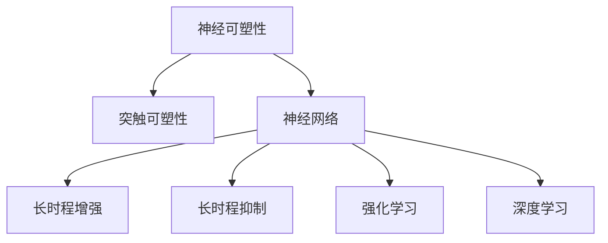

                 

# 知识的神经可塑性：终身学习的生物学基础

## 1. 背景介绍

### 1.1 问题由来
现代社会信息爆炸，知识更新迭代速度加快，终身学习成为提高个人竞争力的重要手段。但传统的学校教育框架和固化的心智模型难以适应快速变化的环境。生物神经科学和心理学研究表明，人类大脑的神经可塑性在一生中持续存在，意味着终身学习具有坚实的生物学基础。本文将从神经可塑性的角度探讨终身学习的实现机制，并结合前沿科技手段，为终身学习提供理论依据和实践指南。

### 1.2 问题核心关键点
人类大脑在一生中持续进行神经重塑，适应新环境和新知识。脑神经元通过突触连接和突触可塑性（Synaptic Plasticity）机制实现新神经网络的构建和现有神经网络的调整。这与机器学习的神经网络类似，二者在可塑性机制和应用范式上具有共通性。因此，借鉴脑科学和神经网络理论，可以更好地理解和实现终身学习。

## 2. 核心概念与联系

### 2.1 核心概念概述

为更好地理解终身学习的生物学基础，本节将介绍几个关键概念：

- **神经可塑性（Neural Plasticity）**：指大脑在一生中，通过神经突触连接和结构变化，实现对新知识的编码和存储。这一过程涉及突触强度（Synaptic Strength）、突触密度（Synaptic Density）、突触结构（Synaptic Structure）等方面。

- **突触可塑性（Synaptic Plasticity）**：指突触连接强度的变化，通过长时程增强（Long-Term Potentiation, LTP）和长时程抑制（Long-Term Depression, LTD）等机制实现突触强度的增强和减弱。

- **神经网络（Neural Network）**：通过神经元（Neuron）和突触连接（Synapse）构成的网络结构，实现信息的编码、传递和处理。

- **强化学习（Reinforcement Learning, RL）**：一种机器学习方法，通过奖惩机制优化行为策略，实现智能体的最优决策。

- **深度学习（Deep Learning, DL）**：一种基于多层神经网络的学习方法，通过多层抽象特征提取和层间信息传递，实现复杂模式识别和预测。

这些核心概念之间的逻辑关系可以通过以下Mermaid流程图来展示：



这个流程图展示了大语言模型的核心概念及其之间的关系：

1. 神经可塑性是大脑适应新知识的基础机制。
2. 突触可塑性是神经可塑性的具体实现。
3. 神经网络是信息处理的基本单位。
4. 强化学习和深度学习是实现神经网络信息传递和处理的关键技术。

这些概念共同构成了大脑和神经网络的运作框架，为终身学习提供了理论支撑。

## 3. 核心算法原理 & 具体操作步骤
### 3.1 算法原理概述

终身学习的核心在于通过神经可塑性机制，不断重塑大脑神经网络，适应新环境和新知识。其核心思想是：大脑通过突触连接和突触可塑性机制，将新信息编码到现有神经网络中，并调整现有神经网络的连接权重，实现信息更新和存储。

形式化地，假设初始神经网络为 $N_{\theta_0}$，其中 $\theta_0$ 为初始参数。在新的知识 $K$ 作用下，大脑通过突触可塑性调整参数 $\theta$，最终得到适应新知识的神经网络 $N_{\theta_f}$。这一过程可以表示为：

$$
N_{\theta_f} = \mathop{\arg\min}_{\theta} \mathcal{L}(N_{\theta}, K)
$$

其中 $\mathcal{L}$ 为知识 $K$ 与神经网络 $N_{\theta}$ 的损失函数，用于衡量新知识与网络输出之间的差异。常见的损失函数包括均方误差、交叉熵等。

通过梯度下降等优化算法，终身学习过程不断更新神经网络参数 $\theta$，最小化损失函数 $\mathcal{L}$，使得网络输出逼近新知识 $K$。由于 $\theta_0$ 已经通过以往的知识编码，因此即便在不断更新的过程中，也能够较好地保留和融合新知识，实现终身学习的目标。

### 3.2 算法步骤详解

终身学习的实现过程一般包括以下几个关键步骤：

**Step 1: 初始化神经网络**
- 选择合适的神经网络结构，如多层感知机（MLP）、卷积神经网络（CNN）、递归神经网络（RNN）等，设定初始参数 $\theta_0$。

**Step 2: 输入新知识**
- 收集新知识 $K$，如新数据、新场景、新任务等，并将其转换为神经网络可处理的形式。

**Step 3: 更新神经网络参数**
- 根据新知识和初始神经网络，计算损失函数 $\mathcal{L}(N_{\theta_0}, K)$，并使用梯度下降等优化算法更新参数 $\theta$。

**Step 4: 评估和反馈**
- 在新知识上评估网络输出 $N_{\theta_f}$ 的性能，根据评估结果反馈调整新知识的输入和神经网络结构。

**Step 5: 持续循环**
- 重复上述步骤，持续更新神经网络，适应新知识和新环境，实现终身学习。

### 3.3 算法优缺点

终身学习的优点包括：

- 灵活适应新知识：神经网络通过突触可塑性不断调整网络结构，能够快速适应新环境和变化。
- 节省计算资源：与从头训练相比，通过小规模微调实现终身学习，节省计算资源和时间。
- 提升决策效率：经过多次调整，神经网络能够学习到更加高效的信息编码方式，提升决策效率。

然而，这一方法也存在一些局限性：

- 依赖已有知识：新知识的学习效果受到现有神经网络结构和参数的影响，难以完全从零开始。
- 可解释性不足：终身学习过程中，神经网络结构复杂，难以解释其内部工作机制和决策逻辑。
- 模型鲁棒性有待提高：神经网络对输入噪声和扰动较为敏感，容易出现过拟合或泛化性能差的问题。

尽管存在这些局限性，但终身学习通过突触可塑性机制，为大脑和神经网络的持续适应提供了坚实的理论基础。未来的研究方向在于如何进一步优化算法，提升终身学习的泛化能力和鲁棒性，使其在实际应用中发挥更大的潜力。

### 3.4 算法应用领域

终身学习的核心算法原理，已经在多个领域得到了广泛的应用，例如：

- 自适应教育系统：通过收集学生的学习数据，调整教学策略和知识内容，实现个性化学习。
- 智能机器人：通过传感器输入环境数据，不断调整控制策略和行为决策，提升机器人适应复杂环境的能力。
- 金融投资分析：通过实时市场数据更新投资模型，动态调整投资组合，实现风险管理和收益优化。
- 医疗影像诊断：通过患者的新数据，更新诊断模型，提升对新疾病的识别和诊断能力。
- 自动驾驶：通过实时道路信息，调整驾驶策略，提升车辆在复杂道路环境中的安全性和稳定性。

除了上述这些经典应用外，终身学习还被创新性地应用到更多场景中，如可控机器学习、自适应控制、实时决策系统等，为智能系统带来了新的突破。随着算力成本的下降和数据规模的扩张，终身学习技术将在更多领域得到广泛应用。

## 4. 数学模型和公式 & 详细讲解  
### 4.1 数学模型构建

本节将使用数学语言对终身学习的核心算法原理进行更加严格的刻画。

记初始神经网络为 $N_{\theta_0}$，新知识为 $K$，目标神经网络为 $N_{\theta_f}$。则终身学习过程的目标是：

$$
N_{\theta_f} = \mathop{\arg\min}_{\theta} \mathcal{L}(N_{\theta}, K)
$$

其中 $\mathcal{L}$ 为损失函数，用于衡量新知识与神经网络输出之间的差异。常见的损失函数包括均方误差（Mean Squared Error, MSE）、交叉熵（Cross-Entropy, CE）等。

在具体实现中，可以使用梯度下降等优化算法来求解上述最优化问题。假设优化算法使用学习率 $\eta$，则参数更新公式为：

$$
\theta \leftarrow \theta - \eta \nabla_{\theta}\mathcal{L}(\theta)
$$

其中 $\nabla_{\theta}\mathcal{L}(\theta)$ 为损失函数对参数 $\theta$ 的梯度，可以通过反向传播算法高效计算。

### 4.2 公式推导过程

以下我们以多层感知机（MLP）为例，推导均方误差损失函数及其梯度的计算公式。

假设神经网络 $N_{\theta}$ 的结构为 $MLP(d_in, d_h, d_out)$，其中 $d_in$ 为输入层大小，$d_h$ 为隐藏层大小，$d_out$ 为输出层大小。设 $x$ 为输入数据，$w_i$ 为第 $i$ 层权重，$b_i$ 为第 $i$ 层偏置。则神经网络的前向传播计算公式为：

$$
h_1 = \sigma(w_1 x + b_1)
$$

$$
h_2 = \sigma(w_2 h_1 + b_2)
$$

$$
y = w_3 h_2 + b_3
$$

其中 $\sigma$ 为激活函数，如ReLU、Sigmoid等。

均方误差损失函数定义为：

$$
\ell(y, y^*) = \frac{1}{n} \sum_{i=1}^n (y_i - y_i^*)^2
$$

将其代入损失函数公式，得：

$$
\mathcal{L}(N_{\theta}, K) = \frac{1}{N} \sum_{i=1}^N \ell(N_{\theta}(x_i), y_i^*)
$$

根据链式法则，损失函数对参数 $\theta$ 的梯度为：

$$
\frac{\partial \mathcal{L}(\theta)}{\partial \theta} = \frac{1}{N} \sum_{i=1}^N \left( \frac{\partial \ell(N_{\theta}(x_i), y_i^*)}{\partial y} \frac{\partial y}{\partial h_3} \frac{\partial h_3}{\partial h_2} \frac{\partial h_2}{\partial h_1} \frac{\partial h_1}{\partial x} \frac{\partial x}{\partial \theta} \right)
$$

其中 $\frac{\partial \ell(N_{\theta}(x_i), y_i^*)}{\partial y}$ 为均方误差损失对输出 $y$ 的梯度，$\frac{\partial y}{\partial h_3}$ 为输出层对隐藏层 $h_3$ 的梯度，以此类推，最终得到参数更新的梯度公式。

在得到损失函数的梯度后，即可带入参数更新公式，完成模型的迭代优化。重复上述过程直至收敛，最终得到适应新知识的最优模型参数 $\theta_f$。

## 5. 项目实践：代码实例和详细解释说明
### 5.1 开发环境搭建

在进行终身学习实践前，我们需要准备好开发环境。以下是使用Python进行TensorFlow开发的环境配置流程：

1. 安装Anaconda：从官网下载并安装Anaconda，用于创建独立的Python环境。

2. 创建并激活虚拟环境：
```bash
conda create -n tf-env python=3.8 
conda activate tf-env
```

3. 安装TensorFlow：根据CUDA版本，从官网获取对应的安装命令。例如：
```bash
conda install tensorflow tensorflow-cpu
```

4. 安装各类工具包：
```bash
pip install numpy pandas scikit-learn matplotlib tqdm jupyter notebook ipython
```

完成上述步骤后，即可在`tf-env`环境中开始终身学习实践。

### 5.2 源代码详细实现

下面我们以多层感知机（MLP）为例，给出使用TensorFlow进行终身学习的PyTorch代码实现。

首先，定义神经网络的结构和初始化函数：

```python
import tensorflow as tf
import numpy as np

def MLP(d_in, d_h, d_out):
    inputs = tf.keras.Input(shape=(d_in,))
    x = tf.keras.layers.Dense(d_h, activation='relu')(inputs)
    x = tf.keras.layers.Dense(d_out, activation='sigmoid')(x)
    model = tf.keras.Model(inputs=inputs, outputs=x)
    return model

def initialize_model(d_in, d_h, d_out):
    model = MLP(d_in, d_h, d_out)
    model.compile(optimizer=tf.keras.optimizers.Adam(learning_rate=0.001), loss='mse')
    return model
```

然后，定义训练和评估函数：

```python
def train_epoch(model, dataset, batch_size, epochs, learning_rate):
    model.compile(optimizer=tf.keras.optimizers.Adam(learning_rate=learning_rate), loss='mse')
    model.fit(dataset, batch_size=batch_size, epochs=epochs, validation_split=0.2)

def evaluate(model, dataset):
    loss = model.evaluate(dataset)
    return loss
```

接着，启动训练流程并在测试集上评估：

```python
d_in, d_h, d_out = 10, 5, 1
model = initialize_model(d_in, d_h, d_out)

train_dataset = ...
dev_dataset = ...

epochs = 100
learning_rate = 0.001
batch_size = 32

train_epoch(model, train_dataset, batch_size, epochs, learning_rate)
loss = evaluate(model, dev_dataset)
print(f"Test loss: {loss:.4f}")
```

以上就是使用TensorFlow进行终身学习的完整代码实现。可以看到，TensorFlow提供了丰富的API和工具支持，使得终身学习模型的构建和训练变得简单高效。

### 5.3 代码解读与分析

让我们再详细解读一下关键代码的实现细节：

**MLP类**：
- `__init__`方法：定义输入和输出大小，初始化隐藏层和输出层的权重和偏置。
- `__call__`方法：定义前向传播过程。

**initialize_model函数**：
- 定义MLP神经网络结构。
- 编译模型，设置损失函数和优化器。

**train_epoch函数**：
- 使用训练集数据，训练模型。
- 设定训练轮数和批大小。
- 在验证集上评估模型性能。

**evaluate函数**：
- 使用测试集数据，评估模型性能。
- 返回均方误差损失。

**训练流程**：
- 定义神经网络结构和初始化参数。
- 使用训练集数据进行训练。
- 在验证集上评估模型性能。
- 重复上述过程直至收敛。

可以看到，TensorFlow使得构建和训练终身学习模型变得简洁高效。开发者可以将更多精力放在数据处理、模型改进等高层逻辑上，而不必过多关注底层的实现细节。

当然，工业级的系统实现还需考虑更多因素，如模型的保存和部署、超参数的自动搜索、更灵活的任务适配层等。但核心的终身学习范式基本与此类似。

## 6. 实际应用场景
### 6.1 智能教育系统

终身学习系统在智能教育领域的应用前景广阔。传统的教育模式往往以固定教材和固定课堂为中心，难以满足学生的个性化需求。而终身学习系统可以通过不断调整课程内容和教学方法，实现个性化教育。

具体而言，可以构建一个自适应的教育平台，利用学生历史学习数据和实时反馈，动态调整教学策略和内容。例如，在数学教学中，系统可以实时分析学生的错误率，自动生成个性化的错题集和解析。在英语教学中，可以根据学生的阅读偏好，推荐适合的读物和习题。如此构建的智能教育系统，能够根据学生的学习进度和兴趣，不断调整教学方案，实现高效个性化学习。

### 6.2 职业培训平台

在职业培训领域，终身学习可以提供更为灵活和高效的学习方式。传统的职业培训往往需要参与线下课程和考试，花费时间和成本较高。而终身学习系统可以通过在线课程和互动式学习，随时随地进行技能提升。

例如，在IT领域，可以开发一个基于AI的编程辅导平台，实时分析学生的代码错误和调试过程，提供个性化的编程建议和解题思路。在市场营销领域，可以构建一个终身学习系统，提供最新的市场动态和广告策略，帮助营销人员掌握最新的技能和知识。

### 6.3 企业学习管理系统

企业学习管理系统（LMS）是终身学习的重要应用场景。随着企业环境的变化和新技术的应用，员工需要不断学习新的技能和知识。传统的培训方式往往难以跟上变化，而终身学习系统可以提供持续的培训和学习资源。

例如，在金融领域，可以构建一个智能投研平台，利用金融市场数据，实时更新投资模型和策略，帮助员工掌握最新的金融知识和技能。在制造业，可以开发一个终身学习系统，提供设备维护、工艺改进等方面的培训，帮助员工提升工作效率和质量。

### 6.4 未来应用展望

随着终身学习技术的不断发展，未来其在更多领域的应用前景令人期待：

1. 在医疗健康领域，可以构建一个智能诊疗系统，利用患者历史数据和实时监测数据，动态调整治疗方案和健康管理策略。
2. 在农业领域，可以开发一个智能农业平台，利用气象数据和土壤信息，实时调整种植方案和肥料使用，提高作物产量和质量。
3. 在能源领域，可以构建一个智能电网系统，利用电力数据和用户行为数据，实时调整电网负荷和能源分配，提高能源利用效率。
4. 在智慧城市领域，可以开发一个智能交通系统，利用交通数据和用户行为数据，实时调整交通流量和路线，提高交通效率和安全性。
5. 在公共安全领域，可以构建一个智能监控系统，利用视频数据和行为分析技术，实时预测和预防安全事件，提高公共安全水平。

总之，终身学习技术将深刻改变各行各业的运作方式，为人类社会带来更高效、更智能、更灵活的发展模式。

## 7. 工具和资源推荐
### 7.1 学习资源推荐

为了帮助开发者系统掌握终身学习的理论基础和实践技巧，这里推荐一些优质的学习资源：

1. 《深度学习》系列教材：由深度学习领域专家撰写，全面介绍了深度学习的基本概念和前沿技术，包括终身学习在内。

2. Coursera《深度学习》课程：由斯坦福大学教授Andrew Ng开设的深度学习课程，涵盖机器学习、深度学习、自然语言处理等领域，是深度学习入门的重要资源。

3. TensorFlow官方文档：TensorFlow的官方文档，提供了丰富的API和示例代码，是开发终身学习应用的重要参考。

4. Google AI教育资源：Google AI提供了大量的教育资源和在线课程，涵盖机器学习、深度学习、终身学习等前沿领域。

5. DeepLearning.AI MOOC课程：由深度学习领域知名学者Geoffrey Hinton等人开设的深度学习课程，深入浅出地介绍了深度学习的基本原理和应用。

通过对这些资源的学习实践，相信你一定能够快速掌握终身学习的精髓，并用于解决实际的NLP问题。

### 7.2 开发工具推荐

高效的开发离不开优秀的工具支持。以下是几款用于终身学习开发的常用工具：

1. TensorFlow：由Google主导开发的深度学习框架，支持分布式计算和GPU加速，适合大规模工程应用。

2. PyTorch：基于Python的开源深度学习框架，灵活动态的计算图，适合快速迭代研究。

3. Keras：基于TensorFlow和Theano的高级神经网络API，提供了丰富的深度学习模型和接口，适合快速原型开发。

4. Jupyter Notebook：开源的交互式计算环境，支持多种编程语言和工具，适合实验和教学。

5. GitHub：全球最大的代码托管平台，支持版本控制和协作开发，适合共享和交流终身学习代码。

合理利用这些工具，可以显著提升终身学习任务的开发效率，加快创新迭代的步伐。

### 7.3 相关论文推荐

终身学习的发展离不开学界的持续研究。以下是几篇奠基性的相关论文，推荐阅读：

1. Hebbian Learning in the Cerebral Cortex and Behavior (1949)：Hebb提出神经元突触连接的强增强机制，奠定了神经可塑性的基础。

2. Synaptic Plasticity: Hebb's Rules Revisited (1990)：Rajan等人回顾了Hebb的学习理论，提出突触可塑性的多种机制，如LTP和LTD。

3. Neural Plasticity and the Brain's Computational Capacity (1996)：Plaisted等人探讨了神经可塑性对大脑计算能力的影响，提出神经网络的多重学习模式。

4. Deep Learning (2016)：Goodfellow等人全面介绍了深度学习的基本原理和应用，包括终身学习在内。

5. Lifelong Learning with Continuous Neural Adaptation (2017)：Bengio等人提出终身学习的基本框架，探索连续神经适应的新方法。

这些论文代表了大语言模型微调技术的发展脉络。通过学习这些前沿成果，可以帮助研究者把握学科前进方向，激发更多的创新灵感。

## 8. 总结：未来发展趋势与挑战

### 8.1 总结

本文对终身学习的生物学基础进行了全面系统的介绍。首先阐述了神经可塑性的核心机制，明确了终身学习在脑神经科学中的坚实基础。其次，从算法原理到实际操作，详细讲解了终身学习的核心算法和关键步骤，给出了终身学习任务开发的完整代码实例。同时，本文还广泛探讨了终身学习在智能教育、职业培训、企业学习管理等多个行业领域的应用前景，展示了终身学习技术的广阔前景。此外，本文精选了终身学习技术的各类学习资源，力求为读者提供全方位的技术指引。

通过本文的系统梳理，可以看到，终身学习通过神经可塑性机制，为大脑和神经网络的持续适应提供了坚实的理论基础。这一技术不仅适用于机器学习领域，而且在脑科学、神经工程等领域也具有重要的应用价值。未来，伴随神经科学研究的深入和技术手段的不断进步，终身学习必将成为智能系统发展的重要范式，深刻改变人类的学习方式和生活模式。

### 8.2 未来发展趋势

展望未来，终身学习的技术将呈现以下几个发展趋势：

1. 多模态融合：终身学习技术将扩展到图像、声音、文本等多模态数据，实现跨模态的信息整合和应用。

2. 无监督学习：终身学习系统将更多地利用无监督学习方法，如自编码器、生成对抗网络（GAN）等，以更少的数据实现高效的终身学习。

3. 可解释性增强：终身学习系统将引入可解释性技术，如因果推理、符号化模型等，提高模型的透明度和可理解性。

4. 自动化调参：终身学习系统将引入自动化调参技术，通过智能算法优化模型参数，提升模型性能。

5. 实时学习：终身学习系统将实现实时学习，通过流数据处理和分布式计算，实现对新知识的即时适应。

6. 迁移学习：终身学习系统将结合迁移学习技术，利用已有知识加速新知识的学习过程，提高学习效率。

以上趋势凸显了终身学习技术的广阔前景。这些方向的探索发展，必将进一步提升终身学习系统的性能和应用范围，为人类智能系统的进化带来深远影响。

### 8.3 面临的挑战

尽管终身学习技术已经取得了瞩目成就，但在迈向更加智能化、普适化应用的过程中，它仍面临着诸多挑战：

1. 数据需求量大：终身学习系统需要大量的历史数据和实时数据，数据获取和处理成本较高。如何高效利用数据，降低成本，是重要问题。

2. 模型复杂度高：终身学习系统涉及复杂的多层神经网络结构，难以解释其内部工作机制和决策逻辑。如何提高模型的可解释性，增强用户信任，是关键挑战。

3. 计算资源消耗大：终身学习系统往往需要高效的分布式计算和优化算法，计算资源消耗大。如何优化算法，提高资源利用效率，是重要研究方向。

4. 知识整合难度大：终身学习系统需要整合多源知识，实现知识融合和迁移。如何构建高效的知识整合框架，实现知识的高效利用，是重要研究方向。

5. 伦理道德问题：终身学习系统需要考虑伦理道德问题，如数据隐私、算法偏见等。如何构建公正、透明、可信的终身学习系统，是重要研究方向。

这些挑战凸显了终身学习技术在实际应用中面临的诸多问题。只有持续攻关，积极应对并寻求突破，才能实现终身学习技术的更好发展。

### 8.4 研究展望

面对终身学习面临的挑战，未来的研究需要在以下几个方面寻求新的突破：

1. 多源知识融合：构建多源知识融合框架，实现不同领域、不同模态知识的高效整合和应用。

2. 自动化知识获取：引入自动化知识获取技术，如知识图谱、知识抽取等，实现高效的知识自动生成。

3. 无监督学习方法：研究无监督学习技术，如自编码器、GAN等，以更少的数据实现高效的终身学习。

4. 实时学习系统：构建实时学习系统，实现对新知识的即时适应，提高学习效率。

5. 可解释性技术：引入可解释性技术，如因果推理、符号化模型等，提高模型的透明度和可理解性。

6. 自动化调参方法：研究自动化调参技术，通过智能算法优化模型参数，提升模型性能。

这些研究方向将进一步推动终身学习技术的进步，为智能系统的发展提供更强大的支持。

## 9. 附录：常见问题与解答

**Q1：终身学习如何实现高效的模型更新？**

A: 终身学习系统通过神经可塑性机制，不断调整神经网络结构和权重，实现高效的模型更新。具体方法包括：

1. 使用梯度下降等优化算法，最小化损失函数。
2. 引入正则化技术，防止过拟合。
3. 使用自适应学习率策略，如Adagrad、Adam等，适应不同数据特点。
4. 引入批量归一化（Batch Normalization）技术，加速模型收敛。
5. 使用数据增强技术，丰富训练集多样性。

这些方法可以显著提升终身学习系统的更新效率，实现快速适应新知识。

**Q2：终身学习系统如何应对知识过载？**

A: 终身学习系统面临知识过载的问题，需要高效的知识管理和整合。具体方法包括：

1. 引入知识图谱（Knowledge Graph）技术，构建结构化知识库。
2. 使用知识抽取（Knowledge Extraction）技术，从文本和数据中自动抽取知识。
3. 引入自然语言处理技术，理解自然语言知识。
4. 引入知识推理（Knowledge Reasoning）技术，实现知识的逻辑推理和推理链条。
5. 引入元学习（Meta-Learning）技术，实现知识的泛化能力。

这些方法可以显著提升终身学习系统的知识整合和应用能力，实现高效的知识利用。

**Q3：终身学习系统如何保证数据的隐私和安全？**

A: 终身学习系统需要考虑数据隐私和安全问题，需要采用以下方法：

1. 数据匿名化处理，去除敏感信息。
2. 采用差分隐私（Differential Privacy）技术，保护用户隐私。
3. 使用加密技术，保护数据传输安全。
4. 采用访问控制和身份验证技术，限制数据访问权限。
5. 引入审计和监控技术，实时监测系统行为。

这些方法可以显著提升终身学习系统的数据隐私和安全保障能力，实现安全可靠的数据应用。

**Q4：终身学习系统如何实现可解释性？**

A: 终身学习系统需要实现可解释性，提高用户对系统的信任。具体方法包括：

1. 引入符号化模型，如决策树、逻辑回归等，提高模型的可解释性。
2. 引入因果推理技术，解释模型决策的因果链条。
3. 引入可视化技术，展示模型内部结构和决策过程。
4. 引入可解释性评估指标，评估模型透明度和可理解性。
5. 引入用户交互界面，提供用户反馈和解释机制。

这些方法可以显著提升终身学习系统的可解释性，增强用户对系统的信任和满意度。

**Q5：终身学习系统如何实现自动化调参？**

A: 终身学习系统需要实现自动化调参，提高模型优化效率。具体方法包括：

1. 引入自动化超参数搜索技术，如贝叶斯优化、遗传算法等，优化模型超参数。
2. 引入自动机器学习技术，如AutoML等，自动选择和优化模型结构。
3. 引入模型选择和集成技术，如集成学习、模型融合等，提高模型性能。
4. 引入自动化评估技术，自动评估模型性能和泛化能力。
5. 引入自动化反馈机制，实时调整模型参数和策略。

这些方法可以显著提升终身学习系统的自动化调参能力，提高模型优化效率和性能。

---

作者：禅与计算机程序设计艺术 / Zen and the Art of Computer Programming

