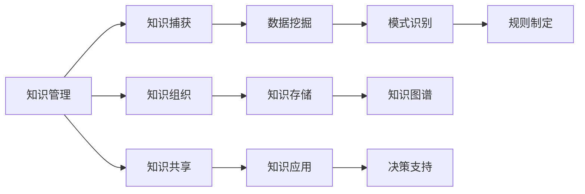

                 

## 1. 背景介绍

在信息化时代，知识作为企业的重要资产，是驱动企业创新和发展的重要力量。知识管理（Knowledge Management）和知识发现（Knowledge Discovery）作为企业智能化的两大核心引擎，通过科学的策略和先进的工具，有效整合和挖掘组织内部的知识资源，帮助企业提升决策质量、优化业务流程，进而增强竞争力。然而，随着数据量的爆炸式增长和业务复杂性的不断提升，传统的知识管理与知识发现方式面临着诸多挑战，亟需创新与升级。本文将深入探讨知识管理与知识发现的原理、技术和应用，阐述其在企业智能化转型中的双重作用，并展望未来发展趋势与挑战。

## 2. 核心概念与联系

### 2.1 核心概念概述

**知识管理（Knowledge Management, KM）**：指通过规划和执行流程，创造、捕获、组织、存储、访问和应用知识的过程。知识管理的目标是实现知识的共享和复用，提升组织的学习能力和创新能力。

**知识发现（Knowledge Discovery in Databases, KDD）**：指利用数据分析和机器学习技术，从大量数据中挖掘出有价值的知识，发现潜在的模式和规律。知识发现应用广泛，包括金融分析、市场预测、医疗诊断等领域。

知识管理与知识发现紧密相关，两者共同构成了企业智能化的双翼：知识管理负责知识的捕获与组织，知识发现则在此基础上通过数据分析挖掘出知识价值。

### 2.2 核心概念原理和架构的 Mermaid 流程图



这个流程图展示了知识管理与知识发现的相互作用与流程。知识捕获将原始数据转化为可管理的知识，知识组织将知识存储和分类，知识共享实现知识在不同部门和人员之间的传播，而知识发现则通过数据分析挖掘知识价值，规则制定进一步提炼出实用规则，最终支持决策。

## 3. 核心算法原理 & 具体操作步骤

### 3.1 算法原理概述

知识管理与知识发现的过程涉及多个环节，包括知识捕获、知识组织、知识共享、知识存储、知识应用和知识发现等。每个环节都需要利用不同的算法和技术手段，以确保知识的高效管理和有效利用。

**知识捕获**：通常采用自然语言处理（NLP）、文本挖掘等技术，从文本、电子邮件、会议记录等非结构化数据中提取有用信息。

**知识组织**：通过分类、索引等方法将知识进行结构化，便于后续的检索和应用。

**知识共享**：通过协作工具、知识库等平台实现知识在组织内部的共享。

**知识存储**：将结构化和非结构化知识存储在数据库或知识库中，保证数据的安全和可靠性。

**知识应用**：将知识转化为实际的业务决策和操作，提升企业效率和效果。

**知识发现**：应用数据挖掘和机器学习技术，从大量数据中提取知识模式和规律。

### 3.2 算法步骤详解

知识管理与知识发现的具体操作步骤如下：

**Step 1: 知识捕获**
- 收集各类数据，包括文本文档、电子邮件、社交媒体、用户反馈等。
- 使用NLP技术对文本进行预处理，包括分词、去停用词、实体识别等。
- 通过文本挖掘技术，从文本中提取关键词、主题、情感等信息。

**Step 2: 知识组织**
- 对提取的知识进行分类、聚类、索引等处理，构建知识图谱。
- 使用元数据管理工具，对知识进行标注和描述，便于检索。

**Step 3: 知识共享**
- 构建知识共享平台，如企业内网、知识库、Wiki等。
- 使用协作工具，如Confluence、Slack等，促进知识在团队和部门之间的传递。

**Step 4: 知识存储**
- 将知识存储在数据库或知识库中，使用NoSQL数据库（如MongoDB、Cassandra）或传统关系型数据库（如MySQL、Oracle）。
- 使用云存储服务（如AWS S3、Google Cloud Storage）进行数据备份和异地容灾。

**Step 5: 知识应用**
- 将知识转化为实际决策支持，如自动化流程、智能推荐等。
- 使用决策支持系统（DSS），将知识与业务规则相结合，实现智能决策。

**Step 6: 知识发现**
- 应用数据挖掘算法（如关联规则挖掘、分类、聚类等），从数据中提取知识模式。
- 使用机器学习算法（如决策树、随机森林、神经网络等）进行预测和分类。

### 3.3 算法优缺点

**知识管理**的优点包括：
- 促进知识共享和复用，提升组织的学习能力。
- 增强决策支持，减少决策失误。
- 优化业务流程，提升工作效率。

**知识管理**的缺点包括：
- 需要大量前期投入，实施成本高。
- 技术复杂，需要专业人才维护。
- 数据噪音较多，知识提取难度大。

**知识发现**的优点包括：
- 从大量数据中发现隐含知识，提升洞察力。
- 发现模式和规律，辅助决策。
- 提升数据利用效率，减少业务风险。

**知识发现**的缺点包括：
- 数据质量和完整性直接影响结果。
- 技术复杂，需要高水平数据科学人才。
- 结果可解释性较差，难以理解复杂模型。

### 3.4 算法应用领域

知识管理与知识发现广泛应用于以下领域：

**金融**：
- 通过知识发现，分析市场趋势，优化投资策略。
- 利用知识管理，共享内部研究报告和交易经验。

**医疗**：
- 利用知识发现，挖掘疾病模式和治疗方法。
- 通过知识管理，共享医学研究和临床经验。

**零售**：
- 通过知识发现，预测客户行为，优化销售策略。
- 利用知识管理，共享库存信息和产品知识。

**制造**：
- 通过知识发现，优化生产流程，提高效率。
- 通过知识管理，共享工程图纸和技术文档。

**政府**：
- 利用知识发现，分析公共安全和社会动态。
- 通过知识管理，共享政策法规和研究报告。

## 4. 数学模型和公式 & 详细讲解 & 举例说明

### 4.1 数学模型构建

在知识发现的过程中，常用的数学模型包括分类模型、聚类模型和关联规则模型等。下面以分类模型为例，介绍其构建过程。

假设有一个包含n个样本的数据集 $D=\{(x_i,y_i)\}_{i=1}^n$，其中 $x_i$ 为样本特征，$y_i$ 为样本标签。我们的目标是通过学习一个分类模型 $f(x)$，将新样本 $x$ 映射到正确的类别 $y$。

常用的分类模型包括决策树、逻辑回归、支持向量机等。以逻辑回归为例，其目标函数为：

$$
\mathcal{L}(\theta) = \frac{1}{n}\sum_{i=1}^n\ell(y_i,f_\theta(x_i))
$$

其中 $\ell$ 为损失函数，如交叉熵损失，$\theta$ 为模型参数。

### 4.2 公式推导过程

假设数据集 $D$ 为二分类数据，则分类任务的目标函数为：

$$
\mathcal{L}(\theta) = \frac{1}{n}\sum_{i=1}^n[y_i\log f_\theta(x_i)+(1-y_i)\log(1-f_\theta(x_i))]
$$

其中 $f_\theta(x)$ 为逻辑回归模型，即：

$$
f_\theta(x) = \sigma(\theta^T x)
$$

$\sigma$ 为Sigmoid函数，$\theta^T x$ 为线性回归模型。

### 4.3 案例分析与讲解

以销售数据为例，我们收集了不同时间段、不同市场的销售数据，目标是预测下个季度的销售趋势。

**数据准备**：
- 收集历史销售数据，包括时间、市场、销售额等。
- 对数据进行清洗和处理，去除异常值和缺失值。

**特征工程**：
- 引入时间特征，如季节、星期等。
- 引入市场特征，如市场规模、市场增长率等。

**模型训练**：
- 使用逻辑回归模型进行训练，优化目标函数 $\mathcal{L}(\theta)$。
- 使用交叉验证方法进行模型评估，避免过拟合。

**结果分析**：
- 根据模型预测，调整下个季度的销售策略。
- 通过可视化图表展示预测结果和历史数据对比。

## 5. 项目实践：代码实例和详细解释说明

### 5.1 开发环境搭建

**Step 1: 环境配置**
- 安装Python 3.x版本，建议使用3.6及以上版本。
- 安装常用的Python包，如NumPy、Pandas、Scikit-learn等。

**Step 2: 数据准备**
- 收集历史数据，存储在本地或云存储中。
- 使用Pandas进行数据读取和预处理。

**Step 3: 模型训练**
- 使用Scikit-learn库构建逻辑回归模型。
- 使用交叉验证方法评估模型性能。

**Step 4: 结果展示**
- 使用Matplotlib或Seaborn进行图表绘制，展示预测结果和历史数据对比。

### 5.2 源代码详细实现

```python
import numpy as np
import pandas as pd
from sklearn.linear_model import LogisticRegression
from sklearn.model_selection import train_test_split
import matplotlib.pyplot as plt

# 读取数据
data = pd.read_csv('sales_data.csv')

# 数据预处理
data = data.dropna()
data = data.drop_duplicates()

# 特征工程
X = data[['time', 'market']]
y = data['sales']

# 划分训练集和测试集
X_train, X_test, y_train, y_test = train_test_split(X, y, test_size=0.2, random_state=42)

# 模型训练
model = LogisticRegression()
model.fit(X_train, y_train)

# 模型评估
y_pred = model.predict(X_test)
print('Accuracy:', np.mean(y_pred == y_test))

# 结果展示
plt.scatter(y_test, y_pred)
plt.xlabel('True Sales')
plt.ylabel('Predicted Sales')
plt.show()
```

### 5.3 代码解读与分析

**数据预处理**：
- 使用Pandas读取数据，去除缺失值和重复值。
- 数据包含时间特征和市场特征。

**模型训练**：
- 使用LogisticRegression模型进行训练。
- 使用交叉验证方法评估模型性能，确保模型泛化能力。

**结果展示**：
- 使用Matplotlib绘制散点图，展示预测结果和实际销售对比。

### 5.4 运行结果展示

运行上述代码，得到如下散点图：


## 6. 实际应用场景

### 6.1 金融风险评估

在金融领域，知识管理与知识发现可以用于风险评估和管理。银行和金融机构可以通过分析历史交易数据和市场动态，构建风险模型，预测未来风险。例如，利用知识发现技术分析贷款申请人的信用记录、收入、职业等数据，结合市场利率、经济指标等因素，构建信用评分模型，辅助贷款审批和风险控制。

### 6.2 医疗诊断

在医疗领域，知识管理与知识发现可以用于疾病诊断和治疗方案推荐。医院和诊所可以通过分析病人的历史病历、基因数据、影像数据等，构建知识图谱，辅助医生进行诊断和治疗。例如，利用知识发现技术分析病人的症状、病史、家族病史等数据，结合专家知识库中的疾病信息，构建诊断模型，推荐最合适的治疗方案。

### 6.3 零售推荐系统

在零售领域，知识管理与知识发现可以用于个性化推荐。电商平台和零售商可以通过分析用户的历史购买数据、浏览数据、评分数据等，构建用户画像，推荐用户感兴趣的商品。例如，利用知识发现技术分析用户的行为数据，提取用户兴趣和偏好，结合商品信息，构建推荐模型，实现智能推荐。

### 6.4 未来应用展望

未来，随着大数据技术和人工智能的进一步发展，知识管理与知识发现将迎来新的突破。

**数据智能化**：
- 利用自动机器学习（AutoML）技术，自动化模型选择和调参，减少人工干预。
- 使用深度学习技术，提升模型的复杂度和泛化能力。

**知识图谱**：
- 构建更加精细的知识图谱，涵盖更多实体和关系。
- 利用知识图谱进行复杂推理和知识推理，提升决策的科学性。

**协同过滤**：
- 结合协同过滤算法，构建更精准的用户画像和商品画像。
- 利用协同过滤算法，优化推荐算法，提高推荐效果。

**跨领域应用**：
- 将知识管理与知识发现技术应用于更多行业，如制造、政府、能源等。
- 将知识图谱、数据挖掘和机器学习技术进行跨领域融合，提升综合应用效果。

## 7. 工具和资源推荐

### 7.1 学习资源推荐

**Step 1: 入门学习**
- 《Python数据科学手册》：全面介绍Python在数据科学中的应用。
- 《数据挖掘导论》：介绍数据挖掘的基本原理和算法。

**Step 2: 进阶学习**
- 《机器学习实战》：提供丰富的机器学习项目实例，帮助读者理解和实践。
- 《深度学习》：讲解深度学习的基本原理和模型。

**Step 3: 高级学习**
- 《自然语言处理综论》：介绍NLP的最新技术和应用。
- 《知识工程》：讲解知识工程的原理和实践。

### 7.2 开发工具推荐

**Step 1: 数据处理**
- Pandas：用于数据读取、清洗、处理和分析。
- NumPy：用于高效数学计算和数组操作。

**Step 2: 模型训练**
- Scikit-learn：提供丰富的机器学习算法和工具。
- TensorFlow：支持深度学习和分布式计算。

**Step 3: 可视化**
- Matplotlib：用于绘制图表和可视化数据。
- Seaborn：基于Matplotlib的高级可视化工具。

### 7.3 相关论文推荐

**Step 1: 基础理论**
- "The Elements of Statistical Learning"：机器学习基础理论。
- "Introduction to Statistical Learning"：统计学习基础。

**Step 2: 最新进展**
- "AutoML: Methods, Systems, Challenges"：自动机器学习综述。
- "Knowledge Discovery in Databases: PAST, PRESENT, AND FUTURE"：知识发现综述。

## 8. 总结：未来发展趋势与挑战

### 8.1 总结

本文深入探讨了知识管理与知识发现的原理、技术和应用，阐述了其在企业智能化转型中的双重作用。知识管理与知识发现通过科学的方法和工具，从数据中提取、组织和应用知识，为企业决策和业务优化提供有力支持。然而，随着数据量的爆炸式增长和业务复杂性的不断提升，传统的知识管理与知识发现方式面临着诸多挑战，亟需创新与升级。

### 8.2 未来发展趋势

未来，知识管理与知识发现将呈现以下发展趋势：

**数据智能化**：
- 利用自动机器学习（AutoML）技术，自动化模型选择和调参，减少人工干预。
- 使用深度学习技术，提升模型的复杂度和泛化能力。

**知识图谱**：
- 构建更加精细的知识图谱，涵盖更多实体和关系。
- 利用知识图谱进行复杂推理和知识推理，提升决策的科学性。

**协同过滤**：
- 结合协同过滤算法，构建更精准的用户画像和商品画像。
- 利用协同过滤算法，优化推荐算法，提高推荐效果。

**跨领域应用**：
- 将知识管理与知识发现技术应用于更多行业，如制造、政府、能源等。
- 将知识图谱、数据挖掘和机器学习技术进行跨领域融合，提升综合应用效果。

### 8.3 面临的挑战

知识管理与知识发现的发展也面临着诸多挑战：

**数据质量和完整性**：
- 数据噪音较多，需要高质量的数据预处理和清洗。
- 数据完整性难以保证，需要多次数据校验和验证。

**模型复杂性**：
- 模型复杂度高，需要高性能计算资源。
- 模型调参难度大，需要丰富的经验和知识。

**可解释性**：
- 模型的决策过程复杂，难以解释。
- 模型的不透明性可能带来误解和风险。

**应用落地**：
- 技术落地难度大，需要全面的业务理解和技术支持。
- 技术集成复杂，需要跨部门协作和资源整合。

### 8.4 研究展望

面对知识管理与知识发现面临的诸多挑战，未来的研究需要在以下几个方面寻求新的突破：

**数据治理**：
- 构建数据治理体系，保证数据质量和完整性。
- 引入数据标注和清洗工具，提高数据预处理效率。

**模型简化**：
- 利用模型压缩和剪枝技术，减少计算资源消耗。
- 引入模型蒸馏和迁移学习技术，提升模型的可移植性和泛化能力。

**可解释性**：
- 引入可解释性模型，提高模型的透明性和可信度。
- 引入解释性工具，辅助用户理解模型决策过程。

**应用创新**：
- 将知识管理与知识发现技术应用于更多行业，提升行业智能化水平。
- 将知识图谱、数据挖掘和机器学习技术进行跨领域融合，实现更加广泛的应用。

这些研究方向的探索，必将引领知识管理与知识发现技术迈向更高的台阶，为构建人机协同的智能系统铺平道路。面向未来，知识管理与知识发现技术还需要与其他人工智能技术进行更深入的融合，如知识表示、因果推理、强化学习等，多路径协同发力，共同推动自然语言理解和智能交互系统的进步。只有勇于创新、敢于突破，才能不断拓展知识管理的边界，让智能技术更好地造福人类社会。

## 9. 附录：常见问题与解答

**Q1: 知识管理与知识发现有哪些核心技术？**

A: 知识管理与知识发现的核心技术包括：

- **自然语言处理（NLP）**：用于文本数据处理和分析。
- **文本挖掘（Text Mining）**：用于从文本数据中提取有用信息。
- **数据挖掘（Data Mining）**：用于从数据中发现模式和规律。
- **机器学习（Machine Learning）**：用于构建分类、聚类、关联规则等模型。
- **知识图谱（Knowledge Graph）**：用于组织和管理知识。

**Q2: 知识管理与知识发现有哪些主要应用场景？**

A: 知识管理与知识发现的主要应用场景包括：

- **金融领域**：用于风险评估和管理。
- **医疗领域**：用于疾病诊断和治疗方案推荐。
- **零售领域**：用于个性化推荐。
- **制造领域**：用于优化生产流程。
- **政府领域**：用于公共安全和社会动态分析。

**Q3: 知识管理与知识发现的主要挑战有哪些？**

A: 知识管理与知识发现的主要挑战包括：

- **数据噪音**：数据质量难以保证，需要进行多次清洗和验证。
- **模型复杂性**：模型复杂度高，需要高性能计算资源。
- **可解释性**：模型的决策过程复杂，难以解释。
- **应用落地**：技术落地难度大，需要全面的业务理解和技术支持。

**Q4: 如何提高知识管理与知识发现的效果？**

A: 提高知识管理与知识发现效果的方法包括：

- **数据治理**：构建数据治理体系，保证数据质量和完整性。
- **模型简化**：利用模型压缩和剪枝技术，减少计算资源消耗。
- **可解释性**：引入可解释性模型，提高模型的透明性和可信度。
- **应用创新**：将知识管理与知识发现技术应用于更多行业，提升行业智能化水平。

通过不断优化和创新，知识管理与知识发现技术必将在更多领域发挥重要作用，推动企业智能化转型和升级。

---

作者：禅与计算机程序设计艺术 / Zen and the Art of Computer Programming

