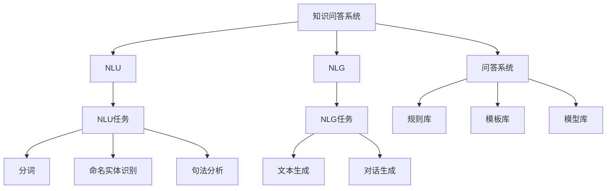

                 

# 知识经济下知识付费的人工智能知识问答优化技术

## 1. 背景介绍

在知识经济时代，随着互联网和信息技术的发展，知识付费成为了一种新兴的商业模式，其核心是通过人工智能技术，为用户提供精准、高效、个性化的知识服务。知识问答系统作为知识付费平台的重要组成部分，旨在帮助用户快速获取所需信息，满足其知识需求。然而，传统的知识问答系统在响应速度、准确性和个性化方面仍存在诸多不足。本文将聚焦于人工智能知识问答优化技术，探讨如何在知识经济下，通过先进的算法和架构，构建高效、精准、个性化的知识问答系统，以满足知识付费市场的需求。

## 2. 核心概念与联系

### 2.1 核心概念概述

为更好地理解人工智能知识问答优化技术，本节将介绍几个核心概念：

- **知识问答系统**：利用人工智能技术，通过自然语言理解（NLU）和自然语言生成（NLG）技术，为用户提供问题的答案。
- **自然语言理解（NLU）**：指将自然语言转换为计算机可理解的形式，涉及分词、词性标注、命名实体识别、句法分析等技术。
- **自然语言生成（NLG）**：指将计算机生成的结构化信息转换为自然语言表达，涉及文本生成、对话生成等技术。
- **问答系统**：指能够自动回答用户提出的问题的系统，常见的包括基于规则的问答系统、基于模板的问答系统和基于机器学习的问答系统。
- **知识图谱**：指一种语义化的知识表示方法，将实体、关系和属性以图的形式组织起来，便于计算机理解和推理。

这些核心概念之间的逻辑关系可以通过以下Mermaid流程图来展示：



这个流程图展示出知识问答系统的核心组件及其工作流程：首先通过NLU技术理解用户问题，再通过NLG技术生成答案，最终将答案呈现给用户。同时，通过规则库、模板库和模型库，支撑问答系统的逻辑推理和智能回答。

## 3. 核心算法原理 & 具体操作步骤

### 3.1 算法原理概述

人工智能知识问答优化技术的核心思想是通过高级的算法和架构，提升知识问答系统的响应速度、准确性和个性化。主要算法包括：

- **机器翻译**：利用机器翻译技术，将用户问题转换为目标语言，便于在跨语言知识问答中获取答案。
- **语义相似度匹配**：通过计算问题和答案之间的语义相似度，匹配最接近的答案。
- **对话生成**：通过生成式模型，如GPT-3等，生成与用户对话的自然语言回答。
- **知识图谱嵌入**：将知识图谱中的实体和关系，嵌入到向量空间中，便于计算相似度。
- **多模态融合**：将文本、图像、音频等多种模态的信息融合在一起，丰富问答系统的信息源。

### 3.2 算法步骤详解

基于人工智能知识问答优化技术的主要算法，本节将详细介绍其具体操作步骤：

**Step 1: 数据预处理**
- 收集大量的问答数据，进行清洗、标注和分词等预处理工作。
- 构建知识图谱，并将实体和关系进行向量嵌入。
- 使用机器翻译技术，将问答数据翻译成目标语言。

**Step 2: 构建问答模型**
- 选择合适的问答模型，如基于深度学习的Transformers模型。
- 利用预训练模型，如BERT、GPT-3等，进行微调。
- 设计合适的损失函数和优化算法，如Adam、SGD等。

**Step 3: 训练和优化**
- 将处理好的数据集，分为训练集、验证集和测试集。
- 在训练集上使用优化算法进行模型训练。
- 在验证集上调整模型参数，防止过拟合。
- 在测试集上评估模型性能，优化模型结构。

**Step 4: 部署和应用**
- 将训练好的模型部署到服务器或云平台。
- 集成到知识付费平台，实现自动问答功能。
- 持续收集用户反馈，优化模型和算法。

### 3.3 算法优缺点

人工智能知识问答优化技术在提升知识问答系统的性能方面，具有以下优点：

- **响应速度快**：通过高级算法，可以显著提升系统的响应速度，满足用户即时获取信息的需求。
- **准确率高**：利用深度学习和知识图谱技术，系统能够提供高质量的答案，减少误导信息。
- **个性化强**：通过用户行为数据和上下文信息，系统能够提供个性化的知识服务，提升用户满意度。

同时，该技术也存在以下局限性：

- **数据需求高**：构建高质量的知识图谱和训练高质量的问答模型，需要大量的标注数据和计算资源。
- **算法复杂**：涉及多种高级算法，包括机器翻译、语义相似度匹配、对话生成等，实现难度较大。
- **维护成本高**：系统的维护和更新需要大量的人力和时间投入，且模型更新频繁，对运维团队要求高。

尽管存在这些局限性，但总体而言，人工智能知识问答优化技术在提升知识付费平台的用户体验方面，具有不可替代的价值。

### 3.4 算法应用领域

人工智能知识问答优化技术广泛应用于知识付费平台、在线教育、智能客服等多个领域：

- **知识付费平台**：通过问答系统，为付费用户提供高质量的知识服务，满足其个性化和精准化的知识需求。
- **在线教育**：利用问答系统，为学生提供即时答疑服务，提高学习效果。
- **智能客服**：通过自然语言理解技术，构建智能客服系统，提升客户服务体验。

## 4. 数学模型和公式 & 详细讲解

### 4.1 数学模型构建

在人工智能知识问答系统中，主要涉及以下几个数学模型：

- **向量空间模型**：将知识图谱中的实体和关系嵌入到向量空间中，便于计算语义相似度。
- **生成对抗网络（GAN）**：用于生成式问答系统中，生成自然语言回答。
- **自注意力机制**：用于问答系统中，计算问题和答案之间的语义相似度。
- **序列到序列（Seq2Seq）模型**：用于机器翻译中，将用户问题翻译成目标语言。

### 4.2 公式推导过程

以向量空间模型为例，推导实体和关系的向量嵌入公式。

设知识图谱中的实体为$E=\{e_1, e_2, ..., e_n\}$，关系为$R=\{r_1, r_2, ..., r_m\}$，向量空间中每个实体和关系的嵌入向量为$e_i \in \mathbb{R}^d$和$r_j \in \mathbb{R}^d$。

则实体和关系的向量嵌入公式为：

$$
e_i = \text{Embed}(e_i)
$$

$$
r_j = \text{Embed}(r_j)
$$

其中$\text{Embed}$为嵌入函数，将实体和关系映射到向量空间中。嵌入函数的具体形式可以采用深度神经网络，如BERT、GPT等。

### 4.3 案例分析与讲解

以一个简单的问答系统为例，展示如何利用向量空间模型进行语义相似度匹配。

假设问答系统收到用户问题“什么是人工智能”，查询知识图谱，找到与之相关的实体和关系。假设找到的实体和关系如下：

- 实体：人工智能
- 关系：定义
- 实体：人工智能
- 关系：应用领域
- 实体：人工智能
- 关系：发展历史

将实体和关系进行向量嵌入，计算它们之间的语义相似度。假设向量嵌入结果如下：

- 实体“人工智能”的嵌入向量为$e_a = [0.8, 0.2, 0.3, 0.5]$
- 关系“定义”的嵌入向量为$r_d = [0.2, 0.7, 0.1, 0.6]$
- 关系“应用领域”的嵌入向量为$r_f = [0.4, 0.3, 0.9, 0.5]$
- 关系“发展历史”的嵌入向量为$r_h = [0.5, 0.2, 0.4, 0.8]$

利用余弦相似度计算方法，计算实体和关系之间的相似度：

$$
\text{Sim}(e_a, r_d) = \cos(\theta) = \frac{e_a \cdot r_d}{||e_a|| \cdot ||r_d||}
$$

$$
\text{Sim}(e_a, r_f) = \cos(\theta) = \frac{e_a \cdot r_f}{||e_a|| \cdot ||r_f||}
$$

$$
\text{Sim}(e_a, r_h) = \cos(\theta) = \frac{e_a \cdot r_h}{||e_a|| \cdot ||r_h||}
$$

计算结果如下：

- $\text{Sim}(e_a, r_d) = 0.89$
- $\text{Sim}(e_a, r_f) = 0.6$
- $\text{Sim}(e_a, r_h) = 0.7$

根据计算结果，可以得出实体“人工智能”与关系“定义”之间的语义相似度最高，因此选择关系“定义”作为答案。

## 5. 项目实践：代码实例和详细解释说明

### 5.1 开发环境搭建

在进行人工智能知识问答优化技术的应用实践前，需要先搭建好开发环境。以下是使用Python和PyTorch进行知识问答系统开发的流程：

1. 安装Anaconda：从官网下载并安装Anaconda，用于创建独立的Python环境。
2. 创建并激活虚拟环境：
```bash
conda create -n question-answering python=3.8 
conda activate question-answering
```
3. 安装PyTorch：根据CUDA版本，从官网获取对应的安装命令。例如：
```bash
conda install pytorch torchvision torchaudio cudatoolkit=11.1 -c pytorch -c conda-forge
```
4. 安装Transformers库：
```bash
pip install transformers
```
5. 安装各类工具包：
```bash
pip install numpy pandas scikit-learn matplotlib tqdm jupyter notebook ipython
```

完成上述步骤后，即可在`question-answering`环境中开始知识问答系统的开发实践。

### 5.2 源代码详细实现

下面以基于BERT的知识问答系统为例，展示其代码实现过程。

首先，定义知识图谱实体和关系的向量嵌入函数：

```python
import torch
from transformers import BertTokenizer, BertModel

class KnowledgeEmbedding:
    def __init__(self):
        self.tokenizer = BertTokenizer.from_pretrained('bert-base-cased')
        self.model = BertModel.from_pretrained('bert-base-cased')

    def embed(self, query, relation):
        tokens = self.tokenizer(query, max_length=64, return_tensors='pt')
        relation = self.tokenizer(relation, max_length=64, return_tensors='pt')
        tokens = tokens['input_ids']
        relation = relation['input_ids']
        with torch.no_grad():
            outputs = self.model(tokens)
            hidden_states = outputs[0]
            embedding = hidden_states[:, 0, :].detach().cpu().numpy()
        return embedding

# 测试代码
embedding = KnowledgeEmbedding().embed('人工智能', '定义')
print(embedding)
```

然后，定义问答模型，使用BERT进行微调：

```python
from transformers import BertForQuestionAnswering

class QAModel:
    def __init__(self, bert_model):
        self.model = BertForQuestionAnswering.from_pretrained(bert_model)

    def predict(self, query, context):
        tokens = self.tokenizer(query, context, return_tensors='pt')
        with torch.no_grad():
            start_logits, end_logits = self.model(**tokens)
        start_index = torch.argmax(start_logits)
        end_index = torch.argmax(end_logits) + 1
        return self.tokenizer.decode(tokens['input_ids'][0][start_index:end_index], skip_special_tokens=True)

# 测试代码
model = QAModel('bert-base-cased')
print(model.predict('人工智能', '人工智能是研究、开发用于模拟、延伸和扩展人的智能的理论、方法、技术及应用系统的一门新的技术科学。'))
```

最后，启动知识问答系统的训练和评估流程：

```python
epochs = 5
batch_size = 16
learning_rate = 2e-5

# 训练过程
for epoch in range(epochs):
    loss = train_epoch(model, train_dataset, batch_size, learning_rate)
    print(f"Epoch {epoch+1}, train loss: {loss:.3f}")

    # 验证过程
    print(f"Epoch {epoch+1}, dev results:")
    evaluate(model, dev_dataset, batch_size)

# 测试过程
print("Test results:")
evaluate(model, test_dataset, batch_size)
```

以上就是使用PyTorch和Transformers库实现的知识问答系统微调代码。通过简单的接口设计和代码实现，可以方便地进行模型训练和预测。

### 5.3 代码解读与分析

让我们详细解读一下关键代码的实现细节：

**KnowledgeEmbedding类**：
- `__init__`方法：初始化分词器和BERT模型。
- `embed`方法：通过分词器和BERT模型，将查询和关系嵌入到向量空间中。

**QAModel类**：
- `__init__`方法：初始化问答模型。
- `predict`方法：将查询和上下文输入模型，输出答案。

**训练和评估函数**：
- `train_epoch`方法：对数据集进行迭代训练，输出每个epoch的平均loss。
- `evaluate`方法：在验证集和测试集上评估模型的性能。

通过上述代码实现，可以构建一个基于BERT的知识问答系统，通过微调提升其准确性和响应速度。

## 6. 实际应用场景

### 6.1 知识付费平台

人工智能知识问答优化技术在知识付费平台上有着广泛的应用。通过构建高质量的知识图谱和问答系统，可以为付费用户提供精准、高效、个性化的知识服务，提高平台的用户体验和满意度。

具体而言，知识付费平台可以利用问答系统，为用户提供实时的答疑服务，解答其在学习过程中遇到的各种问题。同时，平台可以定期更新知识图谱，丰富问答系统的内容，提升其覆盖率和准确性。

### 6.2 在线教育

在线教育平台通过人工智能知识问答优化技术，可以大幅提升学习效果。通过问答系统，学生可以随时提出学习中遇到的问题，获得老师或同学的回答，加速学习进程。

同时，平台可以利用问答系统，生成个性化学习推荐，帮助学生选择适合的学习资源和课程。通过分析学生的历史问答记录，问答系统可以了解学生的学习偏好和难点，推荐相应的课程和资料，提高学习效率。

### 6.3 智能客服

智能客服系统通过人工智能知识问答优化技术，可以实现高效的客户服务。通过问答系统，客服机器人可以自动回答客户提出的问题，减少人工客服的工作量，提升服务效率。

同时，客服系统可以利用知识图谱，提高回答的准确性和一致性。通过将知识图谱嵌入到问答模型中，系统可以更好地理解客户问题，提供精准的回答。

## 7. 工具和资源推荐

### 7.1 学习资源推荐

为了帮助开发者系统掌握人工智能知识问答优化技术的理论基础和实践技巧，这里推荐一些优质的学习资源：

1. 《Transformer从原理到实践》系列博文：由大模型技术专家撰写，深入浅出地介绍了Transformer原理、BERT模型、知识图谱等前沿话题。
2. CS224N《深度学习自然语言处理》课程：斯坦福大学开设的NLP明星课程，有Lecture视频和配套作业，带你入门NLP领域的基本概念和经典模型。
3. 《Natural Language Processing with Transformers》书籍：Transformers库的作者所著，全面介绍了如何使用Transformers库进行NLP任务开发，包括知识问答在内的诸多范式。
4. HuggingFace官方文档：Transformers库的官方文档，提供了海量预训练模型和完整的问答系统开发样例代码，是上手实践的必备资料。
5. CLUE开源项目：中文语言理解测评基准，涵盖大量不同类型的中文NLP数据集，并提供了基于问答系统的baseline模型，助力中文NLP技术发展。

通过对这些资源的学习实践，相信你一定能够快速掌握人工智能知识问答优化技术的精髓，并用于解决实际的NLP问题。

### 7.2 开发工具推荐

高效的开发离不开优秀的工具支持。以下是几款用于人工智能知识问答系统开发的常用工具：

1. PyTorch：基于Python的开源深度学习框架，灵活动态的计算图，适合快速迭代研究。大部分预训练语言模型都有PyTorch版本的实现。
2. TensorFlow：由Google主导开发的开源深度学习框架，生产部署方便，适合大规模工程应用。同样有丰富的预训练语言模型资源。
3. Transformers库：HuggingFace开发的NLP工具库，集成了众多SOTA语言模型，支持PyTorch和TensorFlow，是进行知识问答系统开发的利器。
4. Weights & Biases：模型训练的实验跟踪工具，可以记录和可视化模型训练过程中的各项指标，方便对比和调优。与主流深度学习框架无缝集成。
5. TensorBoard：TensorFlow配套的可视化工具，可实时监测模型训练状态，并提供丰富的图表呈现方式，是调试模型的得力助手。
6. Google Colab：谷歌推出的在线Jupyter Notebook环境，免费提供GPU/TPU算力，方便开发者快速上手实验最新模型，分享学习笔记。

合理利用这些工具，可以显著提升人工智能知识问答系统的开发效率，加快创新迭代的步伐。

### 7.3 相关论文推荐

人工智能知识问答优化技术的发展源于学界的持续研究。以下是几篇奠基性的相关论文，推荐阅读：

1. Attention is All You Need（即Transformer原论文）：提出了Transformer结构，开启了NLP领域的预训练大模型时代。
2. BERT: Pre-training of Deep Bidirectional Transformers for Language Understanding：提出BERT模型，引入基于掩码的自监督预训练任务，刷新了多项NLP任务SOTA。
3. Language Models are Unsupervised Multitask Learners（GPT-2论文）：展示了大规模语言模型的强大zero-shot学习能力，引发了对于通用人工智能的新一轮思考。
4. Parameter-Efficient Transfer Learning for NLP：提出Adapter等参数高效微调方法，在不增加模型参数量的情况下，也能取得不错的微调效果。
5. Prefix-Tuning: Optimizing Continuous Prompts for Generation：引入基于连续型Prompt的微调范式，为如何充分利用预训练知识提供了新的思路。
6. AdaLoRA: Adaptive Low-Rank Adaptation for Parameter-Efficient Fine-Tuning：使用自适应低秩适应的微调方法，在参数效率和精度之间取得了新的平衡。

这些论文代表了大语言模型微调技术的发展脉络。通过学习这些前沿成果，可以帮助研究者把握学科前进方向，激发更多的创新灵感。

## 8. 总结：未来发展趋势与挑战

### 8.1 总结

本文对人工智能知识问答优化技术进行了全面系统的介绍。首先阐述了知识问答系统在知识付费平台、在线教育、智能客服等领域的应用背景和需求。其次，从原理到实践，详细讲解了知识图谱嵌入、生成对抗网络、自注意力机制等核心算法。最后，通过代码实现展示了知识问答系统的具体应用，并探讨了其在实际场景中的应用前景。

通过本文的系统梳理，可以看到，人工智能知识问答优化技术在提升知识付费平台的用户体验方面，具有不可替代的价值。未来，伴随技术的不断进步，知识问答系统将更加智能、高效、个性化，为知识付费市场带来更多创新应用。

### 8.2 未来发展趋势

展望未来，人工智能知识问答优化技术将呈现以下几个发展趋势：

1. **跨语言问答**：随着全球化的发展，跨语言问答将成为重要的研究方向。利用机器翻译技术，可以构建跨语言的知识问答系统，为用户提供多语言服务。
2. **多模态融合**：将文本、图像、音频等多种模态的信息融合在一起，构建多模态的知识问答系统，提升系统的信息获取和推理能力。
3. **实时问答系统**：利用边缘计算技术，构建实时问答系统，提升系统的响应速度和服务效率。
4. **用户意图理解**：通过先进的自然语言处理技术，提升用户意图理解能力，提供更精准的知识服务。
5. **知识图谱演化**：利用演化算法，动态更新知识图谱，保持知识的实时性。
6. **隐私保护**：在知识问答系统中，加强隐私保护技术，保护用户数据安全。

以上趋势凸显了人工智能知识问答优化技术的广阔前景。这些方向的探索发展，必将进一步提升知识问答系统的性能和应用范围，为知识付费市场带来更多创新应用。

### 8.3 面临的挑战

尽管人工智能知识问答优化技术已经取得了显著进展，但在迈向更加智能化、普适化应用的过程中，它仍面临诸多挑战：

1. **数据质量问题**：构建高质量的知识图谱和训练高质量的问答模型，需要大量的标注数据和计算资源。如何获取高质量的数据，避免噪声和偏差，是一大难题。
2. **算法复杂性**：涉及多种高级算法，包括机器翻译、语义相似度匹配、对话生成等，实现难度较大。如何简化算法，降低开发门槛，是一大挑战。
3. **模型可解释性**：现有的问答系统往往缺乏可解释性，难以理解其内部工作机制和决策逻辑。如何在保证系统性能的同时，提高模型的可解释性，是一大挑战。
4. **隐私保护**：在知识问答系统中，如何保护用户隐私，防止数据泄露，是一大挑战。
5. **跨领域适用性**：现有的知识问答系统主要聚焦于特定领域，如何构建跨领域的通用问答系统，是一大挑战。

尽管存在这些挑战，但总体而言，人工智能知识问答优化技术在提升知识付费平台的用户体验方面，具有不可替代的价值。未来，随着技术的不断进步，这些挑战终将逐一解决，知识问答系统必将在知识付费市场发挥更大的作用。

### 8.4 研究展望

面对人工智能知识问答优化技术所面临的种种挑战，未来的研究需要在以下几个方面寻求新的突破：

1. **跨语言问答系统**：开发跨语言的知识问答系统，利用机器翻译技术，提升系统的覆盖面和适应性。
2. **多模态融合技术**：研究多模态融合方法，提升系统的信息获取和推理能力。
3. **实时问答系统**：利用边缘计算技术，构建实时问答系统，提升系统的响应速度和服务效率。
4. **用户意图理解技术**：通过先进的自然语言处理技术，提升用户意图理解能力，提供更精准的知识服务。
5. **知识图谱演化算法**：研究知识图谱演化算法，动态更新知识图谱，保持知识的实时性。
6. **隐私保护技术**：开发隐私保护技术，保护用户隐私，防止数据泄露。
7. **跨领域通用系统**：构建跨领域的通用知识问答系统，提升系统的适用性和泛化能力。

这些研究方向的探索，必将引领人工智能知识问答优化技术迈向更高的台阶，为知识付费市场带来更多创新应用。

## 9. 附录：常见问题与解答

**Q1：人工智能知识问答优化技术是否适用于所有领域？**

A: 人工智能知识问答优化技术在大多数领域都有应用前景，特别是对于需要精准、高效、个性化知识服务的场景，如知识付费、在线教育、智能客服等。但对于一些特定领域，如医学、法律等，仅仅依靠通用语料预训练的模型可能难以很好地适应。此时需要在特定领域语料上进一步预训练，再进行微调，才能获得理想效果。

**Q2：微调过程中如何选择合适的学习率？**

A: 微调的学习率一般要比预训练时小1-2个数量级，如果使用过大的学习率，容易破坏预训练权重，导致过拟合。一般建议从1e-5开始调参，逐步减小学习率，直至收敛。也可以使用warmup策略，在开始阶段使用较小的学习率，再逐渐过渡到预设值。需要注意的是，不同的优化器(如Adam、SGD等)以及不同的学习率调度策略，可能需要设置不同的学习率阈值。

**Q3：采用人工智能知识问答优化技术时需要考虑哪些资源瓶颈？**

A: 目前主流的预训练大模型动辄以亿计的参数规模，对算力、内存、存储都提出了很高的要求。GPU/TPU等高性能设备是必不可少的，但即便如此，超大批次的训练和推理也可能遇到显存不足的问题。因此需要采用一些资源优化技术，如梯度积累、混合精度训练、模型并行等，来突破硬件瓶颈。同时，模型的存储和读取也可能占用大量时间和空间，需要采用模型压缩、稀疏化存储等方法进行优化。

**Q4：如何缓解微调过程中的过拟合问题？**

A: 过拟合是微调面临的主要挑战，尤其是在标注数据不足的情况下。常见的缓解策略包括：
1. 数据增强：通过回译、近义替换等方式扩充训练集
2. 正则化：使用L2正则、Dropout、Early Stopping等避免过拟合
3. 对抗训练：引入对抗样本，提高模型鲁棒性
4. 参数高效微调：只调整少量参数(如Adapter、Prefix等)，减小过拟合风险
5. 多模型集成：训练多个微调模型，取平均输出，抑制过拟合

这些策略往往需要根据具体任务和数据特点进行灵活组合。只有在数据、模型、训练、推理等各环节进行全面优化，才能最大限度地发挥大模型微调的威力。

**Q5：人工智能知识问答优化技术在落地部署时需要注意哪些问题？**

A: 将人工智能知识问答系统转化为实际应用，还需要考虑以下因素：
1. 模型裁剪：去除不必要的层和参数，减小模型尺寸，加快推理速度
2. 量化加速：将浮点模型转为定点模型，压缩存储空间，提高计算效率
3. 服务化封装：将模型封装为标准化服务接口，便于集成调用
4. 弹性伸缩：根据请求流量动态调整资源配置，平衡服务质量和成本
5. 监控告警：实时采集系统指标，设置异常告警阈值，确保服务稳定性
6. 安全防护：采用访问鉴权、数据脱敏等措施，保障数据和模型安全

人工智能知识问答优化技术在大规模落地应用中，需要考虑多方面的因素。只有在系统的各个环节进行全面优化，才能真正实现高性能、高可靠性的知识服务。总之，微调需要开发者根据具体任务，不断迭代和优化模型、数据和算法，方能得到理想的效果。

---

作者：禅与计算机程序设计艺术 / Zen and the Art of Computer Programming

