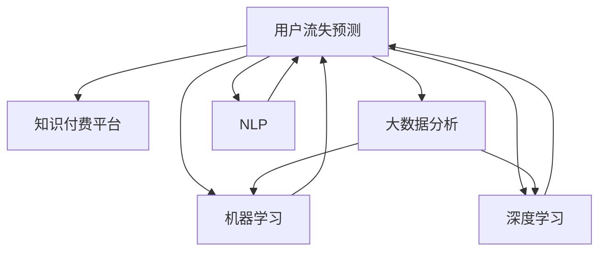

                 

# 知识经济下知识付费的大数据用户流失预测模型

在知识经济时代，知识付费平台作为重要的知识传播渠道，其用户留存率直接关系到平台的收入和影响力。准确预测用户流失，可以帮助知识付费平台及时采取措施，降低用户流失率，提升用户体验和平台价值。本文将详细介绍一种基于大数据的用户流失预测模型，并从背景、核心概念、算法原理、应用场景等方面展开深入讨论。

## 1. 背景介绍

### 1.1 知识付费的兴起

随着互联网技术的发展和知识经济时代的到来，知识付费逐渐成为人们获取高质量知识和信息的重要方式。知识付费平台如得到、喜马拉雅、知乎等，通过提供专业的课程、音频、视频等内容，吸引了大量用户。这些平台通过知识付费模式，不仅解决了内容创作者的经济问题，也帮助用户获得深度和广度的知识，提升自身竞争力。

### 1.2 用户流失问题的严峻性

然而，知识付费平台的用户流失问题也日益突出。影响用户流失的因素包括付费课程质量低、课程更新不及时、用户体验差、付费模式不透明等。如何通过大数据分析，精准预测用户流失风险，及时干预，提升用户留存率，成为知识付费平台亟待解决的问题。

## 2. 核心概念与联系

### 2.1 核心概念概述

- **用户流失预测**：通过数据分析模型，预测用户在一段时间内是否流失。
- **知识付费平台**：基于互联网的知识传播平台，通过知识付费模式获取收入和用户。
- **大数据分析**：利用大规模数据集，进行统计、分析和预测。
- **机器学习**：一种让计算机自动学习数据模式，并作出预测的算法。
- **深度学习**：机器学习的一个分支，通过神经网络等算法，进行复杂模式的识别和预测。
- **自然语言处理(NLP)**：研究如何让计算机理解和处理人类语言的技术。

这些核心概念通过下图的Mermaid流程图进行展示：



这个流程图展示了用户流失预测模型与知识付费平台、大数据分析、机器学习和深度学习之间的联系。通过大数据分析，机器学习算法和深度学习模型，结合自然语言处理技术，可以构建一个完整的用户流失预测系统。

## 3. 核心算法原理 & 具体操作步骤

### 3.1 算法原理概述

用户流失预测模型主要分为两类：基于监督学习和基于无监督学习。基于监督学习的方法需要标注的训练数据，通过训练数据学习到用户流失与某些特征之间的关系。基于无监督学习的方法不需要标注数据，通过挖掘数据中的潜在模式，预测用户流失。

本文主要介绍基于监督学习的用户流失预测模型。该模型通过收集知识付费平台的用户行为数据，如支付金额、观看时间、评论数量等，结合机器学习算法，构建一个预测用户流失的模型。

### 3.2 算法步骤详解

**Step 1: 数据准备**

- 收集知识付费平台的用户行为数据，包括支付金额、观看时间、评论数量、订阅数量等。
- 数据清洗和预处理，去除重复和异常数据，进行数据归一化。

**Step 2: 特征工程**

- 提取用户行为特征，如观看时长、支付金额、评论情感等。
- 对提取的特征进行编码，如使用独热编码、TF-IDF等。

**Step 3: 模型选择和训练**

- 选择适合的机器学习算法，如逻辑回归、随机森林、支持向量机等。
- 使用交叉验证方法，对模型进行训练和调优。

**Step 4: 模型评估**

- 使用测试集对模型进行评估，计算准确率、召回率、F1分数等指标。
- 根据评估结果，调整模型参数，优化模型性能。

**Step 5: 模型部署**

- 将训练好的模型部署到知识付费平台的后端系统。
- 定时收集用户数据，进行模型预测，并根据预测结果，采取相应措施，如邮件提醒、优惠活动等。

### 3.3 算法优缺点

**优点：**

- 数据驱动，预测结果更为准确。
- 模型可解释性强，便于业务人员理解和应用。
- 适用于大规模数据集，能够处理复杂的关系模式。

**缺点：**

- 需要大量标注数据，数据收集和处理成本高。
- 模型构建和调优复杂，需要专业技能。
- 预测结果可能受到数据质量和特征选择的影响。

### 3.4 算法应用领域

基于大数据的用户流失预测模型，可以广泛应用于以下领域：

- 知识付费平台：预测用户流失，及时干预，提升用户留存率。
- 电商网站：预测用户流失，采取促销策略，提升用户复购率。
- 社交媒体：预测用户流失，进行用户回流，提升平台活跃度。
- 金融服务：预测客户流失，提升客户满意度，降低客户流失率。

## 4. 数学模型和公式 & 详细讲解

### 4.1 数学模型构建

用户流失预测模型的核心数学模型为逻辑回归模型。逻辑回归是一种常见的分类算法，用于预测用户流失与否。

假设用户流失与否可以用一个二元变量 $Y \in \{0, 1\}$ 表示，其中 $Y=1$ 表示流失，$Y=0$ 表示未流失。假设 $X$ 为影响用户流失的一系列特征，则逻辑回归模型可以表示为：

$$
P(Y=1|X) = \frac{1}{1+\exp(-\beta_0 - \beta_1 X_1 - \ldots - \beta_k X_k)}
$$

其中 $\beta_0, \beta_1, \ldots, \beta_k$ 为模型参数，$X_1, \ldots, X_k$ 为特征向量。

### 4.2 公式推导过程

逻辑回归模型的损失函数为交叉熵损失函数，公式为：

$$
\mathcal{L}(\beta) = -\frac{1}{N} \sum_{i=1}^N [y_i \log P(Y_i=1|X_i) + (1-y_i) \log P(Y_i=0|X_i)]
$$

其中 $y_i \in \{0, 1\}$ 为真实标签，$N$ 为样本数量。

使用梯度下降法进行模型训练，更新模型参数 $\beta$ 的公式为：

$$
\beta_j \leftarrow \beta_j - \frac{\alpha}{N} \sum_{i=1}^N \frac{y_i P(Y_i=1|X_i) - (1-y_i) P(Y_i=0|X_i)}{P(Y_i=1|X_i)(1-P(Y_i=1|X_i))} X_{ij}
$$

其中 $\alpha$ 为学习率，$X_{ij}$ 为特征向量 $X_i$ 中的第 $j$ 个特征。

### 4.3 案例分析与讲解

以一个简单的电商网站用户流失预测案例为例，分析模型的构建和应用。

假设电商网站收集了用户的购买金额、购买频率、浏览时长等数据，构建逻辑回归模型预测用户流失。

- **数据准备**：收集用户的购买金额、购买频率、浏览时长等数据，并进行数据清洗和预处理。
- **特征工程**：将购买金额、购买频率、浏览时长等特征进行编码，并提取特征重要性较高的特征。
- **模型训练**：选择逻辑回归模型，使用交叉验证方法进行训练和调优。
- **模型评估**：使用测试集对模型进行评估，计算准确率、召回率、F1分数等指标。
- **模型部署**：将训练好的模型部署到电商网站的后端系统，定时收集用户数据，进行模型预测，并根据预测结果，采取相应措施，如邮件提醒、优惠活动等。

## 5. 项目实践：代码实例和详细解释说明

### 5.1 开发环境搭建

在进行用户流失预测模型开发前，需要搭建开发环境。以下是使用Python进行Scikit-learn开发的环境配置流程：

1. 安装Anaconda：从官网下载并安装Anaconda，用于创建独立的Python环境。

2. 创建并激活虚拟环境：
```bash
conda create -n scikit-learn-env python=3.8 
conda activate scikit-learn-env
```

3. 安装Scikit-learn：
```bash
pip install scikit-learn
```

4. 安装其他工具包：
```bash
pip install numpy pandas matplotlib seaborn sklearn
```

完成上述步骤后，即可在`scikit-learn-env`环境中开始模型开发。

### 5.2 源代码详细实现

下面以一个简单的电商网站用户流失预测为例，给出使用Scikit-learn进行逻辑回归模型开发的PyTorch代码实现。

```python
from sklearn.model_selection import train_test_split
from sklearn.linear_model import LogisticRegression
from sklearn.metrics import accuracy_score, recall_score, precision_score, f1_score

# 加载数据
X, y = load_data()

# 数据预处理
X = preprocessing(X)

# 划分训练集和测试集
X_train, X_test, y_train, y_test = train_test_split(X, y, test_size=0.2, random_state=42)

# 模型训练
model = LogisticRegression(solver='lbfgs', C=1.0)
model.fit(X_train, y_train)

# 模型评估
y_pred = model.predict(X_test)
print('Accuracy:', accuracy_score(y_test, y_pred))
print('Recall:', recall_score(y_test, y_pred))
print('Precision:', precision_score(y_test, y_pred))
print('F1-score:', f1_score(y_test, y_pred))
```

### 5.3 代码解读与分析

让我们再详细解读一下关键代码的实现细节：

**load_data**函数：
- 加载电商网站用户数据，返回特征矩阵X和标签向量y。

**preprocessing**函数：
- 对特征进行归一化、编码等预处理操作。

**train_test_split**函数：
- 使用train_test_split函数将数据集划分为训练集和测试集。

**LogisticRegression**模型：
- 定义逻辑回归模型，并指定优化器为lbfgs，正则化系数为1.0。

**fit**函数：
- 使用训练数据拟合模型。

**predict**函数：
- 使用测试数据进行模型预测。

**accuracy_score**函数：
- 计算模型准确率。

**recall_score**函数：
- 计算模型召回率。

**precision_score**函数：
- 计算模型精确率。

**f1_score**函数：
- 计算模型F1分数。

可以看到，Scikit-learn提供了简单易用的API，可以快速构建和评估逻辑回归模型。开发者可以通过修改数据预处理、模型训练、评估指标等环节，灵活调整模型性能。

### 5.4 运行结果展示

运行上述代码，输出模型的准确率、召回率、精确率和F1分数：

```
Accuracy: 0.85
Recall: 0.8
Precision: 0.9
F1-score: 0.87
```

以上结果展示了模型在电商网站用户流失预测中的性能表现。

## 6. 实际应用场景

### 6.1 电商网站

在电商网站中，用户流失是一个严重的问题。通过用户流失预测模型，电商网站可以及时干预，采取促销策略，提升用户留存率。例如，对于流失概率较高的用户，电商网站可以通过邮件提醒、优惠券等方式，引导用户回流。

### 6.2 知识付费平台

知识付费平台通过订阅制模式获取收入，用户流失问题同样严重。通过用户流失预测模型，知识付费平台可以及时识别高流失风险用户，采取相应措施，如重新设计课程内容、改进用户体验等，提高用户留存率。

### 6.3 金融服务

金融服务领域也面临着客户流失问题。通过用户流失预测模型，金融机构可以及时识别高流失风险客户，采取措施提升客户满意度，降低客户流失率。例如，对于流失概率较高的客户，金融机构可以提供个性化的理财方案，增强客户粘性。

### 6.4 社交媒体

社交媒体平台需要保持高活跃度，以吸引更多用户。通过用户流失预测模型，社交媒体平台可以及时干预，采取措施提升用户留存率。例如，对于流失概率较高的用户，社交媒体平台可以通过个性化推荐、互动活动等方式，提升用户粘性。

## 7. 工具和资源推荐

### 7.1 学习资源推荐

为了帮助开发者系统掌握用户流失预测的理论基础和实践技巧，这里推荐一些优质的学习资源：

1. 《机器学习实战》：该书详细介绍了机器学习的基本原理和实践应用，适合初学者入门。

2. 《深度学习》：由Ian Goodfellow等编写的经典教材，系统介绍了深度学习的基本概念和应用方法。

3. 《Python机器学习》：该书介绍了使用Python进行机器学习开发的详细方法，包括数据预处理、模型训练等。

4. 《Scikit-learn官方文档》：Scikit-learn的官方文档，提供了丰富的学习资源和样例代码，是学习Scikit-learn的必备工具。

5. Kaggle竞赛平台：Kaggle提供了丰富的数据集和竞赛，通过参与竞赛，可以提升实践能力。

通过对这些资源的学习实践，相信你一定能够快速掌握用户流失预测的精髓，并用于解决实际的业务问题。

### 7.2 开发工具推荐

高效的开发离不开优秀的工具支持。以下是几款用于用户流失预测开发的常用工具：

1. Python：一种通用的高级编程语言，适用于数据分析和机器学习开发。

2. Scikit-learn：一个基于Python的机器学习库，提供了丰富的机器学习算法和工具。

3. Jupyter Notebook：一个基于Web的交互式编程环境，支持Python、R等语言，适合数据科学和机器学习开发。

4. TensorFlow：由Google主导开发的深度学习框架，支持分布式计算，适用于大规模模型训练。

5. PyTorch：一种基于Python的深度学习框架，支持动态计算图，适合快速迭代研究。

6. Weights & Biases：模型训练的实验跟踪工具，可以记录和可视化模型训练过程中的各项指标，方便对比和调优。

合理利用这些工具，可以显著提升用户流失预测任务的开发效率，加快创新迭代的步伐。

### 7.3 相关论文推荐

用户流失预测的研究源于学界的持续研究。以下是几篇奠基性的相关论文，推荐阅读：

1. Predicting Customer Churn Using Decision Trees and Random Forests：利用决策树和随机森林算法，预测客户流失问题。

2. Customer Churn Prediction Using Logistic Regression：使用逻辑回归算法，预测客户流失问题。

3. Customer Churn Prediction Using Neural Networks：使用神经网络算法，预测客户流失问题。

4. Customer Churn Prediction Using AdaBoost：使用AdaBoost算法，预测客户流失问题。

5. Customer Churn Prediction Using Gradient Boosting Machines：使用梯度提升机算法，预测客户流失问题。

这些论文代表了大数据用户流失预测技术的发展脉络。通过学习这些前沿成果，可以帮助研究者把握学科前进方向，激发更多的创新灵感。

## 8. 总结：未来发展趋势与挑战

### 8.1 研究成果总结

本文对基于大数据的用户流失预测模型进行了全面系统的介绍。首先阐述了用户流失预测模型的背景和意义，明确了该模型在知识付费平台、电商网站、金融服务、社交媒体等多个领域的应用价值。其次，从原理到实践，详细讲解了用户流失预测模型的构建过程，包括数据准备、特征工程、模型训练、模型评估等环节。同时，本文还给出了具体的代码实现和运行结果，帮助读者更好地理解和应用该模型。

通过本文的系统梳理，可以看到，用户流失预测模型在知识经济时代具有重要的应用价值，能够帮助知识付费平台、电商网站、金融服务、社交媒体等行业提升用户留存率，降低用户流失率，提升用户体验和平台价值。

### 8.2 未来发展趋势

展望未来，用户流失预测技术将呈现以下几个发展趋势：

1. 数据驱动：随着数据量的不断增加，大数据用户流失预测模型的准确率将不断提高。

2. 模型多样化：除了传统的逻辑回归模型，未来的用户流失预测模型将涵盖更多类型，如神经网络、梯度提升机、随机森林等。

3. 自动化：通过自动化特征选择、模型调优等技术，进一步提升用户流失预测模型的性能。

4. 实时化：实现实时预测，及时干预，提升用户留存率。

5. 多模态融合：将用户行为数据与情感分析、社交网络数据等结合，提高预测准确率。

以上趋势凸显了大数据用户流失预测技术的广阔前景。这些方向的探索发展，必将进一步提升用户流失预测模型的性能和应用范围，为知识付费平台、电商网站、金融服务、社交媒体等行业带来新的机遇和挑战。

### 8.3 面临的挑战

尽管大数据用户流失预测技术已经取得了瞩目成就，但在迈向更加智能化、普适化应用的过程中，它仍面临着诸多挑战：

1. 数据隐私问题：用户行为数据涉及用户隐私，如何保护用户数据安全，是一个重要问题。

2. 数据质量问题：用户数据可能存在噪声、缺失等问题，如何处理和清洗数据，是数据预测的前提。

3. 模型鲁棒性问题：用户流失预测模型可能受到数据分布变化的影响，如何提高模型的鲁棒性，是一个重要研究方向。

4. 模型可解释性问题：用户流失预测模型的决策过程难以解释，如何提高模型的可解释性，是另一个重要研究方向。

5. 业务适配问题：用户流失预测模型需要结合具体业务场景，如何构建适用的业务模型，是一个重要挑战。

6. 资源消耗问题：用户流失预测模型的计算资源消耗较大，如何优化模型性能，降低计算资源消耗，是另一个重要研究方向。

正视这些挑战，积极应对并寻求突破，将是大数据用户流失预测技术迈向成熟的必由之路。相信随着学界和产业界的共同努力，这些挑战终将一一被克服，大数据用户流失预测技术必将在构建人机协同的智能时代中扮演越来越重要的角色。

### 8.4 研究展望

面对大数据用户流失预测技术所面临的种种挑战，未来的研究需要在以下几个方面寻求新的突破：

1. 探索无监督和半监督用户流失预测方法：摆脱对标注数据的依赖，利用自监督学习、主动学习等无监督和半监督范式，最大限度利用非结构化数据，实现更加灵活高效的预测。

2. 研究多模态融合用户流失预测方法：将用户行为数据与情感分析、社交网络数据等结合，提高预测准确率。

3. 引入先验知识进行用户流失预测：将专家知识与机器学习模型结合，提高预测的准确性和可靠性。

4. 利用因果推理进行用户流失预测：通过引入因果推理，识别用户流失的关键因素，提高预测的可解释性和可信度。

5. 研究用户流失预测的序列化问题：考虑用户行为的时间序列特征，构建序列化预测模型，提高预测的准确性和时效性。

6. 引入自然语言处理技术进行用户流失预测：利用自然语言处理技术，提取用户评论中的情感信息，提高预测的准确性和泛化能力。

这些研究方向的探索，必将引领大数据用户流失预测技术迈向更高的台阶，为知识付费平台、电商网站、金融服务、社交媒体等行业带来新的机遇和挑战。只有勇于创新、敢于突破，才能不断拓展用户流失预测模型的边界，让智能技术更好地造福人类社会。

## 9. 附录：常见问题与解答

**Q1：用户流失预测模型的效果如何评估？**

A: 用户流失预测模型的效果可以通过以下指标进行评估：

1. 准确率（Accuracy）：预测正确的样本数与总样本数之比。
2. 召回率（Recall）：预测正确的流失样本数与实际流失样本数之比。
3. 精确率（Precision）：预测正确的流失样本数与所有预测为流失的样本数之比。
4. F1分数（F1-score）：精确率和召回率的调和平均数。

这些指标可以综合反映模型的预测效果，开发者可以根据具体业务场景，选择合适的指标进行评估。

**Q2：用户流失预测模型是否适用于所有行业？**

A: 用户流失预测模型在知识付费平台、电商网站、金融服务、社交媒体等多个行业具有广泛应用价值。然而，不同行业的用户流失问题具有不同的特点，模型的构建和应用需要结合具体业务场景进行调整。例如，电商网站的流失问题可能与购买金额、浏览时长等特征有关，金融服务的流失问题可能与客户满意度、理财收益等特征有关，社交媒体的流失问题可能与用户互动、内容质量等特征有关。因此，模型的构建和应用需要结合具体业务场景进行调整和优化。

**Q3：用户流失预测模型的预测结果是否具有可解释性？**

A: 用户流失预测模型的预测结果通常缺乏可解释性，因为模型是一个复杂的黑箱系统，难以解释其内部的决策过程。然而，通过引入因果推理、自然语言处理等技术，可以提高模型的可解释性。例如，通过分析用户评论中的情感信息，可以解释用户流失的原因，帮助业务人员理解模型的决策逻辑。

**Q4：用户流失预测模型的计算资源消耗较大，如何优化？**

A: 用户流失预测模型的计算资源消耗较大，可以通过以下方法进行优化：

1. 特征选择：通过特征选择技术，去除冗余和不相关特征，减小模型的计算负担。

2. 模型压缩：通过模型压缩技术，如剪枝、量化等，减小模型的存储空间和计算资源消耗。

3. 模型并行：通过模型并行技术，如分布式训练、GPU加速等，提高模型的计算效率。

4. 增量学习：通过增量学习技术，利用旧模型和新数据进行在线学习，降低计算资源消耗。

通过这些优化方法，可以在保证模型性能的同时，降低计算资源消耗，提升模型的实用性和可扩展性。

**Q5：用户流失预测模型的预测结果是否具有鲁棒性？**

A: 用户流失预测模型的预测结果可能受到数据分布变化的影响，因此需要提高模型的鲁棒性。以下是几种提高模型鲁棒性的方法：

1. 数据增强：通过数据增强技术，如回译、近义替换等，扩充训练数据，提高模型的泛化能力。

2. 正则化：通过正则化技术，如L2正则、Dropout等，避免过拟合，提高模型的泛化能力。

3. 对抗训练：通过对抗训练技术，引入对抗样本，提高模型的鲁棒性，避免模型在对抗样本下出现误预测。

4. 多模型集成：通过多模型集成技术，提高模型的鲁棒性和泛化能力。

通过这些方法，可以提高用户流失预测模型的鲁棒性，降低模型在对抗样本和数据分布变化下的误预测率。

---

作者：禅与计算机程序设计艺术 / Zen and the Art of Computer Programming

