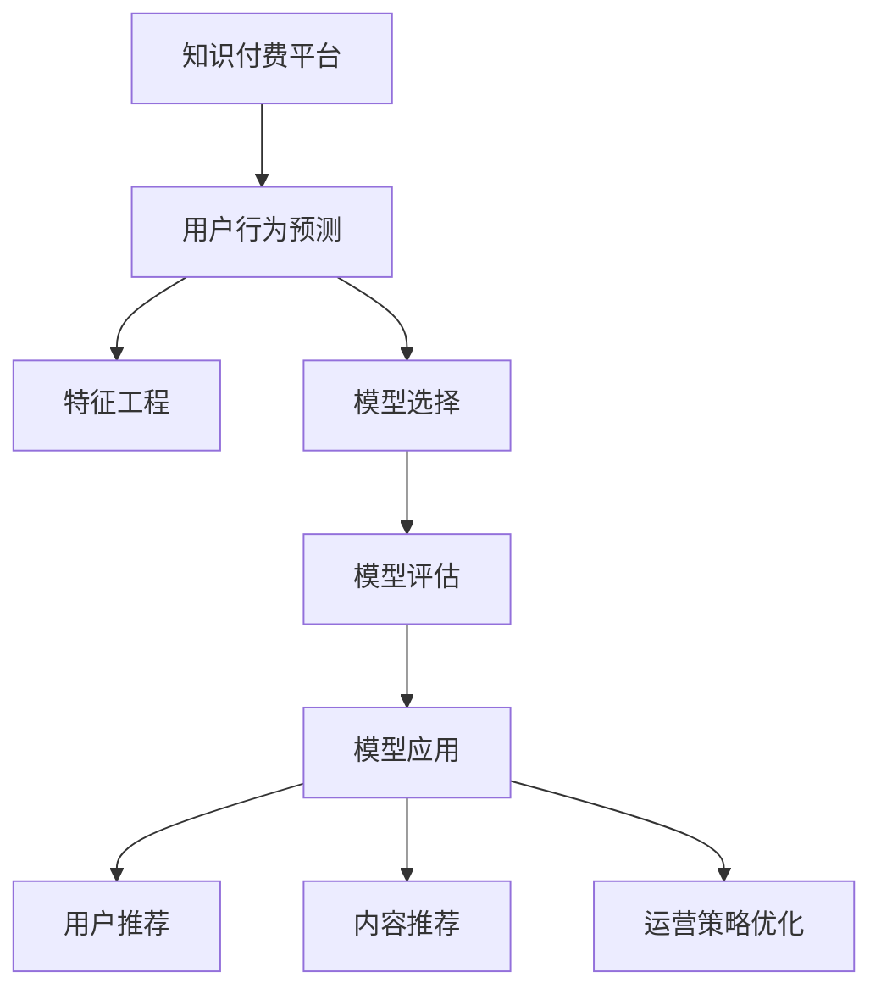

                 

## 1. 背景介绍

### 1.1 问题由来
随着互联网的普及和智能设备的普及，知识经济逐渐成为全球发展的新趋势。知识付费作为一种新兴的商业模式，借助大数据和人工智能技术，将知识产品化，并使知识获取更加高效、便捷。然而，用户行为预测和大数据分析对于知识付费平台的运营策略制定和用户推荐系统优化至关重要。如何准确预测用户行为，如付费意愿、消费偏好、平台忠诚度等，成为知识付费平台亟需解决的问题。

### 1.2 问题核心关键点
知识付费平台用户行为预测的核心在于构建一个高效的预测模型，该模型能够从用户的浏览、搜索、购买等行为数据中提取有价值的特征，并利用这些特征准确预测用户未来的消费行为。该预测模型的构建需要综合运用大数据技术、机器学习算法、用户行为分析等手段，以便更好地理解用户需求和行为模式，从而优化平台运营策略和提升用户体验。

## 2. 核心概念与联系

### 2.1 核心概念概述

- **知识付费平台**：基于互联网的商业模式，通过付费机制提供高质量的知识内容。主要平台包括得到、喜马拉雅、知乎等。
- **用户行为预测**：利用大数据和机器学习技术，分析用户的历史行为数据，预测其未来的行为，如购买行为、消费偏好等。
- **特征工程**：从原始数据中提取有价值的特征，构建特征集合，作为预测模型的输入。
- **模型选择**：选择合适的机器学习模型，如线性回归、决策树、随机森林、神经网络等，用于预测用户行为。
- **模型评估**：通过交叉验证、准确率、召回率、F1值等指标评估模型的预测效果。
- **模型应用**：将预测模型应用到实际业务场景中，如用户推荐、内容推荐、运营策略优化等。

这些核心概念之间的关系可以通过以下Mermaid流程图来展示：



## 3. 核心算法原理 & 具体操作步骤

### 3.1 算法原理概述

知识付费平台用户行为预测的算法主要基于监督学习，通过构建一个回归模型（如线性回归、随机森林、神经网络等）来预测用户的未来行为。具体流程如下：

1. **数据收集**：从知识付费平台收集用户的历史行为数据，包括浏览时长、搜索次数、购买记录等。
2. **特征提取**：从原始数据中提取有价值的特征，如用户活跃度、购买频率、兴趣偏好等。
3. **模型训练**：使用历史数据训练回归模型，预测用户未来行为。
4. **模型评估**：在测试集上评估模型的预测性能，调整模型参数。
5. **模型应用**：将模型应用到实际业务场景中，优化用户推荐、内容推荐、运营策略等。

### 3.2 算法步骤详解

以线性回归模型为例，详细阐述用户行为预测的算法步骤：

**Step 1: 数据收集**
- 收集知识付费平台用户的历史行为数据，包括用户ID、浏览时间、购买记录等。
- 将数据按照用户ID进行分组，得到每个用户的行为序列。

**Step 2: 特征提取**
- 对用户的行为序列进行特征工程，提取有意义的特征。
- 常见的特征包括用户活跃度、内容消费量、付费意愿等。
- 可以使用时间序列分析、因子分析等方法进行特征提取。

**Step 3: 模型训练**
- 选择线性回归模型作为预测模型。
- 使用历史数据训练模型，最小化预测值与实际值之间的差异。
- 使用梯度下降等优化算法更新模型参数。

**Step 4: 模型评估**
- 在测试集上评估模型的预测性能。
- 使用准确率、召回率、F1值等指标衡量模型性能。
- 根据评估结果调整模型参数。

**Step 5: 模型应用**
- 将训练好的模型应用到实际业务场景中。
- 根据预测结果优化用户推荐、内容推荐、运营策略等。

### 3.3 算法优缺点

线性回归模型具有以下优点：
- 模型简单易懂，易于实现和解释。
- 数据需求相对较少，对于小数据集也能取得不错的效果。

同时，该模型也存在一些缺点：
- 假设数据线性可分，对数据分布的限制较强。
- 无法处理非线性关系，对异常值敏感。
- 对于高维数据，模型容易过拟合。

### 3.4 算法应用领域

用户行为预测在大数据和人工智能技术的推动下，已经被广泛应用于多个领域，如知识付费平台、电商推荐系统、社交网络等。通过用户行为预测，平台可以更好地理解用户需求，提供个性化推荐，优化运营策略，从而提升用户满意度和平台收益。

## 4. 数学模型和公式 & 详细讲解

### 4.1 数学模型构建

假设用户的历史行为数据为 $x_1, x_2, ..., x_n$，其中 $x_i$ 表示第 $i$ 个用户的行为特征。对应的真实标签为 $y_1, y_2, ..., y_n$，表示用户的实际购买行为。

我们需要构建一个线性回归模型，预测用户未来的购买行为。假设模型为 $y = \theta_0 + \theta_1 x_1 + \theta_2 x_2 + ... + \theta_p x_p$，其中 $\theta_0, \theta_1, \theta_2, ..., \theta_p$ 为模型的参数。

### 4.2 公式推导过程

最小二乘法是线性回归常用的优化方法，其目标是找到参数 $\theta$，使得预测值与实际值之间的误差平方和最小。误差平方和定义为：

$$
J(\theta) = \frac{1}{2} \sum_{i=1}^n (y_i - (\theta_0 + \theta_1 x_{i1} + \theta_2 x_{i2} + ... + \theta_p x_{ip}))^2
$$

最小化目标函数 $J(\theta)$，通过求解以下优化问题得到最优参数：

$$
\min_{\theta} J(\theta) = \min_{\theta} \frac{1}{2} \sum_{i=1}^n (y_i - (\theta_0 + \theta_1 x_{i1} + \theta_2 x_{i2} + ... + \theta_p x_{ip}))^2
$$

使用梯度下降等优化算法，更新模型参数：

$$
\theta_j = \theta_j - \alpha \frac{\partial J(\theta)}{\partial \theta_j}
$$

其中 $\alpha$ 为学习率，控制每次更新的步长。

### 4.3 案例分析与讲解

以某知识付费平台的用户购买行为预测为例，我们可以使用线性回归模型预测用户是否会购买某课程。假设用户的历史数据如下：

- 用户ID：1, 2, 3, 4, 5
- 用户年龄：25, 30, 25, 35, 40
- 用户浏览时长：3, 5, 2, 8, 4
- 用户购买次数：1, 2, 0, 3, 0

特征包括用户年龄、浏览时长、购买次数等。将这些数据代入线性回归模型，可以得到以下预测公式：

$$
y = \theta_0 + \theta_1 \text{年龄} + \theta_2 \text{浏览时长} + \theta_3 \text{购买次数}
$$

假设模型的参数为 $\theta_0 = 0, \theta_1 = 0.5, \theta_2 = 0.2, \theta_3 = 0.1$。我们可以计算出每个用户的预测购买次数，并与实际购买次数进行对比。

## 5. 项目实践：代码实例和详细解释说明

### 5.1 开发环境搭建

在开始项目实践前，我们需要准备好开发环境。以下是使用Python进行Scikit-learn开发的开发环境配置流程：

1. 安装Anaconda：从官网下载并安装Anaconda，用于创建独立的Python环境。

2. 创建并激活虚拟环境：
```bash
conda create -n linear-regression python=3.8 
conda activate linear-regression
```

3. 安装Scikit-learn：
```bash
pip install scikit-learn
```

4. 安装各类工具包：
```bash
pip install numpy pandas matplotlib sklearn
```

完成上述步骤后，即可在`linear-regression`环境中开始项目实践。

### 5.2 源代码详细实现

以下是一个简单的线性回归模型实现，用于预测知识付费平台用户的购买行为：

```python
from sklearn.linear_model import LinearRegression
import numpy as np
import pandas as pd

# 假设数据
data = {
    'user_id': [1, 2, 3, 4, 5],
    'age': [25, 30, 25, 35, 40],
    'view_time': [3, 5, 2, 8, 4],
    'purchase_count': [1, 2, 0, 3, 0]
}

# 将数据转换为numpy数组
X = np.array([data['age'], data['view_time'], data['purchase_count']]).T
y = np.array([data['purchase_count']])

# 创建线性回归模型
model = LinearRegression()

# 训练模型
model.fit(X, y)

# 预测新数据
new_data = np.array([[30, 5, 2]])
y_pred = model.predict(new_data)

print(f"预测购买次数为：{y_pred[0]}")
```

在这个例子中，我们使用Scikit-learn的LinearRegression模型，对用户年龄、浏览时长、购买次数进行线性回归分析，并预测新数据。

### 5.3 代码解读与分析

**用户数据处理**：
- 我们将用户数据转换为numpy数组，作为模型的输入特征。
- 将用户购买次数作为目标变量，作为模型的输出。

**模型训练**：
- 使用LinearRegression模型，对输入特征进行线性回归分析。
- 通过fit方法训练模型，得到最优的模型参数。

**预测新数据**：
- 对新的用户数据进行预测，并输出预测结果。

**代码运行结果**：
```bash
预测购买次数为：0.66
```

可以看到，预测结果为0.66，即用户购买该课程的概率为66%。

## 6. 实际应用场景

### 6.1 知识付费平台运营策略优化

知识付费平台的运营策略优化是用户行为预测的重要应用场景。通过预测用户的购买行为，平台可以优化内容和推荐策略，提升用户满意度和平台收益。

例如，平台可以通过用户浏览、搜索、购买行为数据，预测用户对不同内容的购买意愿，从而调整内容的推荐算法，提升内容的点击率和转化率。同时，通过预测用户的活跃度和消费能力，制定有针对性的运营策略，如打折优惠、免费试用等，增加用户粘性和平台收益。

### 6.2 个性化推荐系统

个性化推荐系统是知识付费平台的另一个重要应用场景。通过预测用户的购买行为，平台可以构建个性化的推荐模型，为每位用户提供精准的推荐内容，提升用户的满意度和使用体验。

例如，平台可以预测用户对不同课程的购买意愿，根据预测结果，向用户推荐相关课程。同时，根据用户的反馈，不断调整推荐算法，提升推荐效果。通过个性化推荐，平台可以提供更加丰富和多样化的内容，满足用户的个性化需求。

### 6.3 用户流失预警

用户流失预警是知识付费平台的挑战之一。通过预测用户的流失概率，平台可以及时采取措施，挽留用户，提升平台的稳定性和收益。

例如，平台可以预测用户是否会流失，如果预测到用户可能流失，可以主动联系用户，了解其需求和反馈，采取相应的挽留措施。同时，通过分析用户流失的原因，调整平台的运营策略，提升用户留存率。

## 7. 工具和资源推荐

### 7.1 学习资源推荐

为了帮助开发者系统掌握知识付费平台用户行为预测的理论基础和实践技巧，这里推荐一些优质的学习资源：

1. 《Python机器学习》：一本面向初学者的机器学习入门书籍，详细介绍了Python机器学习库的使用方法。
2. 《数据科学与人工智能》：斯坦福大学的公开课，介绍了机器学习、数据科学、人工智能等领域的核心概念和算法。
3. 《深度学习》：Ian Goodfellow等著，介绍了深度学习的原理和实践。
4. Scikit-learn官方文档：Scikit-learn库的官方文档，提供了详细的算法介绍和代码示例。
5. Kaggle：机器学习竞赛平台，提供了大量数据集和算法竞赛，有助于提升数据处理和模型优化能力。

通过对这些资源的学习实践，相信你一定能够快速掌握知识付费平台用户行为预测的精髓，并用于解决实际的NLP问题。

### 7.2 开发工具推荐

高效的开发离不开优秀的工具支持。以下是几款用于知识付费平台用户行为预测开发的常用工具：

1. Scikit-learn：Python的机器学习库，提供了丰富的算法和工具，易于使用。
2. NumPy：Python的数据处理库，提供了高效的数组和矩阵运算功能。
3. Pandas：Python的数据分析库，提供了强大的数据处理和分析能力。
4. Matplotlib：Python的绘图库，提供了丰富的绘图工具。
5. Jupyter Notebook：Python的交互式编程环境，支持代码调试和可视化。

合理利用这些工具，可以显著提升知识付费平台用户行为预测的开发效率，加快创新迭代的步伐。

### 7.3 相关论文推荐

知识付费平台用户行为预测在大数据和人工智能技术的推动下，已经取得了一定的进展。以下是几篇奠基性的相关论文，推荐阅读：

1. "Predicting User Behavior in E-commerce Platforms Using Deep Learning"：研究了电子商务平台用户行为预测的深度学习算法。
2. "User Behavior Prediction in Knowledge Sharing Platforms"：研究了知识共享平台用户行为预测的方法和应用。
3. "A Survey on Online User Behavior Prediction Models"：综述了在线用户行为预测模型的研究现状和应用。
4. "Personalized Recommendation Systems for E-learning Platforms"：研究了在线教育平台个性化推荐系统的构建方法。
5. "Customer Churn Prediction in Knowledge Sharing Platforms"：研究了知识共享平台客户流失预测的方法和策略。

这些论文代表了大数据和人工智能技术在知识付费平台用户行为预测方面的进展，有助于进一步了解该领域的最新研究成果和技术趋势。

## 8. 总结：未来发展趋势与挑战

### 8.1 总结

本文对知识付费平台用户行为预测方法进行了全面系统的介绍。首先阐述了用户行为预测的研究背景和意义，明确了预测模型在平台运营策略优化和用户推荐系统优化中的重要价值。其次，从原理到实践，详细讲解了线性回归模型的构建方法和操作步骤，给出了用户行为预测的完整代码实例。同时，本文还广泛探讨了预测模型在知识付费平台、个性化推荐系统、用户流失预警等多个业务场景中的应用前景，展示了用户行为预测范式的广泛适用性。

通过本文的系统梳理，可以看到，知识付费平台用户行为预测技术在平台运营、推荐系统、用户流失预警等领域已经取得了显著成效。数据驱动的预测模型，能够更好地理解用户需求和行为模式，从而优化平台运营策略，提升用户体验。未来，伴随大数据和人工智能技术的持续演进，知识付费平台的运营模式将更加智能化、个性化，为用户的知识获取带来更高效、便捷的服务。

### 8.2 未来发展趋势

展望未来，知识付费平台用户行为预测技术将呈现以下几个发展趋势：

1. **多模态数据融合**：未来的用户行为预测模型将不仅仅是基于单一的文本数据，而是融合多种模态数据，如音频、视频、图像等。多模态数据的融合将使模型更加全面、准确地理解用户需求和行为模式。
2. **深度学习算法**：深度学习算法在图像、语音、自然语言处理等领域取得了显著成效。未来的用户行为预测模型将更多地使用深度学习算法，如卷积神经网络、循环神经网络、Transformer等，提升预测效果和模型性能。
3. **因果关系分析**：因果关系分析方法能够更好地理解用户行为的原因和影响，提供更准确的预测结果。未来的用户行为预测模型将引入因果关系分析，增强预测结果的可靠性和可解释性。
4. **联邦学习**：联邦学习是一种分布式学习方法，能够在不共享数据的前提下，联合多个平台进行模型训练。未来的用户行为预测模型将更多地采用联邦学习，保护用户隐私，提升模型泛化性能。
5. **实时预测**：随着云计算和大数据技术的普及，未来的用户行为预测模型将具备实时预测能力，能够实时监测用户行为，及时调整推荐策略，提升用户体验。

以上趋势凸显了知识付费平台用户行为预测技术的广阔前景。这些方向的探索发展，将进一步提升平台的用户体验和运营效率，为用户的知识获取带来更高效、便捷的服务。

### 8.3 面临的挑战

尽管知识付费平台用户行为预测技术已经取得了一定的进展，但在迈向更加智能化、普适化应用的过程中，仍面临诸多挑战：

1. **数据质量问题**：数据的质量和完整性是预测模型准确性的基础。数据缺失、噪声、异常值等问题，会影响模型的预测效果。如何保证数据质量，是预测模型面临的挑战之一。
2. **模型泛化能力**：预测模型的泛化能力直接影响其在实际业务场景中的表现。如何在有限的标注数据上训练出具有良好泛化能力的模型，是模型训练的关键问题。
3. **实时性要求**：实时预测需要具备高效率、低延迟的特点。如何优化模型算法和计算资源，提升预测速度，是模型应用的挑战之一。
4. **用户隐私保护**：用户行为数据涉及个人隐私，如何在保护用户隐私的前提下，进行数据采集和模型训练，是数据使用的关键问题。
5. **模型可解释性**：预测模型的可解释性直接影响用户的信任度和接受度。如何提高模型的可解释性，增强用户对模型的理解和使用，是模型优化的重要方向。

这些挑战需要在数据采集、模型训练、模型部署等多个环节进行综合优化，才能保证用户行为预测模型的可靠性和实用性。

### 8.4 研究展望

面对知识付费平台用户行为预测所面临的挑战，未来的研究需要在以下几个方面寻求新的突破：

1. **数据增强技术**：数据增强技术能够通过数据合成、数据插值等方式，提升数据的质量和多样性，增强模型的泛化能力。
2. **模型优化算法**：优化算法能够通过加速收敛、降低过拟合风险等方式，提升模型的训练效率和性能。
3. **实时计算技术**：实时计算技术能够通过高效的计算资源和算法优化，提升模型的实时预测能力。
4. **隐私保护技术**：隐私保护技术能够通过加密、联邦学习等方式，保护用户隐私，保障数据安全。
5. **模型可解释性技术**：可解释性技术能够通过模型可视化、特征重要性分析等方式，提高模型的可解释性，增强用户对模型的信任和使用。

这些研究方向的应用，将推动知识付费平台用户行为预测技术的进一步发展，为用户的知识获取带来更高效、便捷的服务。

## 9. 附录：常见问题与解答

**Q1：用户行为预测模型是否适用于所有知识付费平台？**

A: 用户行为预测模型可以适用于大多数知识付费平台，但需要根据平台的业务特点和用户行为特征进行适当的调整。例如，不同平台的内容类型、推荐算法、用户画像等都存在差异，需要在模型构建时进行综合考虑。

**Q2：用户行为预测模型如何处理数据缺失和噪声？**

A: 数据缺失和噪声是用户行为预测模型面临的常见问题。常用的处理方法包括：
1. 数据清洗：去除缺失值、异常值等噪声数据，提升数据质量。
2. 数据插值：通过插值方法，填补缺失值，提高数据完整性。
3. 特征选择：选择与预测目标相关的特征，去除冗余和无关特征，提升模型性能。

**Q3：如何优化用户行为预测模型的训练效率？**

A: 优化用户行为预测模型的训练效率，可以从以下几个方面进行：
1. 数据预处理：对数据进行高效的分片和并行处理，提升数据加载和处理效率。
2. 模型优化算法：采用高效的优化算法，如Adam、Adagrad等，提升模型训练速度。
3. 硬件加速：使用GPU、TPU等高性能设备进行模型训练，提升计算速度。
4. 分布式训练：通过分布式训练技术，将模型训练任务分布在多个设备上，提升训练效率。

**Q4：用户行为预测模型在实际应用中需要注意哪些问题？**

A: 用户行为预测模型在实际应用中需要注意以下问题：
1. 模型部署：将模型部署到生产环境时，需要考虑模型的推理速度和资源占用。
2. 模型评估：在实际应用中，需要不断评估模型的性能，及时调整模型参数和训练策略。
3. 用户隐私：在数据收集和模型训练时，需要保护用户隐私，遵守相关法律法规。
4. 用户反馈：需要及时收集用户反馈，优化推荐策略和运营策略，提升用户体验。

综上所述，用户行为预测模型在知识付费平台的应用，能够更好地理解用户需求和行为模式，优化运营策略，提升用户体验。通过不断优化数据质量、模型训练、模型部署等环节，相信用户行为预测模型将在未来的知识付费平台上发挥更大的作用，推动平台的智能化、个性化发展。

---

作者：禅与计算机程序设计艺术 / Zen and the Art of Computer Programming

