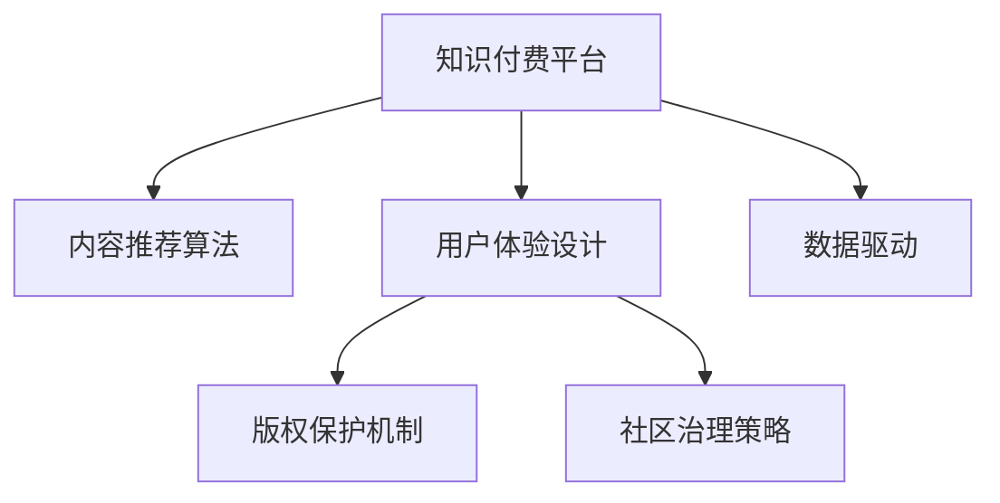

                 

# 知识经济时代下的知识付费创新商业模式运营

> 关键词：知识付费, 创新商业模式, 知识付费平台, 用户行为分析, 推荐算法, 个性化服务, 用户体验, 内容聚合, 版权保护, 社区治理

## 1. 背景介绍

### 1.1 问题由来

随着互联网技术的飞速发展，知识的获取与传播方式发生了根本性的变革。在线教育和知识付费平台的兴起，为人们提供了一个全新的知识获取途径。知识付费商业模式以知识内容为核心，通过订阅、按需购买等方式，让知识创作者能够获得应有的回报，同时为知识需求者提供个性化、高质量的学习材料。然而，这一新兴领域仍处于探索和发展的初期阶段，面临诸多挑战和问题。

### 1.2 问题核心关键点

当前知识付费平台主要面临以下问题：

- **内容质量参差不齐**：内容提供者鱼龙混杂，部分内容质量不高、水分较大，导致用户难以筛选和筛选成本较高。
- **用户体验不足**：部分平台缺乏个性化推荐，用户难以快速找到真正有价值的知识，同时互动和反馈机制不够完善。
- **商业模式单一**：现有平台大多依赖单一的订阅和付费模式，缺乏多样化的收入来源和有效的激励机制。
- **盗版和版权问题**：版权保护不足，盗版内容横行，损害了内容创作者和平台的利益，同时增加了平台维护成本。
- **社区治理难题**：用户言论自由与平台监管之间的平衡，以及虚假信息、网络欺凌等社区治理问题，亟需解决。

## 2. 核心概念与联系

### 2.1 核心概念概述

为更好地理解知识付费平台的创新商业模式运营，本节将介绍几个密切相关的核心概念：

- **知识付费平台**：提供付费内容订阅或按需购买的在线平台，支持知识内容的发布、获取、交流与传播。
- **内容推荐算法**：基于用户历史行为数据，通过机器学习模型预测用户可能感兴趣的内容，提高内容发现效率。
- **用户体验设计**：围绕用户需求和行为，设计平台功能、界面和互动流程，提升用户满意度和平台粘性。
- **版权保护机制**：确保内容创作者享有合法权益，防止盗版和侵权，建立健全的版权保护体系。
- **社区治理策略**：通过政策、机制和技术手段，确保社区环境的健康有序，维护用户之间的互动交流。

这些核心概念之间的逻辑关系可以通过以下Mermaid流程图来展示：



这个流程图展示的知识付费平台的核心概念及其之间的关系：

1. 知识付费平台通过内容推荐算法，提高内容发现效率，吸引用户付费订阅。
2. 用户体验设计通过个性化服务提升用户粘性，增加平台收益。
3. 版权保护机制保障内容创作者权益，防止盗版，增加用户信任。
4. 社区治理策略营造健康环境，吸引更多高质量内容创作者和用户加入。

这些概念共同构成了知识付费平台的运营框架，使其能够更好地服务于内容创作者和用户。

## 3. 核心算法原理 & 具体操作步骤
### 3.1 算法原理概述

知识付费平台的创新商业模式运营，本质上是一个数据驱动的优化过程。其核心思想是：通过大数据分析和机器学习算法，优化平台的内容推荐、用户体验、版权保护和社区治理策略，提升平台的服务质量和用户满意度。

形式化地，假设知识付费平台 $P$ 包含用户 $U$、内容创作者 $C$ 和平台运营商 $O$。平台的运营目标是最小化用户流失率、最大化平台收益，即：

$$
\mathop{\min}_{\theta} \mathcal{L}(P,\{U,C,O\})
$$

其中 $\mathcal{L}$ 为包含用户流失率、内容点击率、内容订阅率等指标的综合损失函数。通过梯度下降等优化算法，运营团队不断更新模型参数 $\theta$，最小化损失函数 $\mathcal{L}$，使得平台运营达到理想状态。

### 3.2 算法步骤详解

知识付费平台的创新商业模式运营，一般包括以下几个关键步骤：

**Step 1: 数据收集与处理**
- 收集用户行为数据、内容推荐记录、订阅记录等，形成平台运营数据集。
- 对数据进行清洗、归一化等预处理，去除噪音和异常值。

**Step 2: 构建推荐算法**
- 选择或设计合适的推荐算法，如协同过滤、基于内容的推荐、混合推荐等。
- 使用历史数据进行模型训练，并对推荐效果进行评估。
- 优化模型参数，提升推荐精度和覆盖率。

**Step 3: 设计用户体验**
- 根据用户反馈和行为数据，设计简洁易用的平台界面和功能。
- 引入个性化推荐、内容搜索、互动交流等用户体验设计。
- 通过A/B测试等手段，持续优化用户体验，提高用户满意度。

**Step 4: 强化版权保护**
- 建立版权管理系统，记录内容版权信息。
- 引入数字水印、版权监控、侵权举报等机制。
- 处理版权纠纷，保护内容创作者权益。

**Step 5: 社区治理**
- 制定社区规则和行为标准，建立内容审核机制。
- 引入举报、屏蔽、封禁等治理手段，管理用户行为。
- 通过数据分析，发现并处理虚假信息、网络欺凌等社区问题。

**Step 6: 迭代优化**
- 定期收集用户反馈和市场变化，持续优化平台算法和策略。
- 引入自动化测试、部署等工具，加速模型和策略迭代。
- 设置监控和预警机制，及时发现并解决潜在问题。

以上是知识付费平台创新商业模式运营的一般流程。在实际应用中，还需要针对具体平台的特点，对各个环节进行优化设计，如改进推荐算法、设计更有效的激励机制、加强版权保护等。

### 3.3 算法优缺点

知识付费平台的推荐算法具有以下优点：
1. 提高内容发现效率。通过个性化推荐，用户可以快速找到感兴趣的内容，提高内容利用率。
2. 优化用户体验。根据用户偏好，提供个性化服务，提升平台粘性。
3. 增加平台收益。提高内容订阅率和转化率，增加平台收入来源。

同时，该算法也存在一定的局限性：
1. 数据依赖性强。推荐算法的性能很大程度上依赖于数据质量和数量。
2. 模型复杂度大。高维度的数据和复杂的算法模型，需要较强的计算资源和数据处理能力。
3. 动态变化快。用户需求和内容趋势快速变化，算法需要不断调整和优化。
4. 算法公平性问题。推荐算法可能存在偏见，导致部分用户或内容被忽视。

尽管存在这些局限性，但就目前而言，推荐算法仍是知识付费平台提升服务质量和用户满意度的重要手段。未来相关研究的重点在于如何进一步降低推荐算法对数据的依赖，提高模型的公平性和普适性，同时兼顾用户隐私和数据安全等因素。

### 3.4 算法应用领域

推荐算法在知识付费平台中的应用已经得到了广泛的应用，覆盖了几乎所有常见业务场景，例如：

- 内容推荐：为用户推荐个性化的课程、文章、视频等内容。通过分析用户历史行为数据，预测其可能感兴趣的内容。
- 订阅推荐：根据用户订阅记录和行为，推荐相似的其他课程或服务。增加用户订阅率。
- 内容聚合：将不同类型的内容进行聚合，形成用户感兴趣的主题模块，提高平台内容的丰富度。
- 广告推荐：根据用户兴趣，推荐相关广告，增加平台的广告收入。

除了上述这些经典场景外，推荐算法还被创新性地应用于内容生成、版权保护、用户画像等更多环节，为知识付费平台的运营带来了新的突破。

## 4. 数学模型和公式 & 详细讲解  
### 4.1 数学模型构建

本节将使用数学语言对知识付费平台的推荐算法进行更加严格的刻画。

记知识付费平台的内容库为 $C=\{c_i\}_{i=1}^N$，其中 $c_i$ 为内容 $i$。假设平台用户为 $U=\{u_j\}_{j=1}^M$，其中 $u_j$ 为第 $j$ 位用户。设用户 $u_j$ 对内容 $c_i$ 的评分（兴趣度）为 $x_{ji}$，评分矩阵为 $X_{N \times M}$。

定义推荐模型的预测评分函数为 $f(X,\theta)$，其中 $\theta$ 为模型参数。推荐模型的目标是最小化预测评分与实际评分之间的差距，即：

$$
\mathcal{L}(\theta) = \frac{1}{2NM} \sum_{i=1}^N \sum_{j=1}^M (y_{ji} - f(X,\theta))^2
$$

其中 $y_{ji}$ 为真实评分。通过梯度下降等优化算法，最小化损失函数 $\mathcal{L}(\theta)$，即可得到最优参数 $\theta^*$。

### 4.2 公式推导过程

以下我们以协同过滤算法为例，推导推荐模型的公式。

协同过滤算法基于用户之间的相似性和内容之间的关联性，通过寻找相似用户和内容，预测用户对内容的评分。假设用户 $u_j$ 对内容 $c_i$ 的评分矩阵为 $X_{N \times M}$，其中 $x_{ji}$ 表示用户 $j$ 对内容 $i$ 的评分。用户之间的相似度矩阵为 $U_{M \times M}$，其中 $u_{ij}$ 表示用户 $i$ 和用户 $j$ 的相似度。内容之间的关联度矩阵为 $V_{N \times N}$，其中 $v_{ik}$ 表示内容 $i$ 和内容 $k$ 的关联度。协同过滤算法可以表示为：

$$
f(X,\theta) = \sum_{i=1}^N \sum_{j=1}^M \alpha_{ij} u_{ij} \beta_{ik} v_{ik} x_{ki}
$$

其中 $\alpha$ 和 $\beta$ 为可学习参数，分别表示用户和内容的特征向量。通过最小化损失函数 $\mathcal{L}(\theta)$，可以求得最优的 $\alpha$ 和 $\beta$。

### 4.3 案例分析与讲解

以Coursera平台为例，分析推荐算法的实际应用效果：

1. **用户画像**：Coursera使用用户的历史学习行为数据，如课程浏览记录、视频观看时间等，生成用户画像，用于推荐系统。

2. **内容关联**：Coursera通过分析课程间的结构关系和内容相似度，建立内容关联矩阵，用于协同过滤推荐。

3. **个性化推荐**：Coursera的推荐系统基于协同过滤算法，为用户推荐个性化的课程和学习路径，提高用户满意度和平台粘性。

4. **推荐效果**：Coursera通过A/B测试和用户反馈，不断优化推荐算法，提升推荐效果。

## 5. 项目实践：代码实例和详细解释说明
### 5.1 开发环境搭建

在进行推荐算法实践前，我们需要准备好开发环境。以下是使用Python进行Scikit-learn和TensorFlow开发的推荐系统环境配置流程：

1. 安装Anaconda：从官网下载并安装Anaconda，用于创建独立的Python环境。

2. 创建并激活虚拟环境：
```bash
conda create -n recommendation-env python=3.8 
conda activate recommendation-env
```

3. 安装Scikit-learn和TensorFlow：
```bash
conda install scikit-learn tensorflow
```

4. 安装各类工具包：
```bash
pip install numpy pandas matplotlib tqdm
```

完成上述步骤后，即可在`recommendation-env`环境中开始推荐系统实践。

### 5.2 源代码详细实现

下面我们以协同过滤算法为例，给出使用Scikit-learn库构建推荐系统的PyTorch代码实现。

首先，定义协同过滤算法的核心函数：

```python
import numpy as np
from sklearn.metrics.pairwise import cosine_similarity
from sklearn.feature_extraction.text import CountVectorizer

def collaborative_filtering(X_train, X_test, N, M):
    U = np.zeros((M, M))
    V = np.zeros((N, N))

    # 计算用户相似度和内容关联度
    for i in range(N):
        for j in range(M):
            if X_train[i,j] != 0:
                U[X_train[i,:].nonzero()[1], j] += 1
                V[i, X_train[i,:].nonzero()[1]] += 1
    
    U = U / np.linalg.norm(U, axis=1)[:, np.newaxis]
    V = V / np.linalg.norm(V, axis=0)

    # 计算预测评分
    pred = np.zeros((N, M))
    for i in range(N):
        for j in range(M):
            if X_train[i,j] != 0:
                pred[i,j] = np.dot(U[:,j], V[:,i].T) * X_train[i,j]

    return pred
```

然后，定义推荐系统的评估函数：

```python
from sklearn.metrics import mean_squared_error, mean_absolute_error

def evaluate(pred, X_test, N, M):
    RMSE = np.sqrt(mean_squared_error(X_test, pred))
    MAE = mean_absolute_error(X_test, pred)
    print(f'RMSE: {RMSE:.4f}, MAE: {MAE:.4f}')
```

最后，启动推荐系统流程：

```python
from sklearn.datasets import make_biclusters

# 生成随机评分矩阵
X_train, X_test = make_biclusters(n_samples=100, n_features=10, n_clusters=10, shuffle=False, random_state=0)
N, M = X_train.shape

# 执行协同过滤算法
pred = collaborative_filtering(X_train, X_test, N, M)

# 评估推荐效果
evaluate(pred, X_test, N, M)
```

以上就是使用Scikit-learn和TensorFlow构建推荐系统的完整代码实现。可以看到，利用Scikit-learn和TensorFlow，可以方便快捷地搭建推荐系统，并通过评估函数进行效果评估。

### 5.3 代码解读与分析

让我们再详细解读一下关键代码的实现细节：

**协同过滤算法函数**：
- `collaborative_filtering`函数：计算用户和内容之间的相似度和关联度，通过矩阵乘法计算预测评分。
- 首先，构建用户相似度矩阵 $U$ 和内容关联度矩阵 $V$，通过统计评分矩阵中的非零元素数量。
- 对 $U$ 和 $V$ 进行归一化处理，使其符合协变量范数。
- 通过矩阵乘法计算预测评分，其中 $\dot$ 表示矩阵乘法。

**评估函数**：
- `evaluate`函数：计算推荐算法的RMSE和MAE，评估推荐效果。
- 使用Scikit-learn的`mean_squared_error`和`mean_absolute_error`函数计算评分矩阵与预测矩阵之间的均方误差和绝对误差。
- 输出评估结果。

**推荐系统流程**：
- 使用Scikit-learn的`make_biclusters`函数生成随机评分矩阵。
- 调用`collaborative_filtering`函数执行协同过滤算法，得到预测评分矩阵。
- 调用`evaluate`函数评估推荐效果。

可以看出，Scikit-learn和TensorFlow为构建推荐系统提供了便利的接口和工具，使得推荐算法的实现和评估变得简单易懂。

当然，工业级的系统实现还需考虑更多因素，如推荐模型的在线优化、用户行为数据的实时更新、推荐策略的多样化等。但核心的协同过滤算法基本与此类似。

## 6. 实际应用场景
### 6.1 在线教育平台

在线教育平台如Coursera、Udacity等，利用推荐算法为用户推荐个性化课程和学习路径，极大地提升了用户的学习体验和平台粘性。推荐算法可以根据用户的学习行为数据，如课程观看时长、作业完成情况等，预测用户可能感兴趣的课程和专题，提供个性化的学习推荐。

此外，推荐算法还能够在课程上线初期，通过预测模型的评分和反馈，评估课程质量，优化课程发布策略。通过优化推荐算法，平台可以显著提高课程推荐效果，增加课程订阅率。

### 6.2 电商网站

电商网站如Amazon、淘宝等，利用推荐算法为用户推荐商品和促销活动，提升用户的购物体验和销售额。推荐算法可以根据用户的历史购买记录、浏览行为等，预测用户可能感兴趣的商品和促销信息，提供个性化的购物推荐。

此外，推荐算法还能够根据季节变化、热门商品等实时数据，动态调整推荐策略，增加商品曝光度和销售额。通过优化推荐算法，电商网站可以显著提高用户转化率，增加平台收益。

### 6.3 社交媒体平台

社交媒体平台如Facebook、微博等，利用推荐算法为用户推荐内容和朋友，提升用户活跃度和平台粘性。推荐算法可以根据用户的浏览记录、点赞行为等，预测用户可能感兴趣的内容和朋友动态，提供个性化的内容推荐。

此外，推荐算法还能够根据用户的行为反馈，优化推荐策略，避免过度曝光和信息泛滥，提升用户体验。通过优化推荐算法，社交媒体平台可以显著提高用户留存率和平台互动率。

## 7. 工具和资源推荐
### 7.1 学习资源推荐

为了帮助开发者系统掌握知识付费平台的推荐算法，这里推荐一些优质的学习资源：

1. 《推荐系统实践》书籍：介绍推荐系统的一般原理和实际应用，涵盖协同过滤、内容推荐、广告推荐等诸多算法。

2. Coursera《推荐系统》课程：由斯坦福大学开设的推荐系统入门课程，涵盖协同过滤、矩阵分解等基本算法，适合初学者学习。

3. 《机器学习实战》书籍：介绍机器学习的基本原理和实践技巧，涵盖回归、分类、聚类等算法，适合深入学习推荐系统算法。

4. Kaggle推荐系统竞赛：通过参与Kaggle的推荐系统竞赛，实战演练推荐算法的应用和优化。

5. GitHub推荐系统开源项目：收藏和浏览GitHub上的推荐系统开源项目，学习他人的经验和代码实现。

通过对这些资源的学习实践，相信你一定能够快速掌握推荐算法的精髓，并用于解决实际的推荐问题。

### 7.2 开发工具推荐

高效的开发离不开优秀的工具支持。以下是几款用于知识付费平台推荐系统开发的常用工具：

1. Python：作为数据科学和机器学习的主流语言，Python拥有丰富的数据处理和算法库，如NumPy、Pandas、Scikit-learn、TensorFlow等。

2. Jupyter Notebook：支持交互式编程和代码可视化，方便开发者调试和展示推荐算法的实验结果。

3. Kibana：基于ELK栈的数据可视化工具，支持实时数据展示和探索分析，适合监控推荐系统的运营数据。

4. Apache Spark：基于分布式计算的框架，支持大规模数据处理和推荐系统的高效部署。

5. AWS、Google Cloud等云服务平台：提供推荐系统的云服务和计算资源，支持高可用性和弹性扩展。

合理利用这些工具，可以显著提升知识付费平台推荐系统的开发效率，加快创新迭代的步伐。

### 7.3 相关论文推荐

推荐系统的发展源于学界的持续研究。以下是几篇奠基性的相关论文，推荐阅读：

1. CF: Comprehensive Review on Collaborative Filtering（协同过滤综述）：全面总结了协同过滤算法的原理和实现方法，适合入门学习。

2. Recommender Systems Handbook：推荐系统原理和实践的全面介绍，涵盖协同过滤、内容推荐、混合推荐等多种算法。

3. ALS: Singular Value Decomposition for Matrix Completion：介绍矩阵分解算法，特别适用于高维稀疏数据的推荐系统。

4. NMF: Non-negative Matrix Factorization for Recommender Systems：介绍非负矩阵分解算法，适用于文本推荐和隐式反馈数据的推荐系统。

5. Attention-based Recommender Systems：介绍注意力机制在推荐系统中的应用，提升了推荐模型的精度和效果。

这些论文代表了的推荐系统的发展脉络。通过学习这些前沿成果，可以帮助研究者把握学科前进方向，激发更多的创新灵感。

## 8. 总结：未来发展趋势与挑战

### 8.1 总结

本文对知识付费平台的推荐算法进行了全面系统的介绍。首先阐述了知识付费平台的背景和推荐算法的重要性，明确了推荐算法在提升用户体验和平台收益方面的独特价值。其次，从原理到实践，详细讲解了协同过滤等推荐算法的数学原理和关键步骤，给出了推荐系统开发的完整代码实例。同时，本文还广泛探讨了推荐算法在在线教育、电商、社交媒体等众多行业领域的应用前景，展示了推荐算法的巨大潜力。此外，本文精选了推荐算法的各类学习资源，力求为开发者提供全方位的技术指引。

通过本文的系统梳理，可以看到，推荐算法在知识付费平台的创新商业模式运营中发挥了关键作用。这些算法的优化和创新，使得平台能够更好地服务内容创作者和用户，提升平台收益和用户满意度。未来，伴随推荐算法的持续演进，知识付费平台必将在内容推荐、个性化服务、社区治理等方面不断突破，为NLP技术的发展带来新的驱动力。

### 8.2 未来发展趋势

展望未来，知识付费平台的推荐算法将呈现以下几个发展趋势：

1. 推荐算法多样化。推荐算法将不再局限于协同过滤，融合更多领域知识，如知识图谱、因果推断等，提升推荐效果。

2. 推荐模型透明化。推荐模型将逐渐透明化，引入可解释性技术，帮助用户理解推荐依据，增强信任度。

3. 推荐系统自动化。推荐系统将向自动化和自适应方向发展，通过自动调参和自学习，优化模型参数和推荐策略。

4. 推荐策略个性化。推荐策略将更加个性化，根据用户行为和偏好，实时调整推荐算法和内容。

5. 推荐服务泛化化。推荐服务将泛化到更多应用场景，如智能客服、广告投放等，提升平台服务能力和收益。

以上趋势凸显了推荐算法的广阔前景。这些方向的探索发展，将使得推荐系统更加智能、普适、可靠，为知识付费平台带来更大的价值。

### 8.3 面临的挑战

尽管推荐算法已经取得了瞩目成就，但在迈向更加智能化、普适化应用的过程中，它仍面临着诸多挑战：

1. 数据隐私问题。推荐算法需要处理大量用户数据，涉及用户隐私和数据安全问题。如何在保护用户隐私的同时，优化推荐效果，是一个重要的研究课题。

2. 推荐公平性。推荐算法可能存在偏见，导致部分用户或内容被忽视。如何保证推荐系统的公平性和多样性，减少偏见和歧视，是一个亟需解决的问题。

3. 推荐效率。推荐算法需要高效处理大规模数据，计算资源和存储资源压力较大。如何提高推荐算法的计算效率和存储效率，是一个重要的研究方向。

4. 推荐模型复杂度。推荐模型的复杂度较大，模型训练和推理耗时较长。如何降低推荐模型的复杂度，提高模型的训练和推理速度，是一个重要的优化方向。

5. 推荐系统鲁棒性。推荐系统在面对恶意攻击和异常数据时，可能产生不稳定甚至有害的推荐结果。如何增强推荐系统的鲁棒性，抵御恶意攻击，是一个重要的研究方向。

6. 推荐算法迭代。推荐算法需要不断更新和迭代，以适应数据分布和用户需求的变化。如何实现推荐算法的快速迭代和部署，是一个重要的优化方向。

这些挑战凸显了推荐算法的复杂性和复杂性。解决这些挑战，将使得推荐系统更加智能、公平、可靠，为知识付费平台的运营带来更大的价值。

### 8.4 研究展望

面对推荐算法所面临的种种挑战，未来的研究需要在以下几个方面寻求新的突破：

1. 探索基于深度学习的推荐算法。利用深度神经网络，提升推荐算法的精度和泛化能力。

2. 研究分布式推荐系统。通过分布式计算，提高推荐系统的计算效率和处理能力。

3. 引入知识图谱和领域知识。通过知识图谱和领域知识，增强推荐算法的多样性和可靠性。

4. 引入用户反馈和自学习。通过用户反馈和自学习机制，优化推荐策略，提升推荐效果。

5. 引入自适应推荐算法。通过自适应算法，动态调整推荐策略，适应不同的用户和场景。

6. 引入推荐系统的伦理道德。通过引入伦理道德约束，确保推荐系统的公平性、透明度和安全性。

这些研究方向的探索，将使得推荐系统更加智能、公平、可靠，为知识付费平台的运营带来更大的价值。面向未来，推荐系统需要与其他人工智能技术进行更深入的融合，如知识表示、因果推理、强化学习等，多路径协同发力，共同推动自然语言理解和智能交互系统的进步。

## 9. 附录：常见问题与解答

**Q1：推荐算法是否适用于所有NLP任务？**

A: 推荐算法主要适用于具有明确输入输出关系的数据类型，如文本数据、图像数据等。对于纯文本数据，可以通过自然语言处理技术（如文本向量化、实体识别等）将其转换为推荐算法可处理的形式。因此，推荐算法可以在NLP任务中应用，如文档推荐、内容推荐、个性化摘要等。

**Q2：推荐算法如何处理冷启动问题？**

A: 冷启动问题是推荐系统面临的常见问题，即新用户或新商品没有足够的历史数据，难以进行个性化推荐。常见的处理方式包括：
1. 使用相似用户或商品进行推荐。通过相似性分析，为新用户推荐相似用户的偏好内容。
2. 使用基于内容的推荐。根据商品属性和特征，为缺乏历史数据的新商品推荐相关内容。
3. 引入用户反馈机制。通过让用户对新商品进行评分或评价，积累数据进行推荐。
4. 引入随机推荐或展示。通过随机推荐部分商品，增加用户曝光机会，积累数据进行后续推荐。

这些方法可以有效地解决冷启动问题，使得推荐系统能够快速适应新用户和新商品。

**Q3：推荐算法如何提升用户满意度和平台收益？**

A: 推荐算法通过个性化推荐，帮助用户发现感兴趣的内容，提升用户体验和平台粘性。具体来说：
1. 用户画像：通过用户的历史行为数据，生成用户画像，用于个性化推荐。
2. 内容关联：通过分析内容之间的关联度，推荐相关内容。
3. 推荐效果：通过评估推荐模型的效果，不断优化推荐算法，提升推荐精度。

此外，推荐算法还可以通过广告推荐、内容付费等手段，增加平台的收益来源。通过优化推荐算法，平台可以显著提高用户满意度和平台收益。

**Q4：推荐算法如何确保推荐内容的真实性？**

A: 推荐算法本身并不负责内容的真实性，需要结合其他手段进行综合治理。具体来说：
1. 内容审核：对推荐内容进行审核，过滤和屏蔽有害内容。
2. 用户反馈：引入用户反馈机制，及时发现和处理虚假信息。
3. 社区治理：通过社区规则和治理机制，确保社区环境的健康有序。

这些手段可以有效地保障推荐内容的真实性和可信度，避免推荐系统被恶意内容所误导。

**Q5：推荐算法如何平衡个性化和多样性？**

A: 推荐算法在个性化推荐和多样性推荐之间存在一定的权衡。具体来说：
1. 个性化推荐：通过用户历史行为数据，预测用户可能感兴趣的内容。
2. 多样性推荐：引入多样性因素，防止过度个性化导致的推荐内容单一。

可以通过多种方式实现个性化和多样性之间的平衡，如：
1. 引入随机推荐。通过随机推荐部分多样性内容，增加推荐多样性。
2. 引入多样性惩罚机制。对过度相似的内容进行惩罚，增加推荐多样性。
3. 引入多级推荐策略。通过多级推荐策略，兼顾个性化和多样性。

这些方法可以有效地平衡个性化和多样性，使得推荐系统既能满足用户的个性化需求，又能提供多样化的推荐内容。

---

作者：禅与计算机程序设计艺术 / Zen and the Art of Computer Programming

