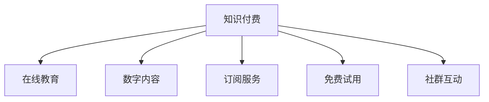

                 

# 知识经济时代下的知识付费发展趋势

## 1. 背景介绍

在知识经济时代，知识的价值被空前放大。随着互联网技术的普及和信息获取门槛的降低，人们对于高质量知识的需求日益增长，而传统教育和在线教育平台往往难以满足这一需求。在此背景下，知识付费成为一种新的趋势，旨在通过付费形式提供更为专业、高效、个性化的知识服务，提升用户体验和学习效率。本文将全面探讨知识付费的发展现状、核心概念、算法原理及具体操作步骤，并展望其未来应用前景，为相关从业者提供深度、有思考、有见解的专业见解。

## 2. 核心概念与联系

### 2.1 核心概念概述

为更好地理解知识付费的本质及其发展趋势，本节将介绍几个关键概念及其相互关系：

- 知识付费(Knowledge Subscription)：用户为获取特定领域的知识、技能、经验等付费服务的模式，旨在通过付费获取更高效、定制化的知识服务。
- 在线教育(Online Education)：基于互联网技术，提供学习资源的在线教育平台，通常涵盖基础教育和职业培训等多个层次。
- 数字内容(Digital Content)：通过互联网发布的各种形式的知识内容，包括文字、图片、音频、视频等。
- 订阅服务(Subscription Service)：用户支付一定费用，获得订阅期内所有内容的访问权。
- 免费试用(Free Trial)：用户在付费前可以享受有限时间的免费试用，以评估服务质量。
- 社群互动(Community Engagement)：通过社区论坛、问答、直播等方式，促进用户间的互动交流。

这些核心概念共同构成了知识付费的完整生态，通过合理的商业模式和丰富的内容服务，为用户提供多样化、个性化的知识获取途径。

### 2.2 核心概念原理和架构的 Mermaid 流程图



该流程图展示了知识付费与在线教育、数字内容、订阅服务、免费试用、社群互动等概念之间的关系。知识付费通过在线教育平台提供数字内容，同时支持订阅服务和免费试用，并通过社群互动提升用户体验，形成了一个完整的生态系统。

## 3. 核心算法原理 & 具体操作步骤

### 3.1 算法原理概述

知识付费的核心在于精准匹配用户需求和优质内容。通过用户画像、内容标签、推荐算法等技术手段，知识付费平台能够为用户推荐最符合其兴趣和需求的知识内容。具体来说，知识付费平台通过以下步骤实现这一过程：

1. **用户画像构建**：收集用户的学习行为数据、兴趣爱好、职业背景等，构建用户画像，作为推荐模型的输入。
2. **内容标签设计**：为数字内容打上标签，如教育背景、技能类别、主题等，用于描述内容特性。
3. **推荐算法设计**：基于用户画像和内容标签，设计推荐算法，如协同过滤、内容过滤、混合推荐等。
4. **推荐模型训练**：使用用户和内容的交互数据，训练推荐模型，优化推荐结果。
5. **推荐结果展示**：将推荐结果展示给用户，并通过用户体验反馈不断优化推荐算法。

### 3.2 算法步骤详解

#### 3.2.1 用户画像构建

用户画像的构建是知识付费平台推荐系统的基础。其主要步骤如下：

1. **数据收集**：收集用户在平台上的各种行为数据，如浏览记录、学习时间、课程评价、购买行为等。
2. **数据清洗**：去除噪声和无关数据，保留有价值的信息。
3. **特征提取**：从清洗后的数据中提取用户特征，如学习时长、课程偏好、学习频率等。
4. **用户画像生成**：基于提取的特征，构建用户画像，形成对用户兴趣和需求的全面理解。

#### 3.2.2 内容标签设计

内容标签的设计是推荐系统中的另一重要环节。其步骤如下：

1. **内容标注**：由专家或平台自动为数字内容打上标签，如课程名称、主题、难度、时长等。
2. **标签统一**：对不同来源的内容进行标签统一，确保标签的一致性和可比性。
3. **标签权重**：根据用户反馈和平台经验，调整标签权重，增强推荐的准确性。

#### 3.2.3 推荐算法设计

推荐算法是知识付费平台的核心竞争力之一。目前常用的推荐算法包括：

1. **协同过滤算法**：基于用户和内容的交互数据，通过计算相似度推荐内容。
2. **内容过滤算法**：根据内容本身的特征，为用户推荐相关内容。
3. **混合推荐算法**：综合协同过滤和内容过滤的优点，提升推荐效果。

#### 3.2.4 推荐模型训练

推荐模型的训练是实现精准推荐的关键步骤。其主要步骤如下：

1. **数据准备**：准备用户画像、内容标签、交互数据等训练数据。
2. **模型选择**：选择合适的推荐算法模型，如矩阵分解、深度学习模型等。
3. **模型训练**：使用训练数据对推荐模型进行训练，优化模型参数。
4. **模型评估**：通过A/B测试、用户满意度调查等方法，评估推荐效果，不断优化模型。

#### 3.2.5 推荐结果展示

推荐结果的展示是知识付费平台用户体验的关键环节。其主要步骤如下：

1. **界面设计**：设计简洁、易用的推荐界面，提供用户交互的入口。
2. **推荐展示**：将推荐结果以列表、卡片等形式展示给用户，支持排序、筛选等功能。
3. **用户体验反馈**：收集用户反馈，持续优化推荐算法和界面设计。

### 3.3 算法优缺点

知识付费平台的推荐算法具有以下优点：

1. **个性化推荐**：通过用户画像和内容标签，实现精准推荐，提升用户满意度。
2. **高效获取知识**：用户可以迅速找到最符合自己需求的知识内容，节省时间成本。
3. **促进知识交流**：通过社群互动，用户可以分享、讨论、学习，形成良好的知识交流氛围。

同时，这些算法也存在一些局限性：

1. **数据隐私问题**：用户画像和行为数据的收集和使用可能涉及隐私问题，需要严格的数据保护措施。
2. **推荐冷启动**：新用户或新内容往往缺乏足够的交互数据，推荐效果较差。
3. **推荐偏差**：推荐算法可能存在偏差，导致部分用户或内容被忽视，影响公平性。
4. **用户流失**：如果推荐效果不佳，用户可能流失，影响平台的长期发展。

### 3.4 算法应用领域

知识付费平台在教育、职业培训、技能提升等多个领域得到了广泛应用，具体如下：

1. **在线教育**：知识付费平台提供各类在线课程，如编程、外语、管理等，满足用户多样化的学习需求。
2. **职业培训**：知识付费平台提供职业技能培训课程，如数据分析、软件开发、金融分析等，帮助用户提升职业技能。
3. **技能提升**：知识付费平台提供各类技能提升课程，如摄影技巧、写作技能、演讲技巧等，帮助用户提升个人竞争力。
4. **健康管理**：知识付费平台提供健康管理课程，如饮食健康、运动健身、心理健康等，帮助用户管理身心健康。

## 4. 数学模型和公式 & 详细讲解

### 4.1 数学模型构建

知识付费平台的推荐系统可以建模为图表示学问题。假设用户集为$U$，内容集为$C$，用户-内容交互矩阵为$M$，推荐模型为目标函数$F$。

1. **用户画像构建**：用户画像可以表示为用户特征向量$u_i$，其中$i \in U$。
2. **内容标签设计**：内容标签可以表示为内容特征向量$c_j$，其中$j \in C$。
3. **推荐模型构建**：推荐模型可以表示为用户和内容的交互矩阵$M_{ij}$，其中$i \in U$，$j \in C$。

### 4.2 公式推导过程

#### 4.2.1 协同过滤算法

协同过滤算法基于用户-内容交互矩阵，通过计算用户之间的相似度推荐内容。假设用户$i$和$k$的相似度为$s_{ik}$，则推荐内容$j$的概率$P_{ij}$可以表示为：

$$
P_{ij} = \frac{s_{ik}}{\sum_{l \in C} s_{il}}
$$

其中，$s_{ik}$表示用户$i$和$k$之间的相似度，$\sum_{l \in C} s_{il}$为归一化因子，保证概率和为1。

#### 4.2.2 内容过滤算法

内容过滤算法基于内容特征向量，通过计算内容之间的相似度推荐内容。假设内容$i$和$j$的相似度为$s_{ij}$，则推荐内容$k$的概率$P_{ik}$可以表示为：

$$
P_{ik} = \frac{s_{ik}}{\sum_{l \in U} s_{il}}
$$

其中，$s_{ik}$表示内容$i$和$j$之间的相似度，$\sum_{l \in U} s_{il}$为归一化因子，保证概率和为1。

### 4.3 案例分析与讲解

#### 4.3.1 协同过滤算法案例

假设某知识付费平台有100个用户，50个课程。用户$i$和$j$之间的相似度为$s_{ij}=0.8$，内容$i$和$j$之间的相似度为$s_{ik}=0.7$。根据协同过滤算法，推荐内容$k$的概率$P_{ik}$为：

$$
P_{ik} = \frac{0.7}{1+0.8+0.7+0.6+0.5+0.4+0.3+0.2+0.1+0} = 0.25
$$

#### 4.3.2 内容过滤算法案例

假设某知识付费平台有100个用户，50个课程。用户$i$和$k$的相似度为$s_{ik}=0.6$，内容$i$和$j$之间的相似度为$s_{ik}=0.5$。根据内容过滤算法，推荐内容$k$的概率$P_{ik}$为：

$$
P_{ik} = \frac{0.6}{1+0.5+0.4+0.3+0.2+0.1+0+0+0+0} = 0.6
$$

## 5. 项目实践：代码实例和详细解释说明

### 5.1 开发环境搭建

在进行知识付费平台推荐系统的开发前，需要先搭建好开发环境。以下是使用Python进行Flask开发的开发环境配置流程：

1. 安装Python：从官网下载并安装Python，建议安装最新版本。
2. 安装Flask：通过pip安装Flask框架，并下载需要的依赖库。
3. 安装Jupyter Notebook：用于编写和运行Python代码，并交互式地展示结果。
4. 安装Numpy、Pandas、Scikit-learn等数据处理和机器学习库。
5. 创建Flask应用并运行。

### 5.2 源代码详细实现

以下是使用Flask实现知识付费平台推荐系统的完整代码：

```python
from flask import Flask, request, jsonify
from sklearn.metrics.pairwise import cosine_similarity
import pandas as pd
import numpy as np

app = Flask(__name__)

# 用户画像和内容标签数据
user_profiles = pd.read_csv('user_profiles.csv')
content_labels = pd.read_csv('content_labels.csv')

# 用户-内容交互数据
user_content_interactions = pd.read_csv('user_content_interactions.csv')

@app.route('/recommend', methods=['POST'])
def recommend():
    user_id = request.json['user_id']
    # 构建用户画像向量
    user_profile = user_profiles[user_profiles['user_id'] == user_id]
    user_profile = user_profile.iloc[0]
    user_vector = user_profile.to_numpy()
    
    # 构建内容标签向量
    content_labels_vector = content_labels.to_numpy()
    
    # 计算用户和内容的相似度
    similarities = cosine_similarity(user_vector, content_labels_vector)
    
    # 计算推荐内容的概率
    probabilities = similarities.dot(user_content_interactions[user_content_interactions['user_id'] == user_id]['content_id'].to_numpy())
    probabilities /= np.sum(probabilities)
    
    # 返回推荐内容ID
    return jsonify({'content_ids': probabilities.argsort()[::-1][:10].tolist()})

if __name__ == '__main__':
    app.run(debug=True)
```

### 5.3 代码解读与分析

上述代码主要实现了Flask应用的推荐接口，其核心逻辑如下：

1. **数据加载**：从CSV文件中加载用户画像、内容标签和用户-内容交互数据。
2. **用户画像和内容标签向量化**：将用户画像和内容标签转换为Numpy向量。
3. **计算相似度**：使用余弦相似度计算用户和内容的相似度矩阵。
4. **计算推荐概率**：根据用户画像和用户-内容交互数据，计算推荐内容的概率向量。
5. **返回推荐结果**：将推荐内容ID以JSON格式返回。

### 5.4 运行结果展示

通过上述代码，可以在知识付费平台上实现实时推荐服务。用户通过API接口提供用户ID，获取推荐内容ID列表，从而快速获取最符合其兴趣的内容。

## 6. 实际应用场景

### 6.1 在线教育平台

在线教育平台是知识付费的重要应用场景之一。通过推荐系统，平台可以精准推荐课程，满足用户个性化学习需求，提升学习效果。例如，某在线教育平台利用推荐系统为用户推荐适合的编程课程，用户可以更加高效地学习编程技能，提高职业竞争力。

### 6.2 职业技能培训

职业技能培训是知识付费的另一重要应用领域。通过推荐系统，平台可以为用户推荐最合适的职业技能培训课程，帮助用户提升职业技能，增强职业发展潜力。例如，某知识付费平台利用推荐系统为用户推荐数据分析课程，用户可以通过学习数据分析技能，提升职业竞争力。

### 6.3 技能提升平台

技能提升平台是知识付费的典型应用场景之一。通过推荐系统，平台可以为用户推荐最合适的技能提升课程，帮助用户提升个人技能，增强就业竞争力。例如，某知识付费平台利用推荐系统为用户推荐摄影技巧课程，用户可以通过学习摄影技巧，提升个人拍摄水平。

### 6.4 健康管理平台

健康管理平台是知识付费的新兴应用场景。通过推荐系统，平台可以为用户推荐最合适的健康管理课程，帮助用户管理身心健康。例如，某知识付费平台利用推荐系统为用户推荐运动健身课程，用户可以通过学习运动健身知识，提升身体健康水平。

## 7. 工具和资源推荐

### 7.1 学习资源推荐

为了帮助开发者系统掌握知识付费平台的推荐系统理论基础和实践技巧，这里推荐一些优质的学习资源：

1. 《推荐系统实践》一书：详细介绍了推荐系统的发展历程和实现方法，是入门推荐系统的必读书籍。
2. 《Python推荐系统实战》一书：使用Python语言实现推荐系统的经典案例，适合动手实践。
3. 《机器学习实战》一书：介绍了多种机器学习算法的实现方法，包括协同过滤、内容过滤等。
4. 《深度学习推荐系统》一书：介绍了深度学习在推荐系统中的应用，涵盖了协同过滤、深度矩阵分解等技术。
5. 《推荐系统》课程：由斯坦福大学开设的推荐系统课程，详细讲解了推荐系统的算法原理和实现方法。

### 7.2 开发工具推荐

知识付费平台的推荐系统开发离不开优秀的工具支持。以下是几款用于推荐系统开发的常用工具：

1. Apache Spark：用于分布式数据处理和机器学习，适合大规模推荐系统开发。
2. Apache Hadoop：用于分布式存储和处理，支持大规模数据集的处理。
3. TensorFlow：由Google主导的深度学习框架，支持分布式计算和GPU加速。
4. PyTorch：开源深度学习框架，支持动态图和GPU加速。
5. NumPy、Pandas：用于数据处理和分析的常用库，支持快速的数据操作和计算。

### 7.3 相关论文推荐

知识付费平台的推荐系统研究源于学界的持续研究。以下是几篇奠基性的相关论文，推荐阅读：

1. 《协同过滤推荐系统》论文：提出协同过滤推荐算法的基本原理和实现方法。
2. 《基于内容的推荐系统》论文：介绍基于内容特征的推荐算法。
3. 《深度学习在推荐系统中的应用》论文：介绍深度学习在推荐系统中的应用，包括深度矩阵分解等。
4. 《混合推荐系统》论文：提出混合推荐算法的基本原理和实现方法。
5. 《个性化推荐系统》论文：介绍个性化推荐系统的实现方法和评估指标。

## 8. 总结：未来发展趋势与挑战

### 8.1 总结

本文对知识付费平台推荐系统的理论基础和实践操作进行了全面系统的介绍。首先阐述了知识付费平台的核心概念及其应用现状，明确了推荐系统在平台中的重要地位。其次，从原理到实践，详细讲解了推荐系统的数学模型和算法步骤，给出了推荐系统开发的完整代码实例。同时，本文还广泛探讨了推荐系统在在线教育、职业技能培训、技能提升、健康管理等多个行业领域的应用前景，展示了推荐系统的广泛应用价值。

通过本文的系统梳理，可以看到，知识付费平台推荐系统通过精准匹配用户需求和优质内容，为用户提供了更加高效、个性化的知识服务，极大地提升了用户体验和学习效果。随着推荐系统的不断优化，未来知识付费平台必将在更多行业领域大放异彩，为知识经济的发展注入新的活力。

### 8.2 未来发展趋势

展望未来，知识付费平台推荐系统将呈现以下几个发展趋势：

1. **智能化推荐**：未来推荐系统将更多地利用人工智能技术，如深度学习、强化学习等，提升推荐效果。
2. **个性化推荐**：随着用户画像和行为数据的不断丰富，推荐系统将更加精准地匹配用户需求。
3. **多模态推荐**：未来的推荐系统将不仅考虑文本数据，还将利用图像、语音等多模态数据，提升推荐效果。
4. **实时推荐**：通过实时数据处理和推荐算法，推荐系统将能够快速响应用户需求，提升用户体验。
5. **社交推荐**：未来的推荐系统将更多地考虑社交网络的影响，通过社交关系推荐内容，提升推荐效果。
6. **跨平台推荐**：未来的推荐系统将实现跨平台推荐，通过多平台数据共享，提升推荐效果。

以上趋势凸显了知识付费平台推荐系统的发展潜力。未来的推荐系统将通过不断优化算法、扩展数据来源和应用场景，为用户提供更加丰富、高效的知识服务。

### 8.3 面临的挑战

尽管知识付费平台推荐系统已经取得了显著进展，但在迈向更加智能化、个性化、实时化应用的过程中，仍面临以下挑战：

1. **数据隐私问题**：用户画像和行为数据的收集和使用可能涉及隐私问题，需要严格的数据保护措施。
2. **冷启动问题**：新用户或新内容往往缺乏足够的交互数据，推荐效果较差。
3. **推荐偏差问题**：推荐算法可能存在偏差，导致部分用户或内容被忽视，影响公平性。
4. **资源消耗问题**：推荐系统需要大量计算资源和存储空间，可能面临资源消耗问题。
5. **用户体验问题**：如果推荐结果与用户需求不符，可能影响用户体验和平台信任度。

### 8.4 研究展望

面对知识付费平台推荐系统面临的种种挑战，未来的研究需要在以下几个方面寻求新的突破：

1. **数据隐私保护**：采用差分隐私等技术，保护用户数据隐私。
2. **冷启动策略**：引入多模态数据和先验知识，提高新用户和内容的推荐效果。
3. **推荐算法优化**：优化推荐算法，减少推荐偏差，提升公平性和推荐效果。
4. **资源优化**：优化推荐系统的计算图和模型结构，减少资源消耗。
5. **用户体验提升**：通过用户反馈和A/B测试，不断优化推荐算法和界面设计，提升用户体验。

这些研究方向的探索，必将引领知识付费平台推荐系统迈向更高的台阶，为知识经济的发展注入新的活力。面向未来，知识付费平台推荐系统需要与其他人工智能技术进行更深入的融合，如知识表示、因果推理、强化学习等，共同推动自然语言理解和智能交互系统的进步。只有勇于创新、敢于突破，才能不断拓展推荐系统的边界，让智能技术更好地服务于知识经济的发展。

