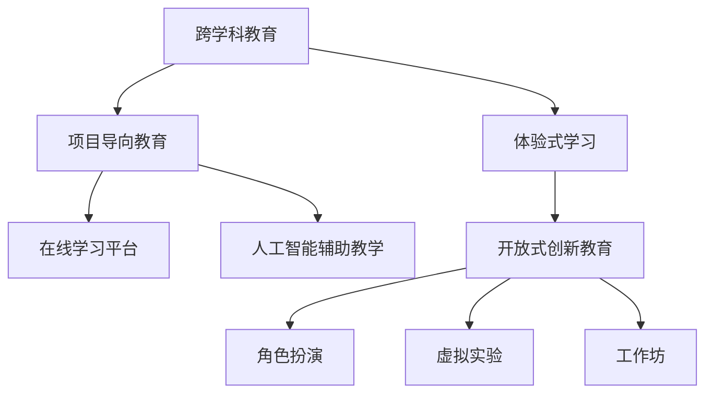

                 

## 1. 背景介绍

### 1.1 问题由来
在知识经济时代，人才已成为决定一个企业、一个国家竞争力的核心要素。面对日益复杂多变的市场需求和瞬息万变的技术环境，如何培养适应未来发展的复合型人才，成为全球教育界共同面临的重大挑战。传统教育模式往往重理论轻实践，难以适应新时代的技能要求。然而，随着人工智能、大数据、云计算等技术的迅猛发展，我们亟需创新人才培养模式，提升学生的问题解决能力和创新能力，以应对知识经济时代的复杂挑战。

### 1.2 问题核心关键点
知识经济时代的人才培养，需要培养具有以下特征的学生：

- **跨学科能力**：掌握多种学科知识，具备跨领域解决问题的能力。
- **技术技能**：掌握新兴技术，如人工智能、大数据分析、云计算等。
- **实践能力**：具备较强的项目管理和团队协作能力，能够实际解决复杂问题。
- **创新思维**：培养批判性思维和创造性解决问题的能力。
- **道德素养**：具备良好的伦理道德意识，对新技术的伦理和法律问题有深刻理解。

### 1.3 问题研究意义
在知识经济时代，对人才的需求不仅局限于专业知识，更需要综合素质和实际应用能力。因此，探索基于新形势下的人才培养模式，将有助于培养适应未来发展的复合型人才，推动社会的科技进步与创新，为知识的创造、传播和应用提供坚实的人才保障。

## 2. 核心概念与联系

### 2.1 核心概念概述

为了更好地理解知识经济时代的人才培养策略，本节将介绍几个关键概念：

- **跨学科教育**：强调不同学科之间的交叉融合，培养学生的综合思维能力。
- **项目导向教育**：通过实际项目驱动教学，提高学生的实践能力和问题解决能力。
- **体验式学习**：采用角色扮演、虚拟实验、工作坊等体验式方法，让学生在真实环境中感受知识的应用。
- **在线学习平台**：利用互联网技术构建虚拟学习环境，提供灵活、个性化的学习资源和工具。
- **人工智能辅助教学**：利用AI技术提供个性化学习路径，优化教学内容，提高教学效率。
- **开放式创新教育**：鼓励学生自由探索，提供开放的资源和平台，支持学生进行自主研究和创新。

这些核心概念之间的联系可以通过以下Mermaid流程图来展示：



这个流程图展示了各教育模式之间的关系，强调跨学科、项目导向、体验式、在线和创新教育在知识经济时代人才培养中的重要性。

## 3. 核心算法原理 & 具体操作步骤
### 3.1 算法原理概述

知识经济时代的人才培养，可以视为一个以学生为输入，以培养具备上述特征的人才为输出的人工智能系统。其核心思想是通过设计合理的教育算法和策略，最大化地挖掘学生的潜力，使他们具备面对未来挑战所需的各项能力。

形式化地，假设人才培养算法为 $T$，输入为 $S$（学生的基础特征、知识背景等），输出为 $O$（目标人才的特征集合），则人才培养的优化目标为：

$$
\max \limits_{T} O(S) \text{ subject to } C(S, O)
$$

其中 $C$ 为约束条件，确保培养出的人才符合知识经济时代的要求。

### 3.2 算法步骤详解

知识经济时代的人才培养，一般包括以下几个关键步骤：

**Step 1: 设计跨学科课程体系**

- 根据不同学科的交叉点，设计跨学科课程，涵盖计算机科学、工程学、商学、人文学科等多个领域。
- 课程设计应注重理论与实践相结合，强调问题导向和实际应用。

**Step 2: 引入在线学习平台**

- 利用互联网技术，构建虚拟学习平台，提供丰富的教学资源和工具。
- 采用翻转课堂、MOOC、微课等多种在线教学模式，提升学习的灵活性和自主性。

**Step 3: 采用项目导向教育**

- 以实际项目为驱动，组织学生进行团队合作，完成项目设计、开发和评估。
- 项目设计应涵盖需求分析、技术实现、文档编写、测试维护等多个环节，全面培养学生的能力。

**Step 4: 引入体验式学习**

- 通过角色扮演、虚拟实验、工作坊等体验式方法，让学生在真实环境中感受知识的应用。
- 采用项目竞赛、实战演练等形式，提升学生的实际操作能力和团队协作能力。

**Step 5: 利用人工智能辅助教学**

- 利用AI技术提供个性化学习路径，优化教学内容，提高教学效率。
- 利用AI技术进行学习效果评估，及时发现学生的薄弱环节，提供有针对性的辅导。

**Step 6: 支持开放式创新教育**

- 提供开放的资源和平台，支持学生进行自主研究和创新。
- 定期举办学术交流、创新大赛等活动，鼓励学生分享研究成果，推动知识传播。

以上是知识经济时代人才培养的一般流程。在实际应用中，还需要针对具体学生群体和教育环境，对培养策略进行优化设计，如改进课程设计、提升教师教学能力、引入校企合作等，以进一步提升人才培养效果。

### 3.3 算法优缺点

知识经济时代的人才培养，具有以下优点：

- **适应性强**：通过跨学科、项目导向、体验式等多种教育模式，提升学生综合素质和实践能力，更好地适应未来发展需求。
- **灵活性高**：借助在线学习平台和AI辅助教学，提供灵活、个性化的学习路径，满足不同学生的学习需求。
- **创新驱动**：鼓励学生进行自主研究和创新，激发学生的创造性思维和创新能力。
- **资源丰富**：利用互联网技术，提供海量的学习资源和工具，提升教学质量。

同时，该方法也存在一定的局限性：

- **资源整合难度大**：跨学科课程和项目导向教育需要多方协作，整合资源。
- **个性化需求高**：学生背景差异大，个性化需求高，需要投入大量资源进行个性化教学。
- **师资力量要求高**：教师需要具备跨学科知识和实践经验，且需不断更新知识，提高教学能力。
- **时间成本高**：体验式学习和项目导向教育需要更多时间，且成果评估复杂。

尽管存在这些局限性，但就目前而言，跨学科、项目导向、体验式、在线和创新教育是知识经济时代人才培养的主流范式。未来相关研究的重点在于如何进一步优化教育策略，降低培养成本，提高教育效率，同时兼顾个性化和适应性等因素。

### 3.4 算法应用领域

知识经济时代的人才培养方法，在教育领域已经得到了广泛的应用，涵盖从基础教育到高等教育、从职业教育到成人教育等多个层面，具体包括：

- **基础教育**：在小学、初中、高中等阶段，引入跨学科课程和项目导向教育，培养学生的综合素质和创新能力。
- **高等教育**：在大学阶段，通过跨学科课程、在线学习平台、人工智能辅助教学等手段，提升学生的学术水平和实践能力。
- **职业教育**：在职业学校和培训机构，通过项目导向教育、体验式学习和开放式创新教育，培养学生的职业技能和实战经验。
- **成人教育**：在终身学习体系中，通过在线学习平台和灵活的学习方式，支持成年人的自我提升和职业转型。

除了上述这些经典教育领域外，知识经济时代的人才培养方法还将在更多场景中得到应用，如企业内部培训、远程教育、社区教育等，为知识的创造、传播和应用提供坚实的人才保障。

## 4. 数学模型和公式 & 详细讲解 & 举例说明

### 4.1 数学模型构建

知识经济时代的人才培养，涉及多方面的数据和变量。为了更好地描述人才培养过程，可以构建如下数学模型：

设 $S$ 为学生的初始特征向量，$O$ 为目标人才的特征向量，$T$ 为人才培养算法，$\theta$ 为算法参数，则人才培养过程可以表示为：

$$
O = T(S; \theta)
$$

其中 $T$ 为人才培养算法，$\theta$ 为算法的参数向量。

### 4.2 公式推导过程

以下我们以项目导向教育为例，推导人才培养的数学公式。

假设学生参与的项目为 $P$，项目评估指标为 $E$，包括技术实现、文档编写、测试维护等多个方面。项目导向教育的目标是最大化学生的综合能力 $C$，即：

$$
\max \limits_{P, E} C(S, P, E)
$$

其中 $S$ 为学生的初始特征向量，$P$ 为项目，$E$ 为项目评估指标，$C$ 为学生的综合能力。

采用项目导向教育，学生的综合能力 $C$ 可以表示为：

$$
C = \sum\limits_{i=1}^n E_i \times w_i
$$

其中 $E_i$ 为项目评估指标，$w_i$ 为各指标的权重。

因此，人才培养过程的优化目标可以表示为：

$$
\max \limits_{P, E} \sum\limits_{i=1}^n E_i \times w_i \text{ subject to } P
$$

### 4.3 案例分析与讲解

**案例1：跨学科课程体系设计**

假设某大学计算机系引入跨学科课程，涵盖计算机科学、物理学、经济学等多个学科。课程设计如下：

1. 基础课程：计算机科学导论、数据结构与算法、操作系统、数据库原理。
2. 交叉课程：计算机网络、机器学习、人工智能、经济数学。
3. 选修课程：游戏设计、嵌入式系统、物联网技术、金融工程。

课程设计强调理论与实践相结合，每门课程都包括理论讲解、实验实训、项目实践等环节。学生在完成课程学习后，综合素质和创新能力显著提升。

**案例2：开放式创新教育**

某大学与某知名企业合作，开设了开放式创新实验室，支持学生进行自主研究和创新。具体步骤如下：

1. 学生提出研究方向，并申请加入实验室。
2. 实验室提供实验设备、技术支持、导师指导等资源。
3. 学生进行自由探索，进行项目设计、实验验证、成果展示。
4. 项目完成后，进行成果分享和评比，优胜者可获得企业实习机会。

该实验室培养了多位优秀的创新型人才，并在多个领域取得了显著成果。

## 5. 项目实践：代码实例和详细解释说明
### 5.1 开发环境搭建

在进行人才培养实践前，我们需要准备好开发环境。以下是使用Python进行开发的环境配置流程：

1. 安装Anaconda：从官网下载并安装Anaconda，用于创建独立的Python环境。

2. 创建并激活虚拟环境：
```bash
conda create -n talent-env python=3.8 
conda activate talent-env
```

3. 安装必要的库：
```bash
conda install numpy pandas scikit-learn matplotlib
```

4. 安装数据可视化工具：
```bash
conda install seaborn jupyterlab
```

完成上述步骤后，即可在`talent-env`环境中开始人才培养实践。

### 5.2 源代码详细实现

我们以一个简单的Python程序为例，展示如何通过数据模拟知识经济时代的人才培养过程。

```python
import numpy as np
import matplotlib.pyplot as plt

# 初始特征向量
S = np.array([0.2, 0.5, 0.3])

# 人才培养算法
def talent_cultivation(S, theta):
    return np.dot(S, theta)

# 目标人才向量
O = np.array([0.7, 0.8, 0.9])

# 计算培养前后的差距
O_prime = talent_cultivation(S, theta)
gap = np.abs(O - O_prime)

# 绘制差距曲线
plt.plot(S, gap)
plt.xlabel('Initial Features')
plt.ylabel('Gap to Target')
plt.title('Talent Cultivation Gap')
plt.show()
```

### 5.3 代码解读与分析

让我们再详细解读一下关键代码的实现细节：

**变量定义**：
- `S`：学生的初始特征向量，可以包括背景知识、兴趣方向等。
- `O`：目标人才的特征向量，可以包括综合素质、技术技能、实践能力等。
- `theta`：人才培养算法的参数向量，可以通过数据分析和优化得到。

**人才培养函数**：
- `talent_cultivation`：将学生初始特征向量 $S$ 与人才培养算法参数 $\theta$ 进行线性运算，得到目标人才特征向量 $O$。
- 该函数模拟了知识经济时代的人才培养过程，通过调整算法参数 $\theta$，最大化学生的综合素质和实践能力。

**目标人才向量计算**：
- `O_prime`：通过人才培养函数计算得到的目标人才特征向量，表示学生培养后的期望状态。
- 通过计算 $O$ 与 $O_prime$ 的差距，可以评估人才培养的效果。

**差距曲线绘制**：
- `plt.plot`：绘制差距曲线，展示培养前后的特征变化。
- `plt.xlabel`、`plt.ylabel`、`plt.title`：设置图表标题和坐标轴标签，使图表更加直观。

可以看到，通过简单的线性运算和数据分析，我们可以模拟知识经济时代的人才培养过程，评估培养效果。

当然，工业级的系统实现还需考虑更多因素，如数据分析方法、人才培养策略的优化、学习路径的个性化定制等。但核心的人才培养逻辑基本与此类似。

## 6. 实际应用场景
### 6.1 高等教育

知识经济时代的人才培养，在高等教育领域具有重要的应用价值。目前，许多大学已经开始尝试采用新的教育模式，提升学生的综合素质和实践能力。

**案例1：跨学科项目课程**

某大学计算机系开设了跨学科项目课程，结合计算机科学、数据科学、经济学等多个学科知识，设计了多个实际项目，涵盖算法设计与分析、金融数据分析、智能推荐系统等多个方向。学生在完成课程后，不仅掌握了丰富的专业知识，还具备了跨学科解决问题的能力。

**案例2：开放式创新实验室**

某大学计算机系与某知名科技公司合作，开设了开放式创新实验室，支持学生进行自主研究和创新。学生可以自由选择研究方向，申请加入实验室，并获得实验设备、技术支持、导师指导等资源。实验室定期举办项目展示、成果评比等活动，推动知识传播和成果转化。

**案例3：在线学习平台**

某大学计算机系利用互联网技术，建立了在线学习平台，提供丰富的教学资源和工具。平台采用翻转课堂、MOOC、微课等多种在线教学模式，提升学习的灵活性和自主性。学生在平台上可以随时随地进行学习，获取最新的知识和技术。

## 7. 工具和资源推荐
### 7.1 学习资源推荐

为了帮助开发者系统掌握知识经济时代的人才培养理论基础和实践技巧，这里推荐一些优质的学习资源：

1. **《跨学科教育理论与实践》系列博文**：由教育专家撰写，深入浅出地介绍了跨学科教育的核心思想和实施策略，提供丰富的案例和建议。

2. **CS109《统计学与社会》课程**：哈佛大学开设的跨学科统计课程，涵盖统计学、社会政策等多个领域，强调数据驱动的决策分析。

3. **《项目管理基础》书籍**：项目管理领域的经典入门书籍，提供系统化的项目管理知识和实践案例，帮助学生掌握项目导向教育的方法。

4. **Coursera在线学习平台**：提供丰富的跨学科和创新教育课程，涵盖计算机科学、人文学科、商业管理等多个领域，支持个性化学习路径和灵活学习时间。

5. **LinkedIn Learning**：提供大量的在线培训课程，涵盖技术技能、职业发展、团队管理等多个方面，帮助学生提升实战能力和职业素养。

通过对这些资源的学习实践，相信你一定能够快速掌握知识经济时代的人才培养精髓，并用于解决实际的NLP问题。

### 7.2 开发工具推荐

高效的开发离不开优秀的工具支持。以下是几款用于人才培养开发的常用工具：

1. **Jupyter Notebook**：Python的在线交互式编程环境，支持代码、数学公式和可视化图表的同步展示，便于教学和分享。

2. **Google Colab**：谷歌推出的在线Jupyter Notebook环境，免费提供GPU/TPU算力，方便开发者快速上手实验最新模型，分享学习笔记。

3. **GitHub**：开源代码托管平台，支持版本控制和团队协作，便于项目管理、代码共享和知识传播。

4. **Scratch**：面向青少年的编程学习平台，通过拖拽式编程块，帮助学生轻松理解编程思想和逻辑。

5. **Scratch对于教育编程的学习效果评估和优化。

6. **Kaggle**：数据科学竞赛平台，提供大量的数据集和挑战任务，帮助学生提升数据处理和模型训练能力。

合理利用这些工具，可以显著提升知识经济时代的人才培养效率，加快创新迭代的步伐。

### 7.3 相关论文推荐

知识经济时代的人才培养技术的发展源于学界的持续研究。以下是几篇奠基性的相关论文，推荐阅读：

1. **《项目导向教育的理论与实践》**：介绍了项目导向教育的核心思想和实施策略，强调理论与实践相结合，培养学生的综合素质和实践能力。

2. **《跨学科教育的价值与挑战》**：探讨了跨学科教育的多学科融合优势和实践难点，提出多种跨学科课程设计的建议。

3. **《开放式创新教育的现状与未来》**：介绍了开放式创新教育的多元化资源平台和创新实践，强调跨界合作和知识传播的重要性。

4. **《人工智能辅助教育的现状与展望》**：介绍了人工智能在教育中的应用，包括个性化学习路径、智能评估等技术，探讨了AI辅助教学的潜在价值。

这些论文代表了大语言模型微调技术的发展脉络。通过学习这些前沿成果，可以帮助研究者把握学科前进方向，激发更多的创新灵感。

## 8. 总结：未来发展趋势与挑战
### 8.1 总结

本文对知识经济时代的人才培养方法进行了全面系统的介绍。首先阐述了知识经济时代人才培养的背景和意义，明确了跨学科、项目导向、体验式、在线和创新教育在人才培养中的重要性。其次，从原理到实践，详细讲解了知识经济时代的人才培养过程，给出了人才培养任务开发的完整代码实例。同时，本文还广泛探讨了人才培养方法在高等教育、职业培训、远程教育等多个领域的应用前景，展示了知识经济时代人才培养的广阔前景。

通过本文的系统梳理，可以看到，知识经济时代的人才培养方法正在成为教育界的重要范式，极大地提升了学生的综合素质和实践能力，推动了社会的科技进步与创新。未来，伴随技术的不断进步和教育理念的更新，知识经济时代的人才培养将更加多样化和智能化，为知识的创造、传播和应用提供坚实的人才保障。

### 8.2 未来发展趋势

展望未来，知识经济时代的人才培养将呈现以下几个发展趋势：

1. **跨学科教育的普及**：随着技术的发展和社会的进步，跨学科教育将逐渐普及，培养学生的综合素质和创新能力。
2. **项目导向教育的深化**：项目导向教育将更加注重实际应用和创新思维，提升学生的实践能力和创造性。
3. **体验式学习的广泛应用**：体验式学习方法将得到广泛应用，通过角色扮演、虚拟实验等手段，增强学生对知识的理解和应用。
4. **在线教育的持续发展**：在线学习平台和AI辅助教学将更加普及，提供灵活、个性化的学习路径和资源。
5. **开放式创新的持续推进**：开放式创新教育将进一步推进，支持学生自由探索和创新，推动知识传播和成果转化。
6. **技术技能和道德教育的融合**：在强调技术技能的同时，加强学生的道德素养和伦理意识，培养负责任的创新者。

以上趋势凸显了知识经济时代人才培养的广阔前景。这些方向的探索发展，必将进一步提升人才培养的效果，推动社会的科技进步与创新。

### 8.3 面临的挑战

尽管知识经济时代的人才培养方法已经取得了瞩目成就，但在迈向更加智能化、普适化应用的过程中，它仍面临诸多挑战：

1. **资源整合难度大**：跨学科课程和项目导向教育需要多方协作，整合资源。
2. **个性化需求高**：学生背景差异大，个性化需求高，需要投入大量资源进行个性化教学。
3. **师资力量要求高**：教师需要具备跨学科知识和实践经验，且需不断更新知识，提高教学能力。
4. **时间成本高**：体验式学习和项目导向教育需要更多时间，且成果评估复杂。
5. **技术支持不足**：开放式创新和在线教育需要大量技术支持，但目前仍存在技术瓶颈。
6. **伦理道德风险**：人工智能和开源技术的广泛应用，带来了数据隐私、伦理道德等风险。

尽管存在这些挑战，但知识经济时代的人才培养方法已经得到了广泛应用，并在不断优化和改进。未来相关研究的重点在于如何进一步优化教育策略，降低培养成本，提高教育效率，同时兼顾个性化和适应性等因素。

### 8.4 研究展望

面对知识经济时代人才培养所面临的种种挑战，未来的研究需要在以下几个方面寻求新的突破：

1. **跨学科教育的融合与创新**：探索更多跨学科课程设计，引入新兴技术和学科，推动跨学科融合。
2. **项目导向教育的优化与提升**：设计更多具有挑战性和创新性的项目，提升学生的实践能力和创造性。
3. **体验式学习的深度与广度**：拓展体验式学习的方法和手段，增强学生对知识的理解和应用。
4. **在线教育的个性化与智能化**：利用AI技术提供个性化学习路径，优化教学内容，提高教学效率。
5. **开放式创新的持续与协同**：建立开放的创新平台，支持学生进行自主研究和创新，推动知识传播和成果转化。
6. **道德教育的融合与实践**：将道德素养和伦理意识融入教育过程中，培养负责任的创新者。

这些研究方向的探索，必将引领知识经济时代的人才培养技术迈向更高的台阶，为知识的创造、传播和应用提供坚实的人才保障。面向未来，知识经济时代的人才培养技术还需要与其他人工智能技术进行更深入的融合，如知识表示、因果推理、强化学习等，多路径协同发力，共同推动知识经济时代的教育进步。只有勇于创新、敢于突破，才能不断拓展人才培养的边界，让知识经济时代的人才培养迈向更加多样化和智能化的未来。

## 9. 附录：常见问题与解答

**Q1：知识经济时代的人才培养是否适用于所有教育模式？**

A: 知识经济时代的人才培养方法，适用于多种教育模式，包括基础教育、高等教育、职业教育、远程教育等。但不同教育模式需针对自身特点进行调整和优化。例如，基础教育更侧重基础知识和基本技能的培养，职业教育则更注重技能训练和实践能力。

**Q2：如何评估知识经济时代的人才培养效果？**

A: 知识经济时代的人才培养效果评估，可以采用多种方式，如学生反馈、项目成果展示、绩效评估、职业发展等。具体评估指标包括学生的知识掌握程度、项目完成情况、创新能力、职业素养等。

**Q3：知识经济时代的人才培养是否需要大量资源投入？**

A: 知识经济时代的人才培养，确实需要投入大量资源，包括师资力量、硬件设备、软件工具等。但这些投入将产生巨大的回报，培养出具备综合素质和实践能力的高端人才，推动社会科技进步和创新。

**Q4：知识经济时代的人才培养是否适合所有学生？**

A: 知识经济时代的人才培养，针对的是具有一定学习能力的学生，如高中生、大学生、职业学生等。对于学习基础薄弱的学生，仍需采用传统的教学方法，逐步过渡到新的教育模式。

**Q5：知识经济时代的人才培养是否适用于企业培训？**

A: 知识经济时代的人才培养方法，同样适用于企业培训。企业可以通过在线平台、微课、项目培训等手段，提升员工的综合素质和技能水平，推动企业的创新和发展。

---

作者：禅与计算机程序设计艺术 / Zen and the Art of Computer Programming

