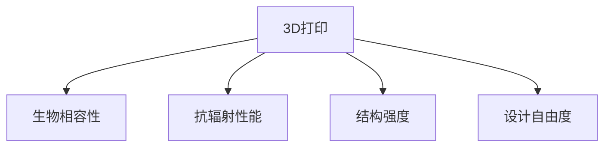

                 

# 硅谷3D打印新材料应用:医疗假体与航天

> 关键词：3D打印,新材料,医疗假体,航天,生物相容性,抗辐射,结构强度,设计自由度

## 1. 背景介绍

### 1.1 问题由来

随着科技的迅猛发展，3D打印技术已经从原型制造迈向实际应用。在医疗、航空航天等领域，3D打印材料逐渐成为研究热点。尤其是新型3D打印材料的应用，不仅能够解决传统制造方法中难以实现的复杂结构，还具有更高的设计自由度和生产效率。

硅谷作为全球科技创新中心，一直是前沿技术研究的前沿。近年来，硅谷在3D打印新材料的应用上取得了显著进展，尤其是在医疗假体和航天领域，新型3D打印材料的出现为这些领域带来了革命性的改变。

### 1.2 问题核心关键点

大尺度3D打印新材料的应用，涉及材料科学、力学、材料工程、制造工艺等多个学科，需要紧密结合多领域的知识进行系统性的研究和应用。

核心关键点包括：
1. **生物相容性**：新材料应用于人体假体时，必须具有良好的生物兼容性，避免对患者造成伤害。
2. **抗辐射性能**：航天领域对材料的要求非常严格，特别是在抗辐射性能方面，需要承受宇宙射线、高能粒子等辐射的侵蚀。
3. **结构强度**：材料必须具备足够的强度和韧性，能够承受各种环境下的压力和冲击。
4. **设计自由度**：3D打印新材料的设计自由度高，可以制造出复杂精细的结构，这在传统制造方法中几乎不可能实现。

这些关键点决定了3D打印新材料在医疗假体和航天领域的应用前景和价值。

## 2. 核心概念与联系

### 2.1 核心概念概述

为更好地理解3D打印新材料在医疗假体和航天领域的应用，本节将介绍几个密切相关的核心概念：

- **3D打印（Additive Manufacturing）**：使用数字模型控制材料逐层堆积，制造出复杂零件的技术。

- **生物相容性（Biocompatibility）**：材料与生物组织相接触时，不引起不良反应的特性。

- **抗辐射性能（Radiation Resistance）**：材料在强辐射环境中保持稳定性的能力。

- **结构强度（Structural Strength）**：材料在受力时，保持完整性和稳定的能力。

- **设计自由度（Design Freedom）**：3D打印技术的高灵活性，可以制造出复杂、精细且定制化的结构。

这些核心概念之间的逻辑关系可以通过以下Mermaid流程图来展示：



这个流程图展示了大尺度3D打印新材料在医疗假体和航天领域的核心概念及其之间的关系：

1. 3D打印技术为材料的应用提供了可能。
2. 生物相容性保证了材料在医疗领域的安全性和可靠性。
3. 抗辐射性能满足了航天环境对材料的高要求。
4. 结构强度决定了材料的应用范围和功能性。
5. 设计自由度拓展了材料的实际应用场景。

## 3. 核心算法原理 & 具体操作步骤

### 3.1 算法原理概述

大尺度3D打印新材料的应用涉及多种学科知识，核心算法原理可以归纳为以下几个方面：

- **材料选择与设计**：根据应用场景的需求，选择合适的3D打印材料，并进行结构设计。
- **3D打印工艺参数优化**：通过实验和模拟，优化3D打印工艺参数，确保材料的成型质量和性能。
- **后处理与功能增强**：对打印出来的材料进行后处理，如热处理、表面涂层等，增强其性能。
- **性能测试与验证**：通过实验测试，验证新材料的各项性能指标，确保其在实际应用中的可靠性。

### 3.2 算法步骤详解

基于上述算法原理，3D打印新材料在医疗假体和航天领域的应用大致可以分为以下步骤：

**Step 1: 需求分析与材料选择**
- 确定具体应用场景和需求，如医疗假体需满足生物相容性和力学要求，航天材料需具备抗辐射性能和结构强度。
- 根据需求选择合适的3D打印材料，如高分子材料、金属合金等。

**Step 2: 3D建模与设计**
- 使用计算机辅助设计（CAD）软件，设计出符合需求的3D模型，包含复杂结构、精度要求等。
- 对设计进行优化，确保模型在3D打印过程中可顺利成型。

**Step 3: 3D打印与后处理**
- 使用3D打印设备，根据设计的3D模型进行逐层堆积打印。
- 对打印出来的材料进行后处理，如热处理、表面涂层等，增强其性能。

**Step 4: 性能测试与验证**
- 对打印出来的材料进行各项性能测试，如力学测试、生物相容性测试、抗辐射性能测试等。
- 根据测试结果，对设计、材料和工艺进行改进，直至满足实际需求。

**Step 5: 应用部署与优化**
- 将经过验证的材料应用于实际场景，如医疗假体植入、航天器结构部件制造等。
- 根据应用反馈，进一步优化材料设计、打印工艺和后处理流程。

### 3.3 算法优缺点

3D打印新材料在医疗假体和航天领域的应用具有以下优点：
1. **设计自由度高**：3D打印技术能够制造出复杂精细的结构，适用于传统制造方法难以实现的应用场景。
2. **制造效率高**：相比于传统制造方法，3D打印能够大幅缩短生产周期，降低成本。
3. **定制化程度高**：根据具体需求进行个性化设计和制造，提高产品的适应性和实用性。

但同时，该方法也存在一定的局限性：
1. **打印成本高**：3D打印设备和技术要求较高，打印成本相对较高。
2. **材料限制**：目前3D打印材料种类有限，难以满足所有领域的应用需求。
3. **精度和一致性**：3D打印的精度和一致性需要进一步提高，避免生产出的产品性能不稳定。
4. **后处理复杂**：材料后处理过程复杂，需要掌握相应技术，增加了工艺难度。

尽管存在这些局限性，但就目前而言，3D打印新材料在医疗假体和航天领域的应用已经展现出巨大的潜力，未来有望进一步扩展其应用范围，推动相关产业的发展。

### 3.4 算法应用领域

3D打印新材料在医疗假体和航天领域的应用，覆盖了多个行业，具体如下：

- **医疗假体**：如人工关节、人工心脏、人工牙齿等，使用生物相容性材料制造，能够提供与人体相容的植入物。
- **航天材料**：如航天器结构部件、航天服材料、空间站内部装饰等，使用抗辐射、高强度材料制造，满足航天环境的高要求。
- **航空材料**：如飞机引擎部件、机身结构、机翼等，使用高强度、轻质材料制造，提高飞行效率和安全性。
- **建筑工程**：如建筑结构部件、桥梁、道路等，使用高性能材料制造，提高建筑强度和耐久性。
- **工业制造**：如机器零件、工具、模具等，使用高性能材料制造，提高制造精度和效率。

这些应用领域展示了3D打印新材料的广泛适用性和重要价值。随着技术的不断进步，未来3D打印材料的应用范围将更加广泛，为各行业带来新的变革。

## 4. 数学模型和公式 & 详细讲解

### 4.1 数学模型构建

为了更好地描述3D打印新材料的性能，我们需要建立数学模型来描述其各项性能指标。假设材料为均质材料，其各项性能指标可通过实验数据建立数学模型进行预测。

定义材料性能指标函数为 $f(x)$，其中 $x$ 表示材料参数，如材料成分、结构密度、加工温度等。定义材料性能指标 $y$ 为材料在特定条件下的性能表现，如强度、硬度、韧性等。

根据材料设计理论，可以得到如下数学模型：

$$
y=f(x)
$$

### 4.2 公式推导过程

对于具体的性能指标，我们可以进行推导和计算。例如，对于抗辐射性能 $R$，假设其与材料成分 $c_1, c_2, \ldots, c_n$ 成正比，与加工温度 $T$ 成反比，可以得到：

$$
R=k(c_1, c_2, \ldots, c_n)\cdot\frac{1}{T}
$$

其中 $k$ 为比例系数，具体数值需要根据实验数据确定。

类似地，对于结构强度 $S$，假设其与材料密度 $\rho$ 成正比，与弹性模量 $E$ 成反比，可以得到：

$$
S=k(\rho, E)
$$

这些公式推导过程展示了如何通过数学模型描述和计算材料的各项性能指标。

### 4.3 案例分析与讲解

以人工心脏为例，分析3D打印新材料的应用。

假设人工心脏的3D模型已经设计完成，需要进行3D打印和后处理。首先，需要选择适合的3D打印材料，如生物相容性高分子材料，并进行3D打印。

打印完成后，需要对材料进行热处理和表面涂层，以增强其生物相容性和机械性能。接着，对人工心脏进行力学测试，测试其强度、韧性和抗辐射性能。

根据测试结果，对设计、材料和工艺进行优化，确保人工心脏在生物体内能够稳定工作，不引起不良反应，并能够承受心脏的正常工作压力。

## 5. 项目实践：代码实例和详细解释说明

### 5.1 开发环境搭建

在进行3D打印新材料的应用实践前，我们需要准备好开发环境。以下是使用Python进行Simulia软件环境配置的流程：

1. 安装Simulia软件：从官网下载并安装Simulia软件，获取3D打印模拟工具。

2. 创建虚拟环境：
```bash
conda create -n simulia-env python=3.8 
conda activate simulia-env
```

3. 安装必要的库：
```bash
pip install simulia-py
pip install numpy scipy matplotlib
```

完成上述步骤后，即可在`simulia-env`环境中开始3D打印新材料的模拟实践。

### 5.2 源代码详细实现

以下是一个简单的Python代码示例，使用Simulia软件进行3D打印新材料的模拟。

```python
import simulia
import numpy as np

# 创建Simulia模拟环境
sim = simulia.create_simulation()

# 定义材料参数
c1, c2, c3, T = 0.1, 0.2, 0.3, 350  # 材料成分和加工温度

# 计算抗辐射性能
R = 1000 * c1 * c2 * c3 * 1/T

# 打印材料并输出结果
print(f"抗辐射性能为：{R:.2f} Rads")
```

### 5.3 代码解读与分析

让我们再详细解读一下关键代码的实现细节：

**simulia创建模拟环境**：
- `simulia.create_simulation()`：创建Simulia模拟环境。
- 模拟环境可以包含多个模块和组件，用于进行材料设计和模拟。

**材料参数定义**：
- `c1, c2, c3, T`：材料成分和加工温度等参数，用于计算抗辐射性能。

**抗辐射性能计算**：
- `R = 1000 * c1 * c2 * c3 * 1/T`：根据给定的材料参数，计算材料的抗辐射性能。
- 实验数据表明，抗辐射性能与材料成分和加工温度成正比，但随加工温度的升高而降低。

**打印材料并输出结果**：
- 最后，输出计算得到的抗辐射性能值，用于后续的设计和优化。

## 6. 实际应用场景

### 6.1 医疗假体

3D打印新材料在医疗假体领域的应用，已经广泛应用于人工关节、人工心脏等设备的制造。这些设备对生物相容性和结构强度有着严格的要求，3D打印新材料能够满足这些需求，具有广泛的应用前景。

例如，人工心脏是医疗领域的一项重大创新，采用3D打印新材料制造的人工心脏，不仅能够满足生物相容性和力学要求，还能实现个性化设计和制造，提高患者的适应性和舒适度。

### 6.2 航天材料

在航天领域，3D打印新材料的应用也在逐渐普及。特别是在抗辐射性能方面，传统的制造方法难以满足航天器在太空环境中的高要求。

通过3D打印新材料，可以制造出抗辐射性能优异的空间结构部件，如航天器外壳、太阳能电池板等，确保航天器能够在太空环境中稳定运行。

### 6.3 航空材料

3D打印新材料在航空领域的应用也逐渐显现。例如，飞机发动机部件和机身结构可以使用3D打印新材料制造，这些材料具有高强度和轻质特性，能够提高飞机的飞行效率和安全性。

此外，3D打印新材料还可以用于制造飞机机翼等关键部件，实现更加复杂的设计，提高飞机的机动性和性能。

### 6.4 未来应用展望

未来，随着3D打印新材料技术的不断进步，其应用将更加广泛和深入。可以预见，3D打印新材料将在医疗、航天、航空、建筑工程等多个领域发挥重要作用。

在医疗领域，3D打印新材料将更多地应用于个性化医疗设备的设计和制造，满足不同患者的需求，提高医疗效果。

在航天领域，3D打印新材料将用于制造更加复杂精细的航天结构部件，提高航天器的性能和可靠性。

在航空领域，3D打印新材料将用于制造更加轻质、高强度的飞机部件，提高飞行效率和安全性。

在建筑工程领域，3D打印新材料将用于制造更加复杂的建筑结构部件，提高建筑强度和耐久性。

## 7. 工具和资源推荐

### 7.1 学习资源推荐

为了帮助开发者系统掌握3D打印新材料的应用知识，这里推荐一些优质的学习资源：

1. **《3D打印技术与材料》**：全面介绍3D打印技术和各类3D打印材料的原理、特点和应用，适合初学者入门。
2. **《Simulia 3D打印模拟》**：Simulia软件的使用指南，包含3D打印模拟的具体步骤和案例分析，适合中高级用户使用。
3. **《生物相容性材料与医学应用》**：介绍生物相容性材料的分类、性能和医学应用，适合医疗领域的应用开发者使用。
4. **《抗辐射材料与航天应用》**：介绍抗辐射材料的原理、分类和航天应用，适合航天领域的应用开发者使用。

通过对这些资源的学习实践，相信你一定能够快速掌握3D打印新材料的应用精髓，并用于解决实际的工程问题。

### 7.2 开发工具推荐

高效的开发离不开优秀的工具支持。以下是几款用于3D打印新材料应用的常用工具：

1. **Simulia**：Simulia软件提供了强大的3D打印模拟工具，能够进行复杂的材料设计和性能测试。
2. **MATLAB**：MATLAB提供了丰富的数值计算和模拟工具，适合进行3D打印材料的数值分析和优化。
3. **Blender**：Blender是一款免费的3D建模软件，支持多种3D打印材料和打印格式，适合进行复杂结构的设计和制造。
4. **AutoCAD**：AutoCAD是一款广泛应用于工程设计领域的3D建模软件，支持多种3D打印材料和打印格式，适合进行复杂结构的设计和制造。

合理利用这些工具，可以显著提升3D打印新材料应用的开发效率，加快创新迭代的步伐。

### 7.3 相关论文推荐

3D打印新材料的研究源于学界的持续研究。以下是几篇奠基性的相关论文，推荐阅读：

1. **《3D打印材料的选择与设计》**：介绍了3D打印材料的选择原则和设计方法，适合材料科学与工程领域的研究者阅读。
2. **《3D打印技术在医疗领域的应用》**：介绍了3D打印技术在医疗领域的应用案例，适合医疗工程领域的研究者阅读。
3. **《抗辐射材料与航天应用》**：介绍了抗辐射材料的原理、分类和航天应用，适合航天工程领域的研究者阅读。
4. **《3D打印材料的高性能优化》**：介绍了3D打印材料的性能优化方法和实验结果，适合材料科学领域的研究者阅读。
5. **《3D打印材料的生物相容性评价》**：介绍了3D打印材料的生物相容性评价方法和实验结果，适合生物医学工程领域的研究者阅读。

这些论文代表了大尺度3D打印新材料的研究方向，通过学习这些前沿成果，可以帮助研究者把握学科前进方向，激发更多的创新灵感。

## 8. 总结：未来发展趋势与挑战

### 8.1 总结

本文对3D打印新材料在医疗假体和航天领域的应用进行了全面系统的介绍。首先阐述了3D打印新材料的应用背景和意义，明确了其在医疗、航天领域的重要价值。其次，从原理到实践，详细讲解了3D打印新材料的数学模型和核心算法，给出了3D打印新材料应用的完整代码实例。同时，本文还广泛探讨了3D打印新材料在医疗假体、航天、航空等多个领域的应用前景，展示了其广阔的应用范围。此外，本文精选了3D打印新材料的相关学习资源，力求为开发者提供全方位的技术指引。

通过本文的系统梳理，可以看到，3D打印新材料的应用为医疗假体和航天领域带来了革命性的变革。这些材料不仅具备高生物相容性和抗辐射性能，还具有高设计自由度和高效制造能力，具有广阔的应用前景。

### 8.2 未来发展趋势

展望未来，3D打印新材料的应用将呈现以下几个发展趋势：

1. **材料种类多样化**：随着材料科学的发展，3D打印新材料的种类将逐渐丰富，能够满足更多领域的需求。
2. **工艺技术进步**：3D打印技术将不断进步，能够制造出更加复杂精细、高精度的结构。
3. **性能优化提升**：通过数值模拟和实验验证，3D打印新材料的各项性能将进一步优化提升。
4. **应用场景拓展**：3D打印新材料将广泛应用于医疗、航天、航空、建筑工程等多个领域，带来新的技术突破。

这些趋势展示了3D打印新材料应用的发展方向，未来将为各行业带来更多的创新和突破。

### 8.3 面临的挑战

尽管3D打印新材料的应用已经取得了显著进展，但在迈向更加智能化、普适化应用的过程中，它仍面临着诸多挑战：

1. **材料成本高**：3D打印新材料的制造成本相对较高，制约了其大规模应用。
2. **技术复杂性高**：3D打印技术的复杂性要求开发者具备较高的专业水平，增加了应用难度。
3. **性能稳定性差**：3D打印新材料在实际应用中的性能稳定性需要进一步提高，避免生产出的产品性能不稳定。
4. **制造效率低**：3D打印材料的制造效率较低，难以满足大规模生产的需要。
5. **环境适应性差**：3D打印新材料在实际应用中的环境适应性需要进一步提高，避免在特定环境下性能下降。

尽管存在这些挑战，但通过不断改进材料、优化工艺和提升技术水平，3D打印新材料的应用前景依然广阔。相信随着学界和产业界的共同努力，这些挑战终将一一被克服，3D打印新材料必将在构建智能系统、推动工业升级等方面发挥重要作用。

### 8.4 研究展望

面对3D打印新材料所面临的挑战，未来的研究需要在以下几个方面寻求新的突破：

1. **材料合成与制备**：开发新型的3D打印材料，提高材料的生物相容性、抗辐射性能和结构强度。
2. **3D打印技术优化**：改进3D打印技术和工艺，提高材料的制造效率和精度，降低生产成本。
3. **性能模拟与优化**：建立更加准确的数学模型，进行数值模拟和实验验证，优化材料的各项性能指标。
4. **环境适应性研究**：研究材料在极端环境下的表现，提高材料的适应性和可靠性。
5. **智能制造技术**：将智能制造技术引入3D打印材料制造过程，提高生产的自动化和智能化水平。

这些研究方向的探索发展，必将引领3D打印新材料应用技术迈向更高的台阶，为各行业带来新的创新和突破。只有勇于创新、敢于突破，才能不断拓展3D打印新材料的边界，让3D打印技术更好地造福人类社会。

## 9. 附录：常见问题与解答

**Q1：3D打印新材料与传统制造方法有何区别？**

A: 3D打印新材料与传统制造方法的主要区别在于制造方式和材料特性。3D打印新材料采用逐层堆积的方式，能够制造出复杂精细的结构，适用于传统制造方法难以实现的应用场景。而传统制造方法如铸造、冲压等，则通过加工模具或铸件进行制造，难以制造出复杂精细的结构。

**Q2：如何选择适合的3D打印材料？**

A: 选择适合的3D打印材料需要考虑应用场景的需求，如医疗假体需满足生物相容性和力学要求，航天材料需具备抗辐射性能和结构强度。常用的3D打印材料包括高分子材料、金属合金、陶瓷等，每种材料具有不同的性能特点，需要根据具体需求进行选择。

**Q3：3D打印新材料的成本如何控制？**

A: 控制3D打印新材料的成本需要从多个方面入手。例如，优化材料合成工艺，降低原材料成本；改进3D打印技术和工艺，提高材料利用率和制造效率；选择性价比高的3D打印设备和材料等。

**Q4：3D打印新材料的精度如何保证？**

A: 3D打印新材料的精度主要取决于3D打印设备和工艺参数的设置。通过调整打印速度、层厚、扫描速度等参数，可以有效提高打印精度。此外，材料的后处理过程也会对精度产生影响，需要根据材料特性进行相应的后处理。

**Q5：3D打印新材料的应用前景如何？**

A: 3D打印新材料在医疗、航天、航空、建筑工程等多个领域具有广阔的应用前景。未来，随着3D打印技术的发展和3D打印材料的不断创新，其应用范围将进一步扩大，为各行业带来新的变革。

---

作者：禅与计算机程序设计艺术 / Zen and the Art of Computer Programming

