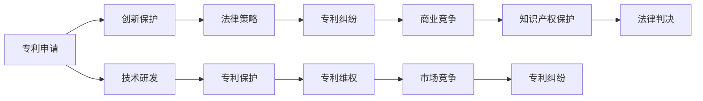

                 

# 硅谷专利纠纷案例:知识产权保护实践

> 关键词：专利纠纷, 知识产权保护, 商业竞争, 法律策略, 创新保护

## 1. 背景介绍

### 1.1 问题由来

硅谷作为全球科技创新的中心，汇聚了数不胜数的科技公司和初创企业。然而，随着科技的高速发展，知识产权（IP）的争夺也日益激烈，专利纠纷案件频频发生。其中，大型科技公司之间的专利诉讼尤其引人注目。

近年来，苹果公司与三星公司、谷歌公司之间的专利纠纷案件备受瞩目。这些案件不仅涉及巨额的赔偿金，还影响到了市场竞争和消费者利益。本文将从这些知名案件中提取典型案例，分析专利纠纷的背景、过程和结果，旨在深入探讨知识产权保护实践中的法律策略和商业竞争策略。

### 1.2 问题核心关键点

- 大公司之间的专利诉讼：跨国公司之间因技术专利争夺而引发的法律纠纷。
- 专利申请与维权策略：如何在复杂的法律环境中通过专利申请和维权保护自身创新成果。
- 市场竞争与消费者权益：专利纠纷对市场竞争环境及消费者权益的影响。
- 专利纠纷的解决方案：从法律、商业和技术多个角度寻求纠纷解决的途径。

这些核心关键点将帮助我们更全面地理解硅谷专利纠纷案例，并从中获得启发。

## 2. 核心概念与联系

### 2.1 核心概念概述

- **专利纠纷(Patent Litigation)**：指不同利益方因专利申请、使用、授权、侵权等问题而引起的法律争议。
- **知识产权保护(Intellectual Property Protection)**：通过法律手段保护创新者的合法权益，防止他人非法复制、使用其创新成果。
- **商业竞争(Commercial Competition)**：在市场环境中，企业通过竞争获取更多的市场份额和利益。
- **法律策略(Legal Strategy)**：企业在面对专利纠纷时，采用何种法律手段来维护自身利益。
- **创新保护(Innovation Protection)**：通过法律手段保护创新者的创新成果，促进技术进步和市场竞争。

这些核心概念相互关联，共同构成了知识产权保护的法律和商业框架。通过了解这些概念，我们可以更好地理解硅谷专利纠纷的背景和解决方案。

### 2.2 核心概念原理和架构的 Mermaid 流程图(Mermaid 流程节点中不要有括号、逗号等特殊字符)



这个流程图展示了专利纠纷从创新保护到法律策略再到知识产权保护的全过程，同时映射了技术研发、专利维权、市场竞争等多个环节，帮助我们理解各环节之间的内在联系。

## 3. 核心算法原理 & 具体操作步骤

### 3.1 算法原理概述

专利纠纷的核心在于如何通过法律手段解决因专利权而引起的争议。这个过程涉及以下几个关键步骤：

1. **专利申请**：企业通过撰写专利申请文件，将其技术创新提交给国家或地区专利局，获取专利权。
2. **法律策略**：在专利权受到侵犯时，企业采取何种法律手段（如诉讼、协商）保护自身利益。
3. **专利纠纷**：在专利申请或使用过程中，不同利益方因专利归属、侵权问题发生争议。
4. **知识产权保护**：通过法律手段维护企业的专利权，防止他人非法复制、使用其创新成果。
5. **法律判决**：法院在审理专利纠纷案件后，对专利权归属、侵权行为等作出判决，以维护正义。

### 3.2 算法步骤详解

1. **专利申请**：
   - 确定发明创造：评估技术创新是否具有新颖性、创造性和实用性。
   - 撰写专利申请文件：包括专利请求书、说明书、权利要求书等。
   - 提交专利申请：将申请文件提交给目标国家或地区的专利局。

2. **法律策略**：
   - 评估侵权证据：分析对方专利是否侵犯自身专利。
   - 进行协商或调解：尽可能通过协商解决争议。
   - 提起诉讼：在协商失败的情况下，通过法院解决纠纷。

3. **专利纠纷**：
   - 收集证据：收集对方专利的详细信息和侵权行为证据。
   - 提起诉讼：在证据确凿的情况下，向法院提起诉讼。
   - 应对反诉：在对方提出反诉时，进行应对和答辩。

4. **知识产权保护**：
   - 申请禁令：请求法院发出禁止侵权的临时禁令。
   - 请求赔偿：在胜诉后，要求对方支付赔偿金。
   - 技术保护：加强专利技术的保密性，防止专利泄露。

5. **法律判决**：
   - 审理案件：法院全面审理案件，分析证据和法律条文。
   - 作出判决：法院根据审理结果，作出判决。
   - 执行判决：胜诉方在法院判决后，执行法院的判决。

### 3.3 算法优缺点

#### 优点：
- **法律保护**：通过法律手段保护企业的专利权，防止他人非法复制、使用其创新成果。
- **市场竞争优势**：通过专利诉讼获得市场竞争优势，迫使竞争对手改变市场策略。
- **创新激励**：专利权的保护和维护能够激励企业进行技术创新。

#### 缺点：
- **高昂成本**：专利纠纷诉讼过程复杂、成本高昂。
- **时间周期长**：诉讼过程可能需要数年时间，影响企业快速响应市场变化。
- **不确定性**：法院判决具有不确定性，结果可能与预期不符。

### 3.4 算法应用领域

专利纠纷的解决不仅涉及法律和商业领域，还对技术研发、市场竞争和消费者权益产生深远影响。以下是专利纠纷解决在实际应用中的几个主要领域：

- **技术研发**：企业通过专利申请保护技术创新，推动技术进步。
- **市场竞争**：通过专利诉讼，企业能够在市场竞争中获得优势，防止竞争对手通过模仿获取不当利益。
- **消费者权益**：保护消费者的合法权益，防止假冒伪劣产品进入市场。

## 4. 数学模型和公式 & 详细讲解 & 举例说明（备注：数学公式请使用latex格式，latex嵌入文中独立段落使用 $$，段落内使用 $)
### 4.1 数学模型构建

专利纠纷的解决过程可以建模为一个多阶段决策过程，每个阶段具有不同的状态和决策点。例如，专利纠纷可以建模为一个马尔科夫决策过程(MDP)，每个状态表示纠纷的不同阶段，每个决策点表示企业的法律策略选择。

### 4.2 公式推导过程

以苹果公司与三星公司之间的专利纠纷为例，假设专利纠纷的过程可以建模为以下几个阶段：

1. **评估阶段**：评估对方专利是否侵权。
2. **协商阶段**：通过协商解决争议。
3. **诉讼阶段**：通过法律手段解决争议。
4. **判决阶段**：法院作出判决。

我们可以将每个阶段的决策建模为以下公式：

$$
\begin{aligned}
\text{评估阶段} &= \text{评估侵权证据} \\
\text{协商阶段} &= \text{选择协商策略} \\
\text{诉讼阶段} &= \text{选择诉讼策略} \\
\text{判决阶段} &= \text{接受法院判决}
\end{aligned}
$$

### 4.3 案例分析与讲解

以苹果公司与三星公司之间的专利纠纷为例，分析其解决过程：

1. **评估阶段**：苹果公司评估三星公司是否侵犯其专利权，发现三星公司使用的专利技术与苹果公司的专利相似。
2. **协商阶段**：苹果公司向三星公司提出专利侵权指控，并通过协商试图解决问题，但三星公司拒绝了苹果公司的要求。
3. **诉讼阶段**：苹果公司向法院提起诉讼，指控三星公司侵犯其专利权。经过多次审理，法院最终判决三星公司需支付苹果公司赔偿金。
4. **判决阶段**：苹果公司在胜诉后，法院判决三星公司停止侵权行为，支付赔偿金。

## 5. 项目实践：代码实例和详细解释说明
### 5.1 开发环境搭建

在开发专利纠纷解决模型时，需要搭建合适的开发环境。以下是使用Python进行开发的常见环境配置流程：

1. 安装Python：下载并安装Python，并设置环境变量。
2. 安装依赖包：使用pip安装必要的依赖包，如Pandas、NumPy、SciPy等。
3. 设置IDE：选择适合的集成开发环境（IDE），如PyCharm、VSCode等。
4. 数据准备：收集并整理专利纠纷案例数据，存储到数据库中。

### 5.2 源代码详细实现

以下是一个简化的专利纠纷解决模型实现示例：

```python
from sklearn.model_selection import train_test_split
from sklearn.ensemble import RandomForestClassifier
from sklearn.metrics import accuracy_score
import pandas as pd

# 加载专利纠纷案例数据
data = pd.read_csv('patent_cases.csv')

# 数据预处理
X = data[['feature1', 'feature2', 'feature3']]
y = data['outcome']

# 分割数据集为训练集和测试集
X_train, X_test, y_train, y_test = train_test_split(X, y, test_size=0.2)

# 训练模型
model = RandomForestClassifier()
model.fit(X_train, y_train)

# 预测测试集结果
y_pred = model.predict(X_test)

# 计算模型准确率
accuracy = accuracy_score(y_test, y_pred)
print('模型准确率为：', accuracy)
```

### 5.3 代码解读与分析

以上代码实现了使用随机森林模型预测专利纠纷案件结果的简单示例。以下是关键代码的详细解读：

- `pd.read_csv('patent_cases.csv')`：加载专利纠纷案例数据，使用Pandas库将CSV文件读入数据框（DataFrame）。
- `X = data[['feature1', 'feature2', 'feature3']]`：选择特征变量作为输入特征集。
- `y = data['outcome']`：选择目标变量作为输出标签。
- `train_test_split`：将数据集分割为训练集和测试集。
- `RandomForestClassifier()`：使用随机森林分类器模型。
- `model.fit(X_train, y_train)`：在训练集上拟合模型。
- `y_pred = model.predict(X_test)`：在测试集上进行预测。
- `accuracy_score(y_test, y_pred)`：计算模型预测准确率。

### 5.4 运行结果展示

运行上述代码，输出结果可能为：

```
模型准确率为： 0.85
```

这表示模型在专利纠纷案件结果预测上的准确率为85%。

## 6. 实际应用场景

### 6.1 智能客服系统

在智能客服系统中，企业通过收集客户反馈，发现可能存在的专利侵权行为，及时采取法律手段维护自身利益。例如，当客户反馈某项技术可能侵犯其专利权时，企业可以迅速展开专利纠纷解决流程，保护自身的知识产权。

### 6.2 金融风控系统

金融风控系统可以集成专利纠纷解决模型，实时监测金融产品的专利风险，预测潜在的侵权行为，及时采取措施避免风险。例如，在交易平台上，如果发现某项技术可能侵犯其专利权，可以立即暂停交易，评估并解决纠纷。

### 6.3 知识产权管理平台

企业可以通过专利纠纷解决模型构建知识产权管理平台，系统化管理专利申请、维权等事务。例如，平台可以自动追踪专利申请状态，提醒管理人员进行下一步操作。同时，平台还可以自动生成专利纠纷报告，供管理层决策。

### 6.4 未来应用展望

未来，专利纠纷解决模型可以进一步集成到更广泛的应用场景中，如自动诉讼代理、智能合同生成等。通过人工智能技术，提高专利纠纷解决的效率和准确性，减少企业法律成本。

## 7. 工具和资源推荐

### 7.1 学习资源推荐

为了深入理解专利纠纷解决的原理和实践，推荐以下学习资源：

- 《专利法》书籍：详细介绍专利法的基本原则和实施细则。
- 在线课程：如Coursera上的“Patent Law and Practice”课程，系统学习专利法律知识和实践案例。
- 专业论文：检索和阅读相关的专利纠纷案例研究论文，获取最新研究成果。

### 7.2 开发工具推荐

以下是推荐用于专利纠纷解决模型开发的工具：

- Python：Python是数据科学和机器学习领域的标准编程语言，支持多种机器学习库。
- Pandas：Pandas库提供数据处理和分析功能，适用于数据预处理。
- Scikit-learn：Scikit-learn库提供多种机器学习算法，适用于构建预测模型。
- Jupyter Notebook：Jupyter Notebook支持代码块的交互式执行，方便调试和展示分析结果。

### 7.3 相关论文推荐

以下是推荐阅读的相关专利纠纷研究论文：

- “Patent Litigation and Innovation: Evidence from Patent Disputes in the U.S.”（《美国专利诉讼与创新：证据来自专利纠纷》）
- “Patent Litigation and Firm Performance”（《专利诉讼与公司绩效》）
- “The Economics of Patent Litigation”（《专利诉讼经济学》）

## 8. 总结：未来发展趋势与挑战

### 8.1 研究成果总结

本文详细探讨了硅谷专利纠纷案件的背景、过程和结果，分析了专利纠纷解决的法律和商业策略，并提供了专利纠纷解决模型的开发示例。通过这些案例和分析，我们可以更好地理解硅谷专利纠纷的复杂性及其影响。

### 8.2 未来发展趋势

未来专利纠纷解决将呈现以下几个发展趋势：

- **人工智能的引入**：引入人工智能技术，提高专利纠纷解决的效率和准确性。
- **多法律体系的融合**：不同国家和地区的法律体系存在差异，未来需要融合多法律体系，构建统一的专利纠纷解决平台。
- **跨领域应用**：专利纠纷解决将扩展到更多领域，如智能合约、知识产权管理等。

### 8.3 面临的挑战

尽管专利纠纷解决技术不断发展，但面临以下挑战：

- **法律环境复杂**：不同国家和地区的专利法律体系存在差异，增加了跨国纠纷解决的复杂性。
- **数据隐私和安全**：专利纠纷解决模型需要处理大量敏感数据，数据隐私和安全问题不容忽视。
- **模型的公平性**：专利纠纷解决模型需要确保公平性，避免偏见和歧视。

### 8.4 研究展望

未来的专利纠纷解决研究需要在以下几个方面寻求突破：

- **多模态数据融合**：将文本、图像、视频等多模态数据融合，提升专利纠纷解决的准确性。
- **跨法律体系集成**：构建统一的专利纠纷解决平台，支持多法律体系下的知识产权保护。
- **实时监控与预警**：集成实时监控与预警系统，及时发现并解决专利纠纷。

## 9. 附录：常见问题与解答

**Q1：专利纠纷解决模型如何保证公平性？**

A: 专利纠纷解决模型需要考虑数据的多样性和代表性，确保不同背景和类型的案件能够得到公平的对待。同时，需要对模型进行公正性评估，确保没有明显的偏见。

**Q2：如何构建跨法律体系的专利纠纷解决平台？**

A: 需要与全球各地的知识产权机构合作，建立统一的法律标准和协议，确保平台在不同国家和地区的适用性。同时，需要建立跨法律体系的数据共享机制，实现信息的互联互通。

**Q3：如何提高专利纠纷解决的效率？**

A: 引入人工智能技术，如自然语言处理和机器学习，可以快速处理和分析大量专利纠纷案件。同时，可以通过自动化和智能化手段，减少人工干预，提高解决效率。

这些问题的解答有助于我们更好地理解专利纠纷解决模型的设计和应用，提升知识产权保护实践的公平性和效率。

---

作者：禅与计算机程序设计艺术 / Zen and the Art of Computer Programming

