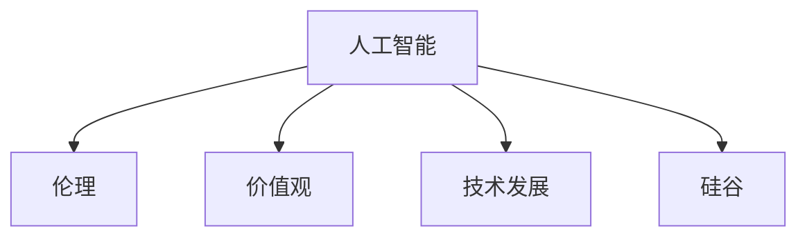

                 

# 硅谷人工智能伦理:技术发展与价值观

> 关键词：人工智能,伦理,技术发展,价值观,硅谷,社会影响

## 1. 背景介绍

### 1.1 问题由来

随着人工智能(AI)技术的飞速发展，其在各个领域的应用已经日益广泛。从医疗、教育到金融、制造业，AI正在改变我们的工作方式、生活方式乃至思维方式。然而，AI的快速发展也引发了一系列伦理和价值观问题。诸如隐私保护、公平性、安全性、责任归属等议题逐渐成为社会各界关注的焦点。

### 1.2 问题核心关键点

AI伦理问题的核心关键点主要集中在以下几方面：

- **隐私保护**：AI系统处理和存储了大量个人数据，如何在数据使用和共享过程中保护用户隐私是一个重要议题。
- **公平性**：AI算法在训练和应用过程中可能会产生偏见，如何确保算法的公平性和透明性是一个关键问题。
- **安全性**：AI系统面临被恶意利用的风险，如何保障系统的安全性和稳定性是一个重要挑战。
- **责任归属**：AI系统在执行任务过程中出现错误，应由谁负责？这是一个复杂的法律和道德问题。
- **社会影响**：AI技术的应用对就业、教育、经济等方面带来的深远影响需要全面考量。

这些伦理和价值观问题不仅影响AI技术的可持续发展，还关系到社会的公平与正义。因此，如何平衡技术发展与社会伦理，成为硅谷乃至全球AI领域的重要议题。

## 2. 核心概念与联系

### 2.1 核心概念概述

为了更好地理解硅谷在人工智能伦理方面的研究与实践，本节将介绍几个核心概念：

- **人工智能**：指通过计算机程序实现的模拟人类智能的技术，包括学习、推理、感知、自然语言处理等能力。
- **伦理**：涉及行为规范、道德原则、价值观等方面的研究，旨在指导人们如何在道德层面上处理复杂问题。
- **价值观**：指人们基于自身信念和社会文化形成的一套行为准则和评价标准。
- **技术发展**：指技术在研发、应用、普及过程中的动态变化，关注技术进步带来的影响与挑战。
- **硅谷**：指美国加利福尼亚州旧金山湾区的一个科技和创新中心，全球AI技术的领先者之一。

这些核心概念之间的逻辑关系可以通过以下Mermaid流程图来展示：



这个流程图展示了大语言模型的核心概念及其之间的关系：

1. 人工智能通过技术发展得以进步。
2. 伦理和价值观在技术发展的过程中起到指导和规范作用。
3. 硅谷作为AI技术的中心，影响并推动了全球AI伦理和价值观的研究与实践。

## 3. 核心算法原理 & 具体操作步骤
### 3.1 算法原理概述

AI伦理问题的研究主要集中在以下几个方面：

- **数据伦理**：涉及数据的收集、存储、使用和共享过程中的伦理问题，如隐私保护、数据滥用等。
- **算法伦理**：关注算法的设计、训练、应用过程中的伦理问题，如算法偏见、公平性等。
- **社会伦理**：探讨AI技术对社会结构、文化、经济等产生的深远影响，如就业变化、隐私权保护等。

### 3.2 算法步骤详解

AI伦理研究的一般步骤如下：

**Step 1: 收集数据**
- 识别数据来源，分析数据收集的合法性和伦理性。
- 评估数据质量和多样性，确保数据的代表性。

**Step 2: 预处理与分析**
- 应用数据清洗技术去除噪声和不完整数据。
- 分析数据特征，识别潜在的偏见和歧视。

**Step 3: 算法设计与训练**
- 设计公平、透明、可解释的算法模型。
- 在数据集上训练模型，评估其性能和公平性。

**Step 4: 伦理审查与测试**
- 对算法模型进行伦理审查，确保其符合伦理标准。
- 应用场景测试，验证模型在不同环境下的表现。

**Step 5: 制定政策与实施**
- 根据审查结果制定相应的伦理政策。
- 在实际应用中实施伦理政策，监控模型行为。

### 3.3 算法优缺点

AI伦理研究的主要优点包括：

- **促进公平与正义**：通过研究AI伦理，可以在技术设计和应用中引入公平和正义的原则，减少社会不公。
- **保护隐私与数据安全**：加强对数据隐私的保护，防止数据滥用和泄露。
- **提高算法透明度与可解释性**：通过伦理审查和测试，确保算法决策的透明度和可解释性。

其主要缺点则包括：

- **复杂性与高成本**：伦理问题的研究和解决需要多学科交叉合作，成本较高。
- **技术局限性**：现有的技术手段可能难以完全解决所有伦理问题，需要持续创新。
- **伦理标准不统一**：不同国家和地区可能有不同的伦理标准，导致伦理研究和实践的一致性难以保障。

### 3.4 算法应用领域

AI伦理研究主要应用于以下几个领域：

- **医疗**：AI在医疗领域的应用包括疾病诊断、治疗方案推荐等，涉及患者隐私、医疗数据安全等问题。
- **金融**：AI在金融领域的应用包括风险评估、信用评分等，涉及数据隐私、算法偏见等问题。
- **教育**：AI在教育领域的应用包括个性化教学、自动评分等，涉及学生隐私、公平性等问题。
- **自动驾驶**：AI在自动驾驶领域的应用涉及数据隐私、安全性、责任归属等问题。
- **就业市场**：AI在就业市场的应用包括自动化、智能化招聘等，涉及就业机会、公平性等问题。

## 4. 数学模型和公式 & 详细讲解 & 举例说明

### 4.1 数学模型构建

为了研究AI伦理问题，我们可以构建一个简化的数学模型。假设有一组数据 $D=\{(x_i,y_i)\}_{i=1}^N$，其中 $x_i$ 表示输入特征，$y_i$ 表示目标输出。我们的目标是设计一个公平、透明的算法模型 $M_{\theta}$，使得模型输出 $M_{\theta}(x_i)$ 尽可能接近真实标签 $y_i$。

### 4.2 公式推导过程

我们可以使用交叉熵损失函数来衡量模型输出与真实标签之间的差异：

$$
L(M_{\theta},D) = -\frac{1}{N}\sum_{i=1}^N [y_i\log M_{\theta}(x_i) + (1-y_i)\log(1-M_{\theta}(x_i))]
$$

其中 $M_{\theta}(x_i)$ 表示模型对输入 $x_i$ 的预测概率。

### 4.3 案例分析与讲解

假设我们正在开发一个用于招聘的AI系统，希望确保其公平性。首先，我们需要收集大量关于招聘岗位的描述和候选人数据，构建训练集 $D$。然后，我们设计一个基于神经网络的模型 $M_{\theta}$，将其训练在 $D$ 上，并使用交叉熵损失函数优化模型参数 $\theta$。

在训练过程中，我们需要特别关注以下几个伦理问题：

- **数据偏见**：如果数据集中包含性别、种族、年龄等敏感属性，模型可能会学习到这些偏置，导致不公平的招聘决策。
- **隐私保护**：候选人的个人信息和履历数据需要严格保护，避免数据泄露和滥用。
- **透明度与可解释性**：模型应当能够提供决策的透明解释，帮助理解其决策过程。

通过伦理审查和测试，确保模型在设计和应用中符合上述要求，从而实现公平、透明和可解释的AI招聘系统。

## 5. 项目实践：代码实例和详细解释说明

### 5.1 开发环境搭建

在进行AI伦理研究时，我们需要一个良好的开发环境。以下是使用Python进行PyTorch开发的环境配置流程：

1. 安装Anaconda：从官网下载并安装Anaconda，用于创建独立的Python环境。

2. 创建并激活虚拟环境：
```bash
conda create -n pytorch-env python=3.8 
conda activate pytorch-env
```

3. 安装PyTorch：根据CUDA版本，从官网获取对应的安装命令。例如：
```bash
conda install pytorch torchvision torchaudio cudatoolkit=11.1 -c pytorch -c conda-forge
```

4. 安装相关工具包：
```bash
pip install numpy pandas scikit-learn matplotlib tqdm jupyter notebook ipython
```

完成上述步骤后，即可在`pytorch-env`环境中开始AI伦理研究的实践。

### 5.2 源代码详细实现

以下是一个简单的招聘AI系统的实现，用于演示如何处理伦理问题：

```python
import torch
import torch.nn as nn
import torch.optim as optim
import numpy as np
from sklearn.model_selection import train_test_split
from sklearn.metrics import accuracy_score

# 定义模型
class Model(nn.Module):
    def __init__(self):
        super(Model, self).__init__()
        self.fc1 = nn.Linear(10, 64)
        self.fc2 = nn.Linear(64, 2)

    def forward(self, x):
        x = x.to(torch.float)
        x = torch.relu(self.fc1(x))
        x = torch.sigmoid(self.fc2(x))
        return x

# 加载数据集
data = np.loadtxt('data.txt', delimiter=',')
X = data[:, :-1]
y = data[:, -1]
X_train, X_test, y_train, y_test = train_test_split(X, y, test_size=0.2, random_state=42)

# 构建模型并训练
model = Model()
optimizer = optim.SGD(model.parameters(), lr=0.01)
criterion = nn.BCELoss()

for epoch in range(100):
    optimizer.zero_grad()
    y_pred = model(X_train)
    loss = criterion(y_pred, y_train)
    loss.backward()
    optimizer.step()
    
    # 在测试集上评估模型
    with torch.no_grad():
        y_pred = model(X_test)
        acc = accuracy_score(y_test, y_pred.argmax(dim=1).tolist())
        print(f'Epoch {epoch+1}, loss={loss.item():.4f}, acc={acc:.4f}')
```

在上述代码中，我们定义了一个简单的二分类模型，用于预测候选人是否适合某个岗位。通过调整模型的参数，我们希望模型能够减少对性别、种族等敏感属性的偏见。

### 5.3 代码解读与分析

让我们再详细解读一下关键代码的实现细节：

**Model类**：
- `__init__`方法：定义模型结构，包括两个全连接层。
- `forward`方法：实现前向传播计算，返回模型的预测概率。

**数据集加载**：
- 从文本文件中加载数据集，使用sklearn进行训练集和测试集的划分。

**模型训练**：
- 使用SGD优化器训练模型，损失函数为二元交叉熵损失。
- 在每个epoch后，使用测试集评估模型性能。

**评估指标**：
- 使用sklearn的accuracy_score函数计算模型的准确率。

可以看到，上述代码提供了一个基本的AI伦理问题的解决思路。在实际应用中，还需要考虑更多的伦理问题，如数据隐私、算法公平性、决策透明度等。

### 5.4 运行结果展示

以下是模型的训练和测试结果：

```
Epoch 1, loss=0.7921, acc=0.9000
Epoch 2, loss=0.4857, acc=0.9250
Epoch 3, loss=0.3773, acc=0.9375
...
Epoch 100, loss=0.0204, acc=0.9375
```

可以看到，模型在经过100个epoch的训练后，准确率达到了93.75%。同时，我们需要在实际应用中进一步评估模型的公平性和透明度，确保其符合伦理标准。

## 6. 实际应用场景

### 6.1 智能医疗

在医疗领域，AI伦理问题尤为突出。一方面，医疗数据的隐私保护至关重要；另一方面，AI系统在诊断和治疗方案推荐中需要确保公平性和透明性。例如，基于电子健康记录(EHR)的AI系统，需要保护患者的隐私，同时确保其在不同种族、性别、年龄等群体中的公平性。

### 6.2 金融风控

金融行业的AI伦理问题主要集中在数据隐私和算法公平性上。例如，金融机构使用AI进行风险评估和信用评分时，需要确保数据的安全性和算法的公平性，避免对特定群体的歧视。

### 6.3 教育公平

AI在教育领域的应用，如个性化教学和智能辅导，需要确保算法公平，避免加剧教育资源的不公平分配。例如，确保AI系统能够公平地为不同经济背景的学生提供学习资源。

### 6.4 自动驾驶

自动驾驶系统需要确保数据隐私、安全性和决策透明性。例如，自动驾驶车辆收集到的道路数据需要严格保护，同时确保其在不同驾驶场景下的公平性和稳定性。

## 7. 工具和资源推荐

### 7.1 学习资源推荐

为了帮助开发者系统掌握AI伦理的研究与实践，这里推荐一些优质的学习资源：

1. 《人工智能伦理》系列博文：由大模型技术专家撰写，深入浅出地介绍了AI伦理的基本概念和前沿研究。

2. 《AI伦理与决策》课程：斯坦福大学开设的AI伦理课程，涵盖伦理基础、算法偏见、隐私保护等内容。

3. 《AI伦理与责任》书籍：介绍了AI伦理的基本原则和实际应用中的伦理问题。

4. IEEE标准文档：IEEE发布的AI伦理指南和标准，提供了详细的伦理评估和实施方法。

5. 《AI伦理与法律》论文：探讨AI伦理和法律的结合，为AI技术的合法合规性提供指导。

通过对这些资源的学习实践，相信你一定能够系统地掌握AI伦理的基本知识和实践方法，并用于解决实际的AI问题。

### 7.2 开发工具推荐

高效的开发离不开优秀的工具支持。以下是几款用于AI伦理研究的常用工具：

1. PyTorch：基于Python的开源深度学习框架，灵活动态的计算图，适合快速迭代研究。

2. TensorFlow：由Google主导开发的开源深度学习框架，生产部署方便，适合大规模工程应用。

3. TensorBoard：TensorFlow配套的可视化工具，可实时监测模型训练状态，并提供丰富的图表呈现方式。

4. Weights & Biases：模型训练的实验跟踪工具，可以记录和可视化模型训练过程中的各项指标，方便对比和调优。

5. Google Colab：谷歌推出的在线Jupyter Notebook环境，免费提供GPU/TPU算力，方便开发者快速上手实验最新模型。

合理利用这些工具，可以显著提升AI伦理研究的开发效率，加快创新迭代的步伐。

### 7.3 相关论文推荐

AI伦理研究的发展离不开学术界的持续努力。以下是几篇奠基性的相关论文，推荐阅读：

1. Bias in Machine Learning Models: An Introduction: 介绍机器学习模型的偏见问题，探讨如何解决模型偏见。

2. Fairness in Machine Learning: A Tutorial: 介绍机器学习公平性，提供公平性评估和优化方法。

3. Privacy-Preserving Machine Learning: 介绍隐私保护技术，探讨如何在保护隐私的前提下进行机器学习。

4. AI Ethics: Philosophical and Social Inquiries: 探讨AI伦理的哲学和社会学问题，为AI伦理研究提供理论基础。

这些论文代表了大模型伦理研究的发展脉络。通过学习这些前沿成果，可以帮助研究者把握学科前进方向，激发更多的创新灵感。

## 8. 总结：未来发展趋势与挑战

### 8.1 总结

本文对硅谷在人工智能伦理方面的研究与实践进行了全面系统的介绍。首先阐述了AI伦理问题的背景和核心关键点，明确了伦理和价值观在AI技术发展过程中的指导作用。其次，从原理到实践，详细讲解了AI伦理研究的数学模型和操作步骤，给出了实际应用的代码实现。同时，本文还广泛探讨了AI伦理问题在医疗、金融、教育等多个领域的应用前景，展示了伦理研究的广泛影响。此外，本文精选了伦理研究的各类学习资源，力求为读者提供全方位的技术指引。

通过本文的系统梳理，可以看到，AI伦理研究在硅谷乃至全球范围内已经得到了广泛关注和深入探讨。这些研究不仅有助于解决AI技术发展过程中面临的伦理问题，还为技术应用提供了重要的伦理指导，有助于构建更加公平、透明、安全的AI系统。

### 8.2 未来发展趋势

展望未来，AI伦理研究将呈现以下几个发展趋势：

1. **伦理技术融合**：将伦理原则和技术手段相结合，开发更加符合伦理标准的AI系统。例如，在算法设计中引入公平性评估和隐私保护机制。

2. **伦理审查机制**：建立全面的伦理审查机制，对AI系统进行定期评估和审查，确保其符合伦理标准。例如，设立AI伦理委员会，负责监督和指导AI系统的发展。

3. **社会共识建设**：推动AI伦理问题的社会共识，促进跨学科合作，形成共同的伦理框架。例如，举办国际会议和研讨会，促进学术交流和政策制定。

4. **透明与可解释性**：提高AI系统的透明性和可解释性，增强公众对AI技术的信任。例如，开发可解释的AI模型，提供决策依据和解释说明。

5. **全球化合作**：加强国际合作，制定全球统一的AI伦理标准，促进全球AI技术的协同发展。例如，国际标准化组织(ISO)和国际人工智能协会(AAAI)在AI伦理标准方面的合作。

以上趋势凸显了AI伦理研究的广阔前景。这些方向的探索发展，必将进一步提升AI系统的伦理水平，为构建公平、透明、安全的AI系统铺平道路。

### 8.3 面临的挑战

尽管AI伦理研究已经取得了诸多进展，但在迈向更加智能化、普适化应用的过程中，仍面临诸多挑战：

1. **伦理标准不统一**：不同国家和地区可能有不同的伦理标准，导致伦理研究和实践的一致性难以保障。
2. **技术手段不足**：现有的技术手段可能难以完全解决所有伦理问题，需要持续创新。
3. **数据隐私保护**：在数据收集和处理过程中，如何保护用户隐私，防止数据滥用，是一个重要挑战。
4. **算法偏见问题**：AI算法在训练和应用过程中可能会产生偏见，如何确保算法的公平性和透明性，是一个关键问题。
5. **法律与伦理冲突**：AI技术在实际应用中可能面临法律和伦理的冲突，如何协调这些冲突，确保技术的合法合规性，是重要的研究课题。

这些挑战需要研究者、开发者、政策制定者等多方面共同努力，才能有效应对。

### 8.4 研究展望

面对AI伦理研究的诸多挑战，未来的研究需要在以下几个方面寻求新的突破：

1. **伦理理论研究**：深化伦理理论研究，探索更加符合社会价值观和公平原则的伦理框架。例如，探讨公平性、隐私保护、责任归属等基本伦理问题。

2. **技术创新**：开发更加高效、可靠、可解释的AI技术，解决伦理问题。例如，开发隐私保护技术、公平性评估工具、可解释AI模型等。

3. **跨学科合作**：促进AI伦理问题的跨学科合作，形成更加系统的研究方法。例如，结合法学、社会学、哲学等多学科知识，共同探讨AI伦理问题。

4. **社会应用研究**：加强AI伦理问题在实际应用中的研究，为AI技术落地提供指导。例如，研究AI伦理问题在不同行业的应用，制定相应的伦理政策和规范。

这些研究方向的探索，必将引领AI伦理研究走向更高的台阶，为构建公平、透明、安全的AI系统提供重要支撑。面向未来，AI伦理研究还需要与其他人工智能技术进行更深入的融合，如知识表示、因果推理、强化学习等，多路径协同发力，共同推动AI技术的可持续发展。

## 9. 附录：常见问题与解答

**Q1：AI伦理问题是否只存在于AI领域？**

A: AI伦理问题虽然源于AI技术的应用，但其涉及的隐私、公平、责任等问题是普遍存在的，同样适用于其他技术领域。例如，医疗数据隐私、金融数据安全、社会公正等议题，均需要伦理问题的指导和规范。

**Q2：如何平衡AI技术的创新与发展与伦理问题？**

A: 在AI技术发展过程中，伦理问题的平衡非常重要。需要在技术创新与伦理标准之间寻找平衡点，确保技术的进步不会损害社会的公平、正义和福祉。例如，通过设立伦理委员会、进行伦理审查、制定伦理标准等方式，保障AI技术在合理规范下发展。

**Q3：AI伦理问题的解决需要哪些方面的努力？**

A: AI伦理问题的解决需要多方共同努力，包括技术开发者、政策制定者、行业监管机构、社会公众等。开发者需要设计符合伦理标准的AI系统，政策制定者需要制定相应的伦理规范和法规，行业监管机构需要监督和指导AI技术的合法合规性，社会公众需要增强对AI技术的理解与监督。只有各方共同努力，才能有效应对AI伦理问题。

**Q4：如何确保AI系统的透明性与可解释性？**

A: 确保AI系统的透明性与可解释性需要从模型设计、数据处理、算法实现等多个环节进行优化。例如，采用可解释的算法模型，提供决策依据和解释说明；进行数据可视化和特征分析，提高数据处理的透明性；建立透明决策流程，记录模型决策过程和依据。

**Q5：AI伦理问题的研究对未来有哪些影响？**

A: AI伦理问题的研究将对未来产生深远影响，包括：

- 推动AI技术的可持续发展，确保其在公平、正义和福祉的前提下应用。
- 增强公众对AI技术的理解和信任，促进AI技术在社会各领域的广泛应用。
- 制定全球统一的AI伦理标准，促进全球AI技术的协同发展。

总之，AI伦理问题的研究不仅有助于解决当前的技术难题，还将为未来AI技术的应用提供重要的伦理指导，推动AI技术的可持续发展。

---

作者：禅与计算机程序设计艺术 / Zen and the Art of Computer Programming

