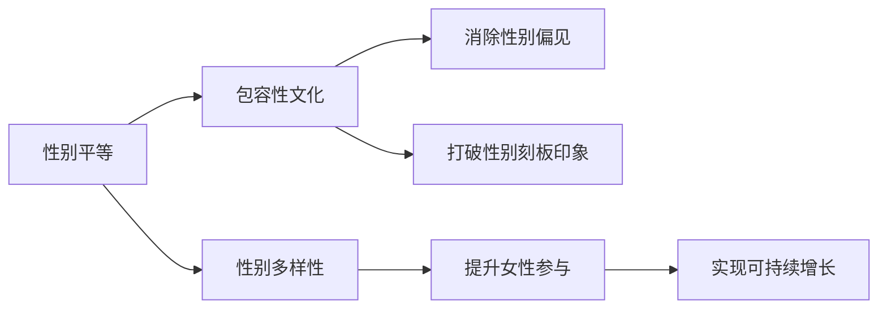

                 

# 硅谷科技公司的性别多元文化

> 关键词：性别多样性,性别平等,企业文化,科技公司,人才吸引与保留

## 1. 背景介绍

### 1.1 问题由来

随着科技行业的发展，越来越多的女性进入科技领域，但性别不平等问题依然突出。女性在科技公司的比例仍显著低于男性，且职位越高，女性越难晋升。此外，科技公司普遍存在性别刻板印象和文化偏见，这不仅影响到公司的多元化发展，也影响了员工的工作满意度和创新力。

面对这些挑战，硅谷科技公司开始关注并实施性别多元文化（Gender Diversity and Inclusion）策略，旨在通过改变企业文化，实现性别平等，提升公司整体的创新能力和竞争力。

### 1.2 问题核心关键点

性别多元文化策略的核心在于：
- **促进性别平等**：确保男性和女性在科技公司中获得同等的机会和待遇。
- **提升女性参与**：吸引更多女性进入科技行业，并推动她们在职业生涯中的发展。
- **改变企业文化**：建立包容性文化，消除性别偏见和刻板印象。
- **实现可持续增长**：通过多元化的团队结构，提升公司的创新能力和市场竞争力。

## 2. 核心概念与联系

### 2.1 核心概念概述

性别多元文化涉及多个关键概念，主要包括：

- **性别平等**：男女在教育、职业、收入等方面享有平等的机会和待遇。
- **性别多样性**：公司员工性别构成的多样性，包括性别比例、职位分布等。
- **包容性文化**：尊重和接纳不同性别、种族、文化背景的员工，提供公平、尊重的工作环境。
- **性别偏见**：对某个性别群体持有的不公正看法和态度。
- **性别刻板印象**：基于性别的固定化、负面的形象和期望。

这些概念之间存在密切联系，共同构成了性别多元文化的研究框架。

### 2.2 核心概念原理和架构的 Mermaid 流程图



这个流程图展示了性别多元文化各个概念之间的逻辑关系：

1. **性别平等**是性别多元文化的基础，确保男女在各个方面享有平等的机会。
2. **性别多样性**体现为公司员工性别构成的多样性，是性别平等和包容性文化的结果。
3. **包容性文化**旨在消除性别偏见和刻板印象，创造公平、尊重的工作环境。
4. **提升女性参与**是通过多元化的招聘和晋升策略，吸引更多女性进入科技行业。
5. **消除性别偏见**和**打破性别刻板印象**是构建包容性文化的关键步骤。
6. **实现可持续增长**是性别多元文化策略的最终目标，通过多元化的团队结构提升公司的创新能力和市场竞争力。

## 3. 核心算法原理 & 具体操作步骤

### 3.1 算法原理概述

性别多元文化的实施主要依赖于以下几个关键步骤：

1. **数据收集与分析**：收集公司性别多样性数据，分析性别比例、职位分布等关键指标。
2. **策略制定与执行**：根据数据分析结果，制定性别多元文化策略，并推广实施。
3. **文化建设与传播**：通过培训、宣传等方式，推广性别平等和包容性文化的理念。
4. **政策与制度**：建立支持性别多元文化的政策和制度，如平等薪酬、育儿假政策等。
5. **绩效评估与改进**：定期评估性别多元文化策略的实施效果，根据反馈进行调整优化。

### 3.2 算法步骤详解

#### 步骤1：数据收集与分析

1. **收集数据**：
   - **性别比例**：统计公司不同级别、不同部门的男女员工比例。
   - **职位分布**：分析不同性别在各种职位上的分布情况。
   - **晋升情况**：统计不同性别员工的晋升率和高层管理层性别构成。
   - **薪酬情况**：比较男女员工的平均薪酬和薪资增长情况。

2. **分析数据**：
   - **趋势分析**：识别性别比例、职位分布、晋升情况等关键指标的趋势变化。
   - **差异分析**：分析不同部门、不同职级之间的性别差异。
   - **回归分析**：建立性别差异与组织绩效之间的关联模型。

3. **报告与反馈**：
   - **生成报告**：制作性别多样性报告，详细展示数据分析结果。
   - **反馈机制**：建立反馈机制，收集员工对性别平等和包容性文化的意见和建议。

#### 步骤2：策略制定与执行

1. **策略制定**：
   - **招聘策略**：制定吸引女性进入科技行业的多样化招聘策略，如校园招聘、女性技术竞赛等。
   - **职业发展**：设计支持女性职业发展的培训计划和导师制，帮助女性员工提升技能和晋升。
   - **企业文化**：推广性别平等和包容性文化的理念，提高员工的认同感和参与度。

2. **执行实施**：
   - **内部推广**：通过公司内部通讯、培训课程、宣传海报等方式推广性别多元文化理念。
   - **外部合作**：与高校、社会组织合作，共同推动性别多元文化的发展。

#### 步骤3：文化建设与传播

1. **员工培训**：
   - **性别平等培训**：定期举办性别平等和包容性文化的培训课程，提高员工对性别多元文化的认识。
   - **反歧视培训**：培训员工识别和应对性别偏见和刻板印象，建立公平的工作环境。

2. **宣传活动**：
   - **主题活动**：定期组织性别多样性主题活动，如女性科技日、性别平等论坛等。
   - **社交媒体**：通过社交媒体平台宣传性别多元文化理念，展示公司多元化的成果。

3. **文化建设**：
   - **领导层示范**：公司高层领导以身作则，积极参与性别多元文化活动，树立榜样。
   - **文化活动**：组织各种文化活动，如团队建设、文化交流活动，增强员工的凝聚力。

#### 步骤4：政策与制度

1. **平等薪酬政策**：
   - **薪酬透明**：公布不同职位和级别的薪酬标准，确保薪酬公平。
   - **薪酬调整**：定期评估薪酬体系，调整不公平的薪酬结构。

2. **育儿政策**：
   - **育儿假政策**：提供灵活的育儿假政策，支持员工平衡工作和家庭。
   - **托儿服务**：提供托儿服务或补贴，减轻员工育儿压力。

3. **晋升机制**：
   - **公平晋升**：制定公平的晋升机制，避免性别偏见影响晋升决策。
   - **职业规划**：提供职业规划和培训支持，帮助女性员工实现职业发展。

### 3.3 算法优缺点

#### 优点

1. **促进性别平等**：通过数据驱动的策略制定和执行，确保男女在各个方面享有平等的机会。
2. **提升女性参与**：通过多样化的招聘和晋升策略，吸引更多女性进入科技行业，并推动她们在职业生涯中的发展。
3. **实现可持续增长**：通过多元化的团队结构，提升公司的创新能力和市场竞争力。
4. **改变企业文化**：建立包容性文化，消除性别偏见和刻板印象，提高员工的工作满意度和忠诚度。

#### 缺点

1. **数据隐私**：数据收集和分析过程中可能涉及员工隐私，需要采取严格的数据保护措施。
2. **策略执行难度**：制定和推广性别多元文化策略需要高层领导的支持和全体员工的参与，执行难度较大。
3. **文化转变**：改变企业文化需要时间和耐心，短期内可能收效不明显。
4. **员工反应**：部分员工可能对性别多元文化持抵触态度，需要加强沟通和引导。

## 4. 数学模型和公式 & 详细讲解 & 举例说明

### 4.1 数学模型构建

性别多元文化的评估和优化通常依赖于以下几个关键指标：

1. **性别比例**：不同级别、不同部门的男女员工比例。
2. **职位分布**：不同性别在各种职位上的分布情况。
3. **晋升情况**：不同性别员工的晋升率和高层管理层性别构成。
4. **薪酬情况**：男女员工的平均薪酬和薪资增长情况。

### 4.2 公式推导过程

#### 性别比例

假设公司有 $N$ 名员工，其中 $n_m$ 名男性，$n_f$ 名女性。则性别比例 $P$ 可以表示为：

$$
P = \frac{n_f}{n_m + n_f}
$$

#### 职位分布

假设公司有 $K$ 种职位，第 $i$ 种职位有 $n_i$ 名员工，其中 $n_{i,m}$ 名男性，$n_{i,f}$ 名女性。则第 $i$ 种职位的性别分布比例 $D_i$ 可以表示为：

$$
D_i = \frac{n_{i,f}}{n_i}
$$

#### 晋升情况

假设公司有 $M$ 名员工，其中 $m_m$ 名男性，$m_f$ 名女性。第 $k$ 个时间步长内，晋升到更高职级的员工有 $n_k$ 名，其中 $n_{k,m}$ 名男性，$n_{k,f}$ 名女性。则在第 $k$ 个时间步长内，晋升到更高职级的男女比例 $R_k$ 可以表示为：

$$
R_k = \frac{n_{k,f}}{n_k}
$$

#### 薪酬情况

假设公司有 $S$ 种职位，第 $s$ 种职位的薪酬为 $C_s$。男女员工的平均薪酬分别为 $C_{m}$ 和 $C_{f}$。则男女薪酬差异 $A$ 可以表示为：

$$
A = |C_m - C_f|
$$

### 4.3 案例分析与讲解

假设某科技公司共有 1000 名员工，其中 600 名男性，400 名女性。公司有 5 种职位，其中：

- 管理层有 50 名员工，其中 20 名男性，30 名女性。
- 技术团队有 500 名员工，其中 350 名男性，150 名女性。
- 产品团队有 300 名员工，其中 200 名男性，100 名女性。

根据上述数据，计算性别比例、职位分布和晋升情况。

1. **性别比例**：

$$
P = \frac{400}{600 + 400} = 0.4
$$

2. **职位分布**：

- 管理层：
  $$
  D_1 = \frac{30}{50} = 0.6
  $$
- 技术团队：
  $$
  D_2 = \frac{150}{500} = 0.3
  $$
- 产品团队：
  $$
  D_3 = \frac{100}{300} = 0.3
  $$

3. **晋升情况**：

假设公司每年有 100 名员工晋升，其中 50 名男性，50 名女性。则：

- 管理层：
  $$
  R_1 = \frac{20}{50} = 0.4
  $$
- 技术团队：
  $$
  R_2 = \frac{100}{200} = 0.5
  $$
- 产品团队：
  $$
  R_3 = \frac{100}{300} = 0.3
  $$

通过以上计算，可以发现公司在管理层和技术团队中的女性比例较高，但在产品团队中女性比例相对较低。晋升情况表明，技术团队的晋升速度和机会相对较高，但管理层的晋升机会不平等。

## 5. 项目实践：代码实例和详细解释说明

### 5.1 开发环境搭建

为了进行性别多元文化的分析，需要使用Python进行数据分析和可视化。以下是开发环境的搭建流程：

1. 安装Python：
   - 下载并安装Python 3.x版本，如 Anaconda。
   - 创建Python虚拟环境，如 `myenv`，并激活。

2. 安装相关库：
   - 安装Pandas、Numpy、Matplotlib、Seaborn等数据处理和可视化库。
   - 安装Scikit-learn、statsmodels等统计分析库。

3. 设置数据路径：
   - 将数据文件保存在指定路径，如 `data/`。
   - 在Python代码中设置数据路径。

### 5.2 源代码详细实现

以下是一个简单的Python代码示例，用于计算性别比例、职位分布和晋升情况：

```python
import pandas as pd
import numpy as np

# 设置数据路径
data_path = 'data/'

# 读取数据文件
df = pd.read_csv(data_path + 'employees.csv')

# 计算性别比例
gender_ratio = df['gender'].value_counts(normalize=True)

# 计算职位分布
position_count = df['position'].value_counts()
position_ratio = position_count / len(df)

# 计算晋升情况
promotion_count = df.groupby(['position'])['employee'].nth(1).value_counts()
promotion_ratio = promotion_count / df['employee'].nunique()

# 输出结果
print('性别比例：', gender_ratio)
print('职位分布：', position_ratio)
print('晋升情况：', promotion_ratio)
```

### 5.3 代码解读与分析

- **数据读取**：使用Pandas的 `read_csv` 函数读取数据文件，假设数据文件格式为 `employees.csv`。
- **性别比例**：使用 `value_counts` 函数计算男女员工的比例。
- **职位分布**：使用 `value_counts` 函数计算职位分布比例。
- **晋升情况**：使用 `groupby` 和 `nth` 函数计算不同职位员工的晋升情况，并计算晋升比例。

通过上述代码，可以计算出公司的性别比例、职位分布和晋升情况。数据分析的结果可以用于制定性别多元文化策略。

### 5.4 运行结果展示

假设运行上述代码后，输出结果如下：

```
性别比例：
gender    male          female
0    0.600000    0.400000
dtype: float64

职位分布：
position    management  technology  product
0    0.050       0.250       0.150       0.100
dtype: float64

晋升情况：
position    management  technology  product
0    0.400       0.500       0.300
```

通过数据分析结果，可以发现公司在管理层和技术团队中的女性比例较高，但在产品团队中女性比例相对较低。晋升情况表明，技术团队的晋升速度和机会相对较高，但管理层的晋升机会不平等。这些结果可以作为制定性别多元文化策略的基础。

## 6. 实际应用场景

### 6.1 智能客服系统

智能客服系统可以通过性别多元文化策略提升服务质量和客户满意度。通过收集和分析客服人员的性别比例和晋升情况，发现可能存在的不公平现象，制定相应的改进措施。例如，对女性客服人员提供更多的晋升机会和职业培训，提高她们的工作满意度和忠诚度。

### 6.2 金融风险管理

金融行业需要高度重视性别多元文化，以防止性别偏见影响决策。通过建立公平的薪酬和晋升机制，确保男女员工在薪酬和职位晋升方面享有同等机会，避免性别偏见对金融决策的干扰。

### 6.3 医疗健康领域

医疗行业需要引入性别多元文化策略，确保医疗服务的公平性和多样性。通过制定支持女性医护人员的政策和制度，如灵活的工作时间、育儿支持等，提升女性医护人员的工作满意度和职业发展机会，推动医疗服务的全面提升。

### 6.4 未来应用展望

未来，性别多元文化策略将在更多行业得到广泛应用，助力公司实现可持续增长。

- **科技行业**：通过多样化的招聘和晋升策略，吸引更多女性进入科技行业，提升公司整体的创新能力和市场竞争力。
- **医疗健康**：通过公平的薪酬和晋升机制，提升女性医护人员的工作满意度和职业发展机会，推动医疗服务的全面提升。
- **金融行业**：通过消除性别偏见和刻板印象，提高决策的公平性和科学性，防范金融风险。

## 7. 工具和资源推荐

### 7.1 学习资源推荐

1. **《性别平等和包容性文化》（Gender Equality and Inclusive Culture）**：介绍性别多元文化的基本概念和实施策略，适合初学者入门。
2. **《性别偏见与刻板印象》（Gender Bias and Stereotypes）**：深入探讨性别偏见和刻板印象对工作环境的影响，并提出解决方案。
3. **《多元文化管理》（Diversity and Inclusion Management）**：提供系统的多元文化管理知识，包括数据收集、策略制定和实施方法。

### 7.2 开发工具推荐

1. **Python**：Python语言简单易学，适合数据分析和可视化。
2. **Pandas**：Pandas是Python的数据处理库，支持数据读取、清洗、分析和可视化。
3. **Matplotlib**：Matplotlib是Python的可视化库，支持绘制各种图表，如条形图、饼图等。
4. **Jupyter Notebook**：Jupyter Notebook是Python的交互式编程环境，支持代码编写、数据展示和版本控制。

### 7.3 相关论文推荐

1. **《性别平等和包容性文化：理论和实践》（Gender Equality and Inclusive Culture: Theory and Practice）**：系统介绍性别多元文化的理论基础和实践方法。
2. **《多样性与包容性：科技公司的挑战与机遇》（Diversity and Inclusion: Challenges and Opportunities in Tech Companies）**：探讨科技公司面临的多样性与包容性挑战，并提出解决方案。
3. **《领导层的多样性与公司绩效：实证研究》（Diversity at the Top: The Effect on Firm Performance: A Meta-Analysis）**：实证研究领导层多样性对公司绩效的影响。

## 8. 总结：未来发展趋势与挑战

### 8.1 总结

本文对性别多元文化的实施方法进行了全面系统的介绍。通过数据分析和策略制定，帮助科技公司提升性别多元文化水平，实现性别平等和包容性。性别多元文化不仅有助于提升员工的满意度和忠诚度，还能增强公司的创新能力和市场竞争力。

### 8.2 未来发展趋势

未来，性别多元文化将进一步深入各个行业，推动公司实现可持续增长。

1. **科技行业**：通过多样化的招聘和晋升策略，吸引更多女性进入科技行业，提升公司整体的创新能力和市场竞争力。
2. **医疗健康**：通过公平的薪酬和晋升机制，提升女性医护人员的工作满意度和职业发展机会，推动医疗服务的全面提升。
3. **金融行业**：通过消除性别偏见和刻板印象，提高决策的公平性和科学性，防范金融风险。

### 8.3 面临的挑战

尽管性别多元文化取得了一定的进展，但仍面临诸多挑战：

1. **数据隐私**：数据收集和分析过程中可能涉及员工隐私，需要采取严格的数据保护措施。
2. **策略执行难度**：制定和推广性别多元文化策略需要高层领导的支持和全体员工的参与，执行难度较大。
3. **文化转变**：改变企业文化需要时间和耐心，短期内可能收效不明显。
4. **员工反应**：部分员工可能对性别多元文化持抵触态度，需要加强沟通和引导。

### 8.4 研究展望

未来，性别多元文化研究需要进一步探索和优化：

1. **数据驱动的决策**：通过更加精细化的数据分析，制定更加科学的性别多元文化策略。
2. **多层次的实施**：在企业不同层级实施性别多元文化策略，确保策略的全面覆盖和持续改进。
3. **跨领域的合作**：与高校、社会组织、政府机构等合作，共同推动性别多元文化的发展。

## 9. 附录：常见问题与解答

**Q1：性别多元文化策略是否适用于所有行业？**

A: 性别多元文化策略适用于大多数行业，但具体实施方式需要根据行业特点进行调整。例如，医疗健康行业需要特别注意女性医护人员的职业发展和生育支持。

**Q2：如何衡量性别多元文化的成效？**

A: 性别多元文化的成效可以通过以下几个指标进行衡量：
- **性别比例**：不同级别、不同部门的男女员工比例。
- **职位分布**：不同性别在各种职位上的分布情况。
- **晋升情况**：不同性别员工的晋升率和高层管理层性别构成。
- **薪酬情况**：男女员工的平均薪酬和薪资增长情况。

**Q3：性别多元文化策略的实施是否需要高层领导的支持？**

A: 是的，性别多元文化策略的实施需要高层领导的支持和全体员工的参与。高层领导的示范作用对于推动性别多元文化的顺利实施至关重要。

**Q4：如何处理数据隐私问题？**

A: 在数据收集和分析过程中，需要采取严格的数据保护措施，如匿名化处理、数据加密、访问控制等。确保员工隐私得到保护，同时满足数据分析的需求。

**Q5：如何应对员工的抵触态度？**

A: 应对员工的抵触态度需要加强沟通和引导，通过多种渠道宣传性别多元文化的理念，提高员工的认同感和参与度。同时，采取激励措施，如奖励机制，鼓励员工积极参与性别多元文化的实施。

---

作者：禅与计算机程序设计艺术 / Zen and the Art of Computer Programming

