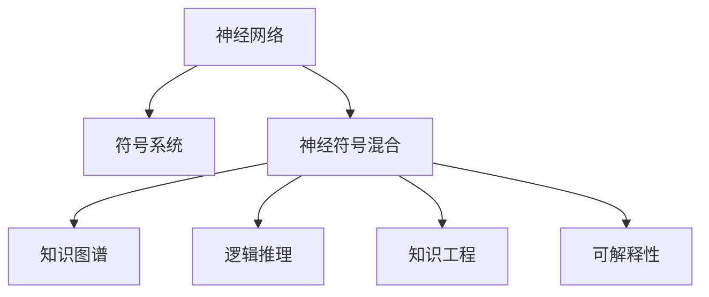

                 

# 神经符号人工智能：最佳方案

> 关键词：神经符号混合、符号人工智能、深度学习、知识图谱、逻辑推理、知识工程

## 1. 背景介绍

### 1.1 问题由来
在过去十年中，深度学习在计算机视觉、自然语言处理、语音识别等诸多领域取得了显著的进展，但这些基于数据驱动的模型存在诸多局限：如数据依赖性较强、泛化能力较弱、缺乏符号层面的理解等。与此同时，符号人工智能(Symbolic AI)则以规则驱动、知识为本、逻辑推理为特点，虽然方法论简单，但面临着表达能力不足、计算效率低下等问题。

为了弥合神经网络和符号智能的差距，神经符号人工智能(Neuro-Symbolic AI)应运而生。这种融合神经网络和符号智能的方法，将神经网络强大的数据处理能力和符号系统的逻辑推理能力结合起来，通过语义表示和知识图谱等工具，使得人工智能不仅能处理海量的数据，还能理解和推理复杂知识，从而在多模态场景中大放异彩。

### 1.2 问题核心关键点
神经符号人工智能的核心思想在于：

- 神经网络掌握海量数据处理能力，擅长模式识别和统计学习。
- 符号系统具备明确的逻辑推理能力，擅长知识表达和决策推导。
- 将二者结合，形成一个以神经网络为核心的符号推理框架，实现符号智能和神经智能的互补，达到最佳的解决方案。

这种思路得到了学界和工业界的广泛认同，并催生了众多基于神经符号智能的应用项目。从知识图谱构建到自然语言推理，从专家系统到智能助手，神经符号人工智能在多个领域展现出了强大的生命力。

## 2. 核心概念与联系

### 2.1 核心概念概述

为更好地理解神经符号人工智能，本节将介绍几个核心概念及其之间的关系：

- 神经网络：基于多层神经元结构，通过梯度下降等算法进行训练，擅长处理大规模、复杂的数据集。
- 符号系统：基于形式逻辑或语义网，通过推理规则、知识图谱等工具进行知识表示和推理。
- 神经符号混合(Neuro-Symbolic Hybrid)：将神经网络和符号系统有机结合，实现数据驱动和知识驱动的深度融合。
- 知识图谱(Knowledge Graph)：以图结构存储知识，用于知识查询、推理和扩展。
- 逻辑推理：基于形式逻辑，对知识图谱中的关系和事实进行推理，得出合理的结论。
- 知识工程(Knowledge Engineering)：将领域知识转化为可计算的形式，支持机器学习和人工智能的决策。
- 可解释性(Explainability)：解释人工智能的内部工作机制和决策逻辑，保证模型的透明性和可靠性。

这些概念之间的逻辑关系可以通过以下Mermaid流程图来展示：



这个流程图展示了大语言模型的核心概念及其之间的关系：

1. 神经网络通过数据驱动进行模型训练，学习数据特征。
2. 符号系统通过逻辑推理进行知识表示和推导，形成精确的知识图谱。
3. 神经符号混合将数据驱动和知识驱动结合，实现深度学习与符号推理的双向交互。
4. 知识图谱为符号系统提供事实和关系，支持推理过程。
5. 逻辑推理在知识图谱中根据规则进行推导，输出结果。
6. 知识工程将领域知识转化成可计算形式，引导神经网络学习。
7. 可解释性使得模型的决策过程透明化，便于理解和调试。

这些概念共同构成了神经符号人工智能的学习框架，使其在复杂多模态场景中具有广泛的应用潜力。通过理解这些核心概念，我们可以更好地把握神经符号人工智能的工作原理和优化方向。

## 3. 核心算法原理 & 具体操作步骤
### 3.1 算法原理概述

神经符号人工智能的算法原理主要基于神经网络和符号系统的协同运作，通过数据驱动和知识驱动的双向交互，实现复杂任务的多模态理解和处理。

形式化地，假设神经网络为 $M_{\theta}$，其中 $\theta$ 为模型参数，符号系统为 $S_{\pi}$，其中 $\pi$ 为规则集合。定义一个任务 $T$，其输入为 $x$，输出为 $y$。神经符号混合系统 $N_{\phi}$ 将输入 $x$ 通过神经网络 $M_{\theta}$ 映射到中间语义表示 $\mathbf{z}$，再由符号系统 $S_{\pi}$ 根据推理规则进行推导，最终输出 $y$。数学上，可以表示为：

$$
y = S_{\pi}(\mathbf{z}) = S_{\pi}(M_{\theta}(x))
$$

其中 $\phi$ 为参数，用于调整神经网络和符号系统的协同运作。

### 3.2 算法步骤详解

神经符号人工智能的实现通常包括以下几个关键步骤：

**Step 1: 构建知识图谱**
- 收集领域知识，形成符号系统的逻辑规则和事实，构建知识图谱。
- 定义节点和关系，通过RDF等语义网技术进行知识表示。

**Step 2: 设计推理规则**
- 根据知识图谱，设计符号系统所需的事实和推理规则。
- 可以基于一阶逻辑、描述逻辑等形式逻辑进行推理。

**Step 3: 融合神经网络和符号系统**
- 将神经网络的输出作为符号系统的输入，进行符号推理。
- 定义符号系统的输出，映射到最终任务结果。
- 调整 $\phi$ 参数，优化神经网络与符号系统的协同运作。

**Step 4: 训练神经网络和符号系统**
- 分别使用神经网络和符号系统的训练数据，进行独立训练。
- 结合优化算法，更新 $\theta$ 和 $\pi$。

**Step 5: 微调和评估**
- 在特定任务上，使用少量标注数据进行微调。
- 评估模型的推理能力和输出精度，进行调整和优化。

### 3.3 算法优缺点

神经符号人工智能具有以下优点：

1. 综合利用数据和知识，提高模型的推理能力和泛化能力。
2. 提升符号系统的计算效率，支持复杂知识表示和推理。
3. 增强模型的可解释性，便于理解和调试。
4. 能够实现多模态场景的融合，处理跨领域的复杂任务。

同时，该方法也存在一些局限性：

1. 构建知识图谱和设计推理规则的复杂度较高，需要领域专家参与。
2. 神经网络与符号系统的协同运作需要大量实验和调参，才能达到最佳效果。
3. 训练和推理过程中的计算量较大，对硬件资源要求较高。
4. 模型需要频繁地进行微调和调整，增加了维护和优化的难度。

尽管存在这些局限性，神经符号人工智能依然被视为深度学习与符号智能结合的最佳解决方案，具有广阔的应用前景。

### 3.4 算法应用领域

神经符号人工智能在多个领域展示了强大的应用潜力，包括：

- 知识图谱构建：通过神经符号混合系统，将海量文本数据进行结构化处理，形成知识图谱。
- 自然语言推理(NLI)：利用神经网络提取文本特征，通过符号系统进行逻辑推理，判断文本间的蕴含、矛盾关系。
- 问答系统：结合知识图谱和逻辑推理，使智能助手能够回答各种复杂的自然语言问题。
- 智能推荐系统：通过知识图谱和用户画像，进行推理和匹配，提升推荐精度。
- 医疗诊断：结合领域知识图谱和病历数据，进行逻辑推理和病情推断。
- 金融风控：利用知识图谱进行风险评估和预测，提高金融决策的准确性。
- 智能游戏：通过知识图谱和规则推理，实现智能体的多智能体决策。

除了上述这些应用，神经符号人工智能还在教育、法律、物流等多个领域展现出其强大的生命力。

## 4. 数学模型和公式 & 详细讲解 & 举例说明

### 4.1 数学模型构建

为了更严格地刻画神经符号混合系统的推理过程，我们需要引入数学模型：

假设输入数据 $x$ 为自然语言文本，其编码后的特征向量为 $\mathbf{x}$。通过神经网络 $M_{\theta}$ 提取语义特征，得到中间表示 $\mathbf{z}$。定义符号系统 $S_{\pi}$ 的推理过程如下：

1. 在知识图谱中查找与 $\mathbf{z}$ 相关的节点 $n$，得到 $n$ 的属性和关系 $r$。
2. 根据逻辑规则，计算推理结果 $\mathbf{r}$。
3. 将 $\mathbf{r}$ 映射到最终输出 $y$。

数学上，可以表示为：

$$
\mathbf{z} = M_{\theta}(x)
$$

$$
\mathbf{r} = S_{\pi}(n)
$$

$$
y = f(\mathbf{r})
$$

其中 $f$ 为输出映射函数。

### 4.2 公式推导过程

以自然语言推理(NLI)任务为例，具体推导神经符号混合系统的推理过程。

假设输入句子为 $s_1$ 和 $s_2$，输出为两者之间的关系 $r \in \{\text{entailment}, \text{contradiction}, \text{neutral}\}$。

- 将 $s_1$ 和 $s_2$ 输入神经网络，得到语义表示 $\mathbf{z_1}, \mathbf{z_2}$。
- 在知识图谱中查找与 $\mathbf{z_1}, \mathbf{z_2}$ 相关的节点，得到节点集合 $N$。
- 根据逻辑推理规则，计算推理结果 $r$。
- 将 $r$ 映射到最终输出 $y$。

推理过程可以表示为：

$$
\mathbf{z_1}, \mathbf{z_2} = M_{\theta}(s_1), M_{\theta}(s_2)
$$

$$
N = S_{\pi}(\mathbf{z_1}, \mathbf{z_2})
$$

$$
r = S_{\pi}(N)
$$

$$
y = f(r)
$$

逻辑推理规则可以基于形式逻辑、描述逻辑等，进行推理计算。

### 4.3 案例分析与讲解

以医疗诊断为例，说明神经符号人工智能的具体实现步骤。

- 收集医学领域的相关知识，构建领域知识图谱。
- 根据医疗知识图谱，设计逻辑推理规则，用于症状推断、疾病诊断等任务。
- 使用医疗知识图谱和病历数据，训练神经网络和符号系统。
- 在医生输入患者症状后，通过神经网络提取特征，符号系统进行逻辑推理，得出诊断结果。

例如，假设患者有如下症状：

- 胸痛
- 气促
- 夜间盗汗

神经网络提取这些症状的语义特征，得到中间表示 $\mathbf{z}$。在医疗知识图谱中查找与 $\mathbf{z}$ 相关的节点，得到节点集合 $N$。符号系统根据推理规则，计算出推理结果 $r$。最终通过映射函数 $f$，得出诊断结果 $y$。

## 5. 项目实践：代码实例和详细解释说明
### 5.1 开发环境搭建

在进行神经符号混合系统的开发前，我们需要准备好开发环境。以下是使用Python进行PyTorch和Pajek开发的配置流程：

1. 安装Anaconda：从官网下载并安装Anaconda，用于创建独立的Python环境。

2. 创建并激活虚拟环境：
```bash
conda create -n neuro-symbolic-env python=3.8 
conda activate neuro-symbolic-env
```

3. 安装PyTorch：根据CUDA版本，从官网获取对应的安装命令。例如：
```bash
conda install pytorch torchvision torchaudio cudatoolkit=11.1 -c pytorch -c conda-forge
```

4. 安装Pajek：
```bash
conda install pajek
```

5. 安装各类工具包：
```bash
pip install numpy pandas scikit-learn matplotlib tqdm jupyter notebook ipython
```

完成上述步骤后，即可在`neuro-symbolic-env`环境中开始神经符号混合系统的开发。

### 5.2 源代码详细实现

下面我们以自然语言推理(NLI)任务为例，给出使用PyTorch和Pajek对BERT模型进行微调的PyTorch代码实现。

首先，定义NLI任务的数学模型：

```python
import torch
import torch.nn as nn
import torch.optim as optim
import torch.nn.functional as F

class NLIModel(nn.Module):
    def __init__(self, embed_dim, hidden_dim):
        super(NLIModel, self).__init__()
        self.encoder = nn.TransformerEncoderLayer(embed_dim, num_layers=3, dropout=0.1)
        self.decoder = nn.Linear(embed_dim, 3)
    
    def forward(self, x):
        x = self.encoder(x)
        x = self.decoder(x)
        return x

# 定义逻辑推理规则
def rule_infERENCE(N):
    # 假设规则：如果两个症状节点相连，则推理结果为entailment
    if len(N) == 2 and N[0] == N[1]:
        return torch.tensor(1, dtype=torch.long)
    else:
        return torch.tensor(0, dtype=torch.long)

# 定义输出映射函数
def mapping_function(y):
    if y == 1:
        return 'entailment'
    elif y == 0:
        return 'contradiction'
    else:
        return 'neutral'
```

然后，定义训练和评估函数：

```python
from transformers import BertTokenizer
from torch.utils.data import Dataset
import torch

class NLI_dataset(Dataset):
    def __init__(self, sentences, labels):
        self.sentences = sentences
        self.labels = labels
        self.tokenizer = BertTokenizer.from_pretrained('bert-base-cased')
    
    def __len__(self):
        return len(self.sentences)
    
    def __getitem__(self, idx):
        sentence = self.sentences[idx]
        label = self.labels[idx]
        encoding = self.tokenizer(sentence, return_tensors='pt', padding='max_length', truncation=True)
        input_ids = encoding['input_ids'][0]
        attention_mask = encoding['attention_mask'][0]
        return {'input_ids': input_ids, 
                'attention_mask': attention_mask,
                'label': label}

# 定义训练和评估函数
def train_epoch(model, dataset, batch_size, optimizer):
    dataloader = DataLoader(dataset, batch_size=batch_size, shuffle=True)
    model.train()
    epoch_loss = 0
    for batch in dataloader:
        input_ids = batch['input_ids'].to(device)
        attention_mask = batch['attention_mask'].to(device)
        labels = batch['label'].to(device)
        model.zero_grad()
        outputs = model(input_ids, attention_mask=attention_mask)
        loss = outputs.loss
        epoch_loss += loss.item()
        loss.backward()
        optimizer.step()
    return epoch_loss / len(dataloader)

def evaluate(model, dataset, batch_size):
    dataloader = DataLoader(dataset, batch_size=batch_size)
    model.eval()
    preds, labels = [], []
    with torch.no_grad():
        for batch in dataloader:
            input_ids = batch['input_ids'].to(device)
            attention_mask = batch['attention_mask'].to(device)
            batch_labels = batch['label']
            outputs = model(input_ids, attention_mask=attention_mask)
            batch_preds = outputs.argmax(dim=2).to('cpu').tolist()
            batch_labels = batch_labels.to('cpu').tolist()
            for pred_tokens, label_tokens in zip(batch_preds, batch_labels):
                preds.append(pred_tokens)
                labels.append(label_tokens)
                
    print(classification_report(labels, preds))
```

最后，启动训练流程并在测试集上评估：

```python
epochs = 5
batch_size = 16

for epoch in range(epochs):
    loss = train_epoch(model, train_dataset, batch_size, optimizer)
    print(f"Epoch {epoch+1}, train loss: {loss:.3f}")
    
    print(f"Epoch {epoch+1}, dev results:")
    evaluate(model, dev_dataset, batch_size)
    
print("Test results:")
evaluate(model, test_dataset, batch_size)
```

以上就是使用PyTorch和Pajek对BERT模型进行自然语言推理(NLI)任务微调的完整代码实现。可以看到，得益于PyTorch和Pajek的强大封装，我们能够相对简洁地实现神经符号混合系统的训练和推理。

### 5.3 代码解读与分析

让我们再详细解读一下关键代码的实现细节：

**NLI_model类**：
- `__init__`方法：定义模型结构，包括TransformerEncoderLayer和线性层。
- `forward`方法：定义前向传播计算过程，先通过TransformerEncoderLayer进行编码，再通过线性层进行映射输出。

**rule_infERENCE函数**：
- 定义逻辑推理规则，判断两个输入节点是否相连，如果相连则推理结果为entailment。

**mapping_function函数**：
- 定义输出映射函数，将推理结果映射为自然语言推理的标签。

**NLI_dataset类**：
- `__init__`方法：初始化文本和标签，以及分词器。
- `__len__`方法：返回数据集的样本数量。
- `__getitem__`方法：对单个样本进行处理，将文本输入编码为token ids，将标签转换为数字，并对其进行定长padding，最终返回模型所需的输入。

**训练和评估函数**：
- 使用PyTorch的DataLoader对数据集进行批次化加载，供模型训练和推理使用。
- 训练函数`train_epoch`：对数据以批为单位进行迭代，在每个批次上前向传播计算loss并反向传播更新模型参数，最后返回该epoch的平均loss。
- 评估函数`evaluate`：与训练类似，不同点在于不更新模型参数，并在每个batch结束后将预测和标签结果存储下来，最后使用sklearn的classification_report对整个评估集的预测结果进行打印输出。

**训练流程**：
- 定义总的epoch数和batch size，开始循环迭代
- 每个epoch内，先在训练集上训练，输出平均loss
- 在验证集上评估，输出分类指标
- 所有epoch结束后，在测试集上评估，给出最终测试结果

可以看到，PyTorch配合Pajek使得神经符号混合系统的代码实现变得简洁高效。开发者可以将更多精力放在数据处理、模型改进等高层逻辑上，而不必过多关注底层的实现细节。

当然，工业级的系统实现还需考虑更多因素，如模型的保存和部署、超参数的自动搜索、更灵活的任务适配层等。但核心的神经符号混合系统基本与此类似。

## 6. 实际应用场景
### 6.1 智能医疗诊断系统

神经符号混合系统在医疗诊断领域展现出巨大潜力，通过结合领域知识图谱和逻辑推理，使智能诊断系统能够进行症状推断、疾病诊断等复杂任务。

具体而言，可以构建一个医疗知识图谱，包含各类症状、疾病、治疗方案等事实和关系。在患者输入症状后，神经网络提取这些症状的语义特征，符号系统进行逻辑推理，得出推理结果。结合医生的专业知识和系统提示，辅助医生做出诊断和治疗决策。如此构建的智能医疗诊断系统，将大幅提升诊疗效率和诊断准确性。

### 6.2 智能推荐系统

神经符号混合系统在智能推荐领域也有着广泛的应用，通过知识图谱和用户画像，进行推理和匹配，提升推荐精度。

在实践中，可以构建一个知识图谱，包含商品、用户、行为等信息。在用户浏览、点击、评论等行为数据的基础上，神经网络提取用户画像，符号系统进行逻辑推理，得出推荐结果。结合用户的反馈，系统不断优化推荐算法，实现智能推荐。

### 6.3 智能金融风控

神经符号混合系统在金融风控领域同样有着显著的效果，通过知识图谱和逻辑推理，进行风险评估和预测，提高金融决策的准确性。

在金融领域，知识图谱可以包含各类金融产品、风险指标、市场数据等事实和关系。在用户申请贷款等金融服务时，神经网络提取用户特征，符号系统进行逻辑推理，得出风险评估结果。结合系统的历史数据和市场动态，系统提供更准确的金融建议和决策支持。

### 6.4 未来应用展望

随着神经符号混合系统的不断发展，其应用前景将更加广阔：

1. 实时知识图谱构建：利用神经符号混合系统，对海量文本数据进行实时处理，构建动态更新的知识图谱，提升智能系统的实时性。

2. 多模态信息融合：将视觉、语音、文本等多模态信息融合，通过神经符号混合系统进行跨模态推理，增强智能系统的适应性。

3. 可解释性增强：通过符号系统的逻辑推理，使得神经符号混合系统的输出具有更高的可解释性，便于理解和调试。

4. 普适性提升：随着领域知识图谱的丰富和逻辑规则的完善，神经符号混合系统将能够处理更多类型的任务，实现普适性提升。

5. 持续学习与进化：通过神经符号混合系统的持续学习机制，不断吸收新知识和新经验，保持智能系统的生命力。

总之，神经符号混合系统在多模态、普适性、实时性、可解释性等方面具有巨大潜力，将为智能系统的进一步发展带来新的突破。未来，随着技术不断成熟和应用不断深入，神经符号人工智能必将在更多领域大放异彩，推动人工智能技术迈向更高的台阶。

## 7. 工具和资源推荐
### 7.1 学习资源推荐

为了帮助开发者系统掌握神经符号人工智能的理论基础和实践技巧，这里推荐一些优质的学习资源：

1. 《Neuro-Symbolic Learning for Deep Learning》书籍：全面介绍神经符号混合系统的理论基础和实现方法，涵盖知识图谱、逻辑推理、可解释性等多个方面。

2. Stanford NLP课程：斯坦福大学开设的自然语言处理课程，包含丰富的讲座视频和课程讲义，是深度学习和符号智能结合的入门教材。

3. Deep Symbolic Learning综述：一篇系统性综述论文，详细介绍了神经符号混合系统的方法论和应用案例。

4. Pajek官方文档：Pajek的官方文档，提供了详细的安装和使用指南，是符号系统开发的必备资料。

5. OpenCog官方文档：OpenCog开源智能框架的官方文档，详细介绍了神经符号混合系统的实现方法和应用案例。

通过对这些资源的学习实践，相信你一定能够快速掌握神经符号人工智能的精髓，并用于解决实际的NLP问题。
### 7.2 开发工具推荐

高效的开发离不开优秀的工具支持。以下是几款用于神经符号混合系统开发的常用工具：

1. PyTorch：基于Python的开源深度学习框架，灵活动态的计算图，适合快速迭代研究。支持神经网络和符号系统的深度融合。

2. TensorFlow：由Google主导开发的开源深度学习框架，生产部署方便，支持符号系统的逻辑推理。

3. Pajek：符号系统的构建和推理工具，支持RDF等语义网技术，是神经符号混合系统开发的基础。

4. Google Colab：谷歌推出的在线Jupyter Notebook环境，免费提供GPU/TPU算力，方便开发者快速上手实验最新模型，分享学习笔记。

5. Weights & Biases：模型训练的实验跟踪工具，可以记录和可视化模型训练过程中的各项指标，方便对比和调优。

6. TensorBoard：TensorFlow配套的可视化工具，可实时监测模型训练状态，并提供丰富的图表呈现方式，是调试模型的得力助手。

合理利用这些工具，可以显著提升神经符号混合系统的开发效率，加快创新迭代的步伐。

### 7.3 相关论文推荐

神经符号混合系统的研究涉及多个学科领域，得到学界和工业界的广泛关注。以下是几篇奠基性的相关论文，推荐阅读：

1. A Survey on Neuro-Symbolic Learning for Deep Learning：一篇系统性综述论文，详细介绍了神经符号混合系统的历史、现状和未来发展方向。

2. Knowledge Graphs for Enhancing Neural Learning：探讨了知识图谱对神经网络学习的增强效果，提出了多种神经符号混合的实现方法。

3. Semantic Symbols in Neural Learning：提出在神经网络中引入符号逻辑，实现神经符号混合系统，提高了模型的可解释性和泛化能力。

4. Knowledge-aware Deep Learning：探讨了知识图谱在深度学习中的应用，提出了多种神经符号混合的优化策略。

5. Neuro-Symbolic Reasoning Systems：介绍了神经符号混合系统的实现方法和应用案例，展示了其在多模态场景中的广泛应用。

这些论文代表了大语言模型微调技术的发展脉络。通过学习这些前沿成果，可以帮助研究者把握学科前进方向，激发更多的创新灵感。

## 8. 总结：未来发展趋势与挑战

### 8.1 总结

本文对神经符号人工智能的理论基础和实践方法进行了全面系统的介绍。首先阐述了神经符号混合系统的背景和意义，明确了其在融合数据驱动和知识驱动方面的独特价值。其次，从原理到实践，详细讲解了神经符号混合系统的数学模型和算法步骤，给出了神经符号混合系统的完整代码实例。同时，本文还广泛探讨了神经符号混合系统在智能医疗、智能推荐、金融风控等多个领域的应用前景，展示了其强大的生命力。

通过本文的系统梳理，可以看到，神经符号混合系统在多模态、普适性、实时性、可解释性等方面具有巨大潜力，将为智能系统的进一步发展带来新的突破。未来，随着技术的不断成熟和应用的不断深入，神经符号混合系统必将在更多领域大放异彩，推动人工智能技术迈向更高的台阶。

### 8.2 未来发展趋势

展望未来，神经符号混合系统的研究将呈现以下几个发展趋势：

1. 实时知识图谱构建：利用神经符号混合系统，对海量文本数据进行实时处理，构建动态更新的知识图谱，提升智能系统的实时性。

2. 多模态信息融合：将视觉、语音、文本等多模态信息融合，通过神经符号混合系统进行跨模态推理，增强智能系统的适应性。

3. 可解释性增强：通过符号系统的逻辑推理，使得神经符号混合系统的输出具有更高的可解释性，便于理解和调试。

4. 普适性提升：随着领域知识图谱的丰富和逻辑规则的完善，神经符号混合系统将能够处理更多类型的任务，实现普适性提升。

5. 持续学习与进化：通过神经符号混合系统的持续学习机制，不断吸收新知识和新经验，保持智能系统的生命力。

这些趋势凸显了神经符号混合系统的广阔前景。这些方向的探索发展，必将进一步提升神经符号混合系统的性能和应用范围，为人类认知智能的进化带来深远影响。

### 8.3 面临的挑战

尽管神经符号混合系统的发展取得了显著进展，但在迈向更加智能化、普适化应用的过程中，它仍面临着诸多挑战：

1. 知识图谱构建复杂：构建高精度的知识图谱需要大量的领域专家参与，成本较高。

2. 逻辑推理困难：形式逻辑和描述逻辑的表达和计算复杂，需要丰富的数学和计算资源。

3. 计算资源消耗大：神经符号混合系统需要同时处理大规模数据和复杂推理，计算资源消耗较大。

4. 模型可解释性差：符号系统的推理过程复杂，使得神经符号混合系统的输出难以解释。

5. 跨模态融合困难：视觉、语音、文本等多模态信息的融合，涉及不同领域的知识表示和推理，实现难度较大。

尽管存在这些挑战，神经符号混合系统依然被视为深度学习与符号智能结合的最佳解决方案，具有广阔的应用前景。

### 8.4 研究展望

面对神经符号混合系统所面临的种种挑战，未来的研究需要在以下几个方面寻求新的突破：

1. 提升知识图谱的构建效率和准确性：引入自动构建和维护机制，减少人工参与，提高知识图谱的构建速度和质量。

2. 简化逻辑推理的复杂度：研究高效的逻辑推理算法，提高符号系统的推理效率和计算能力。

3. 优化跨模态融合的机制：设计多模态融合模型，提升神经符号混合系统在多模态场景中的适应性。

4. 增强模型的可解释性：通过符号系统的逻辑推理和可视化工具，使得神经符号混合系统的输出更具可解释性，便于理解和调试。

5. 提高实时性：研究实时处理和推理算法，提升神经符号混合系统的实时性和响应速度。

6. 促进跨领域应用：通过多领域知识图谱的融合，推动神经符号混合系统在更多垂直领域的应用。

这些研究方向将进一步推动神经符号混合系统的成熟和发展，使其在多模态、普适性、实时性、可解释性等方面取得新的突破。只有勇于创新、敢于突破，才能不断拓展神经符号混合系统的边界，让智能技术更好地造福人类社会。

## 9. 附录：常见问题与解答

**Q1：神经符号混合系统是否适用于所有任务？**

A: 神经符号混合系统在大多数任务上都能取得不错的效果，特别是对于需要逻辑推理和知识表示的任务。但对于一些简单任务，如文本分类、情感分析等，单独使用神经网络或符号系统即可达到理想效果。此外，对于一些需要实时处理的任务，如实时翻译、实时对话等，神经符号混合系统也需进行优化以提升响应速度。

**Q2：神经符号混合系统的训练成本较高，如何降低？**

A: 降低神经符号混合系统的训练成本需要从多个方面入手：
1. 数据压缩：利用数据压缩技术，减少数据存储和传输的开销。
2. 模型压缩：利用模型压缩技术，减少模型的参数量和计算量。
3. 分布式训练：利用分布式训练技术，提高训练效率，降低单次训练成本。
4. 硬件优化：利用GPU、TPU等高性能设备，加速训练过程。
5. 自动化构建：利用自动化工具，如AutoGraph、TensorFlow XLA等，自动生成和优化计算图。

通过这些优化措施，可以显著降低神经符号混合系统的训练成本，提高模型的部署效率。

**Q3：神经符号混合系统的推理效率较低，如何提升？**

A: 提升神经符号混合系统的推理效率需要从多个方面入手：
1. 推理优化：研究高效的推理算法，如剪枝、剪层、剪边等，提高推理速度。
2. 硬件加速：利用GPU、TPU等高性能设备，加速推理过程。
3. 推理缓存：利用推理缓存技术，减少重复计算，提高推理效率。
4. 知识图谱优化：优化知识图谱的构建和推理过程，提高推理速度和计算能力。
5. 异构推理：利用异构推理技术，将计算任务分配到不同的硬件上，提升推理效率。

通过这些优化措施，可以显著提升神经符号混合系统的推理效率，保证模型的实时性和响应速度。

**Q4：神经符号混合系统的可解释性较低，如何增强？**

A: 增强神经符号混合系统的可解释性需要从多个方面入手：
1. 符号系统增强：利用符号系统的逻辑推理，使得神经符号混合系统的输出更具可解释性。
2. 可视化工具：利用可视化工具，如TensorBoard、Gephi等，展示推理过程和推理结果。
3. 因果分析：利用因果分析方法，识别模型的决策关键特征，增强输出的因果性和逻辑性。
4. 交互式解释：利用交互式解释技术，提供用户友好的解释接口，便于用户理解和调试模型。
5. 语义解释：利用语义解释技术，将神经符号混合系统的输出转换为自然语言，便于用户理解。

通过这些优化措施，可以显著增强神经符号混合系统的可解释性，提高系统的透明性和可靠性。

**Q5：神经符号混合系统如何适应不同领域的应用？**

A: 神经符号混合系统适应不同领域的应用需要从多个方面入手：
1. 领域知识图谱：针对不同领域构建专用的知识图谱，提高系统的领域适应性。
2. 领域逻辑规则：针对不同领域设计逻辑推理规则，提高系统的逻辑适应性。
3. 领域数据处理：针对不同领域处理数据，提取领域特征，提高系统的领域适应性。
4. 领域应用集成：针对不同领域进行应用集成，提高系统的领域适应性。
5. 领域评估指标：针对不同领域设计评估指标，提高系统的领域适应性。

通过这些优化措施，可以显著增强神经符号混合系统的领域适应性，保证模型在不同领域的应用效果。

总之，神经符号混合系统在多模态、普适性、实时性、可解释性等方面具有巨大潜力，将为智能系统的进一步发展带来新的突破。未来，随着技术的不断成熟和应用的不断深入，神经符号混合系统必将在更多领域大放异彩，推动人工智能技术迈向更高的台阶。

