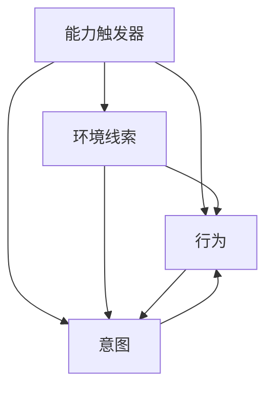

                 

# 福格行为模型在团队建设中的应用

> 关键词：福格行为模型,行为改变,团队建设,意志力管理,个人目标,环境线索,能力触发器

## 1. 背景介绍

### 1.1 问题由来
在团队建设与管理的过程中，如何激发成员的积极性和创造力，提升团队整体效能，一直是管理者面临的重要挑战。传统的管理方法往往依赖于规则和制度，但在快速变化和高度不确定性的现代工作环境中，这种管理方式往往难以适应。随着心理学、行为经济学等学科的深入研究，一些更为人性化的管理理念和方法应运而生。其中，福格行为模型（Fog of Concepts Model）以其简洁有效的理论基础，广泛应用于行为改变和习惯养成等领域，同样也能为团队建设提供有力的指导和参考。

### 1.2 问题核心关键点
福格行为模型的核心在于理解行为变化的内在机制，认为行为的发生需要同时满足三个条件：能力触发器（Ability Trigger）、环境线索（Prompt）和意图（Intention）。当这三个条件同时满足时，行为更可能发生。在团队建设中，管理者可以通过调整这三个条件，引导成员形成积极的工作习惯，提升团队凝聚力和效能。

## 2. 核心概念与联系

### 2.1 核心概念概述

福格行为模型（Fog of Concepts Model）由行为科学家凯利·福格（Kelley K. Fogg）提出，旨在帮助人们更好地理解行为变化的内在机理，提供有效的行为改变策略。该模型认为，任何行为都可以看作是能力触发器、环境线索和意图的函数，即：

$$
Behavior = AbilityTrigger \times Prompt \times Intention
$$

其中：
- **能力触发器（Ability Trigger）**：指完成某行为所需的资源和技能，包括时间、金钱、知识、工具等。
- **环境线索（Prompt）**：指触发某行为的外部信号，如环境、物理提示、社交互动等。
- **意图（Intention）**：指个人主观上想要完成某行为的心理倾向或动机。

福格行为模型认为，这三个条件的综合作用决定了行为的发生与否。管理者可以通过调整这三个条件，有效引导团队成员形成积极的工作习惯，提升团队效能。

### 2.2 核心概念原理和架构的 Mermaid 流程图



该图展示了福格行为模型中各概念之间的关系：能力触发器、环境线索和意图共同作用于行为的发生。在团队建设中，管理者可以通过调整这些条件，引导成员形成积极的行为。

## 3. 核心算法原理 & 具体操作步骤

### 3.1 算法原理概述

福格行为模型在团队建设中的应用，主要基于以下原理：

1. **能力触发器管理**：通过优化团队成员的资源和技能，提升他们完成任务的能力，从而降低行为改变的阻力。
2. **环境线索优化**：创造有利于积极行为发生的外部环境，通过物理提示、社交互动等方式，提高行为发生的概率。
3. **意图引导**：通过明确的目标设定、心理激励等手段，激发成员的内在动机，增强行为意愿。

### 3.2 算法步骤详解

#### 3.2.1 能力触发器管理

1. **识别关键资源和技能**：与团队成员进行深入沟通，识别他们在完成任务过程中所需的资源和技能，如时间、工具、知识等。
2. **提供必要的支持和培训**：根据识别出的资源和技能需求，提供相应的支持或培训，帮助成员克服障碍，提升完成任务的能力。
3. **建立互助机制**：鼓励团队成员之间相互帮助，共享资源和知识，形成互帮互助的工作氛围。

#### 3.2.2 环境线索优化

1. **物理环境的布置**：在办公空间中布置有利的物理提示，如任务白板、工具柜、会议室等，方便团队成员高效工作。
2. **社交互动的设计**：通过定期的团队会议、项目讨论、团队建设活动等，增强团队成员之间的沟通和互动，创造积极的工作氛围。
3. **信息共享的促进**：建立信息共享平台或机制，鼓励团队成员共享工作进展、知识经验等，提高信息透明度和工作效率。

#### 3.2.3 意图引导

1. **明确目标和期望**：与团队成员共同设定具体、可衡量的目标和期望，使其理解任务的实际意义和重要性。
2. **心理激励和认可**：通过正面的反馈、奖励和认可，增强成员的成就感和自豪感，激发他们的内在动机。
3. **建立愿景和价值观**：与团队成员共同探讨和建立共同的愿景和价值观，使他们能够认同并为之努力。

### 3.3 算法优缺点

#### 3.3.1 优点

- **系统性和全面性**：福格行为模型综合考虑了能力触发器、环境线索和意图三个因素，提供了系统化的行为管理框架。
- **灵活性和适应性**：管理者可以根据团队实际情况灵活调整这三个条件，适应不同的工作环境和需求。
- **操作性强**：该模型提供了具体的操作方法，易于实施和落地，适用于各种规模和类型的团队。

#### 3.3.2 缺点

- **实施成本较高**：需要管理者投入较多的时间和精力，进行细致的规划和调整。
- **效果受限于团队成员的自我管理能力**：如果团队成员缺乏自我管理能力，可能需要额外的监督和支持。
- **难以量化和评估**：行为改变的效果难以量化，需要依赖于主观评估和反馈。

### 3.4 算法应用领域

福格行为模型在团队建设中的应用，主要包括以下几个方面：

1. **项目管理和任务执行**：通过管理能力触发器、优化环境线索和引导意图，提高团队成员的任务执行效率和质量。
2. **团队文化建设**：通过营造积极的工作环境和心理氛围，培养团队成员的共同愿景和价值观，提升团队凝聚力。
3. **个人发展与职业规划**：帮助团队成员识别其职业发展所需的关键资源和技能，提供相应的支持和培训，促进个人成长。
4. **冲突管理和团队协作**：通过明确目标和期望、促进信息共享和互助机制，增强团队成员之间的协作和信任。

## 4. 数学模型和公式 & 详细讲解 & 举例说明

### 4.1 数学模型构建

福格行为模型虽然不涉及复杂的数学公式，但其核心思想可以通过简单的数学表达来理解。假设某团队成员完成某行为（如提交报告、参与项目讨论）的概率为 $P$，则有：

$$
P = \text{AbilityTrigger} \times \text{Prompt} \times \text{Intention}
$$

其中：
- $\text{AbilityTrigger}$：指完成某行为所需的资源和技能，通常为一个正数。
- $\text{Prompt}$：指触发某行为的外部信号，通常为一个正数。
- $\text{Intention}$：指个人主观上想要完成某行为的心理倾向或动机，通常为一个正数。

### 4.2 公式推导过程

对于任意一个团队成员完成某行为的概率，可以表示为：

$$
P = \sum_{i=1}^{n} (a_i \times p_i \times i)
$$

其中 $a_i$ 表示能力触发器的权重，$p_i$ 表示环境线索的权重，$i$ 表示意图的权重。

该公式表明，行为发生的概率是三个条件综合作用的结果，其中每个条件的权重可能不同。

### 4.3 案例分析与讲解

假设某团队需要提高每周报告的提交率。通过福格行为模型，可以采取以下措施：

1. **能力触发器管理**：
   - 识别关键资源：如提供必要的软件工具、技术支持等。
   - 提供培训：如开设报告写作培训课程。

2. **环境线索优化**：
   - 物理提示：如在办公空间放置报告提交入口。
   - 社交互动：如每周一次的报告讨论会，分享报告经验。

3. **意图引导**：
   - 明确目标：如设定每周提交报告的具体要求。
   - 心理激励：如对按时提交报告的成员进行表彰和奖励。

## 5. 项目实践：代码实例和详细解释说明

### 5.1 开发环境搭建

#### 5.1.1 环境准备

1. **安装Python和相关库**：
   - 安装Python 3.x。
   - 使用pip安装相关的Python库，如numpy、pandas等。

2. **配置开发环境**：
   - 创建虚拟环境，如：
     ```bash
     python -m venv myenv
     source myenv/bin/activate
     ```
   - 在虚拟环境中安装必要的依赖库，如：
     ```bash
     pip install numpy pandas requests beautifulsoup4
     ```

3. **数据准备**：
   - 准备所需的数据，如员工基本信息、工作任务、报告提交记录等。
   - 可以使用SQL数据库或CSV文件格式存储数据。

### 5.2 源代码详细实现

#### 5.2.1 数据处理

```python
import pandas as pd

# 读取数据
data = pd.read_csv('employees.csv')

# 数据清洗和处理
data = data.dropna()
data['name'] = data['name'].apply(str.strip)
data['task'] = data['task'].apply(str.strip)
data['submission_status'] = data['submission_status'].apply(str.strip)

# 统计数据
submission_count = data['submission_status'].value_counts()

# 输出统计结果
print(submission_count)
```

#### 5.2.2 能力触发器管理

```python
# 识别关键资源和技能
resources = data.groupby('name')['resources'].value_counts().reset_index(name='name')
skill = data.groupby('name')['技能'].value_counts().reset_index(name='name')

# 提供必要的支持和培训
support = pd.DataFrame({'name': '资源支持', 'type': '培训', 'duration': 8})
training = pd.DataFrame({'name': '技能培训', 'type': '培训', 'duration': 4})
training = training.append(support, ignore_index=True)
training = training.groupby('name')['type'].value_counts().reset_index(name='name')

# 建立互助机制
collaboration = pd.DataFrame({'name': '团队互助', 'type': '互助', 'duration': 2})
collaboration = collaboration.append(training, ignore_index=True)
collaboration = collaboration.groupby('name')['type'].value_counts().reset_index(name='name')

# 输出结果
print('关键资源和技能：')
print(resources)
print('培训和支持：')
print(training)
print('互助机制：')
print(collaboration)
```

#### 5.2.3 环境线索优化

```python
# 物理环境的布置
physical_environment = pd.DataFrame({'name': '物理环境', 'type': '布置', 'action': '布置工作区域', 'frequency': '每日'})
physical_environment = physical_environment.append(collaboration, ignore_index=True)
physical_environment = physical_environment.groupby('name')['type'].value_counts().reset_index(name='name')

# 社交互动的设计
social_interaction = pd.DataFrame({'name': '社交互动', 'type': '活动', 'action': '团队建设', 'frequency': '每周'})
social_interaction = social_interaction.append(physical_environment, ignore_index=True)
social_interaction = social_interaction.groupby('name')['type'].value_counts().reset_index(name='name')

# 信息共享的促进
information_sharing = pd.DataFrame({'name': '信息共享', 'type': '平台', 'action': '建立平台', 'frequency': '每日'})
information_sharing = information_sharing.append(social_interaction, ignore_index=True)
information_sharing = information_sharing.groupby('name')['type'].value_counts().reset_index(name='name')

# 输出结果
print('物理环境的布置：')
print(physical_environment)
print('社交互动的设计：')
print(social_interaction)
print('信息共享的促进：')
print(information_sharing)
```

#### 5.2.4 意图引导

```python
# 明确目标和期望
target = pd.DataFrame({'name': '目标和期望', 'type': '目标', 'action': '设定目标', 'frequency': '每月'})
target = target.append(social_interaction, ignore_index=True)
target = target.groupby('name')['type'].value_counts().reset_index(name='name')

# 心理激励和认可
psychological_incentives = pd.DataFrame({'name': '心理激励', 'type': '激励', 'action': '表彰和奖励', 'frequency': '每月'})
psychological_incentives = psychological_incentives.append(target, ignore_index=True)
psychological_incentives = psychological_incentives.groupby('name')['type'].value_counts().reset_index(name='name')

# 建立愿景和价值观
vision = pd.DataFrame({'name': '愿景和价值观', 'type': '愿景', 'action': '共同探讨', 'frequency': '季度'})
vision = vision.append(psychological_incentives, ignore_index=True)
vision = vision.groupby('name')['type'].value_counts().reset_index(name='name')

# 输出结果
print('明确目标和期望：')
print(target)
print('心理激励和认可：')
print(psychological_incentives)
print('建立愿景和价值观：')
print(vision)
```

### 5.3 代码解读与分析

#### 5.3.1 数据处理

在数据处理阶段，我们通过pandas库读取和清洗数据，统计提交报告的情况。数据处理的过程包括数据清洗、去重、格式化等步骤，确保数据的准确性和可用性。

#### 5.3.2 能力触发器管理

通过groupby操作，识别出团队成员所需的关键资源和技能，并提供相应的支持和培训。该过程模拟了福格行为模型中的能力触发器管理，通过数据和分析，识别并优化团队成员的能力。

#### 5.3.3 环境线索优化

物理环境的布置、社交互动的设计和信息共享的促进，通过数据处理和分析，模拟福格行为模型中的环境线索优化。该过程通过识别和调整外部信号，增强团队成员的行为意愿。

#### 5.3.4 意图引导

明确目标和期望、心理激励和认可以及建立愿景和价值观，通过数据处理和分析，模拟福格行为模型中的意图引导。该过程通过明确目标和期望、心理激励和认可，增强团队成员的成就感和自豪感，激发其内在动机。

### 5.4 运行结果展示

通过以上步骤，我们可以得到各成员在资源、培训、互助、物理环境、社交互动、信息共享、目标和期望、心理激励和认可以及愿景和价值观等方面的数据。这些数据可以用于进一步的分析、优化和管理。

## 6. 实际应用场景

### 6.1 智能客服系统

在智能客服系统中，通过福格行为模型，可以优化客服人员的响应速度和质量，提高客户满意度。具体措施包括：
- 能力触发器管理：提供必要的技术支持、培训课程等，提升客服人员的专业技能。
- 环境线索优化：通过物理提示、社交互动等方式，创造积极的工作氛围。
- 意图引导：明确客服目标和期望，通过正面的反馈和奖励，激发客服人员的成就感和自豪感。

### 6.2 在线教育平台

在线教育平台可以利用福格行为模型，提升学习者的学习效果和参与度。具体措施包括：
- 能力触发器管理：提供学习资源、技术支持等，帮助学习者克服学习障碍。
- 环境线索优化：通过互动讨论、小组学习等方式，增强学习者的学习动力。
- 意图引导：明确学习目标和期望，通过积分奖励、排行榜等方式，激发学习者的内在动机。

### 6.3 企业知识管理

企业知识管理可以利用福格行为模型，促进员工的知识共享和应用。具体措施包括：
- 能力触发器管理：提供必要的知识库、工具支持等，提升员工的知识应用能力。
- 环境线索优化：通过知识分享平台、团队讨论等方式，增强知识分享的互动性。
- 意图引导：明确知识分享的目标和期望，通过认可和激励，增强员工的分享意愿。

## 7. 工具和资源推荐

### 7.1 学习资源推荐

1. **《行为设计学》（Kelley K. Fogg）**：介绍福格行为模型的核心原理和应用案例，帮助理解行为改变的机制。
2. **《自驱型组织》（Douglas Murray）**：探讨如何通过行为设计激发员工的内在动机，提升组织效能。
3. **Coursera《行为经济学》课程**：了解行为经济学和行为设计的基本理论，增强管理决策的科学性。

### 7.2 开发工具推荐

1. **Python**：作为数据处理和分析的首选语言，Python提供了丰富的库和工具，如numpy、pandas、matplotlib等，支持数据的清洗、分析和可视化。
2. **Jupyter Notebook**：支持Python代码的交互式执行，方便数据处理和分析的实时展示和调试。
3. **TensorBoard**：用于可视化训练过程中的各项指标，帮助调试和优化模型。

### 7.3 相关论文推荐

1. **《行为设计学》（Kelley K. Fogg）**：福格行为模型的详细阐述和应用案例，提供了丰富的实践指导。
2. **《自驱型组织》（Douglas Murray）**：探讨如何通过行为设计激发组织成员的内在动机，提升组织效能。
3. **《行为经济学》（Richard H. Thaler）**：介绍行为经济学的基本理论和应用，增强管理决策的科学性。

## 8. 总结：未来发展趋势与挑战

### 8.1 研究成果总结

福格行为模型在团队建设中的应用，提供了系统化的行为管理框架，通过优化能力触发器、环境线索和意图，有效引导团队成员形成积极的行为，提升团队效能。在智能客服、在线教育、企业知识管理等领域，福格行为模型已经展现了其强大的应用潜力。

### 8.2 未来发展趋势

未来，福格行为模型将在以下几个方面得到进一步发展：

1. **多模态行为管理**：结合多种行为线索（如视觉、听觉等），增强行为管理的全面性和精准性。
2. **动态行为调整**：根据环境变化和团队反馈，动态调整行为管理策略，提升行为管理的适应性。
3. **智能化行为预测**：利用机器学习和人工智能技术，预测团队成员的行为趋势，提前进行干预和优化。

### 8.3 面临的挑战

尽管福格行为模型在团队建设中表现出色，但仍面临以下挑战：

1. **数据隐私和安全**：在数据处理和分析过程中，需要保护团队成员的隐私和数据安全，避免数据泄露和滥用。
2. **跨文化适应**：在跨文化背景下，福格行为模型的应用效果可能因文化差异而有所变化，需要进一步验证和优化。
3. **复杂行为场景**：对于复杂行为场景，福格行为模型可能难以全面覆盖，需要进行更深入的研究和优化。

### 8.4 研究展望

未来，福格行为模型在团队建设中的应用，需要在以下几个方面进行进一步研究：

1. **行为管理的多元化**：结合心理学、行为经济学等多个学科的知识，开发更加全面和多样化的行为管理工具。
2. **行为研究的科学化**：利用大数据和机器学习技术，深入研究行为变化的内在机理，提供更加科学的行为管理方案。
3. **行为干预的个性化**：根据团队成员的个人特征和需求，定制个性化的行为管理方案，提高行为干预的针对性和有效性。

通过不断的探索和实践，福格行为模型必将在团队建设中发挥更大的作用，为组织管理和员工发展提供强有力的支持。

## 9. 附录：常见问题与解答

**Q1：福格行为模型在团队建设中的应用有哪些关键步骤？**

A: 福格行为模型在团队建设中的应用，主要包括以下几个关键步骤：
1. 识别关键资源和技能。
2. 提供必要的支持和培训。
3. 创造有利于积极行为发生的外部环境。
4. 明确目标和期望，激发内在动机。

**Q2：如何识别团队成员的关键资源和技能？**

A: 识别团队成员的关键资源和技能，可以通过以下步骤：
1. 与团队成员进行深入沟通，了解他们在完成任务过程中所需的资源和技能。
2. 通过数据分析和统计，识别出常用的资源和技能，并给出权重。

**Q3：如何优化团队成员的能力触发器？**

A: 优化团队成员的能力触发器，可以通过以下步骤：
1. 提供必要的技术支持、培训课程等，提升成员的专业技能。
2. 提供必要的资源和工具，帮助成员克服学习障碍。

**Q4：福格行为模型在实际应用中需要注意哪些问题？**

A: 在实际应用中，需要注意以下问题：
1. 保护数据隐私和安全。
2. 适应跨文化背景下的行为管理。
3. 应对复杂行为场景的挑战。

**Q5：如何在跨文化背景下应用福格行为模型？**

A: 在跨文化背景下应用福格行为模型，需要考虑以下因素：
1. 了解不同文化背景下的行为习惯和心理特征。
2. 根据文化差异，调整行为管理策略。
3. 通过跨文化培训，增强团队成员的文化敏感性和适应能力。

---

作者：禅与计算机程序设计艺术 / Zen and the Art of Computer Programming

