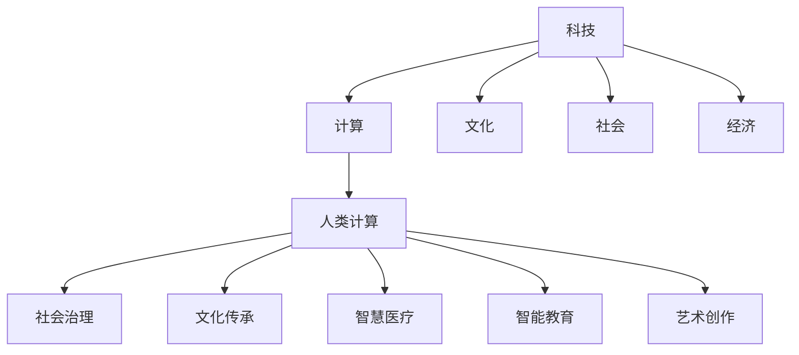

                 

# 科技与人文的交汇点：人类计算的独特价值

> 关键词：
## 1. 背景介绍

### 1.1 问题由来
随着计算机科学技术的迅猛发展，科技与人文的关系问题逐渐成为学术界和业界关注的焦点。科技不仅是物质文明的驱动者，更是文化发展的催化剂。特别是在当前信息时代，人工智能、大数据、区块链等前沿技术正逐渐深入到人类社会的各个层面，深刻影响着人类的思维模式、生活方式和社会结构。

与此同时，人类的思考方式、价值观、艺术创作等领域也在不断受到科技的冲击。科技与人文之间的交叉融合，不仅带来了前所未有的机遇，也带来了深刻的挑战。如何平衡技术进步与人文价值，成为当代科技创新的重要课题。

本文将从计算科学的角度出发，探讨科技与人文的交汇点，揭示人类计算的独特价值，并展望其未来发展趋势。

### 1.2 问题核心关键点
本文的核心问题包括：

- 科技与人文的关系是怎样的？
- 人类计算在科技与文化的交集中扮演了什么角色？
- 如何通过计算科学实现科技与人文的良性互动？
- 计算科学在人类社会的未来发展方向上，具有哪些独特价值？

本文将从理论角度探讨这些问题，通过具体的计算案例，揭示计算科学在文化传承、社会治理、人类智慧等领域的应用与影响。

## 2. 核心概念与联系

### 2.1 核心概念概述

在探讨科技与人文的交汇点之前，首先明确几个核心概念：

- 科技(Technology)：指应用自然科学、工程学、数学等知识，进行物质和信息转化与创新，满足人类生产和生活需要的各类技术和工具。
- 人文(Humanity)：包括文学、艺术、哲学、宗教、伦理、历史等多个领域，是人类文化的积淀和精神的体现。
- 计算(Computing)：通过电子、光子、量子等物理手段，实现对数据的处理、存储、传输和应用，是现代科技的核心组成部分。
- 人类计算(Human Computing)：指通过计算科学原理，帮助人类更高效地处理和理解复杂信息，提升智慧与能力的过程。

这些概念之间的联系，可以通过以下Mermaid流程图来展示：



这个流程图展示了科技、计算与人类计算在文化、社会、经济等多个领域中的应用。计算科学不仅是技术手段，更是人类智慧的延伸。通过计算，科技与人文可以更加紧密地结合，推动人类社会的全面进步。

## 3. 核心算法原理 & 具体操作步骤

### 3.1 算法原理概述

人类计算的独特价值，体现在其将人文精神与计算技术结合，实现了信息与智慧的双重提升。核心算法原理可以从以下几个方面展开：

1. **数据驱动**：通过收集、整理、分析海量数据，揭示复杂现象背后的规律。
2. **模型构建**：设计高效、准确的数据模型，帮助人类理解复杂现象。
3. **算法优化**：优化算法效率和效果，提升人类处理信息的能力。
4. **知识积累**：利用计算技术积累人类智慧，推动文化、科技的迭代进步。

### 3.2 算法步骤详解

以大数据分析与文化传承为例，详细阐述人类计算的核心算法步骤：

1. **数据采集**：收集历史文献、文化作品、社会事件等数据，形成完整的数据集。
2. **数据清洗**：剔除噪声和异常数据，确保数据质量和一致性。
3. **特征提取**：利用自然语言处理、图像识别等技术，提取数据中的关键特征。
4. **模型训练**：选择适合的算法模型，如深度学习、贝叶斯网络等，对数据进行训练。
5. **知识发现**：通过模型分析，发现数据背后的规律和趋势。
6. **结果验证**：通过实验验证模型的效果，修正和改进模型。
7. **知识应用**：将模型应用于实际场景，推动文化传承、教育、艺术创作等领域的发展。

### 3.3 算法优缺点

人类计算的优点包括：

- 数据驱动：利用大数据分析，揭示复杂现象的规律。
- 模型高效：通过算法优化，快速处理和分析海量数据。
- 知识积累：利用计算技术，积累和传承人类智慧。

但同时也存在一些缺点：

- 数据隐私：在数据采集和处理过程中，存在隐私泄露的风险。
- 模型偏见：模型可能带有数据源的偏见，导致决策不公平。
- 算法复杂：一些复杂算法可能需要较长的训练时间和大量的计算资源。

### 3.4 算法应用领域

人类计算在多个领域都有广泛的应用，包括：

- **文化传承**：利用计算技术分析文化遗产，揭示其演变规律，推动文化保护与传承。
- **社会治理**：利用大数据和算法优化，提升政府决策和公共服务的效率。
- **智慧医疗**：通过计算分析，提高医疗诊断和治疗的准确性。
- **智能教育**：利用计算技术个性化教学内容，提升教育质量和效率。
- **艺术创作**：利用计算辅助创作，提升艺术作品的创意性和多样性。

## 4. 数学模型和公式 & 详细讲解 & 举例说明

### 4.1 数学模型构建

以大数据分析为例，构建数学模型：

1. **数据分布假设**：假设数据服从一定的分布，如正态分布、泊松分布等。
2. **数据建模**：利用统计学原理，构建数据模型。
3. **参数估计**：通过样本数据，估计模型参数。

### 4.2 公式推导过程

以线性回归模型为例，推导公式：

设自变量为 $x_i$，因变量为 $y_i$，线性回归模型的公式为：

$$
y_i = \beta_0 + \beta_1 x_i + \epsilon_i
$$

其中，$\beta_0$ 为截距，$\beta_1$ 为斜率，$\epsilon_i$ 为误差项。

最小二乘法求解 $\beta_0$ 和 $\beta_1$：

$$
\hat{\beta_0}, \hat{\beta_1} = \mathop{\arg\min}_{\beta_0, \beta_1} \sum_{i=1}^n (y_i - \beta_0 - \beta_1 x_i)^2
$$

### 4.3 案例分析与讲解

以Google的PageRank算法为例，分析其原理和应用：

PageRank算法是Google搜索引擎的核心算法之一，用于计算网页的重要性和排名。其基本思想是通过计算网页之间的链接关系，推断出网页的权威性和相关性。

PageRank算法的数学模型如下：

设网页 $p$ 的排名为 $P(p)$，其权重为 $R(p)$，则有：

$$
P(p) = (1 - d) + d \sum_{q \in N(p)} \frac{R(q)}{L(q)} P(q)
$$

其中，$d$ 为阻尼因子，$N(p)$ 为网页 $p$ 的出链集合，$L(q)$ 为网页 $q$ 的出链数量。

通过计算网页的排名，PageRank算法能够准确反映网页的重要性，显著提升了搜索引擎的搜索效果。

## 5. 项目实践：代码实例和详细解释说明

### 5.1 开发环境搭建

以Python开发为例，搭建环境：

1. 安装Anaconda：
```bash
conda install anaconda
```

2. 创建虚拟环境：
```bash
conda create -n myenv python=3.7
conda activate myenv
```

3. 安装相关库：
```bash
pip install numpy pandas scikit-learn
```

### 5.2 源代码详细实现

以线性回归模型为例，实现代码：

```python
import numpy as np
from sklearn.linear_model import LinearRegression

# 生成模拟数据
x = np.random.rand(100, 1)
y = 2 * x + 3 + np.random.randn(100, 1)

# 构建线性回归模型
model = LinearRegression()
model.fit(x, y)

# 预测
x_test = np.array([[0.5], [0.8], [0.3]])
y_pred = model.predict(x_test)

print(y_pred)
```

### 5.3 代码解读与分析

代码主要实现线性回归模型的训练和预测。通过sklearn库，可以方便地构建、训练和评估线性回归模型。

具体步骤如下：

1. 生成模拟数据：通过numpy库生成100个样本，每个样本有一个特征值 $x$ 和一个标签值 $y$。
2. 构建模型：使用LinearRegression类构建线性回归模型。
3. 训练模型：通过fit方法对模型进行训练，使用生成的模拟数据。
4. 预测：使用predict方法对新的测试数据进行预测。
5. 输出结果：打印预测结果。

## 6. 实际应用场景

### 6.1 社会治理

以城市交通管理为例，展示人类计算的实际应用：

通过收集和分析交通流量数据，利用计算技术进行数据分析和建模，发现交通流动的规律和趋势，为城市交通管理提供决策支持。

具体步骤如下：

1. 数据采集：收集城市交通流量数据，如车辆数、道路拥堵情况等。
2. 数据清洗：剔除异常数据和噪声。
3. 特征提取：提取关键特征，如交通高峰时段、主要交通干道等。
4. 模型训练：选择适合的算法模型，如时间序列分析、回归模型等，对数据进行训练。
5. 结果分析：通过模型分析，发现交通流动的规律和趋势，为交通管理提供决策支持。

### 6.2 文化传承

以文化遗产保护为例，展示人类计算的实际应用：

通过计算技术分析文化遗产的历史数据和相关文献，揭示其演变规律，推动文化遗产保护与传承。

具体步骤如下：

1. 数据采集：收集历史文献、文物数据、考古资料等。
2. 数据清洗：剔除噪声和异常数据。
3. 特征提取：提取关键特征，如文物种类、年代、位置等。
4. 模型训练：选择适合的算法模型，如聚类分析、时间序列分析等，对数据进行训练。
5. 结果分析：通过模型分析，发现文物的演变规律，推动文化遗产保护与传承。

## 7. 工具和资源推荐

### 7.1 学习资源推荐

1. 《深度学习》书籍：由Ian Goodfellow等著，全面介绍了深度学习的原理和应用。
2. 《机器学习》书籍：由Tom Mitchell等著，详细讲解了机器学习的基本概念和算法。
3. 《自然语言处理综论》书籍：由Christopher Manning等著，深入浅出地介绍了NLP的理论与实践。
4. 在线课程：如Coursera、edX、Udacity等平台上的数据科学、机器学习、深度学习课程。
5. 专业博客和社区：如Towards Data Science、KDnuggets等，提供最新的研究动态和实战案例。

### 7.2 开发工具推荐

1. Python：作为数据科学和机器学习的主流语言，Python具有丰富的库和框架支持。
2. Jupyter Notebook：提供了交互式的编程环境，方便实验和演示。
3. Google Colab：免费的GPU/TPU云环境，支持大规模计算和实验。
4. PyTorch：强大的深度学习框架，提供了丰富的预训练模型和算法库。
5. TensorFlow：由Google开发的深度学习框架，支持大规模模型训练和部署。

### 7.3 相关论文推荐

1. 《Google PageRank算法》论文：由Larry Page和Sergey Brin等著，详细介绍了PageRank算法的设计和应用。
2. 《数据驱动的智慧城市建设》论文：探讨了大数据和计算技术在智慧城市中的应用。
3. 《计算科学与人类智慧的融合》论文：分析了计算技术在人类文化传承中的作用。

## 8. 总结：未来发展趋势与挑战

### 8.1 研究成果总结

本文通过系统介绍人类计算的原理和应用，揭示了计算科学在文化、社会、经济等领域的重要价值。通过具体案例和数学模型，展示了人类计算的独特魅力和潜力。

### 8.2 未来发展趋势

未来人类计算的发展趋势包括：

1. **多模态计算**：利用计算技术整合视觉、听觉、触觉等多模态信息，提升人类感知和认知能力。
2. **计算伦理**：随着计算技术在社会各领域的广泛应用，计算伦理将成为重要课题。
3. **计算美学**：将计算技术应用于艺术创作，提升艺术作品的创意性和表现力。
4. **计算经济学**：利用计算技术优化资源配置和经济管理，推动经济可持续发展。
5. **计算政治学**：通过计算技术分析政治事件和政策，提升政府决策的科学性和公正性。

### 8.3 面临的挑战

人类计算面临的主要挑战包括：

1. **数据隐私**：在数据采集和处理过程中，存在隐私泄露的风险。
2. **算法偏见**：模型可能带有数据源的偏见，导致决策不公平。
3. **计算资源**：计算任务可能需要大量的计算资源和算力支持。
4. **伦理问题**：计算技术可能带来伦理和道德问题，如算法歧视、数据滥用等。

### 8.4 研究展望

未来的研究方向包括：

1. **计算美学与艺术创作**：利用计算技术辅助艺术创作，提升艺术作品的创意性和表现力。
2. **计算伦理与社会责任**：建立计算伦理框架，确保计算技术的应用符合社会伦理和法律规范。
3. **计算政治学与政策分析**：利用计算技术分析政治事件和政策，提升政府决策的科学性和公正性。
4. **计算经济学与资源优化**：利用计算技术优化资源配置和经济管理，推动经济可持续发展。
5. **计算文化与人类智慧**：利用计算技术积累和传承人类智慧，推动文化传承和创新。

## 9. 附录：常见问题与解答

**Q1：人类计算的独特价值体现在哪些方面？**

A: 人类计算的独特价值主要体现在以下几个方面：

1. **数据驱动**：利用大数据分析，揭示复杂现象的规律。
2. **模型高效**：通过算法优化，快速处理和分析海量数据。
3. **知识积累**：利用计算技术，积累和传承人类智慧。
4. **多模态整合**：利用计算技术整合视觉、听觉、触觉等多模态信息，提升人类感知和认知能力。
5. **伦理考量**：关注计算伦理和道德问题，确保技术应用符合社会伦理和法律规范。

**Q2：人类计算面临的主要挑战有哪些？**

A: 人类计算面临的主要挑战包括：

1. **数据隐私**：在数据采集和处理过程中，存在隐私泄露的风险。
2. **算法偏见**：模型可能带有数据源的偏见，导致决策不公平。
3. **计算资源**：计算任务可能需要大量的计算资源和算力支持。
4. **伦理问题**：计算技术可能带来伦理和道德问题，如算法歧视、数据滥用等。
5. **模型解释性**：计算模型的决策过程通常缺乏可解释性，难以对其推理逻辑进行分析和调试。

**Q3：未来人类计算的发展方向有哪些？**

A: 未来人类计算的发展方向包括：

1. **多模态计算**：利用计算技术整合视觉、听觉、触觉等多模态信息，提升人类感知和认知能力。
2. **计算美学**：将计算技术应用于艺术创作，提升艺术作品的创意性和表现力。
3. **计算伦理**：建立计算伦理框架，确保计算技术的应用符合社会伦理和法律规范。
4. **计算经济学**：利用计算技术优化资源配置和经济管理，推动经济可持续发展。
5. **计算政治学**：通过计算技术分析政治事件和政策，提升政府决策的科学性和公正性。

**Q4：如何平衡技术进步与人文价值？**

A: 平衡技术进步与人文价值的方法包括：

1. **跨学科合作**：加强科技与人文领域的交流合作，共同探索科技与人文的交汇点。
2. **伦理与法律规范**：建立计算伦理框架，确保技术应用符合社会伦理和法律规范。
3. **公众参与**：加强公众对计算技术的理解和参与，促进技术的良性应用。
4. **文化传承**：利用计算技术保护和传承文化遗产，推动文化创新。
5. **社会责任**：企业和技术开发者应承担社会责任，确保技术应用对社会有益。

---

作者：禅与计算机程序设计艺术 / Zen and the Art of Computer Programming

