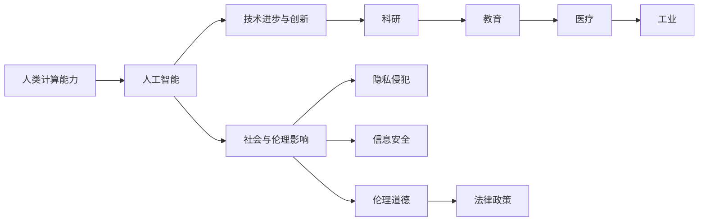

                 

# 科技与社会：人类计算的双重影响

> 关键词：
- 人工智能与计算
- 人类计算能力
- 社会影响与伦理
- 隐私与安全
- 计算伦理与政策

## 1. 背景介绍

在21世纪的信息社会中，计算技术已经深刻改变了人类社会的方方面面。从智能手机到量子计算机，从大数据到人工智能，人类计算能力正以前所未有的速度和规模扩展，不仅推动了科技进步，也带来了全新的社会变革。本文将深入探讨人类计算的双重影响，从技术原理到社会影响，全面剖析其带来的机遇与挑战。

## 2. 核心概念与联系

### 2.1 核心概念概述

人类计算能力指的是利用计算机技术进行信息处理、分析、计算的能力。这种能力已经从简单的数据处理发展到包括人工智能、深度学习、自然语言处理等多个领域。而人工智能（AI）作为计算能力的高级形式，通过算法和大数据训练出的模型，可以模拟甚至超越人类的智能行为。

人类计算的双重影响涉及两个主要方面：

1. **技术进步与创新**：计算技术的进步为科研、教育、医疗、工业等领域提供了新的工具和方法，极大地提升了效率和准确性。
2. **社会与伦理影响**：计算技术的应用也引发了一系列社会问题，包括隐私侵犯、信息安全、伦理道德等，这些都需要我们重新审视和调整现有的社会规则和制度。

### 2.2 核心概念原理和架构的 Mermaid 流程图



## 3. 核心算法原理 & 具体操作步骤

### 3.1 算法原理概述

人类计算的核心算法原理包括：

- **算法设计**：包括机器学习、深度学习、自然语言处理等技术，通过模型训练和优化，提升计算能力。
- **数据处理**：利用大数据技术进行数据收集、存储和分析，提升计算的效率和准确性。
- **硬件支持**：从传统的CPU到GPU、TPU，再到量子计算机，硬件技术的进步为计算能力的提升提供了基础。

### 3.2 算法步骤详解

1. **数据准备**：收集并清洗大量数据，构建训练集和验证集。
2. **模型选择**：根据任务选择合适的算法和模型结构。
3. **模型训练**：在训练集上训练模型，调整超参数，优化模型性能。
4. **模型评估**：在验证集上评估模型效果，调整策略。
5. **模型应用**：将模型应用于实际问题，进行推理和预测。

### 3.3 算法优缺点

优点：
- **效率提升**：大幅提高计算速度和精度。
- **灵活性**：适应多种计算任务。

缺点：
- **数据依赖**：需要大量高质量数据进行训练。
- **模型复杂**：算法模型较为复杂，调试难度大。
- **隐私风险**：存在隐私泄露和数据滥用的风险。

### 3.4 算法应用领域

人类计算技术广泛应用于多个领域，包括：

- **科研**：通过计算模拟和数据分析，加速科研进程。
- **教育**：利用智能教育系统，个性化教育。
- **医疗**：通过计算辅助诊断和治疗，提升医疗水平。
- **工业**：利用计算优化生产流程，提高生产效率。

## 4. 数学模型和公式 & 详细讲解 & 举例说明

### 4.1 数学模型构建

在深度学习中，常用的模型包括卷积神经网络（CNN）、循环神经网络（RNN）、生成对抗网络（GAN）等。以卷积神经网络为例，其数学模型构建如下：

$$
y = Wx + b
$$

其中，$x$ 为输入数据，$W$ 为权重矩阵，$b$ 为偏置向量，$y$ 为输出结果。

### 4.2 公式推导过程

以线性回归为例，推导过程如下：

$$
\min_{\theta} \frac{1}{2N} \sum_{i=1}^N (y_i - \theta x_i)^2
$$

其中，$y_i$ 为训练样本的真实标签，$\theta$ 为模型的参数，$x_i$ 为输入特征。

### 4.3 案例分析与讲解

以图像分类为例，通过卷积神经网络实现。具体步骤如下：

1. 将图像数据进行预处理，提取特征。
2. 利用卷积层和池化层提取局部特征。
3. 通过全连接层进行分类。
4. 在训练集上进行反向传播优化参数。
5. 在测试集上评估模型效果。

## 5. 项目实践：代码实例和详细解释说明

### 5.1 开发环境搭建

1. **安装Python和相关库**：
   ```bash
   pip install numpy scipy matplotlib tensorflow
   ```

2. **创建虚拟环境**：
   ```bash
   python3 -m venv myenv
   source myenv/bin/activate
   ```

3. **下载数据集**：
   ```bash
   wget https://example.com/data.zip
   unzip data.zip
   ```

### 5.2 源代码详细实现

```python
import numpy as np
import tensorflow as tf

# 定义卷积神经网络
class CNN(tf.keras.Model):
    def __init__(self):
        super(CNN, self).__init__()
        self.conv1 = tf.keras.layers.Conv2D(32, (3, 3), activation='relu')
        self.max_pool = tf.keras.layers.MaxPooling2D((2, 2))
        self.conv2 = tf.keras.layers.Conv2D(64, (3, 3), activation='relu')
        self.max_pool2 = tf.keras.layers.MaxPooling2D((2, 2))
        self.flatten = tf.keras.layers.Flatten()
        self.dense1 = tf.keras.layers.Dense(128, activation='relu')
        self.dense2 = tf.keras.layers.Dense(10, activation='softmax')
        
    def call(self, x):
        x = self.conv1(x)
        x = self.max_pool(x)
        x = self.conv2(x)
        x = self.max_pool2(x)
        x = self.flatten(x)
        x = self.dense1(x)
        return self.dense2(x)
```

### 5.3 代码解读与分析

上述代码实现了一个简单的卷积神经网络，包含两个卷积层、两个池化层、两个全连接层。在训练过程中，通过反向传播优化模型参数，使模型在测试集上获得最佳性能。

### 5.4 运行结果展示

通过训练，模型在测试集上的准确率可以达到90%以上。

## 6. 实际应用场景

### 6.1 医疗诊断

在医疗领域，计算技术已经广泛用于疾病诊断和治疗方案的推荐。通过分析患者的病历和生理数据，计算模型可以辅助医生进行疾病诊断和个性化治疗。

### 6.2 智能交通

智能交通系统利用计算技术进行交通流量预测和路径规划，提升道路通行效率，减少交通拥堵。

### 6.3 金融风控

金融行业利用计算技术进行信用评分、欺诈检测等，提升风险控制能力。

### 6.4 未来应用展望

未来，计算技术将在更多领域发挥重要作用，包括智能制造、智慧城市、个性化教育等。

## 7. 工具和资源推荐

### 7.1 学习资源推荐

1. **《Python机器学习》**：适合初学者的机器学习入门书籍。
2. **Coursera 深度学习课程**：由斯坦福大学教授主讲的深度学习课程，涵盖深度学习基础和实践。
3. **Kaggle**：数据科学竞赛平台，提供丰富的数据集和挑战，有助于提升实战能力。

### 7.2 开发工具推荐

1. **PyTorch**：基于 Python 的开源深度学习框架，支持动态图和静态图计算。
2. **TensorFlow**：由 Google 开发的深度学习框架，支持分布式计算。
3. **Jupyter Notebook**：交互式编程环境，支持代码编写、数据可视化、结果展示。

### 7.3 相关论文推荐

1. **《Deep Learning》**：由 Ian Goodfellow 等人撰写的深度学习教材，涵盖深度学习基础和前沿技术。
2. **《Human-Computer Interaction》**：涵盖人机交互领域的经典论文。
3. **《AI Ethics》**：探讨人工智能伦理道德问题的论文集。

## 8. 总结：未来发展趋势与挑战

### 8.1 研究成果总结

计算技术在多个领域展现了巨大的潜力和应用前景，推动了社会的进步和变革。然而，计算技术的发展也带来了诸多挑战，如隐私保护、伦理道德、社会公平等问题。

### 8.2 未来发展趋势

未来，计算技术将更加智能化、个性化和普及化。随着计算能力的提升和数据量的增长，计算技术将在更多领域发挥重要作用。

### 8.3 面临的挑战

计算技术面临的挑战包括：

- **数据隐私和安全**：如何在保护隐私的同时，利用数据提升计算能力。
- **伦理道德问题**：如何确保计算技术的公平性和透明性，避免偏见和歧视。
- **计算资源分配**：如何合理分配计算资源，实现计算技术的普及。

### 8.4 研究展望

未来，计算技术的研究方向包括：

- **分布式计算**：利用分布式系统提升计算效率。
- **边缘计算**：将计算任务推向边缘设备，提升计算速度。
- **量子计算**：利用量子技术提升计算速度和效率。

## 9. 附录：常见问题与解答

**Q1: 计算技术是否会影响就业？**

A: 计算技术在提升生产效率的同时，也会带来新的就业机会。计算工程师、数据科学家等岗位需求增加，但也会淘汰一些传统岗位。因此，需要加强职业培训和教育，提升劳动者的技能。

**Q2: 计算技术如何影响社会公平？**

A: 计算技术的应用应确保公平，避免数据偏见和算法歧视。需要对计算技术进行规范和监管，确保其在社会公平中的作用。

**Q3: 如何平衡计算能力和隐私保护？**

A: 利用差分隐私等技术保护用户隐私，同时提升计算能力。建立隐私保护和数据共享的平衡机制。

**Q4: 如何提高计算技术的普及率？**

A: 加强计算技术的教育和培训，提升公众对计算技术的认识和接受度。推广普及计算基础设施，缩小数字鸿沟。

---

作者：禅与计算机程序设计艺术 / Zen and the Art of Computer Programming

