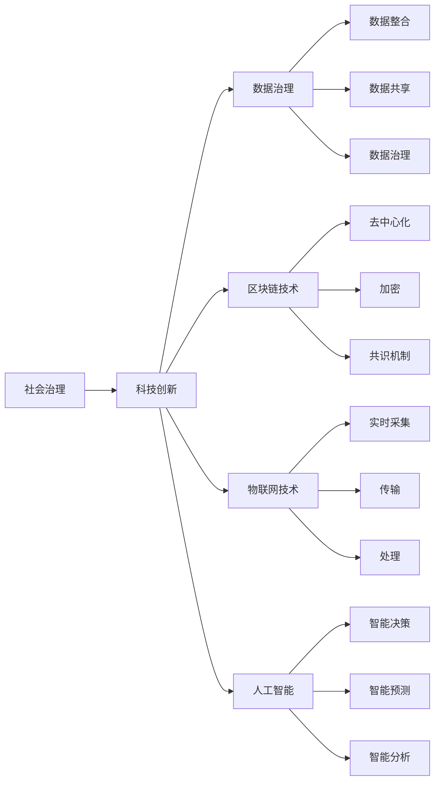

                 

# 科技创新：社会治理的新思路

## 1. 背景介绍

在数字化时代，科技创新的步伐正以前所未有的速度推动社会进步。从人工智能到物联网，从区块链到量子计算，技术的变革深刻地影响着人类的生产方式、生活方式乃至思维方式。然而，在享受科技带来的便利的同时，我们也面临着诸如数据隐私、网络安全、社会治理等新的挑战。

面对这些挑战，传统的社会治理方式显得力不从心。如何借助科技创新，构建更加智慧、高效、公正、透明的社会治理体系，成为当今社会亟待解决的问题。本文将围绕这一主题，从理论到实践，探讨科技创新在社会治理中的新思路，以期为相关领域的研究和应用提供参考。

## 2. 核心概念与联系

### 2.1 核心概念概述

- **社会治理**：指通过政策、法律、技术等手段，维护社会秩序，保障社会公平公正的过程。
- **科技创新**：指利用新技术手段，改善管理流程，提升治理效率，优化治理效果的活动。
- **数据治理**：指通过数据整合、共享、治理等手段，确保数据质量和安全性，促进数据价值最大化的过程。
- **区块链技术**：一种分布式账本技术，通过去中心化、加密、共识机制等特性，实现数据透明、不可篡改、可追溯。
- **物联网技术**：将传感器、设备、系统互联，实时采集、传输、处理数据，实现智能化、自动化管理。
- **人工智能**：通过机器学习、深度学习等技术，实现智能决策、预测、分析，提升治理智能化水平。

这些核心概念之间的联系可以通过以下Mermaid流程图来展示：



这个流程图展示了社会治理与科技创新之间的互动关系。科技创新通过数据治理、区块链、物联网、人工智能等技术手段，为社会治理提供更加高效、透明、公正的工具，实现治理方式的变革。

## 3. 核心算法原理 & 具体操作步骤
### 3.1 算法原理概述

科技创新在社会治理中的应用，主要基于以下算法原理：

- **数据整合与共享**：通过数据治理技术，将分散在各部门的数据进行整合、清洗、标注，形成统一的数据资源池。使用区块链技术，确保数据存储的安全性和不可篡改性。
- **智能决策与预测**：利用人工智能技术，对大量历史数据进行学习，建立预测模型，为政策制定和执行提供科学依据。
- **实时监控与分析**：通过物联网技术，实现对城市交通、公共设施、环境监测等场景的实时监控，使用人工智能技术进行数据分析和模式识别，及时发现并解决问题。
- **透明度与可追溯性**：区块链技术提供的数据不可篡改和透明特性，增强了治理过程的公开性和可追溯性，提高了公众信任度。

### 3.2 算法步骤详解

科技创新在社会治理中的应用，通常包括以下几个关键步骤：

**Step 1: 需求分析与设计**
- 明确社会治理的目标与需求，如提高城市治理效率、保障公共安全、提升公共服务质量等。
- 设计治理流程，确定哪些环节可以通过科技创新手段进行优化。

**Step 2: 技术选型与方案设计**
- 根据治理需求，选择合适的技术手段，如区块链、物联网、人工智能等。
- 设计技术方案，包括数据采集、存储、处理、分析等各个环节的技术细节。

**Step 3: 数据治理与集成**
- 对现有数据进行整合、清洗、标注，确保数据质量和一致性。
- 建立统一的数据治理框架，使用区块链技术保障数据安全和透明性。

**Step 4: 系统开发与部署**
- 根据技术方案，开发治理系统，包括数据采集、存储、处理、分析等各个环节。
- 对系统进行测试和调试，确保系统稳定性和可靠性。
- 部署系统到生产环境，提供服务。

**Step 5: 运维与优化**
- 对系统进行定期维护和优化，确保系统高效运行。
- 根据反馈和实际效果，不断优化技术方案和治理流程。

### 3.3 算法优缺点

科技创新在社会治理中的应用，具有以下优点：

- **提升治理效率**：通过自动化、智能化的手段，提高治理过程的效率，减少人力成本。
- **增强透明度与公正性**：使用区块链和物联网技术，确保治理过程的透明性和可追溯性，提升公众信任度。
- **促进数据利用**：通过数据整合与共享，提升数据的利用效率，为决策提供更多、更好的支持。
- **提升治理质量**：使用人工智能技术，提升治理的科学性和准确性，优化政策制定和执行。

同时，也存在一些缺点：

- **技术复杂性高**：科技创新的应用需要多学科的融合，技术难度大。
- **成本投入高**：技术实施和运维成本较高，需要持续的资金投入。
- **数据隐私风险**：数据共享和治理过程中，存在数据泄露和隐私侵犯的风险。
- **技术依赖性强**：科技创新的应用高度依赖于技术成熟度和实施水平。

### 3.4 算法应用领域

科技创新在社会治理中的应用，涵盖了多个领域，包括：

- **智慧城市**：利用物联网、人工智能等技术，提升城市交通、公共安全、环境监测等治理水平。
- **公共卫生**：使用物联网、大数据等技术，实时监测疫情动态，提升公共卫生应急响应能力。
- **社会服务**：通过人工智能技术，优化公共服务流程，提升服务质量和效率。
- **环境治理**：利用物联网、遥感技术，实时监测环境变化，提升环境治理能力。
- **网络治理**：使用区块链和人工智能技术，提高网络安全水平，保障网络秩序。

这些应用领域展示了科技创新在社会治理中的广泛应用前景，为社会治理的数字化、智能化提供了新的方向和路径。

## 4. 数学模型和公式 & 详细讲解 & 举例说明
### 4.1 数学模型构建

在社会治理中，科技创新通常涉及多个领域的数学模型和技术方法。以下以智能交通管理为例，构建数学模型：

假设城市交通管理系统由多个传感器、摄像头、信号灯等组成，每个节点采集的数据表示为 $x_i$，通过数据融合技术得到综合数据 $y_i$。使用数据治理技术对数据进行清洗和标注，形成样本集 $D=\{(x_i,y_i)\}_{i=1}^N$。

### 4.2 公式推导过程

根据上述数据模型，构建智能交通管理系统的数学模型：

- **输入输出模型**：输入为传感器数据 $x_i$，输出为综合数据 $y_i$。
- **回归模型**：使用线性回归模型 $y_i = \mathbf{W} \cdot x_i + b$，其中 $\mathbf{W}$ 为权重矩阵，$b$ 为偏置项。
- **损失函数**：使用均方误差损失函数 $L = \frac{1}{N} \sum_{i=1}^N (y_i - \mathbf{W} \cdot x_i)^2$，最小化损失函数得到最优权重 $\mathbf{W}$。
- **优化算法**：使用随机梯度下降 (SGD) 或 Adam 算法，更新权重 $\mathbf{W}$ 和偏置 $b$。

### 4.3 案例分析与讲解

以智能交通管理为例，展示科技创新在社会治理中的应用：

假设城市交通系统由多个传感器和摄像头组成，采集实时交通数据，如车流量、车速、拥堵情况等。通过数据融合技术，将传感器数据进行整合，得到综合数据。使用智能算法对数据进行分析和预测，如通过回归模型预测拥堵情况，使用卷积神经网络 (CNN) 检测交通违规行为。

## 5. 项目实践：代码实例和详细解释说明
### 5.1 开发环境搭建

要进行科技创新在社会治理中的应用开发，首先需要搭建开发环境：

1. **安装开发环境**：使用Anaconda或Miniconda，创建虚拟环境。
```bash
conda create -n traffic-mgmt python=3.8
conda activate traffic-mgmt
```

2. **安装相关库**：安装Python、NumPy、Pandas、Scikit-learn等库，以及智能交通管理相关的库，如TensorFlow、Keras、OpenCV等。
```bash
pip install numpy pandas scikit-learn tensorflow keras opencv
```

3. **数据集准备**：收集城市交通数据，包括传感器数据、摄像头数据、历史交通数据等，进行清洗和标注，形成训练集和测试集。

### 5.2 源代码详细实现

以下是一个基于TensorFlow和Keras实现的智能交通管理系统示例：

```python
import tensorflow as tf
from tensorflow.keras import layers, models

# 定义模型
model = models.Sequential([
    layers.Dense(64, activation='relu', input_shape=(3,)),
    layers.Dense(32, activation='relu'),
    layers.Dense(1)
])

# 编译模型
model.compile(optimizer='adam', loss='mse')

# 加载数据
train_data = ...
test_data = ...

# 训练模型
model.fit(train_data, epochs=10, validation_data=test_data)

# 预测
predictions = model.predict(test_data)
```

### 5.3 代码解读与分析

在上述代码中，我们使用了TensorFlow和Keras来构建一个简单的回归模型，用于预测交通流量。模型包含两个全连接层和一个输出层，使用均方误差损失函数进行训练和预测。

在实际开发中，需要对数据进行预处理，如归一化、标准化等，以便提高模型性能。同时，还需要考虑模型的可解释性和可维护性，进行合理的架构设计和代码注释。

### 5.4 运行结果展示

训练完成后，我们可以使用测试集对模型进行评估，得到预测结果和误差指标。例如：

```python
test_loss, test_predictions = model.evaluate(test_data)
print(f'Test loss: {test_loss}, Predictions: {test_predictions}')
```

运行结果展示了模型的性能和预测效果。在实际应用中，还需要进一步优化模型和调整参数，以获得更好的效果。

## 6. 实际应用场景
### 6.1 智慧城市

智慧城市是科技创新在社会治理中的典型应用场景。通过物联网、大数据、人工智能等技术，智慧城市可以实现对城市交通、公共安全、环境监测等领域的智能化管理，提升城市治理效率和公共服务质量。

例如，通过智能交通系统，实时监测交通流量、车速、拥堵情况，预测交通状况，动态调整交通信号灯，减少交通拥堵，提升出行体验。同时，利用智慧医疗系统，实时监测公共卫生数据，提升疫情防控和应急响应能力。

### 6.2 公共卫生

公共卫生是另一个重要的社会治理领域。利用科技创新，可以实时监测疫情动态，提升公共卫生应急响应能力，保障公众健康。

例如，使用区块链技术记录和验证公共卫生数据，确保数据的安全性和不可篡改性。利用物联网技术采集疫情数据，通过人工智能技术进行分析和预测，提供科学决策支持。

### 6.3 社会服务

社会服务是社会治理的重要组成部分。利用科技创新，可以优化公共服务流程，提升服务质量和效率。

例如，通过智能客服系统，实现24小时在线服务，自动回答用户咨询，提升服务响应速度和满意度。使用智能排班系统，根据业务需求和员工情况，自动排定班次，优化资源配置。

### 6.4 环境治理

环境治理是社会治理中的重要任务。利用科技创新，可以实时监测环境变化，提升环境治理能力。

例如，通过物联网技术采集空气质量、水质、噪音等数据，使用数据分析和预测模型，实时监测环境变化，提前预警污染事件，减少环境损害。利用智能垃圾分类系统，提高垃圾分类的准确率和效率，减少环境污染。

### 6.5 网络治理

网络治理是社会治理中的新兴领域。利用科技创新，可以提升网络安全水平，保障网络秩序。

例如，使用区块链技术记录和验证网络交易数据，确保数据的安全性和不可篡改性。利用人工智能技术检测网络攻击行为，提升网络安全防护能力。

## 7. 工具和资源推荐
### 7.1 学习资源推荐

1. **Coursera《数据科学导论》**：涵盖数据治理、数据分析、机器学习等基本概念和实践，适合入门学习。
2. **edX《Python编程与数据科学》**：讲解Python编程基础和数据科学应用，适合初学者和进阶者。
3. **Kaggle数据科学竞赛平台**：提供海量数据集和竞赛项目，提升数据处理和分析能力。
4. **GitHub《Python数据科学实战》**：提供大量开源项目和代码示例，实践Python数据科学应用。

### 7.2 开发工具推荐

1. **Jupyter Notebook**：开源的交互式编程环境，适合数据分析、模型训练和项目开发。
2. **PyCharm**：专业的Python IDE，提供丰富的开发工具和调试功能。
3. **TensorBoard**：TensorFlow配套的可视化工具，实时监测模型训练状态，优化模型参数。
4. **OpenCV**：开源计算机视觉库，支持图像处理、视频分析等应用。

### 7.3 相关论文推荐

1. **《大数据智能分析与决策》**：介绍大数据技术和智能分析方法，提升决策科学性。
2. **《智慧城市建设与管理》**：介绍智慧城市建设的基本思路和实践经验，推动智慧城市发展。
3. **《区块链技术与智慧城市》**：探讨区块链技术在智慧城市中的应用，提升城市治理效率。
4. **《人工智能与智能决策》**：介绍人工智能技术在决策中的应用，提升决策智能化水平。

## 8. 总结：未来发展趋势与挑战
### 8.1 总结

科技创新在社会治理中的应用，正在成为推动社会进步的重要力量。通过数据治理、人工智能、区块链等技术手段，科技创新为社会治理提供了更加高效、透明、公正的解决方案，提升了治理效率和公众满意度。

科技创新在社会治理中的应用，不仅提升了治理效率，还增强了透明度和公正性，促进了数据利用和治理质量的提升。然而，技术实施过程中也面临诸多挑战，如技术复杂性高、成本投入大、数据隐私风险等。

### 8.2 未来发展趋势

科技创新在社会治理中的应用，未来将呈现以下几个发展趋势：

1. **技术融合深化**：多种技术手段的融合，如大数据、物联网、人工智能、区块链等，将进一步提升治理效果。
2. **智能化水平提升**：利用人工智能技术，实现智能决策、预测、分析，提升治理的科学性和准确性。
3. **数据治理优化**：数据治理技术的不断改进，将提升数据质量和利用效率，为治理提供更好的支持。
4. **社会信任增强**：使用区块链技术，确保治理过程的透明性和可追溯性，增强公众信任度。
5. **应急响应能力提升**：通过物联网和人工智能技术，实现实时监测和预警，提升应急响应能力。

### 8.3 面临的挑战

科技创新在社会治理中的应用，也面临诸多挑战：

1. **技术实施难度高**：多种技术手段的融合，技术难度较大，需要跨学科的专业知识。
2. **成本投入高**：技术实施和运维成本较高，需要持续的资金投入。
3. **数据隐私风险**：数据共享和治理过程中，存在数据泄露和隐私侵犯的风险。
4. **技术依赖性强**：科技创新高度依赖于技术成熟度和实施水平，需要持续的技术创新和优化。

### 8.4 研究展望

面对科技创新在社会治理中的应用挑战，未来的研究需要在以下几个方面寻求新的突破：

1. **跨学科融合**：促进不同学科的融合，提升技术实施的可行性和效果。
2. **数据隐私保护**：研究数据隐私保护技术，确保数据安全和隐私。
3. **技术优化与改进**：持续优化和改进技术手段，提升治理效率和效果。
4. **治理模式创新**：研究新的治理模式，提升治理的智能化和人性化水平。

总之，科技创新在社会治理中的应用，正处于快速发展阶段，需要持续的技术创新和实践探索，才能实现更加智慧、高效、公正、透明的社会治理体系。

## 9. 附录：常见问题与解答

**Q1: 如何选择合适的科技创新方案？**

A: 选择合适的科技创新方案需要考虑多个因素，如治理目标、数据现状、技术成熟度等。一般建议：

- **需求分析**：明确治理目标和需求，确定哪些环节可以通过科技创新手段进行优化。
- **技术选型**：根据治理需求，选择合适的技术手段，如区块链、物联网、人工智能等。
- **方案设计**：设计技术方案，包括数据采集、存储、处理、分析等各个环节的技术细节。

**Q2: 科技创新在社会治理中的应用成本如何？**

A: 科技创新在社会治理中的应用成本较高，主要包括以下几个方面：

- **硬件成本**：需要购买高性能的计算设备和存储设备。
- **软件成本**：需要购买和维护各类软件和工具。
- **人工成本**：需要专业的技术团队进行开发和维护。
- **持续投入**：需要持续的技术支持和维护，确保系统稳定运行。

**Q3: 科技创新在社会治理中如何确保数据隐私？**

A: 确保数据隐私是科技创新在社会治理中需要重点关注的问题，主要可以通过以下措施：

- **数据加密**：使用加密技术保护数据传输和存储的安全性。
- **访问控制**：通过访问控制技术，限制数据的访问权限，防止未授权的访问。
- **匿名化处理**：对数据进行匿名化处理，减少数据泄露的风险。
- **合规性审查**：确保数据处理过程符合相关法律法规和隐私政策。

**Q4: 科技创新在社会治理中如何提高治理质量？**

A: 提高治理质量是科技创新在社会治理中的重要目标，主要可以通过以下措施：

- **数据治理**：使用数据治理技术，确保数据的准确性和一致性。
- **智能分析**：利用人工智能技术，进行数据分析和预测，提供科学决策支持。
- **实时监控**：通过物联网技术，实现实时监测和预警，及时发现并解决问题。
- **透明度提升**：使用区块链技术，确保治理过程的透明性和可追溯性。

**Q5: 科技创新在社会治理中如何提升应急响应能力？**

A: 提升应急响应能力是科技创新在社会治理中的重要目标，主要可以通过以下措施：

- **实时监测**：通过物联网技术，实时监测关键数据，及时发现异常情况。
- **预测预警**：利用数据分析和预测模型，进行风险预测和预警，提前采取应对措施。
- **快速响应**：建立应急响应机制，快速响应突发事件，减少损失和影响。
- **模拟演练**：通过模拟演练，提升应急响应团队的实战能力。

通过本文的系统梳理，我们可以看到，科技创新在社会治理中的应用，正处于蓬勃发展阶段。通过数据治理、人工智能、区块链等技术手段，科技创新为社会治理提供了更加高效、透明、公正的解决方案，提升了治理效率和公众满意度。未来，伴随技术的不断进步和应用实践的深入，科技创新必将在构建智慧、高效、公正、透明的社会治理体系中扮演越来越重要的角色。

