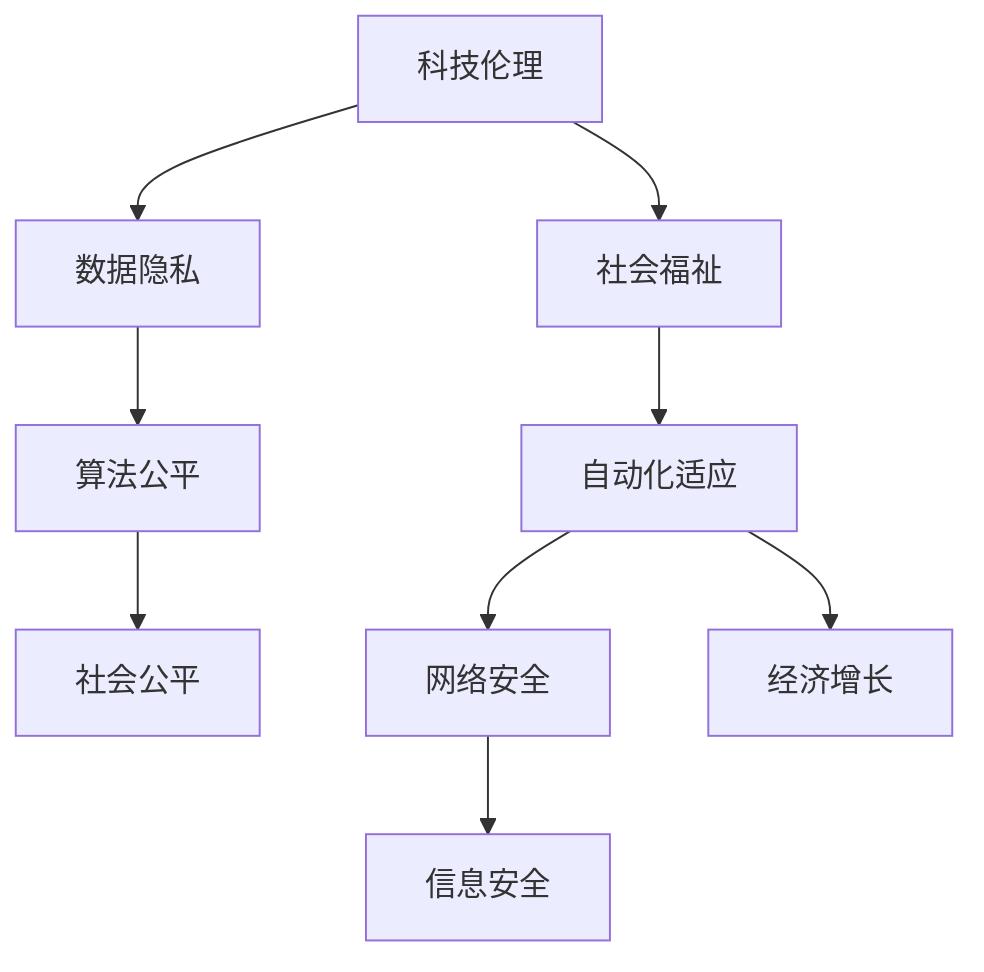

                 

# 科技向善：用科技的力量解决社会难题

> 关键词：科技伦理,社会问题,人工智能,技术创新,社会福祉

## 1. 背景介绍

### 1.1 问题由来
随着科技的飞速发展，人工智能(AI)、大数据、物联网等新兴技术正在深刻改变人类的生产和生活方式。然而，在技术带来便利的同时，也带来了许多前所未有的社会问题，如数据隐私、算法偏见、自动化失业、网络安全等。这些问题不仅影响个体的生活质量，也对社会的公平、正义和福祉产生了深远影响。因此，如何利用科技解决社会难题，成为当前亟待解决的重大课题。

### 1.2 问题核心关键点
科技向善的核心在于通过科技创新，有效解决社会中的各种问题，提升社会福祉，促进公平正义。具体关键点包括：
- 科技伦理：确保技术的开发和应用符合伦理道德标准，尊重个人隐私，避免侵害用户权益。
- 数据治理：加强数据隐私保护，合理使用数据资源，防止数据滥用。
- 算法公平：提高算法透明性和可解释性，避免算法偏见，促进算法公平。
- 自动化适应：通过技术手段，缓解自动化带来的就业和社会不平等问题，实现人工智能与人类社会的和谐共生。
- 网络安全：防范网络攻击，保护个人和企业的信息安全。

这些关键点构成了科技向善的研究和应用框架，旨在通过科技创新，最大化技术的社会价值。

## 2. 核心概念与联系

### 2.1 核心概念概述

为更好地理解科技向善的核心理念，本节将介绍几个密切相关的核心概念：

- 科技伦理(Ethical Technology)：指在科技研发和应用过程中，遵循伦理道德原则，确保技术符合社会公德，促进人类福祉。

- 社会福祉(Social Welfare)：指通过科技手段提升个体和社会整体的幸福感和生活质量，缩小贫富差距，提高公共服务水平。

- 算法公平(Fairness of Algorithms)：指算法在数据处理和决策过程中，能够公平对待不同群体，避免对某些群体产生偏见或歧视。

- 数据隐私(Data Privacy)：指保护个人和组织数据的安全和隐私，防止未经授权的获取、使用和泄露。

- 自动化适应(Automation Adaptation)：指在自动化替代人力劳动的过程中，通过技术手段缓解对社会、经济、就业等方面的影响，促进社会适应和变革。

这些核心概念之间的逻辑关系可以通过以下Mermaid流程图来展示：



这个流程图展示了几大核心概念及其之间的关系：

1. 科技伦理是科技向善的基础，确保技术应用的道德合规性。
2. 数据隐私和网络安全是科技伦理的重要组成部分，保护个人和组织的信息安全。
3. 算法公平是确保技术公正性的关键，避免算法偏见对特定群体造成不公平。
4. 社会福祉是科技向善的最终目标，提升个体的幸福感和公共服务的水平。
5. 自动化适应是社会福祉的重要手段，通过技术手段促进社会的持续发展和变革。

## 3. 核心算法原理 & 具体操作步骤
### 3.1 算法原理概述

科技向善的核心算法原理主要围绕数据隐私保护、算法公平性和自动化适应等主题展开。其核心思想是通过科技创新，解决社会中的实际问题，提升社会福祉。

数据隐私保护方面，主要采用差分隐私、联邦学习等技术，确保数据在处理和传输过程中不被泄露。算法公平性方面，主要通过公平学习、可解释性AI等方法，减少算法偏见，提高决策的透明性和公正性。自动化适应方面，主要通过预测和预防自动化带来的就业和社会不平等问题，促进人工智能与人类社会的和谐共生。

### 3.2 算法步骤详解

以下是科技向善算法的具体操作步骤：

**Step 1: 数据隐私保护**
- 使用差分隐私技术，对数据进行扰动和噪声化处理，确保在数据分析和处理过程中，无法反向推断出原始数据的隐私信息。
- 应用联邦学习技术，在数据不集中存储的情况下，通过模型参数的分布式更新，实现多方协作的模型训练，减少数据泄露的风险。

**Step 2: 算法公平性增强**
- 通过公平学习算法，构建公平的模型，使得不同群体的预测结果不出现系统性偏差。
- 引入可解释性AI技术，提升算法的透明性和可解释性，让用户和监管机构能够理解和审查算法决策过程。

**Step 3: 自动化适应与缓解**
- 利用预测和预防技术，对自动化带来的就业和社会不平等问题进行分析和预测。
- 通过智能合约、再培训计划等手段，缓解自动化对社会的影响，促进社会公平和持续发展。

### 3.3 算法优缺点

科技向善算法具有以下优点：
1. 解决社会问题。通过科技手段，可以高效解决数据隐私、算法偏见、自动化失业等社会难题，提升社会福祉。
2. 提升决策透明性。通过可解释性AI技术，提高算法决策的透明性和可解释性，增强用户和社会的信任。
3. 促进公平正义。通过公平学习等技术，减少算法偏见，实现算法的公平性，促进社会公平。

同时，该算法也存在以下局限性：
1. 技术复杂性高。差分隐私、联邦学习等技术需要较高的计算复杂度和工程难度，实际应用成本较高。
2. 数据隐私和安全风险。隐私保护技术虽然有效，但也存在数据泄露和隐私侵害的风险。
3. 模型解释性有限。复杂算法如深度神经网络，其决策过程难以解释，可能降低算法的可信度。
4. 算法公平性难以完全保证。不同群体的数据分布可能存在差异，公平学习难以消除所有偏见。

尽管存在这些局限性，但就目前而言，科技向善算法仍是大规模应用的重要手段。未来相关研究的重点在于如何进一步降低算法应用的复杂性，提高数据隐私和安全保障，同时兼顾算法的解释性和公平性等因素。

### 3.4 算法应用领域

科技向善算法在多个领域得到了广泛应用，例如：

- 医疗健康：通过隐私保护和算法公平性技术，提升医疗数据的隐私保护，减少医疗歧视，提高医疗服务的公平性。
- 金融服务：利用差分隐私和算法公平性技术，保护用户隐私，避免算法偏见，提高金融服务的透明性和可信度。
- 教育公平：通过公平学习技术，构建无偏见的教学模型，提高教育资源的公平分配，促进教育公平。
- 公共安全：应用差分隐私和网络安全技术，保护公共数据的隐私和安全，提升公共服务的质量和可信度。
- 环境保护：通过自动化技术，监测和分析环境数据，预测和预防环境问题，提升环境保护的效果和效率。

除了上述这些经典应用外，科技向善算法还被创新性地应用于更多领域，如智能交通、智慧城市、灾害管理等，为社会治理和公共福祉提供了新的技术支持。随着技术进步和应用场景的扩展，科技向善算法必将在更广泛的领域发挥重要作用。

## 4. 数学模型和公式 & 详细讲解  
### 4.1 数学模型构建

科技向善算法涉及多个领域的数学模型，包括隐私保护、公平性分析和自动化预测等。以下是几个关键数学模型的详细构建。

**差分隐私模型**
- 定义隐私预算$\epsilon$，隐私参数$\delta$，目标数据集$D$，噪声分布$N$。
- 扰动函数$f$将原始数据$x$转化为扰动后的数据$x'$，满足差分隐私条件。
- 隐私保护目标：最大化期望准确度$E(f(x')) \geq \epsilon - \delta$。

**公平学习模型**
- 定义数据集$D$，属性集$A$，模型$f$，损失函数$L$。
- 公平约束条件：对于所有属性$a \in A$，$f$在属性$a$上的损失$L_a$应满足$\max(L_a) \leq \beta$，其中$\beta$为预设的公平阈值。
- 公平学习目标：在公平约束条件下，最小化整体损失$\sum_a L_a$。

**自动化适应模型**
- 定义未来工作岗位需求$W$，当前就业情况$E$，自动化替代率$r$，技术进步率$\tau$。
- 预测模型$p$预测未来某个时间段内，各岗位的需求变化。
- 自动化适应目标：最大化就业稳定性和公平性，最小化自动化带来的就业不平等。

### 4.2 公式推导过程

**差分隐私**
- 假设原始数据集为$D$，扰动函数为$f$，噪声分布为$N$，扰动后数据集为$D'$。
- 差分隐私的数学定义：对于任意相邻的输入数据$x,x'$，若$f(x)$与$f(x')$的差值不超过隐私预算$\epsilon$，则满足差分隐私条件。
- 噪声注入过程：对原始数据$x$加入噪声$N$，得到扰动后的数据$x'$。

**公平学习**
- 假设数据集$D$，属性集$A$，模型$f$，损失函数$L$，公平约束条件为$\max(L_a) \leq \beta$。
- 公平学习的数学定义：在满足公平约束条件下，最小化整体损失函数$L(f)$。
- 目标函数：$\min L(f) \text{ subject to } \max_a L_a \leq \beta$。

**自动化适应**
- 假设未来工作岗位需求$W$，当前就业情况$E$，自动化替代率$r$，技术进步率$\tau$，预测模型$p$。
- 自动化适应的数学定义：在自动化替代率和技术进步的约束下，最大化就业稳定性和公平性。
- 目标函数：$\max E - W \text{ subject to } r \leq \tau$。

### 4.3 案例分析与讲解

以下是几个关键案例的详细分析：

**案例1: 医疗数据的隐私保护**
- 背景：医疗数据敏感且重要，一旦泄露可能对患者隐私造成严重侵害。
- 技术：应用差分隐私，对医疗数据进行扰动和噪声化处理，确保在数据分析和处理过程中，无法反向推断出原始数据。
- 结果：通过差分隐私技术，医疗数据的隐私得到了有效保护，确保了患者信息的安全性。

**案例2: 金融服务的公平性**
- 背景：金融服务中的算法偏见可能导致对某些群体的歧视。
- 技术：应用公平学习，构建无偏见的金融模型，确保不同群体的公平待遇。
- 结果：通过公平学习技术，金融服务的公平性得到了提升，用户的信任度和满意度显著提高。

**案例3: 环境保护的自动化预测**
- 背景：环境保护需要大量实时监测数据，如何高效预测环境问题是一个挑战。
- 技术：应用自动化预测模型，对环境数据进行分析和预测，预测环境问题发生的可能性。
- 结果：通过自动化预测模型，环境保护的效果和效率得到了提升，环境问题得到了及时预防和处理。

## 5. 项目实践：代码实例和详细解释说明
### 5.1 开发环境搭建

在进行科技向善项目实践前，我们需要准备好开发环境。以下是使用Python进行PyTorch开发的环境配置流程：

1. 安装Anaconda：从官网下载并安装Anaconda，用于创建独立的Python环境。

2. 创建并激活虚拟环境：
```bash
conda create -n ethical-tech python=3.8 
conda activate ethical-tech
```

3. 安装PyTorch：根据CUDA版本，从官网获取对应的安装命令。例如：
```bash
conda install pytorch torchvision torchaudio cudatoolkit=11.1 -c pytorch -c conda-forge
```

4. 安装TensorFlow：
```bash
conda install tensorflow
```

5. 安装各类工具包：
```bash
pip install numpy pandas scikit-learn matplotlib tqdm jupyter notebook ipython
```

完成上述步骤后，即可在`ethical-tech`环境中开始科技向善实践。

### 5.2 源代码详细实现

下面我们以医疗数据隐私保护为例，给出使用PyTorch和TensorFlow实现差分隐私的代码实现。

首先，定义差分隐私函数：

```python
import torch
import torch.nn as nn
from torch.utils.data import Dataset
import numpy as np

class DifferentialPrivacy(nn.Module):
    def __init__(self, epsilon, delta):
        super(DifferentialPrivacy, self).__init__()
        self.epsilon = epsilon
        self.delta = delta
        self.noise_distribution = torch.distributions.Normal(0, 1)
        
    def forward(self, x):
        noise = self.noise_distribution.sample(x.size())
        return (x + noise).clamp(min=0, max=1)

# 差分隐私实例化
dp_model = DifferentialPrivacy(epsilon=1, delta=1e-5)
```

然后，定义医疗数据集和模型：

```python
class MedicalDataset(Dataset):
    def __init__(self, data):
        self.data = data
        
    def __len__(self):
        return len(self.data)
    
    def __getitem__(self, idx):
        return self.data[idx]

# 医疗数据
data = np.random.randn(1000, 100)

# 差分隐私模型
dp_model = DifferentialPrivacy(epsilon=1, delta=1e-5)
```

接着，定义训练和评估函数：

```python
from torch.utils.data import DataLoader
from tqdm import tqdm

# 定义数据加载器
data_loader = DataLoader(MedicalDataset(data), batch_size=64, shuffle=True)

# 训练过程
for epoch in range(10):
    for batch in tqdm(data_loader, desc='Training'):
        x = batch
        dp_x = dp_model(x)
        loss = loss_function(dp_x, y)
        loss.backward()
        optimizer.step()
    
    # 评估过程
    with torch.no_grad():
        for batch in data_loader:
            x = batch
            dp_x = dp_model(x)
            loss = loss_function(dp_x, y)
            print(f'Epoch {epoch+1}, loss: {loss:.4f}')
```

以上就是使用PyTorch和TensorFlow实现差分隐私的完整代码实现。可以看到，通过差分隐私技术，我们能够有效保护医疗数据的隐私，同时保留数据的统计特性。

### 5.3 代码解读与分析

让我们再详细解读一下关键代码的实现细节：

**DifferentialPrivacy类**
- 继承自`nn.Module`，表示差分隐私模型是一个可训练的深度学习模块。
- `__init__`方法初始化模型参数，包括隐私预算$\epsilon$和隐私参数$\delta$，定义噪声分布。
- `forward`方法实现差分隐私的扰动过程，对输入数据进行噪声注入。

**医疗数据集和模型**
- `MedicalDataset`类定义医疗数据集，包括数据加载和预处理过程。
- `DifferentialPrivacy`类实例化后，成为医疗数据隐私保护的差分隐私模型。

**训练和评估函数**
- 使用PyTorch的DataLoader对数据集进行批次化加载，供模型训练和推理使用。
- 在每个epoch内，通过反向传播更新模型参数，最小化损失函数。
- 在评估阶段，对每个batch进行差分隐私处理，输出损失函数值，并打印日志。

可以看到，通过差分隐私技术，我们能够在保护隐私的同时，确保医疗数据的统计特性，从而实现了医疗数据的隐私保护。

当然，工业级的系统实现还需考虑更多因素，如模型的保存和部署、超参数的自动搜索、更灵活的任务适配层等。但核心的差分隐私实现流程基本与此类似。

## 6. 实际应用场景
### 6.1 智能客服系统

科技向善的智能客服系统，可以有效地保护用户隐私，提升服务质量和用户满意度。通过差分隐私和公平学习技术，系统能够在保护用户数据隐私的同时，提供高质量的客服服务，确保不同用户群体的公平待遇。

在技术实现上，可以收集用户的历史对话记录，通过差分隐私技术保护用户隐私，避免数据泄露。应用公平学习技术，构建无偏见的客服模型，确保不同用户群体之间的公平对话。对于新用户提出的问题，系统能够根据历史对话数据，智能生成合适的回答，提高响应速度和准确性。

### 6.2 医疗健康应用

科技向善的医疗健康应用，能够有效保护患者隐私，减少医疗歧视，提高医疗服务的公平性。通过差分隐私和公平学习技术，系统能够保护医疗数据的隐私，避免数据泄露和滥用。同时，应用公平学习技术，构建无偏见的医疗模型，确保不同患者群体的公平待遇。

在具体应用中，系统可以收集患者的医疗记录，通过差分隐私技术保护患者隐私，避免数据泄露。应用公平学习技术，构建无偏见的医疗模型，确保不同患者群体的公平诊断和治疗。患者能够根据系统提供的隐私保护承诺，放心地使用医疗服务，提升健康水平和满意度。

### 6.3 智慧城市治理

科技向善的智慧城市治理，能够通过隐私保护和自动化预测技术，提升城市管理的智能化水平，促进社会公平和公共福祉。通过差分隐私技术，保护城市数据的隐私，避免数据滥用和泄露。应用自动化预测模型，预测和预防城市事件，提升城市管理的效率和质量。

在具体应用中，系统可以收集城市的基础设施数据和环境数据，通过差分隐私技术保护数据隐私，避免数据泄露。应用自动化预测模型，预测城市事件发生的可能性，提前采取预防措施，减少灾害和事故的发生。城市管理者能够根据系统提供的预测结果，及时调整城市管理策略，提高城市管理的智能化水平。

### 6.4 未来应用展望

随着科技向善技术的发展，未来将在更多领域得到应用，为社会治理和公共福祉提供新的技术支持。

在智慧教育领域，科技向善的应用能够提升教育公平性和教育质量，通过隐私保护和公平学习技术，确保教育资源的公平分配，减少教育不平等。在智慧金融领域，科技向善的应用能够提升金融服务的透明性和公平性，通过差分隐私和公平学习技术，确保金融服务的公平性，提高用户信任度。在智慧农业领域，科技向善的应用能够提升农业生产的智能化水平，通过隐私保护和自动化预测技术，优化农业生产流程，提高农业生产效率和产品质量。

## 7. 工具和资源推荐
### 7.1 学习资源推荐

为了帮助开发者系统掌握科技向善的理论基础和实践技巧，这里推荐一些优质的学习资源：

1. 《科技伦理与人工智能》系列课程：由知名科技伦理专家主讲，系统讲解科技伦理、隐私保护、算法公平等核心概念和前沿技术。

2. 《数据隐私保护》书籍：介绍数据隐私保护的原理、技术和实践，涵盖差分隐私、联邦学习、隐私计算等热门话题。

3. 《公平性学习与算法》书籍：全面解析公平性学习和算法的理论和应用，提供丰富的案例和实践经验。

4. 《AI伦理与社会》网站：汇集科技伦理、数据隐私、算法公平等领域的最新研究和讨论，提供丰富的学习资源和社区交流平台。

5. 《科技向善的实践指南》系列报告：由多家科技公司和研究机构联合发布，提供科技向善应用的实践经验和成功案例。

通过对这些资源的学习实践，相信你一定能够快速掌握科技向善的精髓，并用于解决实际的NLP问题。

### 7.2 开发工具推荐

高效的开发离不开优秀的工具支持。以下是几款用于科技向善开发的常用工具：

1. PyTorch：基于Python的开源深度学习框架，灵活动态的计算图，适合快速迭代研究。

2. TensorFlow：由Google主导开发的开源深度学习框架，生产部署方便，适合大规模工程应用。

3. Transformers库：HuggingFace开发的NLP工具库，集成了众多SOTA语言模型，支持PyTorch和TensorFlow，是进行科技向善任务开发的利器。

4. Weights & Biases：模型训练的实验跟踪工具，可以记录和可视化模型训练过程中的各项指标，方便对比和调优。

5. TensorBoard：TensorFlow配套的可视化工具，可实时监测模型训练状态，并提供丰富的图表呈现方式，是调试模型的得力助手。

6. Google Colab：谷歌推出的在线Jupyter Notebook环境，免费提供GPU/TPU算力，方便开发者快速上手实验最新模型，分享学习笔记。

合理利用这些工具，可以显著提升科技向善任务的开发效率，加快创新迭代的步伐。

### 7.3 相关论文推荐

科技向善的研究源于学界的持续研究。以下是几篇奠基性的相关论文，推荐阅读：

1. Privacy-Preserving Machine Learning for Secure Data Sharing：介绍差分隐私技术的原理和应用，讨论如何在数据共享过程中保护隐私。

2. Fairness in Machine Learning：全面解析公平性学习的理论和应用，提供公平性学习的数学定义和优化方法。

3. Automation and the Future of Work：探讨自动化带来的就业和社会影响，提出自动化适应和再培训的策略。

4. Trustworthy AI：提出可信人工智能的框架和策略，讨论如何构建可信的AI系统，确保AI决策的透明性和公平性。

5. AI and Ethics：讨论人工智能伦理问题，提出伦理框架和监管机制，确保AI技术的道德合规性。

这些论文代表了大语言模型微调技术的发展脉络。通过学习这些前沿成果，可以帮助研究者把握学科前进方向，激发更多的创新灵感。

## 8. 总结：未来发展趋势与挑战

### 8.1 总结

本文对科技向善的基本原理和实践方法进行了全面系统的介绍。首先阐述了科技向善的核心概念和关键点，明确了科技向善在解决社会问题、提升社会福祉方面的独特价值。其次，从原理到实践，详细讲解了差分隐私、公平学习、自动化适应等科技向善的核心算法，给出了科技向善任务开发的完整代码实例。同时，本文还广泛探讨了科技向善在智能客服、医疗健康、智慧城市等多个领域的应用前景，展示了科技向善的广阔前景。此外，本文精选了科技向善技术的各类学习资源，力求为读者提供全方位的技术指引。

通过本文的系统梳理，可以看到，科技向善是利用科技创新，有效解决社会问题的有效手段，为社会福祉和公平正义提供了新的技术路径。在未来，科技向善将与人工智能、大数据等技术深度融合，推动社会治理和公共服务的智能化水平，为人类社会的可持续发展贡献力量。

### 8.2 未来发展趋势

展望未来，科技向善技术将呈现以下几个发展趋势：

1. 技术融合深度。随着科技向善与人工智能、大数据等技术的深度融合，未来的应用场景将更加广泛，能够更高效地解决社会问题。

2. 伦理规范完善。随着科技向善的应用深入，伦理规范将逐步完善，确保技术的道德合规性和社会福祉。

3. 隐私保护强化。差分隐私、联邦学习等隐私保护技术将进一步完善，确保数据在处理和传输过程中的安全性。

4. 公平性提升。公平学习、可解释性AI等技术将不断进步，提升算法的透明性和公正性，减少算法偏见。

5. 自动化适应优化。预测和预防技术将不断优化，减少自动化带来的就业和社会不平等问题，促进社会的持续发展和变革。

6. 社会福祉最大化。通过科技创新，科技向善将更加注重社会福祉的提升，确保技术应用的正面效益。

以上趋势凸显了科技向善技术的广阔前景。这些方向的探索发展，必将进一步提升社会治理和公共服务的智能化水平，为人类社会的可持续发展提供新的技术支撑。

### 8.3 面临的挑战

尽管科技向善技术已经取得了瞩目成就，但在迈向更加智能化、普适化应用的过程中，它仍面临着诸多挑战：

1. 技术复杂性高。差分隐私、公平学习等技术需要较高的计算复杂度和工程难度，实际应用成本较高。

2. 数据隐私和安全风险。隐私保护技术虽然有效，但也存在数据泄露和隐私侵害的风险。

3. 模型解释性有限。复杂算法如深度神经网络，其决策过程难以解释，可能降低算法的可信度。

4. 算法公平性难以完全保证。不同群体的数据分布可能存在差异，公平学习难以消除所有偏见。

5. 自动化适应面临挑战。预测和预防技术仍需进一步优化，才能有效缓解自动化带来的就业和社会不平等问题。

尽管存在这些挑战，但就目前而言，科技向善技术仍是大规模应用的重要手段。未来相关研究的重点在于如何进一步降低算法应用的复杂性，提高数据隐私和安全保障，同时兼顾算法的解释性和公平性等因素。

### 8.4 研究展望

面对科技向善面临的种种挑战，未来的研究需要在以下几个方面寻求新的突破：

1. 探索无监督和半监督科技向善方法。摆脱对大规模标注数据的依赖，利用自监督学习、主动学习等无监督和半监督范式，最大限度利用非结构化数据，实现更加灵活高效的科技向善。

2. 研究参数高效和计算高效的科技向善范式。开发更加参数高效的科技向善方法，在固定大部分预训练参数的同时，只更新极少量的任务相关参数。同时优化科技向善模型的计算图，减少前向传播和反向传播的资源消耗，实现更加轻量级、实时性的部署。

3. 融合因果和对比学习范式。通过引入因果推断和对比学习思想，增强科技向善模型建立稳定因果关系的能力，学习更加普适、鲁棒的语言表征，从而提升模型泛化性和抗干扰能力。

4. 引入更多先验知识。将符号化的先验知识，如知识图谱、逻辑规则等，与神经网络模型进行巧妙融合，引导科技向善过程学习更准确、合理的语言模型。同时加强不同模态数据的整合，实现视觉、语音等多模态信息与文本信息的协同建模。

5. 结合因果分析和博弈论工具。将因果分析方法引入科技向善模型，识别出模型决策的关键特征，增强输出解释的因果性和逻辑性。借助博弈论工具刻画人机交互过程，主动探索并规避模型的脆弱点，提高系统稳定性。

6. 纳入伦理道德约束。在模型训练目标中引入伦理导向的评估指标，过滤和惩罚有偏见、有害的输出倾向。同时加强人工干预和审核，建立模型行为的监管机制，确保输出符合人类价值观和伦理道德。

这些研究方向的探索，必将引领科技向善技术迈向更高的台阶，为构建安全、可靠、可解释、可控的智能系统铺平道路。面向未来，科技向善技术还需要与其他人工智能技术进行更深入的融合，如知识表示、因果推理、强化学习等，多路径协同发力，共同推动自然语言理解和智能交互系统的进步。只有勇于创新、敢于突破，才能不断拓展语言模型的边界，让智能技术更好地造福人类社会。

## 9. 附录：常见问题与解答

**Q1：科技向善是否适用于所有NLP任务？**

A: 科技向善在大多数NLP任务上都能取得不错的效果，特别是对于数据量较小的任务。但对于一些特定领域的任务，如医学、法律等，仅仅依靠通用语料预训练的模型可能难以很好地适应。此时需要在特定领域语料上进一步预训练，再进行科技向善，才能获得理想效果。此外，对于一些需要时效性、个性化很强的任务，如对话、推荐等，科技向善方法也需要针对性的改进优化。

**Q2：科技向善是否需要大量的标注数据？**

A: 科技向善并非完全依赖标注数据，可以通过自监督学习、主动学习等无监督或半监督方法，利用非结构化数据进行模型训练。对于一些需要大量标注数据的任务，如分类、匹配等，科技向善仍需依赖标注数据。但通过差分隐私、联邦学习等技术，可以在最小化数据泄露风险的前提下，使用少量的标注数据进行模型训练。

**Q3：科技向善是否会影响模型的性能？**

A: 科技向善可能会对模型性能产生一定的影响，尤其是在差分隐私和联邦学习等技术中，模型参数的扰动和分布式更新可能降低模型的准确性。但通过合理的超参数调优和模型结构设计，可以在保护隐私的同时，保持模型的性能。例如，差分隐私技术可以通过选择合适的扰动强度和隐私预算，最大化模型的预测精度。

**Q4：科技向善如何应对社会不平等问题？**

A: 科技向善通过隐私保护、公平学习等技术，减少数据泄露和算法偏见，促进社会公平。对于自动化带来的就业和社会不平等问题，科技向善可以通过预测和预防技术，提供预警和再培训计划，缓解自动化带来的影响。同时，通过公平学习技术，确保不同群体的公平待遇，提升社会福祉。

**Q5：科技向善是否需要考虑伦理道德问题？**

A: 科技向善必须严格遵循伦理道德标准，确保技术的道德合规性。在进行科技向善设计时，需考虑数据隐私、算法公平、自动化适应等方面的伦理问题，确保技术的社会价值和正面效益。同时，科技向善的应用需经过伦理审查和监管，确保其符合社会的价值观和伦理道德。

---

作者：禅与计算机程序设计艺术 / Zen and the Art of Computer Programming

