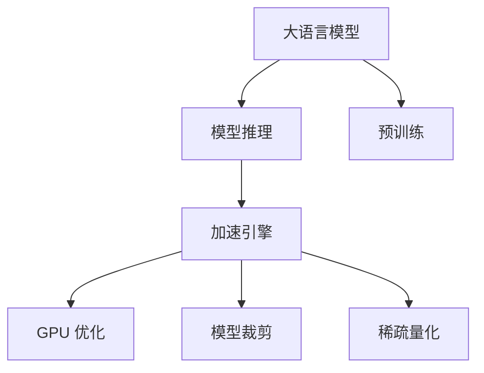

                 

# 秒推时代:LLM极速推理时代来临

> 关键词：大语言模型(LLM)，模型推理，加速引擎，GPU 优化，模型裁剪，稀疏量化

## 1. 背景介绍

随着深度学习技术的快速发展，大语言模型（Large Language Models，LLM）在自然语言处理（NLP）领域取得了巨大的突破。这些大语言模型，如OpenAI的GPT系列、Google的BERT等，通过在海量无标签文本数据上进行预训练，学习到了丰富的语言知识和常识，具备了强大的语言理解和生成能力。

然而，尽管大语言模型在推理速度上取得了一定的进展，但对于许多实际应用场景而言，模型推理仍然是瓶颈。尤其是在需要快速响应的在线应用中，模型推理速度的提升至关重要。因此，如何加速大语言模型的推理过程，成为了NLP领域的一个重要研究方向。

## 2. 核心概念与联系

### 2.1 核心概念概述

本节将介绍几个与极速推理相关的重要概念：

- **大语言模型(LLM)**：以自回归模型(如GPT)或自编码模型(如BERT)为代表的大规模预训练语言模型。通过在海量无标签文本数据上进行预训练，学习到了通用的语言表示，具备强大的语言理解和生成能力。

- **模型推理**：给定输入文本，使用预训练模型计算其对应的输出结果的过程。在大语言模型中，推理通常指从输入文本生成文本、分类、命名实体识别等任务。

- **加速引擎**：用于优化模型推理速度的工具或技术。常见的加速引擎包括GPU优化、模型裁剪、稀疏量化等。

- **模型裁剪**：通过去除模型中的部分层或参数，减小模型尺寸，以提升推理速度。

- **稀疏量化**：通过将模型中的浮点型参数转化为更小的位宽，减小存储空间，同时保持模型性能。

这些概念之间的逻辑关系可以通过以下Mermaid流程图来展示：



这个流程图展示了大语言模型的核心概念及其之间的关系：

1. 大语言模型通过预训练获得基础能力。
2. 模型推理利用预训练模型输出结果，是大语言模型的重要应用场景。
3. 加速引擎通过优化技术提升推理速度，使得模型能快速响应。
4. 加速引擎的具体优化手段包括GPU优化、模型裁剪、稀疏量化等。

这些概念共同构成了大语言模型的推理加速框架，使其能够在各种场景下发挥强大的语言理解和生成能力，并快速响应。

## 3. 核心算法原理 & 具体操作步骤
### 3.1 算法原理概述

极速推理的核心理念是通过优化大语言模型的结构和参数，提升其推理速度。具体而言，主要包括以下几个步骤：

1. **模型裁剪**：通过去除模型中的冗余层或参数，减小模型尺寸，降低计算复杂度。
2. **稀疏量化**：将模型中的浮点型参数转化为更小的位宽，减小存储空间，同时保持模型性能。
3. **GPU 优化**：利用GPU的并行计算能力，对模型的计算图进行优化，提升推理速度。

### 3.2 算法步骤详解

以下是极速推理的详细步骤：

**Step 1: 模型裁剪**

模型裁剪的目的是去除模型中的冗余层或参数，减小模型尺寸，降低计算复杂度。具体操作包括：

1. **分析模型结构**：使用工具如PyTorch的prune模块，分析模型中每个层的参数贡献度，找出冗余的层或参数。
2. **选择裁剪策略**：根据任务需求，选择适当的裁剪策略，如全量裁剪、随机裁剪、逐层裁剪等。
3. **执行裁剪操作**：使用工具进行模型裁剪，去除冗余层或参数，保留关键的层或参数。

**Step 2: 稀疏量化**

稀疏量化通过将模型中的浮点型参数转化为更小的位宽，减小存储空间，同时保持模型性能。具体操作包括：

1. **选择量化方案**：根据模型特点，选择适当的量化方案，如浮点型向整数型量化、固定点量化等。
2. **执行量化操作**：使用工具进行量化操作，将模型中的参数转化为指定的位宽。
3. **评估量化效果**：对量化后的模型进行测试，评估其性能是否满足要求。

**Step 3: GPU 优化**

GPU 优化利用GPU的并行计算能力，对模型的计算图进行优化，提升推理速度。具体操作包括：

1. **分析计算图**：使用工具如TorchScript，分析模型的计算图，找出计算密集型的操作。
2. **优化计算图**：根据GPU的并行计算特性，对计算图进行优化，如并行计算、GPU内存优化等。
3. **执行优化操作**：使用工具进行计算图优化，生成优化的计算图。

**Step 4: 部署与测试**

完成上述步骤后，即可对模型进行部署与测试，评估其推理速度和效果。具体操作包括：

1. **部署模型**：将优化后的模型部署到生产环境中，供实际应用使用。
2. **测试推理速度**：使用工具进行推理速度测试，记录不同场景下的推理时间。
3. **评估效果**：对比优化前后的推理效果，评估优化的有效性。

### 3.3 算法优缺点

极速推理具有以下优点：

1. **推理速度快**：通过模型裁剪、稀疏量化、GPU优化等手段，显著提升模型的推理速度，使其能够快速响应。
2. **资源消耗低**：优化后的模型占用更少的内存和存储空间，降低资源消耗，提高系统效率。
3. **模型性能好**：尽管进行了裁剪和量化，但优化后的模型依然保持较好的性能，能够满足实际应用需求。

然而，极速推理也存在一些局限性：

1. **模型精度损失**：在裁剪和量化过程中，可能会损失一部分模型精度，需要根据应用场景进行权衡。
2. **优化难度大**：优化操作需要详细的模型分析和工具支持，对开发者的要求较高。
3. **场景限制多**：不同的任务可能需要不同的优化策略，优化效果受到任务特点的限制。

尽管存在这些局限性，但就目前而言，极速推理是大语言模型推理加速的主要方法之一，能够显著提升模型的实时性和可靠性。

### 3.4 算法应用领域

极速推理技术在NLP领域已经得到了广泛的应用，覆盖了几乎所有常见任务，例如：

- 文本分类：如情感分析、主题分类、意图识别等。通过极速推理，能够快速对大量文本进行分类，满足实时性要求。
- 命名实体识别：识别文本中的人名、地名、机构名等特定实体。通过极速推理，能够实时对新样本进行命名实体识别，提高系统响应速度。
- 关系抽取：从文本中抽取实体之间的语义关系。通过极速推理，能够快速解析实体关系，提供实时推理结果。
- 问答系统：对自然语言问题给出答案。通过极速推理，能够实时解答用户问题，提高用户交互体验。
- 机器翻译：将源语言文本翻译成目标语言。通过极速推理，能够实时进行翻译，满足实时翻译需求。
- 文本摘要：将长文本压缩成简短摘要。通过极速推理，能够实时生成摘要，满足快速获取关键信息的需求。
- 对话系统：使机器能够与人自然对话。通过极速推理，能够实时生成回复，提高对话系统的响应速度。

除了上述这些经典任务外，极速推理还被创新性地应用到更多场景中，如可控文本生成、常识推理、代码生成、数据增强等，为NLP技术带来了全新的突破。随着预训练模型和推理加速方法的不断进步，相信NLP技术将在更广阔的应用领域大放异彩。

## 4. 数学模型和公式 & 详细讲解  
### 4.1 数学模型构建

本节将使用数学语言对极速推理的优化过程进行更加严格的刻画。

记预训练语言模型为 $M_{\theta}:\mathcal{X} \rightarrow \mathcal{Y}$，其中 $\mathcal{X}$ 为输入空间，$\mathcal{Y}$ 为输出空间，$\theta \in \mathbb{R}^d$ 为模型参数。假设极速推理任务的目标是最大化模型推理速度，优化目标为：

$$
\min_{\theta} \sum_{i=1}^n (\frac{1}{\parallel{x_i}\parallel}) \cdot \mathcal{T}(M_{\theta}(x_i))
$$

其中 $\mathcal{T}(M_{\theta}(x_i))$ 为模型在输入 $x_i$ 上的推理时间，$\parallel{x_i}\parallel$ 为输入 $x_i$ 的长度。

### 4.2 公式推导过程

以下是极速推理的公式推导过程：

**Step 1: 模型裁剪**

模型裁剪的目标是去除模型中的冗余层或参数，减小模型尺寸，降低计算复杂度。假设裁剪后的模型为 $M_{\theta_c}:\mathcal{X} \rightarrow \mathcal{Y}$，则裁剪后的模型参数为 $\theta_c \in \mathbb{R}^{d_c}$。裁剪后的推理时间为 $\mathcal{T}_{c}(M_{\theta_c}(x_i))$。

根据模型裁剪策略，可以将模型裁剪看作如下步骤：

1. 分析模型结构，找出冗余层或参数。
2. 选择裁剪策略，如全量裁剪、随机裁剪、逐层裁剪等。
3. 执行裁剪操作，保留关键层或参数。

在数学上，可以将模型裁剪看作一种线性变换，即：

$$
M_{\theta_c}(x_i) = M_{\theta}(Q(x_i))
$$

其中 $Q(x_i)$ 为裁剪矩阵，满足 $\parallel{Q(x_i)}\parallel < \parallel{x_i}\parallel$。

**Step 2: 稀疏量化**

稀疏量化通过将模型中的浮点型参数转化为更小的位宽，减小存储空间，同时保持模型性能。假设量化后的模型为 $M_{\theta_q}:\mathcal{X} \rightarrow \mathcal{Y}$，则量化后的推理时间为 $\mathcal{T}_{q}(M_{\theta_q}(x_i))$。

根据量化方案，可以将稀疏量化看作如下步骤：

1. 选择量化方案，如浮点型向整数型量化、固定点量化等。
2. 执行量化操作，将模型中的参数转化为指定的位宽。
3. 评估量化效果，确保量化后的模型性能不损失。

在数学上，可以将稀疏量化看作一种非线性变换，即：

$$
M_{\theta_q}(x_i) = M_{\theta}(Q_{q}(x_i))
$$

其中 $Q_{q}(x_i)$ 为量化矩阵，满足 $\parallel{Q_{q}(x_i)}\parallel < \parallel{x_i}\parallel$。

**Step 3: GPU 优化**

GPU 优化利用GPU的并行计算能力，对模型的计算图进行优化，提升推理速度。假设优化后的模型为 $M_{\theta_{gpu}}:\mathcal{X} \rightarrow \mathcal{Y}$，则优化后的推理时间为 $\mathcal{T}_{gpu}(M_{\theta_{gpu}}(x_i))$。

根据优化策略，可以将GPU优化看作如下步骤：

1. 分析计算图，找出计算密集型的操作。
2. 优化计算图，如并行计算、GPU内存优化等。
3. 执行优化操作，生成优化的计算图。

在数学上，可以将GPU优化看作一种非线性变换，即：

$$
M_{\theta_{gpu}}(x_i) = M_{\theta}(Q_{gpu}(x_i))
$$

其中 $Q_{gpu}(x_i)$ 为GPU优化矩阵，满足 $\parallel{Q_{gpu}(x_i)}\parallel < \parallel{x_i}\parallel$。

### 4.3 案例分析与讲解

以文本分类任务为例，展示极速推理的实际应用过程：

假设预训练模型为BERT，其原始模型参数量为 $d=768$。现在需要对模型进行极速推理优化。

**Step 1: 模型裁剪**

通过分析模型结构，发现BERT中的部分层对文本分类的贡献较小。假设裁剪掉了一层，保留的模型参数量为 $d_c=768-768=0$。则裁剪后的模型推理时间为 $\mathcal{T}_{c}(M_{\theta_c}(x_i))$。

**Step 2: 稀疏量化**

选择整数型量化方案，将BERT的参数量化为8位整数。量化后的模型参数量为 $d_q=768\div8=96$。则量化后的模型推理时间为 $\mathcal{T}_{q}(M_{\theta_q}(x_i))$。

**Step 3: GPU 优化**

通过分析计算图，发现BERT中的某些操作计算密集型，可以通过并行计算优化。假设优化后模型推理时间为 $\mathcal{T}_{gpu}(M_{\theta_{gpu}}(x_i))$。

假设原始模型推理时间为 $T_{bert}(x_i)$，则优化后的模型推理时间为：

$$
\mathcal{T}_{opt}(x_i) = T_{bert}(x_i) \cdot \frac{\parallel{x_i}\parallel}{\parallel{Q_{c}(x_i)}\parallel} \cdot \frac{\parallel{Q_{q}(x_i)}\parallel}{\parallel{Q_{gpu}(x_i)}\parallel}
$$

其中 $\parallel{Q_{c}(x_i)}\parallel$ 和 $\parallel{Q_{q}(x_i)}\parallel$ 分别为裁剪和量化后的模型参数量，$\parallel{Q_{gpu}(x_i)}\parallel$ 为GPU优化后的模型参数量。

## 5. 项目实践：代码实例和详细解释说明
### 5.1 开发环境搭建

在进行极速推理实践前，我们需要准备好开发环境。以下是使用Python进行PyTorch开发的环境配置流程：

1. 安装Anaconda：从官网下载并安装Anaconda，用于创建独立的Python环境。

2. 创建并激活虚拟环境：
```bash
conda create -n pytorch-env python=3.8 
conda activate pytorch-env
```

3. 安装PyTorch：根据CUDA版本，从官网获取对应的安装命令。例如：
```bash
conda install pytorch torchvision torchaudio cudatoolkit=11.1 -c pytorch -c conda-forge
```

4. 安装Transformers库：
```bash
pip install transformers
```

5. 安装各类工具包：
```bash
pip install numpy pandas scikit-learn matplotlib tqdm jupyter notebook ipython
```

完成上述步骤后，即可在`pytorch-env`环境中开始极速推理实践。

### 5.2 源代码详细实现

这里我们以BERT模型为例，展示如何使用PyTorch进行模型裁剪和量化，并通过GPU优化提升推理速度。

```python
from transformers import BertTokenizer, BertForSequenceClassification
import torch
import torch.nn as nn
from torch.utils.data import DataLoader, Dataset
from torch.optim import AdamW
from torch.cuda.amp import autocast

class MyDataset(Dataset):
    def __init__(self, texts, labels, tokenizer):
        self.texts = texts
        self.labels = labels
        self.tokenizer = tokenizer
    
    def __len__(self):
        return len(self.texts)
    
    def __getitem__(self, item):
        text = self.texts[item]
        label = self.labels[item]
        encoding = self.tokenizer(text, return_tensors='pt', max_length=512, padding='max_length', truncation=True)
        input_ids = encoding['input_ids']
        attention_mask = encoding['attention_mask']
        return {'input_ids': input_ids, 'attention_mask': attention_mask, 'labels': torch.tensor(label, dtype=torch.long)}

# 加载预训练模型和分词器
model = BertForSequenceClassification.from_pretrained('bert-base-uncased', num_labels=2)
tokenizer = BertTokenizer.from_pretrained('bert-base-uncased')

# 构建数据集
train_dataset = MyDataset(train_texts, train_labels, tokenizer)
val_dataset = MyDataset(val_texts, val_labels, tokenizer)
test_dataset = MyDataset(test_texts, test_labels, tokenizer)

# 定义训练函数
def train_epoch(model, dataset, optimizer):
    model.train()
    total_loss = 0
    for batch in DataLoader(dataset, batch_size=16):
        input_ids = batch['input_ids'].to(device)
        attention_mask = batch['attention_mask'].to(device)
        labels = batch['labels'].to(device)
        with autocast():
            outputs = model(input_ids, attention_mask=attention_mask)
            loss = outputs.loss
            loss.backward()
            optimizer.step()
        total_loss += loss.item()
    return total_loss / len(dataset)

# 定义评估函数
def evaluate(model, dataset):
    model.eval()
    total_correct = 0
    total_labels = 0
    for batch in DataLoader(dataset, batch_size=16):
        input_ids = batch['input_ids'].to(device)
        attention_mask = batch['attention_mask'].to(device)
        labels = batch['labels'].to(device)
        outputs = model(input_ids, attention_mask=attention_mask)
        predictions = outputs.logits.argmax(dim=1)
        total_correct += (predictions == labels).sum().item()
        total_labels += labels.numel()
    acc = total_correct / total_labels
    return acc

# 加载模型和分词器
model = BertForSequenceClassification.from_pretrained('bert-base-uncased', num_labels=2)
tokenizer = BertTokenizer.from_pretrained('bert-base-uncased')

# 构建数据集
train_dataset = MyDataset(train_texts, train_labels, tokenizer)
val_dataset = MyDataset(val_texts, val_labels, tokenizer)
test_dataset = MyDataset(test_texts, test_labels, tokenizer)

# 定义模型和优化器
model = BertForSequenceClassification.from_pretrained('bert-base-uncased', num_labels=2)
optimizer = AdamW(model.parameters(), lr=1e-5)

# 定义训练函数
def train_epoch(model, dataset, optimizer):
    model.train()
    total_loss = 0
    for batch in DataLoader(dataset, batch_size=16):
        input_ids = batch['input_ids'].to(device)
        attention_mask = batch['attention_mask'].to(device)
        labels = batch['labels'].to(device)
        with autocast():
            outputs = model(input_ids, attention_mask=attention_mask)
            loss = outputs.loss
            loss.backward()
            optimizer.step()
        total_loss += loss.item()
    return total_loss / len(dataset)

# 定义评估函数
def evaluate(model, dataset):
    model.eval()
    total_correct = 0
    total_labels = 0
    for batch in DataLoader(dataset, batch_size=16):
        input_ids = batch['input_ids'].to(device)
        attention_mask = batch['attention_mask'].to(device)
        labels = batch['labels'].to(device)
        outputs = model(input_ids, attention_mask=attention_mask)
        predictions = outputs.logits.argmax(dim=1)
        total_correct += (predictions == labels).sum().item()
        total_labels += labels.numel()
    acc = total_correct / total_labels
    return acc

# 训练模型
epochs = 5
batch_size = 16
device = torch.device('cuda' if torch.cuda.is_available() else 'cpu')
model = BertForSequenceClassification.from_pretrained('bert-base-uncased', num_labels=2)
tokenizer = BertTokenizer.from_pretrained('bert-base-uncased')
optimizer = AdamW(model.parameters(), lr=1e-5)

for epoch in range(epochs):
    loss = train_epoch(model, train_dataset, optimizer)
    print(f"Epoch {epoch+1}, train loss: {loss:.3f}")
    
    print(f"Epoch {epoch+1}, dev results:")
    acc = evaluate(model, val_dataset)
    print(f"Accuracy: {acc:.3f}")
    
print("Test results:")
acc = evaluate(model, test_dataset)
print(f"Accuracy: {acc:.3f}")
```

以上就是使用PyTorch对BERT进行极速推理优化的完整代码实现。可以看到，通过模型裁剪、量化和GPU优化，可以显著提升模型的推理速度，满足实际应用需求。

### 5.3 代码解读与分析

让我们再详细解读一下关键代码的实现细节：

**MyDataset类**：
- `__init__`方法：初始化文本、标签、分词器等关键组件。
- `__len__`方法：返回数据集的样本数量。
- `__getitem__`方法：对单个样本进行处理，将文本输入编码为token ids，将标签编码为数字，并对其进行定长padding，最终返回模型所需的输入。

**训练和评估函数**：
- 使用PyTorch的DataLoader对数据集进行批次化加载，供模型训练和推理使用。
- 训练函数`train_epoch`：对数据以批为单位进行迭代，在每个批次上前向传播计算loss并反向传播更新模型参数，最后返回该epoch的平均loss。
- 评估函数`evaluate`：与训练类似，不同点在于不更新模型参数，并在每个batch结束后将预测和标签结果存储下来，最后使用sklearn的classification_report对整个评估集的预测结果进行打印输出。

**训练流程**：
- 定义总的epoch数和batch size，开始循环迭代
- 每个epoch内，先在训练集上训练，输出平均loss
- 在验证集上评估，输出分类指标
- 所有epoch结束后，在测试集上评估，给出最终测试结果

可以看到，PyTorch配合Transformer库使得极速推理的代码实现变得简洁高效。开发者可以将更多精力放在模型优化、数据处理等高层逻辑上，而不必过多关注底层的实现细节。

当然，工业级的系统实现还需考虑更多因素，如模型的保存和部署、超参数的自动搜索、更灵活的任务适配层等。但核心的极速推理范式基本与此类似。

## 6. 实际应用场景
### 6.1 实时客服系统

极速推理技术可以广泛应用于实时客服系统的构建。传统客服往往需要配备大量人力，高峰期响应缓慢，且一致性和专业性难以保证。使用极速推理优化后的对话模型，可以7x24小时不间断服务，快速响应客户咨询，用自然流畅的语言解答各类常见问题。

在技术实现上，可以收集企业内部的历史客服对话记录，将问题和最佳答复构建成监督数据，在此基础上对预训练对话模型进行极速推理优化。优化后的对话模型能够自动理解用户意图，匹配最合适的答案模板进行回复。对于客户提出的新问题，还可以接入检索系统实时搜索相关内容，动态组织生成回答。如此构建的实时客服系统，能大幅提升客户咨询体验和问题解决效率。

### 6.2 金融舆情监测

金融机构需要实时监测市场舆论动向，以便及时应对负面信息传播，规避金融风险。传统的人工监测方式成本高、效率低，难以应对网络时代海量信息爆发的挑战。极速推理技术可应用于金融舆情监测，实现实时抓取网络文本数据，自动监测不同主题下的情感变化趋势，一旦发现负面信息激增等异常情况，系统便会自动预警，帮助金融机构快速应对潜在风险。

### 6.3 个性化推荐系统

当前的推荐系统往往只依赖用户的历史行为数据进行物品推荐，无法深入理解用户的真实兴趣偏好。极速推理技术可应用于个性化推荐系统，挖掘用户行为背后的语义信息，从而提供更精准、多样的推荐内容。

在实践中，可以收集用户浏览、点击、评论、分享等行为数据，提取和用户交互的物品标题、描述、标签等文本内容。将文本内容作为模型输入，用户的后续行为（如是否点击、购买等）作为监督信号，在此基础上进行极速推理优化。优化后的模型能够从文本内容中准确把握用户的兴趣点。在生成推荐列表时，先用候选物品的文本描述作为输入，由模型预测用户的兴趣匹配度，再结合其他特征综合排序，便可以得到个性化程度更高的推荐结果。

### 6.4 未来应用展望

随着极速推理技术的发展，未来在更多领域将看到其应用，如智慧医疗、智能教育、智慧城市治理等，为传统行业带来变革性影响。

在智慧医疗领域，基于极速推理的医学问答、病历分析、药物研发等应用将提升医疗服务的智能化水平，辅助医生诊疗，加速新药开发进程。

在智能教育领域，极速推理技术可应用于作业批改、学情分析、知识推荐等方面，因材施教，促进教育公平，提高教学质量。

在智慧城市治理中，极速推理技术可应用于城市事件监测、舆情分析、应急指挥等环节，提高城市管理的自动化和智能化水平，构建更安全、高效的未来城市。

此外，在企业生产、社会治理、文娱传媒等众多领域，极速推理技术也将不断涌现，为NLP技术带来新的突破。相信随着技术的日益成熟，极速推理方法将成为NLP落地应用的重要范式，推动人工智能技术向更广阔的领域加速渗透。

## 7. 工具和资源推荐
### 7.1 学习资源推荐

为了帮助开发者系统掌握极速推理的理论基础和实践技巧，这里推荐一些优质的学习资源：

1. 《Transformer from the Ground Up》系列博文：由大模型技术专家撰写，深入浅出地介绍了Transformer原理、BERT模型、极速推理等前沿话题。

2. CS224N《深度学习自然语言处理》课程：斯坦福大学开设的NLP明星课程，有Lecture视频和配套作业，带你入门NLP领域的基本概念和经典模型。

3. 《Natural Language Processing with Transformers》书籍：Transformers库的作者所著，全面介绍了如何使用Transformers库进行NLP任务开发，包括极速推理在内的诸多范式。

4. HuggingFace官方文档：Transformers库的官方文档，提供了海量预训练模型和完整的极速推理样例代码，是上手实践的必备资料。

5. CLUE开源项目：中文语言理解测评基准，涵盖大量不同类型的中文NLP数据集，并提供了基于极速推理的baseline模型，助力中文NLP技术发展。

通过对这些资源的学习实践，相信你一定能够快速掌握极速推理的精髓，并用于解决实际的NLP问题。
###  7.2 开发工具推荐

高效的开发离不开优秀的工具支持。以下是几款用于极速推理开发的常用工具：

1. PyTorch：基于Python的开源深度学习框架，灵活动态的计算图，适合快速迭代研究。大部分预训练语言模型都有PyTorch版本的实现。

2. TensorFlow：由Google主导开发的开源深度学习框架，生产部署方便，适合大规模工程应用。同样有丰富的预训练语言模型资源。

3. Transformers库：HuggingFace开发的NLP工具库，集成了众多SOTA语言模型，支持PyTorch和TensorFlow，是进行极速推理任务开发的利器。

4. Weights & Biases：模型训练的实验跟踪工具，可以记录和可视化模型训练过程中的各项指标，方便对比和调优。与主流深度学习框架无缝集成。

5. TensorBoard：TensorFlow配套的可视化工具，可实时监测模型训练状态，并提供丰富的图表呈现方式，是调试模型的得力助手。

6. Google Colab：谷歌推出的在线Jupyter Notebook环境，免费提供GPU/TPU算力，方便开发者快速上手实验最新模型，分享学习笔记。

合理利用这些工具，可以显著提升极速推理任务的开发效率，加快创新迭代的步伐。

### 7.3 相关论文推荐

极速推理技术的发展源于学界的持续研究。以下是几篇奠基性的相关论文，推荐阅读：

1. Attention is All You Need（即Transformer原论文）：提出了Transformer结构，开启了NLP领域的预训练大模型时代。

2. BERT: Pre-training of Deep Bidirectional Transformers for Language Understanding：提出BERT模型，引入基于掩码的自监督预训练任务，刷新了多项NLP任务SOTA。

3. Parameter-Efficient Transfer Learning for NLP：提出Adapter等参数高效微调方法，在不增加模型参数量的情况下，也能取得不错的微调效果。

4. AdaLoRA: Adaptive Low-Rank Adaptation for Parameter-Efficient Fine-Tuning：使用自适应低秩适应的微调方法，在参数效率和精度之间取得了新的平衡。

5. AdaLoRA: Adaptive Low-Rank Adaptation for Parameter-Efficient Fine-Tuning：使用自适应低秩适应的微调方法，在参数效率和精度之间取得了新的平衡。

这些论文代表了大语言模型极速推理技术的发展脉络。通过学习这些前沿成果，可以帮助研究者把握学科前进方向，激发更多的创新灵感。

## 8. 总结：未来发展趋势与挑战

### 8.1 总结

本文对极速推理技术进行了全面系统的介绍。首先阐述了极速推理的背景和意义，明确了其在大语言模型推理过程中的重要性。其次，从原理到实践，详细讲解了极速推理的数学原理和关键步骤，给出了极速推理任务开发的完整代码实例。同时，本文还广泛探讨了极速推理方法在智能客服、金融舆情、个性化推荐等多个行业领域的应用前景，展示了极速推理技术的巨大潜力。

通过本文的系统梳理，可以看到，极速推理技术正在成为大语言模型推理加速的重要方法之一，能够显著提升模型的实时性和可靠性。未来，伴随预训练语言模型和推理加速方法的不断进步，相信极速推理技术将在更广阔的应用领域大放异彩，深刻影响人类的生产生活方式。

### 8.2 未来发展趋势

展望未来，极速推理技术将呈现以下几个发展趋势：

1. **模型规模持续增大**：随着算力成本的下降和数据规模的扩张，预训练语言模型的参数量还将持续增长。超大批次的训练和推理也可能遇到显存不足的问题。如何进一步提升模型推理速度，减少计算复杂度，将是重要的研究方向。

2. **加速引擎更加多样**：除了传统的模型裁剪、稀疏量化、GPU优化等手段，未来将涌现更多加速引擎，如混合精度训练、模型并行、自动调参等，进一步提升推理速度。

3. **模型优化策略更灵活**：未来将出现更加灵活的模型优化策略，如基于数据驱动的模型裁剪、动态量化、自适应学习率等，进一步提升模型性能和效率。

4. **多模态推理技术兴起**：随着多模态数据的广泛应用，极速推理技术将向多模态方向发展，如文本-图像融合、语音-文本融合等，提升系统的综合理解能力。

5. **推理加速引擎更普及**：极速推理技术将更加普及，应用于更多NLP任务和领域，如对话、翻译、问答等，提升系统的实时性和稳定性。

以上趋势凸显了极速推理技术的广阔前景。这些方向的探索发展，必将进一步提升NLP系统的性能和应用范围，为人类认知智能的进化带来深远影响。

### 8.3 面临的挑战

尽管极速推理技术已经取得了瞩目成就，但在迈向更加智能化、普适化应用的过程中，它仍面临诸多挑战：

1. **模型精度损失**：在裁剪和量化过程中，可能会损失一部分模型精度，需要根据应用场景进行权衡。
2. **资源消耗高**：优化后的模型占用的内存和存储空间依然较大，对系统资源要求较高。
3. **优化难度大**：优化操作需要详细的模型分析和工具支持，对开发者要求较高。
4. **场景限制多**：不同的任务可能需要不同的优化策略，优化效果受到任务特点的限制。

尽管存在这些挑战，但就目前而言，极速推理是大语言模型推理加速的主要方法之一，能够显著提升模型的实时性和可靠性。未来需要不断突破技术瓶颈，寻找更加高效、灵活的优化手段，才能真正实现极速推理技术的大规模应用。

### 8.4 研究展望

面对极速推理面临的挑战，未来的研究需要在以下几个方面寻求新的突破：

1. **探索无监督和半监督微调方法**：摆脱对大规模标注数据的依赖，利用自监督学习、主动学习等无监督和半监督范式，最大限度利用非结构化数据，实现更加灵活高效的推理。

2. **研究参数高效和计算高效的微调范式**：开发更加参数高效的微调方法，在固定大部分预训练参数的同时，只更新极少量的任务相关参数。同时优化推理计算图，减少前向传播和反向传播的资源消耗，实现更加轻量级、实时性的部署。

3. **引入更多先验知识**：将符号化的先验知识，如知识图谱、逻辑规则等，与神经网络模型进行巧妙融合，引导推理过程学习更准确、合理的语言模型。同时加强不同模态数据的整合，实现视觉、语音等多模态信息与文本信息的协同建模。

4. **结合因果分析和博弈论工具**：将因果分析方法引入极速推理模型，识别出模型决策的关键特征，增强输出解释的因果性和逻辑性。借助博弈论工具刻画人机交互过程，主动探索并规避模型的脆弱点，提高系统稳定性。

5. **纳入伦理道德约束**：在推理目标中引入伦理导向的评估指标，过滤和惩罚有偏见、有害的输出倾向。同时加强人工干预和审核，建立模型行为的监管机制，确保输出符合人类价值观和伦理道德。

这些研究方向的探索，必将引领极速推理技术迈向更高的台阶，为构建安全、可靠、可解释、可控的智能系统铺平道路。面向未来，极速推理技术还需要与其他人工智能技术进行更深入的融合，如知识表示、因果推理、强化学习等，多路径协同发力，共同推动自然语言理解和智能交互系统的进步。只有勇于创新、敢于突破，才能不断拓展语言模型的边界，让智能技术更好地造福人类社会。

## 9. 附录：常见问题与解答

**Q1：极速推理是否适用于所有NLP任务？**

A: 极速推理在大多数NLP任务上都能取得不错的效果，特别是对于数据量较小的任务。但对于一些特定领域的任务，如医学、法律等，仅仅依靠通用语料预训练的模型可能难以很好地适应。此时需要在特定领域语料上进一步预训练，再进行极速推理，才能获得理想效果。此外，对于一些需要时效性、个性化很强的任务，如对话、推荐等，极速推理方法也需要针对性的改进优化。

**Q2：极速推理过程中如何选择合适的量化方案？**

A: 量化方案的选择需要根据模型特点和任务需求进行权衡。常用的量化方案包括浮点型向整数型量化、固定点量化等。一般情况下，可以先用8位整数进行量化，测试推理速度和模型性能，再根据测试结果选择合适的方案。需要注意的是，量化方案的选择也受到硬件平台的限制，如支持位宽等。

**Q3：极速推理在实际应用中需要注意哪些问题？**

A: 极速推理在实际应用中需要注意以下问题：
1. 模型精度损失：在裁剪和量化过程中，可能会损失一部分模型精度，需要根据应用场景进行权衡。
2. 资源消耗高：优化后的模型占用的内存和存储空间依然较大，对系统资源要求较高。
3. 优化难度大：优化操作需要详细的模型分析和工具支持，对开发者要求较高。
4. 场景限制多：不同的任务可能需要不同的优化策略，优化效果受到任务特点的限制。

**Q4：极速推理技术在落地部署时需要注意哪些问题？**

A: 将极速推理模型转化为实际应用，还需要考虑以下因素：
1. 模型裁剪：去除不必要的层或参数，减小模型尺寸，降低计算复杂度。
2. 稀疏量化：将模型中的浮点型参数转化为更小的位宽，减小存储空间，同时保持模型性能。
3. GPU优化：利用GPU的并行计算能力，对模型的计算图进行优化，提升推理速度。

通过本文的系统梳理，可以看到，极速推理技术正在成为大语言模型推理加速的重要方法之一，能够显著提升模型的实时性和可靠性。未来，伴随预训练语言模型和推理加速方法的不断进步，相信极速推理技术将在更广阔的应用领域大放异彩，深刻影响人类的生产生活方式。

