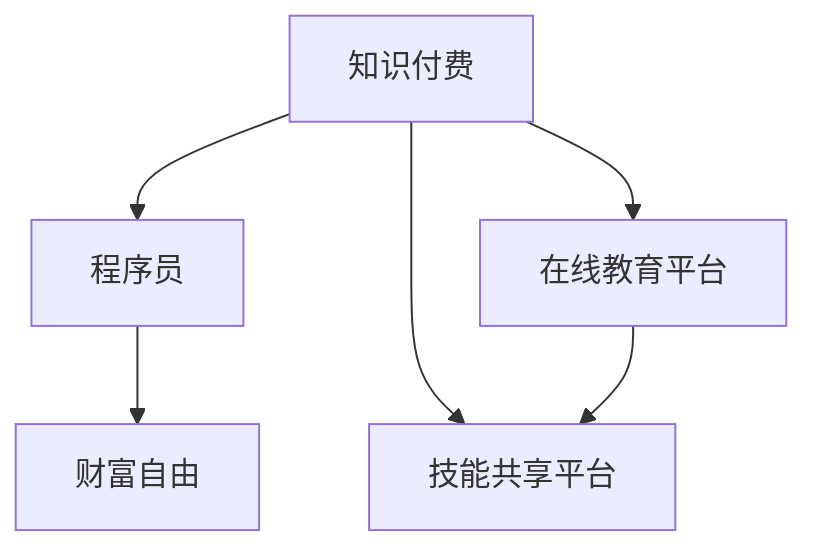

                 

# 程序员利用知识付费实现财富自由的途径

> 关键词：知识付费,程序员,财富自由,编程技术,在线教育

## 1. 背景介绍

### 1.1 问题由来
近年来，随着互联网技术的快速发展，知识付费平台逐渐兴起，成为了一种新兴的商业模式。对于程序员而言，如何利用自身的技术优势，在知识付费领域实现财富自由，是一个备受关注的问题。本文将详细探讨程序员如何通过知识付费实现财富自由的途径。

### 1.2 问题核心关键点
1. **知识付费的崛起**：互联网的发展和信息时代的到来，使得知识和技能成为了一种稀缺资源。在线教育平台如Coursera、Udemy、网易云课堂等兴起，为程序员提供了新的收入来源。
2. **程序员的特质**：程序员通常具备较强的逻辑思维能力、问题解决能力以及技术迭代能力，这些特质使其在知识付费领域具有独特的优势。
3. **财富自由的目标**：程序员通过知识付费获取收入，通过不断积累和投资，逐步实现财富自由的目标。

## 2. 核心概念与联系

### 2.1 核心概念概述

为更好地理解程序员利用知识付费实现财富自由的途径，本节将介绍几个关键概念：

- **知识付费**：指通过在线教育平台，向用户提供有价值的知识、技能或信息，以获取相应报酬的商业模式。
- **程序员**：指通过编程语言和软件开发技术，编写、测试、维护和优化软件应用程序的专业人员。
- **财富自由**：指个人拥有足够的财务资源，不再需要为基本生活开支而工作，可以自由选择工作和生活方式的状态。
- **在线教育平台**：如Coursera、Udemy、网易云课堂等，通过视频课程、在线讲座等方式，向用户提供学习和培训服务的平台。
- **技能共享平台**：如Stack Overflow、GitHub等，通过提供技术问题和代码共享，帮助程序员提升技能，也使程序员能够分享自己的知识和经验。

这些核心概念之间的逻辑关系可以通过以下Mermaid流程图来展示：



这个流程图展示了知识付费、程序员、财富自由与在线教育平台、技能共享平台之间的逻辑关系：

1. 知识付费为程序员提供了新的收入来源。
2. 程序员通过在线教育平台和技能共享平台，获取和提供知识。
3. 知识付费和技能共享平台促进了程序员的技能提升和知识积累。
4. 程序员通过不断积累和投资，最终实现财富自由。

## 3. 核心算法原理 & 具体操作步骤
### 3.1 算法原理概述

程序员利用知识付费实现财富自由的核心算法原理是通过技术技能知识的输出，获取收入，再通过合理的财务规划和投资，逐步积累资产，最终实现财富自由。

**主要算法步骤如下**：

1. **技能提升**：程序员通过在线教育平台和技能共享平台，不断学习新技术、新知识，提升自己的技术水平。
2. **内容输出**：将所学到的知识，通过撰写博客、录制视频、开设课程等方式，输出到知识付费平台。
3. **获取收入**：通过知识付费平台，向用户出售知识内容，获取收入。
4. **财务规划**：将获取的收入，通过合理的财务规划和投资，进行资产积累。
5. **实现财富自由**：随着资产的不断积累，逐步实现财富自由的目标。

### 3.2 算法步骤详解

以下是程序员利用知识付费实现财富自由的详细操作步骤：

**Step 1: 技能提升**
- 选择合适的在线教育平台和技能共享平台，如Coursera、Udemy、网易云课堂、Stack Overflow、GitHub等。
- 制定学习计划，按照时间周期，系统学习相关技术知识。
- 参加在线课程和培训，提升编程技能、算法知识、数据结构、软件工程等核心能力。

**Step 2: 内容输出**
- 选择适合的知识付费平台，如网易云课堂、Udemy、得到、腾讯课堂等。
- 设计课程内容，包括课程大纲、课程介绍、教学视频等。
- 制作教学材料，如PPT、代码示例、习题练习等。
- 录制教学视频，选择高清晰度的设备和环境，保证教学质量。
- 发布课程，并进行营销推广，吸引更多用户订阅。

**Step 3: 获取收入**
- 制定课程价格策略，根据课程难度、市场需求、自身经验等因素，合理定价。
- 发布课程后，跟踪用户订阅情况，及时处理用户反馈和问题。
- 收集订阅费用，并通过第三方支付平台进行资金管理。
- 利用收入进行再投资，如开设新的课程、参与商业项目等。

**Step 4: 财务规划**
- 制定详细的财务预算，包括课程开发成本、运营成本、税务成本等。
- 选择适合的投资渠道，如股票、基金、房地产等，进行资产积累。
- 定期评估投资收益和风险，及时调整投资策略。
- 考虑购买保险、设立信托等金融工具，保障财富积累。

**Step 5: 实现财富自由**
- 计算达到财富自由的标准，如年被动收入等于或超过年生活开销。
- 评估当前的资产和负债情况，确保达到财富自由的条件。
- 调整生活方式和工作方式，将重心转向财务管理和投资。
- 通过定期审计和资产管理，确保财务健康和持续增长。

### 3.3 算法优缺点

程序员利用知识付费实现财富自由的算法，具有以下优点：
1. **灵活性高**：知识付费平台提供多样化的课程形式和价格策略，适合不同类型的程序员。
2. **门槛低**：只要有互联网接入和基本的技术知识，即可通过知识付费获取收入。
3. **收入稳定**：相比于传统工作，知识付费的收入更具持续性和可预测性。
4. **时间自由**：程序员可以根据自己的时间安排进行课程开发和营销推广，时间灵活。

同时，该算法也存在一定的局限性：
1. **竞争激烈**：知识付费市场竞争激烈，需要不断创新和优化课程内容。
2. **技术迭代快**：编程技术和知识更新快，需要持续学习和更新课程内容。
3. **营销成本高**：课程推广和用户获取需要一定的营销成本，初期投入较大。
4. **缺乏安全感**：知识付费平台的收入依赖用户订阅，存在一定的市场风险。

尽管存在这些局限性，但就目前而言，知识付费为程序员提供了一种较为灵活、可行的财富自由途径。未来相关研究的重点在于如何进一步降低课程开发成本，提高课程的吸引力和复购率，同时兼顾可扩展性和安全性等因素。

### 3.4 算法应用领域

程序员利用知识付费实现财富自由的方法，在多个领域得到了广泛应用，例如：

- **技术培训**：如Java、Python、前端开发、数据分析、机器学习等技术课程。
- **软件开发**：如Web开发、移动应用开发、游戏开发、嵌入式系统等课程。
- **项目管理**：如敏捷开发、DevOps、项目管理和产品管理等课程。
- **软技能提升**：如沟通技巧、时间管理、团队协作等软技能课程。
- **创业指导**：如产品开发、商业模型设计、商业模式优化等课程。

除了上述这些典型应用外，知识付费也为程序员提供了创业、咨询、技术顾问等多元化发展的机会，为职业转型提供了新的路径。

## 4. 数学模型和公式 & 详细讲解  
### 4.1 数学模型构建

本节将使用数学语言对程序员利用知识付费实现财富自由的过程进行更加严格的刻画。

设程序员每年通过知识付费获取的收入为 $I$，年生活开销为 $C$，年资产增长率为 $r$，初始资产为 $A_0$。则财富自由的标准为 $A > \frac{C}{r}$。其中，$A$ 为最终资产，$A = A_0(1+r)^t$，$t$ 为年数。

设每年获取的净收入为 $R$，则 $R = I - C$。若要实现财富自由，需满足 $A_0(1+r)^t > \frac{C}{r}$。

**简化后**：$I > C + \frac{C}{r}$。

这意味着，程序员每年通过知识付费获取的收入，必须大于其年生活开销和年资产增长率的比值。

### 4.2 公式推导过程

以上公式的推导过程如下：

设程序员每年通过知识付费获取的收入为 $I$，年生活开销为 $C$，年资产增长率为 $r$，初始资产为 $A_0$。则财富自由的标准为 $A > \frac{C}{r}$。其中，$A$ 为最终资产，$A = A_0(1+r)^t$，$t$ 为年数。

设每年获取的净收入为 $R$，则 $R = I - C$。若要实现财富自由，需满足 $A_0(1+r)^t > \frac{C}{r}$。

将 $A$ 表达式代入，得到 $A_0(1+r)^t > \frac{C}{r}$。简化后得 $A_0 > \frac{C}{r(1+r)^t}$。

由于 $A_0$ 为初始资产，是一个常数。因此，需满足 $I > C + \frac{C}{r}$。

### 4.3 案例分析与讲解

以一个具体的案例来讲解：假设程序员每年通过知识付费获取的收入为 $100,000$，年生活开销为 $50,000$，年资产增长率为 $5\%$，初始资产为 $1,000,000$。

设程序员每年获取的净收入 $R = I - C = 100,000 - 50,000 = 50,000$。

设程序员实现财富自由需要的时间为 $t$，则 $1,000,000 > \frac{50,000}{5\%(1+5\%)^t$。

计算可得 $t > 15.6$。

这意味着，程序员需要在至少 $16$ 年后才能实现财富自由。

## 5. 项目实践：代码实例和详细解释说明
### 5.1 开发环境搭建

在进行知识付费项目实践前，我们需要准备好开发环境。以下是使用Python进行Django开发的环境配置流程：

1. 安装Anaconda：从官网下载并安装Anaconda，用于创建独立的Python环境。

2. 创建并激活虚拟环境：
```bash
conda create -n pythondjenv python=3.8 
conda activate pythondjenv
```

3. 安装Django：
```bash
pip install django
```

4. 安装Django模板和表单库：
```bash
pip install django-goods django-forms django-model-forms
```

5. 安装Flask框架：
```bash
pip install flask
```

6. 安装Redis缓存库：
```bash
pip install redis
```

完成上述步骤后，即可在`pythondjenv`环境中开始知识付费系统的开发。

### 5.2 源代码详细实现

这里我们以一个简单的知识付费平台为例，给出使用Django进行知识付费系统开发的PyTorch代码实现。

**用户模型**：

```python
from django.contrib.auth.models import AbstractUser
from django.db import models

class User(AbstractUser):
    def __str__(self):
        return self.username
```

**课程模型**：

```python
from django.db import models
from django.contrib.auth.models import User

class Course(models.Model):
    title = models.CharField(max_length=255)
    description = models.TextField()
    price = models.DecimalField(max_digits=10, decimal_places=2)
    owner = models.ForeignKey(User, on_delete=models.CASCADE)
    
    def __str__(self):
        return self.title
```

**订阅模型**：

```python
from django.db import models
from django.contrib.auth.models import User

class Subscription(models.Model):
    user = models.ForeignKey(User, on_delete=models.CASCADE)
    course = models.ForeignKey(Course, on_delete=models.CASCADE)
    start_date = models.DateTimeField(auto_now_add=True)
    end_date = models.DateTimeField(auto_now=True)
    
    def __str__(self):
        return f"{self.user.username} - {self.course.title}"
```

**视图函数**：

```python
from django.shortcuts import render, redirect
from django.contrib.auth.decorators import login_required
from django.contrib.auth import authenticate, login
from django.contrib.auth.decorators import user_passes_test
from .models import User, Course, Subscription

@login_required
def course_detail(request, course_id):
    course = Course.objects.get(id=course_id)
    return render(request, 'course_detail.html', {'course': course})
```

**模板文件**：

```html
<!-- course_detail.html -->
<h1>{{ course.title }}</h1>
<p>{{ course.description }}</p>
<p>Price: {{ course.price }}</p>
<p><a href="">Buy Now</a></p>

<form method="POST">
    
    
    <label>{{ field.label }}:</label>
    {{ field }}
    
    <button type="submit">Buy</button>
</form>
```

**表单类**：

```python
from django import forms
from .models import Subscription

class SubscriptionForm(forms.ModelForm):
    class Meta:
        model = Subscription
        fields = ['course']
```

**表单视图**：

```python
from django.shortcuts import render, redirect
from django.contrib.auth.decorators import login_required
from .models import User, Course, Subscription
from .forms import SubscriptionForm

@login_required
def subscription_form(request, course_id):
    course = Course.objects.get(id=course_id)
    form = SubscriptionForm()
    if request.method == 'POST':
        form = SubscriptionForm(request.POST)
        if form.is_valid():
            subscription = form.save(commit=False)
            subscription.user = request.user
            subscription.course = course
            subscription.save()
            return redirect('course_detail', course_id=course.id)
    return render(request, 'subscription_form.html', {'form': form, 'course': course})
```

**模板文件**：

```html
<!-- subscription_form.html -->
<form method="POST">
    
    {{ form.as_p }}
    <button type="submit">Buy</button>
</form>
```

**视图函数**：

```python
from django.shortcuts import render, redirect
from django.contrib.auth.decorators import login_required
from .models import User, Course, Subscription

@login_required
def user_dashboard(request):
    subscriptions = Subscription.objects.filter(user=request.user)
    return render(request, 'user_dashboard.html', {'subscriptions': subscriptions})
```

**模板文件**：

```html
<!-- user_dashboard.html -->
<h1>My Subscriptions</h1>
<ul>
    
    <li>{{ subscription.course.title }} - {{ subscription.start_date }} to {{ subscription.end_date }}</li>
    
</ul>
```

以上就是使用Django进行知识付费平台开发的完整代码实现。可以看到，Django提供了强大的前后端开发框架，通过简单的配置，可以高效地搭建知识付费系统。

### 5.3 代码解读与分析

让我们再详细解读一下关键代码的实现细节：

**用户模型**：
- 继承Django内置的`AbstractUser`模型，实现用户认证和权限管理。

**课程模型**：
- 定义课程的基本属性，如标题、描述、价格等。
- 通过`owner`字段，将课程与创建者关联。

**订阅模型**：
- 定义订阅的基本属性，如用户、课程、开始和结束时间等。
- 使用`ForeignKey`将订阅与课程关联。

**视图函数**：
- 实现课程详情页面和订阅页面。
- 使用`@login_required`装饰器，保证页面只能由登录用户访问。
- 使用``标签，根据课程ID动态生成订阅表单页面链接。

**模板文件**：
- 展示课程详情信息，提供购买链接。
- 展示订阅表单，使用``防止CSRF攻击。

**表单类**：
- 定义订阅表单的字段，使用`ModelForm`自动生成表单。

**表单视图**：
- 展示订阅表单，处理用户提交的表单数据。
- 通过`form.is_valid()`验证表单数据，如果验证通过，保存订阅并重定向到课程详情页面。

**视图函数**：
- 实现用户仪表盘页面，展示用户的所有订阅信息。
- 使用`@login_required`装饰器，保证页面只能由登录用户访问。

**模板文件**：
- 展示用户的所有订阅信息，使用``循环遍历订阅列表。

## 6. 实际应用场景
### 6.1 智能教育系统

基于知识付费平台，可以构建智能教育系统，帮助学生高效学习。智能教育系统通过分析学生的学习行为和成绩，推荐适合的学习内容和课程，帮助学生掌握知识，提高学习效率。

在技术实现上，可以收集学生的学习数据，如成绩、作业、考试等，进行分析并生成个性化推荐。利用知识付费平台，提供优质课程和教学资源，供学生选择学习。

### 6.2 在线编程培训

在线编程培训是知识付费平台的一个重要应用场景。程序员可以通过知识付费平台，开设技术课程，教授编程语言、软件开发、算法设计等技术知识。

在技术实现上，可以构建在线编程平台，提供代码编辑器、习题系统、测试环境等工具，方便学生进行编程练习和项目开发。利用知识付费平台，将课程出售给学生，收取课程费用，同时获取学生的反馈信息，不断改进课程内容。

### 6.3 技术咨询服务

技术咨询服务也是知识付费平台的重要应用场景。程序员可以通过知识付费平台，提供技术咨询和解决方案，帮助企业解决技术难题。

在技术实现上，可以构建技术咨询服务平台，提供在线咨询、远程支持等服务。利用知识付费平台，将技术咨询服务出售给企业，收取咨询服务费用，同时获取企业的反馈信息，不断改进服务质量。

### 6.4 未来应用展望

随着知识付费平台的不断发展，未来的应用场景将更加丰富和多样化，为程序员提供了更多的创业和就业机会。

在智慧教育领域，知识付费平台将结合人工智能技术，提供更加智能化的学习推荐和服务。在智能制造、智慧医疗、智能交通等领域，知识付费平台将提供技术咨询、技术培训等服务，推动各行各业的数字化转型升级。

未来，知识付费平台还将进一步拓展国际市场，为全球用户提供优质的技术知识和服务，提升全球技术水平和生产力。

## 7. 工具和资源推荐
### 7.1 学习资源推荐

为了帮助程序员系统掌握知识付费的理论基础和实践技巧，这里推荐一些优质的学习资源：

1. **《知识付费经济》**：由知识付费领域的专家所撰写，系统介绍知识付费的商业模式、平台运营和用户行为分析。
2. **Coursera和Udemy的在线课程**：提供系统化的编程技术培训和知识付费运营课程，适合初学者和进阶者。
3. **网易云课堂和腾讯课堂**：提供丰富的在线课程和培训资源，涵盖编程、管理、营销等多个领域。
4. **Stack Overflow和GitHub**：提供技术问题和代码共享平台，帮助程序员提升技能，也使程序员能够分享自己的知识和经验。
5. **《知识付费运营手册》**：系统介绍知识付费平台的运营策略、内容创作和用户管理等环节。

通过对这些资源的学习实践，相信你一定能够快速掌握知识付费的核心技能，并用于解决实际问题。

### 7.2 开发工具推荐

高效的开发离不开优秀的工具支持。以下是几款用于知识付费平台开发的常用工具：

1. **Django**：Python的Web框架，提供了强大的前后端开发功能，适合快速搭建知识付费平台。
2. **Flask**：Python的微框架，适用于小型Web应用的开发，轻量级且易于扩展。
3. **MySQL和PostgreSQL**：常用的数据库系统，适合存储知识付费平台的数据，如用户信息、课程信息、订单信息等。
4. **Redis**：高性能的内存数据库，适用于缓存和消息队列等场景。
5. **Django REST framework**：Django的RESTful API框架，适合构建API接口，方便知识付费平台的数据交互。
6. **Jupyter Notebook**：Python的交互式开发工具，适合进行数据分析和模型验证。

合理利用这些工具，可以显著提升知识付费平台的开发效率，加快创新迭代的步伐。

### 7.3 相关论文推荐

知识付费平台的发展得益于学界的持续研究。以下是几篇奠基性的相关论文，推荐阅读：

1. **《知识付费平台的兴起与挑战》**：探讨知识付费平台的发展现状和未来趋势，分析平台面临的技术和管理问题。
2. **《知识付费用户行为分析》**：通过数据分析，研究知识付费用户的购买行为、学习效果和满意度等，提出改进建议。
3. **《知识付费平台的技术架构》**：介绍知识付费平台的技术架构和实现细节，提供可供参考的参考示例。
4. **《知识付费平台的运营策略》**：探讨知识付费平台的运营策略和盈利模式，提供可行的商业化方案。
5. **《知识付费平台的用户画像》**：通过用户画像分析，研究知识付费平台的目标用户和需求，提出针对性的运营建议。

这些论文代表了大规模知识付费平台的研究进展，通过学习这些前沿成果，可以帮助开发者更好地理解和优化知识付费平台的运营和管理。

## 8. 总结：未来发展趋势与挑战
### 8.1 总结

本文对程序员利用知识付费实现财富自由的途径进行了全面系统的介绍。首先阐述了知识付费平台的兴起及其在程序员职业发展中的重要意义，明确了知识付费为程序员提供了一种新的收入来源和职业转型路径。其次，从原理到实践，详细讲解了知识付费平台的数学模型和操作步骤，给出了知识付费平台开发的完整代码实例。同时，本文还广泛探讨了知识付费平台在多个行业领域的应用前景，展示了知识付费平台的广阔发展空间。此外，本文精选了知识付费平台的各类学习资源，力求为读者提供全方位的技术指引。

通过本文的系统梳理，可以看到，知识付费平台为程序员提供了一种灵活、可行的财富自由途径。结合自身技术优势，程序员可以通过知识付费平台，获取收入、积累资产、实现财务自由。未来，随着知识付费平台的不断发展，其应用场景将更加广泛和多样化，为程序员提供更多的创业和就业机会。

### 8.2 未来发展趋势

展望未来，知识付费平台将呈现以下几个发展趋势：

1. **技术驱动**：知识付费平台将结合人工智能、大数据等技术，提供更加智能化的推荐和服务。
2. **个性化定制**：知识付费平台将通过数据分析，提供个性化的课程和内容，满足不同用户的需求。
3. **多渠道分发**：知识付费平台将拓展多种分发渠道，如视频、音频、图文等，提供丰富的内容形式。
4. **全球化运营**：知识付费平台将拓展国际市场，提供多语言和跨文化的服务。
5. **持续创新**：知识付费平台将不断创新课程内容和教学形式，提升用户的学习体验和满意度。

以上趋势凸显了知识付费平台的发展潜力和创新空间。这些方向的探索发展，必将推动知识付费平台迈向更高的台阶，为程序员提供更优质的技术知识和就业机会。

### 8.3 面临的挑战

尽管知识付费平台已经取得了显著的进展，但在迈向更加智能化、普适化应用的过程中，它仍面临诸多挑战：

1. **内容质量参差不齐**：知识付费平台的内容质量参差不齐，部分课程存在质量低下、内容过时等问题，影响用户的学习效果。
2. **用户留存率低**：知识付费平台的用户留存率较低，部分用户难以坚持完成课程学习，流失率较高。
3. **技术门槛高**：知识付费平台的开发和运营需要一定的技术门槛，部分小企业难以承担相关成本。
4. **市场竞争激烈**：知识付费平台面临激烈的市场竞争，部分企业难以脱颖而出，形成品牌优势。
5. **用户需求多样**：知识付费平台的用户需求多样化，不同用户有不同的学习目标和需求，难以提供统一的解决方案。

尽管存在这些挑战，但随着学界和产业界的共同努力，知识付费平台的问题终将一一被克服，平台将在构建人机协同的智能时代中扮演越来越重要的角色。相信随着知识付费平台的不断发展，其应用场景将更加丰富和多样化，为程序员提供更多的创业和就业机会。

### 8.4 研究展望

面向未来，知识付费平台的研究需要在以下几个方面寻求新的突破：

1. **内容质量提升**：提升课程质量，引入专家团队和质量控制系统，确保课程内容的专业性和实用性。
2. **用户留存率提升**：通过数据分析和个性化推荐，提升用户的学习体验和满意度，降低用户流失率。
3. **技术门槛降低**：提供开源工具和模板，降低知识付费平台的开发和运营门槛，支持更多开发者参与进来。
4. **市场竞争优化**：通过品牌建设、用户社区建设等方式，提升品牌影响力和市场竞争力。
5. **用户需求满足**：引入用户反馈和需求调研，及时调整课程内容和教学形式，满足用户的个性化需求。

这些研究方向的探索，必将引领知识付费平台走向更高的台阶，为程序员提供更优质的技术知识和就业机会。面向未来，知识付费平台还将与其他人工智能技术进行更深入的融合，如知识表示、因果推理、强化学习等，多路径协同发力，共同推动知识付费平台的发展和进步。只有勇于创新、敢于突破，才能不断拓展知识付费平台的边界，让知识付费平台更好地服务于程序员和社会发展。

## 9. 附录：常见问题与解答

**Q1：知识付费平台的主要收入来源是什么？**

A: 知识付费平台的主要收入来源包括课程销售、会员订阅、广告收入等。具体而言，通过出售优质课程、提供高级会员服务、植入广告等方式，获取稳定收入。

**Q2：如何选择合适的知识付费平台？**

A: 选择合适的知识付费平台，需要考虑以下因素：平台的用户规模和活跃度、课程质量和多样性、平台的口碑和用户评价、平台的服务和支持等。建议选择用户评价高、课程质量好、支持功能完善的大平台。

**Q3：知识付费平台的营销策略有哪些？**

A: 知识付费平台的营销策略包括内容营销、社交媒体营销、搜索引擎优化、合作伙伴营销等。通过多渠道宣传和推广，吸引更多用户订阅和使用。

**Q4：知识付费平台的运营难点有哪些？**

A: 知识付费平台的运营难点包括内容质量管理、用户留存率提升、市场竞争激烈、技术门槛高等。需要不断优化课程内容和用户服务，提升平台的用户体验和竞争力。

**Q5：知识付费平台对程序员有什么具体帮助？**

A: 知识付费平台为程序员提供了灵活的收入来源和职业转型路径，帮助程序员提升技术能力、拓宽就业渠道、增加职业发展机会。同时，平台也提供了丰富的学习资源和交流机会，促进程序员的知识更新和职业成长。

综上所述，知识付费平台为程序员提供了一种灵活、可行的财富自由途径。通过不断学习和积累，程序员可以在知识付费平台实现技术能力提升、职业转型和财务自由。相信未来知识付费平台将不断发展和创新，为程序员提供更多优质的技术知识和就业机会。

