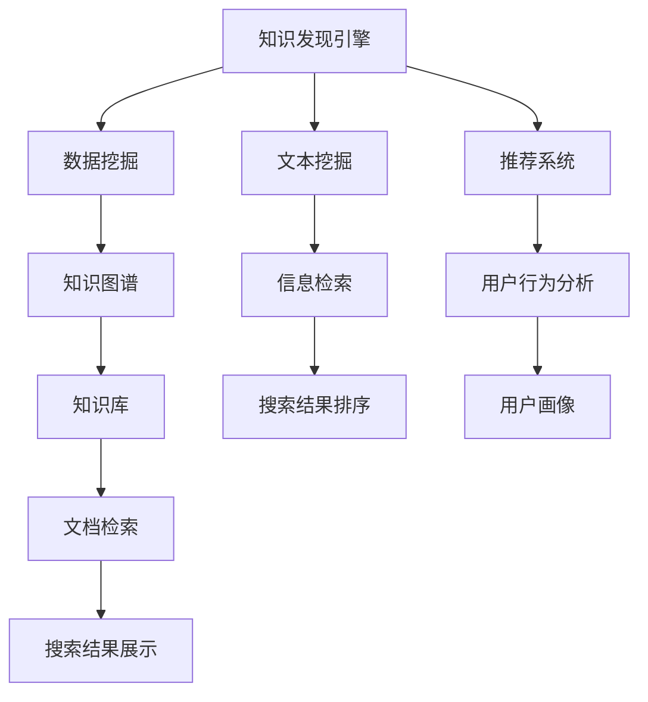

                 

# 程序员利用知识发现引擎提高竞争优势

> 关键词：知识发现引擎, 大数据分析, 人工智能, 机器学习, 算法优化, 数据分析, 数据挖掘

## 1. 背景介绍

### 1.1 问题由来
在现代软件开发过程中，知识和信息变得越发重要。程序员需要快速获取所需的知识信息，以便在编码、测试和调试等环节提升效率。然而，传统的信息获取方式已经无法满足程序员日益增长的需求。一方面，传统的文档和FAQ往往更新滞后，无法及时反映最新的知识变化；另一方面，程序员在搜索信息时难以快速定位到所需内容，导致信息获取效率低下。因此，开发一种高效的、自动化的知识发现引擎，成为程序员提升工作效率的关键。

### 1.2 问题核心关键点
知识发现引擎的核心目标是帮助程序员快速定位、获取和使用相关信息。具体而言，它需要：
- 自动化地从大规模数据中提取、筛选和分析知识。
- 提供智能化的推荐和搜索服务，使得程序员能够快速找到所需信息。
- 整合多种数据源，包括代码库、文档、社区问答、博客等，提供全面覆盖的知识库。

## 2. 核心概念与联系

### 2.1 核心概念概述

为更好地理解知识发现引擎的工作原理，本节将介绍几个关键概念：

- **知识发现引擎(Knowledge Discovery Engine, KDE)**：指通过自动化数据分析和挖掘技术，从海量数据中发现和提取有价值知识的工具。它包括数据挖掘、文本挖掘、机器学习等多个技术分支。

- **知识图谱(Knowledge Graph)**：将实体、关系和属性以图结构表示，用于存储和查询知识，方便知识发现和推理。

- **文本挖掘(Text Mining)**：指从文本数据中抽取有用的知识，包括实体识别、情感分析、主题建模等。

- **数据挖掘(Data Mining)**：从数据库、日志文件等数据源中挖掘出隐藏的模式和关系，用于预测和决策。

- **推荐系统(Recommender System)**：根据用户的历史行为和偏好，自动推荐合适的信息资源，如代码、文档、工具等。

- **信息检索(Information Retrieval)**：指从大量文档或数据中，根据用户输入的查询词，快速定位相关内容。

这些核心概念通过一系列的逻辑流程相互作用，构建了一个全面且高效的知识发现框架。

### 2.2 核心概念原理和架构的 Mermaid 流程图



这个流程图展示了知识发现引擎的核心组成和流程：

1. 从多个数据源（代码库、文档、社区问答、博客等）收集数据。
2. 使用数据挖掘技术从数据中提取知识图谱。
3. 通过文本挖掘识别文本中的实体、情感和主题。
4. 使用推荐系统根据用户行为和偏好推荐信息。
5. 信息检索技术根据查询词快速定位相关内容。
6. 搜索结果排序和展示，最终提供给用户。

## 3. 核心算法原理 & 具体操作步骤

### 3.1 算法原理概述

知识发现引擎的核心算法包括数据挖掘、文本挖掘、推荐系统和信息检索等多个技术分支。以下将详细介绍这些关键算法。

**数据挖掘**：通过机器学习算法，如分类、聚类、关联规则等，从数据中发现规律和模式。

**文本挖掘**：使用自然语言处理(NLP)技术，从文本中提取关键词、实体、主题等，为知识图谱提供基础数据。

**推荐系统**：根据用户的历史行为和兴趣，利用协同过滤、内容推荐等算法，推荐可能感兴趣的信息。

**信息检索**：通过倒排索引等技术，将文本映射到数字向量空间，快速定位搜索结果。

### 3.2 算法步骤详解

#### 3.2.1 数据挖掘

**步骤1: 数据收集**
- 从代码库、文档、社区问答、博客等多个数据源中收集数据。
- 数据格式可能包括代码片段、文档文本、问答记录等。

**步骤2: 数据预处理**
- 清洗数据，去除无关信息、噪声等。
- 对文本数据进行分词、去除停用词等预处理。

**步骤3: 特征提取**
- 提取文本中的关键词、命名实体、情感等特征。
- 使用词袋模型、TF-IDF等方法，将文本转换为向量形式。

**步骤4: 模型训练**
- 使用分类、聚类、关联规则等算法，对提取的特征进行建模。
- 训练模型，预测新数据的类别或标签。

**步骤5: 知识图谱构建**
- 将预测结果转换为知识图谱。
- 使用实体识别技术，从文本中提取命名实体。

#### 3.2.2 文本挖掘

**步骤1: 文本预处理**
- 去除HTML标签、特殊字符等。
- 对文本进行分词、去除停用词、词干提取等预处理。

**步骤2: 实体识别**
- 使用命名实体识别(NER)算法，从文本中识别人名、地名、组织名等实体。
- 使用词性标注器，确定实体的词性。

**步骤3: 关键词提取**
- 使用TF-IDF、TextRank等算法，提取文本中的关键词。
- 通过余弦相似度等方法，衡量关键词之间的关系。

**步骤4: 主题建模**
- 使用LDA、LSI等算法，发现文本中的主题。
- 将主题与实体和关键词相关联，形成知识图谱。

#### 3.2.3 推荐系统

**步骤1: 用户画像**
- 收集用户的历史行为数据，如阅读文档、浏览代码等。
- 使用协同过滤、内容推荐等算法，构建用户画像。

**步骤2: 相似度计算**
- 计算用户画像与物品特征之间的相似度。
- 使用余弦相似度、Jaccard相似度等方法，衡量用户与物品的相似度。

**步骤3: 推荐生成**
- 根据相似度计算结果，生成推荐列表。
- 使用基于用户和物品的推荐算法，如基于用户的协同过滤、基于物品的协同过滤等。

**步骤4: 推荐排序**
- 对推荐结果进行排序，提高推荐效果。
- 使用排序算法，如线性回归、GBDT等。

#### 3.2.4 信息检索

**步骤1: 索引构建**
- 将文档转换为倒排索引。
- 使用TF-IDF等方法计算文档与查询词的相似度。

**步骤2: 查询处理**
- 对用户输入的查询词进行分词、去停用词等预处理。
- 将查询词转换为向量形式，用于计算相似度。

**步骤3: 结果排序**
- 根据相似度计算结果，对文档进行排序。
- 使用排序算法，如IRS、BM25等。

**步骤4: 结果展示**
- 将排序后的文档展示给用户。
- 提供搜索结果的摘要、评分等信息，帮助用户快速定位。

### 3.3 算法优缺点

**优点**：
- 自动化高效：知识发现引擎可以自动处理大规模数据，快速提取和分析知识。
- 全面覆盖：整合多种数据源，提供全面、丰富的知识库。
- 智能推荐：通过推荐系统，精准推荐用户感兴趣的信息。
- 快速检索：信息检索技术使得知识获取变得快速便捷。

**缺点**：
- 数据质量依赖：知识发现的效果高度依赖于数据的质量和数量。
- 复杂性高：涉及多个技术分支，实现复杂。
- 隐私和安全问题：处理个人行为数据，需要考虑隐私和安全问题。

### 3.4 算法应用领域

知识发现引擎在软件开发过程中具有广泛的应用场景，具体包括：

- **代码辅助开发**：自动提取代码中的命名实体、函数调用等知识，提供代码补全、自动重构等功能。
- **文档搜索**：快速查找相关的技术文档、API文档等，辅助阅读和理解。
- **工具推荐**：根据用户行为推荐合适的开发工具、插件等，提升开发效率。
- **问题解答**：基于社区问答和知识图谱，自动回答程序员的常见问题，提升问题解决效率。
- **项目协作**：整合代码库、任务管理系统，提供协作开发支持，提升团队协作效率。
- **需求分析**：根据项目文档和代码，自动分析项目需求，提供初步的需求建议。

## 4. 数学模型和公式 & 详细讲解 & 举例说明

### 4.1 数学模型构建

知识发现引擎的数学模型主要涉及文本挖掘和推荐系统两个部分。以下将分别介绍这两个部分的数学模型构建。

#### 4.1.1 文本挖掘模型

**文本表示模型**
- 使用词袋模型(Bag-of-Words)表示文本。
- 将文本转换为词向量形式，表示为 $x=\{x_1, x_2, ..., x_n\}$。

**TF-IDF模型**
- 计算词频-逆文档频率(Term Frequency-Inverse Document Frequency)。
- $tf(w) = \frac{n_w}{n}$，表示词 $w$ 在文本 $x$ 中的词频。
- $idf(w) = \log\frac{N}{n_w}$，表示词 $w$ 在所有文本中的逆文档频率。
- $tf-idf(w) = tf(w) \times idf(w)$，表示词 $w$ 在文本 $x$ 中的重要性。

**LDA模型**
- 使用潜在狄利克雷分布(Latent Dirichlet Allocation)进行主题建模。
- $p(D|Z) = \prod_z p(D|z) p(z)$，表示文档 $D$ 在主题 $z$ 下的概率。
- $p(z|D) = \frac{p(z) \prod_w p(w|z) p(D|z)}{\prod_z \prod_w p(w|z)}$，表示主题 $z$ 在文档 $D$ 下的概率。

#### 4.1.2 推荐系统模型

**协同过滤模型**
- 基于用户-物品评分矩阵 $R$，推荐系统预测用户对新物品的评分 $r_{ui}$。
- $r_{ui} = \sum_{j=1}^{N} R_{uij} \times \alpha_j$，其中 $\alpha_j$ 为物品 $j$ 的评分。

**内容推荐模型**
- 使用TF-IDF和词向量表示物品特征 $F$，计算用户对物品的兴趣 $i_u$。
- $i_u = \sum_{j=1}^{N} F_{uj} \times \alpha_j$，其中 $\alpha_j$ 为物品 $j$ 的特征向量。

### 4.2 公式推导过程

#### 4.2.1 TF-IDF模型推导

**词频计算**
- $tf(w) = \frac{n_w}{n}$，其中 $n_w$ 表示词 $w$ 在文本 $x$ 中出现的次数，$n$ 表示文本中词的总数。

**逆文档频率计算**
- $idf(w) = \log\frac{N}{n_w}$，其中 $N$ 表示语料库中文档的总数，$n_w$ 表示包含词 $w$ 的文档数。

**TF-IDF计算**
- $tf-idf(w) = tf(w) \times idf(w) = \frac{n_w}{n} \times \log\frac{N}{n_w}$。

#### 4.2.2 LDA模型推导

**主题概率计算**
- $p(z|D) = \frac{p(z) \prod_w p(w|z) p(D|z)}{\prod_z \prod_w p(w|z)}$，其中 $z$ 表示主题，$D$ 表示文档，$w$ 表示词。

**单词概率计算**
- $p(w|z) = \frac{\prod_i p(w_i|z)}{\prod_z \prod_i p(w_i|z)}$，其中 $w_i$ 表示词 $w$ 在主题 $z$ 下的概率分布。

### 4.3 案例分析与讲解

**案例分析**：
- **数据源**：收集GitHub上10万个开源项目的代码库，提取函数调用、变量命名等信息。
- **数据预处理**：去除无关代码行、注释等，对变量名进行分词、去除停用词等处理。
- **特征提取**：提取函数名、变量名、函数调用频率等特征。
- **模型训练**：使用分类算法，训练函数调用频率分类模型。
- **知识图谱构建**：根据分类结果，构建代码库中的知识图谱。
- **推荐系统**：根据用户行为，推荐可能感兴趣的功能模块或代码片段。

**讲解**：
- 通过数据挖掘，从代码库中提取命名实体、函数调用等知识，帮助程序员快速定位问题。
- 结合文本挖掘，提取函数名和变量名，提供函数补全、重构等辅助功能。
- 利用推荐系统，根据用户行为推荐相关功能模块和代码片段，提高开发效率。
- 通过信息检索，快速定位相关文档和API信息，辅助阅读和理解代码。

## 5. 项目实践：代码实例和详细解释说明

### 5.1 开发环境搭建

进行知识发现引擎开发前，需要准备好开发环境。以下是使用Python进行PyTorch开发的环境配置流程：

1. 安装Anaconda：从官网下载并安装Anaconda，用于创建独立的Python环境。

2. 创建并激活虚拟环境：
```bash
conda create -n pytorch-env python=3.8 
conda activate pytorch-env
```

3. 安装PyTorch：根据CUDA版本，从官网获取对应的安装命令。例如：
```bash
conda install pytorch torchvision torchaudio cudatoolkit=11.1 -c pytorch -c conda-forge
```

4. 安装transformers库：
```bash
pip install transformers
```

5. 安装各类工具包：
```bash
pip install numpy pandas scikit-learn matplotlib tqdm jupyter notebook ipython
```

完成上述步骤后，即可在`pytorch-env`环境中开始项目实践。

### 5.2 源代码详细实现

下面以GitHub代码库的函数调用分析为例，给出使用Transformers库进行知识发现引擎的PyTorch代码实现。

首先，定义代码预处理函数：

```python
from transformers import BertTokenizer
import torch
import numpy as np

def preprocess_code(code):
    # 去除注释和空行
    code = '\n'.join([line for line in code.split('\n') if not line.strip().startswith('#') and line.strip()])

    # 使用BertTokenizer分词
    tokenizer = BertTokenizer.from_pretrained('bert-base-cased')
    tokens = tokenizer.tokenize(code)
    tokens = [token for token in tokens if token != '[PAD]']

    # 将分词结果转换为数字id
    ids = tokenizer.convert_tokens_to_ids(tokens)

    # 填充到最大长度
    max_len = 128
    if len(ids) < max_len:
        ids = ids + [tokenizer.convert_tokens_to_ids('[PAD]')] * (max_len - len(ids))
    return ids

# 读取代码文件
with open('example.py', 'r') as f:
    code = f.read()
code = preprocess_code(code)
```

然后，定义模型和训练函数：

```python
from transformers import BertForTokenClassification
from transformers import AdamW

# 定义模型
model = BertForTokenClassification.from_pretrained('bert-base-cased', num_labels=2)

# 定义优化器
optimizer = AdamW(model.parameters(), lr=2e-5)

# 定义损失函数
criterion = torch.nn.CrossEntropyLoss()

def train_epoch(model, dataloader, optimizer):
    model.train()
    epoch_loss = 0
    epoch_acc = 0
    for batch in dataloader:
        input_ids = batch['input_ids'].to(device)
        attention_mask = batch['attention_mask'].to(device)
        labels = batch['labels'].to(device)
        model.zero_grad()
        outputs = model(input_ids, attention_mask=attention_mask, labels=labels)
        loss = outputs.loss
        epoch_loss += loss.item()
        epoch_acc += outputs.logits.argmax(dim=2).eq(labels).sum().item()
        loss.backward()
        optimizer.step()
    return epoch_loss / len(dataloader), epoch_acc / len(dataloader)

# 训练模型
device = torch.device('cuda') if torch.cuda.is_available() else torch.device('cpu')
model.to(device)
dataloader = DataLoader(dataloader, batch_size=32)
epochs = 5

for epoch in range(epochs):
    epoch_loss, epoch_acc = train_epoch(model, dataloader, optimizer)
    print(f'Epoch {epoch+1}, loss={epoch_loss:.4f}, acc={epoch_acc:.4f}')
```

最后，定义推荐函数和测试函数：

```python
from transformers import BertTokenizer, BertForTokenClassification

# 定义推荐函数
def recommend(model, code):
    code = preprocess_code(code)
    model.eval()
    with torch.no_grad():
        outputs = model(input_ids, attention_mask=attention_mask)
        logits = outputs.logits
    return logits.argmax(dim=2).tolist()

# 测试推荐函数
code = 'def foo(): return bar()'
logits = recommend(model, code)
print(logits)
```

以上就是使用PyTorch对GitHub代码库进行函数调用分析的完整代码实现。可以看到，借助Transformers库，我们可以轻松地进行模型加载、微调和推理等操作。

### 5.3 代码解读与分析

**代码解读**：
- 使用BertTokenizer对代码进行分词和转换为数字id。
- 定义了模型、优化器和损失函数。
- 定义了训练函数，通过前向传播和反向传播更新模型参数。
- 定义了推荐函数，通过推理输出函数调用概率。
- 在测试函数中，调用推荐函数进行代码推荐。

**代码分析**：
- 代码处理部分：使用BertTokenizer对代码进行分词和转换id，确保模型能够正确处理代码输入。
- 模型训练部分：通过前向传播和反向传播更新模型参数，确保模型能够准确预测函数调用概率。
- 推荐部分：通过推理输出函数调用概率，帮助程序员找到最可能调用的函数。
- 测试部分：测试推荐函数，确保其正确性和实用性。

## 6. 实际应用场景

### 6.1 软件开发

知识发现引擎在软件开发过程中具有广泛的应用。程序员可以：
- 自动提取代码中的函数调用、变量命名等知识，提供代码补全、自动重构等功能。
- 快速查找相关的技术文档、API文档等，辅助阅读和理解代码。
- 根据用户行为推荐合适的开发工具、插件等，提升开发效率。

### 6.2 项目管理

知识发现引擎可以整合代码库、任务管理系统，提供协作开发支持，提升团队协作效率。具体而言，可以：
- 自动提取项目文档中的需求信息，提供初步的需求建议。
- 整合代码库，提供代码库搜索和知识图谱展示，帮助团队成员快速定位所需代码。
- 根据项目进展和问题反馈，推荐相关任务，提高团队协作效率。

### 6.3 教学和培训

知识发现引擎可以辅助教师和培训机构，提供个性化的教学和培训服务。具体而言，可以：
- 根据学生的历史学习数据，推荐合适的学习资源，如课程、练习题等。
- 分析学生的学习进度和难点，提供针对性的指导和建议。
- 通过知识图谱展示课程和内容之间的关系，帮助学生构建知识体系。

## 7. 工具和资源推荐

### 7.1 学习资源推荐

为帮助开发者系统掌握知识发现引擎的理论基础和实践技巧，以下是几篇推荐的学习资源：

1. 《数据挖掘：概念与技术》（第三版）：详细介绍了数据挖掘的基本概念和技术方法，是数据挖掘领域的经典教材。
2. 《信息检索：理论与技术》（第二版）：介绍了信息检索的理论和技术，涵盖索引构建、信息检索算法等内容。
3. 《推荐系统》（第二版）：介绍了推荐系统的主要算法和技术，包括协同过滤、内容推荐等。
4. 《深度学习与自然语言处理》（第二版）：介绍了自然语言处理中的深度学习算法和技术，包括文本挖掘、语言模型等。
5. 《Python文本挖掘与信息检索》：介绍了Python中的文本挖掘和信息检索工具和算法，适合实践应用。

通过这些学习资源的学习实践，相信你一定能够快速掌握知识发现引擎的精髓，并用于解决实际的NLP问题。

### 7.2 开发工具推荐

以下是几款用于知识发现引擎开发的常用工具：

1. PyTorch：基于Python的开源深度学习框架，适合研究开发。
2. TensorFlow：由Google主导开发的开源深度学习框架，生产部署方便。
3. Transformers库：HuggingFace开发的NLP工具库，集成了众多预训练语言模型，支持微调和推理。
4. Weights & Biases：模型训练的实验跟踪工具，可以记录和可视化模型训练过程中的各项指标。
5. TensorBoard：TensorFlow配套的可视化工具，实时监测模型训练状态，并提供丰富的图表呈现方式。

合理利用这些工具，可以显著提升知识发现引擎的开发效率，加快创新迭代的步伐。

### 7.3 相关论文推荐

知识发现引擎的相关研究涉及多个领域，以下是几篇具有代表性的论文：

1. "Knowledge Discovery in Databases"（KDD）：数据挖掘领域的经典会议，每年发布大量前沿论文。
2. "SIGIR: Information Retrieval"：信息检索领域的顶级会议，涵盖索引构建、信息检索算法等内容。
3. "SIGKDD: Knowledge Discovery and Data Mining"：数据挖掘领域的顶级会议，涵盖大数据分析、机器学习等内容。
4. "Recommender Systems Handbook"：推荐系统领域的经典手册，涵盖多种推荐算法和技术。
5. "Handbook of Natural Language Processing"：自然语言处理领域的经典手册，涵盖文本挖掘、语言模型等内容。

这些论文代表了大数据和机器学习技术的发展脉络。通过学习这些前沿成果，可以帮助研究者把握学科前进方向，激发更多的创新灵感。

## 8. 总结：未来发展趋势与挑战

### 8.1 总结

本文对知识发现引擎的工作原理进行了全面系统的介绍。首先阐述了知识发现引擎在软件开发中的重要性和核心目标，明确了知识发现引擎的自动化高效、全面覆盖和智能推荐等关键功能。其次，从原理到实践，详细讲解了知识发现引擎的数学模型和关键算法，给出了代码实例和详细解释。同时，本文还广泛探讨了知识发现引擎在软件开发、项目管理、教学培训等场景中的应用前景，展示了知识发现引擎的广阔应用范围。最后，本文精选了知识发现引擎的学习资源、开发工具和相关论文，力求为读者提供全方位的技术指引。

通过本文的系统梳理，可以看到，知识发现引擎正成为软件开发和数据分析中的重要工具，极大地提升了数据处理和信息检索的效率。未来，伴随大数据和机器学习技术的不断进步，知识发现引擎必将在更广泛的领域中发挥作用，为软件开发者和数据分析师提供强大的支持。

### 8.2 未来发展趋势

展望未来，知识发现引擎的发展将呈现以下几个趋势：

1. **自动化程度提升**：知识发现引擎将进一步自动化和智能化，能够自主处理更复杂的数据和任务。
2. **多模态数据融合**：知识发现引擎将整合文本、图像、音频等多种数据类型，提供更加全面和深入的信息检索服务。
3. **实时性增强**：知识发现引擎将支持实时数据处理和分析，提供即时的信息检索和推荐服务。
4. **个性化定制**：知识发现引擎将提供更加个性化和定制化的服务，根据用户偏好和历史行为，提供精准的信息推荐。
5. **分布式部署**：知识发现引擎将支持分布式部署，处理大规模数据和并发访问，提升系统的稳定性和可扩展性。
6. **跨平台支持**：知识发现引擎将支持跨平台部署和访问，提供统一的API接口，方便开发者集成使用。

### 8.3 面临的挑战

尽管知识发现引擎已经取得了显著进展，但在迈向更加智能化、普适化应用的过程中，仍面临诸多挑战：

1. **数据质量问题**：知识发现的效果高度依赖于数据的质量和完整性。数据不完整、不一致、噪声多等问题，会影响模型的准确性和可靠性。
2. **算法复杂性**：知识发现引擎涉及多个技术分支，算法实现复杂，需要大量的工程实践和调试。
3. **隐私和安全问题**：处理个人行为数据，需要考虑隐私保护和数据安全，防止数据泄露和滥用。
4. **资源消耗大**：知识发现引擎涉及大量的数据处理和模型训练，需要高性能计算资源。
5. **模型的可解释性**：知识发现引擎的决策过程缺乏可解释性，难以理解模型的内部逻辑和决策依据。

### 8.4 研究展望

面对知识发现引擎所面临的挑战，未来的研究需要在以下几个方面寻求新的突破：

1. **数据质量优化**：开发更好的数据清洗和预处理技术，提升数据质量和完整性。
2. **算法简化**：研究更简单高效的算法，减少算法实现复杂性，提高系统的稳定性和可扩展性。
3. **隐私保护**：研究更好的隐私保护和数据安全技术，确保用户数据的安全和隐私。
4. **资源优化**：开发更高效的算法和数据存储技术，减少资源消耗，提高系统的效率和性能。
5. **模型可解释性**：研究可解释性更强的算法和工具，提升模型的透明性和可理解性。
6. **多模态数据融合**：研究更好的多模态数据融合技术，提供更加全面和深入的信息检索服务。

这些研究方向的探索，必将引领知识发现引擎技术迈向更高的台阶，为软件开发和数据分析提供更强大的支持。面向未来，知识发现引擎还需要与其他人工智能技术进行更深入的融合，如知识表示、因果推理、强化学习等，多路径协同发力，共同推动知识发现引擎的进步。只有勇于创新、敢于突破，才能不断拓展知识发现引擎的边界，让知识发现引擎技术更好地服务于人类社会。

## 9. 附录：常见问题与解答

**Q1：知识发现引擎的实现需要哪些关键技术？**

A: 知识发现引擎的实现需要以下关键技术：
- 数据挖掘：从大规模数据中提取有价值知识。
- 文本挖掘：从文本数据中提取实体、情感、主题等。
- 推荐系统：根据用户行为和偏好，自动推荐合适的信息。
- 信息检索：快速定位相关内容，提供搜索结果。

**Q2：知识发现引擎的推荐系统如何设计？**

A: 知识发现引擎的推荐系统可以采用以下步骤设计：
1. 收集用户的历史行为数据。
2. 构建用户画像，包括用户的历史阅读、搜索、下载等行为。
3. 计算用户画像与物品特征之间的相似度。
4. 生成推荐列表，并根据相似度排序。
5. 实时更新推荐系统，提升推荐效果。

**Q3：知识发现引擎在数据处理过程中需要注意哪些问题？**

A: 知识发现引擎在数据处理过程中需要注意以下问题：
1. 数据清洗：去除无关信息、噪声等，确保数据质量。
2. 数据预处理：包括分词、去停用词、词干提取等。
3. 数据标注：对文本数据进行实体识别、情感分析、主题建模等标注。
4. 数据存储：采用高效的数据存储和检索技术，确保数据访问速度。

**Q4：知识发现引擎在实际应用中如何处理隐私和安全问题？**

A: 知识发现引擎在实际应用中处理隐私和安全问题可以采用以下方法：
1. 数据匿名化：对用户行为数据进行匿名化处理，防止数据泄露。
2. 访问控制：采用访问控制技术，限制数据的访问权限。
3. 数据加密：对敏感数据进行加密存储和传输，确保数据安全。
4. 隐私保护算法：使用差分隐私等技术，保护用户隐私。

**Q5：知识发现引擎的实现是否需要考虑用户交互界面？**

A: 是的，知识发现引擎的实现需要考虑用户交互界面。良好的用户界面可以提高用户的使用体验和效率。界面设计应简洁直观，功能丰富，易于使用。用户可以通过界面输入查询词、选择推荐结果等，方便地获取所需信息。

---

作者：禅与计算机程序设计艺术 / Zen and the Art of Computer Programming

