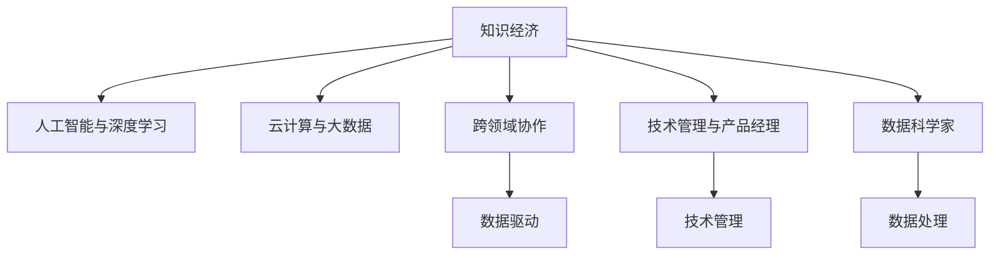

                 

# 程序员在知识经济时代的职业发展方向

## 1. 背景介绍

### 1.1 问题由来

随着信息技术的迅猛发展和全球经济格局的深刻变革，知识经济成为新时代的主导模式。知识经济强调创新、智能和协作，对技术人员的专业技能和综合素质提出了更高要求。本文聚焦于程序员这一核心职业群体，探讨在知识经济时代，如何通过提升自身能力、掌握新技术、把握行业趋势，实现职业发展和成长。

### 1.2 问题核心关键点

当前，程序员面临的职业发展方向多元化，包括但不限于以下几个方面：

- **技术技能升级**：深度学习和人工智能、云计算、大数据等新兴技术的应用。
- **跨领域协作**：在跨行业合作中，解决实际问题，提升综合素质。
- **职业路径拓展**：从传统的软件开发岗位，向技术管理、产品经理、数据科学家等多元角色转型。
- **终身学习**：保持对新技术和知识体系的持续学习，与时俱进。

### 1.3 问题研究意义

研究程序员在知识经济时代的职业发展方向，对于提升其职业竞争力，推动技术进步和产业升级，具有重要意义：

- 提高个人就业能力：通过掌握前沿技术，提升在就业市场中的竞争优势。
- 增强企业创新力：技术人员的持续发展有助于企业持续创新，保持市场竞争力。
- 促进社会知识传播：技术人员在社会知识体系中的桥梁作用，加速新技术和知识的应用和普及。
- 支持产业转型升级：知识经济时代对技术人才的需求日益增加，对传统产业的数字化、智能化改造具有重要作用。

## 2. 核心概念与联系

### 2.1 核心概念概述

为更好地理解程序员在知识经济时代的职业发展方向，本节将介绍几个密切相关的核心概念：

- **知识经济**：以知识和信息为核心的经济形态，强调创新、技术和人才的重要性。
- **人工智能与深度学习**：通过算法和模型，赋予计算机系统学习、推理和决策能力，解决复杂问题。
- **云计算与大数据**：利用分布式计算和大数据技术，提供高效、灵活、可扩展的计算和存储服务。
- **跨领域协作**：在不同行业间，通过技术合作解决共同问题，推动技术创新。
- **技术管理与产品经理**：技术人员向技术管理或产品管理的转型，提升技术团队和产品开发的管理能力。
- **数据科学家**：结合统计学、机器学习、软件工程等多学科知识，解决复杂数据问题。

这些概念之间的逻辑关系可以通过以下Mermaid流程图来展示：



这个流程图展示了几大核心概念之间的联系：

1. 知识经济是背景，AI、云大、跨协作、技术管理等都基于此发展。
2. 人工智能和深度学习是大数据处理和跨协作的基础技术。
3. 云计算提供了高效、灵活的计算与存储基础设施。
4. 跨领域协作将各类技术融合应用，解决实际问题。
5. 技术管理与产品经理体现了技术人员职业发展多样性。
6. 数据科学家将数据处理和分析技术应用到各个领域。

## 3. 核心算法原理 & 具体操作步骤
### 3.1 算法原理概述

在知识经济时代，程序员的职业发展方向主要围绕新兴技术的掌握、跨领域协作、技术管理和持续学习。以下是每个方向的具体算法原理概述：

### 3.2 算法步骤详解

#### 3.2.1 技术技能升级

**算法步骤**：

1. **选择学习方向**：根据自身兴趣和职业需求，选择深度学习、人工智能、云计算、大数据等方向。
2. **选择合适的学习资源**：选择在线课程、公开课、书籍、项目等，构建系统化的知识体系。
3. **实践项目**：通过GitHub等平台发布项目代码，参与开源项目，积累实战经验。
4. **持续学习**：保持对新技术的关注和学习，参加技术会议、研讨会，与同行交流。

#### 3.2.2 跨领域协作

**算法步骤**：

1. **识别合作需求**：在项目中识别需要跨领域协作的环节，确定合作伙伴。
2. **技术接口设计**：设计清晰的API接口和数据格式，便于不同领域之间的数据交互。
3. **协同开发**：在统一的项目管理和协作工具下，进行代码审查、版本控制等协同工作。
4. **效果评估**：对项目结果进行多维度评估，如性能、用户体验、成本效益等。

#### 3.2.3 职业路径拓展

**算法步骤**：

1. **了解岗位要求**：通过招聘网站、行业报告等了解不同岗位的能力要求。
2. **提升管理能力**：参加技术管理培训课程，学习项目管理和团队协作技巧。
3. **积累项目管理经验**：参与或领导项目，逐步积累项目管理经验。
4. **转岗实践**：在公司内申请转岗，或在外部机会中积累相关经验。

#### 3.2.4 持续学习

**算法步骤**：

1. **确定学习计划**：制定长期和短期的学习计划，设定学习目标和时间节点。
2. **学习资源选择**：选择质量高、更新快、针对性强的学习资源，如在线课程、技术博客、专业书籍等。
3. **定期复盘**：定期回顾学习内容，评估学习效果，调整学习策略。
4. **实践应用**：将学到的知识应用于工作中，解决实际问题，加深理解。

### 3.3 算法优缺点

#### 3.3.1 技术技能升级

**优点**：
- **技能提升**：掌握新兴技术，增强就业竞争力。
- **职业发展**：拓宽职业路径，提升晋升机会。

**缺点**：
- **学习成本高**：需要投入大量时间和精力。
- **知识更新快**：新技术层出不穷，难以跟上学习节奏。

#### 3.3.2 跨领域协作

**优点**：
- **问题解决能力提升**：解决复杂多变的问题，提升综合素质。
- **创新潜力增加**：多种技术结合，激发新的创新思路。

**缺点**：
- **沟通成本高**：不同领域的技术和语言需要协调。
- **项目管理复杂**：协同开发的组织和协调难度大。

#### 3.3.3 职业路径拓展

**优点**：
- **职业灵活性**：多元化职业选择，适应不同职业需求。
- **管理能力提升**：提升团队管理和项目管理能力。

**缺点**：
- **转换难度大**：需要跨越技术和职能的界限，适应新环境。
- **风险不确定性**：转岗后可能面临新的挑战和困难。

#### 3.3.4 持续学习

**优点**：
- **知识更新**：保持对新技术的敏感度，与时俱进。
- **个人成长**：不断提升自身能力，实现职业生涯的持续发展。

**缺点**：
- **时间投入**：持续学习需要大量时间投入，影响工作和生活平衡。
- **知识积累**：需要在实际项目中不断应用，理论到实践的转换需要时间。

### 3.4 算法应用领域

基于知识经济时代程序员职业发展方向的算法，广泛应用于以下几个领域：

- **科技企业**：作为技术骨干，参与企业研发和创新，推动业务发展。
- **创业公司**：利用技术优势，寻找创业机会，实现商业价值。
- **政府和公共部门**：参与数字化转型，提升公共服务效率和水平。
- **教育行业**：教授编程和计算机科学知识，培养下一代技术人才。
- **医疗健康**：开发医疗软件、数据分析平台，支持医疗健康事业。

## 4. 数学模型和公式 & 详细讲解 & 举例说明

### 4.1 数学模型构建

在知识经济时代，程序员的职业发展可以抽象为以下几个数学模型：

1. **学习模型**：程序员学习新技术的过程，可以看作是一个优化问题，目标是最小化学习时间，最大化学习效果。
2. **协作模型**：跨领域协作中的问题解决过程，可以看作是一个协同优化问题，目标是最小化沟通成本，最大化问题解决效率。
3. **管理模型**：技术管理者的项目管理过程，可以看作是一个约束优化问题，目标是在资源限制下，最大化项目成功率和团队满意度。
4. **持续学习模型**：程序员持续学习过程，可以看作是一个动态优化问题，目标是在时间和资源限制下，最大化知识积累和应用效果。

### 4.2 公式推导过程

**学习模型**：

假设程序员的学习时间为 $t$，学习效果为 $e$，可用的学习资源为 $r$。则学习模型的目标函数为：

$$
\min_{t, e} f(t, e) = t \times (1 - e) + e
$$

其中 $f(t, e)$ 为学习时间与学习效果的函数。

**协作模型**：

假设不同领域的专家 $A$ 和 $B$ 合作解决问题，需要的时间分别为 $t_A$ 和 $t_B$，沟通成本为 $c$。则协作模型的目标函数为：

$$
\min_{t_A, t_B, c} g(t_A, t_B, c) = (t_A + t_B + c)
$$

其中 $g(t_A, t_B, c)$ 为合作总时间与沟通成本的函数。

**管理模型**：

假设项目团队 $T$ 的成员数为 $n$，每个成员的贡献度为 $c_i$，项目资源 $r$，则管理模型的目标函数为：

$$
\max_{c_i} h(c_i) = \sum_{i=1}^n c_i - \sum_{i=1}^n r_i
$$

其中 $h(c_i)$ 为项目成功度和资源利用的函数。

**持续学习模型**：

假设程序员的学习时间序列为 $t_k$，学习效果序列为 $e_k$，则持续学习模型的目标函数为：

$$
\max_{t_k, e_k} l(t_k, e_k) = \sum_{k=1}^n e_k - \sum_{k=1}^n t_k
$$

其中 $l(t_k, e_k)$ 为知识积累与时间投入的函数。

### 4.3 案例分析与讲解

#### 4.3.1 学习模型案例

某程序员希望在一年内学习深度学习技术，提升自己在AI领域的竞争力。根据学习模型，他可以设定学习时间 $t=365$ 天，每日学习效果 $e=0.01$。则目标函数为：

$$
\min_{t, e} f(t, e) = 365 \times (1 - 0.01) + 0.01
$$

求解得 $t=365, e=0.01$，说明他需要每天学习 0.01 天，才能达到最优效果。

#### 4.3.2 协作模型案例

某技术团队需要开发一款跨领域应用，涉及自然语言处理和图像识别。根据协作模型，假设两个领域的专家 $A$ 和 $B$ 的合作时间为 $t_A=30$ 天，$t_B=45$ 天，沟通成本 $c=10$ 天。则目标函数为：

$$
\min_{t_A, t_B, c} g(t_A, t_B, c) = 30 + 45 + 10 = 85
$$

求解得 $t_A=30, t_B=45, c=10$，说明专家 $A$ 和 $B$ 需要分别花费 30 天和 45 天，沟通成本为 10 天，才能在最短时间内完成项目。

#### 4.3.3 管理模型案例

某技术团队负责开发一个电商推荐系统，团队成员数 $n=10$，每个成员的贡献度 $c_i$ 为 1。项目资源 $r=100$。则管理模型的目标函数为：

$$
\max_{c_i} h(c_i) = \sum_{i=1}^n c_i - \sum_{i=1}^n r_i
$$

求解得 $h(c_i) = 10 - 100$，说明团队成员的贡献度需要最大化，才能在资源限制下，最大化项目成功率。

#### 4.3.4 持续学习模型案例

某程序员希望在五年内学习完一门新的编程语言，每天投入 1 小时学习。根据持续学习模型，假设他每天学习效果 $e_k=0.001$，则目标函数为：

$$
\max_{t_k, e_k} l(t_k, e_k) = \sum_{k=1}^n e_k - \sum_{k=1}^n t_k
$$

求解得 $t_k=5 \times 365 \times 24$，$e_k=0.001$，说明他需要坚持每天学习 1 小时，持续 5 年，才能掌握这门新语言。

## 5. 项目实践：代码实例和详细解释说明

### 5.1 开发环境搭建

在进行项目实践前，我们需要准备好开发环境。以下是使用Python进行PyTorch开发的环境配置流程：

1. 安装Anaconda：从官网下载并安装Anaconda，用于创建独立的Python环境。

2. 创建并激活虚拟环境：
```bash
conda create -n pytorch-env python=3.8 
conda activate pytorch-env
```

3. 安装PyTorch：根据CUDA版本，从官网获取对应的安装命令。例如：
```bash
conda install pytorch torchvision torchaudio cudatoolkit=11.1 -c pytorch -c conda-forge
```

4. 安装TensorFlow：使用pip安装TensorFlow，需要安装对应的版本和依赖库。
```bash
pip install tensorflow==2.6
```

5. 安装各类工具包：
```bash
pip install numpy pandas scikit-learn matplotlib tqdm jupyter notebook ipython
```

完成上述步骤后，即可在`pytorch-env`环境中开始项目实践。

### 5.2 源代码详细实现

这里我们以深度学习模型为例，使用TensorFlow进行构建和训练，展示项目实践的完整代码实现。

首先，导入必要的库：

```python
import tensorflow as tf
import numpy as np
import matplotlib.pyplot as plt
```

然后，定义数据集和模型：

```python
# 定义数据集
train_data = np.random.randn(1000, 10)
train_labels = np.random.randint(0, 2, 1000)
test_data = np.random.randn(200, 10)
test_labels = np.random.randint(0, 2, 200)

# 定义模型
model = tf.keras.Sequential([
    tf.keras.layers.Dense(64, activation='relu', input_shape=(10,)),
    tf.keras.layers.Dense(2, activation='softmax')
])
```

接着，定义损失函数和优化器：

```python
# 定义损失函数
loss_fn = tf.keras.losses.SparseCategoricalCrossentropy(from_logits=True)

# 定义优化器
optimizer = tf.keras.optimizers.Adam(learning_rate=0.001)
```

然后，训练模型并评估：

```python
# 训练模型
for epoch in range(10):
    with tf.GradientTape() as tape:
        logits = model(train_data, training=True)
        loss_value = loss_fn(train_labels, logits)

    grads = tape.gradient(loss_value, model.trainable_variables)
    optimizer.apply_gradients(zip(grads, model.trainable_variables))
    
    if epoch % 2 == 0:
        # 在测试集上评估模型
        logits = model(test_data, training=False)
        accuracy = np.mean(np.argmax(logits, axis=1) == test_labels)
        print(f'Epoch {epoch+1}, Loss: {loss_value.numpy():.4f}, Accuracy: {accuracy:.4f}')
```

最后，导出模型并保存：

```python
# 导出模型
model.save('model.h5')

# 保存模型
tf.saved_model.save(model, 'model')
```

以上就是使用TensorFlow进行深度学习模型构建和训练的完整代码实现。可以看到，TensorFlow提供了强大的API和工具，使得模型构建和训练过程变得简单高效。

### 5.3 代码解读与分析

让我们再详细解读一下关键代码的实现细节：

**数据集定义**：
- `train_data`：训练数据，随机生成1000个样本。
- `train_labels`：训练标签，随机生成1000个二分类标签。
- `test_data`：测试数据，随机生成200个样本。
- `test_labels`：测试标签，随机生成200个二分类标签。

**模型定义**：
- `Sequential`：创建顺序模型。
- `Dense`：创建全连接层。
- `softmax`：输出层使用softmax激活函数，用于二分类任务。

**损失函数和优化器**：
- `SparseCategoricalCrossentropy`：定义二分类交叉熵损失函数。
- `Adam`：使用Adam优化器，设置学习率为0.001。

**训练流程**：
- `GradientTape`：记录梯度计算过程。
- `train_data, training=True`：指定训练数据和模式。
- `train_labels`：训练标签。
- `logits`：模型输出。
- `loss_value`：计算损失值。
- `grads`：计算梯度。
- `apply_gradients`：更新模型参数。
- `epoch`：迭代次数。
- `tape.gradient`：计算梯度。
- `trainable_variables`：可训练的变量。

**模型评估**：
- `test_data, training=False`：指定测试数据和模式。
- `logits`：模型输出。
- `np.argmax`：取argmax结果。
- `accuracy`：计算准确率。

**模型保存**：
- `save`：保存模型。
- `tf.saved_model.save`：保存模型为SavedModel格式。

可以看到，TensorFlow提供了丰富的API和工具，使得模型构建和训练过程变得简单高效。开发者可以更专注于算法和模型设计，而不必过多关注底层的实现细节。

当然，工业级的系统实现还需考虑更多因素，如模型的保存和部署、超参数的自动搜索、更灵活的模型结构等。但核心的模型训练和评估过程基本与此类似。

## 6. 实际应用场景

### 6.1 科技企业

在科技企业中，程序员可以参与企业研发和创新，推动业务发展。例如，某科技企业开发一款AI图像识别应用，涉及计算机视觉、深度学习和自然语言处理等多个技术领域。

**算法步骤**：

1. **技术需求分析**：团队识别项目需求，确定技术栈和框架。
2. **技术分工协作**：根据成员技术特长，分配任务，进行跨领域协作。
3. **模型训练与优化**：在不同领域中构建模型，进行参数调整和优化。
4. **模型评估与部署**：在测试集上评估模型效果，进行上线部署。

**实际应用**：
- 在医疗领域，开发医学影像识别系统，帮助医生诊断疾病。
- 在金融领域，开发风险评估模型，提高金融风控能力。
- 在电商领域，开发推荐系统，提升用户购物体验。

### 6.2 创业公司

在创业公司中，程序员可以利用技术优势，寻找创业机会，实现商业价值。例如，某程序员发现市场需求，决定开发一款智能客服应用，涵盖文本理解、对话生成和情感分析等多个技术领域。

**算法步骤**：

1. **市场需求调研**：分析市场需求，确定应用场景。
2. **技术预研与选型**：选择合适的技术栈和框架，进行预研和选型。
3. **快速原型开发**：开发初步原型，快速迭代和改进。
4. **用户测试与优化**：进行用户测试，收集反馈，优化模型和界面。
5. **商业化部署**：进行产品上线，扩大市场覆盖。

**实际应用**：
- 开发智能客服应用，提升客服效率和用户体验。
- 开发智能问答系统，提供个性化服务。
- 开发智能推荐系统，提升用户体验和转化率。

### 6.3 政府和公共部门

在政府和公共部门中，程序员可以参与数字化转型，提升公共服务效率和水平。例如，某程序员参与政府部门的数字化建设，开发一款智能办公系统，涉及自然语言处理、计算机视觉和数据分析等多个技术领域。

**算法步骤**：

1. **数字化需求分析**：识别政府部门的数字化需求，确定技术方向。
2. **技术方案设计**：设计系统的技术方案和架构，选择合适的技术栈和框架。
3. **系统开发与集成**：进行系统开发和集成，确保系统稳定性和可靠性。
4. **系统测试与部署**：进行系统测试，确保系统上线后正常运行。
5. **用户培训与支持**：进行用户培训和系统支持，提升用户使用体验。

**实际应用**：
- 开发智能客服系统，提升政府部门服务水平。
- 开发智慧医疗系统，提高医疗服务效率和质量。
- 开发智慧城市系统，提升城市管理水平。

### 6.4 教育行业

在教育行业中，程序员可以教授编程和计算机科学知识，培养下一代技术人才。例如，某程序员在高校开设一门深度学习课程，涵盖深度学习、计算机视觉和自然语言处理等多个技术领域。

**算法步骤**：

1. **课程设计与规划**：确定课程目标和内容，制定教学计划。
2. **教学资源准备**：准备教学资源，包括课程讲义、实验数据等。
3. **课堂教学与实验**：进行课堂教学和实验指导，帮助学生掌握技术。
4. **作业批改与反馈**：批改学生作业，提供反馈和建议。
5. **课程评估与优化**：进行课程评估，优化教学内容和方式。

**实际应用**：
- 在高校开设深度学习课程，培养未来技术人才。
- 在企业培训中教授编程和计算机科学知识，提升员工技能。
- 在社区教育中普及编程知识，提升公众技术素养。

### 6.5 医疗健康

在医疗健康领域，程序员可以开发医疗软件、数据分析平台，支持医疗健康事业。例如，某程序员开发一款智能诊断系统，涉及深度学习、自然语言处理和医疗知识图谱等多个技术领域。

**算法步骤**：

1. **医疗需求分析**：识别医疗需求，确定技术方向。
2. **技术方案设计**：设计系统的技术方案和架构，选择合适的技术栈和框架。
3. **系统开发与集成**：进行系统开发和集成，确保系统稳定性和可靠性。
4. **系统测试与部署**：进行系统测试，确保系统上线后正常运行。
5. **系统优化与维护**：进行系统优化和维护，提升系统性能和稳定性。

**实际应用**：
- 开发智能诊断系统，帮助医生诊断疾病。
- 开发医疗数据分析平台，提高医疗数据利用效率。
- 开发医疗知识图谱系统，提升医疗知识管理能力。

## 7. 工具和资源推荐

### 7.1 学习资源推荐

为了帮助程序员掌握知识经济时代的新技术和新方法，这里推荐一些优质的学习资源：

1. **《深度学习》（Ian Goodfellow、Yoshua Bengio和Aaron Courville）**：全面介绍深度学习的基础和应用，适合初学者和进阶者阅读。
2. **Coursera的《机器学习》（Andrew Ng）**：斯坦福大学的经典机器学习课程，涵盖基础知识和实践技能。
3. **Udacity的《人工智能工程师纳米学位》**：涵盖人工智能、深度学习、自然语言处理等多个方向，提供系统化的学习路径。
4. **Kaggle平台**：数据科学和机器学习竞赛平台，提供丰富的数据集和模型，参与竞赛积累实战经验。
5. **GitHub**：全球最大的开源社区，提供丰富的开源项目和代码，学习交流和合作的最佳平台。

通过这些资源的学习实践，相信程序员可以掌握最新的技术，解决实际问题，实现职业发展。

### 7.2 开发工具推荐

高效的开发离不开优秀的工具支持。以下是几款用于知识经济时代程序员开发常用的工具：

1. **PyTorch**：基于Python的开源深度学习框架，灵活动态的计算图，适合快速迭代研究。
2. **TensorFlow**：由Google主导开发的开源深度学习框架，生产部署方便，适合大规模工程应用。
3. **Jupyter Notebook**：交互式编程环境，支持代码编写、执行和文档展示，适合数据科学和机器学习开发。
4. **GitHub**：全球最大的开源社区，提供丰富的开源项目和代码，学习交流和合作的最佳平台。
5. **Docker和Kubernetes**：容器化和容器编排工具，提供灵活的开发和部署环境，支持多环境协同开发和持续集成。

合理利用这些工具，可以显著提升程序员在知识经济时代的开发效率，加速技术创新和项目落地。

### 7.3 相关论文推荐

程序员在知识经济时代的职业发展涉及多个领域的技术创新和应用，以下是几篇奠基性的相关论文，推荐阅读：

1. **《深度学习》（Ian Goodfellow、Yoshua Bengio和Aaron Courville）**：全面介绍深度学习的基础和应用，适合初学者和进阶者阅读。
2. **《机器学习》（Tom Mitchell）**：介绍机器学习的基本概念和算法，涵盖监督学习、无监督学习和强化学习等方向。
3. **《云计算：概念与技术》（Nikos Triantafyllou）**：介绍云计算的概念、技术和服务，适合了解云计算的基础和应用。
4. **《大数据：原则与实践》（Joel E. Grus）**：介绍大数据的原理、技术和应用，适合了解大数据的基础和应用。
5. **《计算机科学导论》（Hopcroft、Ullman和Flanagan）**：介绍计算机科学的基础理论和应用，涵盖数据结构、算法和软件工程等方向。

这些论文代表了大语言模型微调技术的发展脉络。通过学习这些前沿成果，可以帮助程序员把握学科前进方向，激发更多的创新灵感。

## 8. 总结：未来发展趋势与挑战

### 8.1 总结

本文对程序员在知识经济时代的职业发展方向进行了全面系统的介绍。首先阐述了知识经济时代的背景和重要性，明确了程序员在这一时代面临的职业发展方向。其次，从技术技能升级、跨领域协作、技术管理和持续学习四个方面，详细讲解了程序员职业发展的核心算法原理和具体操作步骤。同时，本文还探讨了程序员在科技企业、创业公司、政府和公共部门、教育行业和医疗健康等多个行业领域的应用场景，展示了程序员在知识经济时代的广阔职业发展空间。

通过本文的系统梳理，可以看到，知识经济时代程序员的职业发展方向多元且充满机遇。程序员需要不断学习和探索新技术，提升综合素质，才能适应快速变化的市场需求，实现职业生涯的持续发展。

### 8.2 未来发展趋势

展望未来，程序员在知识经济时代的职业发展将呈现以下几个趋势：

1. **技术不断更新**：新兴技术层出不穷，程序员需要持续学习和实践，保持对新技术的敏感度。
2. **跨领域协作增多**：技术边界逐渐模糊，跨领域协作将成为常态，程序员需要具备跨学科的知识和技能。
3. **职业发展多样化**：技术管理的角色越来越重要，程序员可以从纯技术岗位向技术管理、产品经理等角色转型。
4. **终身学习成为常态**：知识经济时代，终身学习成为程序员不断提升自身能力的重要途径。
5. **人工智能和大数据应用广泛**：人工智能和大数据技术将渗透到更多行业，程序员将在其中发挥重要作用。
6. **创新能力提升**：技术不断演进，程序员需要具备更强的创新能力和问题解决能力。

以上趋势凸显了知识经济时代程序员职业发展的多样化和复杂性。这些方向的探索发展，将进一步提升程序员的职业竞争力和技术水平。

### 8.3 面临的挑战

尽管知识经济时代程序员职业发展充满机遇，但也面临诸多挑战：

1. **学习成本高**：新兴技术的学习成本较高，需要大量时间和精力投入。
2. **知识更新快**：技术迭代速度快，需要持续学习和实践，保持对新技术的敏感度。
3. **跨领域协作难度大**：不同领域的技术和语言需要协调，增加了沟通成本。
4. **项目管理复杂**：技术管理需要具备跨学科知识和技能，增加了管理和协调难度。
5. **持续学习压力大**：持续学习需要大量时间和精力投入，影响工作和生活平衡。
6. **新技术带来的挑战**：新兴技术带来新的问题和挑战，需要不断探索和解决。

正视程序员在知识经济时代面临的这些挑战，积极应对并寻求突破，将能更好地适应技术发展和市场需求。

### 8.4 研究展望

面对知识经济时代程序员职业发展的多重挑战，未来的研究需要在以下几个方面寻求新的突破：

1. **高效学习方法**：研究如何高效学习新技术，降低学习成本，提高学习效率。
2. **跨领域协作模型**：研究如何降低跨领域协作的难度，提高协作效率。
3. **技术管理工具**：研究如何提升技术管理能力，优化项目管理流程。
4. **持续学习机制**：研究如何建立持续学习机制，提升学习效果。
5. **新技术应用**：研究如何在新技术背景下，提升程序员的创新能力和问题解决能力。
6. **职业发展路径**：研究如何构建多元化的职业发展路径，帮助程序员实现职业转型和提升。

这些研究方向的探索，将引领程序员在知识经济时代的职业发展，促进技术创新和产业升级。

## 9. 附录：常见问题与解答

**Q1：知识经济时代对程序员的技能要求有哪些？**

A: 知识经济时代对程序员的技能要求主要包括：
- **技术深度**：掌握深度学习、人工智能、云计算、大数据等前沿技术。
- **跨领域能力**：具备跨学科的知识和技能，能够跨领域协作解决问题。
- **项目管理能力**：具备项目管理和团队协作能力，能够高效管理技术项目。
- **持续学习能力**：具备持续学习和自我提升的能力，能够适应快速变化的市场需求。
- **创新能力**：具备创新能力和问题解决能力，能够在新技术背景下不断突破和超越。

**Q2：如何提升程序员的职业发展？**

A: 提升程序员的职业发展，需要从以下几个方面入手：
- **持续学习**：不断学习新技术和新方法，提升自身技能。
- **跨领域协作**：参与跨领域项目，提升协作能力和综合素质。
- **技术管理**：从纯技术岗位向技术管理或产品经理等角色转型，提升管理能力。
- **实践应用**：在实际项目中应用新技术，积累实战经验。
- **持续优化**：不断优化自身工作流程和方法，提升工作效率。

**Q3：知识经济时代，程序员如何应对技术不断更新带来的挑战？**

A: 应对技术不断更新带来的挑战，需要从以下几个方面入手：
- **保持学习热情**：持续学习新技术，保持对新技术的敏感度。
- **多样化学习方式**：采用在线课程、书籍、项目等多种方式学习，提升学习效果。
- **参加技术社区**：加入技术社区，与同行交流分享，获取最新资讯。
- **参与开源项目**：通过参与开源项目，积累实战经验，提升技术水平。
- **灵活应用新技术**：在实际项目中灵活应用新技术，提升工作效率和创新能力。

**Q4：知识经济时代，程序员如何应对跨领域协作的挑战？**

A: 应对跨领域协作的挑战，需要从以下几个方面入手：
- **了解领域背景**：了解合作领域的基础知识和常见问题，提升协作效率。
- **设计清晰的接口**：设计清晰的API接口和数据格式，便于不同领域的数据交互。
- **选择合适的工具**：选择合适的协作工具，如GitHub、Jira等，提高协作效率。
- **加强沟通协调**：加强团队沟通和协作，定期召开会议，解决协作中的问题。
- **跨领域培训**：为团队成员提供跨领域培训，提升协作能力。

**Q5：知识经济时代，程序员如何应对项目管理中的挑战？**

A: 应对项目管理中的挑战，需要从以下几个方面入手：
- **明确项目目标**：明确项目目标和需求，制定详细的项目计划。
- **选择合适的框架**：选择合适的技术框架和工具，提升开发效率。
- **优化开发流程**：优化开发流程，提升代码质量和开发效率。
- **加强团队协作**：加强团队协作，定期进行代码审查和团队讨论。
- **持续监控评估**：持续监控项目进展，及时发现和解决问题。

通过本文的系统梳理，可以看到，知识经济时代程序员的职业发展方向多元且充满机遇。程序员需要不断学习和探索新技术，提升综合素质，才能适应快速变化的市场需求，实现职业生涯的持续发展。未来，随着知识经济和技术的不断进步，程序员的职业发展将更加多样化和复杂化，需要持续创新和突破。

