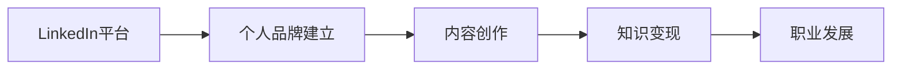

                 

# 程序员如何利用LinkedIn进行知识变现

> 关键词：知识变现, 程序员, LinkedIn, 专业网络, 个人品牌, 职业发展, 社交媒体, 内容创作, 职业转型

## 1. 背景介绍

在信息爆炸和职业竞争日趋激烈的今天，程序员们如何有效利用社交媒体平台，提升个人品牌，实现知识变现，成为了一个热门话题。而LinkedIn作为全球最大的职业社交网络，其平台丰富的功能和广泛的用户基础，为程序员提供了绝佳的机会。本文将深入探讨如何利用LinkedIn进行知识变现，帮助程序员打造个人品牌，实现职业发展和商业变现的梦想。

## 2. 核心概念与联系

### 2.1 核心概念概述

- **LinkedIn**：全球最大的职业社交网络，连接了数亿用户，为职业人士提供了广泛的网络和资源。
- **知识变现**：利用自己的专业知识、技能和经验，通过各种方式（如咨询、培训、写作等）获得经济收益。
- **个人品牌**：通过在社交媒体上展示自己的专业知识、成就和价值，建立自己独特的职业形象和市场地位。
- **职业发展**：利用社交网络拓展职业机会，获得更多的工作机会、合作机会和职业晋升机会。

这些概念相互关联，共同构成了一种职业发展新模式，帮助程序员实现从技术专家到行业领袖的转型。

### 2.2 核心概念原理和架构的 Mermaid 流程图



这个流程图展示了一个简单的LinkedIn知识变现模型：通过在LinkedIn上建立个人品牌，创作有价值的内容，实现知识变现，从而推动职业发展。

## 3. 核心算法原理 & 具体操作步骤

### 3.1 算法原理概述

利用LinkedIn进行知识变现，核心在于建立和维护一个具有高价值的个人品牌，并通过内容创作、互动和网络拓展等方式实现知识的货币化。整个过程包括个人品牌的构建、内容创作与分享、互动交流和职业机会的把握。

### 3.2 算法步骤详解

1. **个人品牌构建**：
    - 完善个人资料：详细填写工作经历、教育背景、技能和成就，并上传专业照片。
    - 突出专业领域：清晰地标注自己的专业领域，如编程语言、技术栈、项目管理等，方便潜在雇主和客户找到你。
    - 推荐信和背书：邀请行业内知名人士为自己提供推荐信和专业背书，增强个人品牌可信度。

2. **内容创作与分享**：
    - 发布文章和博客：撰写与个人专业领域相关的高质量文章，分享技术见解、行业趋势、项目经验等。
    - 发布项目和案例：展示个人参与的项目和案例，详细介绍技术实现、问题解决和创新点。
    - 参与讨论和评论：在相关话题下积极评论和讨论，分享自己的见解和解决方案，建立权威性。

3. **互动交流**：
    - 主动添加行业内人士：添加LinkedIn上知名的行业专家和潜在客户，扩大人脉网络。
    - 定期更新和互动：定期更新个人资料和文章，与业内人士保持互动，回应评论和私信，增强网络关系。

4. **职业机会把握**：
    - 申请职位和招聘信息：利用LinkedIn的招聘功能，申请感兴趣的职位，或在相关职位发布招聘信息。
    - 参与项目和合作：通过LinkedIn联系业内人士，寻找合作项目和机会，参与技术交流和项目开发。

### 3.3 算法优缺点

**优点**：
- **广泛网络**：LinkedIn连接了数亿用户，包括企业高管、技术专家、创业者等，为知识变现提供了广阔平台。
- **专业氛围**：LinkedIn以职业和行业为分类，用户群体专业性强，有利于知识的精准传播和变现。
- **持续互动**：通过定期更新和互动，可以持续提升个人品牌价值，保持与行业内的联系。

**缺点**：
- **学习成本**：利用LinkedIn进行知识变现需要掌握一定的社交技巧和内容创作能力，学习成本较高。
- **竞争激烈**：LinkedIn上的用户众多，如何在众多专家中脱颖而出，需要花费大量时间和精力。
- **内容质量要求高**：发布高质量内容才能吸引关注和互动，对内容创作者的要求较高。

### 3.4 算法应用领域

LinkedIn的知识变现应用领域非常广泛，主要包括以下几个方面：

- **技术咨询**：通过LinkedIn展示自己的专业知识和经验，吸引客户进行技术咨询。
- **在线培训**：制作技术教程、项目案例等内容，提供在线培训和课程销售。
- **技术博客**：开设技术博客，撰写高质量的技术文章，吸引读者付费订阅或广告收入。
- **项目管理**：通过LinkedIn发布项目管理和咨询服务，吸引潜在客户。
- **求职和招聘**：利用LinkedIn发布职位信息，并寻找合适的求职机会。

## 4. 数学模型和公式 & 详细讲解 & 举例说明

### 4.1 数学模型构建

为了更好地理解LinkedIn知识变现的数学模型，我们可以从以下几个角度来构建：

1. **个人品牌影响力模型**：
    - 设个人品牌影响力为 $I$，由多方面因素决定，包括专业领域认可度、文章阅读量、互动数量等。

2. **内容创作收益模型**：
    - 设内容创作收益为 $P$，与内容质量、读者付费意愿、阅读量等有关。

3. **职业机会获取模型**：
    - 设职业机会获取数量为 $O$，与个人品牌影响力、互动质量、职位申请数量等有关。

### 4.2 公式推导过程

假设个人品牌影响力 $I$ 由以下几个因素决定：

- 专业领域认可度 $D$：
  $$
  D = \frac{A + B}{2}
  $$
  其中 $A$ 为粉丝数，$B$ 为推荐信和背书数量。

- 文章阅读量 $R$：
  $$
  R = C \cdot \frac{S}{T}
  $$
  其中 $C$ 为每篇文章的平均阅读量，$S$ 为文章数量，$T$ 为时间周期。

- 互动数量 $I$：
  $$
  I = \frac{M + D}{2}
  $$
  其中 $M$ 为评论数量，$D$ 为点赞数量。

将这些因素综合起来，得到个人品牌影响力的公式：

$$
I = \sqrt{D + R + I}
$$

内容创作收益 $P$ 可以表示为：

$$
P = K \cdot \frac{Q}{U}
$$
其中 $K$ 为每篇文章的平均收益，$Q$ 为文章数量，$U$ 为时间周期。

职业机会获取数量 $O$ 可以表示为：

$$
O = L \cdot \frac{N}{H}
$$
其中 $L$ 为每天申请的职位数量，$N$ 为职位数量，$H$ 为时间周期。

### 4.3 案例分析与讲解

假设某技术专家通过LinkedIn展示自己的专业知识和经验，吸引了大量粉丝和关注，并通过高质量的博客和文章吸引了大量读者。在一个月内，他发布了10篇文章，每篇文章的平均阅读量为10,000，平均收益为100元。同时，他每天申请5个职位，最终获得了10个职位面试机会。

根据上述模型，可以计算出他的个人品牌影响力 $I$ 和内容创作收益 $P$：

$$
I = \sqrt{\frac{A + B}{2} + C \cdot \frac{S}{T} + \frac{M + D}{2}}
$$

$$
P = K \cdot \frac{Q}{U}
$$

通过这些公式，可以清晰地看到个人品牌影响力的提升和内容创作收益的来源。

## 5. 项目实践：代码实例和详细解释说明

### 5.1 开发环境搭建

要利用LinkedIn进行知识变现，需要搭建一个开发环境，主要包括以下几个步骤：

1. **安装LinkedIn API**：
   - 前往[LinkedIn Developer](https://www.linkedin.com/developers/)注册开发者账号，创建应用程序。
   - 生成API密钥和访问令牌，并将其存储在本地环境变量中。

2. **编写API脚本**：
   - 使用Python编写API脚本，实现与LinkedIn的接口交互，如发布文章、更新个人资料等。

3. **部署到服务器**：
   - 将脚本部署到服务器，并设置定时任务，定期更新和发布内容。

### 5.2 源代码详细实现

以下是使用Python编写的LinkedIn API脚本示例，演示如何发布一篇文章：

```python
import os
from linkedin_api import LinkedInClient
from linkedin_api.auth import OfflineUserConsentGrant
from linkedin_api.nodes import Post

def post_article(client, article_title, article_content):
    post = Post(title=article_title, content=article_content)
    client.api().articles.create(post)
    print("Article posted successfully!")

if __name__ == "__main__":
    # 设置LinkedIn API密钥和访问令牌
    access_token = os.environ.get('LINKEDIN_ACCESS_TOKEN')
    secret_key = os.environ.get('LINKEDIN_CLIENT_SECRET')
    redirect_uri = os.environ.get('LINKEDIN_REDIRECT_URI')

    # 创建LinkedIn客户端
    client = LinkedInClient(access_token=access_token, client_secret=secret_key, redirect_uri=redirect_uri)

    # 发布一篇文章
    post_article(client, "Title of the Article", "Content of the article")
```

### 5.3 代码解读与分析

上述代码展示了如何使用LinkedIn API发布一篇文章。其中：

- `LinkedInClient` 是LinkedIn API的客户端类，用于与LinkedIn进行交互。
- `OfflineUserConsentGrant` 用于授权登录，通过OAuth2认证机制获取访问令牌。
- `Post` 是文章节点类，用于构建和发布文章。

要使用上述代码，需要先在LinkedIn Developer页面注册应用，并生成API密钥和访问令牌。然后在本地环境中设置环境变量，并运行脚本，即可完成文章发布。

### 5.4 运行结果展示

运行上述代码后，将在LinkedIn上发布一篇新文章。通过查看文章页面和互动情况，可以评估文章的效果，并进一步优化内容创作策略。

## 6. 实际应用场景

### 6.1 LinkedIn在技术咨询中的应用

LinkedIn平台上的专家可以通过展示自己的专业知识和经验，吸引客户进行技术咨询。客户可以通过LinkedIn找到合适的专家，预约咨询并付费。这种方式能够提高专家的知名度和收入，同时也为客户提供了便捷的技术支持。

### 6.2 LinkedIn在在线培训中的应用

技术专家可以通过在LinkedIn上发布高质量的教程和案例，吸引读者付费订阅或购买课程。这种方式能够帮助专家快速建立品牌，同时也为读者提供了专业的技术学习资源。

### 6.3 LinkedIn在技术博客中的应用

开设LinkedIn博客，撰写高质量的技术文章，可以吸引大量读者关注和订阅。作者可以通过广告收入、付费订阅等方式实现内容变现。

### 6.4 LinkedIn在求职和招聘中的应用

利用LinkedIn发布职位信息，并寻找合适的求职机会。这种方式能够帮助企业找到合适的人才，同时也为求职者提供了更多的职业机会。

### 6.5 未来应用展望

未来，LinkedIn在知识变现方面的应用将更加广泛和深入。随着AI技术的不断发展，LinkedIn有望利用智能推荐和个性化展示功能，进一步提升知识变现的效率和效果。同时，随着隐私保护意识的增强，LinkedIn平台也将更加注重数据安全和用户隐私保护。

## 7. 工具和资源推荐

### 7.1 学习资源推荐

为了更好地利用LinkedIn进行知识变现，以下是一些推荐的学习资源：

1. **LinkedIn Learning**：提供丰富的LinkedIn平台使用教程和技巧，帮助用户提升社交和内容创作能力。
2. **Coursera**：提供职业发展和知识管理的课程，帮助用户建立个人品牌和提升职场竞争力。
3. **Google Analytics**：学习如何利用数据和分析工具，优化LinkedIn内容策略，提升互动效果。

### 7.2 开发工具推荐

以下是一些推荐的开发工具，帮助用户高效地利用LinkedIn进行知识变现：

1. **Python**：作为一种强大的编程语言，Python广泛应用于LinkedIn API开发和数据分析。
2. **LinkedIn API**：提供了丰富的API接口，方便开发者进行API调用和数据处理。
3. **Jupyter Notebook**：用于编写和运行Python脚本，方便开发和测试。

### 7.3 相关论文推荐

以下是几篇推荐的相关论文，深入探讨了LinkedIn在知识变现方面的理论和实践：

1. **"LinkedIn Knowledge Sharing and Professional Networking"**：分析LinkedIn平台上的知识共享和网络构建策略，探讨其对职业发展的影响。
2. **"Using LinkedIn for Career Advancement and Knowledge Sharing"**：介绍如何通过LinkedIn提升职业发展，实现知识变现。
3. **"The Role of LinkedIn in Knowledge Management and Organizational Learning"**：探讨LinkedIn在知识管理组织学习和团队协作中的应用。

## 8. 总结：未来发展趋势与挑战

### 8.1 研究成果总结

本文深入探讨了如何利用LinkedIn进行知识变现，通过建立个人品牌、创作高质量内容、拓展职业网络等方式，实现职业发展和商业变现。LinkedIn作为全球最大的职业社交网络，为程序员提供了广阔的平台和丰富的机会。

### 8.2 未来发展趋势

未来，LinkedIn在知识变现方面的应用将更加广泛和深入。随着AI技术的不断发展，LinkedIn有望利用智能推荐和个性化展示功能，进一步提升知识变现的效率和效果。同时，随着隐私保护意识的增强，LinkedIn平台也将更加注重数据安全和用户隐私保护。

### 8.3 面临的挑战

尽管LinkedIn提供了广阔的发展平台，但利用其进行知识变现也面临着一些挑战：

1. **竞争激烈**：LinkedIn上的用户众多，如何在众多专家中脱颖而出，需要花费大量时间和精力。
2. **内容质量要求高**：发布高质量内容才能吸引关注和互动，对内容创作者的要求较高。
3. **隐私保护**：如何在保证隐私保护的前提下，最大化利用LinkedIn平台进行知识变现。

### 8.4 研究展望

未来，LinkedIn在知识变现方面的研究将从以下几个方面展开：

1. **智能推荐系统**：利用AI技术优化LinkedIn的推荐算法，提升内容发现效率。
2. **个性化展示**：根据用户的兴趣和行为，个性化展示内容，提升互动效果。
3. **隐私保护**：加强数据隐私保护，确保用户信息的安全性。

## 9. 附录：常见问题与解答

**Q1：LinkedIn适合所有类型的技术专家吗？**

A: 是的，LinkedIn适合所有类型的技术专家，无论是软件开发、数据科学、人工智能、网络安全等，都可以通过LinkedIn展示自己的专业知识和经验，实现知识变现。

**Q2：LinkedIn上的互动是否重要？**

A: 非常重要。通过与业内人士的互动，可以提升个人品牌影响力和内容质量，吸引更多的关注和机会。

**Q3：如何提高文章阅读量和互动量？**

A: 提高文章质量、选择合适的话题、定期发布内容、积极回复评论和私信等都是提高阅读量和互动量的有效方法。

**Q4：LinkedIn如何帮助求职者找到工作？**

A: 通过LinkedIn发布职位信息、主动添加潜在雇主、参与招聘小组、发布推荐信和背书等，可以提升求职成功率。

---

作者：禅与计算机程序设计艺术 / Zen and the Art of Computer Programming

