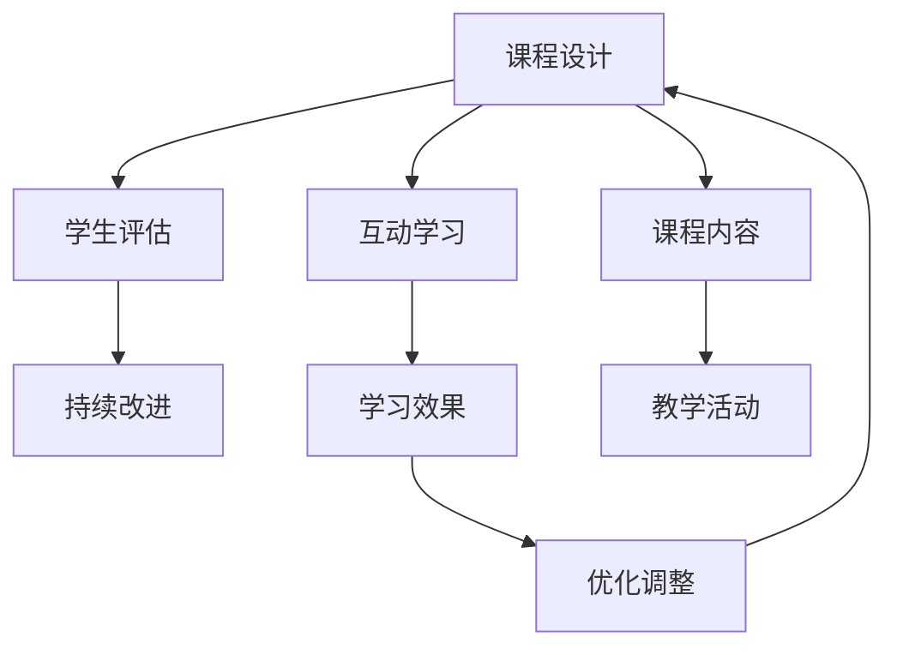

                 

# 程序员如何利用Skillshare教授技术课程

> 关键词：编程教育, 技能培训, 在线教育, 课程设计, 学生评估

## 1. 背景介绍

### 1.1 问题由来
随着技术的不断进步和互联网的发展，在线教育平台已经成为了教育领域的一股新势力。相比传统的线下课堂，在线教育打破了时间和空间的限制，为更多人提供了学习机会。其中，Skillshare作为一个专注于技能培训的在线平台，为来自全球的程序员和技术人员提供了丰富的学习资源和交流平台。

然而，虽然Skillshare拥有大量的课程资源和高质量的教学内容，但如何设计有效的课程体系，确保学生能够高效、系统地掌握技术技能，仍然是一个需要深入探讨的问题。本文将从课程设计的角度，详细介绍如何利用Skillshare教授技术课程，为教师提供一些实用的建议和参考。

### 1.2 问题核心关键点
在Skillshare教授技术课程的核心关键点包括：
- **课程内容设计**：如何系统化、逻辑性地组织课程内容，确保学生能够掌握关键知识点。
- **互动与反馈**：如何通过互动和及时反馈，提高学生的学习兴趣和效果。
- **评估与测验**：如何设计合理的评估机制，确保学生掌握所学内容。
- **持续改进**：如何根据学生的反馈和教学效果，持续优化课程设计。

## 2. 核心概念与联系

### 2.1 核心概念概述

为更好地理解在Skillshare教授技术课程的方法，本节将介绍几个密切相关的核心概念：

- **课程设计（Curriculum Design）**：指根据课程目标和学生需求，合理组织课程内容的过程。包括课程目标设定、教学内容选择、教学活动设计等。
- **互动学习（Interactive Learning）**：指通过互动活动（如讨论、小组作业、实时问答等）提高学生参与度，促进知识内化的学习方式。
- **学生评估（Student Assessment）**：指通过各种方式（如测验、项目作业、在线测验等）评估学生对课程内容的掌握程度。
- **持续改进（Continuous Improvement）**：指根据学生的反馈和评估结果，不断优化课程内容和教学方法，提高教学质量的过程。

这些核心概念之间的逻辑关系可以通过以下Mermaid流程图来展示：



这个流程图展示了几类核心概念之间的逻辑关系：

1. 课程设计是整个教学过程的起点，决定着教学内容的结构和教学活动的方式。
2. 互动学习通过提高学生的参与度，有助于知识的吸收和应用。
3. 学生评估通过反馈和测验，帮助教师了解学生的学习状况。
4. 持续改进基于评估结果，不断优化课程设计和教学方法。
5. 教学活动是课程设计的具体实践，学习效果是互动学习的直接表现。

## 3. 核心算法原理 & 具体操作步骤
### 3.1 算法原理概述

在Skillshare教授技术课程，本质上是一个系统化、结构化的教学过程。其核心思想是通过科学合理的课程设计，结合互动学习与学生评估，持续优化教学方法，以实现最佳的教学效果。

形式化地，假设课程总时长为 $T$，教学内容为 $C$，学生数量为 $N$，教学活动为 $A$，互动学习活动为 $I$，学生评估结果为 $E$。课程设计的目标是通过优化上述变量，最大化学生的学习效果 $L$。即：

$$
L = \max_{T, C, N, A, I, E} L(T, C, N, A, I, E)
$$

其中，$L(T, C, N, A, I, E)$ 为学习效果函数，表示在一定条件下，学生的学习效果。

### 3.2 算法步骤详解

基于科学合理的课程设计，在Skillshare教授技术课程的一般步骤如下：

**Step 1: 确定课程目标和内容**
- 明确课程的目标和预期成果，如掌握某项技术技能、完成某个项目、理解某类概念等。
- 根据目标，选择合适的教学内容，确保其科学性和实用性。

**Step 2: 设计互动学习活动**
- 选择适合的教学活动，如案例分析、小组讨论、实战项目等。
- 设计互动环节，如实时问答、课堂测验、小组合作等，增强学生的参与感。

**Step 3: 实施教学活动**
- 按照设计好的教学活动进行课堂教学，确保学生能够理解和掌握课程内容。
- 实时监控学生的学习状态，提供及时的指导和支持。

**Step 4: 进行学生评估**
- 通过各种方式评估学生的学习效果，如在线测验、项目作业、期末考试等。
- 根据评估结果，分析学生的不足之处，调整教学策略。

**Step 5: 进行持续改进**
- 根据学生反馈和评估结果，不断优化课程设计和教学方法。
- 更新教学内容，引入新的技术知识和案例。

### 3.3 算法优缺点

在Skillshare教授技术课程，具有以下优点：
1. 灵活性高。课程设计和教学活动可以根据学生需求进行调整，灵活应对不同学生的学习情况。
2. 互动性强。通过互动学习活动，能够提高学生的参与度和兴趣，增强学习效果。
3. 评估便捷。利用在线平台进行评估，数据收集和分析更加便捷，便于优化教学策略。
4. 持续改进。通过持续改进机制，教师能够及时发现问题，优化课程设计，提升教学质量。

同时，该方法也存在一些局限性：
1. 对教师要求高。教师需要具备丰富的技术知识和教学经验，才能设计出有效的课程和教学活动。
2. 需要持续投入。课程设计和优化需要耗费大量时间和精力，教师需要持续进行学习和研究。
3. 依赖学生自主性。学生的学习效果很大程度上依赖其自主性和学习动机，无法完全依靠教师引导。

尽管存在这些局限性，但就目前而言，在Skillshare教授技术课程依然是一种高效、科学、灵活的教学方法，能够帮助学生高效掌握技术技能。

### 3.4 算法应用领域

基于Skillshare的教学方法，适用于各类技术课程的设计与实施，包括但不限于：

- 软件开发：如Python编程、Web开发、移动应用开发等。
- 数据科学与机器学习：如数据清洗、特征工程、模型训练等。
- 人工智能与深度学习：如神经网络、自然语言处理、计算机视觉等。
- 网络和系统架构：如网络安全、分布式系统、云计算等。
- 软件测试：如单元测试、集成测试、自动化测试等。

除了上述这些经典领域，Skillshare的教学方法也适用于更多新兴领域和交叉学科，为学生的学习和职业发展提供全方位的支持。

## 4. 数学模型和公式 & 详细讲解 & 举例说明

### 4.1 数学模型构建

在Skillshare教授技术课程，可以通过建立数学模型来系统地描述和分析教学过程。

假设课程目标为 $T$，教学内容为 $C$，学生数量为 $N$，互动学习活动为 $I$，学生评估结果为 $E$。则课程设计的目标可以表示为：

$$
L = f(T, C, N, I, E)
$$

其中，$f$ 为学习效果函数，表示在一定条件下，学生的学习效果。

### 4.2 公式推导过程

以Python编程课程为例，我们可以将学习效果函数 $f$ 拆分为多个子函数，每个子函数代表不同的教学环节对学习效果的影响：

$$
f = f_{内容}(T, C) + f_{活动}(T, N, I) + f_{评估}(N, E)
$$

其中，$f_{内容}$ 表示教学内容对学习效果的影响，$f_{活动}$ 表示互动学习活动对学习效果的影响，$f_{评估}$ 表示学生评估对学习效果的影响。

具体推导过程如下：

**内容部分**：
- 教学内容 $C$ 通过合理设计，能够帮助学生掌握核心概念和技能。设 $C$ 的复杂度为 $c$，则 $f_{内容}$ 可以表示为：

$$
f_{内容}(T, C) = C^{\alpha} \cdot T^{\beta}
$$

其中，$\alpha$ 和 $\beta$ 为影响因子，控制内容复杂度和教学时间的关系。

**活动部分**：
- 互动学习活动 $I$ 能够提高学生的参与度和兴趣。设 $I$ 的活跃度为 $i$，则 $f_{活动}$ 可以表示为：

$$
f_{活动}(T, N, I) = N^{\gamma} \cdot I^{\delta}
$$

其中，$\gamma$ 和 $\delta$ 为影响因子，控制学生数量和活动活跃度的关系。

**评估部分**：
- 学生评估 $E$ 能够提供反馈，帮助教师优化教学策略。设 $E$ 的准确性为 $e$，则 $f_{评估}$ 可以表示为：

$$
f_{评估}(N, E) = N^{\epsilon} \cdot E^{\zeta}
$$

其中，$\epsilon$ 和 $\zeta$ 为影响因子，控制学生数量和评估准确性的关系。

### 4.3 案例分析与讲解

假设我们设计了一门Python编程课程，课程时长为120小时，教学内容分为基础语法、数据结构、算法设计、项目实战四个部分，学生数量为30人。互动学习活动包括小组讨论、案例分析、在线测验等，每周举行三次。学生评估包括在线测验、项目作业、期末考试。

根据上述模型，我们可以计算出学习效果函数：

$$
L = f_{内容}(120, C) + f_{活动}(120, 30, 3) + f_{评估}(30, E)
$$

其中，$C$ 和 $E$ 的具体值需要根据实际教学情况进行调整和优化。

## 5. 项目实践：代码实例和详细解释说明
### 5.1 开发环境搭建

在进行课程设计和教学实践前，我们需要准备好开发环境。以下是使用Python和Skillshare平台进行课程设计的环境配置流程：

1. 安装Python：从官网下载并安装Python 3.x版本，确保所有依赖包能够正常运行。

2. 安装Skillshare API：根据官方文档，安装并配置Skillshare API，以便进行数据获取和课程发布。

3. 安装相关库：安装必要的Python库，如Pandas、NumPy、Matplotlib等，用于数据分析和可视化。

完成上述步骤后，即可在Python环境中进行课程设计和管理。

### 5.2 源代码详细实现

下面我们以Python编程课程为例，给出在Skillshare上设计和发布课程的Python代码实现。

首先，设计课程结构，将课程内容分为若干模块：

```python
modules = [
    '基础语法',
    '数据结构',
    '算法设计',
    '项目实战'
]
```

然后，定义每个模块的课时安排和教学内容：

```python
module_times = {
    '基础语法': 20,
    '数据结构': 40,
    '算法设计': 30,
    '项目实战': 30
}

module_contents = {
    '基础语法': 'Python基本语法介绍',
    '数据结构': '数据结构与算法基础',
    '算法设计': '常用算法实现与优化',
    '项目实战': '实战项目设计与实现'
}
```

接着，设计互动学习活动：

```python
interaction_activities = {
    '小组讨论': 5,
    '案例分析': 10,
    '在线测验': 10
}
```

最后，实现学生评估机制：

```python
def student_assessment(student_id):
    # 根据学生ID，调用Skillshare API获取评估结果
    # 返回评估结果，如考试成绩、项目作业等
    pass
```

通过上述代码，我们完成了课程结构和互动学习活动的定义，接下来需要根据这些信息，生成课程大纲和教学计划。

### 5.3 代码解读与分析

让我们再详细解读一下关键代码的实现细节：

**模块结构**：
- 定义了课程的四个主要模块，并给出每个模块的课时安排和教学内容。

**互动学习活动**：
- 定义了三种互动学习活动及其课时，确保学生能够通过不同方式参与课堂教学。

**学生评估**：
- 设计了一个学生评估函数，通过调用Skillshare API获取评估结果，返回学生的成绩和反馈。

**课程大纲和教学计划**：
- 通过上述信息，可以生成一个详细的课程大纲，并安排每节课的教学活动。

## 6. 实际应用场景
### 6.1 软件开发课程

在Skillshare教授软件开发课程，可以采用项目导向的教学方法，让学生通过实际项目，掌握开发流程和实践技能。课程可以分为以下几个阶段：

- **需求分析**：了解用户需求，设计系统架构。
- **编码实现**：编写代码，实现系统功能。
- **测试与调试**：进行单元测试、集成测试，修复bug。
- **部署与维护**：将系统部署到生产环境，进行后续维护。

通过项目导向的教学，学生不仅能够掌握技术知识，还能学会系统思考和问题解决能力。

### 6.2 数据科学与机器学习课程

在Skillshare教授数据科学与机器学习课程，可以采用案例驱动的教学方法，通过数据分析和模型训练，让学生理解数据科学的工作流程。课程可以分为以下几个部分：

- **数据预处理**：数据清洗、特征工程。
- **模型训练**：选择合适的算法，训练模型。
- **模型评估**：验证模型效果，进行调优。
- **实际应用**：将模型应用于实际问题，解决数据科学问题。

通过案例驱动的教学，学生能够深刻理解数据科学的核心技术和方法。

### 6.3 人工智能与深度学习课程

在Skillshare教授人工智能与深度学习课程，可以采用理论结合实践的教学方法，通过深度学习框架（如TensorFlow、PyTorch等），让学生掌握深度学习模型的构建和应用。课程可以分为以下几个环节：

- **理论基础**：学习深度学习的基本概念和理论。
- **模型实现**：通过深度学习框架，实现各种深度学习模型。
- **模型优化**：进行超参数调整、模型优化，提升模型效果。
- **实际应用**：将模型应用于图像识别、自然语言处理等领域，解决实际问题。

通过理论结合实践的教学，学生能够掌握深度学习的核心技术和应用场景。

## 7. 工具和资源推荐
### 7.1 学习资源推荐

为了帮助教师系统掌握Skillshare的教学方法，这里推荐一些优质的学习资源：

1. **Skillshare官方文档**：提供详细的API文档和课程发布指南，是技能培训教师的必备参考资料。
2. **在线课程设计教程**：如Coursera、Udacity等平台上的课程设计课程，涵盖课程设计的基本原则和方法。
3. **编程教学资源**：如GitHub、Stack Overflow等平台上的开源项目和代码库，提供丰富的教学案例和代码示例。
4. **教学评估工具**：如Quizizz、Kahoot!等平台，提供多种类型的在线测验和互动工具，便于教师评估学生的学习效果。

通过对这些资源的学习实践，相信你一定能够快速掌握Skillshare的教学方法，并用于解决实际的课程设计问题。

### 7.2 开发工具推荐

高效的课程设计和教学实践离不开优秀的工具支持。以下是几款用于Skillshare教学开发的常用工具：

1. **Python编程语言**：具有丰富的库和框架，适合进行数据分析、编程教学。
2. **Skillshare API**：提供了丰富的API接口，方便教师获取课程数据和发布课程内容。
3. **在线测验平台**：如Quizizz、Kahoot!等平台，提供多种类型的在线测验和互动工具，便于教师评估学生的学习效果。
4. **教学管理平台**：如Moodle、Edmodo等平台，提供教学管理、资源共享等功能，方便教师进行课程管理和学生互动。

合理利用这些工具，可以显著提升Skillshare课程的教学质量和开发效率，加快创新迭代的步伐。

### 7.3 相关论文推荐

技能培训教育领域的研究不断涌现，以下是几篇奠基性的相关论文，推荐阅读：

1. **编程教育的心理学原理**：探讨编程教育中学生的认知特点和心理机制，提出有效的教学策略。
2. **在线学习的反馈机制**：研究在线学习平台中的反馈机制，探讨如何提高学生的学习动机和效果。
3. **基于项目的教学方法**：讨论基于项目的学习方法，分析其优势和应用场景。
4. **人工智能教育的未来发展**：展望人工智能教育的未来，探讨新兴技术和教学方法对教育的影响。

这些论文代表了大规模在线教育的研究方向，为教师提供系统的理论支撑和实践指导。

## 8. 总结：未来发展趋势与挑战
### 8.1 总结

本文对在Skillshare教授技术课程的方法进行了全面系统的介绍。首先阐述了Skillshare教育平台的重要性和教学方法的核心关键点，明确了技能培训教师需要掌握的课程设计、互动学习、学生评估和持续改进等重要环节。其次，从原理到实践，详细讲解了Skillshare课程设计的数学模型和具体步骤，提供了完整的课程设计代码实现，便于教师学习和应用。同时，本文还广泛探讨了技术课程在软件开发、数据科学、人工智能等领域的应用场景，展示了技能培训教育的广阔前景。

通过本文的系统梳理，可以看到，在Skillshare教授技术课程，需要教师系统化、结构化地组织教学内容，科学设计互动学习活动，合理评估学生学习效果，持续优化教学策略，方能实现最佳的教学效果。

### 8.2 未来发展趋势

展望未来，Skillshare技能培训教育将呈现以下几个发展趋势：

1. **AI辅助教学**：利用人工智能技术，如机器学习、自然语言处理等，优化课程设计、自动生成教学内容、实时评估学生学习效果，提升教学质量。
2. **混合式教学**：结合线下和线上教学，提供多样化的学习方式，满足不同学生的需求。
3. **个性化学习**：根据学生的学习习惯和能力，定制个性化的学习计划，提升学习效果。
4. **实时反馈与互动**：利用实时反馈和互动技术，提高学生的参与度和学习效果。
5. **跨领域融合**：将编程、数据科学、人工智能等不同领域的技术知识进行跨领域融合，培养综合性人才。

这些趋势将推动Skillshare技能培训教育不断进步，为学生的职业发展和技能提升提供全方位的支持。

### 8.3 面临的挑战

尽管Skillshare技能培训教育在近年来取得了显著成效，但在迈向更加智能化、普适化应用的过程中，仍面临诸多挑战：

1. **教学资源短缺**：优质教师和教学资源仍然不足，难以满足大规模在线教育的需求。
2. **技术复杂度增加**：AI辅助教学等新技术的引入，增加了教学设计和实施的复杂度。
3. **学生自主性差**：在线学习环境容易受到外部干扰，学生的自主学习能力和动机难以保障。
4. **评估难度高**：在线学习评估难度较大，缺乏有效的评估机制，难以准确反映学生的学习效果。
5. **数据隐私问题**：在线学习平台涉及大量学生数据，数据隐私和安全问题需要高度关注。

这些挑战需要学界和产业界的共同努力，持续改进和优化，才能实现大规模在线教育的可持续发展。

### 8.4 研究展望

面向未来，Skillshare技能培训教育需要在以下几个方面进行进一步研究：

1. **教学资源的丰富化**：开发更多的教学资源和工具，提高教师的教学效率和学生的学习效果。
2. **技术融合的深入化**：探索AI、大数据等新兴技术在技能培训教育中的应用，提升教学质量和效果。
3. **学生评估的精确化**：研究更有效的评估方法和工具，准确评估学生的学习效果，为教学优化提供依据。
4. **隐私保护的多样化**：探索数据隐私保护技术，确保学生数据的安全和隐私。

这些研究方向将推动Skillshare技能培训教育的不断进步，为学生的职业发展和技能提升提供更加坚实的基础。

## 9. 附录：常见问题与解答
**Q1：如何设计有效的互动学习活动？**

A: 设计有效的互动学习活动需要考虑以下几点：
1. 活动目标明确：每次活动前，明确活动目标和期望达到的效果。
2. 活动形式多样：采用小组讨论、案例分析、角色扮演等多种形式，增加学生参与度。
3. 活动内容精炼：活动内容应简明扼要，避免冗长复杂，确保学生能够迅速掌握知识点。
4. 活动时间适中：活动时间不宜过长或过短，通常控制在10-20分钟为宜。
5. 活动反馈及时：活动结束后，及时提供反馈，帮助学生理解学习效果和改进方向。

**Q2：如何评估学生学习效果？**

A: 评估学生学习效果可以通过以下几种方式：
1. 在线测验：通过在线测试题目，评估学生的理论知识掌握情况。
2. 项目作业：让学生完成实际项目，评估其应用能力。
3. 课堂互动：通过课堂讨论和提问，评估学生的理解深度和思考能力。
4. 期末考试：通过期末考试，全面评估学生的综合能力。
5. 持续跟踪：通过学习轨迹和数据分析，持续跟踪学生的学习效果，及时发现问题并进行干预。

**Q3：如何优化课程设计？**

A: 优化课程设计需要根据学生反馈和评估结果进行调整和改进，具体步骤如下：
1. 收集学生反馈：通过问卷调查、在线讨论等方式，收集学生的反馈意见。
2. 分析评估结果：根据学生评估结果，分析课程设计中的不足和改进点。
3. 调整教学内容：根据反馈和评估结果，调整课程内容和教学方法。
4. 更新教学资源：及时更新教学资源和工具，确保课程内容的先进性和实用性。
5. 持续改进机制：建立持续改进机制，定期优化课程设计，提升教学质量。

**Q4：如何在Skillshare上发布课程？**

A: 在Skillshare上发布课程需要遵循以下步骤：
1. 注册并登录Skillshare账号，进入课程发布界面。
2. 填写课程信息，包括课程名称、描述、价格等。
3. 上传教学视频、PPT、代码等教学资源。
4. 设计课程大纲，安排教学计划。
5. 发布课程，并在社交媒体上进行宣传推广。

通过上述步骤，教师可以在Skillshare上发布优质的技术课程，为学生提供有价值的学习资源。

---

作者：禅与计算机程序设计艺术 / Zen and the Art of Computer Programming

