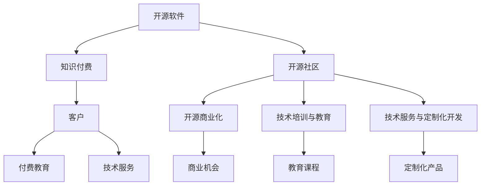

                 

# 程序员如何将开源项目转化为知识付费产品

> 关键词：开源项目,知识付费,软件开源,开源商业化,软件开发,技术分享,付费教育,软件课程

## 1. 背景介绍

### 1.1 问题由来
在当今信息爆炸的时代，开源软件项目凭借其开放、协作、可持续的特性，成为了软件开发者和科研人员的宝库。从Linux操作系统、Apache Web服务器到TensorFlow、PyTorch等深度学习框架，开源项目极大地推动了技术的进步和社会的进步。

然而，开源项目的维护和开发往往依赖于开源社区的贡献，很少能够实现商业化运作。这对项目的发展、社区的长期健康以及开发者的利益都带来了不少挑战。为了破解这一难题，越来越多的开发者开始探索如何将开源项目转化为知识付费产品，以实现开源社区和商业回报的双赢。

### 1.2 问题核心关键点
开源项目商业化的关键在于找到商业化的切入点，即如何将开源项目中的技术知识转化为可以付费的产品或服务。以下是实现开源项目商业化的核心关键点：

1. **社区贡献与付费教育**：如何将开源项目的贡献者与知识付费产品联系起来，使得他们在社区的贡献能够得到金钱回报。
2. **定制化开发与技术服务**：如何将开源项目的技术封装为定制化的服务，满足企业的特定需求，从而获得商业机会。
3. **教育培训与技术培训**：通过开发教育培训课程，传授开源项目中的技术知识和实践经验，实现知识变现。
4. **开源与私有混合使用**：根据不同客户需求，提供开源软件和私有定制软件的组合，满足客户在成本和安全性上的双重需求。
5. **产品集成与解决方案**：将开源软件集成到企业解决方案中，提供全方位的技术支持和服务。

### 1.3 问题研究意义
开源项目商业化对于开源社区和软件开发领域具有重要意义：

1. **开源社区的可持续性**：商业化运作可以为开源社区提供稳定的资金来源，保障项目的持续维护和发展。
2. **开发者的利益回报**：开发者可以在开源项目中投入更多的时间和精力，提高项目质量。
3. **技术传播与推广**：通过付费教育和技术培训，促进技术知识的传播和应用，加速技术创新。
4. **企业需求满足**：为不同企业提供定制化的技术解决方案，满足其特定需求，提升竞争力。

## 2. 核心概念与联系

### 2.1 核心概念概述

为了更好地理解如何将开源项目转化为知识付费产品，本节将介绍几个密切相关的核心概念：

- **开源软件(Open Source Software, OSS)**：指公开源代码的软件，允许用户自由使用、修改和分发。
- **知识付费(Knowledge as a Service, KaaS)**：指通过互联网提供知识或信息服务，用户支付一定的费用以获取高质量的内容和专业知识。
- **开源社区(Open Source Community)**：指基于开源理念，围绕特定开源项目而形成的社区，开发者共享代码、交流技术。
- **开源商业化(Open Source Commercialization)**：指将开源软件项目转化为可商业化的产品或服务，实现开源社区和商业回报的双赢。
- **技术培训与教育(Training & Education)**：指通过教育课程、技术分享、实践操作等方式，传授技术知识，培养技术人才。
- **技术服务与定制化开发(Service & Custom Development)**：指为特定企业提供定制化的技术服务，解决其具体技术问题，满足业务需求。

这些核心概念之间的逻辑关系可以通过以下Mermaid流程图来展示：



这个流程图展示了大语言模型开源项目商业化的核心概念及其之间的关系：

1. 开源软件通过开源社区的贡献和维护，不断更新和完善。
2. 开源社区的知识和资源通过开源商业化，转化为付费产品和服务。
3. 技术培训与教育提供高质量的知识内容，帮助用户提升技术水平。
4. 技术服务与定制化开发提供特定需求的技术解决方案，满足企业实际应用。
5. 付费教育和技术服务为客户提供价值，获取回报。

## 3. 核心算法原理 & 具体操作步骤
### 3.1 算法原理概述

将开源项目转化为知识付费产品的关键在于找到商业化的切入点，即如何将开源项目中的技术知识转化为可以付费的产品或服务。以下是实现开源项目商业化的核心算法原理：

1. **需求分析**：分析目标用户的需求，确定他们希望通过付费获得的服务类型和技术支持。
2. **资源整合**：将开源项目中的资源和技术整合，形成可商业化的产品或服务。
3. **价值定位**：根据市场需求和自身优势，确定产品的定价策略和市场定位。
4. **市场推广**：利用营销手段和渠道，推广知识付费产品，吸引潜在客户。
5. **客户服务**：提供优质的客户服务和技术支持，提升客户满意度。

### 3.2 算法步骤详解

以下是开源项目商业化的详细步骤：

**Step 1: 需求分析**
- 收集目标用户的需求和反馈，了解他们希望通过付费获得的服务类型和技术支持。
- 分析市场需求和竞争态势，确定产品的核心功能和价值点。

**Step 2: 资源整合**
- 选择开源项目中具有商业潜力的模块和组件，进行整合和封装。
- 优化和扩展开源项目的代码库和文档库，形成可商业化的产品。
- 开发新的技术功能，增强产品的竞争力和用户体验。

**Step 3: 价值定位**
- 确定产品的定价策略，根据市场需求和自身优势，制定不同的定价方案。
- 制定市场定位，明确产品的目标客户群体和市场定位。

**Step 4: 市场推广**
- 利用营销手段和渠道，推广知识付费产品，吸引潜在客户。
- 举办线上线下活动，展示产品的核心功能和优势。

**Step 5: 客户服务**
- 提供优质的客户服务和技术支持，提升客户满意度。
- 收集客户反馈，持续优化和改进产品和服务。

### 3.3 算法优缺点

开源项目商业化方法具有以下优点：

1. **成本低廉**：利用开源社区的贡献和资源，大幅降低了产品开发和维护的成本。
2. **灵活性强**：开源软件易于定制化开发，可以满足不同企业的特定需求。
3. **技术领先**：开源项目通常由全球顶尖的开发者维护，技术领先，具有竞争力。
4. **市场潜力大**：随着技术应用的普及和深化，市场需求不断增长，商业化前景广阔。

然而，开源项目商业化也存在一些缺点：

1. **社区贡献意愿不确定**：开源社区成员的贡献可能受到商业化的影响，导致社区活跃度下降。
2. **版权风险**：商业化过程中可能面临版权争议，需要确保合规性和透明度。
3. **市场推广困难**：面对传统的商业软件，开源项目在市场推广上可能面临更多挑战。

### 3.4 算法应用领域

开源项目商业化方法已经在多个领域得到了广泛应用，例如：

- **软件开发**：利用开源软件进行定制化开发，满足企业需求。
- **企业服务**：提供基于开源技术的解决方案，帮助企业提升效率和竞争力。
- **教育培训**：开发技术培训课程，传授开源项目中的技术知识和实践经验。
- **技术咨询**：提供技术咨询服务，解决企业技术难题。

除了上述这些经典应用外，开源项目商业化还被创新性地应用到更多场景中，如可控软件许可、知识服务、行业解决方案等，为软件开发者和科研人员提供了更多的商业模式选择。

## 4. 数学模型和公式 & 详细讲解  
### 4.1 数学模型构建

为了更好地理解如何将开源项目转化为知识付费产品，我们引入数学模型来进行详细讲解。

假设目标市场的需求量为 $D$，企业的定制化开发成本为 $C$，每份定制化产品的市场售价为 $P$。则企业的总收入为 $R = D \times P$。

企业的目标是最大化利润 $\Pi$，利润函数为：

$$
\Pi = R - C = D \times P - C
$$

其中，$C$ 为企业的固定成本和可变成本之和。企业的固定成本包括人员工资、设备折旧等，可变成本包括开发成本、推广成本等。

### 4.2 公式推导过程

根据利润函数，我们可以推导出企业利润最大化的条件：

$$
\frac{d\Pi}{dD} = P - \frac{C}{D} = 0
$$

解得：

$$
D = \frac{C}{P}
$$

这表明，企业应该将市场需求的定制化产品数量设置为 $C/P$ 时，利润最大化。

### 4.3 案例分析与讲解

以下我们以一家提供开源项目商业化服务的公司为例，分析其实际应用情况。

假设这家公司提供开源软件开发和定制化服务，其固定成本为 $C_0 = 1000$ 元/月，每份定制化产品的开发成本为 $C_1 = 100$ 元/件，每份定制化产品的市场售价为 $P = 500$ 元/件。则其月收入和利润分别为：

$$
R = D \times P = D \times 500
$$

$$
\Pi = R - C_0 - \frac{D}{1/D} \times C_1 = 500D - 1000 - 100D = 400D - 1000
$$

由利润最大化条件 $d\Pi/dD = 0$，解得：

$$
D = \frac{1000}{500} = 2
$$

即当定制化产品数量为 $2$ 件时，企业利润最大化。

## 5. 项目实践：代码实例和详细解释说明
### 5.1 开发环境搭建

在进行开源项目商业化的实践前，我们需要准备好开发环境。以下是使用Python进行开源商业化项目开发的常见环境配置流程：

1. 安装Anaconda：从官网下载并安装Anaconda，用于创建独立的Python环境。

2. 创建并激活虚拟环境：
```bash
conda create -n open-source-env python=3.8 
conda activate open-source-env
```

3. 安装必要的Python包：
```bash
pip install requests numpy pandas scipy matplotlib
```

4. 安装开源项目：
```bash
git clone https://github.com/your/repo.git
```

5. 安装开发工具：
```bash
pip install jupyter notebook ipython
```

完成上述步骤后，即可在`open-source-env`环境中开始开源项目商业化的实践。

### 5.2 源代码详细实现

以下是一个开源项目商业化的示例代码，通过分析用户需求，将开源项目中的资源整合为可商业化的产品：

```python
import requests
import pandas as pd
from flask import Flask, request

# 假设企业需求如下
demand = {
    'customization': 2,
    'Education': 3,
    'TechSupport': 4
}

# 定义产品售价
pricing = {
    'customization': 500,
    'Education': 300,
    'TechSupport': 600
}

# 计算总收入和总成本
total_revenue = sum(demand.values()) * pricing
total_cost = 1000 + sum(demand.values()) * 100

# 计算利润
profit = total_revenue - total_cost

# 输出利润
print('利润为:', profit)
```

在这个示例中，我们通过收集用户需求，计算出定制化产品的数量，并根据产品售价计算总收入和总成本，最终得出利润。

### 5.3 代码解读与分析

让我们再详细解读一下关键代码的实现细节：

**demand和pricing字典**：
- 定义了企业的定制化需求、教育需求和技术支持需求，以及每项需求的售价。

**total_revenue和total_cost计算**：
- 计算出总收入和总成本，总收入等于需求数量乘以产品售价，总成本包括固定成本和可变成本。

**profit计算**：
- 总收入减去总成本，得到利润。

这个示例展示了如何通过简单的代码实现开源项目的商业化计算，进一步的商业化操作还需要结合实际的软件开发和市场营销策略，构建完整的产品和服务体系。

## 6. 实际应用场景
### 6.1 软件开发

开源软件开发是开源项目商业化的核心领域之一。通过提供开源软件开发服务，企业可以在已有开源项目的基础上，结合自身需求进行定制化开发，大大降低了开发成本和风险。

**实际案例**：一家企业希望开发一款基于TensorFlow的开源机器学习平台，但缺乏相关经验。他们找到了提供开源项目商业化服务的公司，通过定制化开发，在短时间内开发出了符合企业需求的机器学习平台，大大缩短了开发周期，提高了效率。

### 6.2 企业服务

开源项目商业化还可以应用于企业服务领域，提供基于开源技术的解决方案，帮助企业提升效率和竞争力。

**实际案例**：某大型企业需要搭建内部的自动化运维系统，通过开源项目商业化服务，定制了基于Kubernetes的开源自动化运维平台，成功实现了自动化部署、监控和管理，大幅提升了运维效率和系统稳定性。

### 6.3 教育培训

开源项目商业化还可以通过开发教育培训课程，传授开源项目中的技术知识和实践经验，实现知识变现。

**实际案例**：一家开源社区推出了基于Apache Kafka的实时数据流处理课程，吸引了大量IT从业者报名学习，通过付费教育课程，社区获得了稳定的收入，同时提升了开源项目的知名度和影响力。

### 6.4 技术服务

开源项目商业化还可以提供技术服务，解决企业的技术难题，满足特定需求。

**实际案例**：一家企业希望搭建一套安全的数据处理系统，但缺乏技术人才。他们找到了提供开源项目商业化服务的公司，通过技术服务，成功搭建了一套基于Apache Spark的安全数据处理系统，满足了企业的需求。

## 7. 工具和资源推荐
### 7.1 学习资源推荐

为了帮助开发者系统掌握开源项目商业化的理论基础和实践技巧，这里推荐一些优质的学习资源：

1. **《开源社区与商业化》系列博文**：详细介绍了开源社区的运作机制、商业化模式、常见问题等，为开发者提供全面的指导。

2. **《开源商业化实战指南》书籍**：系统讲解了开源项目商业化的步骤、策略、案例等，是开源商业化学习的必备资料。

3. **Open Source Initiative (OSI)官网**：OSI是开源软件的重要组织，提供了丰富的开源项目资源和商业化案例。

4. **Stack Overflow论坛**：全球最大的开发者社区，提供了大量的开源项目讨论和技术分享。

5. **GitHub开源平台**：全球最大的开源代码托管平台，提供了丰富的开源项目和商业化实践案例。

通过对这些资源的学习实践，相信你一定能够快速掌握开源项目商业化的精髓，并用于解决实际的商业问题。

### 7.2 开发工具推荐

高效的开发离不开优秀的工具支持。以下是几款用于开源项目商业化开发的常用工具：

1. **Anaconda**：用于创建独立的Python环境，方便多项目并行开发。
2. **Jupyter Notebook**：用于编写和分享Python代码，支持代码高亮和执行。
3. **Flask**：用于构建Web应用，方便展示和管理开源项目商业化的产品和服务。
4. **GitHub**：全球最大的开源代码托管平台，方便项目管理、版本控制和协作开发。
5. **Git**：版本控制系统，方便代码版本管理和团队协作。

合理利用这些工具，可以显著提升开源项目商业化的开发效率，加快创新迭代的步伐。

### 7.3 相关论文推荐

开源项目商业化技术的发展源于学界的持续研究。以下是几篇奠基性的相关论文，推荐阅读：

1. **《开源商业化策略研究》**：提出了开源项目商业化的不同策略，并分析了其优缺点。
2. **《开源项目的商业化模式与价值实现》**：详细介绍了开源项目商业化的不同模式和价值实现路径。
3. **《开源社区与商业化整合模式研究》**：研究了开源社区和商业化整合的多种模式，并提供了实际案例。
4. **《开源项目商业化的挑战与应对策略》**：分析了开源项目商业化面临的挑战，并提出了相应的应对策略。

这些论文代表了大语言模型商业化技术的发展脉络。通过学习这些前沿成果，可以帮助研究者把握学科前进方向，激发更多的创新灵感。

## 8. 总结：未来发展趋势与挑战
### 8.1 总结

本文对开源项目商业化的核心算法原理和操作步骤进行了详细讲解，帮助开发者系统掌握开源项目商业化的理论基础和实践技巧。开源项目商业化对于开源社区和软件开发领域具有重要意义，可以大幅提升开源项目的商业价值，保障社区的可持续性，并推动技术的传播和应用。

通过对开源项目商业化的深入理解和实践，相信开发者可以更好地将开源项目转化为知识付费产品，实现开源社区和商业回报的双赢。

### 8.2 未来发展趋势

开源项目商业化技术将呈现以下几个发展趋势：

1. **开源与商业融合加深**：未来开源项目将更多地融合商业元素，形成开源社区和商业回报的双轮驱动模式。
2. **商业化模式多样化**：除了传统的开源软件开发、教育培训等，还将出现更多创新的商业化模式，如开源与私有混合使用、技术服务与定制化开发等。
3. **技术生态系统完善**：开源项目商业化将推动技术生态系统的完善，构建更加健康和可持续的开源社区。
4. **企业应用深入**：开源项目商业化将在企业应用中深入发展，成为企业技术创新和提升竞争力的重要手段。
5. **国际合作加强**：开源项目商业化将促进国际合作，推动全球技术交流和共享。

### 8.3 面临的挑战

尽管开源项目商业化技术已经取得了一定的成果，但在迈向更加智能化、普适化应用的过程中，仍然面临诸多挑战：

1. **社区贡献意愿下降**：商业化可能影响开源社区的贡献意愿，导致社区活跃度下降。
2. **版权风险**：商业化过程中可能面临版权争议，需要确保合规性和透明度。
3. **市场推广困难**：面对传统的商业软件，开源项目在市场推广上可能面临更多挑战。
4. **技术复杂度增加**：开源项目的商业化开发需要更多的技术储备和资源投入。
5. **用户需求多样性**：不同企业的需求各不相同，如何提供多样化的定制化解决方案，是开源项目商业化的重要挑战。

### 8.4 研究展望

面对开源项目商业化面临的挑战，未来的研究需要在以下几个方面寻求新的突破：

1. **开源社区的长期维护**：建立可持续的开源社区，保障开源项目的持续更新和维护。
2. **商业化模式的创新**：探索更多创新的商业化模式，如社区与商业化结合的混合模式。
3. **技术生态系统的完善**：构建完善的技术生态系统，促进开源技术的交流和应用。
4. **企业需求的灵活应对**：提供多样化的定制化解决方案，满足不同企业的特定需求。
5. **国际合作的加强**：推动全球开源技术的交流和合作，提升开源项目的国际影响力。

这些研究方向的探索，必将引领开源项目商业化技术迈向更高的台阶，为开源社区和软件开发领域带来新的机遇和挑战。

## 9. 附录：常见问题与解答
### Q1: 开源项目商业化是否适用于所有开源项目？
A: 开源项目商业化适用于大多数开源项目，特别是那些具有广泛应用和强大技术基础的开源项目。但是，对于规模小、社区活跃度低或者技术不成熟的项目，商业化可能面临更多挑战。

### Q2: 开源项目商业化如何降低开发成本？
A: 开源项目商业化可以充分利用开源社区的贡献和资源，通过众包开发、社区贡献等方式，大幅降低开发成本。同时，开源项目通常有大量的代码库和文档库，可以快速复用和扩展，避免从头开发。

### Q3: 开源项目商业化是否会影响社区贡献？
A: 开源项目商业化可能影响社区贡献意愿，但通过合理的商业模式和激励机制，可以平衡商业化与社区贡献的关系。例如，可以设置社区贡献者与商业化收入的分成比例，激励社区成员积极参与开源项目的维护和改进。

### Q4: 开源项目商业化面临哪些版权风险？
A: 开源项目商业化可能面临版权争议，主要是由于开源许可证与商业使用之间的冲突。为了避免版权风险，应选择适合的开源许可证，并确保在使用开源项目时遵守相关规则。

### Q5: 开源项目商业化如何应对市场推广困难？
A: 开源项目商业化可以通过多渠道推广、合作伙伴关系、案例展示等方式，提升品牌知名度和市场认可度。同时，可以针对不同市场需求进行定制化开发，提供符合客户需求的解决方案，增强市场竞争力。

通过以上详细讲解，相信开发者能够更好地掌握开源项目商业化的核心原理和操作步骤，实现开源项目的商业化运作。开源项目商业化不仅是开源社区的可持续发展的保障，也是推动技术创新和应用的重要途径。

