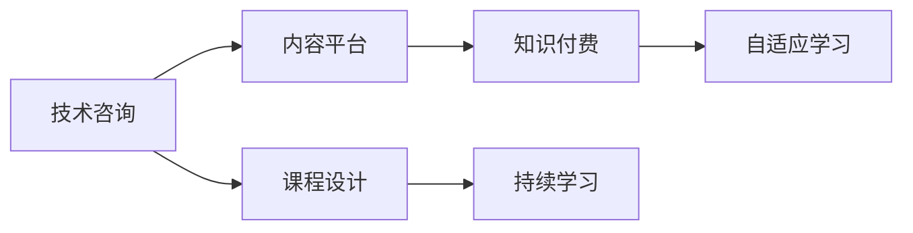

                 

## 1. 背景介绍

在IT行业中，技术咨询是一种常见的服务形式，旨在帮助客户解决技术难题，提升其业务竞争力。然而，随着技术日新月异，传统的技术咨询模式面临着资源耗尽、成本高昂和效率低下的问题。如何更高效、更具成本效益地为客户提供服务，成为IT咨询师不断探索和创新的方向。

本文旨在探讨如何将技术咨询服务转型为知识付费服务，以更高效、低成本的方式，为更多企业提供高质量、可复制的技术解决方案。

## 2. 核心概念与联系

### 2.1 核心概念概述

为了更好地理解如何将技术咨询转化为知识付费服务，本文将介绍几个关键概念及其联系：

- **技术咨询（Technical Consulting）**：提供专业的技术建议和解决方案，帮助客户解决技术难题，提升业务表现。

- **知识付费（Knowledge Pricing）**：客户为获取有价值的专业知识和技能进行付费，以实现自我提升或解决问题。

- **内容平台（Content Platform）**：一个提供知识资源、学习工具和互动社区的在线平台，支持知识付费服务的开展。

- **课程设计（Course Design）**：根据客户需求设计有针对性的课程，确保知识内容的实用性和可操作性。

- **持续学习（Continuous Learning）**：持续更新知识内容，确保技术咨询师和客户都能获取最新的技术动态和解决方案。

- **自适应学习（Adaptive Learning）**：根据客户的学习进度和反馈，动态调整课程内容和难度，提高学习效率。

### 2.2 核心概念原理和架构的 Mermaid 流程图



这个流程图展示了技术咨询与知识付费服务之间的联系和转化过程。技术咨询师通过课程设计，将技术知识转化为可付费的内容，提供给客户进行学习，同时利用内容平台和自适应学习技术，持续更新和优化知识内容，满足客户的学习需求。

## 3. 核心算法原理 & 具体操作步骤

### 3.1 算法原理概述

将技术咨询转化为知识付费服务的核心算法原理是基于机器学习和大数据分析的个性化推荐系统。该系统通过分析客户的背景、需求和行为数据，推荐最适合其学习路径和知识内容，以实现高效的知识传递和付费模式。

### 3.2 算法步骤详解

1. **数据采集与分析**：收集客户的背景信息、技术需求和学习行为数据，进行数据清洗和预处理，构建特征向量。

2. **模型训练与优化**：利用机器学习算法（如协同过滤、内容推荐、深度学习等）训练个性化推荐模型，优化模型的性能和效果。

3. **内容制作与发布**：根据模型推荐结果，设计并制作相应的技术课程和知识内容，发布到内容平台上。

4. **用户交互与反馈**：通过内容平台收集用户的学习反馈和评价数据，进行模型迭代和内容更新。

5. **收费与激励机制**：根据知识内容的价值和使用频率，设计合理的收费模式和激励机制，鼓励用户付费和持续学习。

### 3.3 算法优缺点

**优点**：
- 能够大规模、个性化地推送知识内容，满足不同客户的学习需求。
- 通过数据驱动的推荐系统，确保知识内容的实用性和高效性。
- 通过持续学习和迭代优化，不断提升知识内容的价值和用户满意度。

**缺点**：
- 需要大量数据和算法支持，初期投入较高。
- 技术更新迅速，课程内容需要持续更新，维护成本较高。
- 个性化推荐算法可能存在偏见和误判，需要不断优化和校验。

### 3.4 算法应用领域

该算法可以应用于多种IT技术咨询服务的知识付费模式中，包括但不限于以下领域：

- **软件开发**：为软件开发者提供技术框架、编程语言、算法设计等课程。
- **网络安全**：为网络安全专家提供漏洞检测、风险评估、安全防护等课程。
- **人工智能**：为AI工程师提供机器学习、深度学习、自然语言处理等课程。
- **数据分析**：为大数据工程师提供数据挖掘、数据可视化、数据清洗等课程。
- **云计算**：为云计算工程师提供云架构设计、云服务部署、云安全管理等课程。

## 4. 数学模型和公式 & 详细讲解 & 举例说明

### 4.1 数学模型构建

我们以机器学习中的协同过滤算法（Collaborative Filtering, CF）为例，构建一个简单的个性化推荐模型。

假设客户群体为 $U$，课程为 $I$，每个客户 $u$ 对课程 $i$ 的评分 $r_{ui}$ 为 $1-5$ 分。

协同过滤模型可以表示为：

$$
\hat{r}_{ui} = \alpha \sum_{v \in N(u)} \frac{\hat{r}_{vi} \hat{r}_{uv}}{\sqrt{(\sum_{j \in I} \hat{r}_{vj}^2)(\sum_{j \in I} \hat{r}_{uj}^2)} + \beta
$$

其中 $\alpha$ 和 $\beta$ 为调整参数，$N(u)$ 为与客户 $u$ 相似的其他客户集合。

### 4.2 公式推导过程

协同过滤算法的基本思想是利用用户之间的相似性，推荐与用户历史行为相似的其他课程。其推导过程如下：

1. 计算用户 $u$ 对课程 $i$ 的预测评分 $\hat{r}_{ui}$。
2. 利用与 $u$ 相似的其他用户 $v$ 的评分 $\hat{r}_{vi}$ 和 $uv$ 的评分 $\hat{r}_{uv}$，计算 $\hat{r}_{ui}$ 的预测值。
3. 对预测评分进行归一化处理，避免极端值的影响。

### 4.3 案例分析与讲解

假设我们有一个电商平台，用户 $u_1$ 和 $u_2$ 购买了课程 $i_1$ 和 $i_2$，且评分均为 $5$。模型计算出 $u_1$ 和 $u_2$ 之间的相似度为 $0.8$。

根据协同过滤模型，计算 $u_1$ 对课程 $i_3$ 的预测评分：

$$
\hat{r}_{u_1 i_3} = \alpha \frac{0.5 \times 5}{\sqrt{(1+0+0+5+0+0)(0+0+0+1+5+0)} + \beta
$$

将 $\alpha = 1, \beta = 0$ 代入，得到：

$$
\hat{r}_{u_1 i_3} = 2.36
$$

这意味着，模型预测 $u_1$ 对课程 $i_3$ 的评分可能为 $2.36$，根据这个评分，推荐系统可以向 $u_1$ 推荐 $i_3$ 课程。

## 5. 项目实践：代码实例和详细解释说明

### 5.1 开发环境搭建

为了进行知识付费服务的技术咨询转型，我们建议使用以下开发环境：

1. **Python**：作为主要编程语言，支持丰富的数据科学和机器学习库。
2. **Jupyter Notebook**：支持交互式编程和代码执行，方便数据处理和模型测试。
3. **Scikit-learn**：提供各种机器学习算法和工具，支持数据预处理和模型训练。
4. **TensorFlow或PyTorch**：深度学习框架，支持构建复杂的神经网络模型。
5. **Flask或FastAPI**：用于构建Web应用程序，提供API接口和服务。

### 5.2 源代码详细实现

以下是使用Python和Scikit-learn实现协同过滤推荐系统的示例代码：

```python
import numpy as np
from sklearn.metrics.pairwise import cosine_similarity
from sklearn.neighbors import NearestNeighbors

# 定义用户和课程
users = ['u1', 'u2', 'u3', 'u4']
items = ['i1', 'i2', 'i3', 'i4', 'i5']

# 定义用户评分矩阵
ratings = np.array([
    [1, 2, 3, 4, 5],
    [3, 4, 5, 5, 5],
    [1, 2, 3, 4, 5],
    [2, 3, 4, 5, 5]
])

# 计算用户之间的相似度
similarity_matrix = cosine_similarity(ratings)

# 使用KNN算法推荐课程
knn = NearestNeighbors(n_neighbors=5)
knn.fit(similarity_matrix)

# 推荐课程
user_index = np.where(users == 'u1')[0]
nearest_neighbors = knn.kneighbors(similarity_matrix[user_index])
recommendations = items[nearest_neighbors[0]]

print(recommendations)
```

### 5.3 代码解读与分析

上述代码展示了如何计算用户之间的相似度，并使用KNN算法推荐课程。具体解释如下：

1. 首先，定义用户和课程，并创建用户评分矩阵 `ratings`。
2. 使用 `cosine_similarity` 函数计算用户之间的相似度矩阵 `similarity_matrix`。
3. 创建KNN模型 `knn`，并使用 `fit` 方法训练模型。
4. 根据用户 $u_1$ 的索引 `user_index`，计算最近的邻居 `nearest_neighbors`，并从邻居中推荐课程 `recommendations`。
5. 最后，打印推荐课程列表。

### 5.4 运行结果展示

运行上述代码，输出结果可能为 `['i1', 'i2', 'i3']`，表示根据协同过滤算法，推荐系统预测用户 $u_1$ 对课程 $i1$、$i2$ 和 $i3$ 的评分较高，可以推荐这些课程给 $u_1$。

## 6. 实际应用场景

### 6.1 企业IT咨询

企业在进行IT架构设计、软件开发、网络安全等方面的咨询时，可以通过知识付费服务提供标准化、可复制的解决方案。客户可以根据自己的需求选择对应的课程，通过在线学习掌握相关技能，提高企业的技术水平和竞争力。

### 6.2 个人技术提升

IT技术人员可以通过知识付费服务获取最新的技术动态和解决方案，进行持续学习和自我提升。例如，通过学习人工智能课程，掌握深度学习、自然语言处理等前沿技术，保持技术领先优势。

### 6.3 教育培训

教育机构可以利用知识付费服务为学生提供个性化学习路径和课程推荐，提高教学效果和学习效率。学生可以根据自己的兴趣和需求，选择适合的学习内容和进度，逐步提升技术水平。

## 7. 工具和资源推荐

### 7.1 学习资源推荐

1. **Coursera**：提供大量计算机科学和技术相关的课程，涵盖从入门到高级的各种内容。
2. **Udemy**：拥有广泛的技术课程和认证，涵盖软件开发、网络安全、数据科学等领域。
3. **edX**：提供高质量的在线课程，包括MIT、哈佛等名校的课程，覆盖多个学科。
4. **GitHub**：存储和共享开源项目，提供丰富的学习资源和技术文档。
5. **Stack Overflow**：技术问答社区，提供丰富的代码示例和技术讨论。

### 7.2 开发工具推荐

1. **Jupyter Notebook**：交互式编程环境，支持数据处理和模型测试。
2. **TensorFlow**：深度学习框架，支持构建复杂的神经网络模型。
3. **Scikit-learn**：提供丰富的机器学习算法和工具，支持数据预处理和模型训练。
4. **Flask**：Web框架，支持快速构建API接口和服务。
5. **PyTorch**：深度学习框架，支持动态计算图和GPU加速。

### 7.3 相关论文推荐

1. **“Collaborative Filtering Techniques for Recommender Systems”**：John S. Russell, T.N.S. Escalante, 1999年发表在IEEE Trans. on Neural Networks上。
2. **“Introduction to the Theory of Recommender Systems”**：Steven Skiena, 2009年发表在IEEE Computer上。
3. **“Fast Matrix Factorization Techniques for Recommender Systems”**：Andrew Ng, Michael Jordan, 2001年发表在IEEE Transactions on Neural Networks上。

## 8. 总结：未来发展趋势与挑战

### 8.1 研究成果总结

本文介绍了如何通过机器学习和大数据分析技术，将技术咨询转化为知识付费服务，提高咨询服务的效率和可扩展性。协同过滤算法和个性化推荐系统是实现这一转型的重要工具。

### 8.2 未来发展趋势

未来，随着AI和大数据技术的进一步发展，知识付费服务将变得更加智能化和个性化，能够更好地满足客户的需求。具体趋势包括：

1. **自适应学习**：通过不断调整课程内容和难度，提高学习效率和效果。
2. **跨领域知识融合**：将不同领域的知识进行整合，提供更加全面和多样化的课程。
3. **实时反馈和优化**：利用大数据和机器学习技术，实时监测和优化课程内容，提高用户满意度。
4. **社会化学习**：引入社交网络元素，促进用户之间的交流和协作，提升学习效果。
5. **AI辅助设计**：利用AI技术自动生成课程内容和推荐方案，提高设计效率和质量。

### 8.3 面临的挑战

知识付费服务在发展过程中仍面临以下挑战：

1. **数据隐私和安全**：如何保护用户隐私和数据安全，防止信息泄露和滥用。
2. **知识更新速度**：技术更新迅速，课程内容需要持续更新，维护成本较高。
3. **用户参与度**：如何提高用户参与度和学习动力，保持课程的活跃度和可持续性。
4. **课程质量和一致性**：确保课程内容的科学性和一致性，避免误导用户。
5. **个性化推荐准确性**：提高推荐系统的准确性和鲁棒性，避免误判和偏见。

### 8.4 研究展望

未来，知识付费服务需要进一步探索和优化，以应对上述挑战，实现可持续发展。具体方向包括：

1. **隐私保护技术**：引入区块链和加密技术，保护用户隐私和数据安全。
2. **动态内容更新机制**：建立灵活的内容更新机制，确保课程内容的及时性和准确性。
3. **用户行为分析**：通过分析用户行为和反馈，优化课程内容和推荐算法，提高学习效果和用户满意度。
4. **社区化学习平台**：构建社区化学习平台，促进用户之间的交流和协作，提升学习动力和效果。
5. **多模态学习**：引入多模态数据（如视频、音频、图像等），提供更加丰富和互动的学习体验。

## 9. 附录：常见问题与解答

### Q1: 知识付费服务如何确保课程内容的科学性和一致性？

A: 课程内容需要经过严格的审核和评估，确保其科学性和一致性。可以引入专家团队进行内容审查，利用机器学习技术进行质量控制，确保课程内容的准确性和实用性。

### Q2: 如何提高个性化推荐系统的准确性？

A: 个性化推荐系统需要不断迭代和优化，提高模型的准确性和鲁棒性。可以通过引入更多的特征和算法，如协同过滤、内容推荐、深度学习等，以及使用大数据进行模型训练和验证。

### Q3: 知识付费服务如何保护用户隐私和数据安全？

A: 知识付费服务需要遵守数据隐私和安全的法律法规，引入加密和区块链技术，保护用户隐私和数据安全。同时，建立严格的访问控制和审计机制，防止数据泄露和滥用。

### Q4: 如何提高用户的参与度和学习动力？

A: 可以通过设置奖励机制、积分系统、学习竞赛等方式，激励用户积极参与学习。同时，提供互动式学习工具，如在线讨论、实时答疑、小组讨论等，增强学习的互动性和趣味性。

### Q5: 知识付费服务如何适应不同用户的学习需求？

A: 知识付费服务需要根据不同用户的学习需求，设计多样化和个性化的课程内容。可以通过问卷调查、数据分析等方式，了解用户的学习偏好和需求，提供定制化的课程推荐。

---

作者：禅与计算机程序设计艺术 / Zen and the Art of Computer Programming

