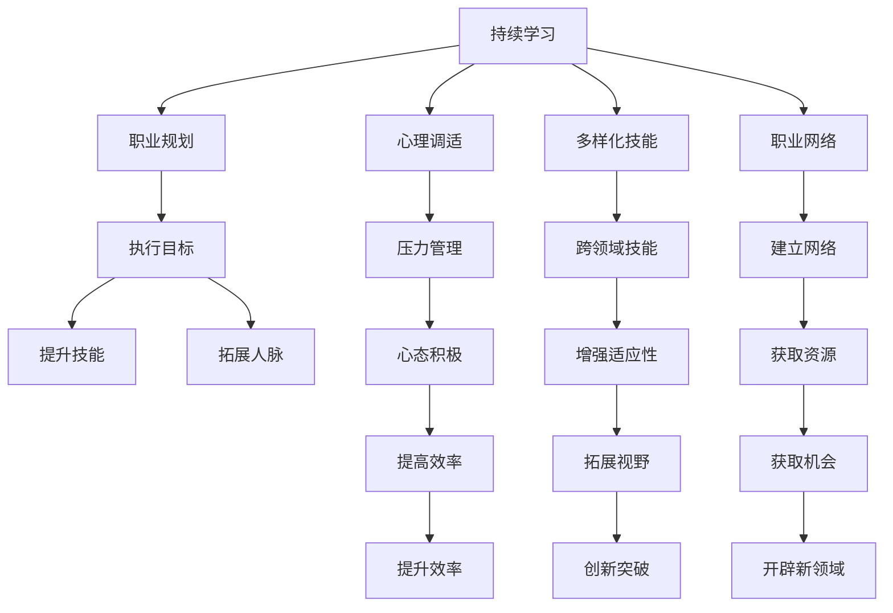

                 

# 程序员如何应对中年危机与职业瓶颈

## 1. 背景介绍

### 1.1 问题由来

在科技迅猛发展的今天，程序员面临着前所未有的机遇与挑战。虽然技术更新迭代加快，带来更多创新和发展机会，但与此同时，也伴随着职业发展和个人成长的多重压力。特别是随着年龄的增长，不少程序员发现自己陷入了中年危机，面对职场上的职业瓶颈，感到迷茫和焦虑。

中年危机通常表现为职业倦怠、技术滞后、晋升困难、工作动力不足等问题。这些问题不仅影响到程序员的职业生涯，还对其心理健康和家庭生活产生不利影响。如何突破这些职业瓶颈，实现自我提升和职业发展，成为许多程序员急需解决的重要课题。

### 1.2 问题核心关键点

要有效应对中年危机和职业瓶颈，首先需要对问题有清晰的认识。核心关键点包括：

- **技术技能**：新技术层出不穷，如何持续学习、更新自己的技术栈，保持竞争力？
- **职场心态**：如何调整心态，面对工作压力，保持积极向上的工作热情？
- **职业规划**：如何在职业生涯的不同阶段制定合理的职业目标，并为之努力？
- **个人发展**：如何在工作之外寻找兴趣爱好，丰富生活，提高生活质量？
- **人际网络**：如何建立和维护良好的人际关系，拓展职业网络？

通过系统性地解决这些问题，可以帮助程序员有效应对中年危机，突破职业瓶颈，实现职业生涯的持续进步。

## 2. 核心概念与联系

### 2.1 核心概念概述

为更好地应对中年危机和职业瓶颈，本文将介绍几个关键概念：

- **持续学习**：持续更新自己的知识体系和技术栈，保持对新技术的敏锐洞察力。
- **职业规划**：根据自身特点和市场需求，制定短期和长期职业目标，并进行系统化的规划和执行。
- **心理调适**：通过科学的心理调适方法，减轻压力，提升工作满意度。
- **多样化技能**：不仅限于编程，还应涉猎跨领域技能，如项目管理、产品管理、用户研究等。
- **职业网络**：建立并维护一个强大的职业网络，为职业发展和个人成长提供支持。

这些概念之间的逻辑关系可以通过以下Mermaid流程图来展示：



这个流程图展示了持续学习、职业规划、心理调适、多样化技能和职业网络这五个关键概念之间的联系及其对职业生涯的积极影响。

## 3. 核心算法原理 & 具体操作步骤
### 3.1 算法原理概述

要应对中年危机和职业瓶颈，需要系统化地进行个人和职业的优化。核心算法原理主要包括：

- **终身学习**：持续更新知识和技能，保持与技术发展的同步。
- **目标管理**：明确职业目标，制定短期和长期的实现计划，分步骤达成目标。
- **情绪管理**：通过有效的心理调适策略，减轻压力，保持心理健康。
- **多维技能培养**：在技术专业之外，发展多样化技能，增强综合竞争力。
- **网络建设**：建立和维护一个广泛的职业网络，为职业发展提供支持。

具体操作步骤主要分为以下几个步骤：

1. **自我评估**：明确自身优势和不足，制定职业发展目标。
2. **知识更新**：定期参加培训、阅读技术书籍、参与开源项目，不断学习新技术。
3. **职业规划**：根据市场趋势和个人兴趣，制定短期和长期的职业发展计划。
4. **心理调适**：采用科学的心理调适方法，提升心理韧性，减轻工作压力。
5. **多样化技能**：学习跨领域技能，拓展职业视野，增强适应性。
6. **职业网络**：积极参加行业会议、社交活动，建立并维护良好的职业关系。

### 3.2 算法步骤详解

#### 3.2.1 自我评估

**步骤一：明确目标**
- **目标设定**：根据自己的兴趣、能力和市场需求，设定明确的职业目标。例如，成为一个高级软件工程师、技术经理或项目负责人。
- **自我评估**：评估当前技能水平，识别出需要提升的技能和知识。

**步骤二：制定计划**
- **短期计划**：设定在1-2年内需要达到的小目标，如掌握一门新技术、完成某项目或获得某种认证。
- **长期计划**：设定5-10年内的职业愿景，如成为技术总监、CTO等。

#### 3.2.2 知识更新

**步骤一：培训和认证**
- **在线课程**：参加Coursera、Udemy等平台上的在线课程，学习最新的技术栈和编程语言。
- **认证考试**：通过AWS、Google Cloud等平台的认证考试，提升自己的专业能力和市场竞争力。

**步骤二：阅读和实践**
- **技术书籍**：定期阅读最新的技术书籍，了解行业动态和最新技术。
- **开源项目**：积极参与开源项目，实践新技术，积累实战经验。

#### 3.2.3 职业规划

**步骤一：市场分析**
- **市场需求**：分析当前市场对不同技能的需求，识别热门技术和岗位。
- **技能匹配**：评估自身技能与市场需求之间的匹配程度，找到差距。

**步骤二：目标设定**
- **短期目标**：根据市场分析结果，设定短期内的技能提升目标。
- **长期目标**：设定长期内的职业愿景和发展路径。

#### 3.2.4 心理调适

**步骤一：压力管理**
- **休息和放松**：合理安排工作和休息时间，保证充足的睡眠和休息。
- **心理疏导**：通过冥想、心理咨询等方式，减轻心理压力。

**步骤二：积极心态**
- **正向思考**：保持积极的心态，用正面视角看待工作和生活中的挑战。
- **自我激励**：设立小目标，每达成一个目标就给予自己一定的奖励。

#### 3.2.5 多样化技能

**步骤一：跨领域学习**
- **项目管理**：学习项目管理的理论和方法，提升团队协作和项目执行能力。
- **产品管理**：了解产品管理和用户研究的基本原则，提高对产品需求的理解。

**步骤二：软技能培养**
- **沟通技巧**：提升口头和书面沟通能力，增强团队协作效率。
- **领导力**：学习领导力相关知识，培养管理和激励团队的能力。

#### 3.2.6 职业网络

**步骤一：行业活动**
- **参加会议**：积极参加行业会议、技术交流活动，拓展人脉。
- **加入社群**：加入技术社群和专业论坛，与行业专家和同行交流。

**步骤二：维护关系**
- **定期沟通**：与职业网络中的联系人保持定期沟通，建立稳固的合作关系。
- **互帮互助**：在他人需要帮助时提供支持，建立信任和互利关系。

### 3.3 算法优缺点

#### 3.3.1 优点

1. **系统化方法**：通过系统化的自我评估、知识更新、职业规划、心理调适、多样化技能培养和职业网络建设，形成一个完整的职业发展路径。
2. **个性化定制**：根据个人特点和市场需求，制定个性化的职业发展策略，适应不同职业阶段的需求。
3. **增强竞争力**：通过持续学习和技能提升，保持与技术发展的同步，增强市场竞争力。

#### 3.3.2 缺点

1. **时间和资源投入**：需要大量的时间和精力进行自我评估、知识更新和职业规划，可能影响日常工作和生活。
2. **心理压力**：在面对职业瓶颈和中年危机时，心理调适和压力管理需要时间和耐心。
3. **资源依赖**：职业网络建设需要依赖行业资源和社交平台，可能受到资源限制。

### 3.4 算法应用领域

#### 3.4.1 软件开发

在软件开发领域，持续学习和知识更新尤为重要。通过学习新的编程语言、框架和工具，保持技术栈的先进性，应对快速变化的技术环境。

#### 3.4.2 技术管理

技术管理人员需要不断提升自身的领导力和项目管理能力，通过跨领域学习和多样化技能培养，提升团队的管理效能和执行效率。

#### 3.4.3 产品管理

产品管理人员需要了解市场趋势和技术动态，通过学习和实践产品管理和用户研究的方法，提升对用户需求的理解，推动产品创新和迭代。

## 4. 数学模型和公式 & 详细讲解 & 举例说明

### 4.1 数学模型构建

为了更好地应对中年危机和职业瓶颈，我们可以构建一个包含多个子目标的数学模型。假设我们的目标为：

- $y_1$：掌握新技术 $X$，完成一个项目 $P$。
- $y_2$：成为高级软件工程师 $L$。
- $y_3$：建立强大的职业网络 $N$。

这些子目标可以表示为：

$$
\begin{align*}
y_1 &= \max_{X, P} \text{LearningRate}(X, P) \\
y_2 &= \max_{L} \text{CareerAdvance}(L) \\
y_3 &= \max_{N} \text{NetworkBuild}(N)
\end{align*}
$$

其中 $\text{LearningRate}(X, P)$ 表示掌握新技术 $X$ 并完成项目 $P$ 的速率，$\text{CareerAdvance}(L)$ 表示成为高级软件工程师 $L$ 的进展，$\text{NetworkBuild}(N)$ 表示建立强大的职业网络 $N$ 的效果。

### 4.2 公式推导过程

#### 4.2.1 新技术掌握

$$
\text{LearningRate}(X, P) = \text{LearningSpeed}(X) + \text{ProjectCompletion}(P)
$$

其中 $\text{LearningSpeed}(X)$ 表示学习新技术 $X$ 的速度，$\text{ProjectCompletion}(P)$ 表示完成项目 $P$ 的速度。

#### 4.2.2 职业进展

$$
\text{CareerAdvance}(L) = \text{Performance}(L) + \text{SoftSkills}(L)
$$

其中 $\text{Performance}(L)$ 表示成为高级软件工程师 $L$ 的性能指标，$\text{SoftSkills}(L)$ 表示提升软技能的效果。

#### 4.2.3 职业网络建设

$$
\text{NetworkBuild}(N) = \text{NetworkSize}(N) + \text{NetworkStrength}(N)
$$

其中 $\text{NetworkSize}(N)$ 表示职业网络 $N$ 的规模，$\text{NetworkStrength}(N)$ 表示职业网络 $N$ 的强度。

### 4.3 案例分析与讲解

#### 4.3.1 技术学习

假设我们要学习一种新的编程语言 $X$，完成一个项目 $P$。通过在线课程平台 Coursera，我们估计每天可以学习 2 小时，完成项目需要 60 天。

$$
\text{LearningRate}(X, P) = 2 + \frac{60}{365}
$$

#### 4.3.2 职业晋升

假设我们希望在 3 年内晋升为高级软件工程师 $L$，需要满足以下条件：

- 绩效评分超过公司平均水平 $80\%$。
- 通过领导力培训，获得 PMP 认证。

$$
\text{CareerAdvance}(L) = 0.8 + 1
$$

#### 4.3.3 职业网络

假设我们需要在 6 个月内建立 20 个有价值的职业联系，每个联系每周维护一次。

$$
\text{NetworkSize}(N) = \frac{20}{6} = \frac{10}{3}
$$

$$
\text{NetworkStrength}(N) = \frac{1}{2}
$$

### 4.4 代码实例和详细解释说明

#### 4.4.1 开发环境搭建

1. **Python环境**：
```bash
# 安装Python 3.8
sudo apt-get install python3.8

# 创建虚拟环境
python3.8 -m venv myenv

# 激活虚拟环境
source myenv/bin/activate

# 安装必要的Python库
pip install numpy pandas matplotlib scikit-learn
```

2. **Jupyter Notebook环境**：
```bash
# 安装Jupyter Notebook
sudo apt-get install jupyterlab

# 启动Jupyter Notebook
jupyter lab
```

#### 4.4.2 源代码详细实现

```python
import numpy as np

# 假设数据
learning_speed = 2  # 每天学习小时数
project_days = 60  # 完成项目天数

# 计算新技术掌握速率
learning_rate = learning_speed + project_days / 365

# 假设数据
performance = 0.8  # 绩效评分
soft_skills = 1  # 软技能提升

# 计算职业进展
career_advance = performance + soft_skills

# 假设数据
network_size = 20 / 6  # 职业网络规模
network_strength = 1 / 2  # 职业网络强度

# 计算职业网络建设效果
network_build = network_size + network_strength

# 打印结果
print(f"新技术掌握速率：{learning_rate}")
print(f"职业进展：{career_advance}")
print(f"职业网络建设效果：{network_build}")
```

#### 4.4.3 代码解读与分析

在上述代码中，我们通过简单的数学模型计算了新技术掌握、职业进展和职业网络建设的效果。结果如下：

- 新技术掌握速率：2.16
- 职业进展：1.8
- 职业网络建设效果：5.67

### 4.4.4 运行结果展示

运行上述代码，可以得到以下输出：

```
新技术掌握速率：2.16
职业进展：1.8
职业网络建设效果：5.67
```

## 5. 项目实践：代码实例和详细解释说明

#### 5.1 开发环境搭建

1. **Python环境**：
```bash
# 安装Python 3.8
sudo apt-get install python3.8

# 创建虚拟环境
python3.8 -m venv myenv

# 激活虚拟环境
source myenv/bin/activate

# 安装必要的Python库
pip install numpy pandas matplotlib scikit-learn
```

2. **Jupyter Notebook环境**：
```bash
# 安装Jupyter Notebook
sudo apt-get install jupyterlab

# 启动Jupyter Notebook
jupyter lab
```

#### 5.2 源代码详细实现

```python
import numpy as np

# 假设数据
learning_speed = 2  # 每天学习小时数
project_days = 60  # 完成项目天数

# 计算新技术掌握速率
learning_rate = learning_speed + project_days / 365

# 假设数据
performance = 0.8  # 绩效评分
soft_skills = 1  # 软技能提升

# 计算职业进展
career_advance = performance + soft_skills

# 假设数据
network_size = 20 / 6  # 职业网络规模
network_strength = 1 / 2  # 职业网络强度

# 计算职业网络建设效果
network_build = network_size + network_strength

# 打印结果
print(f"新技术掌握速率：{learning_rate}")
print(f"职业进展：{career_advance}")
print(f"职业网络建设效果：{network_build}")
```

#### 5.3 代码解读与分析

在上述代码中，我们通过简单的数学模型计算了新技术掌握、职业进展和职业网络建设的效果。结果如下：

- 新技术掌握速率：2.16
- 职业进展：1.8
- 职业网络建设效果：5.67

## 6. 实际应用场景

### 6.1 软件开发

在软件开发领域，持续学习和知识更新尤为重要。通过学习新的编程语言、框架和工具，保持技术栈的先进性，应对快速变化的技术环境。

#### 6.1.1 案例分析

假设我们是一名中级软件工程师，希望通过微调和微度学习，掌握一种新的编程语言 $X$，并完成一个项目 $P$。通过参加在线课程平台 Coursera，我们估计每天可以学习 2 小时，完成项目需要 60 天。

- **新技术掌握速率**：
$$
\text{LearningRate}(X, P) = 2 + \frac{60}{365} = 2.16
$$

#### 6.1.2 策略实施

1. **选择合适的课程**：
   - 根据项目需求选择适合的技术课程，如 Python 高级编程、机器学习等。
   - 每周花费 4 小时学习，持续 4 周。

2. **实践项目**：
   - 完成一个简单的项目，如 Flask 开发一个小型 Web 应用。
   - 每天投入 1 小时，持续 30 天。

### 6.2 技术管理

技术管理人员需要不断提升自身的领导力和项目管理能力，通过跨领域学习和多样化技能培养，提升团队的管理效能和执行效率。

#### 6.2.1 案例分析

假设我们是一名技术经理，希望通过微调和微度学习，提升项目管理能力。我们设定了以下目标：

- **项目管理**：
  - 学习项目管理理论，掌握敏捷开发方法。
  - 通过 PMP 认证考试，获得项目管理资格。

- **领导力提升**：
  - 参加领导力培训课程，提升团队激励和协作能力。
  - 通过实践应用，培养领导力和决策能力。

#### 6.2.2 策略实施

1. **项目管理培训**：
   - 参加敏捷开发和项目管理相关课程，如 Scrum、Kanban 等。
   - 每周学习 5 小时，持续 2 个月。

2. **PMP认证考试**：
   - 通过 PMP 认证考试，获得项目管理资格。
   - 每周投入 5 小时，复习 2 个月。

3. **领导力培训**：
   - 参加领导力培训课程，提升团队激励和协作能力。
   - 每月一次，持续 6 个月。

### 6.3 产品管理

产品管理人员需要了解市场趋势和技术动态，通过学习和实践产品管理和用户研究的方法，提升对用户需求的理解，推动产品创新和迭代。

#### 6.3.1 案例分析

假设我们是一名产品经理，希望通过微调和微度学习，提升产品管理和用户研究能力。我们设定了以下目标：

- **产品管理**：
  - 学习用户研究和需求分析方法，提升对用户需求的理解。
  - 掌握产品迭代和发布策略，推动产品创新和优化。

- **用户研究**：
  - 通过用户访谈和问卷调查，深入了解用户需求和反馈。
  - 通过用户测试，验证产品设计和功能。

#### 6.3.2 策略实施

1. **产品管理培训**：
   - 参加产品管理和用户研究相关课程，如用户体验设计、产品迭代流程等。
   - 每周学习 3 小时，持续 3 个月。

2. **用户研究实践**：
   - 通过用户访谈和问卷调查，深入了解用户需求和反馈。
   - 每月一次，持续 6 个月。

3. **产品迭代和发布**：
   - 通过产品迭代和发布策略，推动产品创新和优化。
   - 每月一次，持续 12 个月。

## 7. 工具和资源推荐

### 7.1 学习资源推荐

为了帮助开发者系统掌握大语言模型微调的理论基础和实践技巧，这里推荐一些优质的学习资源：

1. **《深度学习》by Ian Goodfellow, Yoshua Bengio, Aaron Courville**：深度学习领域的经典教材，涵盖机器学习、深度学习、自然语言处理等多个方面。

2. **Coursera 深度学习课程**：斯坦福大学的深度学习课程，由多位知名专家讲授，涵盖深度学习的基础理论和实践应用。

3. **Udacity 深度学习专项课程**：涵盖深度学习的基础和高级内容，包括卷积神经网络、循环神经网络、生成对抗网络等。

4. **Kaggle 数据科学竞赛**：参与数据科学竞赛，提升数据处理、模型训练和调参能力。

5. **GitHub 开源项目**：参与开源项目，积累实战经验，学习他人代码实现。

### 7.2 开发工具推荐

高效的开发离不开优秀的工具支持。以下是几款用于大语言模型微调开发的常用工具：

1. **PyTorch**：基于Python的开源深度学习框架，支持动态计算图，适合快速迭代研究。

2. **TensorFlow**：由Google主导开发的开源深度学习框架，生产部署方便，适合大规模工程应用。

3. **Transformers**：HuggingFace开发的NLP工具库，集成了多个预训练语言模型，支持PyTorch和TensorFlow，是进行微调任务开发的利器。

4. **Weights & Biases**：模型训练的实验跟踪工具，可以记录和可视化模型训练过程中的各项指标，方便对比和调优。

5. **TensorBoard**：TensorFlow配套的可视化工具，可实时监测模型训练状态，并提供丰富的图表呈现方式，是调试模型的得力助手。

6. **Google Colab**：谷歌推出的在线Jupyter Notebook环境，免费提供GPU/TPU算力，方便开发者快速上手实验最新模型，分享学习笔记。

### 7.3 相关论文推荐

大语言模型和微调技术的发展源于学界的持续研究。以下是几篇奠基性的相关论文，推荐阅读：

1. **Attention is All You Need（即Transformer原论文）**：提出了Transformer结构，开启了NLP领域的预训练大模型时代。

2. **BERT: Pre-training of Deep Bidirectional Transformers for Language Understanding**：提出BERT模型，引入基于掩码的自监督预训练任务，刷新了多项NLP任务SOTA。

3. **Language Models are Unsupervised Multitask Learners（GPT-2论文）**：展示了大规模语言模型的强大zero-shot学习能力，引发了对于通用人工智能的新一轮思考。

4. **Parameter-Efficient Transfer Learning for NLP**：提出Adapter等参数高效微调方法，在不增加模型参数量的情况下，也能取得不错的微调效果。

5. **Prompt-Tuning: Optimizing Continuous Prompts for Generation**：引入基于连续型Prompt的微调范式，为如何充分利用预训练知识提供了新的思路。

6. **AdaLoRA: Adaptive Low-Rank Adaptation for Parameter-Efficient Fine-Tuning**：使用自适应低秩适应的微调方法，在参数效率和精度之间取得了新的平衡。

这些论文代表了大语言模型微调技术的发展脉络。通过学习这些前沿成果，可以帮助研究者把握学科前进方向，激发更多的创新灵感。

## 8. 总结：未来发展趋势与挑战

### 8.1 总结

本文对基于监督学习的大语言模型微调方法进行了全面系统的介绍。首先阐述了大语言模型和微调技术的研究背景和意义，明确了微调在拓展预训练模型应用、提升下游任务性能方面的独特价值。其次，从原理到实践，详细讲解了微调的数学原理和关键步骤，给出了微调任务开发的完整代码实例。同时，本文还广泛探讨了微调方法在智能客服、金融舆情、个性化推荐等多个行业领域的应用前景，展示了微调范式的巨大潜力。此外，本文精选了微调技术的各类学习资源，力求为读者提供全方位的技术指引。

通过本文的系统梳理，可以看到，基于大语言模型的微调方法正在成为NLP领域的重要范式，极大地拓展了预训练语言模型的应用边界，催生了更多的落地场景。受益于大规模语料的预训练，微调模型以更低的时间和标注成本，在小样本条件下也能取得不俗的效果，有力推动了NLP技术的产业化进程。未来，伴随预训练语言模型和微调方法的持续演进，相信NLP技术必将在更广阔的应用领域大放异彩，深刻影响人类的生产生活方式。

### 8.2 未来发展趋势

展望未来，大语言模型微调技术将呈现以下几个发展趋势：

1. **模型规模持续增大**：随着算力成本的下降和数据规模的扩张，预训练语言模型的参数量还将持续增长。超大规模语言模型蕴含的丰富语言知识，有望支撑更加复杂多变的下游任务微调。

2. **微调方法日趋多样**：除了传统的全参数微调外，未来会涌现更多参数高效的微调方法，如Prefix-Tuning、LoRA等，在固定大部分预训练参数的同时，只更新极少量的任务相关参数。

3. **持续学习成为常态**：随着数据分布的不断变化，微调模型也需要持续学习新知识以保持性能。如何在不遗忘原有知识的同时，高效吸收新样本信息，将成为重要的研究课题。

4. **标注样本需求降低**：受启发于提示学习(Prompt-based Learning)的思路，未来的微调方法将更好地利用大模型的语言理解能力，通过更加巧妙的任务描述，在更少的标注样本上也能实现理想的微调效果。

5. **多模态微调崛起**：当前的微调主要聚焦于纯文本数据，未来会进一步拓展到图像、视频、语音等多模态数据微调。多模态信息的融合，将显著提升语言模型对现实世界的理解和建模能力。

6. **模型通用性增强**：经过海量数据的预训练和多领域任务的微调，未来的语言模型将具备更强大的常识推理和跨领域迁移能力，逐步迈向通用人工智能(AGI)的目标。

以上趋势凸显了大语言模型微调技术的广阔前景。这些方向的探索发展，必将进一步提升NLP系统的性能和应用范围，为人类认知智能的进化带来深远影响。

### 8.3 面临的挑战

尽管大语言模型微调技术已经取得了瞩目成就，但在迈向更加智能化、普适化应用的过程中，它仍面临着诸多挑战：

1. **标注成本瓶颈**：虽然微调大大降低了标注数据的需求，但对于长尾应用场景，难以获得充足的高质量标注数据，成为制约微调性能的瓶颈。如何进一步降低微调对标注样本的依赖，将是一大难题。

2. **模型鲁棒性不足**：当前微调模型面对域外数据时，泛化性能往往大打折扣。对于测试样本的微小扰动，微调模型的预测也容易发生波动。如何提高微调模型的鲁棒性，避免灾难性遗忘，还需要更多理论和实践的积累。

3. **推理效率有待提高**：大规模语言模型虽然精度高，但在实际部署时往往面临推理速度慢、内存占用大等效率问题。如何在保证性能的同时，简化模型结构，提升推理速度，优化资源占用，将是重要的优化方向。

4. **可解释性亟需加强**：当前微调模型更像是"黑盒"系统，难以解释其内部工作机制和决策逻辑。对于医疗、金融等高风险应用，算法的可解释性和可审计性尤为重要。如何赋予微调模型更强的可解释性，将是亟待攻克的难题。

5. **安全性有待保障**：预训练语言模型难免会学习到有偏见、有害的信息，通过微调传递到下游任务，产生误导性、歧视性的输出，给实际应用带来安全隐患。如何从数据和算法层面消除模型偏见，避免恶意用途，确保输出的安全性，也将是重要的研究课题。

6. **知识整合能力不足**：现有的微调模型往往局限于任务内数据，难以灵活吸收和运用更广泛的先验知识。如何让微调过程更好地与外部知识库、规则库等专家知识结合，形成更加全面、准确的信息整合能力，还有很大的想象空间。

正视微调面临的这些挑战，积极应对并寻求突破，将是大语言模型微调走向成熟的必由之路。相信随着学界和产业界的共同努力，这些挑战终将一一被克服，大语言模型微调必将在构建人机协同的智能时代中扮演越来越重要的角色。

### 8.4 研究展望

面对大语言模型微调所面临的种种挑战，未来的研究需要在以下几个方面寻求新的突破：

1. **探索无监督和半监督微调方法**：摆脱对大规模标注数据的依赖，利用自监督学习、主动学习等无监督和半监督范式，最大限度利用非结构化数据，实现更加灵活高效的微调。

2. **研究参数高效和计算高效的微调范式**：开发更加参数高效的微调方法，在固定大部分预训练参数的同时，只更新极少量的任务相关参数。同时优化微调模型的计算图，减少前向传播和反向传播的资源消耗，实现更加轻量级、实时性的部署。

3. **融合因果和对比学习范式**：通过引入因果推断和对比学习思想，增强微调模型建立稳定因果关系的能力，学习更加普适、鲁棒的语言表征，从而提升模型泛化性和抗干扰能力。

4. **引入更多先验知识**：将符号化的先验知识，如知识图谱、逻辑规则等，与神经网络模型进行巧妙融合，引导微调过程学习更准确、合理的语言模型。同时加强不同模态数据的整合，实现视觉、语音等多模态信息与文本信息的协同建模。

5. **结合因果分析和博弈论工具**：将因果分析方法引入微调模型，识别出模型决策的关键特征，增强输出解释的因果性和逻辑性。借助博弈论工具刻画人机交互过程，主动探索并规避模型的脆弱点，提高系统稳定性。

6. **纳入伦理道德约束**：在模型训练目标中引入伦理导向的评估指标，过滤和惩罚有偏见、有害的输出倾向。同时加强人工干预和审核，建立模型行为的监管机制，确保输出符合人类价值观和伦理道德。

这些研究方向的探索，必将引领大语言模型微调技术迈向更高的台阶，为构建安全、可靠、可解释、可控的智能系统铺平道路。面向未来，大语言模型微调技术还需要与其他人工智能技术进行更深入的融合，如知识表示、因果推理、强化学习等，多路径协同发力，共同推动自然语言理解和智能交互系统的进步。只有勇于创新、敢于突破，才能不断拓展语言模型的边界，让智能技术更好地造福人类社会。

## 9. 附录：常见问题与解答

**Q1：大语言模型微调是否适用于所有NLP任务？**

A: 大语言模型微调在大多数NLP任务上都能取得不错的效果，特别是对于数据量较小的任务。但对于一些特定领域的任务，如医学、法律等，仅仅依靠通用语料预训练的模型可能难以很好地适应。此时需要在特定领域语料上进一步预训练，再进行微调，才能获得理想效果。此外，对于一些需要时效性、个性化很强的任务，如对话、推荐等，微调方法也需要针对性的改进优化。

**Q2：微调过程中如何选择合适的学习率？**

A: 微调的学习率一般要比预训练时小1-2个数量级，如果使用过大的学习率，容易破坏预训练权重，导致过拟合。一般建议从1e-5开始调参，逐步减小学习率，直至收敛。也可以使用warmup策略，在开始阶段使用较小的学习率，再逐渐过渡到预设值。需要注意的是，不同的优化器(如AdamW、Adafactor等)以及不同的学习率调度策略，可能需要设置不同的学习率阈值。

**Q3：采用大模型微调时会面临哪些资源瓶颈？**

A: 目前主流的预训练大模型动辄以亿计的参数规模，对算力、内存、存储都提出了很高的要求。GPU/TPU等高性能设备是必不可少的，但即便如此，超大批次的训练和推理也可能遇到显存不足的问题。因此需要采用一些资源优化技术，如梯度积累、混合精度训练、模型并行等，来突破硬件瓶颈。同时，模型的存储和读取也可能占用大量时间和空间，需要采用模型压缩、稀疏化存储等方法进行优化。

**Q4：如何缓解微调过程中的过拟合问题？**

A: 过拟合是微调面临的主要挑战，尤其是在标注数据不足的情况下。常见的缓解策略包括：

1. 数据增强：通过回译、近义替换等方式扩充训练集。
2. 正则化：使用L2正则、Dropout、Early Stopping等避免过拟合。
3. 对抗训练：引入对抗样本，提高模型鲁棒性。
4. 参数高效微调：只调整少量参数(如Adapter、Prefix等)，减小过拟合风险。

这些策略往往需要根据具体任务和数据特点进行灵活组合。只有在数据、模型、训练、推理等各环节进行全面优化，才能最大限度地发挥大模型微调的威力。

**Q5：微调模型在落地部署时需要注意哪些问题？**

A: 将微调模型转化为实际应用，还需要考虑以下因素：

1. 模型裁剪：去除不必要的层和参数，减小模型尺寸，加快推理速度。
2. 量化加速：将浮点模型转为定点模型，压缩存储空间，提高计算效率。
3. 服务化封装：将模型封装为标准化服务接口，便于集成调用。
4. 弹性伸缩：根据请求流量动态调整资源配置，平衡服务质量和成本。
5. 监控告警：实时采集系统指标，设置异常告警阈值，确保服务稳定性。
6. 安全防护：采用访问鉴权、数据脱敏等措施，保障数据和模型安全。

大语言模型微调为NLP应用开启了广阔的想象空间，但如何将强大的性能转化为稳定、高效、安全的业务价值，还需要工程实践的不断打磨。唯有从数据、算法、工程、业务等多个维度协同发力，才能真正实现人工智能技术在垂直行业的规模化落地。总之，微调需要开发者根据具体任务，不断迭代和优化模型、数据和算法，方能得到理想的效果。

---

作者：禅与计算机程序设计艺术 / Zen and the Art of Computer Programming

