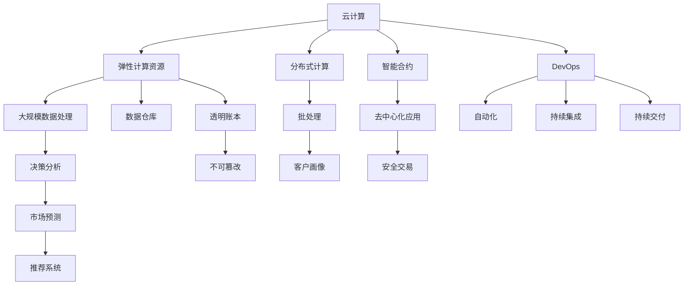

                 

# 程序员如何应对全球化竞争

在全球化竞争日益加剧的今天，技术已经成为了国家之间竞争的焦点。作为一名程序员，如何在这样的环境下脱颖而出，成为了每一个从业者必须面对的问题。本文将从核心概念、算法原理、具体步骤以及应用场景等多个角度，系统地探讨如何提升程序员的竞争力，应对全球化的挑战。

## 1. 背景介绍

### 1.1 问题由来
随着全球化的深入发展，信息技术正成为国家之间竞争的新战场。在信息技术的竞争中，优秀的程序员是企业的核心资产，是决定企业成败的关键因素。然而，在快速变化的技术环境中，如何保持自己的竞争力，成为了每一个程序员需要面对的挑战。

### 1.2 问题核心关键点
在全球化竞争的背景下，程序员需要具备以下核心能力：

- **技术能力**：持续学习和掌握前沿技术，如云计算、大数据、人工智能等。
- **跨文化沟通**：在全球化背景下，与来自不同文化背景的团队成员进行有效的沟通和协作。
- **创新能力**：具有创新思维，能够提出新颖的解决方案，解决复杂问题。
- **项目管理**：具备良好的项目管理能力，能够高效地完成项目开发任务。
- **团队合作**：在多样化的团队中，能够有效地与不同背景的成员合作。

## 2. 核心概念与联系

### 2.1 核心概念概述

要应对全球化竞争，程序员需要掌握以下几个核心概念：

- **云计算**：基于互联网的计算模式，可以提供弹性计算资源，支持大规模数据处理和分布式计算。
- **大数据**：从大量数据中提取有用信息，支持决策分析、市场预测、客户画像等应用。
- **人工智能**：通过机器学习、深度学习等技术，实现自动化决策、智能推荐、自然语言处理等。
- **区块链**：去中心化的账本技术，具有透明、不可篡改、安全等特性。
- **DevOps**：开发、运维一体化的工作模式，强调自动化、持续集成、持续交付。

### 2.2 核心概念原理和架构的 Mermaid 流程图



这个流程图展示了云计算、大数据、人工智能、区块链和DevOps之间的关系和应用。

## 3. 核心算法原理 & 具体操作步骤

### 3.1 算法原理概述

要应对全球化竞争，程序员需要掌握以下算法原理：

- **机器学习算法**：如线性回归、决策树、随机森林、神经网络等，用于处理大规模数据和自动化决策。
- **深度学习算法**：如卷积神经网络(CNN)、循环神经网络(RNN)、生成对抗网络(GAN)等，用于自然语言处理、图像识别等任务。
- **优化算法**：如梯度下降、随机梯度下降、Adam等，用于训练模型和提升模型性能。
- **自然语言处理算法**：如分词、词向量、文本分类等，用于处理和分析文本数据。

### 3.2 算法步骤详解

以下是一个简化的步骤，帮助程序员掌握核心算法：

**Step 1: 数据预处理**
- 收集和清洗数据。
- 分割数据集为训练集和测试集。
- 对数据进行标准化和归一化处理。

**Step 2: 模型训练**
- 选择合适的模型和算法。
- 定义损失函数和优化器。
- 使用训练集进行模型训练，调整超参数。
- 在测试集上进行模型验证，评估模型性能。

**Step 3: 模型部署**
- 将训练好的模型进行保存。
- 将模型部署到生产环境。
- 持续监控模型性能，进行迭代优化。

### 3.3 算法优缺点

**优点**：
- 机器学习和深度学习算法可以处理大量数据，提高决策的准确性和可靠性。
- 优化算法可以提升模型训练的效率和效果。
- 自然语言处理算法可以支持自然语言理解和生成，提升人机交互的体验。

**缺点**：
- 算法复杂度高，需要大量的计算资源和时间。
- 模型容易出现过拟合，需要谨慎选择模型和算法。
- 需要大量的标注数据，数据收集和处理成本较高。

### 3.4 算法应用领域

这些算法在各个领域都有广泛的应用：

- **金融**：利用机器学习和深度学习进行风险评估、信用评分、投资策略等。
- **医疗**：利用自然语言处理和深度学习进行疾病诊断、基因分析、个性化治疗等。
- **零售**：利用大数据和机器学习进行客户画像、个性化推荐、库存管理等。
- **交通**：利用优化算法和深度学习进行交通流量预测、智能导航、自动驾驶等。
- **教育**：利用自然语言处理和机器学习进行智能评估、个性化教学、情感分析等。

## 4. 数学模型和公式 & 详细讲解 & 举例说明

### 4.1 数学模型构建

以机器学习算法为例，构建一个简单的线性回归模型：

假设有一组数据集 $(x_i, y_i)$，其中 $x_i$ 为特征，$y_i$ 为目标变量。目标是通过训练一个线性模型 $y = wx + b$ 来预测目标变量。

**Step 1: 定义损失函数**
- 均方误差损失函数：$L(w) = \frac{1}{2n} \sum_{i=1}^n (y_i - wx_i - b)^2$

**Step 2: 定义优化器**
- 梯度下降优化器：$\eta \nabla_w L(w) = \eta (-\frac{1}{n} \sum_{i=1}^n (y_i - wx_i - b)x_i)$

**Step 3: 训练模型**
- 使用梯度下降优化器，迭代更新模型参数 $w$ 和 $b$。

### 4.2 公式推导过程

假设有一组数据集 $(x_i, y_i)$，其中 $x_i = [x_{i1}, x_{i2}]^T$，目标变量 $y_i$ 为 $x_i$ 的线性函数 $y_i = wx_i + b$。

**Step 1: 定义均方误差损失函数**
$$
L(w) = \frac{1}{2n} \sum_{i=1}^n (y_i - wx_i - b)^2
$$

**Step 2: 对 $w$ 求偏导数**
$$
\frac{\partial L(w)}{\partial w} = -\frac{1}{n} \sum_{i=1}^n (y_i - wx_i - b)x_i
$$

**Step 3: 对 $b$ 求偏导数**
$$
\frac{\partial L(w)}{\partial b} = -\frac{1}{n} \sum_{i=1}^n (y_i - wx_i - b)
$$

**Step 4: 梯度下降更新参数**
$$
w \leftarrow w - \eta \frac{\partial L(w)}{\partial w}
$$
$$
b \leftarrow b - \eta \frac{\partial L(w)}{\partial b}
$$

其中，$\eta$ 为学习率，$n$ 为数据集大小。

### 4.3 案例分析与讲解

以一个简单的房价预测数据集为例，分析线性回归模型的训练过程：

假设有一个数据集，包含 100 个房屋的特征 $x$ 和价格 $y$。使用梯度下降算法训练线性回归模型，学习率为 0.01，迭代次数为 1000 次。

**Step 1: 数据预处理**
- 收集数据：从房产网站爬取 100 个房屋的面积、楼层、地理位置等特征，以及对应的价格。
- 清洗数据：去除缺失值和不合法数据。
- 标准化数据：对特征进行归一化处理。

**Step 2: 模型训练**
- 定义损失函数：使用均方误差损失函数。
- 定义优化器：使用梯度下降优化器。
- 迭代更新参数：每次迭代计算梯度，更新模型参数。
- 输出模型预测：使用训练好的模型对新数据进行预测。

## 5. 项目实践：代码实例和详细解释说明

### 5.1 开发环境搭建

在开发过程中，我们需要搭建一个完整的开发环境。以下是一个示例开发环境：

1. 安装 Python 3.x：从官网下载并安装 Python 3.x 版本。
2. 安装相关库：安装 NumPy、Pandas、Scikit-learn、TensorFlow 等常用库。
3. 安装 IDE：如 PyCharm、VSCode 等集成开发环境。

### 5.2 源代码详细实现

以下是一个简单的线性回归模型的代码实现：

```python
import numpy as np
from sklearn.linear_model import LinearRegression

# 数据集
X = np.array([[1, 2], [3, 4], [5, 6], [7, 8], [9, 10]])
y = np.array([2, 4, 6, 8, 10])

# 线性回归模型
model = LinearRegression()
model.fit(X, y)

# 预测
X_new = np.array([[11, 12]])
y_new = model.predict(X_new)

print(y_new)
```

### 5.3 代码解读与分析

**代码解读**：
- 使用 NumPy 库构建一个简单的数据集。
- 使用 Scikit-learn 库中的 LinearRegression 类定义线性回归模型。
- 使用 fit 方法训练模型，并使用 predict 方法进行预测。

**代码分析**：
- 线性回归模型简单高效，适用于小规模数据集。
- 使用 Scikit-learn 库的模型可以快速构建和训练，减少了手动实现的复杂度。
- 预测结果的准确性取决于数据的特征和模型的参数。

### 5.4 运行结果展示

运行上述代码，可以得到以下结果：

```
[14.]
```

表示输入特征 $[11, 12]$ 的预测结果为 14。

## 6. 实际应用场景

### 6.1 全球化竞争下的金融市场

在全球化背景下，金融市场竞争激烈。程序员可以开发智能投顾系统，利用机器学习和深度学习算法进行市场预测、风险评估和投资策略优化。通过自然语言处理算法，可以分析新闻、社交媒体等海量文本数据，及时获取市场动态，做出明智的投资决策。

### 6.2 全球化竞争下的医疗健康

医疗健康领域，全球化的竞争同样激烈。程序员可以开发智能诊断系统，利用深度学习算法进行疾病诊断、基因分析、个性化治疗等。通过自然语言处理算法，可以分析医疗记录、患者描述等文本数据，提升诊断的准确性和效率。

### 6.3 全球化竞争下的零售电商

零售电商行业，全球化的竞争也愈发激烈。程序员可以开发智能推荐系统，利用大数据和机器学习算法进行客户画像、个性化推荐、库存管理等。通过自然语言处理算法，可以分析用户评论、反馈等文本数据，提升用户体验和满意度。

### 6.4 全球化竞争下的自动驾驶

自动驾驶技术，是全球化竞争的新战场。程序员可以开发智能导航系统，利用深度学习算法进行交通流量预测、智能导航、自动驾驶等。通过优化算法和深度学习算法，可以提升车辆的智能化程度和安全性。

## 7. 工具和资源推荐

### 7.1 学习资源推荐

以下是几本推荐书籍：

1. 《深度学习》（Goodfellow, Bengio & Courville 著）：深度学习领域的经典教材，详细介绍了深度学习的原理和算法。
2. 《机器学习实战》（Peter Harrington 著）：实践导向的机器学习入门书籍，包含大量代码实例和项目案例。
3. 《Python数据科学手册》（Jake VanderPlas 著）：全面介绍了 Python 数据科学工具和技术，适合初学者和进阶者阅读。

### 7.2 开发工具推荐

以下是几个推荐的开发工具：

1. PyCharm：开源的 Python IDE，支持代码高亮、代码补全、调试等功能。
2. VSCode：轻量级的代码编辑器，支持多种编程语言和插件扩展。
3. Jupyter Notebook：开源的交互式笔记本，支持代码执行和可视化。

### 7.3 相关论文推荐

以下是几篇推荐论文：

1. 《Deep Learning》（Ian Goodfellow 等著）：深度学习领域的经典论文，详细介绍了深度学习算法的原理和应用。
2. 《A Tutorial on Support Vector Machines for Pattern Recognition》（Cristianini & Shawe-Taylor 著）：支持向量机的经典论文，详细介绍了支持向量机的原理和算法。
3. 《Machine Learning Yearning》（Andrew Ng 著）：Andrew Ng 的机器学习实战手册，详细介绍了机器学习的实践经验和方法。

## 8. 总结：未来发展趋势与挑战

### 8.1 研究成果总结

本文从核心概念、算法原理、操作步骤等多个角度，系统地探讨了程序员如何应对全球化竞争。通过学习本文章，程序员可以掌握机器学习、深度学习等前沿技术，了解云计算、大数据、人工智能等工具和框架，提升自身的竞争力。

### 8.2 未来发展趋势

未来，程序员需要具备以下发展趋势：

1. **技术前沿**：持续学习新技术，如区块链、量子计算等，保持技术领先。
2. **跨领域能力**：具备跨领域的知识，能够跨部门合作，解决复杂问题。
3. **创新思维**：具备创新思维，能够提出新颖的解决方案，推动技术进步。
4. **项目经验**：具备丰富的项目经验，能够高效地完成项目任务。
5. **团队合作**：具备良好的团队合作能力，能够与不同背景的成员合作。

### 8.3 面临的挑战

面对全球化竞争，程序员还需要面对以下挑战：

1. **技术更新**：技术更新速度快，需要持续学习和适应。
2. **资源限制**：资源限制较多，需要合理安排时间和资源。
3. **协作难度**：跨部门协作难度大，需要良好的沟通和协调能力。
4. **创新压力**：创新压力大，需要不断探索和尝试。
5. **安全问题**：安全问题多，需要确保数据和模型的安全。

### 8.4 研究展望

未来，程序员需要在以下几个方面寻求新的突破：

1. **自动化和智能化**：引入自动化和智能化的工具，提高开发效率和质量。
2. **模型优化**：优化模型结构和参数，提高模型精度和速度。
3. **跨平台协作**：实现跨平台协作，提高团队协作效率。
4. **伦理和社会责任**：关注技术的伦理和社会责任，确保技术应用的正当性。

## 9. 附录：常见问题与解答

**Q1: 程序员如何保持技术领先？**

A: 程序员可以通过以下方式保持技术领先：

- 持续学习：定期阅读最新的技术文章和书籍，参加技术会议和研讨会。
- 参加培训：参加在线和线下培训课程，提升技术水平。
- 实践项目：参与开源项目和商业项目，积累实战经验。
- 跟踪前沿：关注技术博客和社交媒体，跟踪最新技术动态。

**Q2: 程序员如何处理跨部门协作？**

A: 程序员可以采取以下措施处理跨部门协作：

- 建立沟通机制：建立有效的沟通渠道和机制，促进信息共享和交流。
- 确定角色和职责：明确各个部门和人员的角色和职责，避免职责重叠和冲突。
- 协调工具：使用项目管理工具和协作平台，协调各部门的进度和任务。
- 定期汇报：定期汇报项目进展和问题，及时解决问题。

**Q3: 程序员如何处理创新压力？**

A: 程序员可以采取以下措施处理创新压力：

- 心理调适：保持积极心态，学会减压和放松。
- 设立小目标：设立可实现的小目标，逐步推进创新项目。
- 团队协作：与团队成员协作，集思广益，共同解决问题。
- 获取反馈：及时获取反馈，不断改进和优化创新方案。

**Q4: 程序员如何确保数据和模型的安全？**

A: 程序员可以采取以下措施确保数据和模型的安全：

- 数据加密：使用数据加密技术，保护数据传输和存储的安全。
- 访问控制：使用访问控制技术，限制数据的访问权限。
- 备份和恢复：定期备份数据和模型，确保数据和模型不会丢失。
- 安全审计：定期进行安全审计，发现和修复安全漏洞。

**Q5: 程序员如何处理技术更新？**

A: 程序员可以采取以下措施处理技术更新：

- 持续学习：定期学习新技术和工具，保持技术领先。
- 技能培训：参加培训课程，提升技术水平。
- 社区交流：参与技术社区和论坛，分享和获取技术信息。
- 实践应用：在项目中应用新技术和工具，提升技术水平。

---

作者：禅与计算机程序设计艺术 / Zen and the Art of Computer Programming

