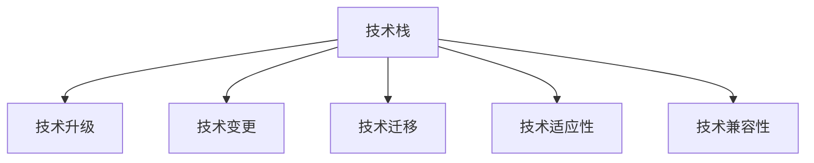

                 

# 程序员如何应对技术升级与变更

技术升级与变更，是每个行业都在不断面对的挑战，而作为技术工作者，如何高效、顺利地适应这一过程，是每个程序员都必须掌握的技能。本文将详细探讨这一话题，并提出一些实用的策略与技巧。

## 1. 背景介绍

### 1.1 问题由来
在当前飞速发展的科技时代，技术的更新迭代速度之快前所未有。新的编程语言、框架、工具不断涌现，旧的技术和流程也在被不断淘汰。例如，Web开发中，从早期的静态页面到动态Web，再到React和Vue等前端框架的流行，每一个阶段都带来了全新的技术体系和开发方式。这就要求程序员不断学习和适应，以跟上技术发展的步伐。

### 1.2 问题核心关键点
如何应对技术升级与变更，是每个程序员必须解决的核心问题。面对新技术的不断涌现，应该如何选择和评估新技术，如何快速学习和掌握新技术，如何整合新技术到已有系统中，以及如何在技术变更中保持稳定和高效，这些都是需要深入探讨的关键点。

## 2. 核心概念与联系

### 2.1 核心概念概述
为更好地理解如何应对技术升级与变更，本节将介绍几个密切相关的核心概念：

- 技术栈(Technical Stack)：一个项目或团队使用的一整套技术工具、语言和框架。
- 技术升级(Upgrading)：将旧的技术或框架替换为新的技术或框架，以提升性能、安全性或可维护性。
- 技术变更(Change)：对现有技术或框架进行小幅度修改或优化，以适应新的需求或问题。
- 技术迁移(Migration)：从一个技术平台迁移到另一个技术平台，保持已有功能的连贯性和可移植性。
- 技术适应性(Adaptability)：技术栈对新环境、新需求和新技术的适应能力。
- 技术兼容性(Compatibility)：不同技术栈之间的相互支持和协作能力。

这些核心概念之间的逻辑关系可以通过以下Mermaid流程图来展示：



这个流程图展示了一个项目或团队中可能遇到的技术升级与变更类型，以及它们之间的联系和相互作用。

## 3. 核心算法原理 & 具体操作步骤

### 3.1 算法原理概述

技术升级与变更的本质，是对现有系统的改造与优化。其核心原理包括：

1. **评估与选择**：评估新技术的优势和适用性，选择最适合当前项目或团队需求的技术。
2. **迁移与适配**：将新技术或框架迁移到现有系统中，或对其进行调整以适应新环境。
3. **测试与优化**：在新旧技术或框架的交界处进行测试，确保新旧技术平稳过渡，并进行必要的优化。

### 3.2 算法步骤详解

技术升级与变更的过程大致可以分为以下五个步骤：

1. **需求分析与规划**：
   - 评估当前系统存在的问题，确定升级或变更的必要性。
   - 明确新需求和新目标，确定升级或变更的方向。

2. **技术选择与评估**：
   - 对备选的新技术或框架进行全面的调研和评估，包括其功能、性能、安全性、社区支持等。
   - 考虑技术栈的兼容性、迁移难度和成本。

3. **设计与规划**：
   - 设计新的技术架构或变更方案，考虑如何平滑地进行迁移或适配。
   - 制定详细的实施计划，包括时间表、资源分配和风险评估。

4. **迁移与适配**：
   - 实施迁移或适配方案，可能涉及代码重构、数据迁移、环境搭建等操作。
   - 在迁移或适配过程中进行全面的测试，包括单元测试、集成测试和性能测试。

5. **部署与监控**：
   - 在新系统或框架上线前进行最后的检查和验证。
   - 上线后进行实时监控，确保新系统或框架稳定运行，及时发现和解决出现的问题。

### 3.3 算法优缺点

技术升级与变更的优点包括：

1. **提升性能和可维护性**：新技术往往带来更好的性能和可维护性，有助于提升产品质量和开发效率。
2. **降低开发成本**：选择成熟的技术或框架，可以大幅降低开发成本和风险。
3. **增强竞争力**：新技术的应用可以使企业在市场竞争中保持领先优势。

缺点则主要包括：

1. **学习成本高**：新技术的学习曲线较陡峭，需要投入大量时间和精力进行培训和实践。
2. **风险较高**：新技术或框架可能存在未知的bug或安全问题，需要进行全面的测试和验证。
3. **维护成本高**：新技术的维护和更新可能需要额外的资源和投入。

### 3.4 算法应用领域

技术升级与变更的实践，在软件开发、运维、云计算、大数据等多个领域都有广泛应用：

- **软件开发**：从早期的C语言到现代的JavaScript，从Java到Python等。
- **运维**：从传统的监控工具到云监控，从本地部署到云原生应用。
- **云计算**：从传统的本地部署到云服务，从单一云平台到多云管理。
- **大数据**：从传统的SQL数据库到NoSQL数据库，从批处理到大数据流处理。

## 4. 数学模型和公式 & 详细讲解

### 4.1 数学模型构建

在技术升级与变更的过程中，我们通常需要对现有系统的性能进行评估和优化。这可以通过构建数学模型来实现。以性能优化为例，假设现有系统的性能为 $P_0$，引入新技术后性能提升至 $P_1$，则性能提升的百分比为：

$$ \delta P = \frac{P_1 - P_0}{P_0} \times 100\% $$

### 4.2 公式推导过程

以下是一个简单的性能优化案例，假设原有系统的响应时间为 $T_0$，引入新技术后响应时间为 $T_1$，性能提升百分比 $\delta P$ 的计算公式为：

$$ \delta P = \frac{T_0 - T_1}{T_0} \times 100\% $$

在实际应用中，需要结合具体的系统需求和评估指标，选择合适的计算公式和评估方法。

### 4.3 案例分析与讲解

例如，在Web开发中，从早期的静态页面到现代的React应用，可以通过以下步骤进行性能优化：

1. **性能评估**：使用Lighthouse等工具评估当前页面的性能，包括加载时间、渲染时间等。
2. **优化方案**：引入React等框架，优化页面渲染方式，减少DOM操作，提升页面渲染速度。
3. **性能测试**：使用Lighthouse等工具对优化后的页面进行性能测试，对比优化前后的性能提升。
4. **性能对比**：计算性能提升百分比，根据实际需求决定是否引入新技术。

## 5. 项目实践：代码实例和详细解释说明

### 5.1 开发环境搭建

在进行技术升级与变更的实践前，我们需要准备好开发环境。以下是使用Python进行Django开发的环境配置流程：

1. 安装Anaconda：从官网下载并安装Anaconda，用于创建独立的Python环境。

2. 创建并激活虚拟环境：
```bash
conda create -n django-env python=3.8 
conda activate django-env
```

3. 安装Django：
```bash
pip install django
```

4. 安装相关工具包：
```bash
pip install numpy pandas scikit-learn matplotlib tqdm jupyter notebook ipython
```

完成上述步骤后，即可在`django-env`环境中开始开发实践。

### 5.2 源代码详细实现

下面以引入Django框架进行Web开发为例，给出完整的代码实现：

```python
from django.contrib.auth import views as auth_views
from django.urls import path
from . import views

urlpatterns = [
    path('', views.home, name='home'),
    path('login/', auth_views.LoginView.as_view(template_name='users/login.html'), name='login'),
    path('logout/', auth_views.LogoutView.as_view(next_page='/users/login'), name='logout'),
    path('profile/', views.profile, name='profile'),
]
```

在这个简单的例子中，我们通过引入Django框架，重新设计了Web应用的路由和视图函数。Django提供了一套完整的MVC框架，使得Web开发的复杂度大大降低。

### 5.3 代码解读与分析

让我们再详细解读一下关键代码的实现细节：

**views.py**：
- `home`函数：定义主页的视图函数，返回简单的HTML模板。
- `profile`函数：定义用户个人资料的视图函数，根据用户ID从数据库中读取数据并返回。

**urls.py**：
- 定义Web应用的路由，将请求映射到对应的视图函数。

**models.py**：
- 定义用户模型，包括用户名、密码等基本信息。

这个例子展示了Django框架的基本用法，通过简单的路由和视图函数，即可构建一个功能完善的Web应用。Django的ORM、模板引擎、管理员界面等功能，使得Web开发变得更加高效和便捷。

## 6. 实际应用场景

### 6.1 云原生应用

在云计算领域，技术升级与变更的典型场景包括从传统的单体应用向微服务架构迁移，以及从容器化部署向云原生应用迁移。

以微服务架构为例，一个单体应用的代码和数据库在一个单一的服务中运行，而微服务架构将应用拆分为多个小服务，每个服务独立部署和扩展，能够更灵活地应对业务变化和扩展需求。例如，在电商系统中，用户注册、登录、订单处理等功能可以独立拆分，分别部署在不同的服务中，便于单独扩展和维护。

### 6.2 大数据平台

在大数据领域，技术升级与变更的典型场景包括从批处理框架向流处理框架迁移，以及从传统存储向云存储迁移。

以流处理框架为例，批处理框架如Hadoop、Spark等，适合处理大规模离线数据，而流处理框架如Apache Flink、Apache Storm等，适合处理实时数据流。流处理框架可以更快速地响应实时数据变化，适应现代业务对实时性要求更高的需求。例如，在金融领域，实时数据流处理可以用于实时风险监测和预警，及时发现和防范金融风险。

## 7. 工具和资源推荐

### 7.1 学习资源推荐

为了帮助开发者系统掌握技术升级与变更的理论基础和实践技巧，这里推荐一些优质的学习资源：

1. 《Python核心编程》系列书籍：系统讲解了Python语言的基础知识和高级特性，是学习Python开发不可或缺的资源。
2. 《软件设计模式》书籍：介绍了常见的设计模式，帮助开发者设计出高效、可维护的代码结构。
3. 《深入理解操作系统》书籍：深入浅出地讲解了操作系统的工作原理，有助于开发者理解系统架构和优化性能。
4. 《系统设计原理》书籍：讲解了系统架构设计的原则和最佳实践，适用于需要设计大规模分布式系统的开发者。
5. 《云计算基础》课程：由知名云计算厂商提供的入门课程，介绍了云计算的基本概念和技术栈。

通过这些资源的学习实践，相信你一定能够掌握技术升级与变更的精髓，并用于解决实际的开发问题。

### 7.2 开发工具推荐

高效的开发离不开优秀的工具支持。以下是几款用于技术升级与变更开发的常用工具：

1. Visual Studio Code：轻量级、功能丰富的编辑器，支持多种编程语言和扩展插件。
2. PyCharm：适用于Python开发的IDE，具备强大的代码调试和版本控制功能。
3. Docker：容器化技术，使得开发、测试、部署过程更加标准化和可移植。
4. Kubernetes：容器编排工具，能够自动管理容器的部署、扩展和生命周期。
5. Git：版本控制工具，支持团队协作和代码管理。

合理利用这些工具，可以显著提升技术升级与变更任务的开发效率，加快创新迭代的步伐。

### 7.3 相关论文推荐

技术升级与变更的研究源于学界的持续研究。以下是几篇奠基性的相关论文，推荐阅读：

1. 《系统设计原理》：由Don Knuth等人合著，是计算机系统设计的经典之作。
2. 《软件架构设计模式》：由Erich Gamma等人合著，介绍了常见的设计模式和最佳实践。
3. 《云计算：概念、技术、工程实践》：由Christopher Manning等人合著，系统讲解了云计算的基本概念和技术栈。
4. 《大数据技术与应用》：由Joachim Golas等人合著，介绍了大数据技术的现状和未来发展方向。

这些论文代表了大数据和云原生技术的研究进展，通过学习这些前沿成果，可以帮助研究者把握学科前进方向，激发更多的创新灵感。

## 8. 总结：未来发展趋势与挑战

### 8.1 总结

本文对技术升级与变更的过程进行了全面系统的介绍。首先阐述了技术升级与变更的背景和意义，明确了其对提高系统性能和可维护性的重要性。其次，从原理到实践，详细讲解了技术升级与变更的数学模型和操作步骤，给出了技术升级与变更任务开发的完整代码实例。同时，本文还广泛探讨了技术升级与变更在云计算、大数据等多个领域的应用前景，展示了技术升级与变更的巨大潜力。此外，本文精选了技术升级与变更技术的各类学习资源，力求为读者提供全方位的技术指引。

通过本文的系统梳理，可以看到，技术升级与变更是每个技术工作者必须面对的挑战，但也是提升技能和竞争力、实现个人和团队成长的重要机遇。技术升级与变更需要开发者不断学习新技术，进行合理的技术选型，进行科学的设计和规划，通过实践不断积累经验和知识，方能顺利应对未来的技术变革。

### 8.2 未来发展趋势

展望未来，技术升级与变更将呈现以下几个发展趋势：

1. **技术栈多样化**：未来的技术栈将更加多样化和灵活，开发者可以灵活选择不同的技术和框架，以满足不同的业务需求。
2. **云计算普及**：云原生技术将更加普及，基于云平台的技术升级与变更将更加便捷和高效。
3. **大数据与AI融合**：大数据技术与人工智能技术的深度融合，将带来更加强大的数据分析和应用能力。
4. **持续集成与交付**：DevOps理念的普及，将使技术升级与变更更加快速和自动化，提升开发效率和质量。
5. **微服务和无服务器架构**：微服务和无服务器架构将更加普及，使得系统架构更加灵活和可扩展。

以上趋势凸显了技术升级与变更的广阔前景。这些方向的探索发展，必将进一步提升开发效率和系统性能，推动技术不断向前演进。

### 8.3 面临的挑战

尽管技术升级与变更带来了诸多机遇，但在迈向更加智能化、普适化应用的过程中，它仍面临着诸多挑战：

1. **技术选型困难**：面对众多新技术，如何选择合适的技术栈，是一个复杂且困难的问题。
2. **学习成本高**：新技术的学习曲线较陡峭，需要投入大量时间和精力进行培训和实践。
3. **迁移风险高**：从旧技术迁移到新技术，可能面临兼容性、性能等问题。
4. **维护成本高**：新技术的维护和更新可能需要额外的资源和投入。
5. **安全风险高**：新技术可能带来新的安全风险，需要进行全面的安全评估和防护。

这些挑战需要我们积极应对，通过科学的技术评估、合理的规划和设计、严谨的测试和验证，才能顺利完成技术升级与变更。

### 8.4 研究展望

面对技术升级与变更所面临的挑战，未来的研究需要在以下几个方面寻求新的突破：

1. **自动化工具和平台**：开发更加自动化和智能化的工具和平台，帮助开发者快速评估和选择新技术，自动进行代码迁移和适配。
2. **持续集成与交付**：构建更加自动化和高效的软件交付流程，提升技术升级与变更的效率和质量。
3. **安全与隐私保护**：在新技术的应用中，引入更加全面的安全与隐私保护措施，保障系统的安全性和隐私性。
4. **跨平台和跨语言集成**：实现不同技术栈和编程语言的无缝集成，提高系统的兼容性和可移植性。
5. **技术评估与优化**：引入更加科学和客观的技术评估指标，对新技术进行全面的评估和优化，确保其符合业务需求。

这些研究方向的探索，必将引领技术升级与变更技术迈向更高的台阶，为构建更加高效、灵活、安全的系统提供更多可能性。面向未来，技术升级与变更需要开发者不断学习新技术，进行科学的技术评估和设计，通过实践不断积累经验和知识，方能实现个人和团队的持续成长。

## 9. 附录：常见问题与解答

**Q1：如何进行技术选型？**

A: 技术选型是技术升级与变更的首要任务。可以从以下几个方面进行评估：
1. **需求分析**：明确项目需求和目标，选择最适合的技术栈。
2. **技术调研**：调研备选技术的技术特点、性能、社区支持、使用难度等。
3. **风险评估**：评估技术选型的风险和成本，包括学习成本、迁移难度、维护成本等。

**Q2：如何平滑地进行技术迁移？**

A: 技术迁移需要充分准备和规划，以下步骤可以帮助平滑进行：
1. **数据迁移**：将旧数据迁移到新系统中，确保数据的完整性和一致性。
2. **功能迁移**：将旧功能逐步迁移至新系统中，确保功能的兼容性和连贯性。
3. **测试验证**：在新旧系统交界处进行全面的测试，确保新系统稳定运行。

**Q3：如何优化技术升级与变更的效率？**

A: 技术升级与变更的效率优化，需要从以下几个方面入手：
1. **自动化工具**：引入自动化工具和平台，如CI/CD工具、自动化测试工具，提升开发和测试效率。
2. **持续集成与交付**：构建持续集成与交付流程，实现快速迭代和发布。
3. **代码审查**：引入代码审查机制，提升代码质量和可维护性。

**Q4：如何进行技术评估和优化？**

A: 技术评估和优化是技术升级与变更的关键环节，以下步骤可以帮助进行：
1. **性能评估**：使用性能评估工具，如Lighthouse、Apache JMeter等，评估系统的性能指标。
2. **用户反馈**：收集用户反馈和业务需求，评估技术选型和应用效果。
3. **持续改进**：根据评估结果和用户反馈，不断优化技术栈和架构设计。

总之，技术升级与变更需要开发者不断学习新技术，进行合理的技术选型和规划，通过实践不断积累经验和知识，方能顺利完成技术升级与变更，实现个人和团队的持续成长。

---

作者：禅与计算机程序设计艺术 / Zen and the Art of Computer Programming

