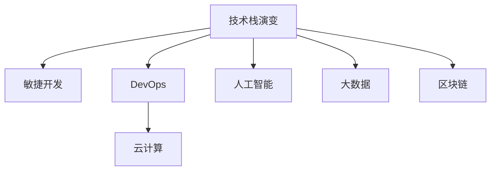

                 

# 程序员如何应对行业变革与转型

## 1. 背景介绍

### 1.1 问题由来

随着科技的迅猛发展和行业的不断进步，信息技术领域的变革已不可阻挡。从早期的算机革命到互联网的普及，再到移动互联网的崛起，每一次变革都深刻地改变了我们的工作方式和生活习惯。作为在这个时代中的程序员，如何在这股变革的浪潮中保持敏锐的洞察力，与时俱进，是每一个IT从业者都必须面对的挑战。

### 1.2 问题核心关键点

在信息技术行业，核心变革的推动力主要来自以下几个方面：

- **技术迭代**：新技术、新框架和新工具层出不穷，如云计算、大数据、人工智能、物联网等。
- **需求变化**：用户需求和市场变化快速，需要不断调整产品和服务以适应市场。
- **法规政策**：法律法规和标准规范的不断完善，也对技术应用产生了新的要求。
- **人才竞争**：技术和市场竞争激烈，企业对人才的需求和要求也在不断变化。

这些变化要求程序员不仅要具备扎实的技术基础，还要具备快速学习新知识、适应新环境的能力。

### 1.3 问题研究意义

深入理解行业变革的动因和趋势，可以帮助程序员在职业生涯中做出更有前瞻性的决策，保持竞争优势，为个人和组织的长期发展奠定基础。

1. **职业发展**：适应行业变革，提升技能水平，拓宽职业道路。
2. **企业价值**：在企业转型过程中发挥关键作用，提升技术实力和市场竞争力。
3. **社会影响**：通过技术的创新应用，促进社会进步和产业升级。

## 2. 核心概念与联系

### 2.1 核心概念概述

为更好地理解程序员如何应对行业变革与转型，本节将介绍几个密切相关的核心概念：

- **技术栈演变**：指随着行业发展，常用的技术栈和框架会发生显著变化。例如，从早期的客户端技术（如Java、C++）到后端技术（如Node.js、Python），再到全栈开发（如React、Vue、Spring Boot）。
- **敏捷开发**：一种高效的软件开发方法，强调快速响应市场需求，快速迭代产品功能。
- **DevOps**：开发和运维的结合，旨在提升软件交付的效率和可靠性，加速产品的市场化和应用。
- **云计算**：基于互联网的计算服务，提供弹性的计算资源和高效的服务管理，降低企业IT成本。
- **人工智能**：通过机器学习和深度学习算法，使计算机具备自主学习能力和智能决策能力。
- **大数据**：收集、处理、分析和应用大规模数据集，提供数据驱动的决策支持。
- **区块链**：一种分布式账本技术，通过去中心化实现安全可靠的交易和数据记录。

这些概念之间的逻辑关系可以通过以下Mermaid流程图来展示：



这个流程图展示了大语言模型的核心概念及其之间的关系：

1. 技术栈演变推动了新的开发方法（敏捷开发）和协作模式（DevOps）的出现。
2. DevOps和云计算结合，提升了软件交付的效率和质量。
3. 人工智能和大数据技术为行业提供了强大的分析与决策支持。
4. 区块链技术为数据安全和管理提供了新思路。

这些概念共同构成了当前信息技术行业的发展框架，程序员需要全面掌握，以适应行业变革的要求。

## 3. 核心算法原理 & 具体操作步骤

### 3.1 算法原理概述

在行业变革与转型的背景下，程序员的核心算法原理可以概括为以下三点：

1. **技术融合与创新**：将不同技术栈和新技术有机结合，推动技术创新。
2. **敏捷方法与DevOps实践**：采用敏捷方法和DevOps实践，提高软件开发和交付的效率。
3. **数据驱动与人工智能应用**：利用大数据和人工智能技术，提供数据驱动的决策支持。

### 3.2 算法步骤详解

以下是对上述核心算法原理的具体步骤详解：

**步骤一：技术栈选择与学习**

1. **选择适合的技术栈**：根据项目需求和自身技能，选择最合适的技术栈，包括前后端技术、数据库、框架和工具。
2. **持续学习与更新**：通过阅读技术博客、参加技术培训、参与开源项目等方式，持续更新技术栈知识，保持与行业前沿同步。

**步骤二：敏捷开发与迭代**

1. **敏捷方法论**：采用Scrum、Kanban等敏捷开发方法论，通过短周期的迭代和持续反馈，快速适应市场变化。
2. **持续集成与部署**：建立CI/CD流水线，实现代码自动构建、测试和部署，加速产品迭代速度。

**步骤三：DevOps实践与运维**

1. **自动化运维**：使用自动化工具（如Ansible、Puppet、Jenkins等），实现基础设施自动化和应用自动化。
2. **监控与优化**：通过监控工具（如Prometheus、Grafana、ELK Stack等），实时监测系统性能和资源使用情况，优化系统性能。

**步骤四：数据驱动与AI应用**

1. **数据采集与处理**：通过数据采集和处理工具（如Flume、Spark、Flink等），收集和处理海量数据。
2. **数据分析与建模**：利用数据仓库和数据可视化工具（如Redshift、Tableau等），进行数据分析和可视化。
3. **机器学习与AI应用**：使用机器学习框架（如TensorFlow、PyTorch、Scikit-Learn等），开发和部署AI应用，提供智能决策支持。

### 3.3 算法优缺点

技术融合与创新带来以下优点和缺点：

- **优点**：推动技术前沿发展，提升竞争力，激发创新。
- **缺点**：技术栈更新速度快，学习成本高，需要持续投入时间和精力。

敏捷开发与迭代带来以下优点和缺点：

- **优点**：快速响应市场变化，提高开发效率，增强团队协作。
- **缺点**：需要严格的团队管理和流程控制，容易出现沟通和协调问题。

DevOps实践与运维带来以下优点和缺点：

- **优点**：提升交付速度和质量，增强系统稳定性和可靠性。
- **缺点**：需要复杂的自动化流程和管理工具，初期投入较大。

数据驱动与AI应用带来以下优点和缺点：

- **优点**：提供精确的决策支持，提升业务价值。
- **缺点**：数据质量要求高，需要投入大量资源进行数据清洗和处理。

### 3.4 算法应用领域

技术融合与创新、敏捷开发与迭代、DevOps实践与运维、数据驱动与AI应用，在多个领域都有广泛的应用，例如：

- **软件开发**：通过选择适合的技术栈和采用敏捷方法，提高软件开发的效率和质量。
- **互联网应用**：通过DevOps实践和云服务，快速部署和上线应用，提升用户体验。
- **金融科技**：通过数据驱动和AI应用，提升风险控制和客户服务能力。
- **智能制造**：通过物联网和人工智能技术，实现生产自动化和智能化。
- **医疗健康**：通过大数据和AI应用，提升疾病诊断和医疗服务效率。

## 4. 数学模型和公式 & 详细讲解

### 4.1 数学模型构建

在行业变革与转型背景下，数学模型的构建需要考虑以下几个方面：

1. **数据模型**：选择合适的数据模型，如统计模型、回归模型、分类模型等，用于分析和预测。
2. **算法模型**：选择合适的算法模型，如线性回归、决策树、支持向量机、深度学习等，用于模型训练和预测。
3. **模型评估**：选择合适的评估指标，如准确率、召回率、F1值等，评估模型的性能。

### 4.2 公式推导过程

以线性回归模型为例，推导其最小二乘法求解过程：

$$
\min_{\theta} \sum_{i=1}^n (y_i - \theta^T x_i)^2
$$

对 $\theta$ 求导，得：

$$
\nabla_{\theta} \mathcal{L}(\theta) = -2\sum_{i=1}^n (y_i - \theta^T x_i) x_i
$$

令 $\nabla_{\theta} \mathcal{L}(\theta) = 0$，解得：

$$
\theta = (\sum_{i=1}^n x_i x_i^T)^{-1} \sum_{i=1}^n x_i y_i
$$

通过求解上述最小二乘法，线性回归模型可拟合出最优的参数 $\theta$。

### 4.3 案例分析与讲解

以线性回归模型在金融市场预测中的应用为例，分析其原理和应用场景：

**案例背景**：某金融公司需要预测股票价格走势，用于投资决策和风险控制。

**数据准备**：收集历史股票价格数据，提取价格变化、交易量、市场情绪等特征。

**模型构建**：采用线性回归模型，设计合适的特征，拟合模型参数。

**模型评估**：使用历史数据评估模型性能，选择最优模型进行预测。

## 5. 项目实践：代码实例和详细解释说明

### 5.1 开发环境搭建

在进行项目实践前，我们需要准备好开发环境。以下是使用Python进行PyTorch开发的环境配置流程：

1. 安装Anaconda：从官网下载并安装Anaconda，用于创建独立的Python环境。

2. 创建并激活虚拟环境：
```bash
conda create -n pytorch-env python=3.8 
conda activate pytorch-env
```

3. 安装PyTorch：根据CUDA版本，从官网获取对应的安装命令。例如：
```bash
conda install pytorch torchvision torchaudio cudatoolkit=11.1 -c pytorch -c conda-forge
```

4. 安装TensorFlow：由Google主导开发的开源深度学习框架，生产部署方便，适合大规模工程应用。同样有丰富的预训练语言模型资源。

5. 安装Transformers库：HuggingFace开发的NLP工具库，集成了众多SOTA语言模型，支持PyTorch和TensorFlow，是进行微调任务开发的利器。

6. 安装各类工具包：
```bash
pip install numpy pandas scikit-learn matplotlib tqdm jupyter notebook ipython
```

完成上述步骤后，即可在`pytorch-env`环境中开始项目实践。

### 5.2 源代码详细实现

这里我们以线性回归模型为例，给出使用PyTorch进行模型构建和训练的代码实现。

```python
import torch
import torch.nn as nn
import torch.optim as optim
from sklearn.datasets import make_regression
from sklearn.model_selection import train_test_split
from torch.utils.data import TensorDataset, DataLoader

# 创建数据集
X, y = make_regression(n_samples=1000, n_features=4, noise=0.1)
X_train, X_test, y_train, y_test = train_test_split(X, y, test_size=0.2)

# 数据处理
X_train = torch.from_numpy(X_train).float()
y_train = torch.from_numpy(y_train).float()
X_test = torch.from_numpy(X_test).float()
y_test = torch.from_numpy(y_test).float()

# 定义模型
class LinearRegression(nn.Module):
    def __init__(self, input_dim, output_dim):
        super(LinearRegression, self).__init__()
        self.linear = nn.Linear(input_dim, output_dim)

    def forward(self, x):
        return self.linear(x)

# 模型初始化
input_dim = X.shape[1]
output_dim = 1
model = LinearRegression(input_dim, output_dim)

# 定义优化器和损失函数
optimizer = optim.SGD(model.parameters(), lr=0.01)
criterion = nn.MSELoss()

# 训练模型
for epoch in range(100):
    loss = 0
    for i, (inputs, labels) in enumerate(DataLoader(torch.utils.data.TensorDataset(X_train, y_train), batch_size=32)):
        optimizer.zero_grad()
        outputs = model(inputs)
        loss += criterion(outputs, labels).item()
        loss.backward()
        optimizer.step()
    print(f'Epoch [{epoch+1}/{100}], Loss: {loss/len(X_train):.4f}')

# 评估模型
with torch.no_grad():
    predictions = model(X_test)
    loss = criterion(predictions, y_test)
    print(f'Test Loss: {loss:.4f}')
```

以上就是使用PyTorch进行线性回归模型训练的完整代码实现。可以看到，通过简单的代码编写，即可完成模型的定义、训练和评估。

### 5.3 代码解读与分析

让我们再详细解读一下关键代码的实现细节：

**数据集创建**：
- 使用`make_regression`函数生成模拟数据集，包括特征和标签。
- 使用`train_test_split`函数将数据集划分为训练集和测试集。

**模型定义**：
- 定义一个线性回归模型类，继承`nn.Module`。
- 在`__init__`方法中定义线性层`self.linear`。
- 在`forward`方法中定义前向传播过程，将输入数据通过线性层得到输出。

**模型初始化与优化器**：
- 初始化线性回归模型，指定输入和输出维度。
- 定义优化器`SGD`，设置学习率为0.01。
- 定义损失函数`MSELoss`，用于计算预测值和真实标签之间的均方误差。

**模型训练**：
- 使用`DataLoader`将训练集数据划分为批次，进行迭代训练。
- 在每个批次上，前向传播计算损失，反向传播更新模型参数。
- 循环100次，每次训练后输出平均损失。

**模型评估**：
- 在测试集上评估模型性能，计算均方误差损失。
- 输出模型在测试集上的表现。

通过以上步骤，我们可以快速搭建并训练线性回归模型，为进一步应用到实际项目打下基础。

## 6. 实际应用场景

### 6.1 智能客服系统

基于大语言模型微调的对话技术，可以广泛应用于智能客服系统的构建。传统客服往往需要配备大量人力，高峰期响应缓慢，且一致性和专业性难以保证。而使用微调后的对话模型，可以7x24小时不间断服务，快速响应客户咨询，用自然流畅的语言解答各类常见问题。

在技术实现上，可以收集企业内部的历史客服对话记录，将问题和最佳答复构建成监督数据，在此基础上对预训练对话模型进行微调。微调后的对话模型能够自动理解用户意图，匹配最合适的答案模板进行回复。对于客户提出的新问题，还可以接入检索系统实时搜索相关内容，动态组织生成回答。如此构建的智能客服系统，能大幅提升客户咨询体验和问题解决效率。

### 6.2 金融舆情监测

金融机构需要实时监测市场舆论动向，以便及时应对负面信息传播，规避金融风险。传统的人工监测方式成本高、效率低，难以应对网络时代海量信息爆发的挑战。基于大语言模型微调的文本分类和情感分析技术，为金融舆情监测提供了新的解决方案。

具体而言，可以收集金融领域相关的新闻、报道、评论等文本数据，并对其进行主题标注和情感标注。在此基础上对预训练语言模型进行微调，使其能够自动判断文本属于何种主题，情感倾向是正面、中性还是负面。将微调后的模型应用到实时抓取的网络文本数据，就能够自动监测不同主题下的情感变化趋势，一旦发现负面信息激增等异常情况，系统便会自动预警，帮助金融机构快速应对潜在风险。

### 6.3 个性化推荐系统

当前的推荐系统往往只依赖用户的历史行为数据进行物品推荐，无法深入理解用户的真实兴趣偏好。基于大语言模型微调技术，个性化推荐系统可以更好地挖掘用户行为背后的语义信息，从而提供更精准、多样的推荐内容。

在实践中，可以收集用户浏览、点击、评论、分享等行为数据，提取和用户交互的物品标题、描述、标签等文本内容。将文本内容作为模型输入，用户的后续行为（如是否点击、购买等）作为监督信号，在此基础上微调预训练语言模型。微调后的模型能够从文本内容中准确把握用户的兴趣点。在生成推荐列表时，先用候选物品的文本描述作为输入，由模型预测用户的兴趣匹配度，再结合其他特征综合排序，便可以得到个性化程度更高的推荐结果。

### 6.4 未来应用展望

随着大语言模型微调技术的发展，基于微调范式将在更多领域得到应用，为传统行业带来变革性影响。

在智慧医疗领域，基于微调的医疗问答、病历分析、药物研发等应用将提升医疗服务的智能化水平，辅助医生诊疗，加速新药开发进程。

在智能教育领域，微调技术可应用于作业批改、学情分析、知识推荐等方面，因材施教，促进教育公平，提高教学质量。

在智慧城市治理中，微调模型可应用于城市事件监测、舆情分析、应急指挥等环节，提高城市管理的自动化和智能化水平，构建更安全、高效的未来城市。

此外，在企业生产、社会治理、文娱传媒等众多领域，基于大模型微调的人工智能应用也将不断涌现，为经济社会发展注入新的动力。相信随着技术的日益成熟，微调方法将成为人工智能落地应用的重要范式，推动人工智能技术在垂直行业的规模化落地。

## 7. 工具和资源推荐

### 7.1 学习资源推荐

为了帮助开发者系统掌握大语言模型微调的理论基础和实践技巧，这里推荐一些优质的学习资源：

1. 《Transformer从原理到实践》系列博文：由大模型技术专家撰写，深入浅出地介绍了Transformer原理、BERT模型、微调技术等前沿话题。

2. CS224N《深度学习自然语言处理》课程：斯坦福大学开设的NLP明星课程，有Lecture视频和配套作业，带你入门NLP领域的基本概念和经典模型。

3. 《Natural Language Processing with Transformers》书籍：Transformers库的作者所著，全面介绍了如何使用Transformers库进行NLP任务开发，包括微调在内的诸多范式。

4. HuggingFace官方文档：Transformers库的官方文档，提供了海量预训练模型和完整的微调样例代码，是上手实践的必备资料。

5. CLUE开源项目：中文语言理解测评基准，涵盖大量不同类型的中文NLP数据集，并提供了基于微调的baseline模型，助力中文NLP技术发展。

通过对这些资源的学习实践，相信你一定能够快速掌握大语言模型微调的精髓，并用于解决实际的NLP问题。

### 7.2 开发工具推荐

高效的开发离不开优秀的工具支持。以下是几款用于大语言模型微调开发的常用工具：

1. PyTorch：基于Python的开源深度学习框架，灵活动态的计算图，适合快速迭代研究。大部分预训练语言模型都有PyTorch版本的实现。

2. TensorFlow：由Google主导开发的开源深度学习框架，生产部署方便，适合大规模工程应用。同样有丰富的预训练语言模型资源。

3. Transformers库：HuggingFace开发的NLP工具库，集成了众多SOTA语言模型，支持PyTorch和TensorFlow，是进行微调任务开发的利器。

4. Weights & Biases：模型训练的实验跟踪工具，可以记录和可视化模型训练过程中的各项指标，方便对比和调优。与主流深度学习框架无缝集成。

5. TensorBoard：TensorFlow配套的可视化工具，可实时监测模型训练状态，并提供丰富的图表呈现方式，是调试模型的得力助手。

6. Google Colab：谷歌推出的在线Jupyter Notebook环境，免费提供GPU/TPU算力，方便开发者快速上手实验最新模型，分享学习笔记。

合理利用这些工具，可以显著提升大语言模型微调任务的开发效率，加快创新迭代的步伐。

### 7.3 相关论文推荐

大语言模型和微调技术的发展源于学界的持续研究。以下是几篇奠基性的相关论文，推荐阅读：

1. Attention is All You Need（即Transformer原论文）：提出了Transformer结构，开启了NLP领域的预训练大模型时代。

2. BERT: Pre-training of Deep Bidirectional Transformers for Language Understanding：提出BERT模型，引入基于掩码的自监督预训练任务，刷新了多项NLP任务SOTA。

3. Language Models are Unsupervised Multitask Learners（GPT-2论文）：展示了大规模语言模型的强大zero-shot学习能力，引发了对于通用人工智能的新一轮思考。

4. Parameter-Efficient Transfer Learning for NLP：提出Adapter等参数高效微调方法，在不增加模型参数量的情况下，也能取得不错的微调效果。

5. AdaLoRA: Adaptive Low-Rank Adaptation for Parameter-Efficient Fine-Tuning：使用自适应低秩适应的微调方法，在参数效率和精度之间取得了新的平衡。

6. Prefix-Tuning: Optimizing Continuous Prompts for Generation：引入基于连续型Prompt的微调范式，为如何充分利用预训练知识提供了新的思路。

这些论文代表了大语言模型微调技术的发展脉络。通过学习这些前沿成果，可以帮助研究者把握学科前进方向，激发更多的创新灵感。

## 8. 总结：未来发展趋势与挑战

### 8.1 研究成果总结

本文对大语言模型微调技术进行了全面系统的介绍。首先阐述了大语言模型和微调技术的研究背景和意义，明确了微调在拓展预训练模型应用、提升下游任务性能方面的独特价值。其次，从原理到实践，详细讲解了监督微调的数学原理和关键步骤，给出了微调任务开发的完整代码实例。同时，本文还广泛探讨了微调方法在智能客服、金融舆情、个性化推荐等多个行业领域的应用前景，展示了微调范式的巨大潜力。

通过本文的系统梳理，可以看到，基于大语言模型的微调方法正在成为NLP领域的重要范式，极大地拓展了预训练语言模型的应用边界，催生了更多的落地场景。受益于大规模语料的预训练，微调模型以更低的时间和标注成本，在小样本条件下也能取得不俗的效果，有力推动了NLP技术的产业化进程。未来，伴随预训练语言模型和微调方法的持续演进，相信NLP技术将在更广阔的应用领域大放异彩，深刻影响人类的生产生活方式。

### 8.2 未来发展趋势

展望未来，大语言模型微调技术将呈现以下几个发展趋势：

1. 模型规模持续增大。随着算力成本的下降和数据规模的扩张，预训练语言模型的参数量还将持续增长。超大规模语言模型蕴含的丰富语言知识，有望支撑更加复杂多变的下游任务微调。

2. 微调方法日趋多样。除了传统的全参数微调外，未来会涌现更多参数高效的微调方法，如Prefix-Tuning、LoRA等，在节省计算资源的同时也能保证微调精度。

3. 持续学习成为常态。随着数据分布的不断变化，微调模型也需要持续学习新知识以保持性能。如何在不遗忘原有知识的同时，高效吸收新样本信息，将成为重要的研究课题。

4. 标注样本需求降低。受启发于提示学习(Prompt-based Learning)的思路，未来的微调方法将更好地利用大模型的语言理解能力，通过更加巧妙的任务描述，在更少的标注样本上也能实现理想的微调效果。

5. 多模态微调崛起。当前的微调主要聚焦于纯文本数据，未来会进一步拓展到图像、视频、语音等多模态数据微调。多模态信息的融合，将显著提升语言模型对现实世界的理解和建模能力。

6. 模型通用性增强。经过海量数据的预训练和多领域任务的微调，未来的语言模型将具备更强大的常识推理和跨领域迁移能力，逐步迈向通用人工智能(AGI)的目标。

以上趋势凸显了大语言模型微调技术的广阔前景。这些方向的探索发展，必将进一步提升NLP系统的性能和应用范围，为人类认知智能的进化带来深远影响。

### 8.3 面临的挑战

尽管大语言模型微调技术已经取得了瞩目成就，但在迈向更加智能化、普适化应用的过程中，它仍面临着诸多挑战：

1. 标注成本瓶颈。虽然微调大大降低了标注数据的需求，但对于长尾应用场景，难以获得充足的高质量标注数据，成为制约微调性能的瓶颈。如何进一步降低微调对标注样本的依赖，将是一大难题。

2. 模型鲁棒性不足。当前微调模型面对域外数据时，泛化性能往往大打折扣。对于测试样本的微小扰动，微调模型的预测也容易发生波动。如何提高微调模型的鲁棒性，避免灾难性遗忘，还需要更多理论和实践的积累。

3. 推理效率有待提高。大规模语言模型虽然精度高，但在实际部署时往往面临推理速度慢、内存占用大等效率问题。如何在保证性能的同时，简化模型结构，提升推理速度，优化资源占用，将是重要的优化方向。

4. 可解释性亟需加强。当前微调模型更像是"黑盒"系统，难以解释其内部工作机制和决策逻辑。对于医疗、金融等高风险应用，算法的可解释性和可审计性尤为重要。如何赋予微调模型更强的可解释性，将是亟待攻克的难题。

5. 安全性有待保障。预训练语言模型难免会学习到有偏见、有害的信息，通过微调传递到下游任务，产生误导性、歧视性的输出，给实际应用带来安全隐患。如何从数据和算法层面消除模型偏见，避免恶意用途，确保输出的安全性，也将是重要的研究课题。

6. 知识整合能力不足。现有的微调模型往往局限于任务内数据，难以灵活吸收和运用更广泛的先验知识。如何让微调过程更好地与外部知识库、规则库等专家知识结合，形成更加全面、准确的信息整合能力，还有很大的想象空间。

正视微调面临的这些挑战，积极应对并寻求突破，将是大语言模型微调走向成熟的必由之路。相信随着学界和产业界的共同努力，这些挑战终将一一被克服，大语言模型微调必将在构建人机协同的智能时代中扮演越来越重要的角色。

### 8.4 未来突破

面对大语言模型微调所面临的种种挑战，未来的研究需要在以下几个方面寻求新的突破：

1. 探索无监督和半监督微调方法。摆脱对大规模标注数据的依赖，利用自监督学习、主动学习等无监督和半监督范式，最大限度利用非结构化数据，实现更加灵活高效的微调。

2. 研究参数高效和计算高效的微调范式。开发更加参数高效的微调方法，在固定大部分预训练参数的同时，只更新极少量的任务相关参数。同时优化微调模型的计算图，减少前向传播和反向传播的资源消耗，实现更加轻量级、实时性的部署。

3. 融合因果和对比学习范式。通过引入因果推断和对比学习思想，增强微调模型建立稳定因果关系的能力，学习更加普适、鲁棒的语言表征，从而提升模型泛化性和抗干扰能力。

4. 引入更多先验知识。将符号化的先验知识，如知识图谱、逻辑规则等，与神经网络模型进行巧妙融合，引导微调过程学习更准确、合理的语言模型。同时加强不同模态数据的整合，实现视觉、语音等多模态信息与文本信息的协同建模。

5. 结合因果分析和博弈论工具。将因果分析方法引入微调模型，识别出模型决策的关键特征，增强输出解释的因果性和逻辑性。借助博弈论工具刻画人机交互过程，主动探索并规避模型的脆弱点，提高系统稳定性。

6. 纳入伦理道德约束。在模型训练目标中引入伦理导向的评估指标，过滤和惩罚有偏见、有害的输出倾向。同时加强人工干预和审核，建立模型行为的监管机制，确保输出符合人类价值观和伦理道德。

这些研究方向的探索，必将引领大语言模型微调技术迈向更高的台阶，为构建安全、可靠、可解释、可控的智能系统铺平道路。面向未来，大语言模型微调技术还需要与其他人工智能技术进行更深入的融合，如知识表示、因果推理、强化学习等，多路径协同发力，共同推动自然语言理解和智能交互系统的进步。只有勇于创新、敢于突破，才能不断拓展语言模型的边界，让智能技术更好地造福人类社会。

## 9. 附录：常见问题与解答

**Q1：大语言模型微调是否适用于所有NLP任务？**

A: 大语言模型微调在大多数NLP任务上都能取得不错的效果，特别是对于数据量较小的任务。但对于一些特定领域的任务，如医学、法律等，仅仅依靠通用语料预训练的模型可能难以很好地适应。此时需要在特定领域语料上进一步预训练，再进行微调，才能获得理想效果。此外，对于一些需要时效性、个性化很强的任务，如对话、推荐等，微调方法也需要针对性的改进优化。

**Q2：微调过程中如何选择合适的学习率？**

A: 微调的学习率一般要比预训练时小1-2个数量级，如果使用过大的学习率，容易破坏预训练权重，导致过拟合。一般建议从1e-5开始调参，逐步减小学习率，直至收敛。也可以使用warmup策略，在开始阶段使用较小的学习率，再逐渐过渡到预设值。需要注意的是，不同的优化器(如AdamW、Adafactor等)以及不同的学习率调度策略，可能需要设置不同的学习率阈值。

**Q3：采用大模型微调时会面临哪些资源瓶颈？**

A: 目前主流的预训练大模型动辄以亿计的参数规模，对算力、内存、存储都提出了很高的要求。GPU/TPU等高性能设备是必不可少的，但即便如此，超大批次的训练和推理也可能遇到显存不足的问题。因此需要采用一些资源优化技术，如梯度积累、混合精度训练、模型并行等，来突破硬件瓶颈。同时，模型的存储和读取也可能占用大量时间和空间，需要采用模型压缩、稀疏化存储等方法进行优化。

**Q4：如何缓解微调过程中的过拟合问题？**

A: 过拟合是微调面临的主要挑战，尤其是在标注数据不足的情况下。常见的缓解策略包括：
1. 数据增强：通过回译、近义替换等方式扩充训练集
2. 正则化：使用L2正则、Dropout、Early Stopping等避免过拟合
3. 对抗训练：引入对抗样本，提高模型鲁棒性
4. 参数高效微调：只调整少量参数(如Adapter、Prefix等)，减小过拟合风险
5. 多模型集成：训练多个微调模型，取平均输出，抑制过拟合

这些策略往往需要根据具体任务和数据特点进行灵活组合。只有在数据、模型、训练、推理等各环节进行全面优化，才能最大限度地发挥大模型微调的威力。

**Q5：微调模型在落地部署时需要注意哪些问题？**

A: 将微调模型转化为实际应用，还需要考虑以下因素：
1. 模型裁剪：去除不必要的层和参数，减小模型尺寸，加快推理速度
2. 量化加速：将浮点模型转为定点模型，压缩存储空间，提高计算效率
3. 服务化封装：将模型封装为标准化服务接口，便于集成调用
4. 弹性伸缩：根据请求流量动态调整资源配置，平衡服务质量和成本
5. 监控告警：实时采集系统指标，设置异常告警阈值，确保服务稳定性
6. 安全防护：采用访问鉴权、数据脱敏等措施，保障数据和模型安全

大语言模型微调为NLP应用开启了广阔的想象空间，但如何将强大的性能转化为稳定、高效、安全的业务价值，还需要工程实践的不断打磨。唯有从数据、算法、工程、业务等多个维度协同发力，才能真正实现人工智能技术在垂直行业的规模化落地。总之，微调需要开发者根据具体任务，不断迭代和优化模型、数据和算法，方能得到理想的效果。

---

作者：禅与计算机程序设计艺术 / Zen and the Art of Computer Programming

