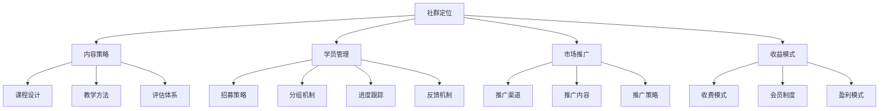

                 

# 程序员如何建立自己的知识付费社群

## 1. 背景介绍

### 1.1 问题由来
随着知识付费市场的发展，越来越多有专业知识的程序员开始考虑通过知识付费社群来分享和变现自己的技术知识。这是一个既充满挑战又极具潜力的领域，可以为程序员带来可观的收益，同时也是拓展技术影响力、构建个人品牌的重要渠道。然而，建立一个稳定且持续发展的知识付费社群并不容易。很多程序员对于如何构建社群、如何吸引和留住学员、如何进行课程设计和管理等都存在诸多困惑。本文将深入探讨这些核心问题，并给出详细的指导。

### 1.2 问题核心关键点
构建知识付费社群的核心问题包括：

1. **社群定位**：明确社群的目标受众和核心价值。
2. **内容策略**：制定有系统性、连贯性的课程内容。
3. **学员管理**：采用有效的学员管理策略和互动机制。
4. **市场推广**：如何有效推广社群，吸引学员。
5. **收益模式**：建立合理的课程收费和会员体系。
6. **运营优化**：如何持续优化社群运营，提升学员满意度。

本文将从社群定位、内容策略、学员管理、市场推广、收益模式和运营优化六个方面，全面介绍如何建立自己的知识付费社群。

## 2. 核心概念与联系

### 2.1 核心概念概述

为了更好地理解如何构建知识付费社群，我们需要了解以下几个核心概念：

- **知识付费**：指通过互联网平台，为受众提供专业知识、技能、经验等服务，并收取相应费用的商业行为。
- **社群**：指一群人基于共同的兴趣、目标或需求，通过网络平台聚集在一起，进行交流和协作。
- **知识付费社群**：将知识付费与社群交流结合起来，通过付费方式提供系统化、结构化的知识服务。
- **内容策略**：课程内容的设计和规划，包括课程框架、教学方法和评估体系等。
- **学员管理**：学员的招募、分组、学习进度跟踪和反馈机制等。
- **市场推广**：通过各种渠道和方式，吸引潜在学员加入社群。
- **收益模式**：课程收费、会员制度、知识付费社群的盈利模式等。

这些概念之间的联系可以用以下Mermaid流程图来展示：



这个流程图展示了社群构建的各个环节及其相互关系。

## 3. 核心算法原理 & 具体操作步骤

### 3.1 算法原理概述

建立知识付费社群的过程，本质上是一个系统性的项目管理过程，涉及多个维度的决策和实施。其核心算法原理包括：

- **系统思维**：将社群构建视为一个系统，通过明确目标、分解任务、协调资源来解决问题。
- **数据驱动**：通过数据收集和分析，做出科学决策，优化社群运营。
- **迭代优化**：通过不断测试和反馈，逐步改进社群内容、学员管理和运营策略。

### 3.2 算法步骤详解

以下是构建知识付费社群的具体操作步骤：

#### Step 1: 确定社群定位
1. **目标受众**：明确社群的受众群体，如技术初学者、中高级开发者、特定技术领域专家等。
2. **核心价值**：确定社群的核心价值，如提供深入的技术讲解、行业趋势分析、职业发展指导等。
3. **社群目标**：明确社群的目标，如传授知识、建立人脉、提升技能等。

#### Step 2: 设计内容策略
1. **课程框架**：设计系统的课程框架，包括基础课程、进阶课程、实战项目等。
2. **教学方法**：选择合适的教学方法，如视频讲解、在线讨论、作业反馈等。
3. **评估体系**：建立科学的评估体系，包括作业、测试、项目评审等，以确保学员的学习效果。

#### Step 3: 进行学员管理
1. **招募策略**：制定招募策略，通过社交媒体、技术论坛、在线课程等渠道吸引学员。
2. **分组机制**：将学员分为不同的组别，如初级、中级、高级组，以便针对不同层次学员提供个性化的指导。
3. **进度跟踪**：建立学员学习进度跟踪机制，及时了解学员的学习情况，提供个性化建议。
4. **反馈机制**：建立学员反馈机制，收集学员意见和建议，及时调整课程内容和教学方法。

#### Step 4: 市场推广
1. **推广渠道**：选择合适的推广渠道，如社交媒体、技术博客、在线广告等。
2. **推广内容**：设计有吸引力的推广内容，如课程介绍、学员评价、成功案例等。
3. **推广策略**：采用多种推广策略，如免费课程试听、学员推荐奖励等，吸引更多学员加入。

#### Step 5: 建立收益模式
1. **课程收费**：制定合理的课程收费标准，确保既能覆盖运营成本，又能吸引学员。
2. **会员制度**：设计会员制度，提供额外的学习资源和社区服务。
3. **盈利模式**：探索多种盈利模式，如课程销售、付费咨询、商业合作等。

#### Step 6: 持续优化运营
1. **用户反馈**：定期收集学员反馈，评估社群运营效果。
2. **内容更新**：根据技术发展和学员需求，定期更新课程内容。
3. **运营改进**：优化社群管理流程和互动机制，提升学员满意度。

### 3.3 算法优缺点

构建知识付费社群的方法具有以下优点：
1. **系统性**：通过明确的目标和科学的流程，有效管理社群构建的各个环节。
2. **数据驱动**：利用数据收集和分析，做出科学的决策，提升社群运营效率。
3. **迭代优化**：通过不断测试和改进，逐步提升社群质量和学员满意度。

同时，该方法也存在一些局限性：
1. **初期投入高**：社群构建涉及的内容设计、市场推广等需要大量的时间和资源投入。
2. **运营复杂**：学员管理、课程更新、市场推广等环节需要持续的运营维护。
3. **竞争激烈**：知识付费市场竞争激烈，如何吸引和留住学员是一个持续挑战。

尽管存在这些局限性，但就目前而言，系统化的社群构建方法仍然是建立知识付费社群的主要途径。

### 3.4 算法应用领域

基于知识付费社群的构建方法，可以应用于各种技术领域的知识共享和技能培训，如软件开发、数据科学、人工智能等。通过系统化、科学化的社群管理，可以有效提升学员的学习效果和社群的活跃度。

## 4. 数学模型和公式 & 详细讲解 & 举例说明

### 4.1 数学模型构建

为了更好地衡量社群构建的效果，可以构建以下数学模型：

设社群的总学员数为 $N$，初始学员数为 $N_0$，新学员数为 $N_1$，流失学员数为 $N_2$，则社群学员总数变化为：

$$
N_{\text{total}} = N_0 + N_1 - N_2
$$

学员流失率 $\lambda$ 可以通过以下公式计算：

$$
\lambda = \frac{N_2}{N_0}
$$

学员满意度 $S$ 可以通过问卷调查等方式得到，设满意学员数为 $S_1$，不满意学员数为 $S_2$，则学员满意度为：

$$
S = \frac{S_1}{N}
$$

课程完成率 $C$ 可以通过记录学员完成课程的比例得到，设完成课程的学员数为 $C_1$，则课程完成率为：

$$
C = \frac{C_1}{N}
$$

通过这些指标，可以系统地评估社群运营效果，并进行相应的调整和优化。

### 4.2 公式推导过程

以学员流失率 $\lambda$ 为例，进行公式推导。

设社群的初始学员数为 $N_0$，流失学员数为 $N_2$，流失率 $\lambda$ 表示在单位时间内流失的学员比例。假设在时间 $t$ 内，流失学员数满足几何分布：

$$
P(X = k) = (1 - \lambda)^{k-1} \lambda
$$

其中 $X$ 表示时间 $t$ 内流失的学员数。则期望流失率 $\lambda$ 可以表示为：

$$
\lambda = \frac{E[X]}{N_0}
$$

通过实际数据分析，可以计算出各个指标的具体数值，并进行优化。

### 4.3 案例分析与讲解

假设某社群初始学员数为 $N_0 = 500$，流失学员数为 $N_2 = 50$，流失率 $\lambda = 10\%$。则社群每月流失学员数为：

$$
N_2 = N_0 \lambda t = 500 \times 10\% \times 1 = 50
$$

根据学员满意度调查，满意学员数为 $S_1 = 400$，不满意学员数为 $S_2 = 100$，则学员满意度 $S$ 为：

$$
S = \frac{S_1}{N} = \frac{400}{500} = 0.8
$$

通过这些数据分析，可以发现社群流失率较高，学员满意度较低，需要进一步优化课程内容和互动机制。

## 5. 项目实践：代码实例和详细解释说明

### 5.1 开发环境搭建

构建知识付费社群需要搭建一个完整的开发环境，以下是基本的搭建流程：

1. **选择开发语言和框架**：Python 和 Flask 框架是比较常用的选择。
2. **安装依赖库**：安装必要的依赖库，如 Flask、SQLAlchemy、Flask-SocketIO 等。
3. **搭建数据库**：使用 SQLite 或 MySQL 等关系型数据库。
4. **配置环境变量**：设置配置文件，包括端口号、数据库连接信息等。

### 5.2 源代码详细实现

以下是使用 Flask 框架搭建知识付费社群平台的基本代码实现：

```python
from flask import Flask, render_template, request
from flask_sqlalchemy import SQLAlchemy
from flask_socketio import SocketIO

app = Flask(__name__)
app.config['SQLALCHEMY_DATABASE_URI'] = 'sqlite:///database.db'
db = SQLAlchemy(app)
socketio = SocketIO(app)

# 定义学员模型
class Member(db.Model):
    id = db.Column(db.Integer, primary_key=True)
    name = db.Column(db.String(50), nullable=False)
    email = db.Column(db.String(50), nullable=False, unique=True)
    joined_at = db.Column(db.DateTime, nullable=False, default=datetime.datetime.now)
    membership = db.relationship('Membership', backref='members', lazy='dynamic')

# 定义会员模型
class Membership(db.Model):
    id = db.Column(db.Integer, primary_key=True)
    member_id = db.Column(db.Integer, db.ForeignKey('member.id'), nullable=False)
    membership_type = db.Column(db.String(20), nullable=False)
    start_date = db.Column(db.DateTime, nullable=False, default=datetime.datetime.now)

# 定义课程模型
class Course(db.Model):
    id = db.Column(db.Integer, primary_key=True)
    name = db.Column(db.String(100), nullable=False)
    description = db.Column(db.Text, nullable=False)
    start_date = db.Column(db.DateTime, nullable=False, default=datetime.datetime.now)
    end_date = db.Column(db.DateTime, nullable=True)

# 定义社群模型
class Community(db.Model):
    id = db.Column(db.Integer, primary_key=True)
    name = db.Column(db.String(100), nullable=False)
    description = db.Column(db.Text, nullable=False)

# 定义作业模型
class Assignment(db.Model):
    id = db.Column(db.Integer, primary_key=True)
    course_id = db.Column(db.Integer, db.ForeignKey('course.id'), nullable=False)
    name = db.Column(db.String(100), nullable=False)
    due_date = db.Column(db.DateTime, nullable=False, default=datetime.datetime.now)
    due_time = db.Column(db.DateTime, nullable=False, default=datetime.datetime.now)

# 定义互动模型
class Interaction(db.Model):
    id = db.Column(db.Integer, primary_key=True)
    member_id = db.Column(db.Integer, db.ForeignKey('member.id'), nullable=False)
    course_id = db.Column(db.Integer, db.ForeignKey('course.id'), nullable=False)
    timestamp = db.Column(db.DateTime, nullable=False, default=datetime.datetime.now)
    message = db.Column(db.Text, nullable=False)

# 定义视图
@app.route('/')
def index():
    courses = Course.query.all()
    return render_template('index.html', courses=courses)

# 定义SocketIO事件处理
@socketio.on('chat message')
def handle_message(message):
    member = Member.query.filter_by(email=message['sender']).first()
    course = Course.query.filter_by(id=message['course_id']).first()
    Interaction.create(member=member, course=course, message=message['message'])
    return emit('message received', {'sender': member.name, 'course': course.name, 'message': message['message']})
```

### 5.3 代码解读与分析

在上述代码中，我们使用 Flask 和 SQLAlchemy 搭建了一个基本的知识付费社群平台。主要包括以下几个核心组件：

1. **学员管理**：使用 `Member` 模型存储学员信息，包括姓名、邮箱、注册时间等。
2. **会员管理**：使用 `Membership` 模型存储会员信息，包括会员类型、开始时间等。
3. **课程管理**：使用 `Course` 模型存储课程信息，包括课程名称、描述、开始时间等。
4. **社群管理**：使用 `Community` 模型存储社群信息，包括社群名称、描述等。
5. **作业管理**：使用 `Assignment` 模型存储作业信息，包括作业名称、截止日期等。
6. **互动管理**：使用 `Interaction` 模型存储学员互动信息，包括学员姓名、课程名称、互动内容等。

在实际开发中，还需要进一步优化和完善这些模型，以便更好地支持学员管理、课程设计、互动交流等社群功能。

## 6. 实际应用场景

### 6.1 智能开发社区

一个典型的智能开发社区可以通过知识付费社群的方式，提供系统化的编程课程、开源项目实战、技术问答等服务。学员可以通过付费加入社群，获取专属资源和指导，参与项目合作，提升编程技能。

### 6.2 数据科学训练营

数据科学训练营可以通过知识付费社群的方式，提供从基础到高级的数据科学课程，包括数据清洗、数据可视化、机器学习、深度学习等。学员可以通过社群学习、在线交流、项目实战，系统掌握数据科学技能。

### 6.3 技术演讲与分享

技术演讲与分享可以通过知识付费社群的方式，邀请知名技术专家、开发者进行技术分享、直播答疑，学员可以通过付费参加活动，获取前沿技术知识，结识行业同仁，拓展职业发展机会。

### 6.4 未来应用展望

随着技术的发展，知识付费社群将不断拓展其应用范围，带来更多创新的应用场景。未来的应用展望包括：

1. **智能导师**：引入AI辅助，为学员提供个性化的学习建议和答疑服务。
2. **项目孵化器**：通过社群平台，孵化创新项目，促进技术和商业的结合。
3. **职业发展**：提供职业规划、简历优化、面试指导等服务，帮助学员更好地融入行业。
4. **跨界合作**：与教育、企业、政府等机构合作，推动知识共享和技能提升。

## 7. 工具和资源推荐

### 7.1 学习资源推荐

为了帮助开发者系统掌握知识付费社群的构建技术，这里推荐一些优质的学习资源：

1. **《知识付费产品设计与运营》**：讲解了知识付费产品从设计到运营的全流程，涵盖学员管理、课程设计、市场推广等多个方面。
2. **《知识付费社群构建指南》**：提供了系统化的社群构建步骤和方法，涵盖社群定位、内容策略、学员管理等多个环节。
3. **《知识付费社群运营实战》**：通过实际案例，展示社群运营的成功经验和关键技巧。
4. **《知识付费平台开发》**：讲解了知识付费平台的搭建和优化，涵盖技术选型、功能实现等多个方面。

通过这些资源的学习，相信你一定能够系统掌握知识付费社群的构建技术，并用于解决实际的社群问题。

### 7.2 开发工具推荐

高效的开发离不开优秀的工具支持。以下是几款用于知识付费社群开发的常用工具：

1. **Flask**：轻量级的 Python 开发框架，适合快速搭建 Web 应用。
2. **SQLAlchemy**：流行的 ORM 框架，支持多种数据库，方便数据管理和查询。
3. **SocketIO**：用于实时通信和互动的 Python 库，支持多种传输协议。
4. **Jupyter Notebook**：交互式开发环境，适合进行数据分析和算法实验。
5. **Google Colab**：免费的在线 Jupyter Notebook 环境，支持 GPU 和 TPU 资源，方便快速实验。

合理利用这些工具，可以显著提升知识付费社群的开发效率，加快创新迭代的步伐。

### 7.3 相关论文推荐

知识付费社群的构建涉及多个学科的知识，以下是几篇具有代表性的相关论文，推荐阅读：

1. **《知识付费产品设计与运营》**：详细介绍了知识付费产品从设计到运营的全流程，涵盖学员管理、课程设计、市场推广等多个方面。
2. **《知识付费社群构建指南》**：提供了系统化的社群构建步骤和方法，涵盖社群定位、内容策略、学员管理等多个环节。
3. **《知识付费社群运营实战》**：通过实际案例，展示社群运营的成功经验和关键技巧。
4. **《知识付费平台开发》**：讲解了知识付费平台的搭建和优化，涵盖技术选型、功能实现等多个方面。

这些论文代表了大语言模型微调技术的发展脉络。通过学习这些前沿成果，可以帮助研究者把握学科前进方向，激发更多的创新灵感。

## 8. 总结：未来发展趋势与挑战

### 8.1 总结

本文对知识付费社群的构建过程进行了全面系统的介绍。首先阐述了知识付费社群构建的背景和意义，明确了社群构建的目标受众、核心价值和运营目标。其次，从社群定位、内容策略、学员管理、市场推广、收益模式和运营优化六个方面，详细讲解了如何建立自己的知识付费社群。最后，通过实际案例和数据分析，展示了社群运营的具体操作。

通过本文的系统梳理，可以看到，知识付费社群构建是一个系统性的项目，涉及多个维度的决策和实施。开发者需要根据自身情况，选择适合的策略和方法，不断优化社群运营，提升学员满意度和社群活跃度。

### 8.2 未来发展趋势

展望未来，知识付费社群的发展趋势包括：

1. **技术驱动**：引入AI辅助，提升社群运营效率，增强用户体验。
2. **数据驱动**：通过数据收集和分析，科学决策，优化社群运营。
3. **跨界融合**：与教育、企业、政府等机构合作，推动知识共享和技能提升。

### 8.3 面临的挑战

尽管知识付费社群具有广阔的发展前景，但在迈向更加智能化、普适化应用的过程中，它仍面临诸多挑战：

1. **初期投入高**：社群构建涉及的内容设计、市场推广等需要大量的时间和资源投入。
2. **运营复杂**：学员管理、课程更新、市场推广等环节需要持续的运营维护。
3. **竞争激烈**：知识付费市场竞争激烈，如何吸引和留住学员是一个持续挑战。

尽管存在这些挑战，但知识付费社群作为一种新兴的商业模式，仍然具有巨大的发展潜力和市场价值。

### 8.4 研究展望

面对知识付费社群面临的挑战，未来的研究需要在以下几个方面寻求新的突破：

1. **技术创新**：开发更加智能化的社群运营工具，如智能导师、跨界合作等。
2. **数据优化**：通过大数据分析，优化社群运营策略，提升学员满意度。
3. **市场拓展**：探索新的市场渠道和推广方式，扩大社群覆盖面。
4. **运营管理**：建立科学的管理体系和反馈机制，持续优化社群运营。

这些研究方向的探索，必将引领知识付费社群走向更高的台阶，为构建智能化的知识共享和技能提升平台铺平道路。面向未来，知识付费社群需要与其他人工智能技术进行更深入的融合，如知识表示、因果推理、强化学习等，多路径协同发力，共同推动人工智能技术在垂直行业的规模化落地。只有勇于创新、敢于突破，才能不断拓展知识付费社群的边界，让知识付费技术更好地造福人类社会。

## 9. 附录：常见问题与解答

**Q1：如何评估知识付费社群的运营效果？**

A: 可以通过学员满意度、课程完成率、学员流失率等指标来评估社群运营效果。具体方法可以参考4.1节中的数学模型。

**Q2：如何吸引学员加入社群？**

A: 可以通过多种推广策略，如免费课程试听、学员推荐奖励等，吸引潜在学员加入社群。同时，通过优秀的课程设计和学员互动，提升社群的吸引力和学员的留存率。

**Q3：如何保持社群的活跃度？**

A: 可以通过定期更新课程内容、组织在线讨论、举办技术分享等活动，保持社群的活跃度。同时，及时收集学员反馈，优化社群运营策略。

**Q4：如何优化社群运营成本？**

A: 可以通过数据驱动的方法，优化学员管理、课程设计、市场推广等环节，降低运营成本。同时，通过智能化运营工具，提升运营效率，减少人力和时间投入。

通过这些回答，相信你对知识付费社群的构建有了更全面的了解。无论是初入行的开发者，还是已经有一定经验的专家，都能从中获得宝贵的经验和启示，不断提升社群构建和运营能力，实现个人品牌和技术影响力的最大化。

