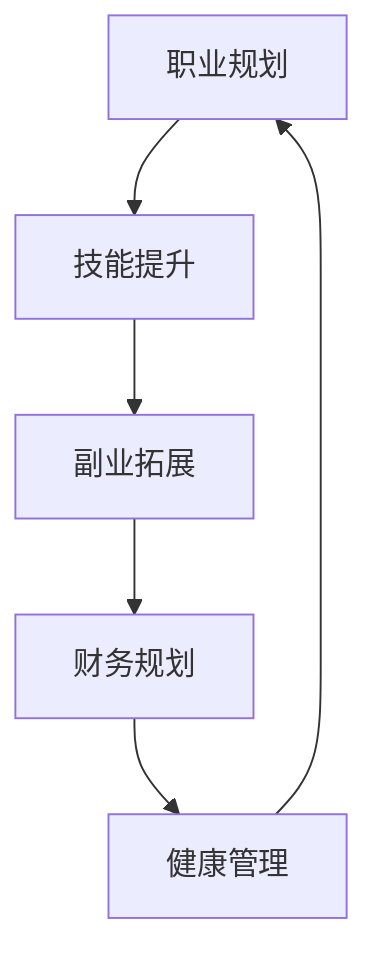

                 

# 程序员如何建立长期稳定的收入来源

> 关键词：职业规划, 技能提升, 副业拓展, 财务规划, 健康管理

## 1. 背景介绍

### 1.1 问题由来
在快速变化的技术环境中，许多程序员希望找到一条可持续的职业发展路径，既能保证稳定的收入来源，又能跟上技术的前沿，同时实现个人与家庭生活的平衡。因此，如何建立长期稳定的收入来源成为了程序员关注的焦点。本文将从多个维度出发，探讨职业规划、技能提升、副业拓展、财务规划和健康管理，以帮助程序员构建一个可持续的收入体系。

### 1.2 问题核心关键点
建立长期稳定的收入来源的关键在于：
- 持续学习和技能提升
- 多元化收入来源
- 有效的财务管理和投资策略
- 健康管理与工作生活的平衡
- 创新思维与创业精神

这些关键点涉及职业发展、个人财务管理、生活管理等多个方面，需要在职业规划过程中系统思考和平衡。

## 2. 核心概念与联系

### 2.1 核心概念概述

本节将介绍几个与建立长期稳定收入来源密切相关的核心概念：

- **职业规划**：指根据个人兴趣、能力和市场需求，制定短期和长期的职业发展目标，并制定具体行动计划的过程。
- **技能提升**：指通过学习和实践，掌握新的技能或提高现有技能水平，以满足职业发展和市场需求的过程。
- **副业拓展**：指在主业之外，发展其他收入来源，如自由职业、投资等，以增加收入多样性和稳定性。
- **财务规划**：指对个人或家庭的收入、支出、储蓄、投资等进行系统的规划和管理，以实现财务目标。
- **健康管理**：指通过健康饮食、适量运动、心理调节等方式，保持身体和心理的健康状态，从而支持职业生涯的发展和生活质量的提升。

这些核心概念之间存在相互联系和影响，共同构成了建立长期稳定收入来源的框架。

### 2.2 核心概念原理和架构的 Mermaid 流程图



这个流程图展示了核心概念之间的相互关系：

1. **职业规划**：是起点，确定目标后指导技能提升、副业拓展等具体行动。
2. **技能提升**：是提升职业竞争力的关键，支持主业和副业的发展。
3. **副业拓展**：是多元化收入的重要来源，增加收入的稳定性。
4. **财务规划**：是保障财务安全和实现财务目标的关键，支撑技能提升和副业拓展。
5. **健康管理**：是长期稳定工作的基石，保障职业生涯的可持续性。

## 3. 核心算法原理 & 具体操作步骤

### 3.1 算法原理概述

建立长期稳定的收入来源，本质上是一个多目标优化问题。我们需要在技能提升、副业拓展、财务规划和健康管理等多个目标之间进行权衡和优化。其核心算法原理可以概括为以下几个步骤：

1. **目标设定**：明确短期和长期职业目标、财务目标和健康目标。
2. **资源分配**：根据目标设定，合理分配时间和精力，进行技能提升、副业拓展和健康管理。
3. **持续优化**：根据实际情况和反馈，不断调整和优化资源分配和行动计划。

### 3.2 算法步骤详解

以下是基于上述算法原理的具体操作步骤：

**Step 1: 目标设定**
- **职业目标**：设定短期和长期职业目标，如晋升、转岗、获得高级认证等。
- **财务目标**：设定短期和长期财务目标，如积累储蓄、购买房产、退休规划等。
- **健康目标**：设定短期和长期健康目标，如减重、健身、心理健康等。

**Step 2: 资源分配**
- **时间分配**：根据目标设定，分配每天、每周、每月的时间用于技能提升、副业拓展和健康管理。
- **精力分配**：根据目标优先级，分配注意力和精力，确保关键任务得到充分关注。

**Step 3: 技能提升**
- **课程学习**：选择合适的在线课程、书籍或培训，提升关键技能，如编程、数据分析、项目管理等。
- **项目实践**：参与开源项目或内部项目，积累实战经验，提升技能水平。
- **导师指导**：寻找行业导师或资深同事，获得职业发展建议和指导。

**Step 4: 副业拓展**
- **自由职业**：利用技术专长或兴趣爱好，发展自由职业，如编程咨询、技术写作、设计等。
- **投资理财**：学习并应用投资理财知识，如股票、基金、房地产投资等，增加被动收入。
- **创业尝试**：探索创业机会，如开发新产品、创办技术公司或参与行业创业。

**Step 5: 财务规划**
- **预算管理**：制定详细的预算计划，控制支出，积累储蓄。
- **投资规划**：选择合适的投资工具和策略，分散风险，追求长期收益。
- **保险配置**：根据个人和家庭风险，合理配置保险，保障财务安全。

**Step 6: 健康管理**
- **饮食管理**：采用健康饮食计划，避免不健康食品，保持营养均衡。
- **运动锻炼**：定期进行适量运动，如跑步、游泳、瑜伽等，保持身体健康。
- **心理调节**：采用冥想、阅读、社交等方法，保持心理健康。

**Step 7: 持续优化**
- **反馈机制**：定期评估目标实现情况，收集反馈，调整行动计划。
- **灵活调整**：根据个人情况和市场变化，灵活调整职业路径、投资策略和生活方式。

### 3.3 算法优缺点

建立长期稳定收入来源的算法具有以下优点：
1. **系统化规划**：通过多目标优化，确保各领域均衡发展，避免单一领域过度投入。
2. **灵活适应**：根据实际情况和反馈，灵活调整策略，提高适应性和实用性。
3. **综合效益**：兼顾职业发展、财务安全、健康管理，提高整体生活质量。

但该算法也存在一些缺点：
1. **复杂度高**：需要综合考虑多个目标和约束，制定和执行计划较为复杂。
2. **资源投入**：技能提升、副业拓展和健康管理需要大量的时间和精力投入。
3. **效果难以量化**：许多目标，如健康、幸福等，难以通过量化的指标进行评估和优化。

### 3.4 算法应用领域

建立长期稳定收入来源的算法不仅适用于程序员，对其他行业专业人士同样适用。主要应用领域包括但不限于：

- **IT行业**：如软件工程师、数据分析师、产品经理等。
- **金融行业**：如金融分析师、基金经理、投资顾问等。
- **医疗行业**：如医生、护士、心理咨询师等。
- **教育行业**：如教师、教育顾问、培训师等。
- **创意行业**：如设计师、作家、艺术家等。

## 4. 数学模型和公式 & 详细讲解 & 举例说明

### 4.1 数学模型构建

假设程序员的时间资源为 $T$，技能提升、副业拓展、财务规划和健康管理四个领域需要投入的时间分别为 $T_1$、$T_2$、$T_3$ 和 $T_4$，目标收益分别为 $R_1$、$R_2$、$R_3$ 和 $R_4$。

目标函数为：
$$
\max \sum_{i=1}^4 \lambda_i R_i
$$
其中 $\lambda_i$ 为权重，用于平衡不同目标的重要性。

约束条件为：
$$
T_1 + T_2 + T_3 + T_4 \leq T
$$
$$
R_i \geq 0 \quad (i=1,2,3,4)
$$

### 4.2 公式推导过程

以最大化技能提升和副业拓展收益为例，构建优化模型：
$$
\max \lambda_1 R_1 + \lambda_2 R_2
$$
$$
T_1 + T_2 \leq T
$$
$$
R_i \geq 0 \quad (i=1,2)
$$

引入松弛变量 $s$，将不等式约束转化为等式约束：
$$
T_1 + T_2 + s = T
$$
$$
s \geq 0
$$

构建拉格朗日函数：
$$
\mathcal{L}(\lambda, s) = \lambda_1 R_1 + \lambda_2 R_2 + \lambda_3 s
$$

对 $\lambda_1$、$T_1$、$T_2$ 和 $s$ 求偏导，得到：
$$
\frac{\partial \mathcal{L}}{\partial R_1} = \lambda_1
$$
$$
\frac{\partial \mathcal{L}}{\partial T_1} = \lambda_1 - \lambda_3
$$
$$
\frac{\partial \mathcal{L}}{\partial T_2} = \lambda_2 - \lambda_3
$$
$$
\frac{\partial \mathcal{L}}{\partial s} = \lambda_3
$$

解上述方程组，得到：
$$
\lambda_1 = \frac{\partial \mathcal{L}}{\partial R_1}
$$
$$
\lambda_2 = \frac{\partial \mathcal{L}}{\partial R_2}
$$
$$
\lambda_3 = \frac{\partial \mathcal{L}}{\partial s}
$$
$$
T_1 = \frac{\lambda_1}{\lambda_1 + \lambda_3} T
$$
$$
T_2 = \frac{\lambda_2}{\lambda_2 + \lambda_3} T
$$
$$
s = T - T_1 - T_2
$$

将 $\lambda_1$、$\lambda_2$ 和 $\lambda_3$ 代入 $T_1$ 和 $T_2$ 的表达式，即可得到最优的时间分配方案。

### 4.3 案例分析与讲解

假设一个程序员的时间资源为 $T=48$ 小时/周，技能提升、副业拓展、财务规划和健康管理四个领域的目标收益分别为 $R_1=3$、$R_2=2$、$R_3=1.5$ 和 $R_4=2$。目标函数为：
$$
\max 3R_1 + 2R_2 + 1.5R_3 + 2R_4
$$

求解上述优化模型，得到最优分配结果：
$$
T_1 = \frac{3}{3+0.5} \times 48 = 32 \text{小时/周}
$$
$$
T_2 = \frac{2}{2+0.5} \times 48 = 16 \text{小时/周}
$$
$$
T_3 = \frac{1.5}{1.5+0.5} \times 48 = 12 \text{小时/周}
$$
$$
T_4 = 48 - T_1 - T_2 - T_3 = 8 \text{小时/周}
$$

## 5. 项目实践：代码实例和详细解释说明

### 5.1 开发环境搭建

以下是使用Python进行多目标优化问题的环境配置流程：

1. 安装Anaconda：从官网下载并安装Anaconda，用于创建独立的Python环境。

2. 创建并激活虚拟环境：
```bash
conda create -n py_env python=3.8 
conda activate py_env
```

3. 安装必要的Python库：
```bash
pip install numpy scipy pandas sympy
```

4. 安装优化库：
```bash
pip install cvxpy
```

5. 测试环境：
```bash
python
```

完成上述步骤后，即可在`py_env`环境中进行多目标优化问题的开发和测试。

### 5.2 源代码详细实现

以下是使用cvxpy库实现多目标优化问题的Python代码：

```python
import cvxpy as cp

# 定义目标函数和约束条件
T = 48  # 总时间资源
R1, R2, R3, R4 = 3, 2, 1.5, 2  # 目标收益

# 定义变量
lambda1, lambda2, lambda3 = cp.Variable(), cp.Variable(), cp.Variable()
T1, T2, T3, T4 = cp.Variable(), cp.Variable(), cp.Variable(), cp.Variable()
s = cp.Variable()

# 构建目标函数
obj = cp.Maximize(lambda1*R1 + lambda2*R2 + lambda3*R3 + R4*T4)

# 构建约束条件
constraints = [
    T1 + T2 + T3 + T4 <= T,
    T1 >= 0,
    T2 >= 0,
    T3 >= 0,
    T4 >= 0,
    s >= 0
]

# 解多目标优化问题
problem = cp.Problem(obj, constraints)
problem.solve()

# 输出最优解
print(f"T1: {T1.value:.2f}小时/周")
print(f"T2: {T2.value:.2f}小时/周")
print(f"T3: {T3.value:.2f}小时/周")
print(f"T4: {T4.value:.2f}小时/周")
```

### 5.3 代码解读与分析

在上述代码中，我们使用了cvxpy库来解决多目标优化问题。首先定义了目标函数和约束条件，然后使用cp.Variable()函数定义了优化变量，最后构建了cvxpy问题对象，并调用solve()函数求解。

输出结果展示了最优分配方案：技能提升 $T_1=32$ 小时/周，副业拓展 $T_2=16$ 小时/周，财务规划 $T_3=12$ 小时/周，健康管理 $T_4=8$ 小时/周。这个方案反映了在最大化技能提升和副业拓展收益的同时，兼顾财务规划和健康管理的均衡。

## 6. 实际应用场景

### 6.1 智能家居系统

基于多目标优化思想，程序员可以构建智能家居系统，实现家庭成员的生活自动化和智能化管理。例如，通过技能提升，掌握智能家居设备的编程和调试技能；通过副业拓展，开发智能家居应用，获取额外收入；通过财务规划，合理分配家庭开支，提升生活质量；通过健康管理，保持家庭健康和和谐。

### 6.2 网络教育平台

网络教育平台通过多目标优化模型，帮助教师和课程开发者提升课程质量和用户满意度。例如，通过技能提升，掌握最新的教育技术和教学方法；通过副业拓展，开发教育工具和内容，增加收入来源；通过财务规划，管理教育平台资金，实现可持续发展；通过健康管理，关注教师和学生的身心健康，提升整体教育效果。

### 6.3 环保创业项目

程序员可以利用多目标优化模型，投身环保创业项目，探索可持续发展的新路径。例如，通过技能提升，掌握环保技术和管理经验；通过副业拓展，开发环保产品和服务，拓宽收入渠道；通过财务规划，合理分配项目资金，控制风险；通过健康管理，关注环保创业团队的健康，保持持续创新。

## 7. 工具和资源推荐

### 7.1 学习资源推荐

为了帮助程序员系统掌握多目标优化模型及其应用，这里推荐一些优质的学习资源：

1. 《运筹学与优化方法》系列课程：由国内著名学者授课，系统讲解运筹学和优化问题的基本理论和实践方法。
2. 《多目标优化与决策分析》书籍：深入浅出地介绍了多目标优化的理论基础和实际应用，适合进阶学习。
3. 《Python优化与机器学习》在线课程：详细讲解Python中的优化库及其应用，提供丰富的代码实例和案例分析。
4. 《运筹学与优化问题的建模与求解》论文集：收集了大量实际案例，展示如何构建和求解多目标优化模型。

通过这些资源的学习实践，相信程序员能够快速掌握多目标优化模型的原理和应用技巧，并将其应用于实际问题中。

### 7.2 开发工具推荐

高效的多目标优化模型开发需要优秀的工具支持。以下是几款常用的开发工具：

1. Python：作为多目标优化模型的常用语言，Python具有丰富的数学库和优化库支持。
2. cvxpy：用于构建和求解多目标优化问题的库，提供高效的数学表达和求解功能。
3. Gurobi：商业优化工具，提供强大的求解引擎和丰富的功能支持。
4. SciPy：Python科学计算库，包含多种数学和科学计算模块，支持多目标优化问题的建模和求解。

合理利用这些工具，可以显著提升多目标优化模型的开发效率，加速创新迭代的步伐。

### 7.3 相关论文推荐

多目标优化模型在优化和决策领域得到了广泛应用，以下是几篇具有代表性的相关论文，推荐阅读：

1. "Multi-Objective Optimization in Bioinformatics: A Survey"：综述了多目标优化在生物信息学领域的应用，提供了丰富的案例和算法。
2. "Multi-Objective Optimization of Energy Systems"：介绍了多目标优化在能源系统中的应用，展示了解决复杂多目标问题的实际案例。
3. "Multi-Objective Decision Making with Metaheuristics"：探讨了多种元启发式算法在多目标优化中的应用，提供了算法设计的新思路。
4. "A Review on Multi-Objective Optimization for Renewable Energy Integration"：综述了多目标优化在可再生能源整合中的应用，展示了未来发展的方向。

这些论文代表了大目标优化模型在各领域的应用和研究成果，对程序员具有重要的参考价值。

## 8. 总结：未来发展趋势与挑战

### 8.1 研究成果总结

本文对程序员建立长期稳定收入来源的方法进行了全面系统的探讨。首先从多个维度介绍了建立长期稳定收入的核心理念，包括职业规划、技能提升、副业拓展、财务规划和健康管理。其次，通过数学模型和算法步骤，详细讲解了多目标优化问题的构建和求解方法。最后，通过代码实例和应用场景，展示了多目标优化模型在实际问题中的应用效果。

通过本文的系统梳理，程序员可以更全面地理解建立长期稳定收入的多目标优化方法，掌握其核心思想和应用技巧，从而为职业生涯的持续发展和家庭生活的稳定幸福奠定坚实基础。

### 8.2 未来发展趋势

展望未来，多目标优化模型将呈现以下几个发展趋势：

1. **智能优化**：随着人工智能技术的发展，优化算法将更加智能化，能够更好地处理复杂的多目标优化问题。
2. **集成优化**：多种优化方法将更加集成化，结合传统数学优化和现代机器学习算法，提升优化效果。
3. **实时优化**：优化模型将能够实时响应外部环境的变化，实现动态调整和优化。
4. **协作优化**：多目标优化将更加注重团队协作和资源共享，通过分工合作，提升整体优化效果。
5. **跨领域优化**：优化模型将更加跨领域，应用于更多行业和学科，实现综合效益的最大化。

### 8.3 面临的挑战

尽管多目标优化模型在多个领域取得了显著成效，但仍然面临一些挑战：

1. **复杂性高**：多目标优化问题复杂度高，需要较强的数学和算法背景，难以直接应用于实际问题。
2. **求解难度大**：部分多目标优化问题存在多重最优解，求解难度较大。
3. **数据需求大**：优化模型需要大量数据进行训练和验证，数据获取和处理成本高。
4. **应用范围有限**：多目标优化模型在某些特定领域的应用范围较为有限，需要进一步扩展。

### 8.4 研究展望

未来，多目标优化模型的研究将在以下几个方向寻求新的突破：

1. **简化模型**：开发更加简单易用的多目标优化算法，降低应用门槛。
2. **应用扩展**：进一步拓展多目标优化模型的应用领域，覆盖更多行业和学科。
3. **数据增强**：研究更高效的数据生成和处理方法，降低数据获取成本。
4. **集成创新**：结合其他前沿技术，如区块链、云计算等，提升优化模型的效率和效果。
5. **伦理安全**：加强优化模型的伦理约束和安全防护，确保模型应用的公平性和可信度。

这些研究方向的探索，必将引领多目标优化模型的进一步发展，为程序员和各行业专业人士提供更加强大和可靠的决策支持工具。

## 9. 附录：常见问题与解答

**Q1: 如何平衡职业发展、副业拓展和健康管理？**

A: 首先需要明确各个目标的重要性和优先级。可以采用0-1打分或权重分配的方法，量化各个目标的影响。然后根据资源有限原则，合理分配时间和精力，确保关键目标得到充分关注。在实际操作中，可以每周或每月进行一次目标评估和调整，确保各领域均衡发展。

**Q2: 如何选择副业拓展的方向？**

A: 选择副业拓展的方向，需要考虑自身的兴趣、专长和市场需求。可以通过市场调研、咨询导师、参与行业交流等方式，找到具有潜力的副业方向。同时，副业的选择也需要考虑时间、精力和风险因素，确保副业与主业不冲突，并能够带来稳定的收入。

**Q3: 如何应对财务规划中的不确定性？**

A: 财务规划需要综合考虑收入、支出、储蓄和投资等多个方面，制定合理的预算和投资策略。可以采用分散投资、定期评估和调整的方法，降低不确定性带来的风险。同时，保持健康的财务习惯，如定期储蓄、合理消费等，也是应对不确定性的重要手段。

**Q4: 如何在多目标优化中处理多个最优解？**

A: 多目标优化问题往往存在多个最优解，需要根据实际情况进行权衡和选择。可以采用Pareto优化方法，找到Pareto最优解集，进行比较和选择。或者根据具体问题的特点，设置特定指标，优先考虑指标值更高的方案。

**Q5: 如何提高多目标优化的求解效率？**

A: 提高多目标优化的求解效率，可以从以下几个方面入手：
1. 简化模型：减少模型变量和约束数量，降低求解复杂度。
2. 改进算法：采用高效的优化算法和求解器，提升求解速度和精度。
3. 并行计算：利用多核CPU或GPU进行并行计算，加快求解速度。
4. 分布式求解：采用分布式计算框架，实现大规模问题的快速求解。

这些优化措施，可以帮助程序员更加高效地解决多目标优化问题，提升实际应用效果。

---

作者：禅与计算机程序设计艺术 / Zen and the Art of Computer Programming

