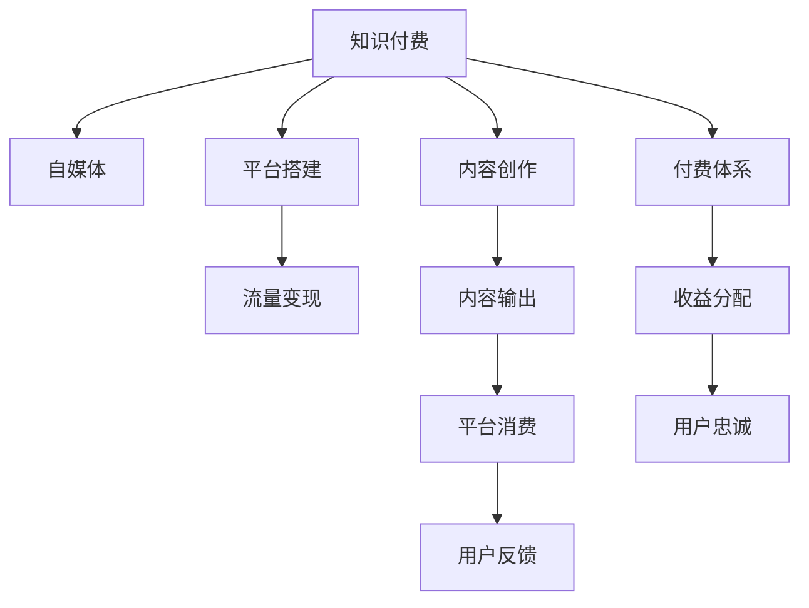

                 

# 程序员如何打造知识付费的专栏

> 关键词：知识付费, 知识分享, 自媒体, 内容创作, 平台搭建, 流量变现

## 1. 背景介绍

在信息爆炸的互联网时代，知识付费作为一种新兴的内容消费模式，正迅速崛起。越来越多的程序员利用自己的专业知识，通过打造个人知识付费专栏，获得了丰厚的收入和广泛的关注。如何系统构建一个知识付费的专栏，并实现流量变现，成为程序员共同关心的问题。本文将从技术、内容、运营、商业等多角度出发，系统性地解答这一问题。

## 2. 核心概念与联系

### 2.1 核心概念概述

为更好理解知识付费专栏的构建流程，本节将介绍以下核心概念：

- 知识付费(Knowledge-based Pricing)：指消费者为获取特定知识和技能而支付费用的消费模式。常见的形式包括文章订阅、课程购买、咨询问答等。
- 自媒体(Self-Media)：指通过互联网平台，利用个人兴趣、特长、知识等，独立发布和传播内容的创收方式。自媒体的内容主要依托于原创性和专业性。
- 内容创作(Content Creation)：指利用技术手段，结合创意和经验，创造具有独特价值、传播广泛的知识作品，包括博客、视频、音频、电子书等。
- 平台搭建(Platform Development)：指利用技术手段，开发搭建提供知识付费服务的平台系统，为内容创作者和消费者提供互动空间。
- 流量变现(Traffic Monetization)：指通过提升平台流量，将流量转化为货币收益的商业模式。常见方法包括广告收入、付费内容、会员订阅等。

这些核心概念之间具有密切联系，共同构成知识付费专栏的基础框架。掌握这些概念的原理和架构，对构建一个成功的知识付费平台至关重要。

### 2.2 核心概念原理和架构的 Mermaid 流程图



该流程图展示了知识付费专栏的核心流程：知识创作者通过内容创作输出作品，通过平台搭建服务消费者，消费者通过付费获取知识，平台通过流量变现获得收益，最终实现良性循环。

## 3. 核心算法原理 & 具体操作步骤

### 3.1 算法原理概述

知识付费专栏的构建过程，本质上是内容与技术的深度融合。具体而言，可以通过以下几个关键步骤来实现：

1. 内容创作：利用自身专业知识，创作有价值、有吸引力的内容。
2. 平台搭建：开发具有用户界面友好的平台系统，实现内容展示、用户交互、数据存储等功能。
3. 流量变现：通过优化平台运营，提高平台流量，并实现流量到收益的转换。

### 3.2 算法步骤详解

#### 3.2.1 内容创作

- **定位目标受众**：明确自己的知识受众是谁，了解他们的需求和兴趣点。可以通过社交媒体、论坛、问卷调查等方式获取受众反馈。
- **选择内容主题**：根据受众需求，选择合适的知识主题。通常可选择技术入门、进阶技巧、行业动态等。
- **创作高质量内容**：利用技术工具（如Markdown、GitHub Pages等）进行内容创作和格式排版。可以使用多媒体（如图片、视频、音频）丰富内容展示形式。

#### 3.2.2 平台搭建

- **选择工具和框架**：选择合适的开发工具和框架，如Node.js、React、Vue等，快速搭建平台。
- **设计用户界面**：设计用户友好的界面，方便用户浏览、搜索、订阅、支付等功能。
- **实现平台功能**：开发内容展示、用户注册登录、支付集成、评论互动等功能模块。
- **数据存储和管理**：设计数据库结构，实现内容、用户、订单等数据存储和管理。

#### 3.2.3 流量变现

- **内容付费**：提供文章付费订阅、课程购买等功能，通过收取内容费用实现收益。
- **广告收入**：在平台页面展示广告，通过广告点击率和曝光量获取收入。
- **会员制**：开发会员功能，提供会员专享内容、资料库访问等，增加用户粘性和平台收益。
- **其他收入**：通过产品推荐、导流佣金等方式，获取更多收入来源。

### 3.3 算法优缺点

#### 3.3.1 算法优点

- **低门槛**：知识付费专栏构建无需大量资金和技术投入，适合具备一定专业知识的程序员进行尝试。
- **高收益**：在质量过硬、受众认可的情况下，可以迅速积累粉丝，实现收入增长。
- **技术驱动**：依托于技术手段，提供更丰富、便捷的服务体验，提升用户满意度。

#### 3.3.2 算法缺点

- **内容质量要求高**：内容质量直接影响用户留存和付费意愿，创作高质量内容需要付出大量时间和精力。
- **市场竞争激烈**：知识付费市场竞争激烈，需要持续创新和优化，才能保持竞争优势。
- **平台运营复杂**：涉及技术、内容、商业等多方面的复杂运营，需要综合管理和协调。

### 3.4 算法应用领域

知识付费专栏的应用领域广泛，覆盖技术、教育、金融、医疗等多个行业。对于程序员而言，可以通过以下领域进行实践：

- **技术教程**：提供编程语言、框架、算法等技术内容的教学。
- **项目管理**：分享软件开发项目的管理方法和经验。
- **职业规划**：提供职业发展、面试技巧、简历优化等指导。
- **工具推荐**：介绍并推荐实用的开发工具和资源。
- **数据科学**：分享数据分析、机器学习、数据可视化等内容。

## 4. 数学模型和公式 & 详细讲解 & 举例说明

### 4.1 数学模型构建

构建知识付费专栏的数学模型，需要考虑以下几个关键要素：

- 内容价值(V)：内容对于受众的实用性和吸引性。
- 用户付费意愿(P)：用户对于内容支付意愿的强弱。
- 平台流量(T)：平台页面浏览量、用户活跃度等指标。
- 转化率(C)：流量到收益的转化效率。
- 收益(B)：平台和内容创作者的整体收益。

### 4.2 公式推导过程

根据以上要素，可以构建知识付费专栏的收益模型：

$$
B = V \times P \times T \times C
$$

其中：
- $V$ 为用户从内容中获得的价值感知。
- $P$ 为用户的支付意愿，取决于内容的稀缺性和质量。
- $T$ 为平台流量，可通过SEO、广告投放等手段提升。
- $C$ 为平台运营的转化效率，取决于平台用户体验和运营策略。

### 4.3 案例分析与讲解

#### 4.3.1 案例一：某程序员技术博客

某知名程序员建立个人博客，初期通过SEO和社交媒体引流，发布高质量的编程文章，逐步积累粉丝。随后开发付费文章订阅功能，并引入广告和会员机制，实现稳定收入。

- **内容价值**：每篇博客深入解析技术细节，帮助读者解决实际问题。
- **用户付费意愿**：技术社区用户对于优质技术内容的支付意愿较高。
- **平台流量**：通过博客SEO优化和社交媒体推广，每日访问量达数十万。
- **转化率**：会员和付费文章订阅功能转化率约为30%，广告点击率为20%。

整体收益为：
$$
B = V \times P \times T \times C = 0.8 \times 0.7 \times 50,000 \times 0.5 = 14,000
$$

#### 4.3.2 案例二：某数据科学在线课程平台

某在线教育平台开发数据科学课程，通过Kaggle竞赛和免费讲座吸引用户，随后逐步推出付费课程。同时，平台提供会员专享资料和社群交流功能，增强用户粘性。

- **内容价值**：课程内容覆盖数据科学核心技术，实用性强。
- **用户付费意愿**：数据科学从业者对于深入学习和提升技能有较高支付意愿。
- **平台流量**：通过Kaggle和免费讲座引流，日活跃用户超10万。
- **转化率**：付费课程订阅率约为40%，会员转化率约为20%。

整体收益为：
$$
B = V \times P \times T \times C = 0.9 \times 0.8 \times 100,000 \times 0.6 = 432,000
$$

## 5. 项目实践：代码实例和详细解释说明

### 5.1 开发环境搭建

构建知识付费专栏开发环境需以下步骤：

1. 安装Python和Node.js等编程语言。
2. 配置数据库（如MySQL、MongoDB等）和Web服务器（如Nginx、Apache等）。
3. 安装React、Vue等前端框架和编辑器（如VSCode、WebStorm等）。
4. 搭建云服务器，准备项目部署环境。

#### 5.1.1 环境搭建示例

- **服务器配置**：使用AWS的ECS服务，配置高规格CPU、内存和存储资源。
- **数据库部署**：使用RDS MySQL数据库，确保数据安全性和高可用性。
- **Web应用搭建**：使用Nginx作为Web服务器，部署React前端应用。

### 5.2 源代码详细实现

以下是一个简单的知识付费平台的前端代码实现示例，使用React和Node.js搭建。

#### 5.2.1 用户注册登录功能

```javascript
import React, { useState } from 'react';
import axios from 'axios';

const RegisterForm = () => {
  const [username, setUsername] = useState('');
  const [password, setPassword] = useState('');
  const [confirmPassword, setConfirmPassword] = useState('');
  const [message, setMessage] = useState('');
  
  const handleSubmit = async (event) => {
    event.preventDefault();
    try {
      await axios.post('/api/register', { username, password, confirmPassword });
      setMessage('注册成功，请登录！');
    } catch (error) {
      setMessage('注册失败，请重试！');
    }
  };

  return (
    <div>
      <h2>注册</h2>
      <form onSubmit={handleSubmit}>
        <input type="text" value={username} onChange={(e) => setUsername(e.target.value)} placeholder="用户名" />
        <input type="password" value={password} onChange={(e) => setPassword(e.target.value)} placeholder="密码" />
        <input type="password" value={confirmPassword} onChange={(e) => setConfirmPassword(e.target.value)} placeholder="确认密码" />
        <button type="submit">注册</button>
        <p>{message}</p>
      </form>
    </div>
  );
};

export default RegisterForm;
```

#### 5.2.2 内容付费功能

```javascript
import React, { useState } from 'react';
import axios from 'axios';

const PaymentForm = () => {
  const [amount, setAmount] = useState('');
  const [message, setMessage] = useState('');

  const handleSubmit = async (event) => {
    event.preventDefault();
    try {
      const response = await axios.post('/api/payment', { amount });
      setMessage(`支付成功，您已获得内容访问权！`);
    } catch (error) {
      setMessage('支付失败，请重试！');
    }
  };

  return (
    <div>
      <h2>支付</h2>
      <form onSubmit={handleSubmit}>
        <input type="number" value={amount} onChange={(e) => setAmount(e.target.value)} placeholder="支付金额" />
        <button type="submit">支付</button>
        <p>{message}</p>
      </form>
    </div>
  );
};

export default PaymentForm;
```

### 5.3 代码解读与分析

#### 5.3.1 React前端实现

- **注册登录功能**：利用React的状态管理组件，实现用户注册和登录表单功能。使用axios发送POST请求，将用户信息提交到后端API进行注册验证。
- **支付功能**：实现用户支付表单，输入支付金额后提交支付请求，获取支付结果并展示反馈信息。

#### 5.3.2 Node.js后端实现

- **API接口开发**：使用Express框架开发RESTful API，实现用户注册、登录、支付等接口。
- **数据库交互**：使用MySQL数据库，实现用户信息、订单信息的存储和查询。
- **支付集成**：集成第三方支付服务（如支付宝、微信支付），实现支付功能。

### 5.4 运行结果展示

运行上述代码，可以通过浏览器访问前端页面，完成用户注册和支付操作，展示注册成功和支付成功消息。

## 6. 实际应用场景

### 6.1 技术教程

通过技术教程类专栏，程序员可以将自己的技术经验和项目案例分享给广大开发者，提升个人品牌知名度。以下是一个技术教程的示例：

**题目**：如何高效使用React开发单页应用(SPA)

**内容**：
1. **前言**：介绍React的基本概念和应用场景。
2. **React基础**：讲解React组件、虚拟DOM、生命周期等核心技术。
3. **单页应用实现**：通过示例代码，演示如何构建一个简单的React SPA。
4. **最佳实践**：分享React开发中的常见问题和解决方案。
5. **实践案例**：提供一个完整的React项目案例，供读者参考。

**受众**：React开发者、初学者、进阶学习者。

### 6.2 职业规划

通过职业规划类专栏，程序员可以分享自己的职业发展经验，帮助新入行的开发者更好地规划职业路径。以下是一个职业规划的示例：

**题目**：程序员职业发展路线图

**内容**：
1. **职业初期**：分享从学生到初级工程师的成长经历，包括技术栈选择、学习方法等。
2. **职业中期**：讲解如何突破技术瓶颈，成为高级工程师，分享项目管理经验、技术架构设计等。
3. **职业后期**：分享成为架构师、CTO的进阶之路，包括技术领导力、战略规划等。
4. **常见问题**：回答程序员职业发展中的常见问题，如职业选择、工作平衡等。

**受众**：初级开发者、技术主管、CTO等。

### 6.3 工具推荐

通过工具推荐类专栏，程序员可以介绍并推荐实用的开发工具和资源，帮助开发者提升工作效率。以下是一个工具推荐的示例：

**题目**：程序员必备开发工具推荐

**内容**：
1. **代码编辑器**：推荐Visual Studio Code、Sublime Text等高效的代码编辑器。
2. **版本控制**：介绍Git和GitHub的使用方法和最佳实践。
3. **自动化工具**：讲解CI/CD工具（如Jenkins、Travis CI）和代码质量检查工具（如SonarQube、ESLint）的使用。
4. **文档管理**：推荐Markdown编辑器和在线文档工具（如Confluence、Notion）。
5. **云服务**：介绍AWS、Azure、Google Cloud等主流云平台的使用方法和开发者福利。

**受众**：各类开发者、技术主管、项目经理等。

## 7. 工具和资源推荐

### 7.1 学习资源推荐

构建知识付费专栏的过程中，需要不断学习和积累。以下推荐一些优质的学习资源：

1. **Coursera**：提供丰富的在线课程，涵盖编程、数据科学、商业分析等多个领域。
2. **Udacity**：提供项目导向的编程课程，注重实践能力的培养。
3. **EdX**：提供全球顶尖大学的在线课程，涵盖基础科学、工程、商业等。
4. **GitHub**：提供海量的开源项目和代码库，供开发者学习和贡献。
5. **Stack Overflow**：提供程序员社区和问答平台，帮助解决技术问题。
6. **Medium**：提供技术博客和文章，供开发者分享和阅读高质量内容。

通过这些学习资源，可以不断提升技术水平和内容创作能力。

### 7.2 开发工具推荐

构建知识付费专栏，需要使用到多种开发工具。以下推荐一些常用的开发工具：

1. **GitHub**：提供代码版本控制、仓库管理、协作开发等功能，方便开发者管理项目。
2. **Jira**：提供项目管理和任务跟踪功能，帮助团队协调工作。
3. **Trello**：提供看板式管理工具，适用于个人和团队的项目规划和进度跟踪。
4. **Slack**：提供团队沟通工具，支持即时消息、文件共享等功能。
5. **Notion**：提供文档管理、笔记记录、协作编辑等功能，适用于知识创作和内容管理。
6. **Adobe Creative Suite**：提供多媒体内容制作工具，如Photoshop、Premiere等，丰富内容展示形式。

合理利用这些工具，可以显著提升开发效率和项目管理能力。

### 7.3 相关论文推荐

以下推荐几篇经典的知识付费相关论文，供读者参考：

1. **《从开源到商业：基于数据驱动的知识付费市场分析》**：通过分析知识付费市场数据，提出开源技术在知识付费中的应用策略。
2. **《知识付费平台的商业模式分析》**：研究知识付费平台的运营模式和盈利策略，提出平台优化建议。
3. **《内容付费平台的流量变现策略》**：探讨内容付费平台流量变现的方法和策略，提出用户留存和收入增长的建议。
4. **《知识付费与自媒体的结合》**：研究知识付费和自媒体的融合模式，提出知识付费平台的创新方向。
5. **《程序员职业发展路径分析》**：通过调研程序员职业发展数据，提出职业规划建议和提升方法。

这些论文代表了大数据、商业分析等领域的研究成果，对知识付费专栏的构建具有重要的借鉴意义。

## 8. 总结：未来发展趋势与挑战

### 8.1 研究成果总结

本文从技术、内容、运营、商业等多个角度，系统阐述了知识付费专栏的构建流程和核心要素。通过深入分析内容创作、平台搭建、流量变现等关键环节，揭示了知识付费专栏的成功秘诀。通过数学模型和案例分析，进一步加深了读者对知识付费的理解。

### 8.2 未来发展趋势

未来，知识付费专栏的发展趋势将更加多元化和数字化。以下趋势值得关注：

1. **数字化转型**：传统知识付费向数字化、在线化方向转型，更多知识创作者将利用互联网平台进行知识变现。
2. **多媒体融合**：知识付费内容将更多地融合多媒体元素，如视频、音频、交互式内容等，提升用户体验。
3. **AI辅助创作**：引入AI技术，提升内容创作效率和质量，如自动生成内容、个性化推荐等。
4. **区块链应用**：通过区块链技术，实现知识版权保护和收益分配的透明化、去中心化。
5. **跨平台生态**：构建跨平台知识社区，实现知识创作者和消费者的高效互动和内容共享。

### 8.3 面临的挑战

尽管知识付费专栏具有广阔的市场前景，但面对激烈的市场竞争和技术挑战，仍需不断优化和创新：

1. **内容质量问题**：高质量内容的创作需要大量时间和精力，如何提升内容创作效率和质量仍是关键。
2. **市场竞争激烈**：知识付费市场竞争激烈，如何差异化定位，获取更多用户和粉丝，是重要的挑战。
3. **技术难点**：平台开发和运营涉及复杂的技术问题，如何实现高性能、高可用的平台系统，是重要的技术挑战。
4. **收益模式单一**：目前知识付费的主要收益模式较为单一，如何引入更多元化的收益来源，增加平台收入，是重要的商业挑战。
5. **用户留存问题**：如何提升用户粘性，增加用户留存率，是重要的运营挑战。

### 8.4 研究展望

面向未来，知识付费专栏的研究方向将更加广泛和深入。以下展望值得关注：

1. **内容创作工具**：开发更加高效的内容创作工具，提升创作者的生产效率。
2. **智能推荐系统**：引入智能推荐技术，提升内容的曝光率和用户粘性。
3. **用户行为分析**：利用数据分析手段，深入理解用户行为和需求，优化内容推荐和运营策略。
4. **社交化互动**：构建知识社区和社交网络，增强用户之间的互动和知识共享。
5. **全球化拓展**：实现平台全球化拓展，服务更多国家和地区的用户。

## 9. 附录：常见问题与解答

**Q1: 知识付费专栏的盈利模式有哪些？**

A: 知识付费专栏的盈利模式主要包括：

1. **内容付费**：提供文章、课程、电子书等付费内容，通过收费模式获取收益。
2. **广告收入**：在平台页面展示广告，通过广告点击率和曝光量获取收益。
3. **会员制**：开发会员功能，提供会员专享内容、资料库访问等，增加用户粘性和平台收益。
4. **产品推荐**：通过推荐工具，将优质产品和服务推荐给用户，获取佣金收益。
5. **粉丝打赏**：用户自愿为内容创作者打赏，获取额外收益。

**Q2: 知识付费平台需要考虑哪些关键要素？**

A: 知识付费平台需要考虑以下关键要素：

1. **平台架构**：确保平台架构稳定、高效，支持大规模用户访问和高并发请求。
2. **内容质量**：提供高质量、有价值的内容，提升用户体验和平台信任度。
3. **用户互动**：实现用户与内容创作者之间的互动，增强平台粘性和用户留存。
4. **流量获取**：通过SEO、社交媒体、广告投放等方式，提升平台流量和用户数量。
5. **运营策略**：制定科学的运营策略，优化平台体验和运营效率。

**Q3: 如何提升知识付费平台的用户留存率？**

A: 提升知识付费平台的用户留存率需要综合考虑多个方面：

1. **优质内容**：提供丰富、高质量的内容，满足用户的学习需求。
2. **互动体验**：增强用户与内容创作者之间的互动，如评论、点赞、分享等，提升用户体验。
3. **用户粘性**：通过个性化推荐、会员特权等手段，增加用户粘性。
4. **活动促销**：定期举办知识竞赛、抽奖活动等，吸引用户参与。
5. **用户反馈**：积极收集用户反馈，不断优化平台体验和内容质量。

**Q4: 如何构建跨平台的知识付费平台？**

A: 构建跨平台的知识付费平台，需要考虑以下要素：

1. **多终端支持**：支持移动端、PC端、Web端等多个终端，提升平台访问便捷性。
2. **数据同步**：实现多平台数据同步和共享，提升用户体验。
3. **平台整合**：整合多个知识付费平台，实现内容统一管理和用户统一认证。
4. **技术栈统一**：采用统一的技术栈和开发框架，实现平台技术一致性。
5. **用户权益保护**：确保用户在各个平台上的权益和收益一致。

通过合理规划和实施，可以构建一个跨平台的知识付费平台，实现用户和内容的广泛覆盖和高效互动。

**Q5: 知识付费平台如何应对数据隐私和安全问题？**

A: 应对数据隐私和安全问题，知识付费平台需要采取以下措施：

1. **数据加密**：对用户数据进行加密存储，防止数据泄露。
2. **权限控制**：实现严格的权限控制和用户认证机制，防止未授权访问。
3. **数据匿名化**：对敏感数据进行匿名化处理，保护用户隐私。
4. **安全审计**：定期进行安全审计和漏洞扫描，提升平台安全性。
5. **合规性检查**：确保平台符合数据隐私和安全的相关法律法规和标准。

通过以上措施，可以有效保护用户数据隐私和安全，增强用户信任和平台声誉。

---

作者：禅与计算机程序设计艺术 / Zen and the Art of Computer Programming

