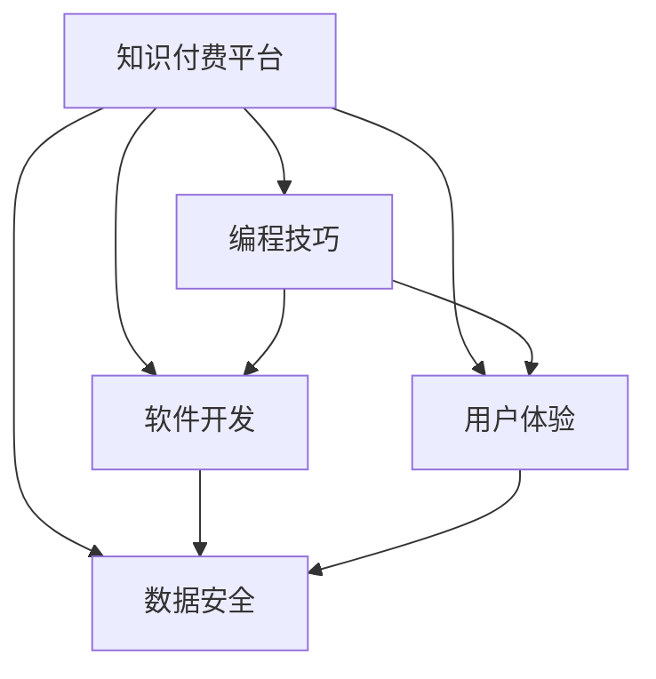

                 

# 程序员如何打造知识付费的会员制度

> 关键词：知识付费,会员制度,编程技巧,软件开发,用户体验,数据安全

## 1. 背景介绍

随着互联网技术的飞速发展和用户需求的多样化，知识付费模式已成为一种趋势，尤其在程序员社区中尤为显著。技术日新月异，编程语言和开发工具不断更新，程序员需要不断学习新的技能和知识来保持竞争力。然而，在线课程和书籍的价格昂贵，且内容良莠不齐，往往难以满足所有需求。因此，一种更为个性化、精准的付费模式——会员制度应运而生，旨在提供量身定制的知识服务。

## 2. 核心概念与联系

### 2.1 核心概念概述

为了深入了解知识付费会员制度的设计和实现，本节将介绍几个核心概念及其相互关系：

- **知识付费**：指通过在线平台提供付费课程、电子书、视频讲座等知识内容，用户根据自身需求选择购买的一种付费模式。其目标是知识的价值被市场认可和货币化，使知识创作者获得收益，同时促进知识的传播和利用。

- **会员制度**：指用户通过付费获得一定期限内的特殊权益，如免费课程、优先更新、专属社群等，以降低获取知识成本的一种制度安排。会员制度通过提供有价值的服务吸引用户，并增加平台黏性。

- **编程技巧**：指程序员在实际开发中使用的技巧和方法，涉及算法设计、代码优化、测试策略等。通过掌握高效实用的编程技巧，可以提高工作效率和代码质量，助力职业成长。

- **软件开发**：包括软件开发的全生命周期，从需求分析、设计、实现到测试、部署、维护等各个环节。优秀的软件开发实践能够提升产品质量，降低开发成本，增强用户体验。

- **用户体验**：指用户在使用产品或服务时的主观感受，包括界面设计、交互流畅性、功能易用性等。良好的用户体验能显著提升用户满意度和忠诚度。

- **数据安全**：涉及用户隐私保护和平台数据安全。在知识付费平台，保护用户数据不被泄露或滥用至关重要，保障用户权益。

### 2.2 核心概念原理和架构的 Mermaid 流程图



上述图表展示了知识付费平台中各个概念之间的逻辑关系。平台提供的编程技巧和软件开发服务通过用户体验得以体现，数据安全贯穿其中，保障用户权益。

## 3. 核心算法原理 & 具体操作步骤

### 3.1 算法原理概述

知识付费会员制度的设计和实现，本质上是一个基于用户需求的个性化推荐和付费机制的构建过程。其核心在于如何将用户的特定需求与最合适的课程内容进行匹配，并通过付费机制激励用户和平台双方参与。

具体而言，知识付费会员制度的设计包括以下步骤：

1. **用户画像构建**：通过分析用户的行为数据、偏好、学习历史等信息，构建用户画像，了解用户需求。
2. **课程推荐算法**：根据用户画像，推荐最适合的课程内容，并设计付费策略，如按月付费、按需购买等。
3. **会员权益设计**：定义会员的专属权益，如免费课程、优先更新、专属社群等，提升用户粘性。
4. **支付与结算**：搭建安全可靠的支付和结算系统，确保用户和平台双方权益。
5. **数据分析与优化**：利用数据分析技术持续优化推荐算法和会员权益设计，提升用户体验。

### 3.2 算法步骤详解

#### 3.2.1 用户画像构建

用户画像的构建基于用户行为数据的分析，主要包括：

1. **行为数据收集**：通过平台记录的用户点击、浏览、购买行为，获取用户兴趣和偏好。
2. **数据预处理**：清洗数据，去除噪声和冗余信息，提取关键特征。
3. **模型训练**：使用机器学习算法，如聚类、分类等，训练用户画像模型。

#### 3.2.2 课程推荐算法

课程推荐算法的设计应兼顾个性化和多样性，主要包括以下步骤：

1. **内容标注**：对课程内容进行标注，提取关键词、标签等特征。
2. **相似度计算**：计算用户画像与课程内容之间的相似度，如使用余弦相似度、Jaccard相似度等。
3. **推荐排序**：基于相似度计算结果，对课程进行排序，推荐给用户。

#### 3.2.3 会员权益设计

会员权益设计应突出个性化和差异化，主要包括以下内容：

1. **免费课程**：根据用户需求，提供部分课程的免费访问权限。
2. **优先更新**：会员第一时间获取课程更新内容。
3. **专属社群**：创建专属会员社群，提供交流互动平台。
4. **专属资源**：提供专属学习资源、资料库等。

#### 3.2.4 支付与结算

支付与结算系统的设计应确保安全性、便捷性和透明性，主要包括以下步骤：

1. **支付网关集成**：与第三方支付平台对接，提供多种支付方式。
2. **订单管理**：记录用户订单信息，确保交易记录的完整性和准确性。
3. **支付回调**：支付完成后，向平台发送交易成功信息，更新用户和课程状态。

#### 3.2.5 数据分析与优化

数据分析与优化是持续改进会员制度的关键，主要包括以下步骤：

1. **数据采集**：收集用户在平台上的各项数据，如学习行为、支付记录等。
2. **分析建模**：利用数据分析工具，对用户行为和课程效果进行分析建模。
3. **模型迭代**：根据分析结果，优化推荐算法和会员权益设计。

### 3.3 算法优缺点

知识付费会员制度的设计和实现，具有以下优点：

1. **个性化推荐**：通过用户画像和推荐算法，为用户提供最适合的课程，满足其个性化需求。
2. **提升用户粘性**：通过专属权益，增强用户对平台的黏性，提高用户留存率。
3. **透明付费**：清晰的价格体系和透明的交易记录，提升用户信任度。

但同时，该制度也存在以下缺点：

1. **数据隐私问题**：大量用户数据需要收集和分析，存在隐私泄露风险。
2. **推荐算法复杂**：个性化推荐算法需要复杂的计算和建模，存在算法复杂度高的问题。
3. **运营成本高**：需要投入大量资源进行数据收集、分析、模型优化等工作。

### 3.4 算法应用领域

知识付费会员制度在多个领域有广泛应用，包括但不限于：

1. **技术培训**：如编程技巧、软件开发等课程，提供有针对性的培训。
2. **企业管理**：提供企业内训课程，帮助员工提升技能。
3. **职业技能**：如设计、营销、人力资源管理等，提升职业技能。
4. **职业规划**：提供职业发展课程，帮助用户规划职业生涯。

## 4. 数学模型和公式 & 详细讲解 & 举例说明

### 4.1 数学模型构建

知识付费会员制度的设计和实现，可以通过以下数学模型进行建模：

$$
R = \max \limits_{i} \left[ \sum \limits_{j=1}^{N} \alpha_j C_j(i) \right] \text{ subject to } P_i \leq P_{\text{max}}
$$

其中，$R$为会员的推荐课程集合，$C_j$为课程集，$\alpha_j$为用户对课程$j$的偏好权重，$P_i$为会员$i$的付费预算，$P_{\text{max}}$为会员最大付费预算。

### 4.2 公式推导过程

上述模型的推导过程主要包括以下步骤：

1. **定义约束条件**：定义会员预算约束$P_i \leq P_{\text{max}}$，即会员最多只能购买不超过最大预算的课程。
2. **定义优化目标**：最大化会员的课程价值$R$，其中课程价值$C_j(i)$为用户$i$对课程$j$的评分，$\alpha_j$为用户对课程的权重，反映其偏好。
3. **求解优化问题**：通过求解线性规划问题，找到最优的课程组合$R$。

### 4.3 案例分析与讲解

假设某技术培训平台上有两门课程$A$和$B$，用户$i$的预算为$P_i=100$。课程$A$的评分$C_A(i)=80$，课程$B$的评分$C_B(i)=90$，用户对课程$A$的偏好权重$\alpha_A=0.8$，对课程$B$的偏好权重$\alpha_B=0.2$。

通过上述模型，计算得到推荐课程$R=\{B\}$，即用户$i$应选择课程$B$。该推荐结果满足预算约束，且最大化课程价值。

## 5. 项目实践：代码实例和详细解释说明

### 5.1 开发环境搭建

开发环境搭建包括以下步骤：

1. **服务器配置**：选择高性能服务器，安装必要的软件，如Python、MySQL等。
2. **数据库搭建**：创建用户和课程数据库，定义表结构。
3. **开发工具安装**：安装IDE、版本控制系统（如Git）等开发工具。

### 5.2 源代码详细实现

以下是一个简单的知识付费会员制度系统架构，展示了主要模块和组件：

```
+---------------------------------+
|      用户画像构建模块         |
+---------------------------------+
        ↓
+---------------------------------+
|      课程推荐算法模块           |
+---------------------------------+
        ↓
+---------------------------------+
|    会员权益设计模块             |
+---------------------------------+
        ↓
+---------------------------------+
|        支付与结算模块           |
+---------------------------------+
        ↓
+---------------------------------+
|   数据分析与优化模块            |
+---------------------------------+
        ↓
+---------------------------------+
|        用户界面模块             |
+---------------------------------+
```

用户画像构建模块：
- 收集用户行为数据，进行预处理和特征提取。
- 使用机器学习算法训练用户画像模型。

课程推荐算法模块：
- 对课程内容进行标注，提取关键词、标签等特征。
- 计算用户画像与课程内容之间的相似度。
- 根据相似度计算结果，推荐课程给用户。

会员权益设计模块：
- 根据用户需求，定义免费课程、优先更新等权益。
- 创建专属社群，提供交流互动平台。

支付与结算模块：
- 与第三方支付平台对接，提供多种支付方式。
- 记录用户订单信息，确保交易记录的完整性和准确性。

数据分析与优化模块：
- 收集用户在平台上的各项数据，如学习行为、支付记录等。
- 利用数据分析工具，对用户行为和课程效果进行分析建模。
- 根据分析结果，优化推荐算法和会员权益设计。

用户界面模块：
- 提供用户登录、浏览课程、购买课程、查看订单等界面。
- 展示推荐课程、专属社群等信息。

### 5.3 代码解读与分析

以下是会员制度系统的主要代码实现，展示了推荐算法和支付结算部分的逻辑：

```python
# 用户画像构建模块
class UserProfile:
    def __init__(self, user_id, behaviors):
        self.user_id = user_id
        self.behaviors = behaviors
        self.profile = self.build_profile()

    def build_profile(self):
        # 数据预处理和特征提取
        # 使用机器学习算法训练用户画像模型
        return profile

# 课程推荐算法模块
class CourseRecommendation:
    def __init__(self, courses, profiles):
        self.courses = courses
        self.profiles = profiles
        self.recommendations = self.recommend()

    def recommend(self):
        # 对课程内容进行标注
        # 计算用户画像与课程内容之间的相似度
        # 根据相似度计算结果，推荐课程给用户
        return recommendations

# 会员权益设计模块
class MembershipBenefits:
    def __init__(self, users, courses):
        self.users = users
        self.courses = courses
        self.benefits = self.design()

    def design(self):
        # 根据用户需求，定义免费课程、优先更新等权益
        # 创建专属社群，提供交流互动平台
        return benefits

# 支付与结算模块
class PaymentSettlement:
    def __init__(self, users, courses, benefits):
        self.users = users
        self.courses = courses
        self.benefits = benefits
        self.settlement = self.settle()

    def settle(self):
        # 与第三方支付平台对接
        # 记录用户订单信息
        # 确保交易记录的完整性和准确性
        return settlement

# 数据分析与优化模块
class DataAnalysis:
    def __init__(self, users, courses, benefits):
        self.users = users
        self.courses = courses
        self.benefits = benefits
        self.analysis = self.analyze()

    def analyze(self):
        # 收集用户在平台上的各项数据
        # 利用数据分析工具，对用户行为和课程效果进行分析建模
        # 根据分析结果，优化推荐算法和会员权益设计
        return analysis

# 用户界面模块
class UserInterface:
    def __init__(self, users, courses, benefits):
        self.users = users
        self.courses = courses
        self.benefits = benefits
        self.show()

    def show(self):
        # 提供用户登录、浏览课程、购买课程、查看订单等界面
        # 展示推荐课程、专属社群等信息
        pass
```

### 5.4 运行结果展示

运行结果展示主要包括以下方面：

1. **推荐课程**：展示根据用户画像和课程推荐算法计算得到的推荐课程列表。
2. **订单记录**：展示用户购买课程的记录，包括课程名称、价格、购买时间等。
3. **分析报告**：展示数据分析结果，如用户学习行为、课程效果等。

## 6. 实际应用场景

### 6.1 技术培训平台

知识付费会员制度在技术培训平台中应用广泛。用户可以通过会员制度获取免费课程、优先更新等权益，大幅降低学习成本。平台根据用户行为数据和偏好，推荐最适合的课程，提升学习效率。

### 6.2 企业内训系统

企业内训系统通过知识付费会员制度，提供定制化的培训课程，帮助员工提升技能，促进职业成长。员工可根据自身需求选择付费课程，平台根据员工表现和反馈，不断优化课程内容和培训方式。

### 6.3 职业规划服务

职业规划服务通过知识付费会员制度，提供职业发展课程，帮助用户规划职业生涯。会员可以享受职业咨询、简历优化、面试培训等服务，获得全方位的职业指导。

### 6.4 未来应用展望

未来，知识付费会员制度将在更多领域得到应用，为技术教育和职业发展提供有力支持。随着人工智能和机器学习技术的不断进步，会员制度将变得更加智能化和个性化，更好地满足用户需求。

## 7. 工具和资源推荐

### 7.1 学习资源推荐

为了帮助开发者深入掌握知识付费会员制度的设计和实现，推荐以下学习资源：

1. **《用户画像设计与构建》**：详细讲解用户画像构建的方法和工具，帮助开发者理解用户行为数据。
2. **《推荐系统实战》**：介绍推荐算法的设计和实现，帮助开发者构建个性化推荐系统。
3. **《深度学习在知识付费中的应用》**：讲解深度学习在知识付费平台中的应用，如课程推荐、支付结算等。
4. **《数据分析与可视化》**：介绍数据分析和可视化技术，帮助开发者进行数据建模和结果展示。
5. **《人工智能伦理与安全》**：探讨人工智能伦理和安全问题，帮助开发者在设计中考虑数据隐私和用户权益。

### 7.2 开发工具推荐

为了提高知识付费会员制度开发效率，推荐以下开发工具：

1. **Python**：简单易用的编程语言，广泛应用于数据分析、机器学习等领域。
2. **MySQL**：流行的关系型数据库，适用于存储和管理用户数据。
3. **Git**：版本控制系统，支持代码管理和协作。
4. **Jupyter Notebook**：交互式开发环境，支持代码编写和数据展示。
5. **TensorFlow**：深度学习框架，适用于复杂算法和模型训练。

### 7.3 相关论文推荐

知识付费会员制度的研究涉及多个学科，以下是几篇相关论文，推荐阅读：

1. **《知识付费平台的个性化推荐算法》**：介绍个性化推荐算法的设计和应用，提升用户体验。
2. **《会员制度在在线教育中的应用研究》**：探讨会员制度在在线教育中的设计和实施，帮助企业提升培训效果。
3. **《基于用户行为数据的课程推荐模型》**：利用用户行为数据构建推荐模型，提升课程推荐准确度。
4. **《知识付费平台的数据安全与隐私保护》**：探讨知识付费平台的数据安全与隐私保护问题，保障用户权益。

## 8. 总结：未来发展趋势与挑战

### 8.1 总结

本文对知识付费会员制度的设计和实现进行了系统介绍，主要包括以下内容：

1. **核心概念**：知识付费、会员制度、编程技巧、软件开发、用户体验、数据安全。
2. **算法原理**：用户画像构建、课程推荐算法、会员权益设计、支付与结算、数据分析与优化。
3. **操作步骤**：数据收集、模型训练、算法实现、界面展示、测试优化。
4. **实际应用**：技术培训平台、企业内训系统、职业规划服务。
5. **工具资源**：学习资源、开发工具、相关论文。

通过本文的系统梳理，可以看到，知识付费会员制度的设计和实现是一个复杂的过程，涉及多个领域的知识和技术。开发者需要深入理解用户需求、算法设计和系统优化，才能构建出高效、智能的知识付费平台。

### 8.2 未来发展趋势

知识付费会员制度的发展前景广阔，未来将呈现以下几个趋势：

1. **智能化推荐**：利用人工智能和大数据技术，提供更加精准和个性化的课程推荐。
2. **多模态学习**：结合文本、图像、视频等多种模态数据，提升学习效果。
3. **自适应学习**：根据用户学习进度和表现，动态调整课程难度和推荐策略。
4. **社交互动**：增强学习社群的互动性，提升用户参与度和满意度。
5. **隐私保护**：采用先进的隐私保护技术，确保用户数据的安全性和匿名性。

### 8.3 面临的挑战

尽管知识付费会员制度具有广阔前景，但面临的挑战也不可忽视：

1. **数据隐私保护**：用户数据的收集和分析存在隐私泄露风险，需要制定严格的数据保护政策。
2. **推荐算法复杂性**：个性化推荐算法需要复杂的计算和建模，存在算法复杂度高的问题。
3. **运营成本高**：需要投入大量资源进行数据收集、算法优化和系统维护。
4. **用户体验问题**：复杂的操作流程和界面设计可能影响用户体验，需要持续优化。

### 8.4 研究展望

为了应对上述挑战，未来的研究需要在以下几个方向寻求突破：

1. **隐私保护技术**：开发先进的隐私保护算法，确保用户数据的安全性和匿名性。
2. **推荐算法优化**：研究高效的推荐算法，降低算法复杂度，提高推荐效果。
3. **自动化运营**：采用自动化工具，降低运营成本，提升系统稳定性。
4. **用户体验优化**：优化界面设计，简化操作流程，提升用户体验。

## 9. 附录：常见问题与解答

**Q1：知识付费会员制度的设计和实现中，数据隐私保护如何保障？**

A: 数据隐私保护是知识付费会员制度设计中最重要的考虑因素之一。以下是几种常见的数据保护措施：

1. **数据匿名化**：通过数据脱敏、去标识化等技术，保护用户隐私。
2. **访问控制**：设置严格的访问权限，确保只有授权人员可以访问敏感数据。
3. **加密传输**：采用加密技术，确保数据在传输过程中不被截获和篡改。
4. **合规审查**：定期进行合规审查，确保数据处理符合相关法律法规。

**Q2：如何提高知识付费会员制度中的推荐准确度？**

A: 提高推荐准确度是知识付费会员制度设计的核心目标之一。以下是几种常见的方法：

1. **用户画像构建**：通过分析用户行为数据，构建精细化的用户画像，了解用户需求和偏好。
2. **多维特征融合**：结合用户画像、课程内容、用户评价等多维特征，提高推荐准确度。
3. **在线学习行为分析**：通过分析用户在平台上的学习行为，预测其未来的学习需求，提供个性化的推荐。
4. **模型优化**：采用先进的机器学习算法和模型，如深度神经网络、强化学习等，优化推荐效果。

**Q3：知识付费会员制度中的推荐算法和支付结算系统如何设计？**

A: 推荐算法和支付结算系统是知识付费会员制度中最重要的组成部分。以下是一些设计原则和思路：

1. **推荐算法设计**：采用协同过滤、基于内容的推荐等算法，结合用户画像和课程特征，构建推荐模型。
2. **支付结算系统设计**：选择可靠的第三方支付平台，提供多种支付方式，确保支付过程的便捷性和安全性。
3. **系统安全性**：采用SSL加密、双因素认证等技术，确保系统安全性。
4. **用户体验优化**：简化支付流程，提供友好的用户界面，提升用户体验。

**Q4：如何设计知识付费会员制度中的专属权益？**

A: 专属权益是知识付费会员制度的重要组成部分，以下是几种设计思路：

1. **免费课程**：根据用户需求，提供部分免费课程，吸引用户加入会员。
2. **优先更新**：提供课程优先更新服务，确保会员第一时间获取最新课程内容。
3. **专属社群**：创建专属会员社群，提供交流互动平台，增强用户粘性。
4. **专属资源**：提供专属学习资源、资料库等，提升会员价值。

**Q5：如何优化知识付费会员制度中的数据分析与优化模块？**

A: 数据分析与优化是知识付费会员制度持续改进的关键，以下是几种优化方法：

1. **数据采集**：收集用户在平台上的各项数据，如学习行为、支付记录等，确保数据的全面性和准确性。
2. **模型优化**：利用数据分析工具，对用户行为和课程效果进行分析建模，优化推荐算法和会员权益设计。
3. **自动化监测**：采用自动化工具，实时监测系统运行状态，发现并解决问题。
4. **用户反馈收集**：收集用户反馈，不断改进产品和服务，提升用户体验。

---

作者：禅与计算机程序设计艺术 / Zen and the Art of Computer Programming

