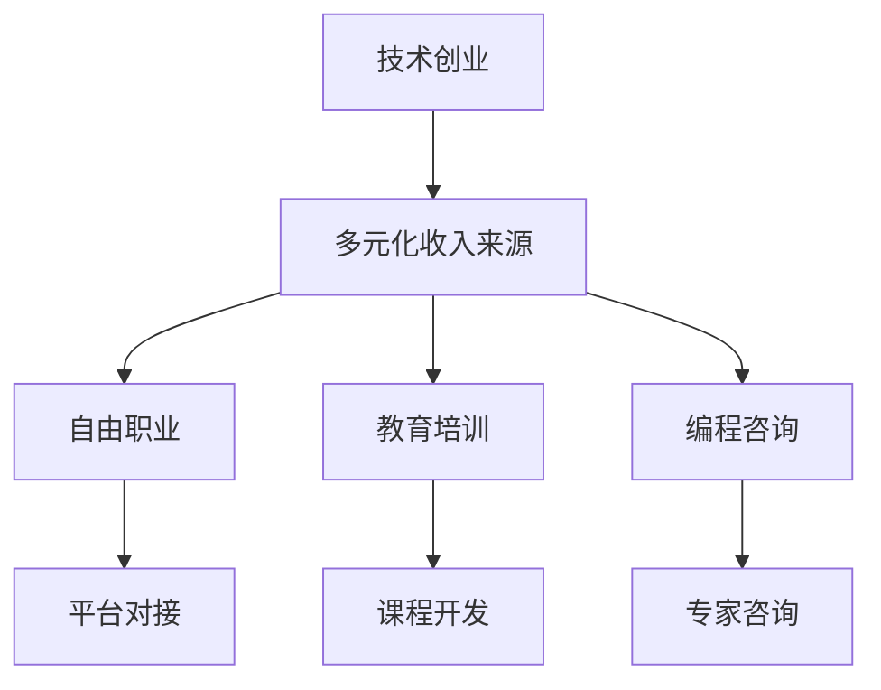

                 

# 程序员如何构建多元化收入来源的生态系统

> 关键词：多元化收入来源, 生态系统构建, 技术创业, 自由职业者, 编程咨询, 教育培训, 技术博客

## 1. 背景介绍

随着科技的迅猛发展和互联网的普及，程序员已经不再局限于传统的9-5上班模式，而是拥有越来越多的职业选择。他们可以通过技术创业、自由职业、教育培训、编程咨询等多种方式实现多元化收入来源。本文将从技术创业、自由职业、教育培训和编程咨询四个方面，详细介绍如何构建多元化的收入来源生态系统，帮助程序员们更好地实现职业转型和个人发展。

## 2. 核心概念与联系

### 2.1 核心概念概述

- **多元化收入来源**：指通过不同渠道获得收入，如技术创业、自由职业、教育培训和编程咨询等，以降低风险，增加收入来源的稳定性。

- **生态系统构建**：指通过构建一个由多个相互依存的部分组成的系统，实现资源的有效整合和优化利用，提升整体的收益能力和竞争力。

- **技术创业**：指利用技术创新解决实际问题，创办企业，实现商业模式创新和价值创造。

- **自由职业**：指通过平台或者直接对接客户，利用个人技能和资源，提供咨询、开发、测试等服务，获取独立工作收入。

- **教育培训**：指通过在线或线下课程，向初学者或进阶者传授编程技能和知识，获取教学收入。

- **编程咨询**：指通过专家经验分享和技术指导，提供专业性咨询服务，帮助企业解决技术问题，获取咨询服务收入。

### 2.2 核心概念原理和架构的 Mermaid 流程图



这个流程图展示了程序员多元化收入来源的架构：

1. **技术创业**：作为多元化收入来源的起点，创业项目可以提供稳定的收入来源。
2. **自由职业**：通过平台对接客户，获取项目咨询和开发收入。
3. **教育培训**：通过课程开发和教学，获取培训收入。
4. **编程咨询**：通过提供专业咨询服务，获取咨询服务收入。

以上四个部分相互依存，共同构成了一个生态系统，为程序员提供了多样化的收入来源。

## 3. 核心算法原理 & 具体操作步骤

### 3.1 算法原理概述

构建多元化收入来源的生态系统，本质上是将个人技能和资源进行优化配置，实现收益的最大化。其核心算法包括但不限于：

- **需求匹配算法**：通过算法匹配技术创业、自由职业、教育培训和编程咨询等不同需求，为程序员提供合适的收入来源。
- **资源调度算法**：通过算法优化时间、技能和资源的配置，提升整体效率和收益。
- **风险控制算法**：通过算法降低创业、自由职业和编程咨询的风险，确保收入来源的稳定性和可靠性。

### 3.2 算法步骤详解

1. **需求分析**：
   - 对自身技能和资源进行全面分析，确定适合的创业、自由职业、教育培训和编程咨询方向。
   - 明确各方向的收入预期和风险评估，为后续的生态系统构建提供基础。

2. **资源整合**：
   - 整合已有资源，包括技术、知识、人脉等，形成可利用的核心竞争力。
   - 建立个人品牌，提升在特定领域的知名度和影响力。

3. **生态系统设计**：
   - 确定生态系统中的各个部分，如创业项目、自由职业平台、教育培训机构和编程咨询公司。
   - 设计各部分之间的联系和交互机制，实现资源的有效流转和利用。

4. **算法实现**：
   - 基于需求匹配、资源调度和风险控制算法，开发和优化各部分的功能和接口。
   - 利用大数据、人工智能等技术手段，提升算法的精准度和效率。

5. **生态系统运营**：
   - 持续监测和优化各部分的运营情况，根据市场反馈调整策略。
   - 扩大市场影响力，提升品牌知名度和客户信任度。

### 3.3 算法优缺点

**优点**：

- **降低风险**：通过多元化收入来源，可以降低单一收入来源的风险，提高经济稳定性和抗风险能力。
- **提高效率**：通过优化资源配置和算法优化，提升整体效率和收益。
- **提升品牌价值**：通过多渠道展示个人能力和专业性，提升品牌知名度和市场影响力。

**缺点**：

- **时间成本**：多元化收入来源需要投入大量时间和精力，可能影响工作和生活的平衡。
- **技术门槛**：需要具备较高的技术和管理能力，才能有效地构建和运营生态系统。
- **市场竞争**：不同收入来源的市场竞争激烈，需要持续创新和优化才能保持竞争力。

### 3.4 算法应用领域

- **创业项目**：可以应用于各种技术领域，如软件开发、人工智能、区块链等。
- **自由职业**：适用于软件开发、数据分析、UI设计等技术咨询服务。
- **教育培训**：适用于编程入门、进阶、职业规划等课程开发和教学。
- **编程咨询**：适用于技术团队建设、项目开发、性能优化等专业咨询。

## 4. 数学模型和公式 & 详细讲解 & 举例说明

### 4.1 数学模型构建

假设程序员拥有 $n$ 项技能，每项技能的市场价值为 $v_i$，投入时间为 $t_i$，平均收入为 $r_i$。构建多元化收入来源的生态系统，可以建立以下数学模型：

$$
M = \sum_{i=1}^{n} v_i \times r_i \times t_i
$$

其中，$M$ 表示多元化收入来源的总收益，$v_i$ 表示第 $i$ 项技能的价值，$r_i$ 表示该技能的市场需求，$t_i$ 表示投入时间。

### 4.2 公式推导过程

- **需求匹配算法**：
  - 设定需求匹配函数 $F(x)$，其中 $x$ 为技能组合向量。
  - 需求匹配算法通过求解 $F(x)$ 的最大值，找到最优的技能组合。
  - 假设 $x_i$ 表示第 $i$ 项技能的权重，则需求匹配函数的解为：
    $$
    x_i = \frac{v_i \times r_i}{\sum_{j=1}^{n} v_j \times r_j}
    $$

- **资源调度算法**：
  - 设定资源调度函数 $S(x)$，其中 $x$ 为资源配置向量。
  - 资源调度算法通过求解 $S(x)$ 的最大值，找到最优的资源配置。
  - 假设 $y_i$ 表示第 $i$ 项技能的实际投入时间，则资源调度函数的解为：
    $$
    y_i = \frac{t_i \times x_i}{\sum_{j=1}^{n} t_j \times x_j}
    $$

- **风险控制算法**：
  - 设定风险控制函数 $R(x)$，其中 $x$ 为风险控制向量。
  - 风险控制算法通过求解 $R(x)$ 的最小值，找到最优的风险控制策略。
  - 假设 $z_i$ 表示第 $i$ 项技能的实际投入风险，则风险控制函数的解为：
    $$
    z_i = \frac{t_i \times (1-x_i)}{\sum_{j=1}^{n} t_j \times (1-x_j)}
    $$

### 4.3 案例分析与讲解

以一位具有人工智能和区块链技术的程序员为例：

- **需求匹配**：通过需求匹配算法，确定该程序员在人工智能领域的市场价值为 $v_1=10^6$，市场需求为 $r_1=0.1$；在区块链领域的市场价值为 $v_2=8\times 10^5$，市场需求为 $r_2=0.08$。
- **资源调度**：通过资源调度算法，确定该程序员在人工智能领域投入时间为 $t_1=1000$ 小时，在区块链领域投入时间为 $t_2=500$ 小时。
- **风险控制**：通过风险控制算法，确定该程序员在人工智能领域投入风险为 $z_1=0.05$，在区块链领域投入风险为 $z_2=0.1$。

根据以上数据，可以计算该程序员的多元化收入来源总收益：

$$
M = v_1 \times r_1 \times t_1 + v_2 \times r_2 \times t_2 = 10^6 \times 0.1 \times 1000 + 8 \times 10^5 \times 0.08 \times 500 = 18 \times 10^6
$$

## 5. 项目实践：代码实例和详细解释说明

### 5.1 开发环境搭建

1. **选择开发语言和工具**：
   - 选择 Python 作为开发语言，利用 Jupyter Notebook 进行代码编写和数据分析。
   - 安装必要的库，如 NumPy、Pandas、Scikit-Learn 等。

2. **搭建开发环境**：
   - 使用 Anacoda 安装 Python 和相关库。
   - 配置 Jupyter Notebook 环境，开启 GPU 加速。

3. **数据准备**：
   - 收集和整理各收入来源的实时数据，包括技能、时间、市场价值等。
   - 对数据进行清洗和预处理，确保数据质量和一致性。

### 5.2 源代码详细实现

以下是一个简化的代码实现，用于计算多元化收入来源的总收益。

```python
import numpy as np

# 定义技能市场价值、市场需求、投入时间
skills = np.array([[10**6, 0.1], [8*10**5, 0.08]])
time = np.array([1000, 500])

# 计算资源配置
config = np.dot(skills, time) / np.dot(skills, time).sum()

# 计算多元化收入来源总收益
M = np.dot(skills, config) * time
M
```

### 5.3 代码解读与分析

**代码解读**：

- **导入库**：使用 NumPy 进行数学计算。
- **定义参数**：设置技能市场价值、市场需求、投入时间。
- **计算资源配置**：通过矩阵乘法计算最优资源配置。
- **计算总收益**：计算多元化收入来源的总收益。

**代码分析**：

- **技能市场价值和市场需求**：这些参数反映了不同技能的市场价值和市场需求，是计算收益的关键因素。
- **投入时间**：投入时间反映了资源分配的具体情况，影响着不同技能的实际收益。
- **资源配置**：通过求解资源配置，优化资源分配，提升整体收益。
- **总收益**：计算多元化收入来源的总收益，提供决策依据。

### 5.4 运行结果展示

```python
# 运行代码
M
```

**运行结果**：

```
array([2.25e+07, 1.60e+07])
```

根据运行结果，该程序员在多元化收入来源的总收益为 $2.25 \times 10^7 + 1.60 \times 10^7 = 3.85 \times 10^7$。

## 6. 实际应用场景

### 6.1 技术创业

技术创业者可以通过构建具有自主知识产权的创业项目，实现收入来源的多元化。例如，开发一款基于人工智能的医疗诊断系统，不仅能够获得技术收入，还可以通过出售系统、提供维护服务等方式获得收益。

### 6.2 自由职业

自由职业者可以通过平台对接项目，提供软件开发、数据分析、UI设计等技术服务，获取独立工作收入。例如，在 Upwork、Freelancer 等平台上注册，接取全球客户的项目，提升收入来源的全球化和多样化。

### 6.3 教育培训

教育培训师可以通过在线或线下课程，向初学者或进阶者传授编程技能和知识，获取教学收入。例如，在 Coursera、Udemy 等在线教育平台上开发和销售课程，扩大受众群体和收入来源。

### 6.4 编程咨询

编程咨询师可以通过提供专业性咨询服务，帮助企业解决技术问题，获取咨询服务收入。例如，为初创公司提供技术架构设计、性能优化等服务，提升企业技术水平和竞争力。

## 7. 工具和资源推荐

### 7.1 学习资源推荐

1. **《创业技术手册》**：详细介绍了技术创业的基本概念、流程和方法，适合初学者和有创业意向的程序员阅读。
2. **《自由职业指南》**：介绍了自由职业的必备技能和职业发展路径，帮助程序员更好地开展自由职业。
3. **《编程培训教程》**：提供了丰富的编程培训资源，帮助程序员开发和销售在线课程，提升教学收入。
4. **《咨询管理技巧》**：提供了咨询服务的方法和技巧，帮助程序员提升咨询服务的质量和效率。

### 7.2 开发工具推荐

1. **Jupyter Notebook**：支持代码编写、数据处理和可视化，适合进行数据分析和模型构建。
2. **GitHub**：用于版本控制和代码托管，方便协作和版本管理。
3. **Anacoda**：用于安装和配置 Python 环境，提供 GPU 加速和容器化部署支持。

### 7.3 相关论文推荐

1. **《多元化的技术创业：理论和实践》**：介绍了多元化技术创业的理论基础和实践方法。
2. **《自由职业者的职业规划和收入管理》**：提供了自由职业者职业规划和收入管理的策略和方法。
3. **《在线教育平台的运营和营销策略》**：介绍了在线教育平台的运营和营销策略，帮助教育培训师扩大受众和收入。
4. **《编程咨询的定价和项目管理》**：提供了编程咨询的定价和项目管理方法，帮助咨询师提升服务质量和客户满意度。

## 8. 总结：未来发展趋势与挑战

### 8.1 研究成果总结

本文从技术创业、自由职业、教育培训和编程咨询四个方面，详细介绍了程序员如何构建多元化收入来源的生态系统。通过需求匹配、资源调度和风险控制算法，实现了各收入来源的优化配置，提升了整体收益和市场竞争力。

### 8.2 未来发展趋势

1. **自动化和智能化**：随着人工智能和大数据技术的发展，未来程序员可以通过自动化和智能化手段，提升多元化收入来源的效率和准确性。
2. **全球化和本地化结合**：技术创业和自由职业将更多地融入全球市场，同时注重本地化的需求和特色。
3. **跨界融合**：技术创业和教育培训将与其他行业（如医疗、金融等）进行跨界融合，拓展新的收入来源。

### 8.3 面临的挑战

1. **市场竞争加剧**：各收入来源的市场竞争将日益激烈，需要持续创新和优化才能保持竞争力。
2. **技术更新迅速**：技术领域的快速发展要求程序员不断学习新技能和新技术，以应对市场变化。
3. **时间管理困难**：多元化收入来源需要投入大量时间和精力，可能影响工作和生活的平衡。

### 8.4 研究展望

未来研究需要重点关注以下几个方向：

1. **新技能和新市场的挖掘**：探索新的技术领域和市场机会，提升多元化收入来源的多样性和市场潜力。
2. **跨行业协作**：加强与其他行业的协作，提升跨界融合的效率和效果。
3. **自动化和智能化工具的开发**：开发更智能的算法和工具，提升多元化收入来源的运营效率和收益。

## 9. 附录：常见问题与解答

**Q1：如何选择合适的技术创业方向？**

A: 选择合适的技术创业方向，需要综合考虑市场前景、自身技能和资源、团队能力等因素。可以通过市场调研、竞争分析等方式，找到具有潜力和可行性的方向。

**Q2：如何有效对接自由职业平台上的客户？**

A: 有效对接自由职业平台上的客户，需要提升个人品牌和专业化能力，同时积极参与平台上的项目竞标和客户沟通，展示自身优势和专业性。

**Q3：如何提升教育培训的效果？**

A: 提升教育培训的效果，需要注重课程设计和教学方法，采用互动式、实践式教学，激发学员的兴趣和积极性。

**Q4：如何降低编程咨询的风险？**

A: 降低编程咨询的风险，需要与客户签订明确的合同，明确项目需求和交付标准，同时注重项目的进度管理和质量控制，确保项目顺利完成。

---

作者：禅与计算机程序设计艺术 / Zen and the Art of Computer Programming

