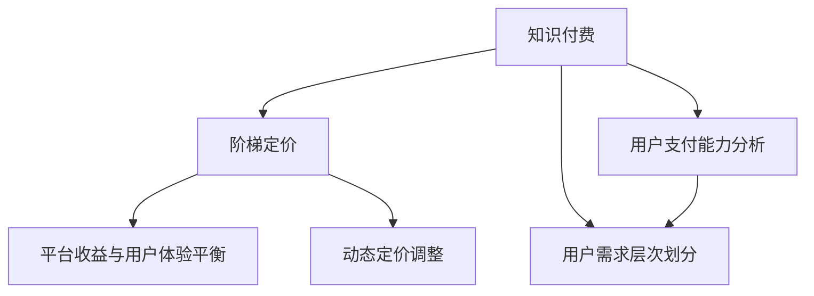

                 

# 程序员如何设计知识付费的阶梯定价策略

> 关键词：知识付费, 定价策略, 数据模型, 阶梯定价, 用户行为分析

## 1. 背景介绍

### 1.1 问题由来
知识付费作为近年来快速崛起的新兴市场，吸引了大量用户和资本的关注。知识付费平台通过提供高质量的课程、文章、咨询等知识内容，满足用户对知识和技能的深层次需求。然而，如何合理定价，既保证内容生产者的收益，又能吸引和保留大量付费用户，成为知识付费平台亟需解决的问题。

阶梯定价策略是一种广泛应用于各种产品和服务定价的策略，通过设置多个不同价格区间的服务或商品，以满足不同用户的支付能力和需求层次，从而实现平台盈利最大化。对于知识付费平台而言，阶梯定价策略能够更好地平衡平台收入、用户支付能力与内容质量，从而实现三者的共赢。

### 1.2 问题核心关键点
制定知识付费的阶梯定价策略，核心关键点包括：
1. **用户支付能力分析**：根据用户群体支付能力，划分不同价格区间，以匹配不同支付能力用户。
2. **用户需求层次划分**：结合用户行为数据，分析用户对知识内容的需求层次，并据此进行分层定价。
3. **平台收益与用户体验平衡**：通过定价策略优化，实现平台收入最大化，同时保证用户获得优质内容，提升用户体验。
4. **动态定价调整**：根据市场反馈和用户行为变化，动态调整定价策略，保证定价策略的有效性。

## 2. 核心概念与联系

### 2.1 核心概念概述

为了更好地理解知识付费的阶梯定价策略，我们需要介绍几个核心概念：

- **知识付费**：指的是通过付费获取知识或技能的学习过程，包括课程、文章、咨询等多种形式的知识服务。知识付费市场依托于优质内容和知识生产者，为知识消费者提供深度、系统的知识解决方案。

- **阶梯定价策略**：一种定价策略，通过设置不同价格区间，匹配不同支付能力用户，从而实现差异化定价，满足用户多样化的支付需求。阶梯定价策略通常基于用户支付能力和需求层次，设置多个价格区间。

- **用户支付能力**：用户基于自身经济状况、职业等因素所能支付的金额。根据用户支付能力划分价格区间，以匹配不同支付能力用户。

- **用户需求层次**：用户对知识内容的需求层次，根据用户行为数据进行分析，例如学习频率、完成度、评价等。

- **平台收益与用户体验平衡**：定价策略需平衡平台收益与用户体验，既保证平台盈利，又提供优质内容，提升用户体验。

- **动态定价调整**：根据市场反馈和用户行为变化，动态调整定价策略，以保持定价策略的有效性。

这些核心概念之间的逻辑关系可以通过以下Mermaid流程图来展示：



这个流程图展示的知识付费阶梯定价策略的核心概念及其之间的关系：

1. 知识付费通过设置不同价格区间，匹配不同支付能力用户。
2. 根据用户支付能力和需求层次，进行阶梯定价。
3. 定价策略优化，平衡平台收益与用户体验。
4. 根据市场反馈和用户行为变化，动态调整定价策略。

## 3. 核心算法原理 & 具体操作步骤
### 3.1 算法原理概述

知识付费的阶梯定价策略基于用户支付能力和需求层次进行分层定价，旨在满足不同支付能力用户的需求，同时实现平台盈利最大化。其核心思想是通过不同价格区间，匹配不同支付能力用户，并结合用户需求层次，设置差异化定价，以提高用户满意度和平台收入。

形式化地，假设知识付费平台的用户群体分为 $K$ 个支付能力层次，分别为 $C_1, C_2, ..., C_K$，其中 $C_i$ 表示第 $i$ 层的用户支付能力。同时，根据用户需求层次，将知识内容分为 $M$ 个层次，分别为 $M_1, M_2, ..., M_M$，其中 $M_i$ 表示第 $i$ 层的知识内容需求。

定价策略的目标是找到一个最优价格 $P_{ij}$ 满足以下条件：
- $P_{ij} = 0$ 当用户支付能力 $C_i$ 小于第 $i$ 层知识内容需求 $M_j$ 时。
- $P_{ij} > 0$ 当用户支付能力 $C_i$ 大于等于第 $i$ 层知识内容需求 $M_j$ 时。
- $P_{ij} = P_{ik}$ 当用户支付能力 $C_i$ 相同，且知识内容需求 $M_j = M_k$ 时。

通过这样的定价策略，用户可以基于自身支付能力和需求层次，选择适合自己的知识内容。同时，平台能够根据不同层次的用户需求，设置合理的定价，实现盈利最大化。

### 3.2 算法步骤详解

知识付费的阶梯定价策略可以分为以下几个关键步骤：

**Step 1: 收集用户数据**
- 收集用户基本信息，如年龄、职业、收入等。
- 收集用户行为数据，如浏览历史、购买记录、学习进度等。
- 分析用户支付能力，将用户分为不同层次。

**Step 2: 分析用户需求层次**
- 分析用户对知识内容的需求层次，根据用户行为数据进行分层。
- 将知识内容按照难度、深度等进行分层，划分不同层次。

**Step 3: 制定阶梯定价策略**
- 根据用户支付能力和需求层次，制定阶梯定价策略。
- 设置不同价格区间，确保用户能够选择适合自己的定价。
- 结合用户需求层次，设置差异化定价。

**Step 4: 动态调整定价策略**
- 根据市场反馈和用户行为变化，定期调整定价策略。
- 利用机器学习模型，预测用户行为和市场变化，优化定价策略。

**Step 5: 实施和优化**
- 将定价策略应用于知识内容定价。
- 收集用户反馈，不断优化定价策略。

### 3.3 算法优缺点

知识付费的阶梯定价策略具有以下优点：
1. 满足不同支付能力用户需求，提高用户满意度。
2. 实现平台收益最大化，优化定价策略。
3. 根据市场反馈和用户行为变化，动态调整定价策略。

同时，该策略也存在一定的局限性：
1. 数据收集和分析需要大量成本，难以全面覆盖所有用户。
2. 定价策略需要持续优化，以适应市场变化。
3. 定价策略过于复杂，可能对部分用户产生误导。

尽管存在这些局限性，但就目前而言，阶梯定价策略仍是知识付费平台应用最主流范式。未来相关研究的重点在于如何进一步降低数据收集成本，提高定价策略的准确性，同时兼顾用户满意度和平台盈利。

### 3.4 算法应用领域

知识付费的阶梯定价策略在知识付费平台中的应用广泛，涵盖以下几个主要领域：

- **课程定价**：根据课程难度和内容深度，设置不同价格区间，满足不同支付能力用户的需求。
- **文章订阅**：对优质文章进行分层定价，确保内容生产者的收益，同时满足用户对深度知识的需求。
- **咨询服务**：根据咨询问题复杂度和专业度，设置不同价格区间，满足用户对个性化指导的需求。
- **专题讲座**：对专题讲座进行定价，根据讲座内容和难度，设置合理价格区间。
- **资源分享**：对课程资源、学习工具等进行分层定价，确保内容生产者的收益，同时满足用户对资源的需求。

此外，知识付费的阶梯定价策略还被创新性地应用到更多场景中，如动态定价、会员制、付费问答等，为知识付费平台的可持续发展提供新的思路。

## 4. 数学模型和公式 & 详细讲解 & 举例说明

### 4.1 数学模型构建

本节将使用数学语言对知识付费的阶梯定价策略进行更加严格的刻画。

假设知识付费平台的用户群体分为 $K$ 个支付能力层次，分别为 $C_1, C_2, ..., C_K$，其中 $C_i$ 表示第 $i$ 层的用户支付能力。同时，根据用户需求层次，将知识内容分为 $M$ 个层次，分别为 $M_1, M_2, ..., M_M$，其中 $M_i$ 表示第 $i$ 层的知识内容需求。

定义用户支付能力和需求层次的函数 $f(C_i, M_j) = P_{ij}$，表示用户支付能力为 $C_i$，需求层次为 $M_j$ 时，知识内容的定价。

定价策略的目标是最小化用户支付能力与定价的差异，即最小化 $f(C_i, M_j)$ 与 $P_{ij}$ 的差距。

### 4.2 公式推导过程

以下我们以课程定价为例，推导阶梯定价策略的数学模型。

假设课程分为 $C_1, C_2, C_3$ 三个支付能力层次，对应的课程内容分为 $M_1, M_2, M_3$ 三个层次。定价策略为：
- 当用户支付能力为 $C_1$ 时，只能选择价格为 $P_{11}$ 的课程内容。
- 当用户支付能力为 $C_2$ 时，可以选择价格为 $P_{12}$ 和 $P_{22}$ 的课程内容。
- 当用户支付能力为 $C_3$ 时，可以选择所有课程内容，价格分别为 $P_{13}, P_{23}, P_{33}$。

根据阶梯定价策略，定价函数 $f(C_i, M_j)$ 可以表示为：

$$
f(C_i, M_j) = 
\begin{cases} 
P_{ij} & \text{if } C_i \geq M_j \\
0 & \text{if } C_i < M_j 
\end{cases}
$$

其中 $P_{ij}$ 为第 $i$ 层用户选择第 $j$ 层课程内容的定价。

定价策略的目标是最大化平台收益，即最大化总收入 $R$，总收入为：

$$
R = \sum_{i=1}^K \sum_{j=1}^M P_{ij} \times C_i
$$

将定价函数代入总收入表达式，得：

$$
R = \sum_{i=1}^K \sum_{j=1}^M P_{ij} \times C_i = \sum_{i=1}^K \sum_{j=1}^M f(C_i, M_j) \times C_i
$$

为了最大化总收入，需要求解最优定价策略，即最大化 $R$。

### 4.3 案例分析与讲解

假设某知识付费平台有三个用户支付能力层次 $C_1 = 100, C_2 = 200, C_3 = 300$，课程内容分为 $M_1, M_2, M_3$ 三个层次，定价分别为 $P_{11}=50, P_{12}=100, P_{13}=150, P_{21}=150, P_{22}=200, P_{23}=250, P_{31}=250, P_{32}=300, P_{33}=350$。

根据阶梯定价策略，用户支付能力为 $C_1$ 时，只能选择价格为 $P_{11}=50$ 的课程内容；用户支付能力为 $C_2$ 时，可以选择价格为 $P_{12}=100$ 和 $P_{22}=200$ 的课程内容；用户支付能力为 $C_3$ 时，可以选择所有课程内容，价格分别为 $P_{13}=150, P_{23}=250, P_{33}=350$。

假设平台共有 $N_1=10$ 个用户支付能力为 $C_1$ 的用户，$N_2=20$ 个用户支付能力为 $C_2$ 的用户，$N_3=30$ 个用户支付能力为 $C_3$ 的用户。

总收入 $R$ 可以表示为：

$$
R = N_1 \times P_{11} + N_2 \times (P_{12} + P_{22}) + N_3 \times (P_{13} + P_{23} + P_{33})
$$

代入具体数值，得：

$$
R = 10 \times 50 + 20 \times (100 + 200) + 30 \times (150 + 250 + 350) = 10 \times 50 + 20 \times 300 + 30 \times 650 = 5000 + 6000 + 19500 = 30500
$$

通过定价策略，平台实现了最大化的总收入 $R=30500$。

## 5. 项目实践：代码实例和详细解释说明

### 5.1 开发环境搭建

在进行知识付费定价策略开发前，我们需要准备好开发环境。以下是使用Python进行PyTorch开发的环境配置流程：

1. 安装Anaconda：从官网下载并安装Anaconda，用于创建独立的Python环境。

2. 创建并激活虚拟环境：
```bash
conda create -n pricing-env python=3.8 
conda activate pricing-env
```

3. 安装PyTorch：根据CUDA版本，从官网获取对应的安装命令。例如：
```bash
conda install pytorch torchvision torchaudio cudatoolkit=11.1 -c pytorch -c conda-forge
```

4. 安装各类工具包：
```bash
pip install numpy pandas scikit-learn matplotlib tqdm jupyter notebook ipython
```

完成上述步骤后，即可在`pricing-env`环境中开始定价策略实践。

### 5.2 源代码详细实现

下面我们以知识付费平台课程定价为例，给出使用PyTorch进行阶梯定价策略的代码实现。

首先，定义用户支付能力、课程内容层次和定价：

```python
import numpy as np

# 用户支付能力
C = np.array([100, 200, 300])

# 课程内容层次
M = np.array([1, 2, 3])

# 定价
P = np.array([[50, 100, 150], [150, 200, 250], [250, 300, 350]])
```

然后，计算总收入：

```python
# 用户数量
N = np.array([10, 20, 30])

# 总收入计算
R = np.sum(P * N)
print(f"总收入：{R}")
```

最后，分析定价策略的效果：

```python
# 分析定价策略效果
for i in range(len(C)):
    print(f"用户支付能力为 {C[i]} 时，可以选择的课程内容及定价：")
    for j in range(len(M)):
        if i >= j:
            print(f"课程内容层次 {M[j]}，定价为 {P[i][j]}")
        else:
            print(f"课程内容层次 {M[j]}，定价为 0")
```

以上就是使用PyTorch对知识付费平台课程定价策略的完整代码实现。可以看到，通过定义用户支付能力、课程内容层次和定价，并结合用户数量，我们可以快速计算总收入。

### 5.3 代码解读与分析

让我们再详细解读一下关键代码的实现细节：

**用户支付能力、课程内容层次和定价**：
- 使用NumPy数组表示用户支付能力、课程内容层次和定价，方便进行数学计算。

**用户数量**：
- 使用NumPy数组表示不同支付能力层次的用户数量。

**总收入计算**：
- 通过矩阵乘法计算总收入，利用NumPy的`np.sum`函数进行求和。

**定价策略效果分析**：
- 通过双重循环遍历用户支付能力和课程内容层次，判断用户可以选择的课程内容及定价。

通过这段代码，我们能够清晰地看到知识付费平台课程定价策略的计算过程，理解不同层次的用户如何选择课程内容，并计算出总收入。

## 6. 实际应用场景

### 6.1 智能推荐系统

知识付费平台的智能推荐系统可以应用阶梯定价策略，根据用户支付能力和需求层次，推荐最适合的课程内容，提升用户满意度和平台收益。

在技术实现上，可以收集用户浏览、点击、购买、学习进度等行为数据，分析用户支付能力和需求层次，并根据定价策略进行推荐。系统通过不断优化推荐模型，能够更精准地匹配用户需求，提高转化率和平台收益。

### 6.2 个性化课程定价

知识付费平台可以根据用户需求层次，制定个性化课程定价策略，满足不同用户对知识内容的需求层次。

在技术实现上，可以通过用户行为数据分析，识别出不同用户的需求层次，并结合定价策略，设置个性化的课程定价。例如，对于经常进行深度学习的用户，可以提供更专业的课程，设置较高的定价；而对于入门级别的用户，可以设置较低的定价，吸引更多用户。

### 6.3 动态定价调整

知识付费平台的定价策略需要根据市场反馈和用户行为变化，进行动态调整，以保持定价策略的有效性。

在技术实现上，可以通过机器学习模型，预测市场趋势和用户行为变化，及时调整定价策略。例如，在市场需求高涨时，可以适当提高定价，增加平台收益；而在市场需求低迷时，可以降低定价，吸引更多用户。

## 7. 工具和资源推荐

### 7.1 学习资源推荐

为了帮助开发者系统掌握知识付费定价策略的理论基础和实践技巧，这里推荐一些优质的学习资源：

1. **《Python数据科学手册》**：该书介绍了Python在数据科学和机器学习中的应用，包括数据处理、统计分析、机器学习等，为定价策略提供了数学基础。

2. **《Python深度学习》**：该书介绍了深度学习在NLP、计算机视觉等领域的应用，包括模型选择、训练优化等，为定价策略提供了算法支持。

3. **Coursera《数据科学与统计分析》课程**：由斯坦福大学开设的在线课程，介绍了数据科学和统计分析的基本概念和技能，为定价策略提供了理论支持。

4. **Kaggle竞赛**：Kaggle提供了大量数据科学和机器学习竞赛，通过参与竞赛，开发者可以实践定价策略，提升技能。

5. **《知识付费平台运营与营销》书籍**：该书介绍了知识付费平台运营和营销的基本策略和技巧，为定价策略提供了业务支持。

通过对这些资源的学习实践，相信你一定能够快速掌握知识付费定价策略的精髓，并用于解决实际的NLP问题。

### 7.2 开发工具推荐

高效的开发离不开优秀的工具支持。以下是几款用于知识付费定价策略开发的常用工具：

1. PyTorch：基于Python的开源深度学习框架，灵活动态的计算图，适合快速迭代研究。

2. TensorFlow：由Google主导开发的开源深度学习框架，生产部署方便，适合大规模工程应用。

3. Scikit-learn：基于Python的机器学习库，提供了丰富的算法和工具，适合数据分析和机器学习任务。

4. Pandas：基于Python的数据分析库，提供了高效的数据处理和分析功能，适合数据预处理和特征工程。

5. Jupyter Notebook：开源的交互式编程环境，支持Python等语言，适合数据科学和机器学习任务的开发和展示。

合理利用这些工具，可以显著提升知识付费定价策略的开发效率，加快创新迭代的步伐。

### 7.3 相关论文推荐

知识付费定价策略的发展源于学界的持续研究。以下是几篇奠基性的相关论文，推荐阅读：

1. **《定价策略优化：理论与实践》**：该论文深入探讨了定价策略的优化问题，提出了多种定价策略模型，并进行了实验验证。

2. **《知识付费平台运营管理》**：该论文介绍了知识付费平台的运营管理策略，包括用户行为分析、推荐系统等，为定价策略提供了业务支持。

3. **《机器学习在定价策略中的应用》**：该论文探讨了机器学习在定价策略中的应用，提出了基于机器学习模型的定价策略优化方法。

4. **《动态定价策略的理论与实践》**：该论文深入探讨了动态定价策略的理论基础和实践方法，为定价策略提供了理论支持。

这些论文代表了大语言模型微调技术的发展脉络。通过学习这些前沿成果，可以帮助研究者把握学科前进方向，激发更多的创新灵感。

## 8. 总结：未来发展趋势与挑战

### 8.1 总结

本文对知识付费的阶梯定价策略进行了全面系统的介绍。首先阐述了知识付费定价策略的研究背景和意义，明确了定价策略在满足用户支付能力和需求层次方面的独特价值。其次，从原理到实践，详细讲解了定价策略的数学原理和关键步骤，给出了定价策略任务开发的完整代码实例。同时，本文还广泛探讨了定价策略在智能推荐、个性化定价、动态定价等多个应用场景中的应用前景，展示了定价策略范式的巨大潜力。此外，本文精选了定价策略技术的各类学习资源，力求为读者提供全方位的技术指引。

通过本文的系统梳理，可以看到，知识付费定价策略正在成为知识付费平台的重要范式，极大地拓展了平台收益和用户支付能力的边界，催生了更多的落地场景。受益于定价策略技术的不断发展，相信知识付费平台必将在服务质量和用户满意度方面不断提升，为知识付费市场的持续发展注入新的动力。

### 8.2 未来发展趋势

展望未来，知识付费定价策略将呈现以下几个发展趋势：

1. **用户需求层次的细化**：随着用户行为数据的多样化和丰富化，定价策略能够更好地细化用户需求层次，提供更加个性化的课程内容和服务。

2. **动态定价的普及**：动态定价策略将得到更广泛的应用，根据市场反馈和用户行为变化，实时调整定价，以保持定价策略的有效性。

3. **个性化定价的普及**：通过用户行为数据分析，制定个性化的定价策略，满足不同用户对知识内容的需求层次。

4. **多维度定价策略的普及**：定价策略将不仅仅依赖于用户支付能力和需求层次，还会结合用户评价、学习进度等多维度因素，实现更加精细化的定价。

5. **AI与定价策略的融合**：AI技术将进一步与定价策略融合，通过机器学习模型预测用户行为和市场变化，优化定价策略。

以上趋势凸显了知识付费定价策略的发展方向，为知识付费平台的可持续发展提供了新的思路。这些方向的探索发展，必将进一步提升平台的服务质量和用户满意度，为知识付费市场的持续发展注入新的动力。

### 8.3 面临的挑战

尽管知识付费定价策略已经取得了瞩目成就，但在迈向更加智能化、普适化应用的过程中，它仍面临着诸多挑战：

1. **数据收集和分析成本高**：定价策略需要大量用户行为数据，收集和分析成本高，难以全面覆盖所有用户。

2. **定价策略过于复杂**：定价策略过于复杂，可能对部分用户产生误导，影响用户体验。

3. **市场变化快**：市场变化速度快，定价策略需要持续优化，以保持其有效性。

4. **用户评价体系建设**：用户评价体系建设需要大量用户反馈数据，且评价数据质量难以保证，影响定价策略的准确性。

5. **动态定价的实时性**：动态定价需要实时调整，系统复杂度较高，对系统性能要求高。

正视定价策略面临的这些挑战，积极应对并寻求突破，将是大语言模型微调走向成熟的必由之路。相信随着学界和产业界的共同努力，这些挑战终将一一被克服，知识付费定价策略必将在构建人机协同的智能时代中扮演越来越重要的角色。

### 8.4 研究展望

面对知识付费定价策略所面临的种种挑战，未来的研究需要在以下几个方面寻求新的突破：

1. **探索低成本数据收集方法**：探索如何利用网络公开数据和社交媒体数据，降低定价策略的数据收集成本，实现更加全面和准确的用户行为分析。

2. **简化定价策略**：通过引入更加简洁的定价模型，简化定价策略的复杂度，避免对部分用户产生误导。

3. **引入多维度评价体系**：引入多维度评价体系，结合用户支付能力、学习进度、用户评价等综合因素，制定更加全面和准确的定价策略。

4. **提升动态定价的实时性**：通过优化定价模型和系统架构，提升动态定价的实时性和稳定性，确保定价策略的有效性。

这些研究方向的探索，必将引领知识付费定价策略技术迈向更高的台阶，为知识付费平台的可持续发展提供新的动力。面向未来，知识付费定价策略还需要与其他人工智能技术进行更深入的融合，如推荐系统、自然语言处理等，多路径协同发力，共同推动知识付费平台的进步。只有勇于创新、敢于突破，才能不断拓展知识付费平台的边界，让知识付费市场的潜力得到充分释放。

## 9. 附录：常见问题与解答

**Q1：知识付费定价策略是否适用于所有知识付费平台？**

A: 知识付费定价策略适用于大多数知识付费平台，特别是具有用户行为数据和课程内容层次的平台。但对于某些小型或新兴平台，由于缺乏用户行为数据，可能难以实现定价策略。

**Q2：定价策略需要哪些关键数据？**

A: 定价策略需要以下关键数据：
1. 用户基本信息，如年龄、职业、收入等。
2. 用户行为数据，如浏览历史、点击记录、购买记录、学习进度等。
3. 课程内容层次，如课程难度、深度等。

**Q3：定价策略的效果如何评估？**

A: 定价策略的效果可以从以下几个方面进行评估：
1. 总收入：通过总收入计算，评估定价策略的盈利能力。
2. 用户满意度：通过用户评价和反馈，评估用户对课程内容的满意度。
3. 用户留存率：通过用户留存率，评估定价策略对用户保留的效果。
4. 用户转化率：通过用户转化率，评估定价策略对新用户的吸引力。

**Q4：定价策略需要持续优化吗？**

A: 是的，定价策略需要持续优化，以适应市场变化和用户行为变化。定期收集市场反馈和用户行为数据，利用机器学习模型进行定价策略优化，是定价策略实现持续优化的关键。

**Q5：如何平衡定价策略与用户体验？**

A: 定价策略需要平衡平台收益与用户体验，确保用户能够选择适合自己的定价策略。在定价策略中，需要设置合理的默认定价和弹性定价，满足不同用户的需求层次。同时，通过个性化定价和推荐系统，提高用户对知识内容的满意度。

