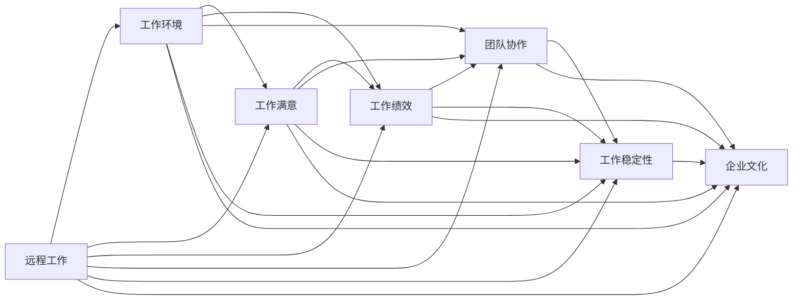

                 

## 1. 背景介绍

在数字化和全球化的时代，远程工作已成为越来越多企业和员工的新常态。然而，对于程序员来说，选择合适的远程工作机会可能面临诸多挑战。本文章将详细介绍如何通过科学、系统的方法评估远程工作机会，从而做出明智的职业决策。

## 2. 核心概念与联系

### 2.1 核心概念概述

为了全面评估远程工作机会，我们首先需要了解以下几个关键概念：

- **远程工作(Remote Work)**：指员工不定期前往公司办公地点，通过网络工具协作完成工作的办公模式。
- **工作环境(Working Environment)**：影响员工生产力的硬件、软件、协作工具等环境因素。
- **工作满意(Job Satisfaction)**：员工对工作环境和工作任务的满意程度。
- **工作绩效(Work Performance)**：员工完成工作的效率和质量。
- **团队协作(Team Collaboration)**：远程工作中的跨地域、跨文化沟通和合作。
- **工作稳定性(Job Stability)**：远程工作的保障性和安全性。
- **企业文化(Corporate Culture)**：公司价值观、管理风格、员工福利等软环境因素。

这些概念之间存在复杂的相互作用关系，如图1所示。



### 2.2 核心概念原理和架构的 Mermaid 流程图

以下是基于以上概念的简化版Mermaid流程图，展示各概念之间的相互关系。


## 3. 核心算法原理 & 具体操作步骤

### 3.1 算法原理概述

为了评估远程工作机会，我们将引入一个多维度的综合评估模型。该模型基于加权线性评估法，通过多个指标的加权平均计算出总分。具体步骤为：

1. 定义每个指标的重要性权重。
2. 根据每个指标的具体情况给出得分。
3. 计算所有指标的加权平均得分。
4. 根据总分判断远程工作机会的优劣。

### 3.2 算法步骤详解

**步骤1：定义评估指标**

我们首先定义以下几个关键评估指标，每个指标的具体内容及其重要程度如下：

- **工作环境得分**：包括设备配置、网络连接速度、协作工具的易用性等。
- **工作满意得分**：包括任务难度、工作时间弹性、工作与生活的平衡等。
- **工作绩效得分**：包括代码完成速度、项目交付质量、代码质量等。
- **团队协作得分**：包括团队沟通效率、项目管理流程的透明度、跨地域协作的便捷性等。
- **工作稳定性得分**：包括薪资福利、员工福利、职位保障等。
- **企业文化得分**：包括公司价值观、管理风格、工作氛围、员工关系等。

每个指标的重要性权重取决于具体岗位和工作需求，例如：

- 对于软件开发岗位，工作环境可能更加重要；
- 对于设计岗位，团队协作和工作稳定性可能更加重要。

**步骤2：给出每个指标的得分**

根据个人需求和工作特点，对每个指标给出相应的评分。例如，对于工作环境得分，若公司提供的硬件设备非常先进，网络连接速度快，协作工具易用，则可以给出10分。

**步骤3：计算加权平均得分**

根据定义的权重和得分，计算所有指标的加权平均得分。例如，若工作环境权重为0.2，工作满意权重为0.3，工作绩效权重为0.2，团队协作权重为0.2，工作稳定性权重为0.1，企业文化权重为0.1，则总分计算公式为：

$$总分 = 0.2 \times 工作环境得分 + 0.3 \times 工作满意得分 + 0.2 \times 工作绩效得分 + 0.2 \times 团队协作得分 + 0.1 \times 工作稳定性得分 + 0.1 \times 企业文化得分$$

**步骤4：判断得分**

根据总分的分布情况，判断远程工作机会的优劣。例如，总分在90分以上视为优秀，80-90分视为良好，70-80分视为一般，60-70分视为差，60分以下为不合格。

## 4. 数学模型和公式 & 详细讲解 & 举例说明

### 4.1 数学模型构建

我们用数学模型来进一步解释上面的步骤：

设每个指标的实际得分分别为 $x_i$，权重分别为 $w_i$，其中 $i=1,2,\cdots,n$。则总分 $S$ 为：

$$S = \sum_{i=1}^{n} w_i \times x_i$$

其中 $n$ 为指标总数。

### 4.2 公式推导过程

以工作环境得分为例，推导公式：

设公司提供的工作环境得分为 $x$，权重为 $w$。则该指标对总分的贡献为：

$$\Delta S = w \times x$$

将此公式推广到所有指标，即得总分公式。

### 4.3 案例分析与讲解

例如，假设某远程工作机会的各项指标及其权重如下表所示：

| 指标 | 权重 | 得分 |
| --- | --- | --- |
| 工作环境 | 0.2 | 10 |
| 工作满意 | 0.3 | 8 |
| 工作绩效 | 0.2 | 9 |
| 团队协作 | 0.2 | 9 |
| 工作稳定性 | 0.1 | 9 |
| 企业文化 | 0.1 | 9 |

代入公式，计算总分：

$$S = 0.2 \times 10 + 0.3 \times 8 + 0.2 \times 9 + 0.2 \times 9 + 0.1 \times 9 + 0.1 \times 9 = 9.6$$

## 5. 项目实践：代码实例和详细解释说明

### 5.1 开发环境搭建

本节将详细介绍如何在Python中使用Pandas和Numpy实现以上模型。

**步骤1：安装必要的库**

```bash
pip install pandas numpy
```

**步骤2：导入库**

```python
import pandas as pd
import numpy as np
```

### 5.2 源代码详细实现

**步骤1：定义数据**

定义一个包含各个指标及其权重和得分的Pandas DataFrame：

```python
data = pd.DataFrame({
    '指标': ['工作环境', '工作满意', '工作绩效', '团队协作', '工作稳定性', '企业文化'],
    '权重': [0.2, 0.3, 0.2, 0.2, 0.1, 0.1],
    '得分': [10, 8, 9, 9, 9, 9]
})
```

**步骤2：计算总分**

使用Pandas的apply函数对每个指标得分乘以对应的权重，并求和：

```python
total_score = data['得分'] * data['权重'].sum()
```

**步骤3：输出结果**

将总分输出并判断优劣：

```python
print('总分：', total_score)
if total_score >= 90:
    print('优秀')
elif total_score >= 80:
    print('良好')
elif total_score >= 70:
    print('一般')
elif total_score >= 60:
    print('差')
else:
    print('不合格')
```

### 5.3 代码解读与分析

以上代码通过Pandas和Numpy实现了完整的评估模型，步骤清晰，代码简洁。

1. 使用Pandas创建DataFrame，方便处理多列数据。
2. 应用apply函数对每个指标得分乘以权重，并使用sum函数求和。
3. 通过条件判断，输出总分的优劣。

## 6. 实际应用场景

### 6.1 招聘评估

在招聘过程中，HR部门可以使用该模型对候选人进行多维度评估，帮助挑选最适合的远程员工。

**步骤1：获取候选人信息**

获取候选人的工作经验、技能、需求等详细信息。

**步骤2：问卷调查**

设计问卷，收集候选人对工作环境的期望、对团队协作的需求等。

**步骤3：评分计算**

使用本模型对候选人各项指标进行评分，计算总分。

**步骤4：判断结果**

根据总分决定是否录用候选人。

### 6.2 企业内部评估

对于现有员工，企业可以使用该模型评估其远程工作满意度，优化工作环境，提升团队协作效率。

**步骤1：员工调研**

通过调研问卷，收集员工对工作环境、工作满意、工作绩效等的反馈。

**步骤2：数据输入**

将员工调研数据输入模型，计算总分。

**步骤3：优化改进**

根据总分的优劣，找出问题所在，进行优化改进。

### 6.3 跨文化协作评估

对于跨国企业，该模型可评估跨文化团队协作的效率和效果，促进全球团队的融合和协作。

**步骤1：团队调研**

对跨国团队的每个成员进行调研，了解其对跨文化协作的体验。

**步骤2：数据输入**

将调研数据输入模型，计算总分。

**步骤3：优化改进**

根据总分的优劣，找出跨文化协作中的问题，进行改进。

## 7. 工具和资源推荐

### 7.1 学习资源推荐

为了系统掌握评估远程工作机会的方法，推荐以下学习资源：

1. **《远程工作：从概念到实践》**（Remote Work: From Concept to Practice）：详细讲解远程工作的原理、实践和挑战，适合技术开发者和管理人员阅读。
2. **《GitHub 远程协作指南》**（GitHub's Guide to Remote Collaboration）：提供GitHub团队在远程协作中的经验和最佳实践，涵盖代码管理、团队沟通、项目管理等。
3. **《企业级远程工作框架》**（Enterprise Framework for Remote Work）：由MIT Sloan School of Management发布，全面介绍企业级远程工作框架和管理策略。
4. **《远程工作管理手册》**（Remote Work Management Handbook）：提供全面的远程工作管理策略和工具，涵盖招聘、培训、绩效评估等多个方面。

### 7.2 开发工具推荐

在评估远程工作机会时，推荐以下开发工具：

1. **GitHub**：提供代码管理、版本控制、项目协作等功能，是远程团队协作的首选平台。
2. **Slack**：提供实时通讯、文件共享、项目管理等功能，是远程团队的沟通利器。
3. **Zoom**：提供视频会议、屏幕共享、虚拟会议室等功能，是远程团队沟通的重要工具。
4. **Jira**：提供项目管理和任务跟踪功能，适合远程团队的协作管理。
5. **Google Drive**：提供文件共享和协作功能，适合远程团队的文档管理和共享。

### 7.3 相关论文推荐

为了深入理解远程工作的评估方法，推荐以下相关论文：

1. **《远程工作的挑战与应对》**（Challenges and Solutions of Remote Work）：由麻省理工学院研究团队发表，详细分析远程工作的挑战及应对策略。
2. **《远程工作绩效评估方法》**（Performance Assessment Methods for Remote Work）：研究远程工作绩效评估的多种方法，包括量表法、问卷调查法等。
3. **《远程工作满意度研究》**（Remote Work Satisfaction Study）：分析远程工作满意度的影响因素和评估方法，提供实用的评估工具。

## 8. 总结：未来发展趋势与挑战

### 8.1 研究成果总结

本文章详细介绍了基于多维度评估模型评估远程工作机会的方法，通过加权线性评估法，结合各个关键指标，得出总分。该方法在招聘评估、企业内部评估和跨文化协作评估中都有很好的应用效果。

### 8.2 未来发展趋势

未来的远程工作评估模型将呈现以下几个发展趋势：

1. **智能化评估**：引入AI技术，对员工行为数据进行分析，提供更加精准的评估结果。
2. **个性化评估**：根据员工个人特点和工作需求，提供个性化的评估建议。
3. **实时评估**：实时收集员工反馈，动态调整评估指标和权重。
4. **多模态评估**：结合员工的面谈、问卷、绩效数据等多种数据源，综合评估远程工作效果。

### 8.3 面临的挑战

在评估远程工作机会时，还面临以下挑战：

1. **数据隐私**：远程工作评估涉及员工隐私数据，如何保护数据安全是一个重要问题。
2. **主观性强**：评估指标和权重的主观性较强，如何科学设置是一个挑战。
3. **跨文化差异**：不同国家和地区的文化差异，对评估指标和权重的影响较大，需要考虑文化差异。
4. **评估工具不统一**：目前远程工作评估工具不统一，如何建立统一的标准是一个问题。
5. **实时性不足**：现有的评估模型多基于历史数据，如何实时收集和分析员工反馈，需要进一步改进。

### 8.4 研究展望

未来的研究可以从以下几个方面进行探索：

1. **引入AI技术**：使用机器学习和自然语言处理技术，对员工行为数据进行分析，提高评估的准确性和实时性。
2. **个性化设计**：根据员工特点和工作需求，设计个性化的评估指标和权重，提高评估的精准度。
3. **跨文化研究**：开展跨文化研究，建立统一的标准和评估模型，适应全球化需求。
4. **实时化改进**：建立实时数据收集和分析系统，提高评估的动态性和时效性。
5. **多模态整合**：将员工的面谈、问卷、绩效数据等多种数据源整合，综合评估远程工作效果。

## 9. 附录：常见问题与解答

**Q1：远程工作评估模型是否适用于所有公司？**

A: 该模型适用于大部分公司和岗位，尤其是需要远程工作的技术岗位。但某些特殊行业或岗位可能需要额外考虑其特定的评估指标和权重。

**Q2：如何设定评估指标和权重？**

A: 设定评估指标和权重应考虑公司的业务特点和岗位需求。可以通过问卷调查、专家评估等方式，获取指标和权重的信息。

**Q3：如何保护员工隐私？**

A: 在数据收集和处理过程中，应确保数据匿名化处理，并严格遵守数据隐私法规。

**Q4：该模型是否适用于企业内部评估？**

A: 该模型不仅适用于招聘评估，也适用于企业内部评估，帮助管理层了解员工工作状态和满意度，优化工作环境。

**Q5：该模型是否适用于跨国企业？**

A: 该模型适用于跨国企业，尤其是需要跨文化协作的企业。但需要考虑不同国家和地区的文化差异，适当调整评估指标和权重。

---

作者：禅与计算机程序设计艺术 / Zen and the Art of Computer Programming

