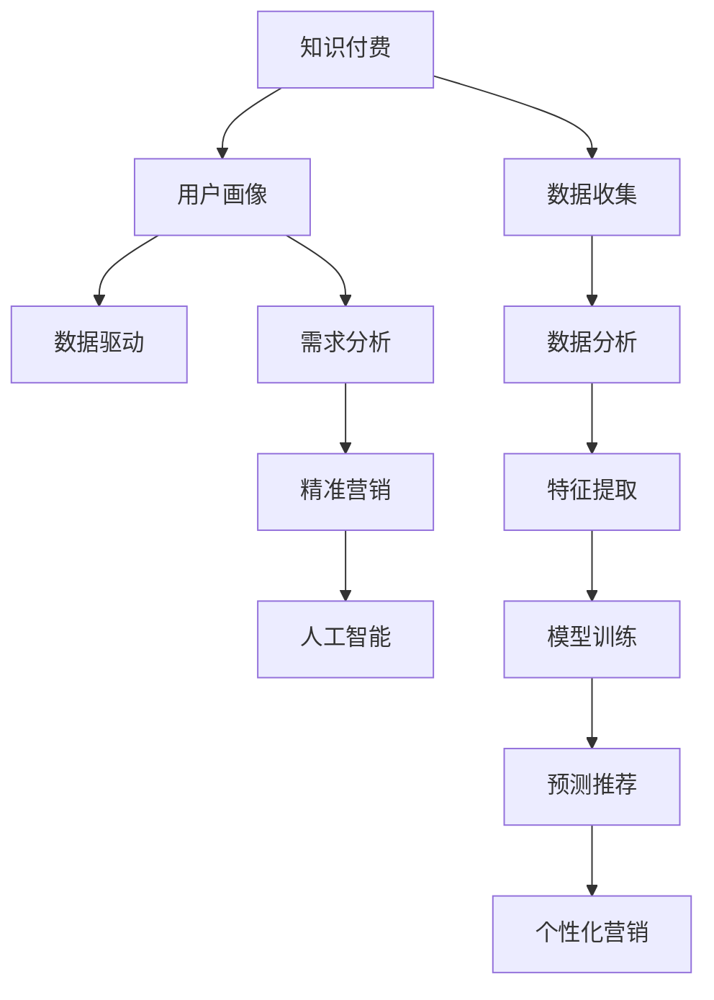

                 

# 程序员如何进行知识付费的用户画像分析

> 关键词：程序员,知识付费,用户画像分析,数据驱动,需求分析,精准营销,人工智能

## 1. 背景介绍

### 1.1 问题由来
在信息化和数字化时代，程序员作为技术和智慧的创造者，面临着不断更新知识和技术的需求。随着人工智能、大数据、区块链等前沿技术的发展，程序员不仅需要掌握基础知识，更需要不断学习新技术，以保持其职业竞争力。这种学习需求催生了知识付费市场的繁荣，程序员成为了知识付费的重要用户群体。

然而，尽管知识付费市场发展迅速，很多知识付费内容并没有达到预期的效果。主要原因在于缺乏对程序员群体需求和行为的研究，未能针对程序员群体的特点进行内容定制。本文章将探讨程序员群体在知识付费领域的行为特征和需求，进而提出如何进行精准的用户画像分析和个性化推荐，以提升知识付费内容的效果和用户的满意度。

### 1.2 问题核心关键点
本文将从程序员群体的特征出发，研究其在知识付费平台上的行为模式、需求和偏好，进而提出针对程序员群体的个性化推荐策略和营销方案。这些策略包括用户画像构建、数据驱动的需求分析、精准营销、以及人工智能在用户画像分析中的应用。

本文的核心目标是帮助知识付费平台更好地理解和吸引程序员用户，提升内容的点击率、订阅率和用户留存率，最终实现平台收入的增长和用户体验的提升。

## 2. 核心概念与联系

### 2.1 核心概念概述

为了更好地理解程序员在知识付费平台上的行为模式和需求，本节将介绍几个密切相关的核心概念：

- **知识付费(Knowledge Payment)**：用户为获得知识、技术、资讯等付费内容的一种服务模式。知识付费包括线上和线下两种形式，线上知识付费通过平台如慕课网、Coursera等进行，线下通过书籍、培训课程等形式实现。

- **用户画像(User Persona)**：基于用户的特征和行为数据，构建虚拟用户模型，用于指导个性化推荐、精准营销等决策。用户画像包括用户的基本信息、兴趣偏好、行为模式、消费习惯等。

- **数据驱动(Data-Driven)**：以数据为基础进行决策和分析，通过统计分析、机器学习等方法，提取用户需求和行为规律，指导产品和服务优化。

- **需求分析(Demand Analysis)**：通过数据分析，识别和理解用户对知识付费内容的真实需求和痛点，指导内容的生产和优化。

- **精准营销(Precision Marketing)**：基于用户画像和需求分析，精准定位用户群体，实现内容推荐、广告投放、社区互动等，提升用户转化率和平台活跃度。

- **人工智能(AI)**：包括机器学习、深度学习、自然语言处理等技术，通过数据分析、用户画像构建和推荐算法优化，提升知识付费平台的个性化推荐能力。

这些核心概念之间的逻辑关系可以通过以下Mermaid流程图来展示：



这个流程图展示了几者之间的联系：

1. 知识付费平台通过数据收集获得用户行为数据。
2. 数据驱动和需求分析通过数据挖掘和分析，了解用户需求和行为模式。
3. 用户画像构建基于数据驱动的结果，形成用户画像。
4. 精准营销通过用户画像和需求分析结果，实现内容推荐、广告投放等。
5. 人工智能通过模型训练提升推荐算法的准确性和个性化能力。

## 3. 核心算法原理 & 具体操作步骤

### 3.1 算法原理概述

为了构建程序员群体在知识付费平台上的用户画像，并进行精准推荐，本节将从算法原理的角度进行分析。

基于用户画像的推荐系统主要分为两个步骤：

1. **用户画像构建**：通过对用户行为数据、文本数据、社交网络数据等进行综合分析，构建用户兴趣模型，包括用户兴趣标签、偏好时间、消费习惯等。

2. **推荐算法实现**：基于用户画像和推荐模型，实现个性化推荐。常用的推荐算法包括基于协同过滤、内容基推荐、混合推荐等。

### 3.2 算法步骤详解

#### 3.2.1 数据收集
知识付费平台需要收集各种类型的数据，包括用户行为数据、交易数据、社交网络数据、文本数据等。常用的数据收集方法包括：

- **行为数据收集**：记录用户在平台上的行为，如课程浏览、视频观看、课件下载等。
- **交易数据收集**：记录用户的付费行为，如课程订阅、充值、退订等。
- **社交网络数据收集**：记录用户与他人之间的互动，如评论、点赞、分享等。
- **文本数据收集**：记录用户在课程评论、知识问答、社区讨论等场合发表的文本内容。

#### 3.2.2 数据预处理
数据预处理包括数据清洗、数据整合、数据标准化等。具体步骤包括：

- **数据清洗**：去除无用、重复、异常数据，保证数据质量。
- **数据整合**：将不同来源的数据进行整合，如用户ID、课程ID、时间戳等。
- **数据标准化**：对数据格式进行标准化，如时间戳、文本等。

#### 3.2.3 特征提取
特征提取是构建用户画像的关键步骤。常用的特征包括：

- **基本特征**：用户ID、注册时间、付费状态等。
- **行为特征**：课程浏览次数、视频观看时长、课件下载量等。
- **文本特征**：课程评论、知识问答、社区讨论等文本内容中的关键词、情感、主题等。
- **社交特征**：关注用户数、点赞用户数、评论用户数等。

#### 3.2.4 用户画像构建
基于特征提取的结果，构建用户画像。常用的方法包括：

- **标签聚类**：通过聚类算法，将用户分为不同的标签群，每个标签群代表一种兴趣。
- **主题建模**：使用LDA、LSI等主题模型，发现文本中的隐藏主题。
- **时间序列分析**：通过时间序列分析，发现用户兴趣的变化规律。
- **协同过滤**：基于用户行为数据，通过协同过滤算法，发现相似用户。

#### 3.2.5 推荐算法实现
基于用户画像和特征，实现推荐算法。常用的推荐算法包括：

- **协同过滤算法**：通过分析用户行为数据，找到相似用户和物品，推荐用户未尝试过的物品。
- **基于内容的推荐算法**：基于物品属性，发现与用户兴趣相似的物品。
- **混合推荐算法**：结合协同过滤和内容基推荐，提升推荐效果。

#### 3.2.6 个性化推荐实现
基于推荐算法，实现个性化推荐。具体的实现步骤包括：

- **相似度计算**：计算用户和物品之间的相似度，找到最相似的物品。
- **权重计算**：根据用户画像中的不同特征，计算每个特征对推荐结果的权重。
- **推荐生成**：根据相似度权重，生成个性化推荐结果。

### 3.3 算法优缺点

#### 3.3.1 优点

- **个性化推荐准确度高**：通过分析用户画像和行为数据，可以实现高度个性化的推荐，提升用户的点击率和订阅率。
- **用户满意度提升**：基于用户画像，可以推荐用户真正感兴趣的内容，提升用户的满意度。
- **提高平台活跃度**：个性化推荐可以提高用户粘性，提升平台的活跃度和留存率。

#### 3.3.2 缺点

- **数据收集难度大**：需要收集多种类型的数据，数据收集和整合工作量大。
- **模型训练成本高**：需要大量计算资源和数据，模型训练成本高。
- **隐私保护难度大**：用户数据的收集和使用需要遵守隐私保护法律法规。

### 3.4 算法应用领域

基于用户画像的推荐系统可以应用于多个领域，包括但不限于：

- **知识付费平台**：通过推荐用户感兴趣的知识付费内容，提升平台的用户转化率和留存率。
- **电商推荐系统**：通过推荐用户感兴趣的商品，提升平台的销售量和用户满意度。
- **社交网络**：通过推荐用户感兴趣的内容和好友，提升用户粘性和平台活跃度。

## 4. 数学模型和公式 & 详细讲解 & 举例说明

### 4.1 数学模型构建

基于用户画像的推荐系统可以通过以下数学模型进行构建：

$$
P(r_{i|u}) = \sigma\left(\sum_{j=1}^{n}\alpha_{j}w_{u,j}f_{j}(x_{i})\right)
$$

其中，$P(r_{i|u})$ 表示用户 $u$ 对物品 $i$ 的兴趣评分，$\sigma$ 为逻辑斯谛函数，$w_{u,j}$ 表示用户画像中第 $j$ 个特征的权重，$f_{j}(x_{i})$ 表示物品 $i$ 在特征 $j$ 上的得分。

### 4.2 公式推导过程

假设用户画像由 $n$ 个特征组成，每个特征 $x_{j}$ 对用户兴趣的影响系数为 $w_{u,j}$。物品 $i$ 在特征 $j$ 上的得分为 $f_{j}(x_{i})$。用户 $u$ 对物品 $i$ 的兴趣评分 $P(r_{i|u})$ 可以表示为：

$$
P(r_{i|u}) = \sigma\left(\sum_{j=1}^{n}w_{u,j}f_{j}(x_{i})\right)
$$

其中，$\sigma$ 为逻辑斯谛函数，用于将得分转换为概率值。权重 $w_{u,j}$ 表示用户画像中第 $j$ 个特征对用户兴趣的影响程度，$f_{j}(x_{i})$ 表示物品 $i$ 在特征 $j$ 上的得分。

在实际应用中，可以通过机器学习算法（如线性回归、逻辑回归、决策树等）对用户画像和物品评分进行建模，从而实现推荐算法的优化。

### 4.3 案例分析与讲解

**案例分析：程序员群体的兴趣标签建模**

假设某知识付费平台希望构建程序员群体的兴趣标签模型。平台收集了程序员的课程浏览、视频观看、课件下载等行为数据，并对这些数据进行了预处理和特征提取。

通过聚类算法，平台将程序员用户分为三个标签群：技术栈类、算法类和框架类。每个标签群代表一种程序员的兴趣方向。

对于技术栈类用户，主要关注的是特定技术栈的课程，如Java、Python、C++等。对于算法类用户，主要关注的是机器学习、数据科学等算法相关的课程。对于框架类用户，主要关注的是特定编程框架的课程，如Spring、Django等。

平台可以根据用户的兴趣标签，推荐用户可能感兴趣的课程，如Java程序员可以推荐Java编程相关的课程，机器学习程序员可以推荐机器学习相关的课程等。

## 5. 项目实践：代码实例和详细解释说明

### 5.1 开发环境搭建

为了构建程序员群体的兴趣标签模型，并进行个性化推荐，我们需要一个开发环境。以下是使用Python进行TensorFlow开发的环境配置流程：

1. 安装Anaconda：从官网下载并安装Anaconda，用于创建独立的Python环境。

2. 创建并激活虚拟环境：
```bash
conda create -n tf-env python=3.8 
conda activate tf-env
```

3. 安装TensorFlow：
```bash
pip install tensorflow
```

4. 安装相关库：
```bash
pip install numpy pandas sklearn
```

完成上述步骤后，即可在`tf-env`环境中开始开发。

### 5.2 源代码详细实现

下面以程序员群体在知识付费平台上的兴趣标签建模和推荐系统为例，给出使用TensorFlow实现用户画像和推荐系统的代码。

首先，定义特征向量类：

```python
import tensorflow as tf
import numpy as np
import pandas as pd

class FeatureVector(tf.keras.layers.Layer):
    def __init__(self, embedding_dim):
        super(FeatureVector, self).__init__()
        self.dense = tf.keras.layers.Dense(embedding_dim, activation='tanh')
        
    def call(self, inputs):
        return self.dense(inputs)
```

然后，定义用户画像类：

```python
class UserProfile(tf.keras.layers.Layer):
    def __init__(self, num_features):
        super(UserProfile, self).__init__()
        self.vectorizer = FeatureVector(num_features)
        
    def call(self, inputs):
        return self.vectorizer(inputs)
```

接着，定义物品特征向量类：

```python
class ItemFeatureVector(tf.keras.layers.Layer):
    def __init__(self, embedding_dim):
        super(ItemFeatureVector, self).__init__()
        self.dense = tf.keras.layers.Dense(embedding_dim, activation='tanh')
        
    def call(self, inputs):
        return self.dense(inputs)
```

然后，定义协同过滤推荐类：

```python
class CollaborativeFiltering(tf.keras.layers.Layer):
    def __init__(self, num_users, num_items, num_features):
        super(CollaborativeFiltering, self).__init__()
        self.num_users = num_users
        self.num_items = num_items
        self.num_features = num_features
        self.user_profile = UserProfile(num_features)
        self.item_profile = ItemFeatureVector(num_features)
        self.cos_similarity = tf.keras.layers.Dot(axes=1, normalize=True)
        self.dim = tf.keras.layers.Dense(1)
        
    def call(self, inputs):
        user_id, item_id = inputs
        user_profile = self.user_profile(user_id)
        item_profile = self.item_profile(item_id)
        cos_similarity = self.cos_similarity([user_profile, item_profile])
        prediction = self.dim(tf.expand_dims(cos_similarity, axis=1))
        return prediction
```

最后，定义推荐系统类：

```python
class RecommendationSystem(tf.keras.layers.Layer):
    def __init__(self, num_users, num_items, num_features):
        super(RecommendationSystem, self).__init__()
        self.num_users = num_users
        self.num_items = num_items
        self.num_features = num_features
        self.cf = CollaborativeFiltering(num_users, num_items, num_features)
        
    def call(self, inputs):
        user_id, item_id = inputs
        prediction = self.cf([user_id, item_id])
        return prediction
```

在实际应用中，可以通过调用推荐系统类，生成个性化推荐结果。

### 5.3 代码解读与分析

让我们再详细解读一下关键代码的实现细节：

**FeatureVector类**：
- 定义了特征向量的构建过程，包括一个Dense层，用于将特征向量化。

**UserProfile类**：
- 定义了用户画像的构建过程，包括一个Dense层，用于将用户特征向量化。

**ItemFeatureVector类**：
- 定义了物品特征向量的构建过程，包括一个Dense层，用于将物品特征向量化。

**CollaborativeFiltering类**：
- 定义了协同过滤推荐的过程，包括一个Cosine相似度层和Dense层，用于计算用户和物品之间的相似度，并生成推荐结果。

**RecommendationSystem类**：
- 定义了推荐系统的构建过程，包括一个CollaborativeFiltering层，用于生成推荐结果。

这些类和方法构成了基于用户画像的推荐系统的基本框架。在实际应用中，需要根据具体任务和数据特点，进行进一步的优化和调整。

## 6. 实际应用场景

### 6.1 智能教育平台

智能教育平台可以根据学生的兴趣和行为数据，构建用户画像，并实现个性化推荐。平台可以推荐适合学生的课程、习题和资料，提升学习效果和兴趣。

### 6.2 电商推荐系统

电商推荐系统可以根据用户的浏览、购买、评价等行为数据，构建用户画像，并实现个性化推荐。系统可以推荐用户可能感兴趣的商品，提升销售量和用户体验。

### 6.3 社交网络

社交网络可以基于用户的兴趣和社交行为数据，构建用户画像，并实现个性化推荐。系统可以推荐用户感兴趣的内容和好友，提升用户粘性和平台活跃度。

### 6.4 未来应用展望

随着用户画像技术的不断进步，基于用户画像的推荐系统将得到更广泛的应用。未来的推荐系统将更加智能、个性化，能够提供更加精准的推荐结果。

未来，推荐系统将结合更多类型的数据，如地理位置、时间、天气等，提升推荐效果的准确性。同时，推荐系统将引入更多算法，如深度学习、强化学习等，提升推荐算法的复杂性和准确性。

## 7. 工具和资源推荐

### 7.1 学习资源推荐

为了帮助开发者系统掌握用户画像构建和推荐系统的理论基础和实践技巧，这里推荐一些优质的学习资源：

1. 《推荐系统实战》系列博文：由大模型技术专家撰写，深入浅出地介绍了推荐系统的原理、算法和实现技巧。

2. 《深度学习与推荐系统》课程：斯坦福大学开设的深度学习课程，有Lecture视频和配套作业，带你入门推荐系统的基本概念和经典算法。

3. 《推荐系统理论与实践》书籍：详细介绍了推荐系统的理论基础和实践技巧，涵盖协同过滤、内容基推荐、混合推荐等多种推荐算法。

4. 《推荐系统算法》书籍：介绍推荐系统的各种算法和实现技巧，包括协同过滤、协同增强、混合推荐等。

5. Kaggle推荐系统竞赛：参加Kaggle上的推荐系统竞赛，实战学习和验证推荐算法的有效性。

通过对这些资源的学习实践，相信你一定能够快速掌握推荐系统的精髓，并用于解决实际的推荐问题。

### 7.2 开发工具推荐

为了提高推荐系统的开发效率，以下是几款推荐系统的常用开发工具：

1. TensorFlow：开源深度学习框架，支持高效的神经网络模型构建和训练。

2. PyTorch：开源深度学习框架，支持动态计算图和GPU加速，适合快速迭代研究。

3. Scikit-learn：开源机器学习库，包含多种推荐算法和评估指标，适合推荐系统的实现和测试。

4. Jupyter Notebook：免费提供交互式开发环境，支持多种编程语言和工具包，适合数据科学和机器学习研究。

5. GitHub：代码托管平台，支持版本控制和团队协作，适合推荐系统的开源和共享。

合理利用这些工具，可以显著提升推荐系统的开发效率，加快创新迭代的步伐。

### 7.3 相关论文推荐

推荐系统的发展源于学界的持续研究。以下是几篇奠基性的推荐系统论文，推荐阅读：

1. BPR: Bayesian Personalized Ranking from Pairwise Data：提出BPR算法，使用矩阵分解技术实现协同过滤推荐。

2. Netflix Prize Winning Techniques：介绍Netflix Prize竞赛的推荐算法，包括协同过滤、基于内容的推荐等。

3. Matrix Factorization Techniques for Recommender Systems：介绍矩阵分解技术在推荐系统中的应用，如ALS、SVD++等。

4. Deep Collaborative Filtering：提出深度协同过滤算法，使用深度神经网络实现推荐系统。

5. Hierarchical Attention Networks for Document Ranking：提出HAN模型，使用注意力机制提升推荐系统的效果。

这些论文代表了大规模推荐系统的发展脉络。通过学习这些前沿成果，可以帮助研究者把握学科前进方向，激发更多的创新灵感。

## 8. 总结：未来发展趋势与挑战

### 8.1 总结

本文对基于用户画像的推荐系统进行了全面系统的介绍。首先阐述了程序员群体在知识付费平台上的行为模式和需求，明确了如何通过用户画像构建和推荐算法实现个性化推荐。

通过本文的系统梳理，可以看到，基于用户画像的推荐系统在大规模知识付费平台上具有广阔的应用前景，能够显著提升平台的用户转化率和留存率，为知识付费平台的业务增长提供了重要支撑。

### 8.2 未来发展趋势

展望未来，推荐系统将呈现以下几个发展趋势：

1. **个性化推荐更加精准**：通过深度学习、强化学习等技术，推荐系统将更加智能，能够提供更加精准的推荐结果。

2. **推荐效果更加多样化**：推荐系统将结合多种数据源和算法，提升推荐效果的多样性，能够满足用户的多样化需求。

3. **实时推荐成为常态**：推荐系统将实现实时推荐，能够及时响应用户需求，提升用户满意度。

4. **推荐系统跨平台融合**：推荐系统将实现跨平台融合，如电商、社交网络、智能教育等平台，能够共享用户数据和推荐结果，提升平台的综合价值。

5. **推荐系统的可解释性**：推荐系统将注重可解释性，能够提供推荐结果的逻辑依据，增强用户的信任感。

### 8.3 面临的挑战

尽管推荐系统已经取得了瞩目成就，但在迈向更加智能化、普适化应用的过程中，它仍面临着诸多挑战：

1. **数据收集难度大**：推荐系统需要收集多种类型的数据，数据收集和整合工作量大。

2. **算法复杂度高**：推荐系统需要结合多种算法，算法复杂度高，模型训练成本高。

3. **隐私保护难度大**：用户数据的收集和使用需要遵守隐私保护法律法规。

4. **推荐效果不均衡**：推荐系统容易出现冷启动问题，新用户和新物品的推荐效果较差。

5. **计算资源消耗大**：推荐系统需要大量的计算资源进行模型训练和推理，计算成本高。

### 8.4 研究展望

面对推荐系统面临的这些挑战，未来的研究需要在以下几个方面寻求新的突破：

1. **数据隐私保护**：研究如何在保证数据隐私和安全的前提下，实现高效的数据收集和分析。

2. **算法模型优化**：研究更高效的算法模型，减少计算资源消耗，提升推荐效果。

3. **推荐系统的可解释性**：研究推荐系统的可解释性，提供推荐结果的逻辑依据，增强用户的信任感。

4. **推荐系统的跨平台融合**：研究推荐系统在不同平台之间的数据共享和融合，提升平台的综合价值。

5. **推荐系统的实时推荐**：研究实时推荐算法，提升推荐系统的响应速度和用户体验。

这些研究方向将引领推荐系统向更加智能化、普适化方向发展，为推荐系统带来新的突破。只有不断创新、突破，才能让推荐系统更好地服务于用户，提升用户的满意度和平台价值。

## 9. 附录：常见问题与解答

**Q1：如何收集程序员群体的数据？**

A: 可以通过多种方式收集程序员群体的数据，如：

1. **平台日志**：通过知识付费平台的日志数据，收集用户的浏览、观看、下载等行为数据。

2. **交易数据**：通过交易平台的数据，收集用户的付费行为，如课程订阅、充值等。

3. **社交网络数据**：通过社交平台的数据，收集用户的评论、点赞、分享等社交行为数据。

4. **文本数据**：通过课程评论、知识问答等场合，收集用户发表的文本数据。

**Q2：如何构建程序员群体的兴趣标签？**

A: 可以通过以下步骤构建程序员群体的兴趣标签：

1. **特征提取**：通过分析用户的浏览、观看、下载等行为数据，提取用户的基本特征、行为特征和文本特征。

2. **聚类分析**：使用聚类算法，将用户分为不同的标签群，每个标签群代表一种兴趣方向。

3. **主题建模**：使用主题建模算法，发现用户行为和文本中的隐藏主题。

4. **时间序列分析**：通过时间序列分析，发现用户兴趣的变化规律。

**Q3：如何提升推荐系统的实时推荐效果？**

A: 可以通过以下步骤提升推荐系统的实时推荐效果：

1. **数据流处理**：使用流处理技术，实时收集和处理用户行为数据。

2. **实时模型训练**：使用流式模型训练技术，实时更新推荐模型。

3. **实时推荐算法**：使用实时推荐算法，如基于流数据的协同过滤、内容基推荐等。

4. **实时反馈机制**：使用实时反馈机制，根据用户的实时反馈，动态调整推荐结果。

**Q4：如何保护程序员群体的隐私？**

A: 可以通过以下步骤保护程序员群体的隐私：

1. **数据匿名化**：对数据进行匿名化处理，去除敏感信息。

2. **差分隐私**：使用差分隐私技术，保护用户数据的隐私。

3. **访问控制**：对数据的访问进行控制，限制数据的使用范围。

4. **用户授权**：在使用数据前，获取用户的授权，确保用户知情同意。

这些措施将帮助知识付费平台在保护用户隐私的同时，实现高质量的数据收集和分析。

**Q5：如何评估推荐系统的效果？**

A: 可以通过以下指标评估推荐系统的效果：

1. **点击率（CTR）**：评估推荐系统推荐的物品被点击的概率。

2. **点击率转化率（CVR）**：评估推荐系统推荐的物品被点击后，最终完成转化的概率。

3. **用户满意度**：通过用户调查和反馈，评估用户对推荐系统的满意度。

4. **覆盖率**：评估推荐系统推荐的物品对用户多样性的覆盖程度。

5. **准确率**：评估推荐系统推荐物品的准确性，避免推荐垃圾信息。

通过这些指标的评估，可以不断优化推荐系统，提升用户体验和平台价值。

---

作者：禅与计算机程序设计艺术 / Zen and the Art of Computer Programming

