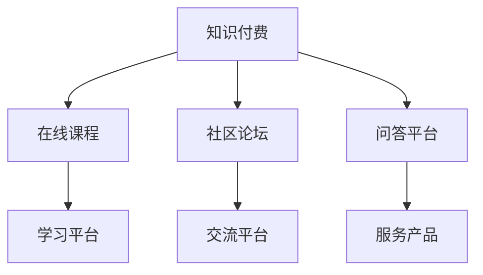
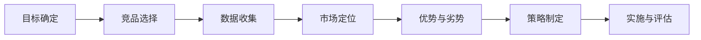

                 

# 程序员如何进行知识付费的竞品分析

## 1. 背景介绍

在信息爆炸的时代，程序员面临的是一个愈发复杂和快速变化的技术环境。无论是从事软件开发、数据科学、人工智能还是安全领域，持续学习和知识更新都成为了职业发展的必要条件。知识付费作为一种新兴的行业，为程序员提供了丰富的在线学习资源和社区交流平台，以帮助他们保持竞争力。本文旨在通过对知识付费领域的竞品分析，探讨如何利用现有资源，最大化知识获取的效率和效果。

## 2. 核心概念与联系

### 2.1 核心概念概述

在深入分析之前，首先需要明确一些关键概念：

- **知识付费（Knowledge-Driven Subscription Services）**：指通过订阅形式提供有价值的知识内容或服务，以换取经济回报的商业模式。
- **竞品分析（Competitive Analysis）**：通过研究竞争对手的产品、服务、市场策略，评估自身优势和不足，以制定更有效的市场和产品策略。

核心概念之间的关系可以用以下Mermaid流程图表示：



这个流程图展示了知识付费的主要组成部分及其相互关系：
- **在线课程**：提供在线视频、文本教程等知识资源。
- **社区论坛**：提供程序员交流和分享技术经验的平台。
- **问答平台**：针对程序员的特定问题提供解答服务。
- **学习平台**：综合了课程、论坛、问答等多种形式的知识资源。
- **交流平台**：程序员之间进行非正式交流和项目合作的场所。
- **服务产品**：提供如技术支持、项目顾问等专业服务。

### 2.2 核心概念原理和架构的 Mermaid 流程图

这个合法的竞品分析框架应该包括以下几个主要部分：

1. **目标确定**：明确分析的目的是什么，例如了解市场趋势、评估自身竞争力、寻找合作机会等。
2. **竞品选择**：选择具有代表性的竞品作为分析对象。
3. **数据收集**：通过多渠道获取竞品信息，包括官网、社交媒体、用户评价、行业报告等。
4. **市场定位**：分析竞品在市场中的定位，如价格、受众、产品类型等。
5. **优势与劣势**：对比自身与竞品的优劣势，识别市场机会和风险。
6. **策略制定**：根据分析结果制定针对性的市场和产品策略。
7. **实施与评估**：将策略付诸实施，并持续评估效果。

这个流程可以用以下Mermaid流程图表示：



## 3. 核心算法原理 & 具体操作步骤

### 3.1 算法原理概述

竞品分析的算法原理主要涉及数据挖掘和模式识别技术。通过收集和分析竞品数据，挖掘出市场趋势、用户行为模式、竞品优劣势等信息，为决策提供支持。这些信息通常以文本、图像、数据表等形式存在，需要通过自然语言处理（NLP）、图像处理等技术进行预处理和分析。

### 3.2 算法步骤详解

1. **数据收集**：
    - 网站和应用抓取：使用爬虫技术从竞品的官网、App Store、Google Play等平台抓取信息。
    - 用户评论分析：通过社交媒体和用户评价网站收集用户反馈和评分数据。
    - 行业报告整合：收集市场调研机构发布的行业报告，获取宏观市场趋势和竞品表现数据。

2. **数据预处理**：
    - 文本清洗：去除噪音数据，如广告、链接、重复内容等。
    - 数据标注：对竞品信息进行分类，如课程、论坛、问答、服务产品等。
    - 数据集成：将不同来源的数据整合到一个统一的数据库中。

3. **数据分析**：
    - 竞争者定位：通过文本挖掘技术，提取竞品的市场定位和核心优势。
    - 用户画像构建：分析用户行为数据，构建目标用户的画像，了解用户需求和偏好。
    - 优劣势识别：对比自身和竞品的差异，识别出自身的优势和需要改进的地方。

4. **策略制定**：
    - 市场策略：基于分析结果，制定针对市场和用户需求的产品和营销策略。
    - 产品优化：针对竞品的优势和不足，进行产品迭代和功能增强。
    - 竞争策略：制定差异化的竞争策略，以提高市场竞争力。

5. **实施与评估**：
    - 实施策略：将策略付诸实施，并监控市场反应。
    - 效果评估：通过用户反馈、市场份额、销售数据等指标，评估策略的效果。
    - 调整优化：根据评估结果，持续优化和调整策略。

### 3.3 算法优缺点

**优点**：
- 数据驱动决策：通过详细的数据分析，提高决策的科学性和准确性。
- 全面视角：覆盖不同来源的信息，提供多角度的市场洞察。
- 动态更新：市场和竞品信息不断变化，分析过程可以持续进行，保持策略的时效性。

**缺点**：
- 数据隐私问题：抓取和分析用户数据可能涉及隐私问题，需注意合规性。
- 数据噪音：网络数据质量参差不齐，噪音数据会影响分析结果。
- 成本高昂：数据收集和处理需要耗费大量时间和资源。

### 3.4 算法应用领域

竞品分析不仅可以应用于知识付费平台，还能广泛用于多个领域：

- **电商行业**：通过竞品分析，了解市场趋势，制定商品策略，优化供应链管理。
- **内容创作**：分析受众兴趣和内容表现，提升内容质量和传播效果。
- **营销策划**：通过竞品营销策略的对比分析，制定更具竞争力的市场推广方案。
- **金融投资**：评估投资标的的风险和收益，制定投资组合策略。
- **人力资源**：通过竞品分析，优化招聘策略和员工培训计划。

## 4. 数学模型和公式 & 详细讲解 & 举例说明

### 4.1 数学模型构建

在竞品分析中，常用的数学模型包括文本分类模型、情感分析模型和聚类模型等。这些模型可以帮助我们从大量文本数据中提取有用的信息。

**文本分类模型**：
- 输入：竞品的官网、课程描述、用户评论等文本数据。
- 输出：对文本进行分类，如课程类型、内容质量等级等。

**情感分析模型**：
- 输入：用户评论、评分数据等。
- 输出：分析用户对竞品的情感倾向，如正面、中性、负面。

**聚类模型**：
- 输入：竞品特征向量，如价格、用户评分、课程难度等。
- 输出：对竞品进行聚类分析，识别相似产品，找到市场细分。

### 4.2 公式推导过程

以**文本分类模型**为例，使用朴素贝叶斯算法进行公式推导。

朴素贝叶斯模型的分类公式为：
$$
P(C_k|d) = \frac{P(d|C_k)P(C_k)}{P(d)}
$$
其中，$C_k$表示第$k$个类别，$d$表示文本描述，$P(d|C_k)$是文本属于$C_k$类别的条件概率，$P(C_k)$是$C_k$类别的先验概率，$P(d)$是文本的先验概率。

朴素贝叶斯算法假设所有特征之间是独立的，即：
$$
P(d|C_k) = \prod_{i=1}^n P(w_i|C_k)
$$
其中，$w_i$表示文本中的第$i$个特征（单词），$P(w_i|C_k)$是$w_i$属于$C_k$类别的条件概率。

通过最大似然估计，可以得到$P(w_i|C_k)$的估计值：
$$
P(w_i|C_k) = \frac{N_{ki}}{N_k}
$$
其中，$N_{ki}$是类别$C_k$中包含特征$w_i$的文本数量，$N_k$是类别$C_k$中所有文本数量。

### 4.3 案例分析与讲解

假设我们要分析一个名为"代码之美"的编程课程平台，其核心产品是高质量的编程课程和导师指导服务。通过以下步骤进行竞品分析：

1. **数据收集**：
    - 从"代码之美"官网抓取课程列表、课程简介、用户评分等数据。
    - 从App Store和Google Play获取用户评价和评分数据。
    - 收集其他类似平台的公开数据，如Coursera、Udacity等。

2. **数据预处理**：
    - 文本清洗：去除广告、链接、重复内容等。
    - 数据标注：将课程和导师信息分类，构建特征向量。
    - 数据集成：将不同来源的数据整合到一个统一的数据库中。

3. **数据分析**：
    - 竞争者定位：分析竞品官网和课程描述，提取核心卖点和市场定位。
    - 用户画像构建：通过用户评分和评价，分析用户需求和偏好。
    - 优劣势识别：对比自身和竞品的课程内容、价格、导师质量等，识别出自身的优势和需要改进的地方。

4. **策略制定**：
    - 市场策略：基于分析结果，制定针对市场和用户需求的产品和营销策略。
    - 产品优化：针对竞品的优势和不足，进行产品迭代和功能增强。
    - 竞争策略：制定差异化的竞争策略，如提供免费试听、个性化推荐等。

## 5. 项目实践：代码实例和详细解释说明

### 5.1 开发环境搭建

在开始项目实践之前，需要搭建一个适合数据分析和机器学习的开发环境。

1. **环境搭建**：
    - 安装Python环境：使用Anaconda或Miniconda安装Python 3.x版本。
    - 安装主要库：使用pip安装Pandas、NumPy、Scikit-learn、Scrapy等库。
    - 数据存储：使用SQLite、MySQL或Hadoop等存储解决方案，保存和管理数据。

2. **工具配置**：
    - 数据可视化：使用Matplotlib、Seaborn等库进行数据可视化。
    - 文本处理：使用NLTK、spaCy等库进行文本清洗和预处理。
    - 机器学习：使用Scikit-learn进行文本分类、情感分析等模型训练。

### 5.2 源代码详细实现

以下是一个简单的Python代码示例，用于从一个在线课程平台上抓取课程信息并对其进行文本分类分析：

```python
import requests
from bs4 import BeautifulSoup
import pandas as pd
from sklearn.feature_extraction.text import CountVectorizer
from sklearn.model_selection import train_test_split
from sklearn.naive_bayes import MultinomialNB

# 抓取课程信息
def fetch_course_data(url):
    response = requests.get(url)
    soup = BeautifulSoup(response.text, 'html.parser')
    courses = []
    for course in soup.find_all('div', class_='course'):
        title = course.find('h2').text
        description = course.find('p').text
        rating = course.find('span', class_='rating').text
        price = course.find('span', class_='price').text
        courses.append([title, description, rating, price])
    return courses

# 文本预处理
def preprocess_text(text):
    return text.lower().replace(',', '').replace('.', '')

# 特征提取
def extract_features(courses):
    vectorizer = CountVectorizer(stop_words='english')
    features = vectorizer.fit_transform([course[1] for course in courses])
    labels = [course[3] for course in courses]
    return features, labels

# 模型训练与评估
def train_and_evaluate(model, features, labels):
    X_train, X_test, y_train, y_test = train_test_split(features, labels, test_size=0.2, random_state=42)
    model.fit(X_train, y_train)
    accuracy = model.score(X_test, y_test)
    return accuracy

# 主函数
if __name__ == '__main__':
    url = 'https://www.example.com/courses'
    courses = fetch_course_data(url)
    features, labels = extract_features(courses)
    model = MultinomialNB()
    accuracy = train_and_evaluate(model, features, labels)
    print(f'Accuracy: {accuracy:.2f}')
```

这段代码首先通过BeautifulSoup库抓取在线课程的网页数据，然后对文本进行预处理和特征提取，最后使用朴素贝叶斯模型进行文本分类并评估其准确率。

### 5.3 代码解读与分析

这个示例代码的主要功能是：
- 抓取课程信息：从在线课程平台上获取课程标题、描述、评分和价格等信息。
- 文本预处理：对课程描述进行文本清洗和标准化处理，去除标点符号和停用词。
- 特征提取：使用CountVectorizer将文本转换为特征向量，用于模型训练。
- 模型训练：使用朴素贝叶斯模型进行训练，并评估其准确率。

这个示例代码展示了基本的Python数据分析和机器学习流程，适合入门学习。在实际应用中，还需要根据具体需求调整和优化代码。

## 6. 实际应用场景

### 6.1 智慧教育

在智慧教育领域，知识付费平台可以提供个性化的在线课程和导师指导服务，帮助学生高效学习。通过竞品分析，教育机构可以了解市场需求，制定更具竞争力的课程和营销策略。

例如，分析某在线教育平台的课程设置和用户评价，发现其课程偏重于理论知识而缺乏实践项目。针对这一发现，教育机构可以引入更多实践项目和真实案例，提升课程的实用性和吸引力。

### 6.2 商业培训

在商业培训领域，知识付费平台可以提供专业的管理、技术课程，帮助企业提升员工技能。通过竞品分析，企业可以优化培训内容，提高培训效果。

例如，分析某在线培训平台的课程内容和用户反馈，发现其课程内容过于理论化，缺乏实际操作经验。针对这一发现，企业可以引入更多实践课程和案例分析，帮助员工更好地应用所学知识。

### 6.3 技术支持

在技术支持领域，知识付费平台可以提供专业的技术咨询和支持服务，帮助企业解决技术问题。通过竞品分析，技术服务提供商可以优化服务方案，提高用户满意度。

例如，分析某技术支持平台的客户评价和支持问题，发现其客服响应速度较慢，影响用户体验。针对这一发现，技术支持提供商可以加强客服团队建设，提高响应速度和问题解决效率。

## 7. 工具和资源推荐

### 7.1 学习资源推荐

为了帮助开发者掌握知识付费的竞品分析技术，这里推荐一些优质的学习资源：

1. **《数据分析与机器学习实战》**：深入讲解数据分析和机器学习的基本流程和常用算法，适合初学者学习。
2. **《Python数据科学手册》**：全面介绍Python在数据分析、数据可视化、机器学习等方面的应用。
3. **Coursera《数据科学与机器学习》课程**：由斯坦福大学和加州大学伯克利分校等知名学府开设，提供系统化的学习路径和实战项目。
4. **Kaggle竞赛**：参加Kaggle机器学习竞赛，锻炼数据分析和机器学习技能，提升问题解决能力。
5. **数据科学社区**：如Kdnuggets、DataCamp等，提供丰富的学习资源、论坛讨论和行业资讯，适合深度学习和知识分享。

### 7.2 开发工具推荐

在竞品分析项目中，合理利用工具可以提高开发效率和数据处理能力。以下是几款常用的开发工具：

1. **Jupyter Notebook**：免费的交互式编程环境，支持Python、R、JavaScript等多种语言，适合数据探索和模型开发。
2. **PyCharm**：功能强大的Python IDE，提供代码调试、版本控制、自动补全等特性。
3. **Scrapy**：Python爬虫框架，支持异步请求和数据抓取，适合抓取大规模网页数据。
4. **BeautifulSoup**：HTML解析库，支持CSS选择器和正则表达式，方便网页数据提取。
5. **Pandas**：数据处理库，提供高效的数据清洗、分析和可视化功能。
6. **Scikit-learn**：机器学习库，提供丰富的算法实现和模型评估工具。

### 7.3 相关论文推荐

竞品分析技术近年来得到了广泛的研究和应用，以下是几篇重要的相关论文，推荐阅读：

1. **《Google Scholar：2020年Google Scholar引用数据分析报告》**：深入分析Google Scholar中的学术引用数据，揭示学术研究趋势和热点。
2. **《A Survey on Competitive Analysis in Mobile Commerce》**：综述移动商务领域的竞品分析方法和应用，提出多维度分析模型。
3. **《Competitive Analysis of Online Education Platforms》**：分析多个在线教育平台的特点和市场表现，提出改进建议。
4. **《A Comparative Study of Online Learning Platforms》**：比较多个在线学习平台的功能和服务，识别优劣势和改进方向。
5. **《Text Mining and Statistical Learning: Classification, Clustering, and Correlation》**：讲解文本挖掘和统计学习的基本方法，提供丰富的案例分析。

这些论文代表了竞品分析技术的发展脉络，提供了系统的理论基础和实践指导。

## 8. 总结：未来发展趋势与挑战

### 8.1 研究成果总结

本文通过对知识付费平台的竞品分析，探讨了如何使用数据驱动决策，优化产品和服务。研究表明，通过详细的竞品分析，可以全面了解市场和用户需求，制定更加有效的策略和方案。

### 8.2 未来发展趋势

未来，竞品分析技术将呈现以下几个发展趋势：

1. **自动化和智能化**：通过引入AI和机器学习技术，竞品分析过程将更加自动化和智能化，提高效率和准确性。
2. **多渠道数据融合**：综合利用社交媒体、用户评论、行业报告等多渠道数据，提供更全面和深入的市场洞察。
3. **实时分析**：利用实时数据流和流计算技术，进行持续的竞品分析，及时响应市场变化。
4. **用户体验优化**：通过竞品分析，优化产品和服务，提升用户体验和满意度。
5. **跨行业应用**：竞品分析技术将在电商、教育、医疗等多个行业得到广泛应用，推动行业发展。

### 8.3 面临的挑战

尽管竞品分析技术已经取得了显著进展，但在实际应用中仍面临一些挑战：

1. **数据质量和隐私问题**：网络数据质量参差不齐，噪音数据和隐私问题需注意。
2. **模型复杂性**：竞品分析涉及多种数据类型和分析模型，模型选择和参数优化复杂。
3. **资源限制**：数据收集和处理需要大量时间和资源，计算资源有限。
4. **用户行为多样性**：用户行为和需求复杂多变，难以全面预测和分析。
5. **市场变化快**：市场和竞品信息不断变化，分析结果需要及时更新。

### 8.4 研究展望

未来的竞品分析研究需要进一步探索以下方向：

1. **深度学习和增强学习**：利用深度学习和增强学习技术，提高竞品分析的准确性和智能化。
2. **多模态分析**：综合利用文本、图像、视频等多种数据类型，提供更全面和深入的市场洞察。
3. **用户行为建模**：建立更准确的用户行为模型，预测用户需求和行为。
4. **跨行业应用**：将竞品分析技术推广到更多行业，提高其普适性和应用价值。
5. **个性化推荐**：利用竞品分析技术，提升个性化推荐系统的精准度和效果。

通过不断探索和创新，竞品分析技术将更好地服务于各个行业，帮助企业和机构实现持续发展和竞争优势。

## 9. 附录：常见问题与解答

**Q1：竞品分析的主要步骤是什么？**

A: 竞品分析的主要步骤包括目标确定、竞品选择、数据收集、数据预处理、数据分析、策略制定、实施与评估。每个步骤都需要精心设计，确保分析结果的科学性和可靠性。

**Q2：如何处理网络数据中的噪音和隐私问题？**

A: 处理网络数据中的噪音和隐私问题，主要通过数据清洗和匿名化处理。数据清洗过程中，去除明显的噪音数据，如广告、链接、重复内容等。数据匿名化过程中，脱敏敏感信息，保护用户隐私。

**Q3：竞品分析需要哪些工具和资源？**

A: 竞品分析需要以下工具和资源：
- 开发环境：Python、Jupyter Notebook、PyCharm等。
- 数据处理库：Pandas、Scrapy、BeautifulSoup等。
- 机器学习库：Scikit-learn、TensorFlow、PyTorch等。
- 数据可视化工具：Matplotlib、Seaborn、Tableau等。
- 在线学习平台：Coursera、Udacity、Kaggle等。

**Q4：竞品分析的目的是什么？**

A: 竞品分析的目的是通过研究竞争对手的产品、服务、市场策略，评估自身优势和不足，以制定更有效的市场和产品策略。了解竞品动态，发现市场机会和风险，提升自身竞争力。

**Q5：竞品分析的局限性有哪些？**

A: 竞品分析的局限性主要包括：
- 数据质量问题：网络数据质量参差不齐，噪音数据会影响分析结果。
- 数据隐私问题：抓取和分析用户数据可能涉及隐私问题，需注意合规性。
- 模型复杂性：竞品分析涉及多种数据类型和分析模型，模型选择和参数优化复杂。
- 资源限制：数据收集和处理需要大量时间和资源，计算资源有限。
- 用户行为多样性：用户行为和需求复杂多变，难以全面预测和分析。
- 市场变化快：市场和竞品信息不断变化，分析结果需要及时更新。

这些局限性需要在使用竞品分析技术时予以关注和解决。

---

作者：禅与计算机程序设计艺术 / Zen and the Art of Computer Programming

