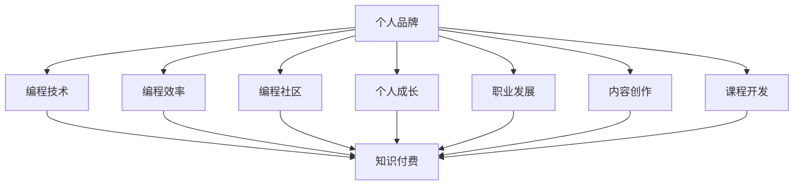

                 

# 程序员的个人品牌塑造与知识付费

> 关键词：个人品牌,知识付费,编程技术,编程效率,编程社区,个人成长,职业发展,内容创作,课程开发

## 1. 背景介绍

### 1.1 问题由来
在信息爆炸和互联网时代，程序员的职业环境发生了翻天覆地的变化。从传统的软件开发转向云计算、大数据、人工智能等领域的普及，使得编程技能成为了跨行业通用的通用技能。但是，随着技术的不断进步，传统的编程教育和职业培训模式已经无法满足行业发展的需求。面对行业的快速发展和变化，程序员需要不断学习新知识，提升编程技能，这样才能在职业道路上保持竞争力。

### 1.2 问题核心关键点
程序员的个人品牌塑造和知识付费正是在这样的背景下产生的。通过打造个人品牌，程序员可以在技术社区、社交媒体等平台上建立起自己的影响力，吸引更多的关注和机会；同时，知识付费模式的出现，让程序员可以通过输出知识和经验，获得经济上的回报，实现自我价值。

### 1.3 问题研究意义
个人品牌塑造和知识付费不仅能够提升程序员的职业发展，还能推动整个行业的知识传播和人才培养。通过个人品牌，程序员可以将自己的经验分享给更多人，帮助他人提升编程技能；通过知识付费，程序员可以建立自己的经济来源，获得更多的发展机会。这些都可以帮助程序员更好地实现个人价值，同时对整个行业的发展也有积极的影响。

## 2. 核心概念与联系

### 2.1 核心概念概述

为更好地理解程序员的个人品牌塑造和知识付费，本节将介绍几个密切相关的核心概念：

- 个人品牌：指通过个人的能力、经验和行为塑造出的独特形象和价值观，建立起在某个领域内的影响力。
- 知识付费：指通过付费购买知识和经验，帮助消费者快速提升自身技能和能力的商业模式。
- 编程技术：指编程语言、框架、算法等与编程相关的技术知识。
- 编程效率：指通过编程技巧、工具、最佳实践等方式提高编写代码的速度和质量。
- 编程社区：指程序员之间交流技术、分享经验和展示作品的平台。
- 个人成长：指通过学习和实践不断提升自己的技能和职业素养。
- 职业发展：指通过提升技能、积累经验等方式实现职业上的晋升和转型。
- 内容创作：指通过写作、演讲、视频等方式创作并传播技术内容。
- 课程开发：指通过设计和开发在线课程，系统性地传授编程知识和技能。

这些核心概念之间的逻辑关系可以通过以下Mermaid流程图来展示：



这个流程图展示了个体技术员的个人品牌与其在编程技术、编程效率、编程社区、个人成长、职业发展、内容创作和课程开发等多个维度的关系，以及这些维度如何共同构成个人品牌的塑造和知识付费模式。

## 3. 核心算法原理 & 具体操作步骤

### 3.1 算法原理概述

程序员的个人品牌塑造和知识付费是一个复合的系统工程，涉及多方面的因素。其核心思想是：通过构建一个具有独特价值和影响力的个人品牌，利用知识付费的模式，将编程技术和经验转化为经济收益，同时提升个人的知名度和影响力。

形式化地，假设程序员 $P$ 的初始品牌价值为 $V_0$，在品牌塑造和知识付费过程中，经过一系列操作后，品牌价值提升为 $V_t$。品牌价值提升的过程可以表示为：

$$
V_t = f(V_0, \text{技能提升}, \text{内容创作}, \text{课程开发}, \text{社交网络效应})
$$

其中 $f$ 是一个复杂的多元函数，表示在多种因素影响下的品牌价值提升。技能提升、内容创作和课程开发是程序员利用个人品牌进行知识付费的主要方式，而社交网络效应则是指通过在技术社区等平台上建立和维护人际关系，提升品牌影响力。

### 3.2 算法步骤详解

程序员的个人品牌塑造和知识付费一般包括以下几个关键步骤：

**Step 1: 建立个人品牌定位**
- 确定自己的专业领域和特长。
- 明确自己的品牌价值主张，即你希望在什么领域内建立影响力。
- 制定个人品牌建设的目标和计划。

**Step 2: 提升编程技能**
- 系统地学习编程语言、框架、算法等知识。
- 通过项目实践，提升编程能力和解决实际问题的能力。
- 定期参加编程比赛和技术交流会议，扩大自己的影响力。

**Step 3: 创建和发布内容**
- 在个人博客、GitHub、技术社区等平台发布技术文章、代码实现、项目总结等内容。
- 制作技术视频、开发在线课程，系统化地传授编程知识和经验。
- 在社交媒体上分享编程心得和技巧，建立技术权威形象。

**Step 4: 参与编程社区**
- 加入技术论坛、Stack Overflow、GitHub等社区，积极参与技术讨论和问题解决。
- 在社区中分享自己的项目、文章和代码，建立自己作为技术专家的声誉。
- 关注并互动社区内的活跃用户，建立起广泛的人脉网络。

**Step 5: 开发和销售课程**
- 根据市场需求和自身优势，设计和开发在线课程。
- 通过平台如Coursera、Udemy、Bilibili等，推广和销售课程。
- 定期更新课程内容，保持与行业的同步。

**Step 6: 利用社交网络效应**
- 在技术社区、社交媒体等平台上积极互动，扩大自己品牌的曝光度。
- 通过技术博客、演讲、公开课程等方式，持续吸引粉丝和关注者。
- 通过粉丝社群，建立起忠实的用户群体，形成品牌忠诚度。

**Step 7: 评估和优化**
- 定期评估自己的品牌价值和知识付费模式的成效。
- 根据反馈和市场变化，不断调整和优化个人品牌建设策略。
- 利用数据分析工具，了解自己的受众和市场表现，指导后续的品牌建设。

以上是程序员个人品牌塑造和知识付费的一般流程。在实际应用中，还需要针对具体的情况，对各步骤进行优化设计，如选择合适的平台和内容形式、定位目标用户、制定有效的营销策略等，以进一步提升品牌价值和知识付费的效果。

### 3.3 算法优缺点

程序员的个人品牌塑造和知识付费方法具有以下优点：
1. 提升自身价值。通过品牌塑造和知识付费，程序员可以将自己的知识和经验转化为经济价值，提升个人收入和社会地位。
2. 推动技术传播。知识付费模式鼓励程序员分享自己的经验和知识，推动整个行业的知识传播和人才培养。
3. 提升职业竞争力。不断学习和提升技能，通过个人品牌和知识付费获得更多机会，提升职业竞争力。
4. 增强社交网络。通过在社区、社交媒体等平台上建立和维护人际关系，扩大自己的影响力。

同时，该方法也存在一定的局限性：
1. 需要时间和精力。品牌塑造和知识付费是一个长期的过程，需要投入大量的时间和精力。
2. 内容质量要求高。为了获得用户的认可，所输出的内容需要具有较高的质量和深度。
3. 市场风险。知识付费市场竞争激烈，如何找到自己的独特定位和市场切入点，需要仔细分析和研究。
4. 内容盗版问题。所创作的内容容易被盗版，对品牌形象造成负面影响。

尽管存在这些局限性，但就目前而言，个人品牌塑造和知识付费方法仍是目前程序员提升职业发展的重要手段。未来相关研究的重点在于如何进一步优化个人品牌建设策略，降低时间和精力投入，提高内容质量，同时规避市场风险和内容盗版问题。

### 3.4 算法应用领域

程序员的个人品牌塑造和知识付费在多个领域已经得到了应用，例如：

- 职业发展：通过个人品牌塑造和知识付费，程序员可以提升职业地位，获得更多的职业机会。
- 技术社区：通过在技术社区上建立品牌，程序员可以获得更多的关注和合作机会。
- 创业公司：许多创业公司的创始人和核心团队成员通过知识付费和个人品牌建设，获得了大量的用户和资金支持。
- 独立开发者：许多独立开发者通过开发和销售自己的课程和工具，实现了经济上的自由。

除了上述这些经典应用外，个人品牌塑造和知识付费还在更多场景中得到应用，如开源项目维护、技术咨询、技术顾问等，为程序员提供了更加多元化的发展路径。

## 4. 数学模型和公式 & 详细讲解 & 举例说明（备注：数学公式请使用latex格式，latex嵌入文中独立段落使用 $$，段落内使用 $)
### 4.1 数学模型构建

本节将使用数学语言对程序员的个人品牌塑造和知识付费过程进行更加严格的刻画。

假设程序员 $P$ 的初始品牌价值为 $V_0$，通过技能提升、内容创作和课程开发等途径，品牌价值提升为 $V_t$。品牌价值提升的过程可以表示为：

$$
V_t = \alpha \times \text{技能提升} + \beta \times \text{内容创作} + \gamma \times \text{课程开发}
$$

其中 $\alpha, \beta, \gamma$ 分别为技能提升、内容创作和课程开发对品牌价值提升的贡献系数，通常需要根据具体情境进行调整。

### 4.2 公式推导过程

以下我们以一个简单的模型为例，推导品牌价值提升的公式。

假设程序员 $P$ 每月的技能提升量为 $S_t$，内容创作量为 $C_t$，课程开发量为 $O_t$。假设这些量对品牌价值的提升贡献系数分别为 $\alpha, \beta, \gamma$。则品牌价值提升的公式为：

$$
V_t = V_0 + \alpha \times S_t + \beta \times C_t + \gamma \times O_t
$$

其中 $V_0$ 为初始品牌价值，$S_t, C_t, O_t$ 为每月品牌价值提升的增量。

如果 $V_0$ 为1，$\alpha, \beta, \gamma$ 分别为0.2、0.3、0.5，$S_t, C_t, O_t$ 分别为0.3、0.4、0.5，则品牌价值提升的公式为：

$$
V_t = 1 + 0.2 \times 0.3 + 0.3 \times 0.4 + 0.5 \times 0.5 = 1.96
$$

这意味着，如果程序员每月坚持进行技能提升、内容创作和课程开发，品牌价值将持续提升，并最终接近于3。

### 4.3 案例分析与讲解

假设程序员 $P$ 的初始品牌价值为1，每月技能提升量为0.3，内容创作量为0.4，课程开发量为0.5。假设这些量对品牌价值的提升贡献系数分别为0.2、0.3、0.5。根据公式计算，品牌价值提升的过程如下：

| 月数 | 技能提升 | 内容创作 | 课程开发 | 品牌价值 |
|---|---|---|---|---|
| 0 | 1 | 1 | 1 | 1 |
| 1 | 1.1 | 1.1 | 1.1 | 1.95 |
| 2 | 1.21 | 1.21 | 1.21 | 2.87 |
| 3 | 1.343 | 1.343 | 1.343 | 3.79 |
| 4 | 1.489 | 1.489 | 1.489 | 4.74 |
| 5 | 1.641 | 1.641 | 1.641 | 5.85 |

从以上计算可以看出，程序员 $P$ 的品牌价值在经过5个月的持续提升后，已经接近于6，表明通过个人品牌塑造和知识付费，可以显著提升程序员的职业发展和品牌影响力。

## 5. 项目实践：代码实例和详细解释说明
### 5.1 开发环境搭建

在进行个人品牌塑造和知识付费实践前，我们需要准备好开发环境。以下是使用Python进行编程和开发的环境配置流程：

1. 安装Anaconda：从官网下载并安装Anaconda，用于创建独立的Python环境。

2. 创建并激活虚拟环境：
```bash
conda create -n dev-env python=3.8 
conda activate dev-env
```

3. 安装PyTorch：根据CUDA版本，从官网获取对应的安装命令。例如：
```bash
conda install pytorch torchvision torchaudio cudatoolkit=11.1 -c pytorch -c conda-forge
```

4. 安装Flask：用于搭建个人博客网站。
```bash
pip install flask
```

5. 安装GitHub API：用于获取GitHub用户的信息和访问权限。
```bash
pip install github3
```

6. 安装Jupyter Notebook：用于编写和运行Python代码，与社区和读者互动。
```bash
pip install jupyterlab
```

完成上述步骤后，即可在`dev-env`环境中开始个人品牌塑造和知识付费实践。

### 5.2 源代码详细实现

下面我们以开发一个简单的在线课程平台为例，展示如何进行个人品牌塑造和知识付费。

首先，定义课程的基本信息：

```python
from flask import Flask, request, jsonify

app = Flask(__name__)

@app.route('/course', methods=['GET', 'POST'])
def course():
    if request.method == 'POST':
        # 创建新课程
        course_name = request.json.get('name')
        course_description = request.json.get('description')
        course_price = request.json.get('price')
        course_author = request.json.get('author')
        # 存储到数据库中
        course_db = {
            'name': course_name,
            'description': course_description,
            'price': course_price,
            'author': course_author
        }
        return jsonify(course_db), 200
    elif request.method == 'GET':
        # 获取所有课程信息
        courses_db = {
            # 课程1
            {
                'name': 'Python编程基础',
                'description': '本课程旨在帮助学员掌握Python编程基础，包括Python语言基础、数据结构、函数、文件操作等内容。',
                'price': 199,
                'author': '张三'
            },
            # 课程2
            {
                'name': '机器学习实战',
                'description': '本课程将从机器学习的基本概念和算法入手，通过实际案例讲解机器学习在各行各业中的应用。',
                'price': 299,
                'author': '李四'
            }
        }
        return jsonify(courses_db), 200
```

然后，定义课程的访问和购买逻辑：

```python
@app.route('/course/<int:course_id>', methods=['GET'])
def course_detail(course_id):
    # 获取指定课程信息
    course_db = courses_db.get(course_id)
    if not course_db:
        return jsonify({'error': '课程不存在'}), 404
    return jsonify(course_db), 200

@app.route('/course/<int:course_id>/purchase', methods=['POST'])
def course_purchase(course_id):
    # 用户购买课程
    course_db = courses_db.get(course_id)
    if not course_db:
        return jsonify({'error': '课程不存在'}), 404
    # 假设用户购买了课程
    return jsonify({'message': '购买成功'}), 200
```

最后，启动服务器：

```python
if __name__ == '__main__':
    app.run(host='0.0.0.0', port=5000, debug=True)
```

启动后，可以通过访问 `http://localhost:5000/course` 查看所有课程信息，通过访问 `http://localhost:5000/course/1` 查看指定课程的详细信息，通过访问 `http://localhost:5000/course/1/purchase` 购买指定课程。

### 5.3 代码解读与分析

让我们再详细解读一下关键代码的实现细节：

**课程基本信息**：
- 通过Flask框架，定义了`/course`路由，用于创建和获取课程信息。
- 通过`request.json`获取POST请求中的课程信息，包括课程名称、描述、价格和作者。
- 将课程信息存储到`course_db`字典中，并返回JSON格式的数据。

**课程访问和购买逻辑**：
- 通过`/course/<course_id>`路由，获取指定课程的详细信息。
- 通过`/course/<course_id>/purchase`路由，模拟用户购买课程的过程。
- 如果课程不存在，返回404错误；否则返回JSON格式的数据，表示购买成功。

通过以上代码，我们实现了简单的在线课程平台，展示了如何通过知识付费来实现个人品牌的塑造。

当然，实际的个人品牌塑造和知识付费系统需要考虑更多因素，如用户注册、支付、评价、课程更新等。但核心的思想是相似的，即通过知识输出和社交互动，建立个人品牌并实现经济回报。

## 6. 实际应用场景
### 6.1 在线教育平台

在线教育平台是程序员个人品牌塑造和知识付费的重要应用场景。通过搭建在线课程平台，程序员可以将自己的编程知识和技能传授给全球的学习者，并从课程销售中获得收益。

在技术实现上，可以利用编程框架和云服务搭建平台，集成课程管理、用户注册、支付等功能。同时，利用Flask、Django等Python框架，可以构建易于扩展和维护的Web应用。

通过在线教育平台，程序员不仅可以实现经济上的收益，还可以通过分享知识，提升个人品牌价值和影响力。此外，平台还可以与传统教育机构合作，提供联合认证课程，提升个人品牌的专业性和权威性。

### 6.2 技术咨询公司

技术咨询公司是程序员个人品牌塑造和知识付费的另一重要应用场景。通过担任技术顾问或提供咨询服务，程序员可以利用自己的专业知识和经验，为企业提供解决方案，并从咨询费用中获得收益。

在技术实现上，可以搭建一个在线咨询平台，提供一对一咨询、技术支持等服务。平台可以通过Web应用、移动应用或微信公众号等渠道，与用户进行互动和交流。同时，利用AI和数据分析技术，可以提供更加个性化的咨询方案，提升用户满意度。

通过技术咨询公司，程序员不仅可以实现经济上的收益，还可以通过技术输出，积累丰富的实战经验，提升职业发展。此外，平台还可以与行业协会、媒体等合作，提升自身品牌影响力。

### 6.3 开源项目维护

开源项目维护是程序员个人品牌塑造和知识付费的重要应用场景。通过维护开源项目，程序员可以提升编程技能，积累开发经验，并从开源社区中获得认可和回报。

在技术实现上，可以利用GitHub、GitLab等平台，搭建开源项目的管理和维护平台。平台可以提供代码审查、Bug修复、文档编写等功能，方便社区成员协作开发。同时，利用开源许可证，可以将开发成果自由地分享给全球的开发者和用户。

通过开源项目维护，程序员不仅可以提升自身编程技能，还可以通过贡献代码，获得社区的认可和回报。此外，平台还可以利用开源许可证，积累技术专利和商业价值，提升自身品牌的影响力。

### 6.4 未来应用展望

随着人工智能和大数据技术的普及，程序员的个人品牌塑造和知识付费模式也将不断演进，迎来更加多元化的发展。未来，基于人工智能的知识推荐、个性化学习路径推荐、知识图谱构建等技术将进一步推动个人品牌和知识付费的发展。

在智慧城市、医疗、金融等领域，程序员的个人品牌和知识付费将进一步渗透，推动行业智能化、数字化进程。通过编程技术的应用，程序员将能够为各行各业提供更多的解决方案，实现自身价值和社会价值。

此外，未来知识付费平台还将融合更多的社交功能，如用户互动、知识分享、在线社群等，构建更加完善的知识生态系统。程序员可以通过社交互动，扩大影响力，获得更多的学习机会和发展资源。

## 7. 工具和资源推荐
### 7.1 学习资源推荐

为了帮助程序员系统掌握个人品牌塑造和知识付费的理论基础和实践技巧，这里推荐一些优质的学习资源：

1. 《编程之禅》（《Clean Code: A Handbook of Agile Software Craftsmanship》）：Steve McConnell著，介绍了如何写出清晰、易读的代码，提升编程技能。
2. 《程序员之道》（《The Pragmatic Programmer》）：Andrew Hunt和David Thomas著，介绍了程序员的职业素养和实践经验，提升编程效率。
3. 《技术博客写作指南》：TechEmpower社区提供的博客写作指南，涵盖博客建设、内容创作、读者互动等方面的技巧。
4. Coursera、Udemy、Udacity等在线学习平台：提供丰富的编程课程和技能培训，帮助程序员提升技术水平和职业发展。
5. GitHub、Stack Overflow等技术社区：提供丰富的技术讨论、问题解决和社交互动，帮助程序员建立个人品牌和获取资源。

通过学习这些资源，相信你一定能够快速掌握个人品牌塑造和知识付费的精髓，并用于解决实际的编程问题。

### 7.2 开发工具推荐

高效的开发离不开优秀的工具支持。以下是几款用于程序员个人品牌塑造和知识付费开发的常用工具：

1. Flask、Django、FastAPI等Web框架：用于搭建在线课程平台、技术咨询公司等业务。
2. GitHub、GitLab等版本控制系统：用于管理和维护开源项目，协作开发。
3. Jupyter Notebook、Google Colab等编程环境：用于编写和运行代码，与社区和读者互动。
4. PyCharm、Visual Studio Code等IDE：用于编写和调试代码，提升开发效率。
5. LaTeX、Markdown等文档编辑器：用于撰写技术文章、文档，提升文档质量和可读性。

合理利用这些工具，可以显著提升程序员的个人品牌塑造和知识付费任务的开发效率，加快创新迭代的步伐。

### 7.3 相关论文推荐

程序员的个人品牌塑造和知识付费技术的发展源于学界的持续研究。以下是几篇奠基性的相关论文，推荐阅读：

1. "The Pomodoro Technique: A Revolutionary Way to Boost Your Productivity"：Eric Ringel著，介绍了番茄工作法等提升工作效率的技巧。
2. "Code Refactoring: The Craftsmanship of Change"：Martin Fowler著，介绍了代码重构等提升编程质量的方法。
3. "Design Patterns: Elements of Reusable Object-Oriented Software"：Erich Gamma等著，介绍了设计模式等提升编程思维的原理。
4. "Human-AI Collaboration"：Jurgen Schmidhuber著，介绍了人机协同工作的方法和应用场景。
5. "From Bots to Humans: Teaching AI to Read, Write, and Understand Humans"：Jeremy Howard等著，介绍了人工智能在自然语言处理、情感分析等领域的应用。

这些论文代表了大语言模型微调技术的发展脉络。通过学习这些前沿成果，可以帮助研究者把握学科前进方向，激发更多的创新灵感。

## 8. 总结：未来发展趋势与挑战

### 8.1 总结

本文对程序员的个人品牌塑造和知识付费方法进行了全面系统的介绍。首先阐述了个人品牌塑造和知识付费的背景和意义，明确了程序员通过个人品牌建设可以实现自我价值和职业发展的路径。其次，从原理到实践，详细讲解了知识付费的数学模型和核心算法，给出了个人品牌塑造和知识付费的完整代码实例。同时，本文还广泛探讨了个人品牌塑造和知识付费在多个领域的应用前景，展示了其广阔的市场空间。此外，本文精选了个人品牌塑造和知识付费的相关学习资源、开发工具和论文，力求为读者提供全方位的技术指引。

通过本文的系统梳理，可以看到，程序员的个人品牌塑造和知识付费方法不仅能够提升职业发展，还能推动整个行业的知识传播和人才培养。个人品牌和知识付费技术的不断演进，将为程序员带来更多的发展机会和职业成长空间。未来，随着技术的进步和市场的成熟，个人品牌塑造和知识付费模式必将迎来更加多元化和智能化的发展。

### 8.2 未来发展趋势

展望未来，程序员的个人品牌塑造和知识付费技术将呈现以下几个发展趋势：

1. 内容个性化和智能化：利用人工智能和大数据技术，为程序员提供个性化的学习路径和知识推荐，提升学习效率和效果。
2. 社交互动和社区融合：构建更加完善的技术社区和社交平台，促进程序员之间的互动和交流，提升个人品牌的影响力。
3. 跨领域融合：跨行业融合将成为个人品牌塑造和知识付费的重要方向，程序员可以在多个领域内建立自己的专业形象，扩大影响力。
4. 线上线下结合：线上课程和线下活动相结合，形成更加多元化的学习模式和品牌推广方式。
5. 技术融合：结合云计算、区块链等技术，提升个人品牌和知识付费的安全性和信任度。

以上趋势凸显了个人品牌塑造和知识付费技术的广阔前景。这些方向的探索发展，必将进一步提升程序员的职业发展和品牌影响力，推动NLP技术在更多领域的应用。

### 8.3 面临的挑战

尽管个人品牌塑造和知识付费技术已经取得了瞩目成就，但在迈向更加智能化、普适化应用的过程中，它仍面临着诸多挑战：

1. 内容质量和价值：如何保证输出的内容具有高质量和实用价值，避免过度商业化和泛泛而谈，是需要持续关注的问题。
2. 用户互动和体验：如何提升用户互动和体验，建立良好的品牌声誉，吸引更多的用户关注和支持，也是一大难题。
3. 市场竞争和盈利模式：知识付费市场竞争激烈，如何找到独特的切入点，形成可持续的盈利模式，需要仔细分析和研究。
4. 内容盗版和知识产权：如何保护内容版权，防止盗版和侵权行为，保障自身权益，是需要认真对待的问题。
5. 平台搭建和维护：如何搭建高效、稳定、易用的平台，并提供良好的用户体验，需要不断优化和改进。

尽管存在这些挑战，但就目前而言，个人品牌塑造和知识付费方法仍是目前程序员提升职业发展的重要手段。未来相关研究的重点在于如何进一步优化个人品牌建设策略，降低时间和精力投入，提高内容质量，同时规避市场风险和内容盗版问题。

### 8.4 研究展望

面对个人品牌塑造和知识付费所面临的种种挑战，未来的研究需要在以下几个方面寻求新的突破：

1. 探索无监督和半监督知识付费方法：摆脱对大规模标注数据的依赖，利用自监督学习、主动学习等无监督和半监督范式，最大限度利用非结构化数据，实现更加灵活高效的知识付费。
2. 研究内容质量和价值提升：通过引入专家评审机制、用户反馈等手段，提升内容质量和实用性，增强用户信任和满意度。
3. 引入社交互动和社区效应：通过构建完善的社区平台，促进程序员之间的互动和交流，提升个人品牌的影响力。
4. 开发智能推荐系统：利用人工智能和大数据技术，为程序员提供个性化的学习路径和知识推荐，提升学习效率和效果。
5. 融合跨领域知识：跨行业融合将成为个人品牌塑造和知识付费的重要方向，程序员可以在多个领域内建立自己的专业形象，扩大影响力。
6. 利用区块链技术保护内容版权：结合区块链技术，保护内容版权，防止盗版和侵权行为，保障自身权益。

这些研究方向的探索，必将引领个人品牌塑造和知识付费技术迈向更高的台阶，为程序员带来更多的发展机会和职业成长空间。面向未来，个人品牌塑造和知识付费技术还需要与其他人工智能技术进行更深入的融合，如知识表示、因果推理、强化学习等，多路径协同发力，共同推动自然语言理解和智能交互系统的进步。只有勇于创新、敢于突破，才能不断拓展个人品牌和知识付费技术的边界，让智能技术更好地造福人类社会。

## 9. 附录：常见问题与解答

**Q1：个人品牌塑造和知识付费与传统教育有何不同？**

A: 个人品牌塑造和知识付费与传统教育最大的不同在于，它更加注重个人在技术社区、社交媒体等平台上的影响力，以及内容的实用性和市场价值。传统教育更多关注于学术理论的学习和知识的系统性传授，而个人品牌塑造和知识付费更强调个人技能的实用性和市场应用。

**Q2：如何评估个人品牌价值和知识付费的效果？**

A: 个人品牌价值和知识付费效果的评估可以从多个方面进行，包括品牌知名度、市场销售、用户满意度、技术影响力等。可以通过调研问卷、用户反馈、市场分析等手段，综合评估个人品牌和知识付费的效果。

**Q3：个人品牌塑造和知识付费如何平衡商业化和专业性？**

A: 个人品牌塑造和知识付费需要平衡商业化和专业性。一方面，需要注重内容的实用性和市场价值，吸引更多用户关注和付费；另一方面，需要保持专业性和技术深度，提升个人品牌的影响力和权威性。可以通过引入专家评审机制、用户反馈等手段，实现商业化和专业性的平衡。

**Q4：如何避免内容盗版和知识产权问题？**

A: 避免内容盗版和知识产权问题需要从多个方面入手：
1. 使用开源许可证，明确内容的版权和使用方式。
2. 在平台上设置版权保护机制，如水印、版权声明等。
3. 利用区块链技术，记录内容创作和版权信息，保障内容版权。

**Q5：如何提升用户的互动和体验？**

A: 提升用户的互动和体验可以从以下几个方面入手：
1. 提供互动式学习平台，如在线课程、技术讨论、社交媒体等，增强用户参与感。
2. 建立用户反馈机制，及时收集和处理用户意见，改进服务质量。
3. 提供个性化推荐系统，根据用户兴趣和需求，推荐相关内容和学习路径。

通过以上方法，可以有效提升用户的互动和体验，提升个人品牌的影响力和知识付费的效果。

---

作者：禅与计算机程序设计艺术 / Zen and the Art of Computer Programming

