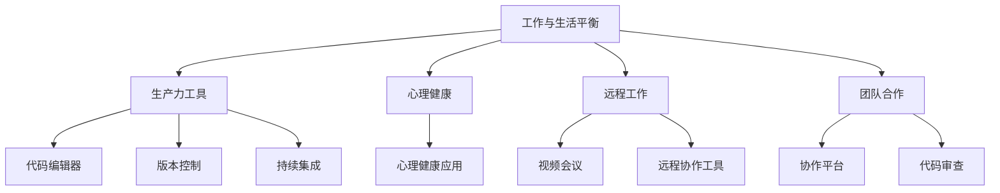

                 

# 程序员的工作与生活平衡：实现之道

## 1. 背景介绍

在当前快速发展的技术环境中，程序员的工作越来越繁忙，如何在繁忙的日常工作中保持平衡，既满足职业发展的需求，又确保个人生活的质量，成为了许多程序员面临的挑战。本文将探讨如何通过技术手段和管理策略，实现程序员工作与生活的平衡，提升职业满意度和生活质量。

## 2. 核心概念与联系

### 2.1 核心概念概述

为了更好地理解如何实现程序员的工作与生活平衡，本文将介绍几个关键的概念：

- **工作与生活平衡**：在满足职业需求的同时，确保有足够的时间和精力用于个人生活、家庭和娱乐。
- **生产力工具**：提高工作效率和质量的软件和工具，如编程编辑器、版本控制、持续集成工具等。
- **心理健康**：关注和维护程序员的心理健康，预防和缓解压力、焦虑等负面情绪。
- **远程工作**：通过互联网技术实现远程协作，提高工作灵活性。
- **团队合作**：建立高效协作的团队文化，促进沟通和共享，提升整体工作效率。

这些概念之间的联系可以通过以下Mermaid流程图来展示：



这个流程图展示了实现程序员工作与生活平衡所需的关键工具和策略。通过合理使用这些工具和策略，程序员可以更有效地管理时间、提升工作效率，并保障心理健康和团队协作。

## 3. 核心算法原理 & 具体操作步骤

### 3.1 算法原理概述

实现程序员工作与生活平衡的核心算法原理是时间管理和优化资源配置。具体来说，通过合理分配工作和个人生活的时间，使用高效的生产力工具，以及建立良好的心理健康和团队合作机制，来提升整体的工作效率和满意度。

### 3.2 算法步骤详解

#### 3.2.1 制定时间管理计划

1. **设定优先级**：根据任务的紧急程度和重要性，制定每日、每周、每月的时间计划。使用Eisenhower矩阵或GTD（Getting Things Done）方法帮助优先处理重要任务。

2. **设定时间段**：将工作时间分为集中工作时间段和灵活工作时间段，确保有足够的时间处理重要任务，同时也留有灵活的时间应对突发事件或进行个人活动。

3. **使用时间跟踪工具**：如RescueTime、Toggl等，自动记录和分析时间使用情况，帮助优化时间分配。

#### 3.2.2 使用生产力工具

1. **代码编辑器**：如Visual Studio Code、Sublime Text等，使用代码补全、语法高亮等功能提升编程效率。

2. **版本控制**：如Git，通过分支管理和代码版本控制，提高团队协作效率。

3. **持续集成**：如Jenkins、Travis CI，自动化构建和测试，减少人工干预，提升开发速度。

#### 3.2.3 保障心理健康

1. **心理健康应用**：如Headspace、Calm等，提供冥想、放松和压力管理等功能。

2. **定期休息**：使用番茄工作法、Pomodoro等技术，每工作25-30分钟后休息5分钟，恢复注意力。

3. **健康饮食和运动**：确保均衡饮食和规律运动，提升整体健康水平。

#### 3.2.4 远程工作优化

1. **视频会议工具**：如Zoom、Microsoft Teams等，确保远程协作的沟通和协调。

2. **远程协作工具**：如Slack、Microsoft Teams等，方便团队成员的即时通讯和文件共享。

3. **时间同步**：使用Trello、Asana等协作平台，确保团队成员的工作进度同步。

### 3.3 算法优缺点

#### 3.3.1 优点

1. **提升工作效率**：通过合理分配时间和使用高效工具，提升整体工作质量。
2. **保障心理健康**：通过心理健康应用和定期休息，预防和缓解工作压力和焦虑。
3. **提升团队协作**：通过远程工作和协作工具，提高团队沟通和协作效率。

#### 3.3.2 缺点

1. **需要时间和精力投入**：初期需要投入时间和精力学习和使用新的工具和策略。
2. **适应性问题**：不同团队和个人对工具的适应性不同，可能需要调整。
3. **依赖技术环境**：部分工具依赖特定的技术环境，可能存在兼容性问题。

### 3.4 算法应用领域

实现程序员工作与生活平衡的方法广泛应用于软件开发、系统运维、数据科学等多个IT领域，特别适合需要频繁协作和远程工作的团队。在实际应用中，可以根据具体的团队需求和工作特点，灵活调整策略和工具，以达到最佳效果。

## 4. 数学模型和公式 & 详细讲解 & 举例说明

### 4.1 数学模型构建

假设程序员每天可用的总时间为 $T$ 小时，其中工作时间为 $W$ 小时，个人生活时间为 $L$ 小时。根据优先级，设工作任务数为 $N$，个人活动数为 $M$。

### 4.2 公式推导过程

根据上述设定，我们可以建立如下数学模型：

$$
\begin{align*}
W + L &= T \\
\sum_{i=1}^N W_i + \sum_{i=1}^M L_i &= W + L \\
\end{align*}
$$

其中 $W_i$ 为第 $i$ 个任务的实际工作时间，$L_i$ 为第 $i$ 个活动的实际个人生活时间。

### 4.3 案例分析与讲解

假设程序员每天总时间 $T = 8$ 小时，需要完成 $N = 4$ 个重要任务和 $M = 2$ 个个人活动。任务和活动的优先级和耗时如下：

- 任务1：3小时
- 任务2：2小时
- 任务3：1小时
- 任务4：1小时
- 活动1：1小时
- 活动2：1小时

根据优先级设定，我们假设任务1和任务2是必须优先完成的，活动1和活动2可以灵活安排。

我们可以列出如下的时间分配方案：

- 任务1和任务2：共耗时 $3+2=5$ 小时
- 活动1和活动2：共耗时 $1+1=2$ 小时

此时，剩余时间为 $T-5-2=1$ 小时。根据Eisenhower矩阵，我们将剩余时间用于任务3和任务4的细化处理，提升整体工作效率。

通过合理的时间分配和优先级管理，我们可以优化工作和生活时间，提升整体的工作质量和满意度。

## 5. 项目实践：代码实例和详细解释说明

### 5.1 开发环境搭建

1. **安装开发环境**：
   - 安装Python 3.x版本。
   - 安装Git，用于版本控制。
   - 安装Jenkins，用于持续集成。

2. **安装代码编辑器**：
   - 安装Visual Studio Code，并安装相关插件，如Prettier、ESLint等，提升代码质量和风格一致性。

3. **配置开发环境**：
   - 配置Git账户，并设置默认的远程仓库。
   - 配置Jenkins，包括安装Jenkins插件、设置构建脚本等。

### 5.2 源代码详细实现

以下是一个简单的Git配置示例：

```bash
# 初始化Git仓库
git init

# 设置远程仓库
git remote add origin https://github.com/your-username/your-repo.git

# 推送到远程仓库
git push -u origin master
```

### 5.3 代码解读与分析

通过上述配置，我们成功搭建了Git开发环境，可以方便地进行版本控制和远程协作。Jenkins的配置和脚本编写，则需要根据具体的项目需求进行调整和优化。

## 6. 实际应用场景

### 6.1 软件开发团队

在软件开发团队中，合理分配工作时间和使用工具，可以有效提升开发效率和代码质量。通过Git进行版本控制，Jenkins进行持续集成，确保代码的稳定性和可维护性。同时，使用代码编辑器和心理健康应用，可以帮助团队成员提升工作效率和心理状态。

### 6.2 系统运维团队

系统运维团队需要频繁处理各种紧急和突发事件。通过合理分配时间，使用远程工作工具和协作平台，可以保障团队的高效协作和沟通。使用心理健康应用，帮助缓解工作压力，提升整体团队的工作满意度。

### 6.3 数据科学团队

数据科学团队涉及大量数据分析和模型训练任务。通过时间管理计划和优先级设定，可以合理分配时间和资源，提升模型训练和数据处理效率。使用生产力和远程工作工具，可以方便团队成员之间的协作和沟通。

### 6.4 未来应用展望

未来，随着技术的进步和团队协作的不断优化，实现程序员工作与生活平衡的方法将更加多样和高效。通过智能时间管理和自动化工具的应用，将进一步提升整体的工作效率和生活质量。

## 7. 工具和资源推荐

### 7.1 学习资源推荐

1. **时间管理**：
   - 《高效能人士的七个习惯》（Stephen R. Covey）：经典的时间管理指南，提供系统的时间管理策略。

2. **心理健康**：
   - 《正念减压》（Jon Kabat-Zinn）：介绍正念冥想和减压技巧，提升心理健康水平。

3. **远程工作**：
   - 《远程工作：如何建立高效的远程团队》（Ray Liotta）：提供远程团队管理的最佳实践。

### 7.2 开发工具推荐

1. **代码编辑器**：
   - Visual Studio Code：功能强大、可扩展性强的代码编辑器。

2. **版本控制**：
   - Git：主流的版本控制系统，支持分布式协作。

3. **持续集成**：
   - Jenkins：开源的持续集成工具，支持多种构建和部署方式。

4. **远程协作**：
   - Slack：即时通讯工具，支持多种平台。
   - Microsoft Teams：集成了聊天、视频会议、协作平台等功能。

5. **心理健康应用**：
   - Headspace：提供冥想和放松练习，提升心理健康。
   - Calm：提供放松和压力管理功能。

### 7.3 相关论文推荐

1. **时间管理**：
   - Geller, E. L., & March, J. G. (1965). Time management: The Anatomy of Productivity. Life Magazine.

2. **远程工作**：
   - Bell, B. (2020). Working from Home. The Economist.

3. **心理健康**：
   - Hallion, J. L., & LaTorre, J. A. (2018). Management of the Psychological Impact of COVID-19 and Pandemic Concerns Among Caregivers. Health Psychol Open.

## 8. 总结：未来发展趋势与挑战

### 8.1 研究成果总结

本文从时间管理、生产力工具、心理健康和远程工作等多个方面，探讨了如何实现程序员工作与生活平衡。通过合理分配时间、使用高效工具和建立良好的团队协作机制，可以有效提升整体的工作效率和满意度。

### 8.2 未来发展趋势

未来，随着技术的进步和人工智能的广泛应用，实现程序员工作与生活平衡的方法将更加智能化和自动化。例如，智能时间管理工具可以根据用户的工作习惯和效率，自动优化时间分配。自动化测试和持续集成工具将进一步提升代码质量和开发速度。

### 8.3 面临的挑战

1. **适应性问题**：不同团队和个人对工具的适应性不同，可能需要调整。
2. **时间管理**：需要持续投入时间和精力进行优化和调整。
3. **心理健康**：需要建立长期的心理健康维护机制，确保团队成员的心理健康。

### 8.4 研究展望

未来研究将进一步探索如何通过智能化和自动化的手段，提升程序员的工作效率和生活质量。例如，开发智能时间管理工具，自动化生产力和协作工具，以及建立全面的心理健康管理机制，将为实现工作与生活平衡提供更多解决方案。

## 9. 附录：常见问题与解答

**Q1: 如何制定合理的时间管理计划？**

A: 制定时间管理计划的关键是设定优先级和合理分配时间。可以使用Eisenhower矩阵或GTD方法，根据任务的紧急程度和重要性，制定每日、每周、每月的时间计划。

**Q2: 哪些工具可以帮助提升开发效率？**

A: 可以使用代码编辑器如Visual Studio Code、版本控制如Git、持续集成如Jenkins、协作工具如Slack和Microsoft Teams等，提升开发效率和团队协作。

**Q3: 如何缓解工作压力和焦虑？**

A: 可以使用心理健康应用如Headspace和Calm，提供冥想、放松和压力管理等功能。定期进行休息，使用番茄工作法或Pomodoro技术，每工作25-30分钟后休息5分钟，恢复注意力。

**Q4: 如何提升团队协作效率？**

A: 可以使用视频会议工具如Zoom或Microsoft Teams，远程协作工具如Slack和Microsoft Teams，协作平台如Trello或Asana，确保团队成员的即时通讯和文件共享，提升整体团队的工作效率。

---

作者：禅与计算机程序设计艺术 / Zen and the Art of Computer Programming

